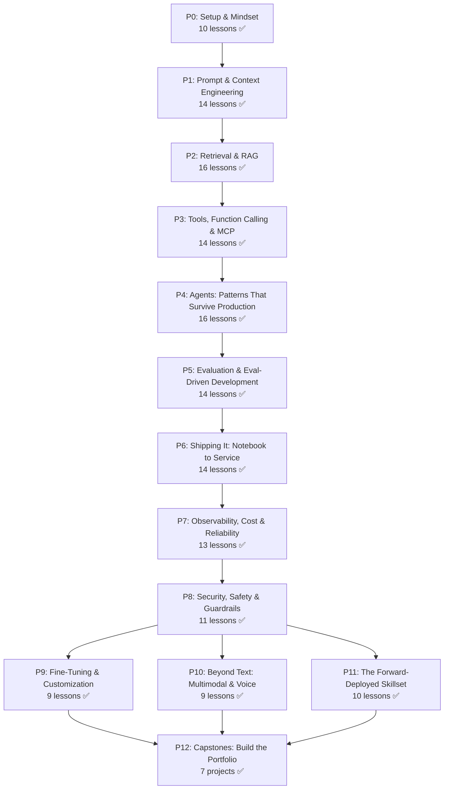

# Applied AI From Scratch

    

---

Enterprise AI pilots fail 95% of the time. Not because the models are weak. Because the deployment is broken.

Applied AI Engineer and Forward-Deployed Engineer job postings grew 74% year-over-year. The gap is not knowing how attention works. It is knowing how to scope, build, evaluate, ship, observe, and hand off a system that works in a real environment.

That is this curriculum.

---

## How this curriculum works

Every lesson follows a 7-beat loop:

```
MOTTO -> PROBLEM -> CONCEPT -> BUILD IT -> USE IT -> SHIP IT -> EVALUATE IT
```

"Build It" means write the production system raw: no framework, just code. "Use It" means swap in the library. You trust the framework because you built the smaller version first.

"Evaluate It" is the beat that most courses skip. Every lesson answers: how do you know this actually works in production? Not vibes. Not happy-path smoke tests. Measurable, production-grade checks.

Each lesson folder:

```
phases/NN-phase-name/NN-lesson-name/
├── code/main.py
├── docs/en.md
├── outputs/        <- the reusable artifact
└── checks.json
```

Every lesson ships exactly one reusable artifact: a prompt, skill, agent, MCP server, eval harness, service template, or runbook. By the end, you have a portfolio of 157 working pieces.

---

## The curriculum

13 phases. 157 lessons. ~200 hours. All phases complete.



| # | Phase | Lessons | Status |
|---|-------|---------|--------|
| 00 | Setup & the Applied AI Mindset | 10 | **Complete** |
| 01 | Prompt & Context Engineering | 14 | **Complete** |
| 02 | Retrieval & RAG | 16 | **Complete** |
| 03 | Tools, Function Calling & MCP | 14 | **Complete** |
| 04 | Agents: Patterns That Survive Production | 16 | **Complete** |
| 05 | Evaluation & Eval-Driven Development | 14 | **Complete** |
| 06 | Shipping It: Notebook to Production Service | 14 | **Complete** |
| 07 | Observability, Cost & Reliability | 13 | **Complete** |
| 08 | Security, Safety & Guardrails | 11 | **Complete** |
| 09 | Fine-Tuning & Customization | 9 | **Complete** |
| 10 | Beyond Text: Multimodal & Voice | 9 | **Complete** |
| 11 | The Forward-Deployed Skillset | 10 | **Complete** |
| 12 | Capstones: Build the Portfolio | 7 | **Complete** |

---

## What you build

Every lesson ships one reusable artifact. 157 total across the curriculum.

| Artifact type | What it is | How to use it |
|---------------|-----------|---------------|
| Prompts | Expert-level prompt for a specific task | Paste into any AI assistant: Claude, ChatGPT, Gemini |
| Skills | Drop-in skill file | Add to Claude Code, Cursor, or any agent that reads skill files |
| Eval harnesses | Runnable eval suite | Hook into CI as a regression gate on every prompt change |
| Service templates | Deploy-ready FastAPI + Docker | Clone, configure, ship |
| Runbooks | Operational playbook for a deployed system | Hand off to the team operating the system |

Capstone projects in Phase 12 integrate the full stack: a production RAG assistant, customer support agent with human-in-the-loop, text-to-SQL analytics service, coding automation agent, and a complete FDE mock engagement from scoping to handoff.

---

## Where to start

Pick the phase that matches what you need right now. All phases are fully authored.

**New to applied AI** - Start at Phase 00 (Setup) and work forward. The phases are designed to build on each other.

**Know the basics, want production skills** - Jump to Phase 05 (Evaluation) or Phase 06 (Shipping). These are the phases most "AI tutorial" graduates are missing.

**Building for a customer or client** - Go directly to Phase 11 (The Forward-Deployed Skillset). It covers scoping, discovery, integration, and handoff - the part nobody else teaches.

**Want portfolio projects** - Phase 12 (Capstones) has 5 complete, deployable projects with runbooks.

---

## Running the lessons

Every `code/main.py` is standalone-runnable. Most include a demo mode that works without an API key.

```bash
git clone https://github.com/thepandanlabs/applied-ai-from-scratch
cd applied-ai-from-scratch

# Run any lesson in demo mode
python phases/02-retrieval-and-rag/05-naive-rag/code/main.py --demo

# Run with a real API key
export ANTHROPIC_API_KEY=sk-ant-...
python phases/04-agents/01-agent-loop/code/main.py
```

---

## Playbooks (Claude Code slash commands)

Three playbooks in `playbooks/` work as slash commands inside Claude Code or any agent that reads skill files:

- `/calibrate` - placement quiz: maps your background to a recommended starting phase
- `/gate <phase>` - self-assessment: confirms you are ready for the next phase
- `/frame-it` - FDE skill: turn a vague customer problem into a scoped AI spec

---

## Prerequisites

- Can write code. Python preferred, any language fine.
- Have access to an LLM API key (Anthropic recommended, OpenAI also works).
- Want to build and ship AI systems, not just understand them.

No math degree. No prior ML experience. No GPU required.

---

## License

MIT. Free to use, fork, adapt, and build on. See [LICENSE](./LICENSE).
