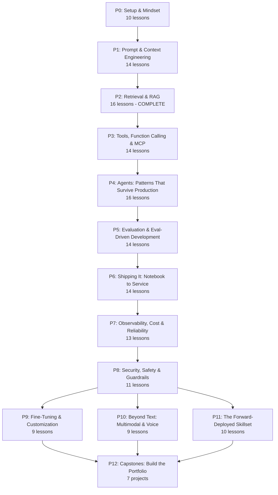

   

---

Enterprise AI pilots fail 95% of the time. Not because the models are weak. Because the deployment is broken.

Applied AI Engineer and Forward-Deployed Engineer job postings grew 74% year-over-year. The gap is not knowing how attention works. It is knowing how to scope, build, evaluate, ship, observe, and hand off a system that works in a real environment.

That is this curriculum.

---

## How this curriculum works

Every lesson follows a 7-beat loop:

```
MOTTO -> PROBLEM -> CONCEPT -> BUILD IT -> USE IT -> SHIP IT -> EVALUATE IT
```

"Build It" means write the production system raw: no framework, just code. "Use It" means swap in the library. You trust the framework because you built the smaller version first.

"Evaluate It" is the beat that most courses skip. Every lesson answers: how do you know this actually works in production? Not vibes. Not happy-path smoke tests. Measurable, production-grade checks.

Each lesson folder:

```
phases/NN-phase-name/NN-lesson-name/
├── code/main.py
├── docs/en.md
├── outputs/        <- the reusable artifact
└── checks.json
```

Every lesson ships exactly one reusable artifact: a prompt, skill, agent, MCP server, eval harness, service template, or runbook. By the end, you have a portfolio of ~165 working pieces.

---

## The curriculum

13 phases. ~165 lessons. ~200 hours. Phase 2 (RAG) is complete and live.



| # | Phase | Lessons | Status |
|---|-------|---------|--------|
| 00 | Setup & the Applied AI Mindset | 10 | Planned |
| 01 | Prompt & Context Engineering | 14 | Planned |
| 02 | Retrieval & RAG | 16 | **Complete** |
| 03 | Tools, Function Calling & MCP | 14 | Planned |
| 04 | Agents: Patterns That Survive Production | 16 | Planned |
| 05 | Evaluation & Eval-Driven Development | 14 | Planned |
| 06 | Shipping It: Notebook to Production Service | 14 | Planned |
| 07 | Observability, Cost & Reliability | 13 | Planned |
| 08 | Security, Safety & Guardrails | 11 | Planned |
| 09 | Fine-Tuning & Customization | 9 | Planned |
| 10 | Beyond Text: Multimodal & Voice | 9 | Planned |
| 11 | The Forward-Deployed Skillset | 10 | Planned |
| 12 | Capstones: Build the Portfolio | 7 | Planned |

---

## What you build

Every lesson ships one of four artifact types. Use them immediately or drop them into your stack.

| Artifact | What it is | How to use it |
|----------|-----------|---------------|
| Prompts | Expert-level prompt for a specific task | Paste into any AI assistant: Claude, ChatGPT, Gemini |
| Skills | Drop-in skill file | Add to Claude Code, Cursor, or any agent that reads skill files |
| Eval harnesses | Runnable eval suite | Hook into CI as a regression gate on every prompt change |
| Service templates | Deploy-ready FastAPI + Docker | Clone, configure, ship |

---

## Getting started

Three paths in. Pick the one that fits where you are.

**1. Read - browse the curriculum on GitHub**

Start with any phase. Phase 2 (RAG) is fully authored and a good entry point for engineers who have made a few API calls but never shipped a real retrieval system.

**2. Clone and run**

```bash
git clone https://github.com/your-org/appliedaifromscratch.com
python phases/02-retrieval-and-rag/05-naive-rag/code/main.py
```

Every `main.py` is standalone-runnable. You need Python, an API key, and nothing else to get started.

**3. Use the playbooks inside Claude Code (or any Claude-compatible agent)**

These skills are in `.claude/skills/` and work as slash commands:

- `/calibrate` - placement: maps your background and experience to a recommended starting phase
- `/gate <phase>` - self-assessment: tells you whether you are ready to move to the next phase
- `/frame-it` - FDE skill: turn a vague customer problem into a scoped AI spec

---

## Prerequisites

- Can write code. Python preferred, any language fine.
- Have access to an LLM API key (OpenAI or Anthropic).
- Want to build and ship AI systems, not just understand them.

No math degree. No prior ML experience. No GPU.

---

## License

MIT. Free to use, fork, adapt, and build on. See [LICENSE](./LICENSE).

This curriculum is free and open source. If it helps you land a role or ship a system, pay it forward.
