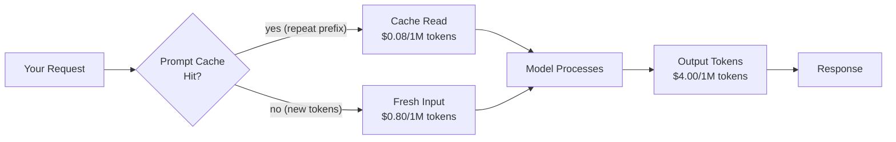

# قراءة وثائق النماذج: نوافذ السياق، التسعير، الحدود

> بطاقة النموذج هي ورقة المواصفات. اقرأها قبل أن تكتب سطرًا واحدًا من الكود.

**النوع:** تعلّم
**اللغات:** Python
**المتطلبات:** الدرس 02 (مفاتيح API ومشهد النماذج)، الدرس 03 (أول طلب API)
**الوقت:** ~30 دقيقة
**المرحلة:** 00 - الإعداد والعقلية

---

## أهداف التعلّم

- التعرّف على الحقول الخمسة في بطاقة النموذج التي تحدد جدوى الاستخدام في الإنتاج
- التمييز بين نافذة السياق (حد الإدخال) وأقصى عدد من tokens الإخراج (حد الإخراج)
- حساب أقصى حجم للمستند، والتكلفة لكل 1000 طلب، وعدد الأيام حتى إيقاف النموذج انطلاقًا من قاموس المواصفات
- شرح لماذا تكلّف tokens الإدخال المخزّنة في الـ cache أقل من tokens الإدخال الجديدة
- تسمية أبعاد حدود المعدّل الثلاثة (RPM، TPM، RPDAY) وأيّها يصطدم بك أولًا

---

## المشكلة

تختار نموذجًا، تكتب prompt، وتنشره في الإنتاج. بعد ثلاثة أسابيع يصلك تنبيه: الطلبات تفشل عند الساعة الثانية صباحًا برمز خطأ 429. تحقّق فتكتشف أن النموذج الذي اخترته لديه حدّ قدره 4 طلبات في الدقيقة على فئتك (tier). أو: خط معالجة المستندات لديك كان يعمل بشكل جيد على التقارير القصيرة، لكنه ينفجر مع ملف PDF الفصلي من 120 صفحة لأنك افترضت أن "نافذة سياق 200k" تعني أنه يمكنك إرسال مستند بحجم 200k token واسترجاع ملخّص بحجم 200k token. لا يمكنك ذلك.

كلا الإخفاقين نتجا عن السبب الجذري نفسه: اخترت نموذجًا دون قراءة الوثائق. بطاقة النموذج تجيب عن أربعة أسئلة تحدد ما إذا كان النموذج صالحًا لحالة استخدامك، وذلك قبل أن تكتب سطرًا واحدًا من الكود. المهندسون الذين يتخطّون هذه الخطوة يكتشفون القيود بالطريقة الصعبة، عند التوسّع، عند الساعة الثانية صباحًا.

---

## المفهوم

### بطاقة النموذج المشروحة

أي إدراج لنموذج على صفحة أي مزوّد يحتوي على خمسة أقسام مهمة للإنتاج. إليك ما يعنيه كل حقل ولماذا هو مهم.

```
+------------------------------------------------------------------+
| MODEL CARD: claude-3-5-haiku-20241022                            |
+------------------------------------------------------------------+
| CONTEXT WINDOW          200,000 tokens   <-- max INPUT you send  |
|   (input + output combined budget)                               |
|                                                                  |
| MAX OUTPUT TOKENS         8,192 tokens   <-- max RESPONSE size   |
|   (hard cap on what the model writes back)                       |
|                                                                  |
| INPUT PRICING          $0.80 / 1M tokens  <-- you pay per token  |
| OUTPUT PRICING         $4.00 / 1M tokens  <-- output costs more  |
| CACHE READ PRICING     $0.08 / 1M tokens  <-- 10x cheaper        |
|                                                                  |
| RATE LIMITS                                                      |
|   RPM (requests/min)           50                                |
|   TPM (tokens/min)         50,000                                |
|   RPDAY (requests/day)     1,000                                 |
|                                                                  |
| DEPRECATION DATE        2025-12-01   <-- when it stops working   |
|                                                                  |
| MODALITIES              text-in, text-out  (no vision here)      |
+------------------------------------------------------------------+
```

### التمييز الحاسم: نافذة السياق مقابل أقصى إخراج

هذا هو الحقل الذي يوقع معظم المهندسين في الخطأ. إنهما حدّان مختلفان:

```
CONTEXT WINDOW = 200,000 tokens
  = The total budget for everything the model reads in one call
  = system prompt + user message + conversation history + documents

MAX OUTPUT = 8,192 tokens
  = The most the model can write in response
  = No matter how large the context, the output is capped here

Example: You send a 195,000-token document and ask for a summary.
  - Input: 195,000 tokens (within 200k limit: OK)
  - Output: capped at 8,192 tokens
  - You CANNOT get a 50,000-token summary of a 195,000-token document.
  - If you need long output, you need a model with higher max output.
```

### ماذا يعني التسعير فعليًا في الإنتاج



tokens الإخراج تكلّف 5 أضعاف tokens الإدخال على Haiku. هذه ليست غرابة في التسعير: النموذج يولّد tokens الإخراج واحدًا تلو الآخر بشكل انحداري ذاتي (autoregressive). أما tokens الإدخال فتُعالَج بالتوازي. عدم التماثل هذا بنيوي. الردّ الذي يقول "بكل تأكيد! إليك الإجابة التي طلبتها:" قبل أن يجيب يكلّفك مالًا مقابل تلك العشرة tokens. اكتب prompts تدخل في صلب الموضوع مباشرة.

### حدود المعدّل: ثلاثة أبعاد، عنق زجاجة واحد

| نوع الحد | ما الذي يحدّه | متى يصطدم بك |
|---|---|---|
| RPM (requests per minute) | عدد طلبات API في الدقيقة | الأنظمة عالية التزامن، حركة الذروة المفاجئة |
| TPM (tokens per minute) | إجمالي tokens المعالَجة في الدقيقة | خطوط معالجة المستندات الطويلة، المعالجة الدفعية |
| RPDAY (requests per day) | إجمالي الطلبات خلال 24 ساعة | المفاتيح ذات الفئات المنخفضة على خطط الهواة |

في الإنتاج، عادةً ما يكون TPM هو القيد الملزِم لتطبيقات الذكاء الاصطناعي. طلب واحد لمستند بحجم 190k token يستهلك 190k من ميزانية TPM لديك في مكالمة واحدة.

---

## البناء

### الخطوة 1: قاموس مواصفات النموذج

ابدأ بترميز ما قرأته في الوثائق على هيئة قاموس (dict) منظّم. هذا يجعل الحدود قابلة للاستعلام.

```python
# code/main.py
# No API call needed for this lesson.
# We work with the model spec as a structured dict.

from datetime import date, datetime

MODEL_SPEC = {
    "model_id": "claude-3-5-haiku-20241022",
    "context_window_tokens": 200_000,
    "max_output_tokens": 8_192,
    "pricing": {
        "input_per_million": 0.80,
        "output_per_million": 4.00,
        "cache_read_per_million": 0.08,
        "cache_write_per_million": 1.00,
    },
    "rate_limits": {
        "rpm": 50,
        "tpm": 50_000,
        "rpday": 1_000,
    },
    "deprecation_date": "2025-12-01",
    "modalities": ["text"],
    "knowledge_cutoff": "2024-07",
}
```

### الخطوة 2: احسب ما الذي يتّسع

```python
TOKENS_PER_WORD = 1.33  # rough approximation for English prose


def max_document_words(spec: dict, reserved_for_output: int = 1000) -> int:
    """
    How many words can you send in a single request?
    We reserve some tokens for the output and the system prompt.
    """
    system_prompt_tokens = 200  # typical system prompt budget
    usable_input_tokens = (
        spec["context_window_tokens"]
        - reserved_for_output
        - system_prompt_tokens
    )
    return int(usable_input_tokens / TOKENS_PER_WORD)


def max_output_words(spec: dict) -> int:
    """The hard cap on how long a single response can be."""
    return int(spec["max_output_tokens"] / TOKENS_PER_WORD)
```

### الخطوة 3: احسب التكلفة

```python
def cost_per_request(
    spec: dict,
    avg_input_tokens: int,
    avg_output_tokens: int,
    cache_hit_rate: float = 0.0,
) -> float:
    """
    Estimated cost in USD for a single API request.
    cache_hit_rate: fraction of input tokens served from cache (0.0 to 1.0).
    """
    pricing = spec["pricing"]
    fresh_input = avg_input_tokens * (1 - cache_hit_rate)
    cached_input = avg_input_tokens * cache_hit_rate

    input_cost = (fresh_input / 1_000_000) * pricing["input_per_million"]
    cache_cost = (cached_input / 1_000_000) * pricing["cache_read_per_million"]
    output_cost = (avg_output_tokens / 1_000_000) * pricing["output_per_million"]

    return input_cost + cache_cost + output_cost


def cost_per_thousand_requests(
    spec: dict,
    avg_input_tokens: int,
    avg_output_tokens: int,
    cache_hit_rate: float = 0.0,
) -> float:
    """Scale cost to 1000 requests for a realistic production estimate."""
    return cost_per_request(spec, avg_input_tokens, avg_output_tokens, cache_hit_rate) * 1000
```

### الخطوة 4: احسب الأيام المتبقية حتى إيقاف النموذج

```python
def days_until_deprecation(spec: dict) -> int | None:
    """
    How many days until this model version stops accepting requests?
    Returns None if no deprecation date is set.
    """
    if not spec.get("deprecation_date"):
        return None
    dep_date = datetime.strptime(spec["deprecation_date"], "%Y-%m-%d").date()
    today = date.today()
    delta = (dep_date - today).days
    return delta
```

### الخطوة 5: التقرير

```python
def print_model_report(spec: dict) -> None:
    """Print a production-readiness summary for one model."""
    print(f"\n{'='*60}")
    print(f"Model: {spec['model_id']}")
    print(f"{'='*60}")

    max_words = max_document_words(spec)
    max_out = max_output_words(spec)
    print(f"\nCapacity:")
    print(f"  Max document size: ~{max_words:,} words (~{max_words/250:.0f} pages)")
    print(f"  Max response size: ~{max_out:,} words")
    print(f"  Context window:    {spec['context_window_tokens']:,} tokens")
    print(f"  Max output:        {spec['max_output_tokens']:,} tokens")

    print(f"\nPricing (no cache):")
    cost_low = cost_per_thousand_requests(spec, 500, 200)
    cost_high = cost_per_thousand_requests(spec, 5000, 500)
    print(f"  1,000 short requests (~500 in / 200 out):  ${cost_low:.2f}")
    print(f"  1,000 long  requests (~5k in / 500 out):   ${cost_high:.2f}")

    cost_cached = cost_per_thousand_requests(spec, 5000, 500, cache_hit_rate=0.8)
    print(f"  1,000 long  requests (80% cache hit):       ${cost_cached:.2f}")

    print(f"\nRate limits:")
    rl = spec["rate_limits"]
    print(f"  {rl['rpm']} RPM / {rl['tpm']:,} TPM / {rl.get('rpday', 'unlimited')} RPDAY")

    days = days_until_deprecation(spec)
    if days is not None:
        if days < 0:
            print(f"\nDeprecation: ALREADY DEPRECATED ({abs(days)} days ago)")
        elif days < 90:
            print(f"\nDeprecation: WARNING - {days} days remaining (plan migration now)")
        else:
            print(f"\nDeprecation: {days} days remaining")
    else:
        print("\nDeprecation: No date set")

    print(f"\nModalities: {', '.join(spec['modalities'])}")
    print()


if __name__ == "__main__":
    print_model_report(MODEL_SPEC)

    # Compare two models side by side
    SONNET_SPEC = {
        "model_id": "claude-sonnet-4-5",
        "context_window_tokens": 200_000,
        "max_output_tokens": 64_000,
        "pricing": {
            "input_per_million": 3.00,
            "output_per_million": 15.00,
            "cache_read_per_million": 0.30,
            "cache_write_per_million": 3.75,
        },
        "rate_limits": {
            "rpm": 50,
            "tpm": 80_000,
            "rpday": 5_000,
        },
        "deprecation_date": None,
        "modalities": ["text", "vision"],
        "knowledge_cutoff": "2024-04",
    }
    print_model_report(SONNET_SPEC)
```

> **اختبار من الواقع:** يطلب منك مديرك تقييم ما إذا كان claude-3-5-haiku-20241022 يمكنه تشغيل ميزة تلخّص عقودًا قانونية كاملة (بمتوسط 80 صفحة، ~40,000 كلمة) وتُرجع مخرجات منظّمة بطول 5 صفحات (~2,500 كلمة). استنادًا إلى ما بنيته للتو، هل يستطيع هذا النموذج التعامل مع ذلك؟ وما هو الحد المحدّد، إن وُجد، الذي يشكّل القيد المانع؟

---

## الاستخدام

المصدر الموثوق لهذه الأرقام هو صفحة تسعير Anthropic ووثائق مرجع النماذج. كما أن anthropic Python SDK يكشف بيانات النموذج الوصفية أثناء التشغيل:

```python
import anthropic

client = anthropic.Anthropic()

# The usage object on every response gives you actual token counts
# for that specific request - use these to calibrate your estimates.
response = client.messages.create(
    model="claude-3-5-haiku-20241022",
    max_tokens=1024,
    messages=[{"role": "user", "content": "What is 2+2?"}],
)

print(f"Input tokens:  {response.usage.input_tokens}")
print(f"Output tokens: {response.usage.output_tokens}")

# Cache hit tracking (if you use prompt caching)
# response.usage.cache_read_input_tokens
# response.usage.cache_creation_input_tokens
```

حقل `usage` هو مصدر الحقيقة لديك. التقديرات من مكتبات عدّ tokens (tiktoken، عدّاد tokens الخاص بـ anthropic) ما هي إلا تقريبات. أما الاستخدام الفعلي من ردّ API فهو دقيق. سجّله مع كل مكالمة.

> **نقلة في المنظور:** يجادل أحد زملائك بأن تفاصيل التسعير "شأن خاص بالعمليات (ops)"، وأن على المهندسين التركيز على تشغيل الميزات أولًا والتحسين لاحقًا. متى يكون هذا التأطير معقولًا، ومتى يجعل المهندسين يتلقّون تنبيهات عند الساعة الثانية صباحًا؟ ما السيناريو المحدّد الذي يجعل التكلفة قيدًا هندسيًا منذ اليوم الأول بدلًا من تحسين يُؤجَّل لاحقًا؟

---

## التسليم

المُخرَج في هذا الدرس هو قائمة التحقق من وثائق النموذج في `outputs/prompt-model-doc-checklist.md`. استخدمها كلما كنت تقيّم نموذجًا جديدًا أو قبل إطلاق ميزة تعتمد على حدود نموذج معيّن.

شغّل سكربت المقارنة:

```bash
cd phases/00-setup-and-mindset/05-reading-model-docs
python code/main.py
```

لا حاجة لمفتاح API في هذا الدرس. السكربت يعمل بالكامل انطلاقًا من قاموس المواصفات.

---

## التقييم

**التحقق 1: هل تستطيع الإجابة عن هذه الأسئلة الخمسة عن النموذج الذي اخترته دون البحث عنها؟**

- ما هي نافذة السياق بوحدة tokens؟
- ما هو أقصى إخراج بوحدة tokens؟
- كم تكلّف 1,000 طلب عند طول prompt المعتاد لديك؟
- ما هو حدّ RPM على فئتك الحالية؟
- هل هناك تاريخ إيقاف خلال الأشهر الـ 12 القادمة؟

إذا لم تستطع الإجابة عن الأسئلة الخمسة جميعها في أقل من 60 ثانية، فأنت لا تعرف نموذجك بما يكفي للإنتاج.

**التحقق 2: شغّل التقرير على النموذج الذي تستخدمه لبقية هذا المساق.**

افتح `code/main.py`، وأضف قاموس مواصفات النموذج الذي اخترته، ثم شغّل التقرير. تأكّد من تطابق الأرقام مع ما تعرضه صفحة تسعير Anthropic. صفحة تسعير Anthropic هي مصدر الحقيقة: إذا اختلف قاموسك، فحدّث القاموس.

**التحقق 3: تحقّق من التمييز بين نافذة السياق وأقصى إخراج.**

افتح وثائق Anthropic وابحث عن نموذجين على الأقل يكون فيهما أقصى عدد من tokens الإخراج جزءًا صغيرًا من نافذة السياق. تأكّد من فهمك لماذا يعني هذا أنك لا تستطيع طلب إخراج أطول من حدّ أقصى الإخراج، بغضّ النظر عن مقدار نافذة السياق غير المستخدَم.
