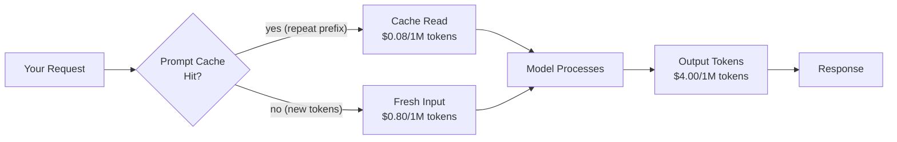

# Reading Model Docs: Context Windows, Pricing, Limits

> The model card is the spec sheet. Read it before you write a single line of code.

**Type:** Learn
**Languages:** Python
**Prerequisites:** Lesson 02 (API keys and model landscape), Lesson 03 (first API call)
**Time:** ~30 min
**Phase:** 00 - Setup and Mindset

---

## Learning Objectives

- Identify the five fields in a model card that determine production feasibility
- Distinguish context window (input limit) from max output tokens (output limit)
- Calculate maximum document size, cost per 1000 requests, and days until deprecation from a spec dict
- Explain why cached input tokens cost less than fresh input tokens
- Name the three rate limit dimensions (RPM, TPM, RPDAY) and which one bites you first

---

## The Problem

You pick a model, write a prompt, and ship to production. Three weeks later you get paged: requests are failing at 2 a.m. with a 429 error. You investigate and discover the model you chose has a 4 requests-per-minute limit on your tier. Or: your document-processing pipeline was working fine on short reports but explodes on the quarterly 120-page PDF because you assumed "200k context window" meant you could send a 200k-token document and get a 200k-token summary back. You cannot.

Both failures came from the same root cause: you picked a model without reading the docs. The model card answers four questions that determine whether a model is viable for your use case before you write a single line of code. Engineers who skip this step discover the constraints the hard way, at scale, at 2 a.m.

---

## The Concept

### The Annotated Model Card

A model listing on any provider's page has five sections that matter for production. Here is what each field means and why it matters.

```
+------------------------------------------------------------------+
| MODEL CARD: claude-3-5-haiku-20241022                            |
+------------------------------------------------------------------+
| CONTEXT WINDOW          200,000 tokens   <-- max INPUT you send  |
|   (input + output combined budget)                               |
|                                                                  |
| MAX OUTPUT TOKENS         8,192 tokens   <-- max RESPONSE size   |
|   (hard cap on what the model writes back)                       |
|                                                                  |
| INPUT PRICING          $0.80 / 1M tokens  <-- you pay per token  |
| OUTPUT PRICING         $4.00 / 1M tokens  <-- output costs more  |
| CACHE READ PRICING     $0.08 / 1M tokens  <-- 10x cheaper        |
|                                                                  |
| RATE LIMITS                                                      |
|   RPM (requests/min)           50                                |
|   TPM (tokens/min)         50,000                                |
|   RPDAY (requests/day)     1,000                                 |
|                                                                  |
| DEPRECATION DATE        2025-12-01   <-- when it stops working   |
|                                                                  |
| MODALITIES              text-in, text-out  (no vision here)      |
+------------------------------------------------------------------+
```

### The Critical Distinction: Context Window vs Max Output

This is the field that trips up most engineers. They are two different limits:

```
CONTEXT WINDOW = 200,000 tokens
  = The total budget for everything the model reads in one call
  = system prompt + user message + conversation history + documents

MAX OUTPUT = 8,192 tokens
  = The most the model can write in response
  = No matter how large the context, the output is capped here

Example: You send a 195,000-token document and ask for a summary.
  - Input: 195,000 tokens (within 200k limit: OK)
  - Output: capped at 8,192 tokens
  - You CANNOT get a 50,000-token summary of a 195,000-token document.
  - If you need long output, you need a model with higher max output.
```

### What Pricing Actually Means in Production



Output tokens cost 5x more than input tokens on Haiku. This is not a pricing quirk: the model generates output tokens one at a time, autoregressively. Input tokens are processed in parallel. The asymmetry is structural. A response that says "Sure! Here's the answer you asked for:" before answering costs money for those 10 tokens. Write prompts that get to the point.

### Rate Limits: Three Dimensions, One Bottleneck

| Limit type | What it caps | When it bites you |
|---|---|---|
| RPM (requests per minute) | Number of API calls per minute | High-concurrency systems, burst traffic |
| TPM (tokens per minute) | Total tokens processed per minute | Long-document pipelines, batch processing |
| RPDAY (requests per day) | Total calls per 24 hours | Low-tier keys on hobby plans |

In production, TPM is usually the binding constraint for AI applications. A single 190k-token document request uses 190k of your TPM budget in one call.

---

## Build It

### Step 1: The Model Spec Dict

Start by encoding what you read in the docs as a structured dict. This makes the limits queryable.

```python
# code/main.py
# No API call needed for this lesson.
# We work with the model spec as a structured dict.

from datetime import date, datetime

MODEL_SPEC = {
    "model_id": "claude-3-5-haiku-20241022",
    "context_window_tokens": 200_000,
    "max_output_tokens": 8_192,
    "pricing": {
        "input_per_million": 0.80,
        "output_per_million": 4.00,
        "cache_read_per_million": 0.08,
        "cache_write_per_million": 1.00,
    },
    "rate_limits": {
        "rpm": 50,
        "tpm": 50_000,
        "rpday": 1_000,
    },
    "deprecation_date": "2025-12-01",
    "modalities": ["text"],
    "knowledge_cutoff": "2024-07",
}
```

### Step 2: Compute What Fits

```python
TOKENS_PER_WORD = 1.33  # rough approximation for English prose


def max_document_words(spec: dict, reserved_for_output: int = 1000) -> int:
    """
    How many words can you send in a single request?
    We reserve some tokens for the output and the system prompt.
    """
    system_prompt_tokens = 200  # typical system prompt budget
    usable_input_tokens = (
        spec["context_window_tokens"]
        - reserved_for_output
        - system_prompt_tokens
    )
    return int(usable_input_tokens / TOKENS_PER_WORD)


def max_output_words(spec: dict) -> int:
    """The hard cap on how long a single response can be."""
    return int(spec["max_output_tokens"] / TOKENS_PER_WORD)
```

### Step 3: Compute Cost

```python
def cost_per_request(
    spec: dict,
    avg_input_tokens: int,
    avg_output_tokens: int,
    cache_hit_rate: float = 0.0,
) -> float:
    """
    Estimated cost in USD for a single API request.
    cache_hit_rate: fraction of input tokens served from cache (0.0 to 1.0).
    """
    pricing = spec["pricing"]
    fresh_input = avg_input_tokens * (1 - cache_hit_rate)
    cached_input = avg_input_tokens * cache_hit_rate

    input_cost = (fresh_input / 1_000_000) * pricing["input_per_million"]
    cache_cost = (cached_input / 1_000_000) * pricing["cache_read_per_million"]
    output_cost = (avg_output_tokens / 1_000_000) * pricing["output_per_million"]

    return input_cost + cache_cost + output_cost


def cost_per_thousand_requests(
    spec: dict,
    avg_input_tokens: int,
    avg_output_tokens: int,
    cache_hit_rate: float = 0.0,
) -> float:
    """Scale cost to 1000 requests for a realistic production estimate."""
    return cost_per_request(spec, avg_input_tokens, avg_output_tokens, cache_hit_rate) * 1000
```

### Step 4: Compute Days Until Deprecation

```python
def days_until_deprecation(spec: dict) -> int | None:
    """
    How many days until this model version stops accepting requests?
    Returns None if no deprecation date is set.
    """
    if not spec.get("deprecation_date"):
        return None
    dep_date = datetime.strptime(spec["deprecation_date"], "%Y-%m-%d").date()
    today = date.today()
    delta = (dep_date - today).days
    return delta
```

### Step 5: The Report

```python
def print_model_report(spec: dict) -> None:
    """Print a production-readiness summary for one model."""
    print(f"\n{'='*60}")
    print(f"Model: {spec['model_id']}")
    print(f"{'='*60}")

    max_words = max_document_words(spec)
    max_out = max_output_words(spec)
    print(f"\nCapacity:")
    print(f"  Max document size: ~{max_words:,} words (~{max_words/250:.0f} pages)")
    print(f"  Max response size: ~{max_out:,} words")
    print(f"  Context window:    {spec['context_window_tokens']:,} tokens")
    print(f"  Max output:        {spec['max_output_tokens']:,} tokens")

    print(f"\nPricing (no cache):")
    cost_low = cost_per_thousand_requests(spec, 500, 200)
    cost_high = cost_per_thousand_requests(spec, 5000, 500)
    print(f"  1,000 short requests (~500 in / 200 out):  ${cost_low:.2f}")
    print(f"  1,000 long  requests (~5k in / 500 out):   ${cost_high:.2f}")

    cost_cached = cost_per_thousand_requests(spec, 5000, 500, cache_hit_rate=0.8)
    print(f"  1,000 long  requests (80% cache hit):       ${cost_cached:.2f}")

    print(f"\nRate limits:")
    rl = spec["rate_limits"]
    print(f"  {rl['rpm']} RPM / {rl['tpm']:,} TPM / {rl.get('rpday', 'unlimited')} RPDAY")

    days = days_until_deprecation(spec)
    if days is not None:
        if days < 0:
            print(f"\nDeprecation: ALREADY DEPRECATED ({abs(days)} days ago)")
        elif days < 90:
            print(f"\nDeprecation: WARNING - {days} days remaining (plan migration now)")
        else:
            print(f"\nDeprecation: {days} days remaining")
    else:
        print("\nDeprecation: No date set")

    print(f"\nModalities: {', '.join(spec['modalities'])}")
    print()


if __name__ == "__main__":
    print_model_report(MODEL_SPEC)

    # Compare two models side by side
    SONNET_SPEC = {
        "model_id": "claude-sonnet-4-5",
        "context_window_tokens": 200_000,
        "max_output_tokens": 64_000,
        "pricing": {
            "input_per_million": 3.00,
            "output_per_million": 15.00,
            "cache_read_per_million": 0.30,
            "cache_write_per_million": 3.75,
        },
        "rate_limits": {
            "rpm": 50,
            "tpm": 80_000,
            "rpday": 5_000,
        },
        "deprecation_date": None,
        "modalities": ["text", "vision"],
        "knowledge_cutoff": "2024-04",
    }
    print_model_report(SONNET_SPEC)
```

> **Real-world check:** Your manager asks you to evaluate whether claude-3-5-haiku-20241022 can power a feature that summarizes entire legal contracts (average 80 pages, ~40,000 words) and returns a structured 5-page output (~2,500 words). Based on what you just built, can this model handle it? What specific limit, if any, is the blocking constraint?

---

## Use It

The authoritative source for these numbers is the Anthropic pricing page and the model reference docs. The anthropic Python SDK also exposes model metadata at runtime:

```python
import anthropic

client = anthropic.Anthropic()

# The usage object on every response gives you actual token counts
# for that specific request - use these to calibrate your estimates.
response = client.messages.create(
    model="claude-3-5-haiku-20241022",
    max_tokens=1024,
    messages=[{"role": "user", "content": "What is 2+2?"}],
)

print(f"Input tokens:  {response.usage.input_tokens}")
print(f"Output tokens: {response.usage.output_tokens}")

# Cache hit tracking (if you use prompt caching)
# response.usage.cache_read_input_tokens
# response.usage.cache_creation_input_tokens
```

The `usage` field is your ground truth. Estimates from token-counting libraries (tiktoken, anthropic's token counter) are approximations. Actual usage from the API response is exact. Log it for every call.

> **Perspective shift:** A teammate argues that pricing details are "ops concerns" and engineers should focus on getting features working first and optimize later. When is that framing reasonable, and when does it get engineers paged at 2 a.m.? What specific scenario makes cost a day-one engineering constraint rather than a later optimization?

---

## Ship It

The output for this lesson is the model doc checklist in `outputs/prompt-model-doc-checklist.md`. Use it whenever you are evaluating a new model or before shipping a feature that depends on a specific model's limits.

Run the comparison script:

```bash
cd phases/00-setup-and-mindset/05-reading-model-docs
python code/main.py
```

No API key required for this lesson. The script works entirely from the spec dict.

---

## Evaluate It

**Check 1: Can you answer these five questions about your chosen model without looking them up?**

- What is the context window in tokens?
- What is the max output in tokens?
- What does 1,000 requests cost at your typical prompt length?
- What is the RPM limit on your current tier?
- Is there a deprecation date within the next 12 months?

If you cannot answer all five in under 60 seconds, you do not know your model well enough for production.

**Check 2: Run the report on the model you are using for the rest of this course.**

Open `code/main.py`, add your chosen model's spec dict, and run the report. Confirm the numbers match what the Anthropic pricing page shows. The Anthropic pricing page is the source of truth: if your dict disagrees, update the dict.

**Check 3: Verify the context window vs max output distinction.**

Open the Anthropic docs and find at least two models where the max output tokens are a small fraction of the context window. Confirm you understand why this means you cannot request an output longer than the max output cap, regardless of how much of the context window is unused.
