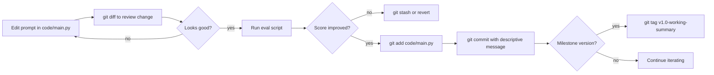

# Git وتشغيل مستودع الدرس

> تغييرات الـ prompt هي تغييرات في الكود. لو ما تقدر تعمل لها diff، ما تقدر تعمل لها debug.

**النوع:** بناء
**اللغات:** Python
**المتطلبات:** الدرس 01 (بيئة التطوير)، الدرس 03 (أول استدعاء API)
**الوقت:** ~30 دقيقة
**المرحلة:** 00 - الإعداد والعقلية

---

## أهداف التعلّم

- إعداد مستودع git لمشروع AI مع ملف ‎.gitignore الصحيح
- عمل commit لأول سكربت Python ووضع tag لنسخة شغّالة
- استخدام `git diff` لمراجعة تغييرات الـ prompt قبل الـ commit
- استخدام `git log` لتحديد الـ commit الذي تسبّب في تراجع (regression)
- التمييز بين ما ينتمي إلى git وما يجب أن يبقى خارج إدارة النسخ

---

## المشكلة

خط معالجة الـ RAG عندك صار يرجّع إجابات أسوأ بعد آخر نشر (deploy) يوم الجمعة. تسأل المهندس الذي عدّله: وش سوّيت؟ يقول: "بس عدّلت الـ prompt شوي". تطلب منه تشوف الـ diff. ما فيه diff: عدّل نص الـ prompt مباشرةً في ملف Python وهو يشتغل، جرّبه يدويًا، قال "هذا أحسن"، ونشره. الـ prompt السابق راح.

الآن ما عندك أي طريقة لمقارنة الـ prompt الحالي بالذي كان شغّالًا. ما تقدر تقيس إن كان التغيير ساعد أو ضرّ على مجموعة التقييم (eval set) عندك. ما تقدر ترجع للوراء. أنت تعمل debug لتراجع بدون خط أساس (baseline).

هذي ليست حالة افتراضية. تحصل في كل فريق AI يتعامل مع نص الـ prompt كأنه إعدادات (configuration) بدل أن يكون كودًا. الـ prompts منطق (logic). تغييرات الـ prompt عمليات نشر. لو التغيير ما هو في git مع رسالة commit ذات معنى، فأنت ما عندك إدارة نسخ: عندك ملف بتاريخ من إصدار واحد.

---

## المفهوم

### ما يدخل في Git مقابل ما يبقى خارجه

مشاريع AI لها ملف مخاطر مختلف عن مشاريع البرمجيات العادية. الـ `.gitignore` الخاطئ ممكن إما يسرّب الأسرار (secrets) أو يفقد قابلية إعادة الإنتاج (reproducibility).

```
AI PROJECT DIRECTORY
+-----------------------+---------------------------+
|     GIT TRACKS        |    GITIGNORE EXCLUDES     |
+-----------------------+---------------------------+
| code/main.py          | .env (API keys!)           |
| prompts/              | __pycache__/               |
| evals/                | *.pyc                      |
| checks.json           | .venv/ (uv env)            |
| requirements.txt      | outputs/raw_responses/     |
| Dockerfile            |   (PII from API calls)     |
| README.md             | model_weights/ (too large) |
| .gitignore itself     | *.log                      |
|                       | .DS_Store                  |
|                       | secrets.json               |
+-----------------------+---------------------------+

RULE: If it regenerates automatically OR contains secrets OR
      is too large for a repo (>50MB), gitignore it.
RULE: If you would need to recreate it manually to reproduce
      a past result, git track it.
```

### نمط إصدار الـ Prompt (Prompt Versioning)



### رسائل الـ Commit لمشاريع AI

رسائل الـ commit في البرمجيات العادية تصف تغييرات الكود. مشاريع AI تحتاج رسائل commit تصف تغييرات الـ prompt والسلوك:

```
# Generic - unhelpful for debugging AI regressions:
"update prompt"
"fix bug"
"tweak"

# Descriptive - lets you find the commit that broke eval scores:
"prompt: add 'be concise' instruction to reduce preamble tokens"
"prompt: switch from bullet list to prose format for summaries"
"eval: add 10 contract questions to eval set; baseline score 7/10"
"config: increase max_tokens from 512 to 1024 for long summaries"
"revert: undo prompt change from abc123 - dropped score from 8 to 5"
```

لمّا تشغّل `git log` على مستودع AI بعد ستة أشهر، المفروض تقدر تعيد بناء تاريخ الـ prompt كخط زمني للتغيّرات السلوكية.

---

## البناء

### الخطوة 1: تهيئة المستودع

```python
# code/main.py
# This script sets up a git repo for an AI project and demonstrates
# the versioning workflow. Run it once in a new directory.

import subprocess
import os
import sys


def run(cmd: str, check: bool = True) -> subprocess.CompletedProcess:
    """Run a shell command and print it."""
    print(f"  $ {cmd}")
    result = subprocess.run(
        cmd, shell=True, capture_output=True, text=True
    )
    if result.stdout:
        print(result.stdout.rstrip())
    if result.stderr and result.returncode != 0:
        print(f"  stderr: {result.stderr.rstrip()}")
    if check and result.returncode != 0:
        raise RuntimeError(f"Command failed: {cmd}")
    return result
```

### الخطوة 2: ملف الـ .gitignore لمشاريع AI

```python
GITIGNORE_CONTENT = """# Python
__pycache__/
*.py[cod]
*.pyo
*.pyd
.Python
*.egg-info/
dist/
build/

# Virtual environments (uv, venv, conda)
.venv/
venv/
env/
.env/

# Secrets - NEVER commit these
.env
*.env
secrets.json
credentials.json
config.local.py
*_key.txt

# API response outputs that may contain PII
outputs/raw_responses/
outputs/eval_runs/
*.jsonl.gz

# Large files
model_weights/
*.bin
*.pt
*.onnx

# OS files
.DS_Store
Thumbs.db

# IDE
.vscode/
.idea/
*.swp

# Logs
*.log
logs/
"""


def setup_ai_project_repo(project_dir: str) -> None:
    """
    Initialize a git repo in project_dir with the correct .gitignore
    for an AI project.
    """
    os.makedirs(project_dir, exist_ok=True)

    gitignore_path = os.path.join(project_dir, ".gitignore")
    with open(gitignore_path, "w") as f:
        f.write(GITIGNORE_CONTENT)
    print(f"Wrote .gitignore to {gitignore_path}")
```

### الخطوة 3: عمل Commit لأول سكربت

```python
FIRST_SCRIPT = '''"""
First AI script - tracked in git so every prompt change is diffable.
"""
import os
import anthropic

MODEL = "claude-3-5-haiku-20241022"

# v1: direct instruction
SYSTEM_PROMPT = """You are a concise assistant. Answer in 1-3 sentences.
Do not use preambles like 'Sure!' or 'Great question!'."""

client = anthropic.Anthropic(api_key=os.environ["ANTHROPIC_API_KEY"])


def ask(question: str) -> str:
    response = client.messages.create(
        model=MODEL,
        max_tokens=256,
        system=SYSTEM_PROMPT,
        messages=[{"role": "user", "content": question}],
    )
    return response.content[0].text


if __name__ == "__main__":
    question = "What is a context window in an LLM?"
    print(f"Q: {question}")
    print(f"A: {ask(question)}")
'''


def commit_first_script(project_dir: str) -> None:
    """Create first_call.py, stage it, and commit it."""
    script_path = os.path.join(project_dir, "first_call.py")
    with open(script_path, "w") as f:
        f.write(FIRST_SCRIPT)

    os.chdir(project_dir)
    run("git add .gitignore first_call.py")
    run('git commit -m "init: AI project scaffold with gitignore and first API call"')
    print("First commit created.")
```

### الخطوة 4: وضع Tag لنسخة شغّالة

```python
def tag_working_version(tag: str, message: str) -> None:
    """
    Tag the current HEAD as a working version.
    Use this whenever a prompt achieves a score threshold you want to preserve.

    Example: tag_working_version("v1.0-concise-prompt", "Score: 8/10 on 20-question eval")
    """
    run(f'git tag -a {tag} -m "{message}"')
    print(f"Tagged {tag}: {message}")
```

> **اختبار من الواقع:** مشروع AI عند فريقك شغّال من ثلاثة أشهر. زميلك يسأل: "هل فعلًا نحتاج git tags للـ prompts؟ سجل الـ commit أصلًا يبيّن كل تغيير." متى تكون الـ tags مفيدة تحديدًا لإصدار الـ prompt بشكل ما توفّره لك hashes الـ commit وحدها؟

### الخطوة 5: عرض كامل لسير العمل

```python
def show_prompt_diff_workflow(project_dir: str) -> None:
    """
    Demonstrate the prompt versioning workflow:
    1. Modify the prompt
    2. Review with git diff
    3. Commit with a descriptive message
    """
    script_path = os.path.join(project_dir, "first_call.py")

    # Simulate a prompt edit: adding a formatting constraint
    with open(script_path) as f:
        content = f.read()

    new_content = content.replace(
        'Do not use preambles like \'Sure!\' or \'Great question!\'.""""',
        'Do not use preambles like \'Sure!\' or \'Great question!\'.\n'
        'When listing items, use numbered lists, not bullet points.""""',
    )

    # Only write if a change was made (avoid no-op)
    if new_content != content:
        with open(script_path, "w") as f:
            f.write(new_content)
        print("\nPrompt edited. Reviewing diff before commit:")
        run("git diff first_call.py")
        run("git add first_call.py")
        run('git commit -m "prompt: add numbered-list instruction to improve scanability"')
    else:
        print("\n(Demo: showing git diff on the current state)")
        run("git diff HEAD~1 HEAD -- first_call.py", check=False)


if __name__ == "__main__":
    project_dir = "/tmp/ai_project_demo"
    print("Setting up AI project repo...")
    setup_ai_project_repo(project_dir)
    os.chdir(project_dir)

    print("\nInitializing git repo...")
    run("git init")
    run('git config user.email "ai-engineer@example.com"')
    run('git config user.name "AI Engineer"')

    print("\nCommitting first script...")
    commit_first_script(project_dir)

    print("\nTagging working version...")
    tag_working_version("v1.0-baseline", "Baseline prompt, score 6/10 on eval set")

    print("\nSimulating prompt iteration...")
    show_prompt_diff_workflow(project_dir)

    print("\nTag the improved version...")
    tag_working_version("v1.1-numbered-lists", "Added list format instruction, score 7/10")

    print("\nView the full log with tags:")
    run("git log --oneline --decorate")

    print("\nSetup complete. Key commands for AI projects:")
    print("  git diff HEAD -- prompts/   # Review prompt changes before committing")
    print("  git log --oneline           # Find the commit that changed behavior")
    print("  git show v1.0-baseline      # See the exact prompt at that tag")
    print("  git revert <hash>           # Roll back to a known-good prompt")
```

---

## الاستخدام

بمجرد أن يصير مشروع AI عندك في git، هذي الأوامر الأربعة تغطّي 90% من احتياجاتك اليومية لإدارة النسخ:

```bash
# 1. Review what changed in your prompts before committing
git diff HEAD -- code/main.py

# 2. Commit a prompt change with a meaningful message
git add code/main.py
git commit -m "prompt: narrow response to 2 sentences max to cut output tokens"

# 3. Find which commit changed behavior (binary search for regressions)
git log --oneline --since="2 weeks ago"
# Then test specific commits:
git checkout <hash>
python code/main.py "your eval question"
git checkout main

# 4. Tag a working version before experimenting
git tag -a v2.0-production -m "Eval score: 9/10. Deployed to prod on $(date +%Y-%m-%d)"
git show v2.0-production  # see exact state at that tag
```

للفرق، أضف نمط فرع-لكل-تجربة (branch-per-experiment):

```bash
git checkout -b experiment/chain-of-thought-prompting
# ... edit prompts, run evals ...
git commit -m "experiment: chain-of-thought improved score from 7 to 9 on complex queries"
# If it works, merge to main:
git checkout main
git merge experiment/chain-of-thought-prompting
```

> **نقلة في المنظور:** قائد فريقك التقني يجادل بأن نص الـ prompt المفروض يعيش في قاعدة بيانات أو نظام إدارة إعدادات (config management) بدل git، لأن "هذا غرض الإعدادات". متى يكون هذا الكلام صحيحًا، ومتى يجعل debugging تراجعات AI أصعب فعليًا؟

---

## التسليم

المخرَج لهذا الدرس هو `outputs/skill-ai-project-git-workflow.md`: مرجع قابل لإعادة الاستخدام لأوامر git والأعراف التي تجعل مشاريع AI قابلة للـ debug.

شغّل العرض التوضيحي:

```bash
cd phases/00-setup-and-mindset/07-git-and-repo
python code/main.py
ls /tmp/ai_project_demo
cd /tmp/ai_project_demo && git log --oneline --decorate
```

السكربت ينشئ مستودع git كاملًا في `/tmp/ai_project_demo` ويمشي بك خلال سير العمل كاملًا.

---

## التقييم

**الفحص 1: جهّز مستودع git حقيقيًا لمشروع AI خاص بك.**

أنشئ مجلدًا جديدًا، شغّل `git init`، انسخ الـ `.gitignore` من هذا الدرس، أضف أول سكربت لك، واعمل أول commit. تأكّد عبر `git log` أن الـ commit ظهر. تأكّد عبر `git status` أن `.env` غير متتبَّع (not tracked).

**الفحص 2: اعمل commit لتغيير في الـ prompt مع رسالة وصفية.**

عدّل نص prompt في سكربتك. شغّل `git diff` قبل الـ commit وتأكّد أن الـ diff يبيّن بالضبط وش تغيّر. اعمل له commit برسالة تصف القصد السلوكي للتغيير، لا التعديل الميكانيكي. سيّئة: "changed prompt". جيدة: "prompt: add chain-of-thought instruction to improve multi-step reasoning."

**الفحص 3: اعثر على الـ commit الذي غيّر السلوك.**

لو عندك على الأقل 5 commits في مستودعك، استخدم `git log --oneline` لتحديد commit غيّرت فيه prompt أو معامل نموذج (model parameter). استخدم `git show <hash>` للتأكد أنك تقدر تسترجع الحالة الدقيقة للكود عند تلك النقطة. هذي هي المهارة التي ستستخدمها عند debugging تراجعات الإنتاج (production regressions).
