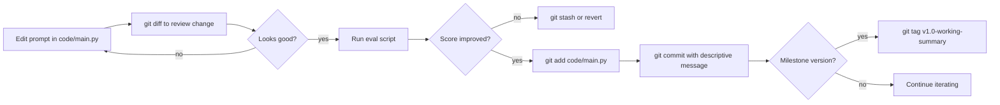

# Git and Running the Lesson Repo

> Prompt changes are code changes. If you cannot diff them, you cannot debug them.

**Type:** Build
**Languages:** Python
**Prerequisites:** Lesson 01 (dev environment), Lesson 03 (first API call)
**Time:** ~30 min
**Phase:** 00 - Setup and Mindset

---

## Learning Objectives

- Set up a git repo for an AI project with the correct .gitignore
- Commit a first Python script and tag a working version
- Use `git diff` to review prompt changes before committing
- Use `git log` to identify which commit introduced a regression
- Distinguish what belongs in git from what must stay out of version control

---

## The Problem

Your RAG pipeline is returning worse answers after last Friday's deploy. You ask the engineer who changed it what they did. "I just tweaked the prompt a bit," they say. You ask to see the diff. There is no diff: they edited the prompt string directly in the running Python file, tested it manually, said "that looks better," and deployed. The previous prompt is gone.

You now have no way to compare the current prompt against the one that was working. You cannot measure whether the change helped or hurt on your eval set. You cannot roll back. You are debugging a regression with no baseline.

This is not a hypothetical. It happens on every AI team that treats prompt text as configuration rather than code. Prompts are logic. Prompt changes are deployments. If the change is not in git with a meaningful commit message, you do not have version control: you have a file with a history of one.

---

## The Concept

### What Goes In Git vs What Stays Out

AI projects have a different risk profile from standard software projects. The wrong `.gitignore` can either leak secrets or lose reproducibility.

```
AI PROJECT DIRECTORY
+-----------------------+---------------------------+
|     GIT TRACKS        |    GITIGNORE EXCLUDES     |
+-----------------------+---------------------------+
| code/main.py          | .env (API keys!)           |
| prompts/              | __pycache__/               |
| evals/                | *.pyc                      |
| checks.json           | .venv/ (uv env)            |
| requirements.txt      | outputs/raw_responses/     |
| Dockerfile            |   (PII from API calls)     |
| README.md             | model_weights/ (too large) |
| .gitignore itself     | *.log                      |
|                       | .DS_Store                  |
|                       | secrets.json               |
+-----------------------+---------------------------+

RULE: If it regenerates automatically OR contains secrets OR
      is too large for a repo (>50MB), gitignore it.
RULE: If you would need to recreate it manually to reproduce
      a past result, git track it.
```

### The Prompt Versioning Pattern



### Commit Messages for AI Projects

Standard software commit messages describe code changes. AI projects need commit messages that describe prompt and behavior changes:

```
# Generic - unhelpful for debugging AI regressions:
"update prompt"
"fix bug"
"tweak"

# Descriptive - lets you find the commit that broke eval scores:
"prompt: add 'be concise' instruction to reduce preamble tokens"
"prompt: switch from bullet list to prose format for summaries"
"eval: add 10 contract questions to eval set; baseline score 7/10"
"config: increase max_tokens from 512 to 1024 for long summaries"
"revert: undo prompt change from abc123 - dropped score from 8 to 5"
```

When you `git log` your AI repo in six months, you should be able to reconstruct the prompt history as a timeline of behavioral changes.

---

## Build It

### Step 1: Initialize the Repo

```python
# code/main.py
# This script sets up a git repo for an AI project and demonstrates
# the versioning workflow. Run it once in a new directory.

import subprocess
import os
import sys


def run(cmd: str, check: bool = True) -> subprocess.CompletedProcess:
    """Run a shell command and print it."""
    print(f"  $ {cmd}")
    result = subprocess.run(
        cmd, shell=True, capture_output=True, text=True
    )
    if result.stdout:
        print(result.stdout.rstrip())
    if result.stderr and result.returncode != 0:
        print(f"  stderr: {result.stderr.rstrip()}")
    if check and result.returncode != 0:
        raise RuntimeError(f"Command failed: {cmd}")
    return result
```

### Step 2: The .gitignore for AI Projects

```python
GITIGNORE_CONTENT = """# Python
__pycache__/
*.py[cod]
*.pyo
*.pyd
.Python
*.egg-info/
dist/
build/

# Virtual environments (uv, venv, conda)
.venv/
venv/
env/
.env/

# Secrets - NEVER commit these
.env
*.env
secrets.json
credentials.json
config.local.py
*_key.txt

# API response outputs that may contain PII
outputs/raw_responses/
outputs/eval_runs/
*.jsonl.gz

# Large files
model_weights/
*.bin
*.pt
*.onnx

# OS files
.DS_Store
Thumbs.db

# IDE
.vscode/
.idea/
*.swp

# Logs
*.log
logs/
"""


def setup_ai_project_repo(project_dir: str) -> None:
    """
    Initialize a git repo in project_dir with the correct .gitignore
    for an AI project.
    """
    os.makedirs(project_dir, exist_ok=True)

    gitignore_path = os.path.join(project_dir, ".gitignore")
    with open(gitignore_path, "w") as f:
        f.write(GITIGNORE_CONTENT)
    print(f"Wrote .gitignore to {gitignore_path}")
```

### Step 3: Commit the First Script

```python
FIRST_SCRIPT = '''"""
First AI script - tracked in git so every prompt change is diffable.
"""
import os
import anthropic

MODEL = "claude-3-5-haiku-20241022"

# v1: direct instruction
SYSTEM_PROMPT = """You are a concise assistant. Answer in 1-3 sentences.
Do not use preambles like 'Sure!' or 'Great question!'."""

client = anthropic.Anthropic(api_key=os.environ["ANTHROPIC_API_KEY"])


def ask(question: str) -> str:
    response = client.messages.create(
        model=MODEL,
        max_tokens=256,
        system=SYSTEM_PROMPT,
        messages=[{"role": "user", "content": question}],
    )
    return response.content[0].text


if __name__ == "__main__":
    question = "What is a context window in an LLM?"
    print(f"Q: {question}")
    print(f"A: {ask(question)}")
'''


def commit_first_script(project_dir: str) -> None:
    """Create first_call.py, stage it, and commit it."""
    script_path = os.path.join(project_dir, "first_call.py")
    with open(script_path, "w") as f:
        f.write(FIRST_SCRIPT)

    os.chdir(project_dir)
    run("git add .gitignore first_call.py")
    run('git commit -m "init: AI project scaffold with gitignore and first API call"')
    print("First commit created.")
```

### Step 4: Tag a Working Version

```python
def tag_working_version(tag: str, message: str) -> None:
    """
    Tag the current HEAD as a working version.
    Use this whenever a prompt achieves a score threshold you want to preserve.

    Example: tag_working_version("v1.0-concise-prompt", "Score: 8/10 on 20-question eval")
    """
    run(f'git tag -a {tag} -m "{message}"')
    print(f"Tagged {tag}: {message}")
```

> **Real-world check:** Your team's AI project has been running for three months. A teammate asks: "Do we really need git tags for prompts? The commit log already shows every change." When are tags specifically useful for prompt versioning that commit hashes alone do not give you?

### Step 5: The Full Workflow Demo

```python
def show_prompt_diff_workflow(project_dir: str) -> None:
    """
    Demonstrate the prompt versioning workflow:
    1. Modify the prompt
    2. Review with git diff
    3. Commit with a descriptive message
    """
    script_path = os.path.join(project_dir, "first_call.py")

    # Simulate a prompt edit: adding a formatting constraint
    with open(script_path) as f:
        content = f.read()

    new_content = content.replace(
        'Do not use preambles like \'Sure!\' or \'Great question!\'.""""',
        'Do not use preambles like \'Sure!\' or \'Great question!\'.\n'
        'When listing items, use numbered lists, not bullet points.""""',
    )

    # Only write if a change was made (avoid no-op)
    if new_content != content:
        with open(script_path, "w") as f:
            f.write(new_content)
        print("\nPrompt edited. Reviewing diff before commit:")
        run("git diff first_call.py")
        run("git add first_call.py")
        run('git commit -m "prompt: add numbered-list instruction to improve scanability"')
    else:
        print("\n(Demo: showing git diff on the current state)")
        run("git diff HEAD~1 HEAD -- first_call.py", check=False)


if __name__ == "__main__":
    project_dir = "/tmp/ai_project_demo"
    print("Setting up AI project repo...")
    setup_ai_project_repo(project_dir)
    os.chdir(project_dir)

    print("\nInitializing git repo...")
    run("git init")
    run('git config user.email "ai-engineer@example.com"')
    run('git config user.name "AI Engineer"')

    print("\nCommitting first script...")
    commit_first_script(project_dir)

    print("\nTagging working version...")
    tag_working_version("v1.0-baseline", "Baseline prompt, score 6/10 on eval set")

    print("\nSimulating prompt iteration...")
    show_prompt_diff_workflow(project_dir)

    print("\nTag the improved version...")
    tag_working_version("v1.1-numbered-lists", "Added list format instruction, score 7/10")

    print("\nView the full log with tags:")
    run("git log --oneline --decorate")

    print("\nSetup complete. Key commands for AI projects:")
    print("  git diff HEAD -- prompts/   # Review prompt changes before committing")
    print("  git log --oneline           # Find the commit that changed behavior")
    print("  git show v1.0-baseline      # See the exact prompt at that tag")
    print("  git revert <hash>           # Roll back to a known-good prompt")
```

---

## Use It

Once your AI project is in git, these four commands cover 90% of your daily versioning needs:

```bash
# 1. Review what changed in your prompts before committing
git diff HEAD -- code/main.py

# 2. Commit a prompt change with a meaningful message
git add code/main.py
git commit -m "prompt: narrow response to 2 sentences max to cut output tokens"

# 3. Find which commit changed behavior (binary search for regressions)
git log --oneline --since="2 weeks ago"
# Then test specific commits:
git checkout <hash>
python code/main.py "your eval question"
git checkout main

# 4. Tag a working version before experimenting
git tag -a v2.0-production -m "Eval score: 9/10. Deployed to prod on $(date +%Y-%m-%d)"
git show v2.0-production  # see exact state at that tag
```

For teams, add a branch-per-experiment pattern:

```bash
git checkout -b experiment/chain-of-thought-prompting
# ... edit prompts, run evals ...
git commit -m "experiment: chain-of-thought improved score from 7 to 9 on complex queries"
# If it works, merge to main:
git checkout main
git merge experiment/chain-of-thought-prompting
```

> **Perspective shift:** Your tech lead argues that prompt text should live in a database or config management system rather than in git, because "that's what config is for." When does that argument hold, and when does it actively make debugging AI regressions harder?

---

## Ship It

The output for this lesson is `outputs/skill-ai-project-git-workflow.md`: a reusable reference for the git commands and conventions that make AI projects debuggable.

Run the demo:

```bash
cd phases/00-setup-and-mindset/07-git-and-repo
python code/main.py
ls /tmp/ai_project_demo
cd /tmp/ai_project_demo && git log --oneline --decorate
```

The script creates a complete git repo in `/tmp/ai_project_demo` and walks through the full workflow.

---

## Evaluate It

**Check 1: Set up a real git repo for your own AI project.**

Create a new directory, run `git init`, copy the `.gitignore` from this lesson, add your first script, and make your first commit. Confirm with `git log` that the commit appears. Confirm with `git status` that `.env` is not tracked.

**Check 2: Commit a prompt change with a descriptive message.**

Edit a prompt string in your script. Run `git diff` before committing and confirm the diff shows exactly what changed. Commit it with a message that describes the behavioral intent of the change, not the mechanical edit. Bad: "changed prompt". Good: "prompt: add chain-of-thought instruction to improve multi-step reasoning."

**Check 3: Find the commit that changed behavior.**

If you have at least 5 commits in your repo, use `git log --oneline` to identify a commit where you changed a prompt or model parameter. Use `git show <hash>` to verify you can retrieve the exact state of the code at that point. This is the skill you will use when debugging production regressions.
