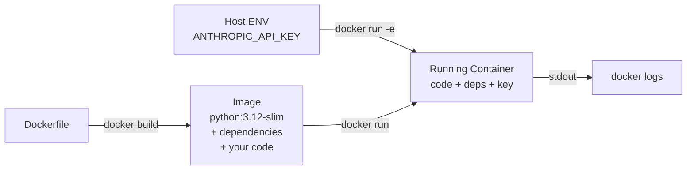

# أساسيات Docker لتطبيقات AI

> لو اشتغل داخل container، يشتغل في كل مكان، بما في ذلك الخادم الذي نبّهك الساعة 2 فجرًا.

**النوع:** بناء
**اللغات:** Python
**المتطلبات:** الدرس 03 (أول استدعاء API)، الدرس 01 (بيئة التطوير)
**الوقت:** ~45 دقيقة
**أهداف التعلّم:**
- كتابة Dockerfile مبسّط لتطبيق AI بلغة Python
- بناء وتشغيل container يستدعي Anthropic API
- تمرير الأسرار (secrets) وقت التشغيل باستخدام متغيّرات البيئة (environment variables)، وعدم تضمينها أبدًا داخل الـ image
- التمييز بين ما يعيش على المضيف (host) مقابل ما يعيش داخل الـ container
- التحقق من سجلات (logs) container شغّال وسلوك خروجه (exit behavior)

---

## المشكلة

تبني ملخّص AI يشتغل بشكل مثالي على لابتوبك. ترسله لزميل. يفشل. نسخة Python مختلفة. نسخة حزمة `anthropic` مختلفة. نظام تشغيل مختلف. إعدادات النموذج التي ضبطتها كمتغيّر بيئة على جهازك ما وصلت أبدًا إلى جهازه.

هذا يحصل باستمرار في عمل AI لأن تطبيقات AI لها اعتماديات خارجية (external dependencies) أكثر من البرمجيات العادية: نسخ SDK محددة، مفاتيح API، إعدادات النموذج، وأحيانًا تعريفات GPU. نمط الفشل "يشتغل على جهازي" يقتل العروض التوضيحية، يهدر دورات المراجعة، ويجعل عمليات نشر الإنتاج غير قابلة للتنبؤ.

Docker يحل هذا بتغليف كودك واعتمادياته الدقيقة وإعدادات تشغيله في وحدة واحدة تشتغل بشكل متطابق في كل مكان. تسلّم أحدهم image بدل repo، وتتحوّل المحادثة من "هل ركّبت كل شيء صح؟" إلى "وش المخرَج الذي حصلت عليه؟".

التكلفة ملف واحد: Dockerfile. كتابته تأخذ 10 دقائق. عدم كتابته يكلّف ساعات من debugging البيئة.

---

## المفهوم

### المضيف مقابل الـ Container: ما الذي يعيش أين

```
┌──────────────────────────────────────────────────────────────┐
│  HOST MACHINE                                                │
│                                                              │
│  ┌─────────────────────┐   ┌──────────────────────────────┐ │
│  │  Your filesystem    │   │  Environment variables       │ │
│  │  ~/projects/app/    │   │  ANTHROPIC_API_KEY=sk-...    │ │
│  │  ├── code/          │   │  HOME=/Users/you             │ │
│  │  │   └── main.py    │   └──────────────┬───────────────┘ │
│  │  ├── Dockerfile     │                  │                 │
│  │  └── requirements   │         docker run -e             │
│  └──────────┬──────────┘                  │                 │
│             │ COPY (at build time)         │                 │
│             ▼                             ▼                 │
│  ┌──────────────────────────────────────────────────────┐   │
│  │  CONTAINER (isolated filesystem + process)           │   │
│  │                                                      │   │
│  │  /app/main.py          (your code, copied in)        │   │
│  │  /usr/lib/python3.12/  (python + packages installed) │   │
│  │                                                      │   │
│  │  ENV: ANTHROPIC_API_KEY=sk-...  (injected at run)    │   │
│  │                                                      │   │
│  │  python /app/main.py   (your CMD)                    │   │
│  └──────────────────────────────────────────────────────┘   │
└──────────────────────────────────────────────────────────────┘
```

الفصل الأساسي: مفتاح الـ API **لا يدخل الـ image أبدًا**. يتدفّق من بيئة مضيفك إلى الـ container الشغّال وقت `docker run`. لو عملت `docker push` للـ image إلى registry، المفتاح ليس فيه.

### تسلسل البناء-ثم-التشغيل (Build-Then-Run)



### لماذا `python:3.12-slim` وليس `python:3.12`

نسخة `-slim` تزيل ترويسات التطوير (development headers) ومجموعات الاختبار والتوثيق من الـ base image. لتطبيقات AI API (بدون تصريف، بدون حزم نظام)، الـ slim هو الخيار الافتراضي الصحيح: image أصغر، push وpull أسرع، وسطح هجوم (attack surface) أصغر. استخدم النسخة الكاملة `python:3.12` فقط لمّا تحتاج إحدى الاعتماديات تصريف امتدادات C ويفشل الـ slim أثناء `pip install`.

---

## البناء

### الخطوة 1: التطبيق

أنشئ `code/main.py`: تطبيق Anthropic مبسّط يلخّص مقطعًا مكتوبًا بشكل ثابت (hardcoded):

```python
import anthropic
import os

client = anthropic.Anthropic(api_key=os.environ["ANTHROPIC_API_KEY"])

TEXT = """
The transformer architecture, introduced in 2017, replaced recurrence with
self-attention. This allowed training to be fully parallelized across tokens,
which unlocked training on much larger datasets with more parameters. By 2020,
scaling these architectures produced models that generalized across tasks
without task-specific fine-tuning.
"""

def summarize(text: str) -> str:
    message = client.messages.create(
        model="claude-3-5-haiku-20241022",
        max_tokens=256,
        messages=[
            {
                "role": "user",
                "content": f"Summarize the following in one sentence:\n\n{text.strip()}"
            }
        ]
    )
    return message.content[0].text

if __name__ == "__main__":
    print("Input:")
    print(TEXT.strip())
    print("\nSummary:")
    print(summarize(TEXT))
```

### الخطوة 2: ملف المتطلبات

أنشئ `code/requirements.txt`:

```
anthropic>=0.40.0
```

ثبّت على نسخة أدنى (minimum version)، لا نسخة دقيقة. التثبيت على نسخ دقيقة يسبّب تعارضات لمّا تتحدّث الـ base images. التثبيت على نسخة أدنى يبقيك محدّثًا مع الحفاظ على التوافق.

### الخطوة 3: الـ Dockerfile

أنشئ `code/Dockerfile`:

```dockerfile
FROM python:3.12-slim

WORKDIR /app

COPY requirements.txt .
RUN pip install --no-cache-dir -r requirements.txt

COPY main.py .

CMD ["python", "main.py"]
```

الترتيب مهم. `COPY requirements.txt` و`RUN pip install` يأتيان **قبل** `COPY main.py`. Docker يخزّن كل طبقة (layer) في الكاش. لو غيّرت `main.py` ولم تغيّر `requirements.txt`، يعيد Docker استخدام طبقة pip install المخزّنة ويعيد بناء آخر COPY فقط. وضع pip install في الأخير يعني أن كل تغيير في الكود يعيد تثبيت كل الحزم.

### الخطوة 4: بناء الـ Image

من مجلد `code/`:

```bash
docker build -t ai-summarizer .
```

‏`-t ai-summarizer` يعطي الـ image اسمًا. الـ `.` يخبر Docker بأن يبحث عن الـ Dockerfile في المجلد الحالي. المفروض تشوف مخرجًا مثل:

```
[1/4] FROM python:3.12-slim
[2/4] COPY requirements.txt .
[3/4] RUN pip install --no-cache-dir -r requirements.txt
[4/4] COPY main.py .
```

### الخطوة 5: تشغيله

```bash
docker run -e ANTHROPIC_API_KEY=$ANTHROPIC_API_KEY ai-summarizer
```

‏`-e ANTHROPIC_API_KEY=$ANTHROPIC_API_KEY` يقرأ المفتاح من الـ shell الحالي عندك ويحقنه في بيئة الـ container. كود Python داخل الـ container يقرأه من `os.environ["ANTHROPIC_API_KEY"]`. المفتاح لا يُكتب في أي ملف أبدًا.

المخرَج المتوقع:

```
Input:
The transformer architecture, introduced in 2017...

Summary:
The transformer architecture's 2017 introduction of self-attention over recurrence
enabled parallel training and large-scale pretraining, leading to generalizable
models by 2020.
```

> **اختبار من الواقع:** مهندس مبتدئ يسأل: "ليش ما أقدر بس أضع مفتاح الـ API بشكل ثابت (hardcode) في `main.py` داخل الـ Dockerfile؟ بس للاختبار المحلي." الجواب: images الـ Docker هي أنظمة ملفات طبقية (layered filesystems). كل `COPY` و`RUN` ينشئ طبقة دائمة في تاريخ الـ image. حتى لو حذفت الملف في طبقة لاحقة، المفتاح يبقى ظاهرًا في الطبقة الأسبق عبر `docker history --no-trunc`. ولو يومًا ما عملت push لذلك الـ image إلى Docker Hub أو registry الشركة، انكشف المفتاح. خيار `-e` يبقيه خارج الـ image تمامًا.

### الخطوة 6: فحص السجلات (Logs)

لو خرج الـ container (وهذا ما سيحصل بعد التشغيل)، استخدم:

```bash
docker logs $(docker ps -lq)
```

‏`docker ps -lq` يرجّع مُعرّف (ID) آخر container اشتغل. لخدمة طويلة العمل (long-running) ستستخدم `docker logs <container_id> -f` لمتابعة التدفّق (stream).

---

## الاستخدام

أوامر Docker الثلاثة التي تستخدمها كل يوم:

```bash
# Build an image from a Dockerfile in the current directory
docker build -t <name>:<tag> .

# Run a container, passing an env var from the host
docker run -e KEY=$KEY <image-name>

# Run a container and enter an interactive shell (debugging)
docker run -it --entrypoint /bin/bash <image-name>
```

لخدمات AI التي تحتاج تبقى حيّة (FastAPI مثلًا)، أضف خيار `-d` للتشغيل منفصلًا (detached)، و`-p` لربط منفذ (port):

```bash
docker run -d -p 8000:8000 -e ANTHROPIC_API_KEY=$ANTHROPIC_API_KEY ai-service
```

النمط دائمًا: ابنِ مرة واحدة، شغّل مع حقن الأسرار وقت التشغيل. الـ image نفسه يبقى نظيفًا بما يكفي للـ push إلى أي registry.

> **نقلة في المنظور:** مهندس خبير ما استخدم AI أبدًا يسأل: "عندنا أصلًا بيئة افتراضية (virtual environment)، ليش نحتاج Docker؟" البيئات الافتراضية تعزل حزم Python. Docker يعزل نظام التشغيل كاملًا، ونسخة Python، ومكتبات النظام، ومجموعة الحزم سوية. البيئات الافتراضية تنكسر لمّا تختلف نسخ Python بين الأجهزة أو لمّا تحتاج حزمة مكتبة نظام مثبّتة على جهاز وغير مثبّتة على آخر. في عمل AI، تواجه هذا كثيرًا مع حزم تغلّف كود C أو CUDA. Docker يزيل صنف "بس يشتغل على جهازي" بالكامل.

---

## التسليم

المُخرَج القابل لإعادة الاستخدام لهذا الدرس هو `outputs/skill-ai-dockerfile.md`: قالب Dockerfile مُعَلْمَن (parameterized) مع شروحات توضيحية لأي تطبيق AI بلغة Python.

راجع `outputs/skill-ai-dockerfile.md`.

---

## التقييم

**هل الـ container يشتغل فعلًا؟**

```bash
docker build -t ai-summarizer . && docker run -e ANTHROPIC_API_KEY=$ANTHROPIC_API_KEY ai-summarizer
echo "Exit code: $?"
```

رمز خروج (exit code) 0 يعني نجاح. أي رمز غير صفري يعني أن عملية Python انهارت؛ افحص `docker logs`.

**هل المفتاح غائب عن الـ image؟**

```bash
docker history --no-trunc ai-summarizer | grep -i "api_key\|sk-"
```

المفروض ما يرجّع شيء. لو رجّع تطابقًا، فإن مفتاحًا تم تضمينه في إحدى الطبقات.

**هل تخزين الطبقات في الكاش (layer caching) يشتغل؟**

غيّر `main.py` فقط (لا `requirements.txt`) وأعد البناء:

```bash
docker build -t ai-summarizer .
```

المفروض تشوف `CACHED` بجانب خطوة `RUN pip install`. لو شفته يعيد تثبيت الحزم، فإن ترتيب `COPY requirements.txt` / `RUN pip install` خاطئ.

**هل الـ container يشتغل على جهاز مختلف؟**

احفظ الـ image وحمّله في مكان آخر:

```bash
docker save ai-summarizer | gzip > ai-summarizer.tar.gz
# On the other machine:
docker load < ai-summarizer.tar.gz
docker run -e ANTHROPIC_API_KEY=$ANTHROPIC_API_KEY ai-summarizer
```

لو اشتغل، فإن بيئتك قابلة للنقل (portable) فعلًا. هذا هو المقياس الذي يهم.
