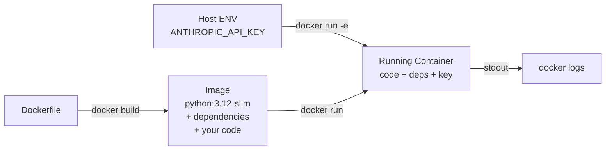

# Docker Basics for AI Apps

> If it runs in a container, it runs everywhere, including the server that paged you at 2 a.m.

**Type:** Build
**Languages:** Python
**Prerequisites:** Lesson 03 (first API call), Lesson 01 (dev environment)
**Time:** ~45 min
**Learning Objectives:**
- Write a minimal Dockerfile for a Python AI app
- Build and run a container that calls the Anthropic API
- Pass secrets at runtime using environment variables, never baked into the image
- Distinguish what lives on the host vs. inside the container
- Verify a running container's logs and exit behavior

---

## The Problem

You build an AI summarizer that works perfectly on your laptop. You send it to a colleague. It fails. Different Python version. Different `anthropic` package version. Different OS. The model config you set as an environment variable on your machine never made it to theirs.

This happens constantly in AI work because AI apps have more external dependencies than typical software: specific SDK versions, API keys, model configuration, sometimes GPU drivers. The "works on my machine" failure mode kills demos, wastes review cycles, and makes production deployments unpredictable.

Docker solves this by packaging your code, its exact dependencies, and its runtime configuration into a single unit that runs identically everywhere. You hand someone an image instead of a repo, and the conversation shifts from "did you install everything right?" to "what output did you get?"

The cost is one file: a Dockerfile. Writing it takes 10 minutes. Not writing it costs hours of environment debugging.

---

## The Concept

### Host vs. Container: What Lives Where

```
┌──────────────────────────────────────────────────────────────┐
│  HOST MACHINE                                                │
│                                                              │
│  ┌─────────────────────┐   ┌──────────────────────────────┐ │
│  │  Your filesystem    │   │  Environment variables       │ │
│  │  ~/projects/app/    │   │  ANTHROPIC_API_KEY=sk-...    │ │
│  │  ├── code/          │   │  HOME=/Users/you             │ │
│  │  │   └── main.py    │   └──────────────┬───────────────┘ │
│  │  ├── Dockerfile     │                  │                 │
│  │  └── requirements   │         docker run -e             │
│  └──────────┬──────────┘                  │                 │
│             │ COPY (at build time)         │                 │
│             ▼                             ▼                 │
│  ┌──────────────────────────────────────────────────────┐   │
│  │  CONTAINER (isolated filesystem + process)           │   │
│  │                                                      │   │
│  │  /app/main.py          (your code, copied in)        │   │
│  │  /usr/lib/python3.12/  (python + packages installed) │   │
│  │                                                      │   │
│  │  ENV: ANTHROPIC_API_KEY=sk-...  (injected at run)    │   │
│  │                                                      │   │
│  │  python /app/main.py   (your CMD)                    │   │
│  └──────────────────────────────────────────────────────┘   │
└──────────────────────────────────────────────────────────────┘
```

The key separation: the API key **never enters the image**. It flows from your host environment into the running container at `docker run` time. If you `docker push` the image to a registry, the key is not in it.

### The Build-Then-Run Sequence



### Why `python:3.12-slim` and Not `python:3.12`

The `-slim` variant strips development headers, test suites, and documentation from the base image. For AI API apps (no compilation, no system packages), slim is the right default: smaller image, faster push and pull, smaller attack surface. Use the full `python:3.12` only when a dependency needs to compile C extensions and slim fails during `pip install`.

---

## Build It

### Step 1: The App

Create `code/main.py`: a minimal Anthropic app that summarizes a hardcoded passage:

```python
import anthropic
import os

client = anthropic.Anthropic(api_key=os.environ["ANTHROPIC_API_KEY"])

TEXT = """
The transformer architecture, introduced in 2017, replaced recurrence with
self-attention. This allowed training to be fully parallelized across tokens,
which unlocked training on much larger datasets with more parameters. By 2020,
scaling these architectures produced models that generalized across tasks
without task-specific fine-tuning.
"""

def summarize(text: str) -> str:
    message = client.messages.create(
        model="claude-3-5-haiku-20241022",
        max_tokens=256,
        messages=[
            {
                "role": "user",
                "content": f"Summarize the following in one sentence:\n\n{text.strip()}"
            }
        ]
    )
    return message.content[0].text

if __name__ == "__main__":
    print("Input:")
    print(TEXT.strip())
    print("\nSummary:")
    print(summarize(TEXT))
```

### Step 2: The Requirements File

Create `code/requirements.txt`:

```
anthropic>=0.40.0
```

Pin to a minimum version, not an exact version. Exact pins cause conflicts when base images update. Minimum pins keep you current while preserving compatibility.

### Step 3: The Dockerfile

Create `code/Dockerfile`:

```dockerfile
FROM python:3.12-slim

WORKDIR /app

COPY requirements.txt .
RUN pip install --no-cache-dir -r requirements.txt

COPY main.py .

CMD ["python", "main.py"]
```

Order matters. `COPY requirements.txt` and `RUN pip install` come **before** `COPY main.py`. Docker caches each layer. If you change `main.py` but not `requirements.txt`, Docker reuses the cached pip install layer and rebuilds only the final COPY. Putting the pip install last means every code change reinstalls all packages.

### Step 4: Build the Image

From the `code/` directory:

```bash
docker build -t ai-summarizer .
```

`-t ai-summarizer` gives the image a name. `.` tells Docker to look for the Dockerfile in the current directory. You should see output like:

```
[1/4] FROM python:3.12-slim
[2/4] COPY requirements.txt .
[3/4] RUN pip install --no-cache-dir -r requirements.txt
[4/4] COPY main.py .
```

### Step 5: Run It

```bash
docker run -e ANTHROPIC_API_KEY=$ANTHROPIC_API_KEY ai-summarizer
```

`-e ANTHROPIC_API_KEY=$ANTHROPIC_API_KEY` reads the key from your current shell and injects it into the container's environment. The container's Python code reads it from `os.environ["ANTHROPIC_API_KEY"]`. The key is never written to any file.

Expected output:

```
Input:
The transformer architecture, introduced in 2017...

Summary:
The transformer architecture's 2017 introduction of self-attention over recurrence
enabled parallel training and large-scale pretraining, leading to generalizable
models by 2020.
```

> **Real-world check:** A junior engineer asks: "Why can't I just hardcode the API key in `main.py` inside the Dockerfile? It's just for local testing." The answer: Docker images are layered filesystems. Every `COPY` and `RUN` creates a permanent layer in the image history. Even if you delete the file in a later layer, the key is still visible in the earlier layer via `docker history --no-trunc`. If you ever push that image to Docker Hub or a company registry, the key is exposed. The `-e` flag keeps it outside the image entirely.

### Step 6: Check the Logs

If the container exits (which this one will after running), use:

```bash
docker logs $(docker ps -lq)
```

`docker ps -lq` returns the ID of the last container that ran. For a long-running service you would use `docker logs <container_id> -f` to follow the stream.

---

## Use It

The three Docker commands you use every day:

```bash
# Build an image from a Dockerfile in the current directory
docker build -t <name>:<tag> .

# Run a container, passing an env var from the host
docker run -e KEY=$KEY <image-name>

# Run a container and enter an interactive shell (debugging)
docker run -it --entrypoint /bin/bash <image-name>
```

For AI services that need to stay alive (FastAPI, for example), add the `-d` flag to run detached, and `-p` to map a port:

```bash
docker run -d -p 8000:8000 -e ANTHROPIC_API_KEY=$ANTHROPIC_API_KEY ai-service
```

The pattern is always: build once, run with runtime secrets injected. The image itself stays clean enough to push to any registry.

> **Perspective shift:** A senior engineer who has never used AI asks: "We already have a virtual environment, why do we need Docker?" Virtual environments isolate Python packages. Docker isolates the entire operating system, Python version, system libraries, and package set together. Virtual environments break when Python versions differ between machines or when a package needs a system library that is installed on one machine but not another. In AI work, you often hit this with packages that wrap C or CUDA code. Docker removes the whole class of "but it works on my machine."

---

## Ship It

The reusable artifact for this lesson is `outputs/skill-ai-dockerfile.md`: a parameterized Dockerfile template with explanatory annotations for any Python AI app.

See `outputs/skill-ai-dockerfile.md`.

---

## Evaluate It

**Does the container actually run?**

```bash
docker build -t ai-summarizer . && docker run -e ANTHROPIC_API_KEY=$ANTHROPIC_API_KEY ai-summarizer
echo "Exit code: $?"
```

Exit code 0 means success. Any non-zero code means the Python process crashed; check `docker logs`.

**Is the key absent from the image?**

```bash
docker history --no-trunc ai-summarizer | grep -i "api_key\|sk-"
```

This should return nothing. If it returns a match, a key was baked into a layer.

**Does layer caching work?**

Change only `main.py` (not `requirements.txt`) and rebuild:

```bash
docker build -t ai-summarizer .
```

You should see `CACHED` next to the `RUN pip install` step. If you see it reinstalling packages, the `COPY requirements.txt` / `RUN pip install` order is wrong.

**Does the container run on a different machine?**

Save the image and load it elsewhere:

```bash
docker save ai-summarizer | gzip > ai-summarizer.tar.gz
# On the other machine:
docker load < ai-summarizer.tar.gz
docker run -e ANTHROPIC_API_KEY=$ANTHROPIC_API_KEY ai-summarizer
```

If it runs, your environment is truly portable. That is the measure that matters.
