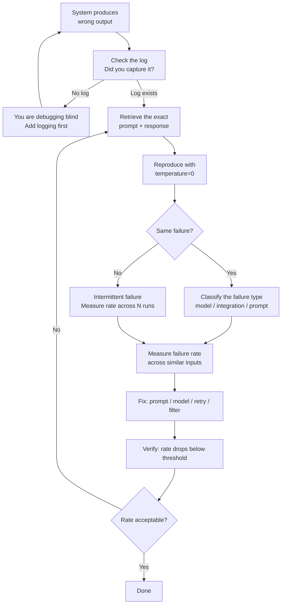

# تصحيح الأنظمة غير الحتمية (Non-Deterministic Systems)

> لا تستطيع إصلاح ما لا تستطيع قياسه. سجّل كل شيء. صنّف قبل أن تُصلح.

**النوع:** Build
**اللغات:** Python
**المتطلبات:** الدرس 03 (أول استدعاء API)، الدرس 04 (العقلية الاحتمالية)
**الوقت:** ~45 دقيقة
**أهداف التعلّم:**
- شرح كيف يختلف تصحيح AI عن تصحيح البرمجيات الحتمية
- بناء `DebugLogger` يلتقط كل prompt وresponse وزمن الاستجابة (latency) والتكلفة إلى ملف JSONL
- إعادة إنتاج الأعطال متى شئت باستخدام temperature=0 والـ prompts المسجّلة
- تصنيف الأعطال حسب النوع لا حسب الحالة الفردية لإيجاد المشاكل المنهجية
- الاستعلام عن سجلّ JSONL لإبراز أنماط الأعطال

---

## المشكلة

العطل البرمجي التقليدي قابل لإعادة الإنتاج. تستدعي دالّة بمدخل X، فتُرجع مخرجًا خاطئًا Y، تتتبّع الكود، تجد العطل، تُصلحه. تُشغّل الاختبار مرة أخرى: ينجح. انتهى الأمر.

أنظمة AI تتعطّل بشكل مختلف. أداة التلخيص لديك تُرجع إجابة خاطئة يوم الثلاثاء. تُشغّل نفس الاستعلام يوم الأربعاء فتُرجع الإجابة الصحيحة. تفحص الكود: لم يتغيّر شيء. النموذج احتمالي. ربما كان عطل الثلاثاء حدثًا بنسبة واحد من عشرة. وربما كان واحدًا من ألف. دون سجلّ، لا تستطيع أن تعرف.

هذا هو التحدّي المحوري في تصحيح AI: أنت تصحّح توزيعًا (distribution)، لا دالّة. السؤال ليس مجرّد "هل فشل؟"، بل "بأي معدّل يفشل، وعلى أي أنواع مدخلات، وهل المعدّل يتغيّر؟" دون سجلات، أنت تخمّن التوزيع بناءً على آخر ثلاثة مخرجات صادفت ملاحظتها.

المهندسون الفعّالون في أنظمة AI يشتركون في عادة واحدة: يسجّلون كل شيء من البداية. لا بعد مواجهة المشكلة. من أول استدعاء API. السجلّ هو قاعدة الأدلّة. دونه، تبدأ كل جلسة تصحيح من الصفر.

---

## المفهوم

### التصحيح الحتمي مقابل الاحتمالي

```
DETERMINISTIC (traditional software)       PROBABILISTIC (AI systems)
-----------------------------------------  ----------------------------------------
Same input → same output always            Same input → different output each run
Bug: wrong output for specific input       Bug: wrong output at unacceptable rate
Reproduce: re-run with same args           Reproduce: need temperature=0 + same prompt
Debug: read the stack trace                Debug: classify failures across many runs
Fix: change the code                       Fix: change prompt, temp, model, or retry
Verify: test passes                        Verify: failure rate drops below threshold
```

### حلقة تصحيح AI



### الأدوات الخمس

| الأداة | ماذا تفعل | لماذا تهمّ |
|------|-------------|----------------|
| سجّل كل استدعاء | التقاط prompt + response + latency + cost إلى JSONL | دون هذا، لا تستطيع إعادة إنتاج أو قياس أي شيء |
| أعد الإنتاج بـ temperature=0 | إعادة تشغيل الـ prompt المسجّل ذاته بـ temp=0 | يزيل العشوائية حتى تستطيع عزل العطل |
| صنّف حسب النوع | جمّع الأعطال: أخطاء النموذج، أخطاء التكامل، أخطاء الـ prompt | إصلاح حالة واحدة لا يعني شيئًا؛ إصلاح نوع يعني شيئًا |
| قِس معدّل العطل | عُدّ الأعطال / إجمالي الاستدعاءات لكل نوع | تحتاج معدّلاً، لا مجرّد وجود. واحد من 100 مقبول. واحد من 3 لا. |
| افصل مصادر العطل | هل النموذج مخطئ أم كودك مخطئ؟ | تحليل JSON خاطئ هو عطل تكامل. الهلوسة عطل نموذج. الإصلاحان مختلفان. |

---

## البناء

### الـ DebugLogger

```python
import anthropic
import json
import os
import time
from dataclasses import dataclass, asdict
from pathlib import Path
from typing import Optional

@dataclass
class CallRecord:
    timestamp: str
    model: str
    prompt: str
    response: str
    latency_ms: int
    input_tokens: int
    output_tokens: int
    cost_usd: float
    error: Optional[str] = None

    def to_jsonl(self) -> str:
        return json.dumps(asdict(self))


COST_PER_1K = {
    "claude-3-5-haiku-20241022": {"input": 0.001, "output": 0.005},
}

def estimate_cost(model: str, input_tokens: int, output_tokens: int) -> float:
    rates = COST_PER_1K.get(model, {"input": 0.001, "output": 0.005})
    return (input_tokens / 1000) * rates["input"] + (output_tokens / 1000) * rates["output"]


class DebugLogger:
    def __init__(self, log_path: str = "ai_calls.jsonl"):
        self.log_path = Path(log_path)
        self.client = anthropic.Anthropic(api_key=os.environ["ANTHROPIC_API_KEY"])

    def call(self, prompt: str, model: str = "claude-3-5-haiku-20241022",
             max_tokens: int = 256, temperature: float = 1.0) -> str:
        start = time.monotonic()
        error = None
        response_text = ""
        input_tokens = 0
        output_tokens = 0

        try:
            response = self.client.messages.create(
                model=model,
                max_tokens=max_tokens,
                temperature=temperature,
                messages=[{"role": "user", "content": prompt}]
            )
            response_text = response.content[0].text
            input_tokens = response.usage.input_tokens
            output_tokens = response.usage.output_tokens
        except Exception as e:
            error = str(e)
            response_text = ""

        latency_ms = int((time.monotonic() - start) * 1000)

        record = CallRecord(
            timestamp=time.strftime("%Y-%m-%dT%H:%M:%SZ", time.gmtime()),
            model=model,
            prompt=prompt,
            response=response_text,
            latency_ms=latency_ms,
            input_tokens=input_tokens,
            output_tokens=output_tokens,
            cost_usd=estimate_cost(model, input_tokens, output_tokens),
            error=error
        )

        with open(self.log_path, "a") as f:
            f.write(record.to_jsonl() + "\n")

        if error:
            raise RuntimeError(f"API call failed: {error}")

        return response_text
```

### الاستعلام عن السجلّ

```python
def load_log(log_path: str = "ai_calls.jsonl") -> list[dict]:
    path = Path(log_path)
    if not path.exists():
        return []
    with open(path) as f:
        return [json.loads(line) for line in f if line.strip()]


def failure_rate(records: list[dict]) -> float:
    if not records:
        return 0.0
    failures = sum(1 for r in records if r.get("error") is not None)
    return failures / len(records)


def slow_calls(records: list[dict], threshold_ms: int = 3000) -> list[dict]:
    return [r for r in records if r["latency_ms"] > threshold_ms]


def total_cost(records: list[dict]) -> float:
    return sum(r["cost_usd"] for r in records)


def print_summary(log_path: str = "ai_calls.jsonl") -> None:
    records = load_log(log_path)
    if not records:
        print("No records found.")
        return

    print(f"Total calls:    {len(records)}")
    print(f"Failure rate:   {failure_rate(records):.1%}")
    print(f"Avg latency:    {sum(r['latency_ms'] for r in records) / len(records):.0f} ms")
    print(f"Slow calls:     {len(slow_calls(records))} (>3000ms)")
    print(f"Total cost:     ${total_cost(records):.4f}")

    errors = [r for r in records if r.get("error")]
    if errors:
        print(f"\nErrors ({len(errors)}):")
        for r in errors[:5]:
            print(f"  [{r['timestamp']}] {r['error'][:80]}")
```

### تشغيله

```python
def main():
    logger = DebugLogger(log_path="ai_calls.jsonl")

    prompts = [
        "Summarize in one sentence: The transformer uses self-attention instead of recurrence.",
        "List three benefits of containerization for AI apps.",
        "What is the primary difference between a Python script and a FastAPI service?",
    ]

    print("Making 3 calls with logging...\n")
    for i, prompt in enumerate(prompts, 1):
        print(f"Call {i}: {prompt[:60]}...")
        try:
            response = logger.call(prompt)
            print(f"  Response: {response[:80]}...\n")
        except RuntimeError as e:
            print(f"  Error: {e}\n")

    print("─" * 50)
    print_summary("ai_calls.jsonl")
    print("\nLog written to ai_calls.jsonl")
    print("Each line is a JSON record with prompt, response, latency, and cost.")


if __name__ == "__main__":
    main()
```

> **اختبار من الواقع:** يقول مطوّر: "أنا أضيف الـ logging فقط حين يكون لديّ عطل لتصحيحه." ثمن هذه المقاربة أنه حين يظهر عطل في الإنتاج، لا تكون لديك أي بيانات تاريخية. لا تعرف إن كانت هذه أول مرة يحدث فيها العطل أم أنه ظلّ يفشل بنسبة 5% طوال أسبوعين. لا تعرف كيف بدا الـ prompt حين نجح مقابل حين فشل. الـ logging بعد وقوع المشكلة يعني أن كل جلسة تصحيح تبدأ من الصفر. الـ logging من البداية يعني أن التصحيح يصبح اختبار فرضيات في مقابل أدلّة.

---

## الاستخدام

ما إن يصبح لديك سجلّ، فالاستعلام عنه هو طريقتك لإيجاد المشاكل المنهجية.

**ابحث عن الـ prompts التي فشلت:**

```python
records = load_log("ai_calls.jsonl")
failures = [r for r in records if r.get("error")]
for f in failures:
    print(f["timestamp"], f["error"])
    print("Prompt was:", f["prompt"][:100])
    print()
```

**أعد إنتاج عطل بـ temperature=0:**

```python
logger = DebugLogger()
failed_record = failures[0]

# Reproduce exactly as it was, but deterministic
response = logger.call(
    prompt=failed_record["prompt"],
    model=failed_record["model"],
    temperature=0.0   # pin to deterministic
)
print("Reproduced:", response[:100])
```

**صنّف الأعطال: عطل نموذج مقابل عطل تكامل:**

```python
for r in failures:
    if r["error"] and "rate_limit" in r["error"].lower():
        print("INTEGRATION: rate limit hit")
    elif r["error"] and "connection" in r["error"].lower():
        print("INTEGRATION: network error")
    elif r["response"] and "I cannot" in r["response"]:
        print("MODEL: refusal - check your prompt")
    elif r["response"] and len(r["response"]) < 10:
        print("MODEL: suspiciously short - check max_tokens")
    else:
        print("UNKNOWN:", r["error"] or r["response"][:50])
```

التمييز مهمّ: أعطال التكامل (تجاوز حدود المعدّل، انتهاء المهلة، أخطاء المصادقة) تُصلَح في بنيتك التحتية. أعطال النموذج (الرفض، الهلوسة، الصيغة الخاطئة) تُصلَح في الـ prompt أو في أنبوب التقييم لديك.

> **نقلة في المنظور:** يسأل مهندس أقدم: "لدينا لوحات مراقبة (monitoring dashboards). فلماذا نحتاج سجلّ JSONL هذا؟" اللوحات تعرض مقاييس مجمّعة: زمن الاستجابة عند p99، ومعدّل الأخطاء، وعدد الطلبات. سجلّ JSONL يعرض الـ prompt والـ response الدقيقين للاستدعاء الوحيد الذي أنتج المخرَج الخاطئ الساعة 2:07 صباحًا يوم الثلاثاء. لا تستطيع إعادة إنتاج عطل من لوحة مراقبة. لكنك تستطيع إعادة إنتاجه من سجلّ. كلاهما موجود لغرض مختلف: اللوحات للتنبيه والاتجاهات، والسجلات لتحليل السبب الجذري.

---

## التسليم

المُخرَج القابل لإعادة الاستخدام لهذا الدرس هو `outputs/skill-ai-debug-playbook.md`: دليل مرجعي (playbook) لتشخيص أي عطل في نظام AI، مبنيّ حول الأدوات الخمس.

راجع `outputs/skill-ai-debug-playbook.md`.

---

## التقييم

**هل يلتقط الـ logger كل شيء؟**

شغّل ثلاثة استدعاءات، وتحقّق أن ملف JSONL فيه ثلاثة أسطر، كلٌّ منها بالحقول المتوقّعة:

```bash
python code/main.py
python -c "
import json
with open('ai_calls.jsonl') as f:
    for i, line in enumerate(f, 1):
        r = json.loads(line)
        assert all(k in r for k in ['timestamp','model','prompt','response','latency_ms','cost_usd'])
        print(f'Record {i}: {r[\"latency_ms\"]}ms, cost=${r[\"cost_usd\"]:.5f}')
print('All records valid.')
"
```

**هل تعيد temperature=0 إنتاج المخرجات؟**

شغّل نفس الـ prompt مرتين بـ temperature=0 وتحقّق من تطابق الاستجابتين:

```python
logger = DebugLogger()
p = "Name one advantage of Docker for AI apps."
r1 = logger.call(p, temperature=0.0)
r2 = logger.call(p, temperature=0.0)
assert r1 == r2, f"Expected identical: got\n{r1}\nvs\n{r2}"
print("Deterministic reproduction confirmed.")
```

**هل يرصد الملخّص اتجاهات التكلفة؟**

تحقّق من أن التكلفة الإجمالية تزداد بشكل رتيب (monotonically) كلما أجريت المزيد من الاستدعاءات:

```python
cost_before = total_cost(load_log("ai_calls.jsonl"))
logger.call("Short prompt.")
cost_after = total_cost(load_log("ai_calls.jsonl"))
assert cost_after > cost_before, "Cost should increase after a call"
print(f"Cost delta: ${cost_after - cost_before:.6f}")
```

**هل معدّل العطل قابل للقياس؟**

هذا أهمّ قياس. إذا كان نظامك سليمًا، فينبغي أن يكون معدّل العطل عند 0% أو قريبًا منها. إذا تجاوز 5%، فحقّق قبل النشر:

```bash
python -c "
from code.main import load_log, failure_rate
records = load_log('ai_calls.jsonl')
rate = failure_rate(records)
print(f'Failure rate: {rate:.1%} ({int(rate * len(records))}/{len(records)} calls)')
if rate > 0.05:
    print('WARNING: failure rate exceeds 5%')
else:
    print('OK')
"
```
