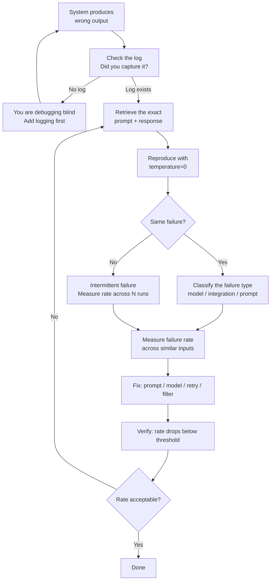

# Debugging Non-Deterministic Systems

> You cannot fix what you cannot measure. Log everything. Classify before you fix.

**Type:** Build
**Languages:** Python
**Prerequisites:** Lesson 03 (first API call), Lesson 04 (probabilistic mindset)
**Time:** ~45 min
**Learning Objectives:**
- Explain how AI debugging differs from deterministic software debugging
- Build a `DebugLogger` that captures every prompt, response, latency, and cost to a JSONL file
- Reproduce failures at will using temperature=0 and logged prompts
- Classify failures by type rather than by instance to find systematic problems
- Query a JSONL log to surface failure patterns

---

## The Problem

A traditional software bug is reproducible. You call a function with input X, it returns wrong output Y, you trace the code, you find the bug, you fix it. Run the test again: it passes. Done.

AI systems break differently. Your summarizer returns a wrong answer on Tuesday. You run the same query on Wednesday and it returns the right answer. You check the code: nothing changed. The model is probabilistic. The Tuesday failure might have been a one-in-ten event. It might have been a one-in-thousand event. Without a log, you cannot tell.

This is the central challenge of AI debugging: you are debugging a distribution, not a function. The question is never just "did it fail?" It is "at what rate does it fail, on what input types, and is the rate changing?" Without logs, you are guessing at the distribution based on the last three outputs you happened to notice.

The engineers who are effective in AI systems share one habit: they log everything from the start. Not after they hit a problem. From the first API call. The log is the evidence base. Without it, every debugging session starts from zero.

---

## The Concept

### Deterministic vs. Probabilistic Debugging

```
DETERMINISTIC (traditional software)       PROBABILISTIC (AI systems)
-----------------------------------------  ----------------------------------------
Same input → same output always            Same input → different output each run
Bug: wrong output for specific input       Bug: wrong output at unacceptable rate
Reproduce: re-run with same args           Reproduce: need temperature=0 + same prompt
Debug: read the stack trace                Debug: classify failures across many runs
Fix: change the code                       Fix: change prompt, temp, model, or retry
Verify: test passes                        Verify: failure rate drops below threshold
```

### The AI Debug Loop



### The Five Tools

| Tool | What it does | Why it matters |
|------|-------------|----------------|
| Log every call | Capture prompt + response + latency + cost to JSONL | Without this, you cannot reproduce or measure anything |
| Reproduce with temperature=0 | Re-run exact logged prompt with temp=0 | Removes randomness so you can isolate the failure |
| Classify by type | Group failures: model errors, integration errors, prompt errors | Fixing one instance means nothing; fixing a type means something |
| Measure failure rate | Count failures / total calls for each type | You need a rate, not a presence. 1 in 100 is fine. 1 in 3 is not. |
| Separate failure sources | Is the model wrong or is your code wrong? | A wrong JSON parse is an integration failure. A hallucination is a model failure. Different fixes. |

---

## Build It

### The DebugLogger

```python
import anthropic
import json
import os
import time
from dataclasses import dataclass, asdict
from pathlib import Path
from typing import Optional

@dataclass
class CallRecord:
    timestamp: str
    model: str
    prompt: str
    response: str
    latency_ms: int
    input_tokens: int
    output_tokens: int
    cost_usd: float
    error: Optional[str] = None

    def to_jsonl(self) -> str:
        return json.dumps(asdict(self))


COST_PER_1K = {
    "claude-3-5-haiku-20241022": {"input": 0.001, "output": 0.005},
}

def estimate_cost(model: str, input_tokens: int, output_tokens: int) -> float:
    rates = COST_PER_1K.get(model, {"input": 0.001, "output": 0.005})
    return (input_tokens / 1000) * rates["input"] + (output_tokens / 1000) * rates["output"]


class DebugLogger:
    def __init__(self, log_path: str = "ai_calls.jsonl"):
        self.log_path = Path(log_path)
        self.client = anthropic.Anthropic(api_key=os.environ["ANTHROPIC_API_KEY"])

    def call(self, prompt: str, model: str = "claude-3-5-haiku-20241022",
             max_tokens: int = 256, temperature: float = 1.0) -> str:
        start = time.monotonic()
        error = None
        response_text = ""
        input_tokens = 0
        output_tokens = 0

        try:
            response = self.client.messages.create(
                model=model,
                max_tokens=max_tokens,
                temperature=temperature,
                messages=[{"role": "user", "content": prompt}]
            )
            response_text = response.content[0].text
            input_tokens = response.usage.input_tokens
            output_tokens = response.usage.output_tokens
        except Exception as e:
            error = str(e)
            response_text = ""

        latency_ms = int((time.monotonic() - start) * 1000)

        record = CallRecord(
            timestamp=time.strftime("%Y-%m-%dT%H:%M:%SZ", time.gmtime()),
            model=model,
            prompt=prompt,
            response=response_text,
            latency_ms=latency_ms,
            input_tokens=input_tokens,
            output_tokens=output_tokens,
            cost_usd=estimate_cost(model, input_tokens, output_tokens),
            error=error
        )

        with open(self.log_path, "a") as f:
            f.write(record.to_jsonl() + "\n")

        if error:
            raise RuntimeError(f"API call failed: {error}")

        return response_text
```

### Querying the Log

```python
def load_log(log_path: str = "ai_calls.jsonl") -> list[dict]:
    path = Path(log_path)
    if not path.exists():
        return []
    with open(path) as f:
        return [json.loads(line) for line in f if line.strip()]


def failure_rate(records: list[dict]) -> float:
    if not records:
        return 0.0
    failures = sum(1 for r in records if r.get("error") is not None)
    return failures / len(records)


def slow_calls(records: list[dict], threshold_ms: int = 3000) -> list[dict]:
    return [r for r in records if r["latency_ms"] > threshold_ms]


def total_cost(records: list[dict]) -> float:
    return sum(r["cost_usd"] for r in records)


def print_summary(log_path: str = "ai_calls.jsonl") -> None:
    records = load_log(log_path)
    if not records:
        print("No records found.")
        return

    print(f"Total calls:    {len(records)}")
    print(f"Failure rate:   {failure_rate(records):.1%}")
    print(f"Avg latency:    {sum(r['latency_ms'] for r in records) / len(records):.0f} ms")
    print(f"Slow calls:     {len(slow_calls(records))} (>3000ms)")
    print(f"Total cost:     ${total_cost(records):.4f}")

    errors = [r for r in records if r.get("error")]
    if errors:
        print(f"\nErrors ({len(errors)}):")
        for r in errors[:5]:
            print(f"  [{r['timestamp']}] {r['error'][:80]}")
```

### Running It

```python
def main():
    logger = DebugLogger(log_path="ai_calls.jsonl")

    prompts = [
        "Summarize in one sentence: The transformer uses self-attention instead of recurrence.",
        "List three benefits of containerization for AI apps.",
        "What is the primary difference between a Python script and a FastAPI service?",
    ]

    print("Making 3 calls with logging...\n")
    for i, prompt in enumerate(prompts, 1):
        print(f"Call {i}: {prompt[:60]}...")
        try:
            response = logger.call(prompt)
            print(f"  Response: {response[:80]}...\n")
        except RuntimeError as e:
            print(f"  Error: {e}\n")

    print("─" * 50)
    print_summary("ai_calls.jsonl")
    print("\nLog written to ai_calls.jsonl")
    print("Each line is a JSON record with prompt, response, latency, and cost.")


if __name__ == "__main__":
    main()
```

> **Real-world check:** A developer says: "I only add logging when I have a bug to debug." The cost of this approach is that by the time you have a bug in production, you have no historical data. You don't know if this is the first time the failure happened or if it has been failing at 5% for two weeks. You don't know what the prompt looked like when it succeeded vs. failed. Logging after the fact means every debugging session starts from zero. Logging from the start means debugging is hypothesis testing against evidence.

---

## Use It

Once you have a log, querying it is how you find systematic problems.

**Find the prompts that failed:**

```python
records = load_log("ai_calls.jsonl")
failures = [r for r in records if r.get("error")]
for f in failures:
    print(f["timestamp"], f["error"])
    print("Prompt was:", f["prompt"][:100])
    print()
```

**Reproduce a failure with temperature=0:**

```python
logger = DebugLogger()
failed_record = failures[0]

# Reproduce exactly as it was, but deterministic
response = logger.call(
    prompt=failed_record["prompt"],
    model=failed_record["model"],
    temperature=0.0   # pin to deterministic
)
print("Reproduced:", response[:100])
```

**Classify failures as model vs. integration:**

```python
for r in failures:
    if r["error"] and "rate_limit" in r["error"].lower():
        print("INTEGRATION: rate limit hit")
    elif r["error"] and "connection" in r["error"].lower():
        print("INTEGRATION: network error")
    elif r["response"] and "I cannot" in r["response"]:
        print("MODEL: refusal - check your prompt")
    elif r["response"] and len(r["response"]) < 10:
        print("MODEL: suspiciously short - check max_tokens")
    else:
        print("UNKNOWN:", r["error"] or r["response"][:50])
```

The distinction matters: integration failures (rate limits, timeouts, auth errors) are fixed in your infrastructure. Model failures (refusals, hallucinations, wrong format) are fixed in your prompt or evaluation pipeline.

> **Perspective shift:** A senior engineer asks: "We have monitoring dashboards. Why do we need this JSONL log?" Dashboards show aggregate metrics: p99 latency, error rate, request count. The JSONL log shows the exact prompt and response for the one call that produced the wrong output at 2:07 a.m. on Tuesday. You cannot reproduce a failure from a dashboard. You can reproduce it from a log. Both exist for different purposes: dashboards for alerting and trends, logs for root-cause analysis.

---

## Ship It

The reusable artifact for this lesson is `outputs/skill-ai-debug-playbook.md`: a reference playbook for diagnosing any AI system failure, structured around the five tools.

See `outputs/skill-ai-debug-playbook.md`.

---

## Evaluate It

**Does the logger capture everything?**

Run three calls, check the JSONL file has three lines, each with the expected fields:

```bash
python code/main.py
python -c "
import json
with open('ai_calls.jsonl') as f:
    for i, line in enumerate(f, 1):
        r = json.loads(line)
        assert all(k in r for k in ['timestamp','model','prompt','response','latency_ms','cost_usd'])
        print(f'Record {i}: {r[\"latency_ms\"]}ms, cost=${r[\"cost_usd\"]:.5f}')
print('All records valid.')
"
```

**Does temperature=0 reproduce outputs?**

Run the same prompt twice at temperature=0 and verify identical responses:

```python
logger = DebugLogger()
p = "Name one advantage of Docker for AI apps."
r1 = logger.call(p, temperature=0.0)
r2 = logger.call(p, temperature=0.0)
assert r1 == r2, f"Expected identical: got\n{r1}\nvs\n{r2}"
print("Deterministic reproduction confirmed.")
```

**Does the summary catch cost trends?**

Verify that total cost increases monotonically as you make more calls:

```python
cost_before = total_cost(load_log("ai_calls.jsonl"))
logger.call("Short prompt.")
cost_after = total_cost(load_log("ai_calls.jsonl"))
assert cost_after > cost_before, "Cost should increase after a call"
print(f"Cost delta: ${cost_after - cost_before:.6f}")
```

**Is the failure rate measurable?**

This is the most important measurement. If your system is healthy, failure rate should be at or near 0%. If it is above 5%, investigate before deploying:

```bash
python -c "
from code.main import load_log, failure_rate
records = load_log('ai_calls.jsonl')
rate = failure_rate(records)
print(f'Failure rate: {rate:.1%} ({int(rate * len(records))}/{len(records)} calls)')
if rate > 0.05:
    print('WARNING: failure rate exceeds 5%')
else:
    print('OK')
"
```
