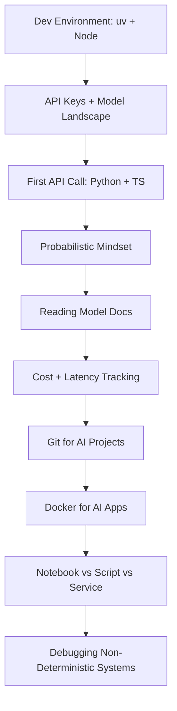

# Phase 00: Setup & the Applied AI Mindset

10 lessons. ~8 hours. Get your environment right and make the single most important mental shift in AI engineering: from deterministic to probabilistic thinking.

## The through-line

Most engineers who struggle with AI systems are not struggling with models. They are struggling with the mental model mismatch: treating a probabilistic sampler like a deterministic function. This phase fixes that while also getting you tooled up correctly so you never fight your environment again.

## What you build

## Lessons

| # | Lesson | Artifact | Time |
|---|--------|----------|------|
| 01 | Dev Environment: uv, Node/TS | `skill-dev-environment.md` | ~45 min |
| 02 | API Keys, Providers & the 2026 Model Landscape | `prompt-model-selection-guide.md` | ~45 min |
| 03 | First API Call: Python + TypeScript, Streaming, Tokens | `skill-first-api-call.md` | ~45 min |
| 04 | The Probabilistic Mindset: Why Deterministic Thinking Breaks | `prompt-probabilistic-mindset.md` | ~45 min |
| 05 | Reading Model Docs: Context Windows, Pricing, Limits | `prompt-model-doc-checklist.md` | ~30 min |
| 06 | Cost & Latency from Line One | `skill-cost-latency-tracker.md` | ~45 min |
| 07 | Git + Running the Lesson Repo | `skill-ai-project-git-workflow.md` | ~30 min |
| 08 | Docker Basics for AI Apps | `skill-ai-dockerfile.md` | ~45 min |
| 09 | Notebook vs Script vs Service | `prompt-delivery-format-decision.md` | ~30 min |
| 10 | Debugging Non-Deterministic Systems | `skill-ai-debug-playbook.md` | ~45 min |

## Prerequisites

None. This is the starting point. You need Python installed and an Anthropic API key.

## Stack

- Python + `uv` (replaces pip/venv/pyenv)
- TypeScript + Node (L01, L03)
- `anthropic` SDK
- Docker (L08)
- No frameworks — raw API calls only
