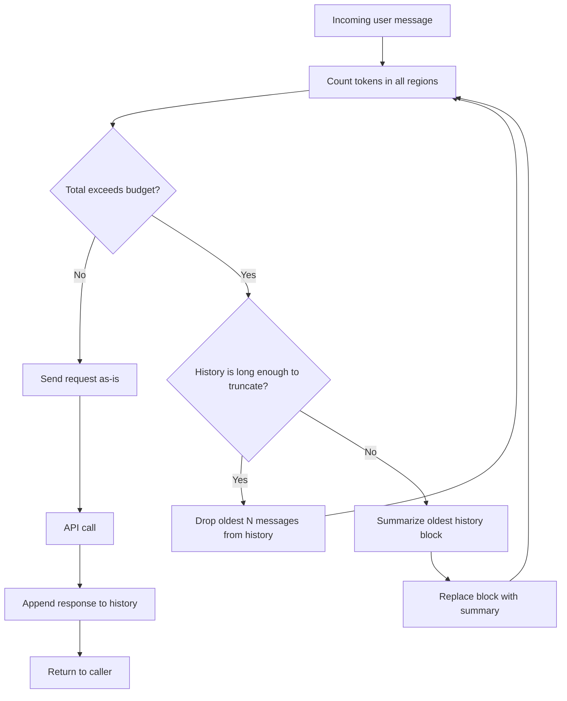

# إدارة نافذة الـ Context

> أنت لا تنفد من الـ context. بل تفقده بصمت. أدِره قبل أن يديرك.

**النوع:** بناء
**اللغات:** Python
**المتطلبات:** الدرس 01 (تشريح الطلب)، الدرس 03 (Few-Shot و Chain-of-Thought)، الدرس 04 (هندسة الـ Context)
**الوقت:** ~45 دقيقة
**أهداف التعلّم:**
- عدّ الـ tokens قبل إرسال الطلب، لا بعد تلقّي خطأ
- نمذجة نافذة الـ context كميزانية ذات مناطق مسمّاة ومُحدَّدة الحجم
- تنفيذ استراتيجيتي الاقتطاع والتلخيص الاحتياطية (fallback)
- استخدام API عدّ الـ tokens في Anthropic SDK لقياس امتلاء الـ context
- شرح لماذا يكون الاقتطاع الصامت أسوأ من خطأ صريح

---

## المشكلة

روبوت الدردشة لديك يعمل بشكل مثالي في الاختبار. في الإنتاج، بعد 20 دورًا من المحادثة، يبدأ بنسيان أشياء قالها المستخدم قبل ثلاث دقائق. تأتي تذاكر الدعم: "لقد توقف عن تذكر اسمي." تسجّل الطلبات فلا تجد شيئًا خاطئًا بشكل واضح. أعاد الـ API الرمز 200. أجاب النموذج. لكن أقدم الرسائل اختفت.

نافذة الـ context ليست طابورًا (queue) يرمي خطأً حين يمتلئ. بل هي مخزن مؤقت (buffer) يُسقِط بصمت أقدم المحتوى حين تتجاوز الحد. لا يخبرك النموذج بأنه يفتقد معلومة. بل يجيب فقط دونها. هذا يجعل فيضان الـ context واحدًا من أخبث أخطاء الإنتاج في تطبيقات الـ LLM: صامت، متقطّع، وشديد الاعتماد على مدى إسهاب المستخدم المعيّن.

الحل هو التعامل مع نافذة الـ context كميزانية. سمِّ المناطق. ضع حدودًا. عُدّ قبل الإرسال. اقتطع بشكل صريح بدلًا من ترك الـ API يفعل ذلك بصمت. يبني هذا الدرس البنية التحتية لذلك.

---

## المفهوم

### نافذة الـ Context كميزانية

نافذة context بحجم 200,000 token ليست لوحة بيضاء. في أي نظام إنتاجي تُقسَّم إلى مناطق، لكل منها غرض وكلفة:

```
CONTEXT WINDOW (e.g., 200,000 tokens total)
+--------------------------------------------------+
| SYSTEM PROMPT          ~500-2000 tokens          |
| Persona, instructions, guardrails               |
+--------------------------------------------------+
| CONVERSATION HISTORY   variable (managed)        |
| Previous turns, oldest dropped first            |
+--------------------------------------------------+
| RETRIEVED DOCUMENTS    ~2000-8000 tokens         |
| RAG results, tool outputs, injected facts       |
+--------------------------------------------------+
| CURRENT USER QUERY     ~50-500 tokens            |
| The message you are about to answer             |
+--------------------------------------------------+
| RESERVED FOR OUTPUT    ~1000-4000 tokens         |
| max_tokens setting, never fill this region      |
+--------------------------------------------------+
```

يجب أن يبقى مجموع كل المناطق دون حد الـ context للنموذج. إن تجاوزته، يُسقَط شيء ما. السؤال هو: أي منطقة تريد أن تديرها، وكيف؟



### لماذا يحدث الاقتطاع الصامت

حين ترسل مصفوفة messages مجموعها أكثر من الـ tokens التي يدعمها النموذج، فإن معظم المزوّدين إما يعيدون خطأً (أكثر أمانًا) أو يقتطعون بصمت من بداية المحادثة (خطير). يعيد Claude خطأً. أما OpenAI فقد اقتطع تاريخيًا بصمت.

في كلتا الحالتين، أنت لا تريد أن يقرر المزوّد ما الذي يُسقَط. لا يعرف المزوّد أن "my name is Sarah" في الدور 1 أهم للاحتفاظ به من "what is the weather like today?" في الدور 5. أنت تعرف. تمنحك إدارة الميزانية الصريحة ذلك التحكم.

### ثلاث استراتيجيات اقتطاع

| Strategy | How it works | When to use |
|---|---|---|
| **Sliding window** | Keep only the last N messages | Simple stateless sessions; okay to forget early context |
| **Oldest-first drop** | Remove oldest messages until budget fits | When all messages are roughly equal importance |
| **Summarization fallback** | Compress oldest block into a summary, retain summary | When early context matters (user profile, task state) |

للتلخيص زمن استجابة (latency) أعلى (استدعاء LLM إضافي) لكنه يحفظ الإشارة. استخدمه حين لا يمكنك تحمّل فقدان السياق المبكر.

---

## البناء

### Step 1: Count Tokens Before Sending

يوفّر Anthropic SDK نقطة نهاية متزامنة (synchronous) لعدّ الـ tokens. استخدمها لقياس كم token ستستهلكه رسائلك قبل إجراء استدعاء الـ API الفعلي:

```python
import anthropic
import os

client = anthropic.Anthropic(api_key=os.environ["ANTHROPIC_API_KEY"])
MODEL = "claude-3-5-haiku-20241022"


def count_message_tokens(system: str, messages: list[dict]) -> int:
    """
    Count tokens for a messages array using the Anthropic token-counting API.
    Returns the total input token count.
    """
    response = client.messages.count_tokens(
        model=MODEL,
        system=system,
        messages=messages,
    )
    return response.input_tokens
```

لا يولّد هذا الاستدعاء استجابة. وهو رخيص. استدعِه قبل كل طلب API مهم لقياس المتّسع المتاح (headroom).

### Step 2: Define the Budget

مثّل ميزانية الـ context كمناطق مسمّاة صريحة بحدود صارمة:

```python
from dataclasses import dataclass, field


@dataclass
class ContextBudget:
    """
    Token budget for a single request.
    All values in tokens.
    """
    model_limit: int = 200_000       # Claude 3.5 Haiku limit
    system_max: int = 2_000          # cap on system prompt
    history_max: int = 40_000        # rolling conversation history
    docs_max: int = 8_000            # retrieved documents / tool outputs
    query_max: int = 2_000           # current user message
    output_reserve: int = 4_000      # never touch: reserved for completion

    @property
    def total_input_max(self) -> int:
        return self.model_limit - self.output_reserve

    def fits(self, token_count: int) -> bool:
        return token_count <= self.total_input_max
```

وجود الميزانية كـ dataclass يعني أنه يمكنك ضبط المناطق لكل نشر (deployment) (روبوت دردشة موجّه للعملاء يحتاج احتياطي مخرجات أكبر من خط أنابيب استخراج).

### Step 3: The Context Manager Class

```python
class ContextManager:
    """
    Manages conversation history within a token budget.

    Usage:
        cm = ContextManager(system_prompt="You are a helpful assistant.")
        cm.add_user("Hello, my name is Sarah.")
        response_text = cm.complete()
        cm.add_assistant(response_text)
    """

    def __init__(
        self,
        system_prompt: str,
        budget: ContextBudget | None = None,
        summarize_when_full: bool = False,
    ):
        self.system = system_prompt
        self.budget = budget or ContextBudget()
        self.summarize_when_full = summarize_when_full
        self.messages: list[dict] = []

    def add_user(self, content: str) -> None:
        self.messages.append({"role": "user", "content": content})

    def add_assistant(self, content: str) -> None:
        self.messages.append({"role": "assistant", "content": content})

    def token_count(self) -> int:
        """Count current total input tokens."""
        if not self.messages:
            return 0
        return count_message_tokens(self.system, self.messages)

    def enforce_budget(self) -> int:
        """
        Trim oldest messages until the budget fits.
        Returns number of messages dropped.
        """
        dropped = 0
        while self.messages and not self.budget.fits(self.token_count()):
            if self.summarize_when_full and len(self.messages) >= 6:
                dropped += self._summarize_oldest_block()
                break
            else:
                # Drop oldest two messages (user + assistant pair)
                remove_count = min(2, len(self.messages))
                self.messages = self.messages[remove_count:]
                dropped += remove_count

        return dropped

    def _summarize_oldest_block(self, block_size: int = 4) -> int:
        """
        Summarize the oldest `block_size` messages into a single system note.
        Returns number of messages replaced.
        """
        if len(self.messages) < block_size:
            return 0

        block = self.messages[:block_size]
        rest = self.messages[block_size:]

        # Format block as a conversation transcript for the summarizer
        transcript = "\n".join(
            f"{m['role'].upper()}: {m['content']}" for m in block
        )

        summary_response = client.messages.create(
            model=MODEL,
            max_tokens=500,
            messages=[
                {
                    "role": "user",
                    "content": (
                        "Summarize this conversation segment in 2-3 sentences, "
                        "preserving key facts (names, decisions, constraints):\n\n"
                        + transcript
                    ),
                }
            ],
        )
        summary_text = summary_response.content[0].text

        summary_message = {
            "role": "user",
            "content": f"[Earlier conversation summary: {summary_text}]",
        }

        self.messages = [summary_message] + rest
        return block_size - 1  # replaced block_size messages with 1

    def complete(self, max_tokens: int = 1024) -> str:
        """
        Enforce budget, then call the API.
        Returns the assistant's response text.
        """
        dropped = self.enforce_budget()
        if dropped > 0:
            print(f"[ContextManager] Dropped/compressed {dropped} messages to fit budget")

        response = client.messages.create(
            model=MODEL,
            max_tokens=max_tokens,
            system=self.system,
            messages=self.messages,
        )
        return response.content[0].text
```

> **اختبار من الواقع:** يقول عميل: "روبوت الدردشة لديكم نسي أننا اتفقنا أصلًا على ميزانية 5,000$ للمشروع. والآن يقترح خيارات أغلى بكثير." تتحقق من السجلات. كانت المحادثة بطول 45 دورًا وحدث نقاش الميزانية في الدور 3. ماذا حدث، وما الذي ستغيّره في ContextManager لمنع تكراره؟

### Step 4: Wire It Up

```python
def demo_conversation():
    """
    Simulate a long conversation that will eventually hit the budget.
    Watch what gets dropped and when.
    """
    system = "You are a helpful project planning assistant."
    cm = ContextManager(system, summarize_when_full=True)

    turns = [
        "My name is Sarah and I am planning a product launch.",
        "The budget is $50,000 and the deadline is Q3.",
        "We need to cover both digital and physical channels.",
        "Who should I loop in from the engineering team?",
        "What about legal review for the marketing materials?",
        "Can you summarize the constraints we have so far?",
    ]

    for user_msg in turns:
        print(f"\nUSER: {user_msg}")
        cm.add_user(user_msg)
        tokens_before = cm.token_count()
        response = cm.complete()
        cm.add_assistant(response)
        tokens_after = cm.token_count()
        print(f"ASSISTANT: {response[:200]}")
        print(f"[tokens: {tokens_before} -> {tokens_after} | history: {len(cm.messages)} messages]")


if __name__ == "__main__":
    demo_conversation()
```

---

## الاستخدام

نقطة نهاية عدّ الـ tokens في Anthropic SDK هي البِنْية الأولية (primitive) الإنتاجية. تستدعي `client.messages.count_tokens()` قبل أي استدعاء تهمّ فيه الميزانية. يكشف الـ SDK أيضًا عن `usage` في كل استجابة، ما يعطيك أعداد tokens المدخلات والمخرجات الفعلية بعد الاستدعاء:

```python
response = client.messages.create(
    model=MODEL,
    max_tokens=1024,
    system="You are a helpful assistant.",
    messages=[{"role": "user", "content": "Hello, what can you do?"}],
)

# Actual usage after the call
print(f"Input tokens used:  {response.usage.input_tokens}")
print(f"Output tokens used: {response.usage.output_tokens}")
print(f"Total:              {response.usage.input_tokens + response.usage.output_tokens}")
```

النمط على نطاق واسع هو استخدام `count_tokens` قبل الإقلاع (pre-flight) (للتحكم أو الاقتطاع) و `usage` بعد الاستدعاء (لمحاسبة الكلفة). لا تعتمد أبدًا على عدّ الأحرف أو عدّ الكلمات كبديل عن الـ tokens. فهي خاطئة بنسبة 20-40% للنثر الإنجليزي النمطي وأسوأ بكثير للشيفرة أو الكتابات غير اللاتينية.

```python
# Common mistake: estimating tokens by character count
def estimate_tokens_wrong(text: str) -> int:
    return len(text) // 4  # This is a rough heuristic, not a count

# Correct: use the API
def count_tokens_correct(text: str) -> int:
    result = client.messages.count_tokens(
        model=MODEL,
        messages=[{"role": "user", "content": text}],
    )
    return result.input_tokens
```

> **نقلة في المنظور:** يقول قائدك التقني: "لدينا أصلًا نافذة context بحجم 200K. لماذا قد نقتطع أصلًا؟ فقط أرسل كل شيء في كل مرة ودع النموذج يكتشف ما هو ذو صلة." ماذا ستقول له بشأن الكلفة وزمن الاستجابة والحدود العملية للـ context الطويل جدًا؟

---

## التسليم

الأثر (artifact) القابل لإعادة الاستخدام لهذا الدرس هو `outputs/skill-context-window-manager.md`. يحتوي على صنف `ContextManager` كمكوّن جاهز للإدراج مع تعليمات لدمجه في أي تطبيق متعدد الأدوار.

لاستخدام الأثر في مشروع جديد:
1. انسخ صنف `ContextManager` و dataclass الـ `ContextBudget` إلى شيفرتك
2. اضبط `model_limit` ليطابق النموذج الذي اخترته
3. اضبط `output_reserve` على قيمة `max_tokens` لديك
4. اضبط `summarize_when_full=True` للجلسات التي يجب فيها حفظ السياق المبكر
5. استدعِ `cm.token_count()` في مراقبتك لتتبّع استغلال الميزانية عبر الزمن

---

## التقييم

**Check 1: Verify truncation fires at the right threshold.**
اكتب اختبار وحدة يملأ `cm.messages` برسائل اصطناعية حتى يتجاوز `token_count()` قيمة `budget.total_input_max`. تأكّد (assert) من أن `enforce_budget()` يعيد عدد إسقاط غير صفري وأن `token_count()` بعد التطبيق أدنى من الحد. هذا هو العقد الأساسي.

**Check 2: Verify early facts survive summarization.**
في محادثة تُذكر فيها "my budget is $50,000" في الدور 1، أضِف 20 دورًا آخر، فعّل التلخيص، ثم اسأل "what was the budget?". ينبغي أن يجيب النموذج بشكل صحيح. إن لم يفعل، فإن prompt التلخيص يفقد حقائق حرجة. اضبط تعليمة التلخيص.

**Check 3: Track budget utilization in production.**
سجّل `cm.token_count() / budget.total_input_max` كمقياس على كل استدعاء API. أطلِق تنبيهًا حين يتجاوز 0.80 (ممتلئ بنسبة 80%). إن بلغت جلستك المتوسطة 80% بعد 5 أدوار فقط، فإن system prompt أو حقن المستندات لديك كبير جدًا. إن لم يتجاوز أبدًا 20%، فقد تكون تحتفظ باحتياطي زائد ويمكنك زيادة الاحتفاظ بالسجل.

**Check 4: Cost impact of summarization.**
كل استدعاء تلخيص يكلّف tokens. سجّل استدعاءات التلخيص بشكل منفصل. إن كانت تضيف أكثر من 5% إلى كلفة الـ tokens الإجمالية، فزِد ميزانية السجل أو بدّل إلى نموذج أرخص (مثل `claude-3-haiku-20240307`) للتلخيص فقط.
