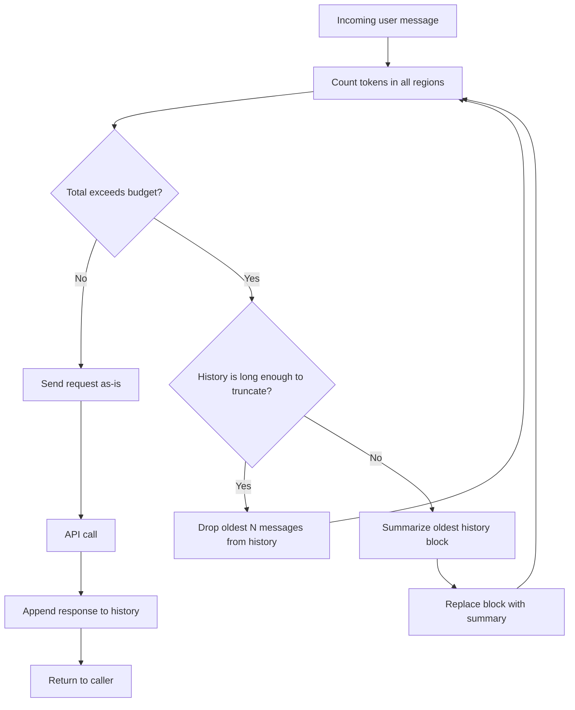

# Context-Window Management

> You do not run out of context. You silently lose it. Manage it before it manages you.

**Type:** Build
**Languages:** Python
**Prerequisites:** Lesson 01 (Request Anatomy), Lesson 03 (Few-Shot and Chain-of-Thought), Lesson 04 (Context Engineering)
**Time:** ~45 min
**Learning Objectives:**
- Count tokens before sending a request, not after getting an error
- Model the context window as a budget with named, sized regions
- Implement truncation and summarization fallback strategies
- Use the Anthropic SDK's token-counting API to measure context fill
- Explain why silent truncation is worse than an explicit error

---

## The Problem

Your chatbot works perfectly in testing. In production, after 20 turns of conversation, it starts forgetting things the user said three minutes ago. Support tickets come in: "It just stopped remembering my name." You log the requests and find nothing obviously wrong. The API returned 200. The model answered. But the oldest messages are gone.

The context window is not a queue that throws an error when it fills. It is a buffer that silently drops the oldest content when you exceed the limit. The model does not tell you it is missing information. It just answers without it. This makes context overflow one of the most insidious production bugs in LLM applications: quiet, intermittent, and highly dependent on how verbose the specific user is.

The fix is to treat the context window as a budget. Name the regions. Set limits. Count before sending. Truncate explicitly rather than letting the API do it silently. This lesson builds the infrastructure for that.

---

## The Concept

### The Context Window as a Budget

A 200,000-token context window is not a blank canvas. In any production system it is divided into regions, each with a purpose and a cost:

```
CONTEXT WINDOW (e.g., 200,000 tokens total)
+--------------------------------------------------+
| SYSTEM PROMPT          ~500-2000 tokens          |
| Persona, instructions, guardrails               |
+--------------------------------------------------+
| CONVERSATION HISTORY   variable (managed)        |
| Previous turns, oldest dropped first            |
+--------------------------------------------------+
| RETRIEVED DOCUMENTS    ~2000-8000 tokens         |
| RAG results, tool outputs, injected facts       |
+--------------------------------------------------+
| CURRENT USER QUERY     ~50-500 tokens            |
| The message you are about to answer             |
+--------------------------------------------------+
| RESERVED FOR OUTPUT    ~1000-4000 tokens         |
| max_tokens setting, never fill this region      |
+--------------------------------------------------+
```

The total of all regions must stay below the model's context limit. If they exceed it, something gets dropped. The question is: which region do you want to manage, and how?



### Why Silent Truncation Happens

When you send a messages array that totals more tokens than the model supports, most providers either return an error (safer) or silently truncate from the start of the conversation (dangerous). Claude returns an error. OpenAI has historically truncated silently.

Either way, you do not want the provider deciding what gets dropped. The provider does not know that "my name is Sarah" at turn 1 is more important to retain than "what is the weather like today?" at turn 5. You do. Explicit budget management gives you that control.

### Three Truncation Strategies

| Strategy | How it works | When to use |
|---|---|---|
| **Sliding window** | Keep only the last N messages | Simple stateless sessions; okay to forget early context |
| **Oldest-first drop** | Remove oldest messages until budget fits | When all messages are roughly equal importance |
| **Summarization fallback** | Compress oldest block into a summary, retain summary | When early context matters (user profile, task state) |

Summarization has higher latency (an extra LLM call) but preserves signal. Use it when you cannot afford to lose early context.

---

## Build It

### Step 1: Count Tokens Before Sending

The Anthropic SDK provides a synchronous token-counting endpoint. Use it to measure how many tokens your messages will consume before making the actual API call:

```python
import anthropic
import os

client = anthropic.Anthropic(api_key=os.environ["ANTHROPIC_API_KEY"])
MODEL = "claude-3-5-haiku-20241022"


def count_message_tokens(system: str, messages: list[dict]) -> int:
    """
    Count tokens for a messages array using the Anthropic token-counting API.
    Returns the total input token count.
    """
    response = client.messages.count_tokens(
        model=MODEL,
        system=system,
        messages=messages,
    )
    return response.input_tokens
```

This call does not generate a response. It is cheap. Call it before every significant API request to measure headroom.

### Step 2: Define the Budget

Represent the context budget as explicit named regions with hard limits:

```python
from dataclasses import dataclass, field


@dataclass
class ContextBudget:
    """
    Token budget for a single request.
    All values in tokens.
    """
    model_limit: int = 200_000       # Claude 3.5 Haiku limit
    system_max: int = 2_000          # cap on system prompt
    history_max: int = 40_000        # rolling conversation history
    docs_max: int = 8_000            # retrieved documents / tool outputs
    query_max: int = 2_000           # current user message
    output_reserve: int = 4_000      # never touch: reserved for completion

    @property
    def total_input_max(self) -> int:
        return self.model_limit - self.output_reserve

    def fits(self, token_count: int) -> bool:
        return token_count <= self.total_input_max
```

Having the budget as a dataclass means you can tune regions per deployment (a customer-facing chatbot needs more output reserve than an extraction pipeline).

### Step 3: The Context Manager Class

```python
class ContextManager:
    """
    Manages conversation history within a token budget.

    Usage:
        cm = ContextManager(system_prompt="You are a helpful assistant.")
        cm.add_user("Hello, my name is Sarah.")
        response_text = cm.complete()
        cm.add_assistant(response_text)
    """

    def __init__(
        self,
        system_prompt: str,
        budget: ContextBudget | None = None,
        summarize_when_full: bool = False,
    ):
        self.system = system_prompt
        self.budget = budget or ContextBudget()
        self.summarize_when_full = summarize_when_full
        self.messages: list[dict] = []

    def add_user(self, content: str) -> None:
        self.messages.append({"role": "user", "content": content})

    def add_assistant(self, content: str) -> None:
        self.messages.append({"role": "assistant", "content": content})

    def token_count(self) -> int:
        """Count current total input tokens."""
        if not self.messages:
            return 0
        return count_message_tokens(self.system, self.messages)

    def enforce_budget(self) -> int:
        """
        Trim oldest messages until the budget fits.
        Returns number of messages dropped.
        """
        dropped = 0
        while self.messages and not self.budget.fits(self.token_count()):
            if self.summarize_when_full and len(self.messages) >= 6:
                dropped += self._summarize_oldest_block()
                break
            else:
                # Drop oldest two messages (user + assistant pair)
                remove_count = min(2, len(self.messages))
                self.messages = self.messages[remove_count:]
                dropped += remove_count

        return dropped

    def _summarize_oldest_block(self, block_size: int = 4) -> int:
        """
        Summarize the oldest `block_size` messages into a single system note.
        Returns number of messages replaced.
        """
        if len(self.messages) < block_size:
            return 0

        block = self.messages[:block_size]
        rest = self.messages[block_size:]

        # Format block as a conversation transcript for the summarizer
        transcript = "\n".join(
            f"{m['role'].upper()}: {m['content']}" for m in block
        )

        summary_response = client.messages.create(
            model=MODEL,
            max_tokens=500,
            messages=[
                {
                    "role": "user",
                    "content": (
                        "Summarize this conversation segment in 2-3 sentences, "
                        "preserving key facts (names, decisions, constraints):\n\n"
                        + transcript
                    ),
                }
            ],
        )
        summary_text = summary_response.content[0].text

        summary_message = {
            "role": "user",
            "content": f"[Earlier conversation summary: {summary_text}]",
        }

        self.messages = [summary_message] + rest
        return block_size - 1  # replaced block_size messages with 1

    def complete(self, max_tokens: int = 1024) -> str:
        """
        Enforce budget, then call the API.
        Returns the assistant's response text.
        """
        dropped = self.enforce_budget()
        if dropped > 0:
            print(f"[ContextManager] Dropped/compressed {dropped} messages to fit budget")

        response = client.messages.create(
            model=MODEL,
            max_tokens=max_tokens,
            system=self.system,
            messages=self.messages,
        )
        return response.content[0].text
```

> **Real-world check:** A customer says: "Your chatbot forgot we already agreed on a $5,000 budget for the project. Now it is suggesting options that cost way more." You check the logs. The conversation was 45 turns long and the budget discussion happened at turn 3. What happened, and what would you change in the ContextManager to prevent it from happening again?

### Step 4: Wire It Up

```python
def demo_conversation():
    """
    Simulate a long conversation that will eventually hit the budget.
    Watch what gets dropped and when.
    """
    system = "You are a helpful project planning assistant."
    cm = ContextManager(system, summarize_when_full=True)

    turns = [
        "My name is Sarah and I am planning a product launch.",
        "The budget is $50,000 and the deadline is Q3.",
        "We need to cover both digital and physical channels.",
        "Who should I loop in from the engineering team?",
        "What about legal review for the marketing materials?",
        "Can you summarize the constraints we have so far?",
    ]

    for user_msg in turns:
        print(f"\nUSER: {user_msg}")
        cm.add_user(user_msg)
        tokens_before = cm.token_count()
        response = cm.complete()
        cm.add_assistant(response)
        tokens_after = cm.token_count()
        print(f"ASSISTANT: {response[:200]}")
        print(f"[tokens: {tokens_before} -> {tokens_after} | history: {len(cm.messages)} messages]")


if __name__ == "__main__":
    demo_conversation()
```

---

## Use It

The Anthropic SDK's token-counting endpoint is the production primitive. You call `client.messages.count_tokens()` before any call where budget matters. The SDK also exposes `usage` on every response, giving you actual input and output token counts after the call:

```python
response = client.messages.create(
    model=MODEL,
    max_tokens=1024,
    system="You are a helpful assistant.",
    messages=[{"role": "user", "content": "Hello, what can you do?"}],
)

# Actual usage after the call
print(f"Input tokens used:  {response.usage.input_tokens}")
print(f"Output tokens used: {response.usage.output_tokens}")
print(f"Total:              {response.usage.input_tokens + response.usage.output_tokens}")
```

The pattern at scale is to use `count_tokens` pre-flight (to gate or truncate) and `usage` post-call (for cost accounting). Never rely on character counts or word counts as a proxy for tokens. They are wrong by 20-40% for typical English prose and far worse for code or non-Latin scripts.

```python
# Common mistake: estimating tokens by character count
def estimate_tokens_wrong(text: str) -> int:
    return len(text) // 4  # This is a rough heuristic, not a count

# Correct: use the API
def count_tokens_correct(text: str) -> int:
    result = client.messages.count_tokens(
        model=MODEL,
        messages=[{"role": "user", "content": text}],
    )
    return result.input_tokens
```

> **Perspective shift:** Your tech lead says: "We already have a 200K context window. Why would we ever truncate? Just send everything every time and let the model figure out what is relevant." What do you tell them about cost, latency, and the practical limits of very long context?

---

## Ship It

The reusable artifact for this lesson is `outputs/skill-context-window-manager.md`. It contains the `ContextManager` class as a drop-in component with instructions for integrating it into any multi-turn application.

To use the artifact in a new project:
1. Copy the `ContextManager` class and `ContextBudget` dataclass into your codebase
2. Set `model_limit` to match your chosen model
3. Set `output_reserve` to your `max_tokens` value
4. Set `summarize_when_full=True` for sessions where early context must be preserved
5. Call `cm.token_count()` in your monitoring to track budget utilization over time

---

## Evaluate It

**Check 1: Verify truncation fires at the right threshold.**
Write a unit test that populates `cm.messages` with synthetic messages until `token_count()` exceeds `budget.total_input_max`. Assert that `enforce_budget()` returns a non-zero drop count and that `token_count()` after enforcement is below the limit. This is the core contract.

**Check 2: Verify early facts survive summarization.**
In a conversation where "my budget is $50,000" is stated at turn 1, add 20 more turns, trigger summarization, and then ask "what was the budget?". The model should answer correctly. If it does not, the summary prompt is losing critical facts. Tune the summary instruction.

**Check 3: Track budget utilization in production.**
Log `cm.token_count() / budget.total_input_max` as a metric on every API call. Alert when it exceeds 0.80 (80% full). If your average session hits 80% after only 5 turns, your system prompt or document injection is too large. If it never exceeds 20%, you might be over-reserving and could increase history retention.

**Check 4: Cost impact of summarization.**
Each summarization call costs tokens. Log the summarization calls separately. If they are adding more than 5% to total token cost, increase the history budget or switch to a cheaper model (e.g., `claude-3-haiku-20240307`) for summarization only.
