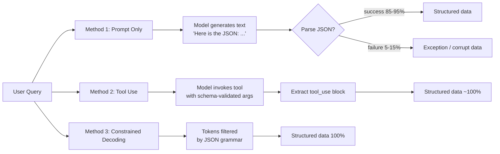

# المخرجات المنظَّمة: JSON Schema و Constrained Decoding

> أن تطلب من نموذج إعادة JSON ليس كأن تجعله يعيد JSON. استخدم الآلية الصحيحة.

**النوع:** بناء
**اللغات:** Python
**المتطلبات:** الدرس 01 (تشريح الطلب)، الدرس 02 (أساسيات الـ Prompt)
**الوقت:** ~60 دقيقة
**أهداف التعلّم:**
- تنفيذ ثلاث طرق لاستخراج المخرجات المنظَّمة ومقارنة معدلات فشلها
- شرح لماذا يُنتج استخدام الأدوات (tool use) JSON أكثر موثوقية من التعليمات المعتمدة على الـ prompt وحده
- استخدام tool_use من Anthropic كقناة مخرجات لمهام الاستخراج الإنتاجية
- تحديد متى تكون كل طريقة مناسبة وكيف يبدو نمط فشل كل طريقة
- بناء مساعد استخراج قابل لإعادة الاستخدام يستخدم tool_use افتراضيًا

---

## المشكلة

تبني خط أنابيب لمعالجة المستندات. يحتاج النموذج إلى استخراج بيانات منظَّمة: اسم الشركة، التاريخ، المبلغ الإجمالي، بنود الفاتورة. تطلب منه "respond in JSON" فيعمل في 90% من الوقت. أما الـ 10% الأخرى فتحصل على كتل شيفرة markdown حول الـ JSON، أو مفاتيح بترتيب مختلف، أو فواصل زائدة (trailing commas)، أو جملة قبل الـ JSON. تضيف مزيدًا من التعليمات. يصل إلى 95%. صيغة مستند جديدة تكسره من جديد.

لا يمكن للإنتاج تحمّل معدل فشل تحليل (parse) بنسبة 5% حين تعالج آلاف المستندات يوميًا. أعطال تحليل الـ JSON تُفسد قاعدة بياناتك بصمت أو تُعطّل خط أنابيبك. أنت بحاجة إلى آلية يكون فيها النموذج مقيَّدًا بنيويًا لإنتاج مخرجات صالحة ومطابقة للـ schema، لا آلية يُؤمَر فيها النموذج بمجرد المحاولة.

تختلف الطرق الثلاث في موضع وجود القيد:

1. **Prompt only**: تعليمات في الـ prompt. يحاول النموذج اتباعها. هش.
2. **Tool use as output channel**: يُجبَر النموذج على استدعاء أداة تطابق schema الخاص بك. JSON صالح مضمون.
3. **Constrained decoding**: مخرجات أصلية لدى المزوّد، مقيَّدة بقواعد (grammar). صالحة ومطابقة للـ schema بحكم البناء. (يوجّه Claude هذا عبر tool_use.)

---

## المفهوم

### طيف الموثوقية

```
FRAGILE                                                    RELIABLE
   |                                                           |
   ▼                                                           ▼
+---------------+    +-------------------+    +---------------+
| Prompt only   |    | Tool use as       |    | Constrained   |
|               |    | output channel    |    | decoding      |
| "respond in   |    |                   |    |               |
|  JSON format" |    | model MUST call   |    | tokens are    |
|               |    | your schema tool  |    | filtered by   |
| Valid JSON:   |    |                   |    | grammar       |
| ~85-95%       |    | Valid JSON: ~100% |    | Valid: 100%   |
+---------------+    +-------------------+    +---------------+
     failure:              failure:               failure:
  parse errors,       tool not called,         schema too
  wrapped in MD,      wrong field types         rigid for
  extra prose         (model infers type)       content
```



### لماذا ينجح استخدام الأدوات

استخدام الأدوات يختلف عن اتباع التعليمات. حين يستدعي نموذج أداة، فهو لا يولّد نصًا حرًا يصادف أن يبدو كـ JSON. صيغة استدعاء الأداة وضع توليد منفصل: يُنتج النموذج كتلة `tool_use` منظَّمة بحقل `input` هو JSON مُحلَّل بالفعل. ينجح هذا بشكل موثوق لأن النموذج مُضبَط (fine-tuned) خصيصًا لإنتاج JSON صالح لمدخلات الأدوات. لقد رأى ملايين الأمثلة الصحيحة لاستدعاء الأدوات أثناء التدريب.

قارن هذا بـ prompt-only: يولّد النموذج tokens في وضع توليد نص لا قيد بنيوي له. كما رأى ملايين الأمثلة حيث يظهر الـ JSON مضمَّنًا في نثر، أو ملفوفًا في markdown، أو مسبوقًا بـ "Here is the result:". بيانات التدريب تعمل ضدك.

### متى تستخدم كل طريقة

| Method | Use when | Avoid when |
|---|---|---|
| Prompt only | Quick prototyping, soft structure, schema may vary | Production pipelines, data ingestion, anything that parses the output |
| Tool use | Production extraction, known schema, reliability required | Schema is completely unknown at call time |
| Constrained decoding | Maximum reliability required, external providers that support it | Anthropic (use tool_use instead, same reliability) |

---

## البناء

### مهمة الاستخراج

ستحاول الطرق الثلاث جميعها المهمة نفسها: استخراج حقول منظَّمة من فاتورة مورّد.

```python
import anthropic
import json
import os

client = anthropic.Anthropic(api_key=os.environ["ANTHROPIC_API_KEY"])
MODEL = "claude-3-5-haiku-20241022"

SAMPLE_INVOICE = """
INVOICE #INV-2024-0892
From: Acme Consulting Group
To: Globex Corporation
Date: November 15, 2024

Services:
- Strategy Consulting (40 hrs @ $250/hr): $10,000.00
- Technical Architecture Review (8 hrs @ $350/hr): $2,800.00
- Travel Expenses: $450.00

Subtotal: $13,250.00
Tax (8.5%): $1,126.25
TOTAL DUE: $14,376.25

Payment terms: Net 30
"""
```

### Method 1: Prompt Only

```python
def extract_prompt_only(invoice: str) -> dict | None:
    """
    Method 1: Instructions in the prompt. Returns None on parse failure.
    Failure mode: valid text, invalid JSON.
    """
    response = client.messages.create(
        model=MODEL,
        max_tokens=1024,
        messages=[
            {
                "role": "user",
                "content": (
                    "Extract the following fields from this invoice and return ONLY valid JSON. "
                    "No markdown, no explanation, no code blocks. "
                    "Fields: vendor_name, client_name, invoice_number, date, "
                    "line_items (list of {description, amount}), subtotal, tax, total.\n\n"
                    + invoice
                ),
            }
        ],
    )

    raw = response.content[0].text.strip()

    # Strip markdown code blocks if the model wrapped the output
    if raw.startswith("```"):
        lines = raw.split("\n")
        raw = "\n".join(lines[1:-1])  # remove first and last line

    try:
        return json.loads(raw)
    except json.JSONDecodeError as e:
        print(f"  [Method 1] Parse error: {e}")
        print(f"  [Method 1] Raw output: {raw[:200]}")
        return None
```

ينجح هذا في معظم الأوقات على الفواتير النظيفة. ينكسر على الفواتير ذات التهيئة غير المعتادة، أو قوائم بنود طويلة، أو حين يقرر النموذج إضافة تمهيد.

### Method 2: Tool Use as Output Channel

```python
INVOICE_TOOL = {
    "name": "extract_invoice",
    "description": "Extract structured fields from an invoice document.",
    "input_schema": {
        "type": "object",
        "properties": {
            "vendor_name": {"type": "string", "description": "Name of the vendor issuing the invoice"},
            "client_name": {"type": "string", "description": "Name of the client being billed"},
            "invoice_number": {"type": "string", "description": "Invoice identifier"},
            "date": {"type": "string", "description": "Invoice date in YYYY-MM-DD format"},
            "line_items": {
                "type": "array",
                "items": {
                    "type": "object",
                    "properties": {
                        "description": {"type": "string"},
                        "amount": {"type": "number"},
                    },
                    "required": ["description", "amount"],
                },
                "description": "List of line items with description and dollar amount",
            },
            "subtotal": {"type": "number", "description": "Subtotal before tax"},
            "tax": {"type": "number", "description": "Tax amount"},
            "total": {"type": "number", "description": "Total amount due"},
        },
        "required": [
            "vendor_name", "client_name", "invoice_number", "date",
            "line_items", "subtotal", "tax", "total",
        ],
    },
}


def extract_tool_use(invoice: str) -> dict | None:
    """
    Method 2: Tool use as output channel.
    The model must call extract_invoice. Input is guaranteed valid JSON.
    Failure mode: model declines to call the tool (extremely rare with tool_choice=any).
    """
    response = client.messages.create(
        model=MODEL,
        max_tokens=1024,
        tools=[INVOICE_TOOL],
        tool_choice={"type": "any"},   # force a tool call
        messages=[
            {
                "role": "user",
                "content": "Extract all fields from this invoice:\n\n" + invoice,
            }
        ],
    )

    # Find the tool_use block in the response
    for block in response.content:
        if block.type == "tool_use" and block.name == "extract_invoice":
            return block.input  # already a dict, already valid JSON

    print("  [Method 2] No tool_use block found in response")
    return None
```

> **اختبار من الواقع:** يعالج خط أنابيبك فواتير من 50 مورّدًا مختلفًا. تفشل الطريقة 1 على نحو 3 فواتير يوميًا. يقول مديرك إن ذلك مقبول لأنه يمكنك التعامل معها يدويًا. تقدّر أنها ستصبح 200 فاتورة يوميًا خلال 6 أشهر. عند أي معدل فشل تصبح المعالجة اليدوية غير محتملة، وماذا يخبرك ذلك عن متى تستثمر في الطريقة 2؟

### Method 3: Tool Use with Strict Schema Validation

بالنسبة إلى Anthropic، يتحقق الـ "constrained decoding" عبر استخدام الأدوات مع تصميم schema دقيق. المفتاح هو جعل الـ schema دقيقًا قدر الإمكان:

```python
def extract_strict(invoice: str) -> dict | None:
    """
    Method 3: Tool use with stricter schema constraints.
    Uses enum for known fields and exact numeric types.
    This maximizes schema conformance on top of the JSON validity guarantee.
    """
    strict_tool = {
        "name": "extract_invoice_strict",
        "description": "Extract structured invoice fields. All amounts must be numeric, not strings.",
        "input_schema": {
            "type": "object",
            "properties": {
                "vendor_name": {"type": "string"},
                "client_name": {"type": "string"},
                "invoice_number": {"type": "string"},
                "date": {
                    "type": "string",
                    "pattern": r"^\d{4}-\d{2}-\d{2}$",
                    "description": "Must be YYYY-MM-DD format",
                },
                "line_items": {
                    "type": "array",
                    "items": {
                        "type": "object",
                        "properties": {
                            "description": {"type": "string"},
                            "amount": {"type": "number"},
                        },
                        "required": ["description", "amount"],
                    },
                    "minItems": 1,
                },
                "subtotal": {"type": "number"},
                "tax": {"type": "number"},
                "total": {"type": "number"},
                "payment_terms": {"type": "string"},
            },
            "required": [
                "vendor_name", "client_name", "invoice_number", "date",
                "line_items", "subtotal", "tax", "total",
            ],
        },
    }

    response = client.messages.create(
        model=MODEL,
        max_tokens=1024,
        tools=[strict_tool],
        tool_choice={"type": "any"},
        messages=[
            {
                "role": "user",
                "content": "Extract all fields from this invoice:\n\n" + invoice,
            }
        ],
    )

    for block in response.content:
        if block.type == "tool_use":
            return block.input

    return None
```

---

## الاستخدام

نمط استخدام الأدوات هو المعيار الإنتاجي للاستخراج المنظَّم مع Claude. وإليك النسخة الكاملة الأدنى التي ينبغي أن تلجأ إليها أولًا في أي مهمة استخراج:

```python
def extract(document: str, schema: dict, tool_name: str = "extract") -> dict:
    """
    Generic extraction helper using tool_use as output channel.
    Pass any JSON Schema as `schema`. Returns the extracted dict.
    Raises ValueError if extraction fails.
    """
    tool = {
        "name": tool_name,
        "description": f"Extract structured data from the provided document.",
        "input_schema": schema,
    }

    response = client.messages.create(
        model=MODEL,
        max_tokens=2048,
        tools=[tool],
        tool_choice={"type": "any"},
        messages=[
            {
                "role": "user",
                "content": f"Extract all fields from this document:\n\n{document}",
            }
        ],
    )

    for block in response.content:
        if block.type == "tool_use" and block.name == tool_name:
            return block.input

    raise ValueError("Model did not call the extraction tool")
```

النمط هو: عرّف schema الخاص بك، لُفّه في تعريف أداة، اضبط `tool_choice={"type": "any"}`، واقرأ `block.input`. هذا كل ما في الأمر.

> **نقلة في المنظور:** يشير زميل إلى أن الطريقة 2 (استخدام الأدوات) والطريقة 1 (الـ prompt وحده) تكلّفان تقريبًا العدد نفسه من الـ tokens. يجادل بأنه إذا كان المخرج متطابقًا حين ينجح، فلا سبب لاستخدام آلية tool_use. ما الخلل في هذا الاستدلال، ومتى سيهمّ فعلًا في نظام إنتاجي؟

---

## التسليم

الأثر (artifact) القابل لإعادة الاستخدام لهذا الدرس هو `outputs/skill-structured-output.md`. يحتوي على مساعد `extract()` و schema أداة الفاتورة كقالب جاهز للعمل.

شغّل عرض المقارنة:

```bash
export ANTHROPIC_API_KEY=sk-ant-...
python main.py
```

يشغّل العرض الطرق الثلاث جميعها على الفاتورة نفسها، ويطبع البيانات المستخرجة، ويبلّغ عن أي الطرق نجحت.

---

## التقييم

**Check 1: Measure method failure rates on a real corpus.**
اجمع 50-100 مستند من مجالك الفعلي. شغّل الطرق الثلاث جميعها. سجّل معدل نجاح التحليل (الطريقة 1: هل تحلّل الـ JSON؟)، واكتمال الحقول (هل عُبّئت كل الحقول المطلوبة؟)، وصحة النوع (هل الحقول العددية أرقام فعلًا؟). ستلاحظ على الأرجح فشل الطريقة 1 في 5-15% وفشل الطريقتين 2-3 في أقل من 1%.

**Check 2: Verify tool_choice=any is actually enforcing a tool call.**
سجّل `response.stop_reason` لاستدعاءات الاستخراج لديك. إن كان `stop_reason == "tool_use"`، فقد استدعى النموذج الأداة. إن كان `stop_reason == "end_turn"`، فقد ردّ بنص وعليك معالجة تلك الحالة. مع `tool_choice={"type": "any"}`، ينبغي أن يكون stop_reason هو `tool_use` في كل استدعاء.

**Check 3: Type correctness of numeric fields.**
حتى مع استخدام الأدوات، قد يعبّئ النموذج حقلًا عدديًا بسلسلة مثل "$14,376.25" بدلًا من الرقم `14376.25`. أضِف خطوة تحقق بعد الاستخراج تفحص أن كل حقول `"type": "number"` هي فعلًا floats أو ints في Python. سجّل الأعطال. إن تجاوز المعدل 2%، فحسّن وصف الحقل ليقول "numeric value only, no currency symbols."

**Check 4: Latency comparison.**
سجّل زمن استجابة (latency) الطريقة 1 مقابل الطريقة 2 على المستندات نفسها. يضيف استخدام الأدوات عبئًا ضئيلًا: الفرق عادةً أقل من 100ms. إن رأيت الطريقة 2 تستغرق وقتًا أطول بكثير، فالسبب عدد الـ tokens (schema أكثر تفصيلًا يُنتج tokens أكثر)، لا آلية tool_use نفسها.
