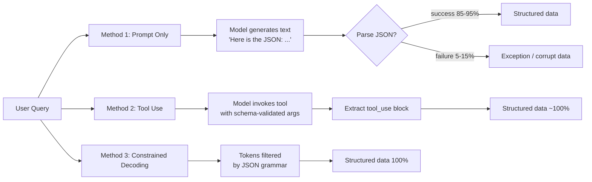

# Structured Outputs: JSON Schema, Constrained Decoding

> Asking a model to return JSON is not the same as making it return JSON. Use the right mechanism.

**Type:** Build
**Languages:** Python
**Prerequisites:** Lesson 01 (Request Anatomy), Lesson 02 (Prompt Fundamentals)
**Time:** ~60 min
**Learning Objectives:**
- Implement three methods of structured output extraction and compare their failure rates
- Explain why tool use produces more reliable JSON than prompt-only instructions
- Use Anthropic's tool_use as an output channel for production extraction tasks
- Identify when each method is appropriate and what each method's failure mode looks like
- Build a reusable extraction helper that uses tool_use by default

---

## The Problem

You are building a document processing pipeline. The model needs to extract structured data: company name, date, total amount, line items. You prompt it with "respond in JSON" and it works 90% of the time. The other 10% you get markdown code blocks around the JSON, or keys in a different order, or trailing commas, or a sentence before the JSON. You add more instructions. It gets to 95%. A new document format breaks it again.

Production cannot tolerate a 5% parse failure rate when you are processing thousands of documents a day. JSON parsing failures silently corrupt your database or crash your pipeline. You need a mechanism where the model is structurally constrained to produce valid, schema-conformant output, not a mechanism where the model is merely instructed to try.

The three methods differ in where the constraint lives:

1. **Prompt only**: Instructions in the prompt. The model tries to follow them. Fragile.
2. **Tool use as output channel**: The model is forced to call a tool that matches your schema. Valid JSON guaranteed.
3. **Constrained decoding**: Provider-native, grammar-constrained output. Valid and schema-conformant by construction. (Claude routes this through tool_use.)

---

## The Concept

### The Reliability Spectrum

```
FRAGILE                                                    RELIABLE
   |                                                           |
   ▼                                                           ▼
+---------------+    +-------------------+    +---------------+
| Prompt only   |    | Tool use as       |    | Constrained   |
|               |    | output channel    |    | decoding      |
| "respond in   |    |                   |    |               |
|  JSON format" |    | model MUST call   |    | tokens are    |
|               |    | your schema tool  |    | filtered by   |
| Valid JSON:   |    |                   |    | grammar       |
| ~85-95%       |    | Valid JSON: ~100% |    | Valid: 100%   |
+---------------+    +-------------------+    +---------------+
     failure:              failure:               failure:
  parse errors,       tool not called,         schema too
  wrapped in MD,      wrong field types         rigid for
  extra prose         (model infers type)       content
```



### Why Tool Use Works

Tool use is different from following instructions. When a model calls a tool, it is not generating free text that happens to look like JSON. The tool call format is a separate generation mode: the model produces a structured `tool_use` block with an `input` field that is already parsed JSON. This works reliably because the model is fine-tuned specifically to produce valid JSON for tool inputs. It has seen millions of correct tool call examples during training.

Compare this to prompt-only: the model is generating tokens in a text-generation mode that has no structural constraint. It has also seen millions of examples where JSON appears embedded in prose, wrapped in markdown, or prefixed with "Here is the result:". The training data works against you.

### When to Use Each Method

| Method | Use when | Avoid when |
|---|---|---|
| Prompt only | Quick prototyping, soft structure, schema may vary | Production pipelines, data ingestion, anything that parses the output |
| Tool use | Production extraction, known schema, reliability required | Schema is completely unknown at call time |
| Constrained decoding | Maximum reliability required, external providers that support it | Anthropic (use tool_use instead, same reliability) |

---

## Build It

### The Extraction Task

All three methods will attempt the same task: extract structured fields from a vendor invoice.

```python
import anthropic
import json
import os

client = anthropic.Anthropic(api_key=os.environ["ANTHROPIC_API_KEY"])
MODEL = "claude-3-5-haiku-20241022"

SAMPLE_INVOICE = """
INVOICE #INV-2024-0892
From: Acme Consulting Group
To: Globex Corporation
Date: November 15, 2024

Services:
- Strategy Consulting (40 hrs @ $250/hr): $10,000.00
- Technical Architecture Review (8 hrs @ $350/hr): $2,800.00
- Travel Expenses: $450.00

Subtotal: $13,250.00
Tax (8.5%): $1,126.25
TOTAL DUE: $14,376.25

Payment terms: Net 30
"""
```

### Method 1: Prompt Only

```python
def extract_prompt_only(invoice: str) -> dict | None:
    """
    Method 1: Instructions in the prompt. Returns None on parse failure.
    Failure mode: valid text, invalid JSON.
    """
    response = client.messages.create(
        model=MODEL,
        max_tokens=1024,
        messages=[
            {
                "role": "user",
                "content": (
                    "Extract the following fields from this invoice and return ONLY valid JSON. "
                    "No markdown, no explanation, no code blocks. "
                    "Fields: vendor_name, client_name, invoice_number, date, "
                    "line_items (list of {description, amount}), subtotal, tax, total.\n\n"
                    + invoice
                ),
            }
        ],
    )

    raw = response.content[0].text.strip()

    # Strip markdown code blocks if the model wrapped the output
    if raw.startswith("```"):
        lines = raw.split("\n")
        raw = "\n".join(lines[1:-1])  # remove first and last line

    try:
        return json.loads(raw)
    except json.JSONDecodeError as e:
        print(f"  [Method 1] Parse error: {e}")
        print(f"  [Method 1] Raw output: {raw[:200]}")
        return None
```

This works most of the time on clean invoices. It breaks on invoices with unusual formatting, long line-item lists, or when the model decides to add a preamble.

### Method 2: Tool Use as Output Channel

```python
INVOICE_TOOL = {
    "name": "extract_invoice",
    "description": "Extract structured fields from an invoice document.",
    "input_schema": {
        "type": "object",
        "properties": {
            "vendor_name": {"type": "string", "description": "Name of the vendor issuing the invoice"},
            "client_name": {"type": "string", "description": "Name of the client being billed"},
            "invoice_number": {"type": "string", "description": "Invoice identifier"},
            "date": {"type": "string", "description": "Invoice date in YYYY-MM-DD format"},
            "line_items": {
                "type": "array",
                "items": {
                    "type": "object",
                    "properties": {
                        "description": {"type": "string"},
                        "amount": {"type": "number"},
                    },
                    "required": ["description", "amount"],
                },
                "description": "List of line items with description and dollar amount",
            },
            "subtotal": {"type": "number", "description": "Subtotal before tax"},
            "tax": {"type": "number", "description": "Tax amount"},
            "total": {"type": "number", "description": "Total amount due"},
        },
        "required": [
            "vendor_name", "client_name", "invoice_number", "date",
            "line_items", "subtotal", "tax", "total",
        ],
    },
}


def extract_tool_use(invoice: str) -> dict | None:
    """
    Method 2: Tool use as output channel.
    The model must call extract_invoice. Input is guaranteed valid JSON.
    Failure mode: model declines to call the tool (extremely rare with tool_choice=any).
    """
    response = client.messages.create(
        model=MODEL,
        max_tokens=1024,
        tools=[INVOICE_TOOL],
        tool_choice={"type": "any"},   # force a tool call
        messages=[
            {
                "role": "user",
                "content": "Extract all fields from this invoice:\n\n" + invoice,
            }
        ],
    )

    # Find the tool_use block in the response
    for block in response.content:
        if block.type == "tool_use" and block.name == "extract_invoice":
            return block.input  # already a dict, already valid JSON

    print("  [Method 2] No tool_use block found in response")
    return None
```

> **Real-world check:** Your pipeline processes invoices from 50 different vendors. Method 1 fails on about 3 invoices per day. Your manager says that is fine since you can handle them manually. You estimate it will be 200 invoices per day within 6 months. At what failure rate does manual handling become untenable, and what does that tell you about when to invest in Method 2?

### Method 3: Tool Use with Strict Schema Validation

For Anthropic, "constrained decoding" is achieved through tool use with careful schema design. The key is making the schema as precise as possible:

```python
def extract_strict(invoice: str) -> dict | None:
    """
    Method 3: Tool use with stricter schema constraints.
    Uses enum for known fields and exact numeric types.
    This maximizes schema conformance on top of the JSON validity guarantee.
    """
    strict_tool = {
        "name": "extract_invoice_strict",
        "description": "Extract structured invoice fields. All amounts must be numeric, not strings.",
        "input_schema": {
            "type": "object",
            "properties": {
                "vendor_name": {"type": "string"},
                "client_name": {"type": "string"},
                "invoice_number": {"type": "string"},
                "date": {
                    "type": "string",
                    "pattern": r"^\d{4}-\d{2}-\d{2}$",
                    "description": "Must be YYYY-MM-DD format",
                },
                "line_items": {
                    "type": "array",
                    "items": {
                        "type": "object",
                        "properties": {
                            "description": {"type": "string"},
                            "amount": {"type": "number"},
                        },
                        "required": ["description", "amount"],
                    },
                    "minItems": 1,
                },
                "subtotal": {"type": "number"},
                "tax": {"type": "number"},
                "total": {"type": "number"},
                "payment_terms": {"type": "string"},
            },
            "required": [
                "vendor_name", "client_name", "invoice_number", "date",
                "line_items", "subtotal", "tax", "total",
            ],
        },
    }

    response = client.messages.create(
        model=MODEL,
        max_tokens=1024,
        tools=[strict_tool],
        tool_choice={"type": "any"},
        messages=[
            {
                "role": "user",
                "content": "Extract all fields from this invoice:\n\n" + invoice,
            }
        ],
    )

    for block in response.content:
        if block.type == "tool_use":
            return block.input

    return None
```

---

## Use It

The tool use pattern is the production standard for structured extraction with Claude. Here is the complete, minimal version you should reach for first in any extraction task:

```python
def extract(document: str, schema: dict, tool_name: str = "extract") -> dict:
    """
    Generic extraction helper using tool_use as output channel.
    Pass any JSON Schema as `schema`. Returns the extracted dict.
    Raises ValueError if extraction fails.
    """
    tool = {
        "name": tool_name,
        "description": f"Extract structured data from the provided document.",
        "input_schema": schema,
    }

    response = client.messages.create(
        model=MODEL,
        max_tokens=2048,
        tools=[tool],
        tool_choice={"type": "any"},
        messages=[
            {
                "role": "user",
                "content": f"Extract all fields from this document:\n\n{document}",
            }
        ],
    )

    for block in response.content:
        if block.type == "tool_use" and block.name == tool_name:
            return block.input

    raise ValueError("Model did not call the extraction tool")
```

The pattern is: define your schema, wrap it in a tool definition, set `tool_choice={"type": "any"}`, and read `block.input`. That is all there is to it.

> **Perspective shift:** A colleague points out that Method 2 (tool use) and Method 1 (prompt only) cost roughly the same number of tokens. They argue that if the output is identical when it works, there is no reason to use the tool_use mechanism. What is the flaw in this reasoning, and when would it actually matter in a production system?

---

## Ship It

The reusable artifact for this lesson is `outputs/skill-structured-output.md`. It contains the `extract()` helper and the invoice tool schema as a working template.

Run the comparison demo:

```bash
export ANTHROPIC_API_KEY=sk-ant-...
python main.py
```

The demo runs all three methods on the same invoice, prints the extracted data, and reports which methods succeeded.

---

## Evaluate It

**Check 1: Measure method failure rates on a real corpus.**
Collect 50-100 documents from your actual domain. Run all three methods. Record parse success rate (method 1: did JSON parse?), field completeness (were all required fields populated?), and type correctness (are numeric fields actually numbers?). You will likely see method 1 failing on 5-15% and methods 2-3 failing on under 1%.

**Check 2: Verify tool_choice=any is actually enforcing a tool call.**
Log `response.stop_reason` for your extraction calls. If `stop_reason == "tool_use"`, the model called the tool. If `stop_reason == "end_turn"`, it responded in text and you need to handle that case. With `tool_choice={"type": "any"}`, stop_reason should be `tool_use` on every call.

**Check 3: Type correctness of numeric fields.**
Even with tool use, the model may populate a numeric field with a string like "$14,376.25" instead of the number `14376.25`. Add a post-extraction validation step that checks all `"type": "number"` fields are actually Python floats or ints. Log failures. If the rate exceeds 2%, improve the field description to say "numeric value only, no currency symbols."

**Check 4: Latency comparison.**
Log response latency for method 1 vs method 2 on the same documents. Tool use adds minimal overhead: the difference is usually under 100ms. If you see method 2 taking significantly longer, the cause is token count (a more detailed schema produces more tokens), not the tool_use mechanism itself.
