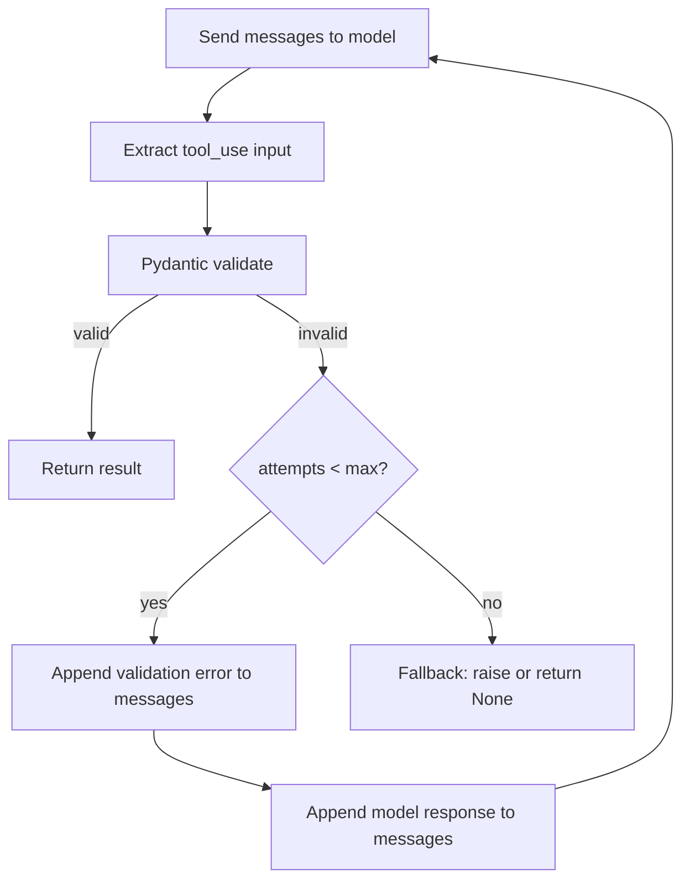

# حلقات التحقق + إعادة المحاولة: Pydantic / Zod

> النموذج الذي يعرف ما الذي أخطأ فيه سيصلحه. أما الذي يعيد المحاولة بالـ prompt نفسه فلن يفعل.

**النوع:** بناء
**اللغات:** Python
**المتطلبات:** الدرس 06 (المخرجات المنظَّمة)
**الوقت:** ~60 دقيقة
**أهداف التعلّم:**
- تنفيذ دالة validated_completion تعيد المحاولة مع أخطاء تحقق Pydantic كتغذية راجعة
- قياس الفرق في معدل النجاح بين إعادة المحاولة العمياء (blind retry) وإعادة المحاولة المستنيرة بالخطأ
- تطبيق نمط إعادة المحاولة-مع-التغذية-الراجعة باستخدام مكتبة instructor
- تعريف استراتيجية احتياطية (fallback) لحين استنفاد كل المحاولات
- شرح لماذا تكون تغذية الخطأ للنموذج أكثر فعالية بـ 2-3 أضعاف من إعادة المحاولة العمياء

---

## المشكلة

تنفّذ استخراجًا منظَّمًا باستخدام tool_use (من الدرس 06). لمعظم المستندات، الاستخراج مثالي. لكن بعض المستندات تنتج مخرجات تجتاز تحليل الـ JSON لكنها تفشل في قواعد عملك: حقل `confidence` يُفترض أن يكون بين 0 و1 يعود كـ 87 (يجب أن يكون 0.87)، أو enum بـ `status` يحتوي على قيمة ليست في مجموعتك المسموح بها، أو حقل متداخل مطلوب يكون null بينما يحتوي المستند بوضوح على المعلومة.

يضمن استخدام الأدوات JSON صالحًا. لكنه لا يضمن أن القيم تستوفي قيود schema الخاص بك، أو قواعد عملك، أو متطلباتك اللاحقة (downstream). يلتقط تحقق Pydantic هذه الحالات، لكن التقاط الخطأ نصف المشكلة فقط. النهج الساذج هو رفع الاستثناء والاستسلام، أو إعادة المحاولة بصمت بالـ prompt المطابق على أمل مخرج مختلف. لا ينجح أي منهما.

البصيرة هي أن النموذج ولّد قيمة خاطئة لأنه لم يُخبَر بما يعنيه "خطأ" في سياقك. غذِّ خطأ Pydantic عائدًا في المحادثة فيتمكن النموذج من تصحيح الحقل الذي فشل بالضبط، بالطريقة التي فشل بها بالضبط.

---

## المفهوم

### حلقة إعادة المحاولة

```
                  ┌─────────────────────────────┐
                  │        Attempt N             │
                  │  Send prompt to model        │
                  └──────────────┬──────────────┘
                                 │ response
                                 ▼
                  ┌─────────────────────────────┐
                  │     Parse / Extract          │
                  │  JSON parse or tool_use      │
                  └──────────────┬──────────────┘
                                 │ dict
                                 ▼
                  ┌─────────────────────────────┐
                  │     Pydantic Validate        │
                  │  Model(**extracted_data)     │
                  └──────────┬────┬─────────────┘
                             │    │
                   success   │    │  failure
                             ▼    ▼
              ┌──────────────┐  ┌──────────────────────────────┐
              │   Return     │  │  N < max_retries?             │
              │   result     │  │  Append error to messages     │
              └──────────────┘  │  "Your output failed:         │
                                │   field X: <error detail>"    │
                                │  Go back to Attempt N+1       │
                                └──────────┬───────────────────┘
                                           │ N >= max_retries
                                           ▼
                                ┌──────────────────────┐
                                │   Fallback handler   │
                                │   log, raise, return │
                                │   partial result     │
                                └──────────────────────┘
```



### لماذا تنجح التغذية الراجعة للخطأ

إعادة المحاولة العمياء ترسل الـ prompt نفسه وتتوقع مخرجًا مختلفًا. ليس لدى النموذج معلومة جديدة، فيميل إلى ارتكاب الخطأ نفسه. أما إعادة المحاولة المستنيرة بالخطأ فتخبر النموذج بالضبط بما فشل ولماذا:

```
Turn 1 (user):   "Extract the risk_score field. It must be between 0.0 and 1.0."
Turn 1 (model):  risk_score: 87
Turn 2 (user):   "Validation failed: risk_score=87 fails constraint '87 > 1.0: 
                  value must be <= 1.0'. Please fix only the failed fields."
Turn 2 (model):  risk_score: 0.87
```

النموذج "يعرف" أن 87% و0.87 يشيران إلى الشيء نفسه. لقد اتخذ خيار تهيئة. وبإعطائه الخطأ المحدد، يصحّح ذلك الخيار. هذا أكثر فعالية بـ 2-3 أضعاف من إعادة المحاولة العمياء لأن هدف التصحيح صريح.

### ما الذي يتحقق منه Pydantic

| Validation type | Example | What breaks without it |
|---|---|---|
| Type constraint | `score: float` but model returns `"87"` | Downstream math fails |
| Range constraint | `confidence: float` with `ge=0, le=1` | Downstream comparison wrong |
| Enum constraint | `status: Literal["active", "closed"]` | DB insert fails |
| Required field | `vendor: str` but model returns null | NullPointerError downstream |
| Nested model | `address: Address` with sub-fields | Partial data silently accepted |

---

## البناء

### الـ Schema الهدف

سنستخرج تقييم مخاطر من تقرير أمني بنص حر. للـ schema عدة قيود يسهل مخالفتها:

```python
import anthropic
import os
from pydantic import BaseModel, field_validator, model_validator
from typing import Literal
import json

client = anthropic.Anthropic(api_key=os.environ["ANTHROPIC_API_KEY"])
MODEL = "claude-3-5-haiku-20241022"


class RiskFinding(BaseModel):
    """A single identified risk."""
    title: str
    severity: Literal["low", "medium", "high", "critical"]
    likelihood: float  # must be between 0.0 and 1.0
    affected_component: str

    @field_validator("likelihood")
    @classmethod
    def likelihood_range(cls, v: float) -> float:
        if not (0.0 <= v <= 1.0):
            raise ValueError(
                f"likelihood must be between 0.0 and 1.0, got {v}. "
                "Express as a decimal (0.75), not a percentage (75)."
            )
        return v


class RiskAssessment(BaseModel):
    """Structured risk assessment extracted from a security report."""
    asset_name: str
    assessment_date: str  # YYYY-MM-DD
    overall_risk_score: float  # 0.0 to 1.0
    findings: list[RiskFinding]
    recommended_action: Literal["monitor", "remediate", "escalate", "accept"]
    reviewer: str

    @field_validator("overall_risk_score")
    @classmethod
    def risk_score_range(cls, v: float) -> float:
        if not (0.0 <= v <= 1.0):
            raise ValueError(
                f"overall_risk_score must be between 0.0 and 1.0, got {v}. "
                "Use decimal notation: 0.75 not 75."
            )
        return v

    @model_validator(mode="after")
    def findings_not_empty(self) -> "RiskAssessment":
        if not self.findings:
            raise ValueError("findings must contain at least one risk finding")
        return self
```

### دالة `validated_completion`

```python
RISK_SCHEMA = {
    "type": "object",
    "properties": {
        "asset_name": {"type": "string"},
        "assessment_date": {"type": "string", "description": "YYYY-MM-DD format"},
        "overall_risk_score": {
            "type": "number",
            "description": "Risk score from 0.0 (no risk) to 1.0 (maximum risk). Use decimals, not percentages.",
        },
        "findings": {
            "type": "array",
            "items": {
                "type": "object",
                "properties": {
                    "title": {"type": "string"},
                    "severity": {
                        "type": "string",
                        "enum": ["low", "medium", "high", "critical"],
                    },
                    "likelihood": {
                        "type": "number",
                        "description": "Probability from 0.0 to 1.0. Use 0.75 not 75.",
                    },
                    "affected_component": {"type": "string"},
                },
                "required": ["title", "severity", "likelihood", "affected_component"],
            },
        },
        "recommended_action": {
            "type": "string",
            "enum": ["monitor", "remediate", "escalate", "accept"],
        },
        "reviewer": {"type": "string"},
    },
    "required": [
        "asset_name", "assessment_date", "overall_risk_score",
        "findings", "recommended_action", "reviewer",
    ],
}

EXTRACTION_TOOL = {
    "name": "extract_risk_assessment",
    "description": "Extract a structured risk assessment from a security report.",
    "input_schema": RISK_SCHEMA,
}


def validated_completion(
    document: str,
    max_retries: int = 3,
) -> RiskAssessment | None:
    """
    Extract and validate a RiskAssessment from `document`.
    On Pydantic validation failure, feeds the error back to the model
    and retries. Returns None if all retries are exhausted.
    """
    messages = [
        {
            "role": "user",
            "content": "Extract a risk assessment from this security report:\n\n" + document,
        }
    ]

    for attempt in range(1, max_retries + 1):
        print(f"  Attempt {attempt}/{max_retries}...")

        response = client.messages.create(
            model=MODEL,
            max_tokens=1024,
            tools=[EXTRACTION_TOOL],
            tool_choice={"type": "any"},
            messages=messages,
        )

        # Find the tool_use block
        extracted_data = None
        tool_use_block = None
        for block in response.content:
            if block.type == "tool_use" and block.name == "extract_risk_assessment":
                extracted_data = block.input
                tool_use_block = block
                break

        if extracted_data is None:
            print(f"  No tool_use block found (stop_reason={response.stop_reason})")
            break

        # Validate with Pydantic
        try:
            result = RiskAssessment(**extracted_data)
            print(f"  Validation passed on attempt {attempt}")
            return result

        except Exception as e:
            error_msg = str(e)
            print(f"  Validation failed: {error_msg[:200]}")

            if attempt == max_retries:
                print(f"  Max retries reached. Giving up.")
                return None

            # Build the retry messages: append model response + user correction
            messages.append({
                "role": "assistant",
                "content": response.content,
            })
            messages.append({
                "role": "user",
                "content": (
                    f"The extracted data failed validation:\n\n{error_msg}\n\n"
                    "Please fix only the fields that failed validation. "
                    "Keep all other fields exactly as they were. "
                    "Call the tool again with the corrected values."
                ),
            })

    return None
```

> **اختبار من الواقع:** يشغّل خط استخراجك `validated_completion` بـ max_retries=3. في أسبوع واحد من حركة الإنتاج، ترى 2% من المستندات تستنفد المحاولات الثلاث جميعها وتعيد None. خط أنابيبك اللاحق يتخطى نتائج None بصمت. يسأل مدير منتج لماذا تبدو البيانات متناثرة. ما الذي يجب أن تفعله بشكل مختلف، في كيفية معالجة حالة None وفي كيفية التحقيق في مستندات الفشل البالغة 2%؟

### إعادة المحاولة العمياء مقابل المستنيرة بالخطأ

وإليك التباين بين ما لا ينجح وما ينجح:

```python
def blind_retry(document: str, max_retries: int = 3) -> RiskAssessment | None:
    """
    Naive approach: retry the same prompt on failure.
    Does NOT feed the error back. For comparison only.
    """
    for attempt in range(1, max_retries + 1):
        response = client.messages.create(
            model=MODEL,
            max_tokens=1024,
            tools=[EXTRACTION_TOOL],
            tool_choice={"type": "any"},
            messages=[
                {
                    "role": "user",
                    "content": "Extract a risk assessment from this security report:\n\n" + document,
                }
            ],
        )
        for block in response.content:
            if block.type == "tool_use":
                try:
                    return RiskAssessment(**block.input)
                except Exception:
                    pass  # ignore error, retry same prompt
    return None
```

الفرق هو أن `blind_retry` يبدأ من الصفر في كل مرة. ليس للنموذج ذاكرة بمحاولته السابقة أو بما فشل. سيميل إلى ارتكاب الخطأ نفسه في المحاولة 2 الذي ارتكبه في المحاولة 1.

---

## الاستخدام

تُغلّف مكتبة `instructor` نمط إعادة المحاولة-مع-التغذية-الراجعة في استدعاء API من سطر واحد. ترقّع (patches) عميل Anthropic لإضافة التحقق وإعادة المحاولة تلقائيًا:

```python
import instructor
from anthropic import Anthropic

# Patch the client with instructor
patched_client = instructor.from_anthropic(Anthropic())

def extract_with_instructor(document: str) -> RiskAssessment:
    """
    Same validated_completion behavior, using instructor.
    instructor handles the retry loop and error feedback automatically.
    """
    return patched_client.messages.create(
        model=MODEL,
        max_tokens=1024,
        max_retries=3,          # instructor retry parameter
        response_model=RiskAssessment,
        messages=[
            {
                "role": "user",
                "content": "Extract a risk assessment from this security report:\n\n" + document,
            }
        ],
    )
```

تفعل `instructor` بالضبط ما تفعله `validated_completion`: استخراج، تحقق بـ Pydantic، تغذية الخطأ عائدًا عند الفشل، إعادة المحاولة. تتولى المكتبة أيضًا التحقق متعدد الخطوات، والنتائج الجزئية، والبث (streaming). استخدمها بمجرد أن تفهم ما تفعله داخليًا (وهو ما تفهمه الآن).

> **نقلة في المنظور:** تجعل instructor حلقة إعادة المحاولة غير مرئية. يقول زميل: "إذا كانت instructor تتولى كل هذا تلقائيًا، فلماذا تكبّدنا عناء تنفيذ validated_completion من الصفر؟" ماذا ستقول له؟ متى تمنحك النسخة المبنية من الصفر شيئًا لا تستطيع instructor توفيره؟

---

## التسليم

الأثر (artifact) القابل لإعادة الاستخدام لهذا الدرس هو `outputs/skill-validation-retry-loop.md`. يحتوي على دالة `validated_completion` كمكوّن قائم بذاته يمكنك إدراجه في أي خط أنابيب استخراج.

شغّل العرض لرؤية إعادة المحاولة العمياء مقابل المستنيرة بالخطأ على المستند نفسه:

```bash
export ANTHROPIC_API_KEY=sk-ant-...
python main.py
```

تُظهر المخرجات أعداد المحاولات، وأخطاء التحقق، والنتيجة النهائية لكل استراتيجية.

---

## التقييم

**Check 1: Measure first-attempt success rate.**
سجّل ما إذا كان كل استخراج ينجح من المحاولة الأولى أم يتطلب إعادات محاولة. إن كان نجاح المحاولة الأولى دون 85%، فالمشكلة في تصميم الـ schema أو الـ prompt، لا في منطق إعادة المحاولة. إعادة المحاولة شبكة أمان، لا بديل عن schema جيد.

**Check 2: Track retry distribution.**
عُدّ كم استدعاءً يبلغ المحاولة 2، والمحاولة 3، ويستنفد max_retries. خط الأنابيب الصحي لديه 90-95% نجاح من المحاولة الأولى، و4-9% يحتاج إعادة محاولة واحدة، وأقل من 1% يستنفد كل المحاولات. إن احتاج 10%+ إلى إعادات محاولة، فدقّق في رسائل خطأ التحقق الأكثر شيوعًا بحثًا عن أنماط.

**Check 3: Validate the error feedback is actually helping.**
شغّل المجموعة نفسها من المستندات الفاشلة عبر blind_retry و validated_completion. قارن معدل النجاح من المحاولة الأولى إلى الثانية. إن كانت التغذية الراجعة للخطأ تعمل، فينبغي أن ترى 50-70% من إخفاقات المحاولة الأولى تنجح في المحاولة الثانية مع التغذية الراجعة للخطأ، مقابل أقل من 20% مع إعادة المحاولة العمياء.

**Check 4: Set a fallback strategy and monitor it.**
لا تدع نتائج `None` تختفي بصمت أبدًا. نفّذ واحدًا مما يلي: (أ) رفع استثناء يذهب إلى متعقّب الأخطاء لديك، (ب) كتابة المستند إلى طابور رسائل ميتة (dead-letter queue) للمراجعة اليدوية، أو (ج) إعادة نتيجة جزئية مُعلَّمة كغير مُتحقَّق منها. سجّل عدد أحداث الـ fallback كمقياس. أطلِق تنبيهًا إن تجاوز 1% من إجمالي عمليات الاستخراج.
