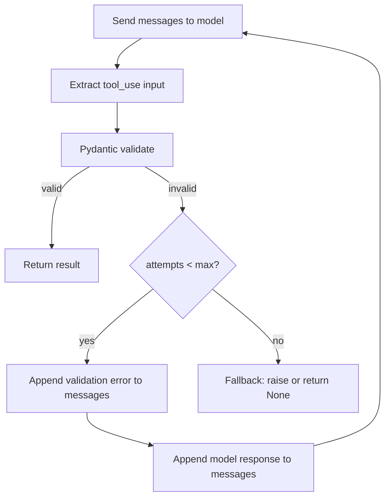

# Validation + Retry Loops: Pydantic / Zod

> A model that knows what it got wrong will fix it. A model that just retries the same prompt will not.

**Type:** Build
**Languages:** Python
**Prerequisites:** Lesson 06 (Structured Outputs)
**Time:** ~60 min
**Learning Objectives:**
- Implement a validated_completion function that retries with Pydantic validation errors as feedback
- Measure the difference in success rate between blind retry and error-informed retry
- Apply the retry-with-feedback pattern using the instructor library
- Define a fallback strategy for when all retries are exhausted
- Explain why feeding the error back to the model is 2-3x more effective than blind retry

---

## The Problem

You implement structured extraction using tool_use (from Lesson 06). For most documents, the extraction is perfect. But some documents produce outputs that pass JSON parsing yet fail your business rules: a `confidence` field that should be between 0 and 1 comes back as 87 (should be 0.87), a `status` enum contains a value not in your allowed set, or a required nested field is null when the document clearly contains the information.

Tool use guarantees valid JSON. It does not guarantee that the values meet your schema constraints, business rules, or downstream requirements. Pydantic validation catches these cases, but catching the error is only half the problem. The naive approach is to raise the exception and give up, or to silently retry the identical prompt and hope for different output. Neither works.

The insight is that the model generated a wrong value because it was not told what "wrong" means in your context. Feed the Pydantic error back into the conversation and the model can correct exactly the field that failed, exactly the way it failed.

---

## The Concept

### The Retry Loop

```
                  ┌─────────────────────────────┐
                  │        Attempt N             │
                  │  Send prompt to model        │
                  └──────────────┬──────────────┘
                                 │ response
                                 ▼
                  ┌─────────────────────────────┐
                  │     Parse / Extract          │
                  │  JSON parse or tool_use      │
                  └──────────────┬──────────────┘
                                 │ dict
                                 ▼
                  ┌─────────────────────────────┐
                  │     Pydantic Validate        │
                  │  Model(**extracted_data)     │
                  └──────────┬────┬─────────────┘
                             │    │
                   success   │    │  failure
                             ▼    ▼
              ┌──────────────┐  ┌──────────────────────────────┐
              │   Return     │  │  N < max_retries?             │
              │   result     │  │  Append error to messages     │
              └──────────────┘  │  "Your output failed:         │
                                │   field X: <error detail>"    │
                                │  Go back to Attempt N+1       │
                                └──────────┬───────────────────┘
                                           │ N >= max_retries
                                           ▼
                                ┌──────────────────────┐
                                │   Fallback handler   │
                                │   log, raise, return │
                                │   partial result     │
                                └──────────────────────┘
```



### Why Error Feedback Works

A blind retry sends the same prompt and expects different output. The model has no new information, so it tends to make the same mistake. Error-informed retry tells the model exactly what failed and why:

```
Turn 1 (user):   "Extract the risk_score field. It must be between 0.0 and 1.0."
Turn 1 (model):  risk_score: 87
Turn 2 (user):   "Validation failed: risk_score=87 fails constraint '87 > 1.0: 
                  value must be <= 1.0'. Please fix only the failed fields."
Turn 2 (model):  risk_score: 0.87
```

The model "knows" that 87% and 0.87 refer to the same thing. It made a formatting choice. Given the specific error, it corrects that choice. This is 2-3x more effective than blind retry because the correction target is explicit.

### What Pydantic Validates

| Validation type | Example | What breaks without it |
|---|---|---|
| Type constraint | `score: float` but model returns `"87"` | Downstream math fails |
| Range constraint | `confidence: float` with `ge=0, le=1` | Downstream comparison wrong |
| Enum constraint | `status: Literal["active", "closed"]` | DB insert fails |
| Required field | `vendor: str` but model returns null | NullPointerError downstream |
| Nested model | `address: Address` with sub-fields | Partial data silently accepted |

---

## Build It

### The Target Schema

We will extract a risk assessment from a free-text security report. The schema has several constraints that are easy to violate:

```python
import anthropic
import os
from pydantic import BaseModel, field_validator, model_validator
from typing import Literal
import json

client = anthropic.Anthropic(api_key=os.environ["ANTHROPIC_API_KEY"])
MODEL = "claude-3-5-haiku-20241022"


class RiskFinding(BaseModel):
    """A single identified risk."""
    title: str
    severity: Literal["low", "medium", "high", "critical"]
    likelihood: float  # must be between 0.0 and 1.0
    affected_component: str

    @field_validator("likelihood")
    @classmethod
    def likelihood_range(cls, v: float) -> float:
        if not (0.0 <= v <= 1.0):
            raise ValueError(
                f"likelihood must be between 0.0 and 1.0, got {v}. "
                "Express as a decimal (0.75), not a percentage (75)."
            )
        return v


class RiskAssessment(BaseModel):
    """Structured risk assessment extracted from a security report."""
    asset_name: str
    assessment_date: str  # YYYY-MM-DD
    overall_risk_score: float  # 0.0 to 1.0
    findings: list[RiskFinding]
    recommended_action: Literal["monitor", "remediate", "escalate", "accept"]
    reviewer: str

    @field_validator("overall_risk_score")
    @classmethod
    def risk_score_range(cls, v: float) -> float:
        if not (0.0 <= v <= 1.0):
            raise ValueError(
                f"overall_risk_score must be between 0.0 and 1.0, got {v}. "
                "Use decimal notation: 0.75 not 75."
            )
        return v

    @model_validator(mode="after")
    def findings_not_empty(self) -> "RiskAssessment":
        if not self.findings:
            raise ValueError("findings must contain at least one risk finding")
        return self
```

### The `validated_completion` Function

```python
RISK_SCHEMA = {
    "type": "object",
    "properties": {
        "asset_name": {"type": "string"},
        "assessment_date": {"type": "string", "description": "YYYY-MM-DD format"},
        "overall_risk_score": {
            "type": "number",
            "description": "Risk score from 0.0 (no risk) to 1.0 (maximum risk). Use decimals, not percentages.",
        },
        "findings": {
            "type": "array",
            "items": {
                "type": "object",
                "properties": {
                    "title": {"type": "string"},
                    "severity": {
                        "type": "string",
                        "enum": ["low", "medium", "high", "critical"],
                    },
                    "likelihood": {
                        "type": "number",
                        "description": "Probability from 0.0 to 1.0. Use 0.75 not 75.",
                    },
                    "affected_component": {"type": "string"},
                },
                "required": ["title", "severity", "likelihood", "affected_component"],
            },
        },
        "recommended_action": {
            "type": "string",
            "enum": ["monitor", "remediate", "escalate", "accept"],
        },
        "reviewer": {"type": "string"},
    },
    "required": [
        "asset_name", "assessment_date", "overall_risk_score",
        "findings", "recommended_action", "reviewer",
    ],
}

EXTRACTION_TOOL = {
    "name": "extract_risk_assessment",
    "description": "Extract a structured risk assessment from a security report.",
    "input_schema": RISK_SCHEMA,
}


def validated_completion(
    document: str,
    max_retries: int = 3,
) -> RiskAssessment | None:
    """
    Extract and validate a RiskAssessment from `document`.
    On Pydantic validation failure, feeds the error back to the model
    and retries. Returns None if all retries are exhausted.
    """
    messages = [
        {
            "role": "user",
            "content": "Extract a risk assessment from this security report:\n\n" + document,
        }
    ]

    for attempt in range(1, max_retries + 1):
        print(f"  Attempt {attempt}/{max_retries}...")

        response = client.messages.create(
            model=MODEL,
            max_tokens=1024,
            tools=[EXTRACTION_TOOL],
            tool_choice={"type": "any"},
            messages=messages,
        )

        # Find the tool_use block
        extracted_data = None
        tool_use_block = None
        for block in response.content:
            if block.type == "tool_use" and block.name == "extract_risk_assessment":
                extracted_data = block.input
                tool_use_block = block
                break

        if extracted_data is None:
            print(f"  No tool_use block found (stop_reason={response.stop_reason})")
            break

        # Validate with Pydantic
        try:
            result = RiskAssessment(**extracted_data)
            print(f"  Validation passed on attempt {attempt}")
            return result

        except Exception as e:
            error_msg = str(e)
            print(f"  Validation failed: {error_msg[:200]}")

            if attempt == max_retries:
                print(f"  Max retries reached. Giving up.")
                return None

            # Build the retry messages: append model response + user correction
            messages.append({
                "role": "assistant",
                "content": response.content,
            })
            messages.append({
                "role": "user",
                "content": (
                    f"The extracted data failed validation:\n\n{error_msg}\n\n"
                    "Please fix only the fields that failed validation. "
                    "Keep all other fields exactly as they were. "
                    "Call the tool again with the corrected values."
                ),
            })

    return None
```

> **Real-world check:** Your extraction pipeline runs `validated_completion` with max_retries=3. In one week of production traffic, you see 2% of documents exhausting all 3 retries and returning None. Your downstream pipeline silently skips None results. A product manager asks why the data looks sparse. What should you do differently, both in how you handle the None case and in how you investigate the 2% failure documents?

### Blind Retry vs. Error-Informed Retry

Here is the contrast between what does not work and what does:

```python
def blind_retry(document: str, max_retries: int = 3) -> RiskAssessment | None:
    """
    Naive approach: retry the same prompt on failure.
    Does NOT feed the error back. For comparison only.
    """
    for attempt in range(1, max_retries + 1):
        response = client.messages.create(
            model=MODEL,
            max_tokens=1024,
            tools=[EXTRACTION_TOOL],
            tool_choice={"type": "any"},
            messages=[
                {
                    "role": "user",
                    "content": "Extract a risk assessment from this security report:\n\n" + document,
                }
            ],
        )
        for block in response.content:
            if block.type == "tool_use":
                try:
                    return RiskAssessment(**block.input)
                except Exception:
                    pass  # ignore error, retry same prompt
    return None
```

The difference is that `blind_retry` starts from scratch each time. The model has no memory of its previous attempt or what went wrong. It will tend to make the same mistake on retry 2 that it made on retry 1.

---

## Use It

The `instructor` library wraps this retry-with-feedback pattern into a one-line API call. It patches the Anthropic client to add automatic validation and retry:

```python
import instructor
from anthropic import Anthropic

# Patch the client with instructor
patched_client = instructor.from_anthropic(Anthropic())

def extract_with_instructor(document: str) -> RiskAssessment:
    """
    Same validated_completion behavior, using instructor.
    instructor handles the retry loop and error feedback automatically.
    """
    return patched_client.messages.create(
        model=MODEL,
        max_tokens=1024,
        max_retries=3,          # instructor retry parameter
        response_model=RiskAssessment,
        messages=[
            {
                "role": "user",
                "content": "Extract a risk assessment from this security report:\n\n" + document,
            }
        ],
    )
```

`instructor` does exactly what `validated_completion` does: extract, validate with Pydantic, feed the error back on failure, retry. The library also handles multi-step validation, partial results, and streaming. Use it once you understand what it is doing internally (which you now do).

> **Perspective shift:** instructor makes the retry loop invisible. A teammate says: "If instructor handles all of this automatically, why did we bother implementing validated_completion from scratch?" What do you tell them? When does the from-scratch version give you something instructor cannot?

---

## Ship It

The reusable artifact for this lesson is `outputs/skill-validation-retry-loop.md`. It contains the `validated_completion` function as a standalone component you can drop into any extraction pipeline.

Run the demo to see blind retry vs. error-informed retry on the same document:

```bash
export ANTHROPIC_API_KEY=sk-ant-...
python main.py
```

The output shows attempt counts, validation errors, and final result for each strategy.

---

## Evaluate It

**Check 1: Measure first-attempt success rate.**
Log whether each extraction succeeds on the first attempt or requires retries. If first-attempt success is below 85%, the problem is in the schema design or the prompt, not the retry logic. Retries are a safety net, not a substitute for a good schema.

**Check 2: Track retry distribution.**
Count how many calls reach attempt 2, attempt 3, and exhaust max_retries. A healthy pipeline has 90-95% first-attempt success, 4-9% needing one retry, and under 1% exhausting all retries. If 10%+ need retries, audit the most common validation error messages for patterns.

**Check 3: Validate the error feedback is actually helping.**
Run the same set of failing documents through blind_retry and validated_completion. Compare the first-to-second-attempt success rate. If error feedback is working, you should see 50-70% of first-attempt failures succeed on the second attempt with error feedback, vs. under 20% with blind retry.

**Check 4: Set a fallback strategy and monitor it.**
Never let `None` results silently disappear. Implement one of: (a) raise an exception that goes to your error tracker, (b) write the document to a dead-letter queue for manual review, or (c) return a partial result flagged as unvalidated. Log the count of fallback events as a metric. Alert if it exceeds 1% of total extractions.
