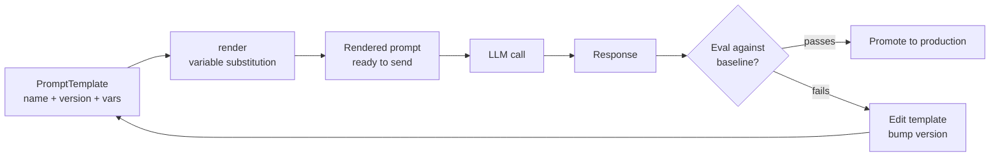

# قوالب الـ Prompt وإدارة الإصدارات

> الـ prompt الذي لا يخضع للتحكم في الإصدارات (version control) لا يمكن تتبّع أخطائه عند حدوث تراجع في أدائه. يصبح سؤال "ما الذي تغيّر؟" بلا إجابة من دون سجل تاريخي.

**النوع:** بناء
**اللغات:** Python
**المتطلبات:** الدرس 01 (تشريح الطلب)، الدرس 02 (أساسيات الـ Prompt)
**الوقت:** ~45 دقيقة
**أهداف التعلّم:**
- بناء فئة (class) باسم PromptTemplate مع استبدال المتغيّرات وبيانات وصفية للإصدار
- تنفيذ سجلّ (registry) بسيط للـ prompt في الذاكرة مع البحث بالاسم والإصدار
- شرح الفرق بين القالب (template) والـ prompt المُجهَّز (rendered)
- تحديد أنماط الفشل في استخدام f-strings الخام داخل أنظمة الإنتاج
- وصف دورة حياة الـ prompt من القالب إلى التقييم

---

## المشكلة

منتجك يحتوي على prompt يصنّف تذاكر دعم العملاء، وهو يعمل بشكل جيد. بعد أسبوعين، يحسّنه أحد المطوّرين فيعدّل النص مباشرة داخل كود الخدمة ويعيد النشر. ترتفع نسبة التصنيف الخاطئ للتذاكر بمقدار 12%. لا يلاحظ أحد ذلك لثلاثة أيام لأن المقياس لم يكن يُتتبَّع.

تتراجع عن النشر (rollback). لا تتحسّن نسبة التصنيف الخاطئ. فقد كان المطوّر قد عدّل الـ prompt في موضعين. أحدهما تراجعتَ عنه. والآخر كان في ملف إعدادات (config file) لم يكن جزءًا من النشر. تقضي أربع ساعات في البحث عن التغيير الثاني.

ليس هذا سيناريو مفتعلًا. يحدث هذا في كل فريق يتعامل مع الـ prompts كنصوص قابلة للرمي. والسبب الجذري دائمًا واحد: الـ prompts مقترنة بالكود، ولا تُدار إصداراتها بشكل منفصل، ولا يوجد اختبار يلتقط التراجعات قبل النشر.

الحل هو التعامل مع الـ prompts كأصول (artifacts) من الدرجة الأولى: تخزينها في سجلّ (registry)، وإدارة إصداراتها، وتجهيزها عبر فئة قالب، واختبار المخرجات مقابل خط أساس (baseline). يبني هذا الدرس تلك البنية التحتية.

---

## المفهوم

### دورة حياة الـ Prompt

```
TEMPLATE                     RENDER                    SEND
+-----------------+         +------------------+       +-----------+
| name: classify  |         | "Classify this   |       |           |
| version: 1.2    | ------> | ticket: 'My      | ----> | LLM call  |
| vars: {ticket,  | render  | login fails'     |       |           |
|   categories}  |         | Categories:       |       +-----------+
+-----------------+         | bug, question... |              |
        |                   +------------------+              v
        |                                             EVAL    |
  REGISTRY                                          +--------+------+
  +-----------+                                     | compare to    |
  | v1.0      |  <-- previous version               | expected      |
  | v1.1      |  <-- previous version               | output        |
  | v1.2      |  <-- current                        +---------------+
  +-----------+
        |
   ITERATE (edit template, bump version, re-eval)
```



### ما الذي يفشل مع f-strings الخام

| النمط | المشكلة |
|---|---|
| `prompt = f"Classify: {ticket}"` داخل كود الخدمة | لا إصدار، لا سجل تاريخي، والتعديل = خطر تراجع |
| نفس نص الـ prompt في 3 ملفات | تغيّر واحدًا، تنسى اثنين، فينقسم الإنتاج على إصدارات مختلفة |
| لا أسماء متغيّرات، فقط `{0}` | يجب أن يعرف المُستدعي ترتيب الوسائط؛ ينكسر عند إعادة الهيكلة |
| الـ prompt يتضمّن HTML من مدخلات المستخدم من دون تهريب (escaping) | سطح هجوم لحقن الـ prompt (prompt injection) |
| لا اختبار للتجهيز (rendering) | لا تعرف إن كان الاستبدال يُنتج نصًّا صالحًا إلا في وقت التشغيل |

### ما الذي يمنحك إياه سجلّ الـ Prompt

السجلّ يخزّن القوالب بالاسم والإصدار. يمكنك:
- البحث عن إصدار الإنتاج الحالي لـ "ticket-classifier"
- البحث عن الإصدار 1.0 لمقارنته بالإصدار 1.2 على مجموعة تقييم (eval set)
- تتبّع من غيّر ماذا ومتى
- إجراء اختبار A/B بتوجيه 10% من حركة المرور إلى v1.2 بينما يعمل 90% على v1.1

على النطاق الصغير، يكفي سجلّ في الذاكرة. على نطاق الإنتاج، يصبح هذا جدولًا في قاعدة بيانات أو خدمة خارجية (لدى Langfuse واحد، ولدى Braintrust واحد). الواجهة (interface) متطابقة.

---

## البناء

### فئة PromptTemplate

```python
import re
import hashlib
import json
from dataclasses import dataclass, field
from datetime import datetime, timezone


@dataclass
class PromptTemplate:
    """
    A versioned, variable-substitutable prompt template.

    Attributes:
        name: Unique identifier for this prompt (kebab-case)
        version: Semantic version string (major.minor)
        template: The prompt text with {variable} placeholders
        description: What this prompt does (required for the registry)
        variables: List of required variable names (auto-detected if not provided)
        author: Who created or last modified this version
        created_at: ISO timestamp of creation
    """
    name: str
    version: str
    template: str
    description: str
    variables: list[str] = field(default_factory=list)
    author: str = "unknown"
    created_at: str = field(
        default_factory=lambda: datetime.now(timezone.utc).isoformat()
    )

    def __post_init__(self):
        # Auto-detect variable names from {placeholder} syntax if not provided
        if not self.variables:
            self.variables = re.findall(r"\{(\w+)\}", self.template)
            self.variables = sorted(set(self.variables))

    def render(self, **kwargs) -> str:
        """
        Substitute variables into the template.
        Raises ValueError if a required variable is missing.
        Raises ValueError if an unexpected variable is passed.
        """
        missing = [v for v in self.variables if v not in kwargs]
        if missing:
            raise ValueError(
                f"Template '{self.name}' v{self.version} requires variables: "
                f"{missing}. Got: {list(kwargs.keys())}"
            )

        extra = [k for k in kwargs if k not in self.variables]
        if extra:
            raise ValueError(
                f"Template '{self.name}' v{self.version} does not use variables: "
                f"{extra}. Expected: {self.variables}"
            )

        return self.template.format(**kwargs)

    def fingerprint(self) -> str:
        """
        SHA-256 hash of the template text.
        Use this to detect accidental edits without a version bump.
        """
        return hashlib.sha256(self.template.encode()).hexdigest()[:12]

    def to_dict(self) -> dict:
        """Serialize to a JSON-compatible dict."""
        return {
            "name": self.name,
            "version": self.version,
            "description": self.description,
            "variables": self.variables,
            "author": self.author,
            "created_at": self.created_at,
            "fingerprint": self.fingerprint(),
            "template": self.template,
        }
```

البصمة (fingerprint) تفصيلة صغيرة لكنها مهمة. إذا كان لدى مطوّرَين كلاهما "v1.2" لكن بنصّ مختلف (وهو تصادم شائع في المستودعات المشتركة)، فإن البصمة تلتقط ذلك عند وقت التسجيل في الـ registry.

### سجلّ الـ Prompt

```python
class PromptRegistry:
    """
    In-memory registry for PromptTemplate instances.
    Stores templates by (name, version) pair.
    Tracks which version is current for each name.
    """

    def __init__(self):
        self._templates: dict[tuple[str, str], PromptTemplate] = {}
        self._current: dict[str, str] = {}  # name -> current version

    def register(self, template: PromptTemplate, set_current: bool = True) -> None:
        """
        Add a template to the registry.
        Raises ValueError if (name, version) already exists with different content.
        """
        key = (template.name, template.version)

        if key in self._templates:
            existing = self._templates[key]
            if existing.fingerprint() != template.fingerprint():
                raise ValueError(
                    f"Template '{template.name}' v{template.version} already registered "
                    f"with different content. Bump the version number."
                )
            return  # same content, already registered

        self._templates[key] = template
        if set_current:
            self._current[template.name] = template.version

    def get(self, name: str, version: str | None = None) -> PromptTemplate:
        """
        Retrieve a template by name and optional version.
        If version is None, returns the current version.
        Raises KeyError if not found.
        """
        v = version or self._current.get(name)
        if v is None:
            raise KeyError(f"No template registered with name '{name}'")

        key = (name, v)
        if key not in self._templates:
            raise KeyError(f"Template '{name}' version '{v}' not found")

        return self._templates[key]

    def render(self, name: str, version: str | None = None, **kwargs) -> str:
        """Retrieve a template and render it in one call."""
        return self.get(name, version).render(**kwargs)

    def list_versions(self, name: str) -> list[str]:
        """Return all registered versions for a template, oldest first."""
        return sorted(
            v for (n, v) in self._templates if n == name
        )

    def current_version(self, name: str) -> str | None:
        return self._current.get(name)

    def export(self) -> list[dict]:
        """Export all templates as JSON-serializable dicts."""
        return [t.to_dict() for t in self._templates.values()]
```

> **اختبار من الواقع:** لدى فريقك 12 prompt موزّعة على 4 خدمات. يسأل مطوّر جديد: "لماذا لا نبقي الـ prompts كثوابت (constants) في أعلى ملف كل خدمة؟ فهذا حيث تعيش بقية الإعدادات." كيف تشرح أنماط الفشل المحدّدة التي دفعت فريقك إلى بناء سجلّ (registry)؟

### ربط القوالب باستدعاءات الـ API

```python
import anthropic
import os

client = anthropic.Anthropic(api_key=os.environ["ANTHROPIC_API_KEY"])
MODEL = "claude-3-5-haiku-20241022"

# Build and register templates
registry = PromptRegistry()

registry.register(PromptTemplate(
    name="ticket-classifier",
    version="1.0",
    description="Classify a customer support ticket into one of several categories.",
    template=(
        "You are a customer support classifier. "
        "Classify the following ticket into exactly one category.\n\n"
        "Ticket: {ticket_text}\n\n"
        "Available categories: {categories}\n\n"
        "Respond with only the category name, nothing else."
    ),
    author="alice",
))

registry.register(PromptTemplate(
    name="ticket-classifier",
    version="1.1",
    description="Classify a support ticket. Added confidence instruction.",
    template=(
        "You are a customer support classifier. "
        "Classify the following ticket into exactly one category.\n\n"
        "Ticket: {ticket_text}\n\n"
        "Available categories: {categories}\n\n"
        "If the ticket clearly fits one category, respond with only the category name. "
        "If it is ambiguous, respond with 'uncertain: <best_guess>'."
    ),
    author="bob",
))


def classify_ticket(ticket_text: str, version: str | None = None) -> str:
    """Classify a support ticket using the registered template."""
    prompt = registry.render(
        "ticket-classifier",
        version=version,
        ticket_text=ticket_text,
        categories="bug, billing, feature-request, account-access, general-question",
    )

    response = client.messages.create(
        model=MODEL,
        max_tokens=64,
        messages=[{"role": "user", "content": prompt}],
    )
    return response.content[0].text.strip()
```

---

## الاستخدام

نهج f-string الخام هو ما تبدأ به. وإليك المقارنة التي تُظهر لماذا ينكسر:

```python
# --- WITHOUT templates (what most teams start with) ---

PROMPT_V1 = """Classify this ticket: {ticket_text}
Categories: {categories}"""

PROMPT_V2 = """Classify this ticket into one category: {ticket_text}
Available: {categories}
Respond with only the category name."""

# Problems:
# 1. If a dev updates PROMPT_V1 in place, the old version is gone
# 2. There is no way to know which version is deployed without reading the code
# 3. If the same prompt is copy-pasted to another service, they diverge silently
# 4. No fingerprint: two "identical" strings may differ in whitespace

# --- WITH templates (what you now have) ---

current = registry.get("ticket-classifier")
print(f"Using: {current.name} v{current.version} by {current.author}")
print(f"Fingerprint: {current.fingerprint()}")
print(f"Variables: {current.variables}")

# Run both versions on the same ticket to compare
ticket = "My login keeps saying 'invalid password' but I just reset it"
print("\nv1.0:", classify_ticket(ticket, version="1.0"))
print("v1.1:", classify_ticket(ticket, version="1.1"))
```

لا يضيف نظام القوالب عبئًا (overhead) لكل استدعاء API. بل يضيف بنية حول الاستدعاءات: بيانات وصفية قابلة للتسلسل (serializable metadata)، وبصمة (fingerprint) لاكتشاف الانحراف (drift)، ومصدرًا واحدًا للحقيقة (single source of truth) لكل prompt.

> **نقلة في المنظور:** يقول زميلك إن DSPy (الدرس 09) يحسّن الـ prompts تلقائيًّا. ويرى أنه إذا كانت الـ prompts ستُولَّد آليًّا، فلا فائدة من بناء سجلّ لأنك لن تكتب القوالب يدويًّا على أي حال. هل هذا المنطق صحيح؟ ما الدور الذي يلعبه السجلّ حتى عندما تُولَّد الـ prompts آليًّا؟

---

## التسليم

الأصل (artifact) القابل لإعادة الاستخدام لهذا الدرس هو `outputs/skill-prompt-template-system.md`. يحتوي على فئتَي `PromptTemplate` و`PromptRegistry` كوحدة جاهزة للاستخدام المباشر (drop-in module).

لاستخدام الأصل:
1. انسخ `PromptTemplate` و`PromptRegistry` إلى مشروعك (أو استورِدها من أصل الـ outputs)
2. سجّل كل الـ prompts عند بدء تشغيل التطبيق
3. استخدم `registry.render("prompt-name", **vars)` في كل موضع تحتاج فيه إلى prompt
4. صدّر حالة السجلّ (registry state) عند بدء التشغيل وسجّلها لتعرف بالضبط أي إصدار يستخدمه كل prompt في أي نشرة بعينها

---

## التقييم

**الفحص 1: انضباط رفع الإصدار (version bump).**
أنشئ فحص CI يحسب `fingerprint()` لكل القوالب المسجّلة ويقارنه بخط أساس مخزّن. إذا تغيّرت بصمة من دون رفع الإصدار، فأفشِل الـ build. هذا يلتقط أكثر أنواع التراجع شيوعًا: تعديل نص قالب من دون تحديث الإصدار.

**الفحص 2: اختبار تراجع على مجموعة التقييم.**
لكل prompt له إصدارات متعدّدة، احتفظ بملف يضمّ 10-20 زوجًا من (input, expected_output). قبل ترقية إصدار جديد إلى الإنتاج، شغّل `classify_ticket(ticket, version="1.1")` على مجموعة التقييم وقارن المخرجات بمخرجات v1.0. إذا تغيّر أي من المخرجات المتوقَّعة، راجِع الفرق (diff) قبل النشر.

**الفحص 3: سجّل البيانات الوصفية للقالب مع كل استدعاء API.**
ضمّن `prompt_name` و`prompt_version` و`prompt_fingerprint` في سجلّات الرصد (observability logs) إلى جانب كل استدعاء LLM. عند اكتشاف تراجع في الإنتاج، يمكنك الاستعلام فورًا: "أي إصدار prompt كان يعمل حين ارتفعت نسبة التصنيف الخاطئ؟" من دون الحاجة إلى إعادة بنائها من سجلّات النشر.

**الفحص 4: اختبار تغطية المتغيّرات.**
اكتب اختبار وحدة (unit test) يُنشئ كل قالب في السجلّ، ويجهّزه (renders) بقيم وهمية، ويتحقّق من عدم رفع أي KeyError أو ValueError. هذا يلتقط الأخطاء المطبعية في أسماء المتغيّرات قبل الإنتاج. شغّله في الـ CI عند كل push.
