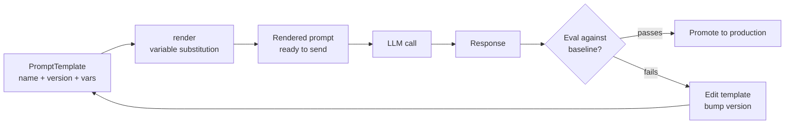

# Prompt Templates & Versioning

> A prompt that is not version-controlled cannot be debugged when it regresses. "What changed?" becomes unanswerable without history.

**Type:** Build
**Languages:** Python
**Prerequisites:** Lesson 01 (Request Anatomy), Lesson 02 (Prompt Fundamentals)
**Time:** ~45 min
**Learning Objectives:**
- Build a PromptTemplate class with variable substitution and version metadata
- Implement a simple in-memory prompt registry with lookup by name and version
- Explain the difference between a template and a rendered prompt
- Identify the failure modes of raw f-strings in production systems
- Describe the prompt lifecycle from template to evaluation

---

## The Problem

Your product has a prompt that classifies customer support tickets. It works well. Two weeks later, a developer improves it, edits the string directly in the service code, and redeploys. Ticket misclassification rate goes up 12%. Nobody notices for three days because the metric was not being tracked.

You roll back the deployment. The misclassification rate does not improve. The developer edited the prompt in two places. One was rolled back. The other was in a config file that was not part of the deployment. You spend four hours finding the second change.

This is not a contrived scenario. It happens in every team that treats prompts as throwaway strings. The root cause is always the same: prompts are coupled to code, they are not versioned separately, and there is no test that catches regressions before deployment.

The fix is to treat prompts as first-class artifacts: store them in a registry, version them, render them through a template class, and test outputs against a baseline. This lesson builds that infrastructure.

---

## The Concept

### The Prompt Lifecycle

```
TEMPLATE                     RENDER                    SEND
+-----------------+         +------------------+       +-----------+
| name: classify  |         | "Classify this   |       |           |
| version: 1.2    | ------> | ticket: 'My      | ----> | LLM call  |
| vars: {ticket,  | render  | login fails'     |       |           |
|   categories}  |         | Categories:       |       +-----------+
+-----------------+         | bug, question... |              |
        |                   +------------------+              v
        |                                             EVAL    |
  REGISTRY                                          +--------+------+
  +-----------+                                     | compare to    |
  | v1.0      |  <-- previous version               | expected      |
  | v1.1      |  <-- previous version               | output        |
  | v1.2      |  <-- current                        +---------------+
  +-----------+
        |
   ITERATE (edit template, bump version, re-eval)
```



### What Breaks With Raw f-Strings

| Pattern | Problem |
|---|---|
| `prompt = f"Classify: {ticket}"` in service code | No version, no history, edit = regression risk |
| Same prompt string in 3 files | Change one, forget two, production splits on versions |
| No variable names, just `{0}` | Caller must know argument order; breaks on refactor |
| Prompt includes HTML from user input unescaped | Prompt injection attack surface |
| No rendering test | Unknown if substitution produces valid text until runtime |

### What a Prompt Registry Gives You

A registry stores templates by name and version. You can:
- Look up the current production version of "ticket-classifier"
- Look up version 1.0 to compare against version 1.2 on an eval set
- Track who changed what and when
- A/B test by routing 10% of traffic to v1.2 while 90% runs v1.1

At small scale, an in-memory registry is fine. At production scale, this becomes a database table or an external service (Langfuse has one, Braintrust has one). The interface is identical.

---

## Build It

### The PromptTemplate Class

```python
import re
import hashlib
import json
from dataclasses import dataclass, field
from datetime import datetime, timezone


@dataclass
class PromptTemplate:
    """
    A versioned, variable-substitutable prompt template.

    Attributes:
        name: Unique identifier for this prompt (kebab-case)
        version: Semantic version string (major.minor)
        template: The prompt text with {variable} placeholders
        description: What this prompt does (required for the registry)
        variables: List of required variable names (auto-detected if not provided)
        author: Who created or last modified this version
        created_at: ISO timestamp of creation
    """
    name: str
    version: str
    template: str
    description: str
    variables: list[str] = field(default_factory=list)
    author: str = "unknown"
    created_at: str = field(
        default_factory=lambda: datetime.now(timezone.utc).isoformat()
    )

    def __post_init__(self):
        # Auto-detect variable names from {placeholder} syntax if not provided
        if not self.variables:
            self.variables = re.findall(r"\{(\w+)\}", self.template)
            self.variables = sorted(set(self.variables))

    def render(self, **kwargs) -> str:
        """
        Substitute variables into the template.
        Raises ValueError if a required variable is missing.
        Raises ValueError if an unexpected variable is passed.
        """
        missing = [v for v in self.variables if v not in kwargs]
        if missing:
            raise ValueError(
                f"Template '{self.name}' v{self.version} requires variables: "
                f"{missing}. Got: {list(kwargs.keys())}"
            )

        extra = [k for k in kwargs if k not in self.variables]
        if extra:
            raise ValueError(
                f"Template '{self.name}' v{self.version} does not use variables: "
                f"{extra}. Expected: {self.variables}"
            )

        return self.template.format(**kwargs)

    def fingerprint(self) -> str:
        """
        SHA-256 hash of the template text.
        Use this to detect accidental edits without a version bump.
        """
        return hashlib.sha256(self.template.encode()).hexdigest()[:12]

    def to_dict(self) -> dict:
        """Serialize to a JSON-compatible dict."""
        return {
            "name": self.name,
            "version": self.version,
            "description": self.description,
            "variables": self.variables,
            "author": self.author,
            "created_at": self.created_at,
            "fingerprint": self.fingerprint(),
            "template": self.template,
        }
```

The fingerprint is a small but important detail. If two developers both have "v1.2" but with different text (a common collision in shared repos), the fingerprint catches it at registry registration time.

### The Prompt Registry

```python
class PromptRegistry:
    """
    In-memory registry for PromptTemplate instances.
    Stores templates by (name, version) pair.
    Tracks which version is current for each name.
    """

    def __init__(self):
        self._templates: dict[tuple[str, str], PromptTemplate] = {}
        self._current: dict[str, str] = {}  # name -> current version

    def register(self, template: PromptTemplate, set_current: bool = True) -> None:
        """
        Add a template to the registry.
        Raises ValueError if (name, version) already exists with different content.
        """
        key = (template.name, template.version)

        if key in self._templates:
            existing = self._templates[key]
            if existing.fingerprint() != template.fingerprint():
                raise ValueError(
                    f"Template '{template.name}' v{template.version} already registered "
                    f"with different content. Bump the version number."
                )
            return  # same content, already registered

        self._templates[key] = template
        if set_current:
            self._current[template.name] = template.version

    def get(self, name: str, version: str | None = None) -> PromptTemplate:
        """
        Retrieve a template by name and optional version.
        If version is None, returns the current version.
        Raises KeyError if not found.
        """
        v = version or self._current.get(name)
        if v is None:
            raise KeyError(f"No template registered with name '{name}'")

        key = (name, v)
        if key not in self._templates:
            raise KeyError(f"Template '{name}' version '{v}' not found")

        return self._templates[key]

    def render(self, name: str, version: str | None = None, **kwargs) -> str:
        """Retrieve a template and render it in one call."""
        return self.get(name, version).render(**kwargs)

    def list_versions(self, name: str) -> list[str]:
        """Return all registered versions for a template, oldest first."""
        return sorted(
            v for (n, v) in self._templates if n == name
        )

    def current_version(self, name: str) -> str | None:
        return self._current.get(name)

    def export(self) -> list[dict]:
        """Export all templates as JSON-serializable dicts."""
        return [t.to_dict() for t in self._templates.values()]
```

> **Real-world check:** Your team has 12 prompts across 4 services. A new developer asks: "Why can't we just keep prompts as constants at the top of each service file? That is where the rest of the configuration lives." How do you explain the specific failure modes that led your team to build a registry?

### Wiring Templates to API Calls

```python
import anthropic
import os

client = anthropic.Anthropic(api_key=os.environ["ANTHROPIC_API_KEY"])
MODEL = "claude-3-5-haiku-20241022"

# Build and register templates
registry = PromptRegistry()

registry.register(PromptTemplate(
    name="ticket-classifier",
    version="1.0",
    description="Classify a customer support ticket into one of several categories.",
    template=(
        "You are a customer support classifier. "
        "Classify the following ticket into exactly one category.\n\n"
        "Ticket: {ticket_text}\n\n"
        "Available categories: {categories}\n\n"
        "Respond with only the category name, nothing else."
    ),
    author="alice",
))

registry.register(PromptTemplate(
    name="ticket-classifier",
    version="1.1",
    description="Classify a support ticket. Added confidence instruction.",
    template=(
        "You are a customer support classifier. "
        "Classify the following ticket into exactly one category.\n\n"
        "Ticket: {ticket_text}\n\n"
        "Available categories: {categories}\n\n"
        "If the ticket clearly fits one category, respond with only the category name. "
        "If it is ambiguous, respond with 'uncertain: <best_guess>'."
    ),
    author="bob",
))


def classify_ticket(ticket_text: str, version: str | None = None) -> str:
    """Classify a support ticket using the registered template."""
    prompt = registry.render(
        "ticket-classifier",
        version=version,
        ticket_text=ticket_text,
        categories="bug, billing, feature-request, account-access, general-question",
    )

    response = client.messages.create(
        model=MODEL,
        max_tokens=64,
        messages=[{"role": "user", "content": prompt}],
    )
    return response.content[0].text.strip()
```

---

## Use It

The raw f-string approach is what you start with. Here is the comparison that shows why it breaks:

```python
# --- WITHOUT templates (what most teams start with) ---

PROMPT_V1 = """Classify this ticket: {ticket_text}
Categories: {categories}"""

PROMPT_V2 = """Classify this ticket into one category: {ticket_text}
Available: {categories}
Respond with only the category name."""

# Problems:
# 1. If a dev updates PROMPT_V1 in place, the old version is gone
# 2. There is no way to know which version is deployed without reading the code
# 3. If the same prompt is copy-pasted to another service, they diverge silently
# 4. No fingerprint: two "identical" strings may differ in whitespace

# --- WITH templates (what you now have) ---

current = registry.get("ticket-classifier")
print(f"Using: {current.name} v{current.version} by {current.author}")
print(f"Fingerprint: {current.fingerprint()}")
print(f"Variables: {current.variables}")

# Run both versions on the same ticket to compare
ticket = "My login keeps saying 'invalid password' but I just reset it"
print("\nv1.0:", classify_ticket(ticket, version="1.0"))
print("v1.1:", classify_ticket(ticket, version="1.1"))
```

The template system does not add overhead per API call. It adds structure around the calls: serializable metadata, a fingerprint for drift detection, and a single source of truth for each prompt.

> **Perspective shift:** Your teammate says that DSPy (Lesson 09) optimizes prompts automatically. They argue that if prompts are going to be machine-generated, there is no point building a registry because you will not be writing the templates by hand anyway. Is this reasoning correct? What role does a registry play even when prompts are machine-generated?

---

## Ship It

The reusable artifact for this lesson is `outputs/skill-prompt-template-system.md`. It contains the `PromptTemplate` and `PromptRegistry` classes as a drop-in module.

To use the artifact:
1. Copy `PromptTemplate` and `PromptRegistry` into your project (or import from the outputs artifact)
2. Register all prompts at application startup
3. Use `registry.render("prompt-name", **vars)` everywhere you need a prompt
4. Export the registry state at startup and log it so you know exactly which version every prompt is using at any given deployment

---

## Evaluate It

**Check 1: Version bump discipline.**
Set up a CI check that computes `fingerprint()` for all registered templates and compares against a stored baseline. If a fingerprint changes without a version bump, fail the build. This catches the most common regression: editing a template string without updating the version.

**Check 2: Regression test on the eval set.**
For every prompt that has multiple versions, maintain a file of 10-20 (input, expected_output) pairs. Before promoting a new version to production, run `classify_ticket(ticket, version="1.1")` on the eval set and compare the outputs to those from v1.0. If any expected outputs change, review the diff before deploying.

**Check 3: Log template metadata with every API call.**
Include `prompt_name`, `prompt_version`, and `prompt_fingerprint` in your observability logs alongside every LLM call. When a regression is detected in production, you can immediately query "which prompt version was running when misclassification rate went up?" without needing to reconstruct from deployment logs.

**Check 4: Variable coverage test.**
Write a unit test that instantiates every template in the registry, renders it with dummy values, and asserts no KeyError or ValueError is raised. This catches variable name typos before production. Run it in CI on every push.
