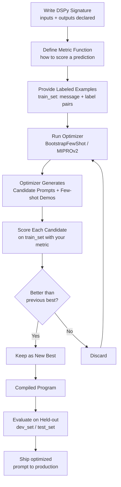

# تحسين الـ Prompt برمجيًّا باستخدام DSPy

> عندما يصل ضبط الـ prompt اليدوي إلى سقفه، تعامَل مع هندسة الـ prompt كمسألة بحث (search problem) ودَع البيانات المُعنونة (labeled data) تقوم بالعمل.

**النوع:** بناء
**اللغات:** Python
**المتطلبات:** الدرس 01 (تشريح الطلب)، الدرس 03 (few-shot وسلسلة التفكير chain-of-thought)، الدرس 05 (أساسيات التقييم)
**الوقت:** ~60 دقيقة
**أهداف التعلّم:**
- شرح ما الذي يفعله DSPy بشكل مختلف عن هندسة الـ prompt اليدوية
- بناء وحدة (module) في DSPy تصنّف النصوص باستخدام توقيع (signature)
- تشغيل BootstrapFewShot لتحسين أمثلة الـ few-shot تلقائيًّا
- قياس ما إذا كان التحسين قد رفع الدقّة على مجموعة تقييم محجوزة (held-out evaluation set)
- تحديد الظروف التي يستحقّ فيها DSPy التعقيد الإضافي

---

## المشكلة

لديك مصنّف لتذاكر دعم العملاء. قضيتَ يومين في كتابة وإعادة كتابة الـ system prompt. الدقّة على مجموعة الاختبار هي 74%. تجرّب صياغات مختلفة، تضيف أمثلة أكثر، تعيد هيكلة تعليمات المخرجات. لا شيء يحرّك المؤشّر فوق 78%.

المشكلة ليست أنك بحاجة إلى prompt أفضل. المشكلة أنك تبحث عن prompt جيّد يدويًّا، ضمن فضاء أكبر من أن يُستكشف يدويًّا.

ضبط الـ prompt اليدوي له سقف. بعد نقطة معيّنة، تصبح تخمّن. لا تعرف ما إذا كانت "Classify the following ticket" تتفوّق على "You are a support ticket classifier" بالنسبة لمجموعة التصنيفات (labels) ونموذجك تحديدًا. سيتعيّن عليك اختبار كل صياغة بشكل منهجي، على بيانات مُعنونة، بمقياس (metric). هذه مسألة بحث. وDSPy يؤتمت هذا البحث.

---

## المفهوم

### ما الذي يفعله DSPy

يفصل DSPy منطق برنامجك عن نص الـ prompt. تكتب وحدة (module) تُصرّح بما يدخل (رسالة عميل) وما ينبغي أن يخرج (تصنيف فئة). يجمّع DSPy تلك الوحدة في prompt عملي عبر البحث عن تعليمات وأمثلة few-shot تُعظّم مقياسك على أمثلة التدريب لديك.

النقلة الأساسية: تتوقّف عن كتابة الـ prompts وتبدأ بكتابة برامج بأهداف قابلة للقياس.

```
┌──────────────────────────────────────────────────────────────────┐
│  MANUAL PROMPT ENGINEERING                                       │
│                                                                  │
│  You write prompt text              You test on examples         │
│  "Classify the ticket as..."   →    Accuracy: 74%               │
│  "You are an expert at..."     →    Accuracy: 76%               │
│  "Given the support ticket..."  →   Accuracy: 77%               │
│                                                                  │
│  Human guess loop. Slow. Hits a ceiling.                         │
└──────────────────────────────────────────────────────────────────┘

┌──────────────────────────────────────────────────────────────────┐
│  DSPY OPTIMIZATION                                               │
│                                                                  │
│  You write a module + metric    Optimizer searches               │
│  classify(message) -> label  +  train_set (labeled examples)     │
│  metric: accuracy                                                │
│                                     Compiles optimized prompt    │
│                               →    with selected few-shot demos  │
│                               →    Accuracy: 83% (on holdout)    │
│                                                                  │
│  Systematic search. Reproducible. Scales with data.              │
└──────────────────────────────────────────────────────────────────┘
```

### حلقة التجميع (Compile Loop) في DSPy



### وقت التجميع (Compile-Time) مقابل وقت التشغيل (Runtime)

هذا التمييز مهم لأنظمة الإنتاج.

- **وقت التجميع (Compile-time)**: يعمل المحسّن (optimizer) مرّة واحدة، خارج الاتصال (offline)، مقابل بياناتك المُعنونة. يُنتج كائن برنامج محسَّن (يتضمّن التعليمات المختارة وأمثلة الـ few-shot). وهذا مكلف وبطيء بحكم تصميمه.
- **وقت التشغيل (Runtime)**: يستدعي تطبيقك البرنامج المُجمَّع. يرسل البرنامج المُجمَّع prompt واحدًا مُصاغًا بعناية إلى الـ LLM. وهذا سريع ورخيص.

تجمّع مرّة واحدة. تستدعي في وقت التشغيل آلاف المرّات. تكلفة التحسين تُوزَّع (amortized) على كل استدعاء استدلال (inference call).

### متى يستحقّ DSPy تعقيده

يضيف DSPy عبئًا حقيقيًّا: مكتبة جديدة، وخطوة تجميع، ومتطلّب مجموعة بيانات مُعنونة. وهو ليس الأداة المناسبة لكل موقف.

استخدم DSPy عندما:
- يكون لديك بيانات مُعنونة (20-50 مثالًا كحد أدنى لـ BootstrapFewShot، و200+ لـ MIPROv2)
- يصل ضبط الـ prompt اليدوي إلى سقفه ولا تستطيع تفسير لماذا يتفوّق prompt على آخر
- تحتاج إلى إعادة التحسين عند تغيّر توزيع التصنيفات (label distribution) أو عند تبديل النماذج
- تكون لمهمّتك هدف قابل للقياس (الدقّة، F1، التطابق التام)

ابقَ مع الـ prompts اليدوية عندما:
- لا يكون لديك بيانات مُعنونة
- تكون المهمّة استكشافية أو تتغيّر بشكل متكرر
- تكون في مرحلة النمذجة الأولية (prototyping) ولا تعرف بعد كيف يبدو "الصحيح"

---

## البناء

### الخطوة 1: تثبيت DSPy والإعداد

```python
# pip install dspy anthropic
# export ANTHROPIC_API_KEY=sk-ant-...
import dspy
import random
from typing import Literal

# Configure DSPy to use Claude
lm = dspy.LM(
    model="anthropic/claude-3-5-haiku-20241022",
    api_key=None,  # reads ANTHROPIC_API_KEY from env
    max_tokens=256,
    temperature=0.0,
)
dspy.configure(lm=lm)
```

يلفّ DSPy نموذج Claude عبر litellm تحت الغطاء. يستخدم نص `model` صيغة بادئة المزوّد (provider prefix) الخاصة بـ litellm.

### الخطوة 2: تعريف التوقيع (Signature)

يُصرّح توقيع DSPy بما تأخذه الوحدة وما ينبغي أن تُنتجه. إنه الواجهة (interface)، وليس التنفيذ (implementation).

```python
class ClassifyTicket(dspy.Signature):
    """Classify a customer support ticket into exactly one category."""

    message: str = dspy.InputField(
        desc="The raw text of a customer support ticket."
    )
    category: Literal["billing", "technical", "shipping", "returns", "general"] = dspy.OutputField(
        desc="The support category that best fits the ticket."
    )
```

يصبح سلسلة التوثيق (docstring) وصفَ المهمّة في الـ prompt المُجمَّع. وتوجّه أوصاف الحقول (field descriptions) المحسّنَ عندما يختار أمثلة الـ few-shot. وتُخبر تلميحة النوع `Literal` نظامَ DSPy بالقيم الصالحة بالضبط لحقل المخرج.

### الخطوة 3: بناء بيانات التدريب والتقييم

```python
# Labeled examples for the optimizer and for evaluation
ALL_EXAMPLES = [
    dspy.Example(message="My invoice shows a double charge from last month.", category="billing"),
    dspy.Example(message="The app crashes every time I try to upload a file.", category="technical"),
    dspy.Example(message="My package was supposed to arrive 3 days ago. Where is it?", category="shipping"),
    dspy.Example(message="I want to return the jacket I bought last week.", category="returns"),
    dspy.Example(message="Can you tell me your store hours?", category="general"),
    dspy.Example(message="I was charged twice for the same subscription.", category="billing"),
    dspy.Example(message="The login page keeps showing an error code 503.", category="technical"),
    dspy.Example(message="My order has been in transit for 12 days with no updates.", category="shipping"),
    dspy.Example(message="How do I return a damaged item I received?", category="returns"),
    dspy.Example(message="Do you offer student discounts?", category="general"),
    dspy.Example(message="My credit card was charged but the order was never confirmed.", category="billing"),
    dspy.Example(message="The mobile app does not work on iOS 17.", category="technical"),
    dspy.Example(message="I need to change the delivery address for my current order.", category="shipping"),
    dspy.Example(message="I accidentally ordered the wrong size. Can I exchange it?", category="returns"),
    dspy.Example(message="What payment methods do you accept?", category="general"),
    dspy.Example(message="Why was my refund only partial?", category="billing"),
    dspy.Example(message="The password reset email never arrives.", category="technical"),
    dspy.Example(message="My package shows delivered but I never received it.", category="shipping"),
    dspy.Example(message="Your return policy page gives a 404 error.", category="technical"),
    dspy.Example(message="I have a question about your loyalty rewards program.", category="general"),
]

# Split: 14 for training the optimizer, 6 held out for evaluation
random.seed(42)
shuffled = ALL_EXAMPLES[:]
random.shuffle(shuffled)

train_set = [ex.with_inputs("message") for ex in shuffled[:14]]
dev_set   = [ex.with_inputs("message") for ex in shuffled[14:]]

print(f"Train: {len(train_set)} examples, Dev: {len(dev_set)} examples")
```

### الخطوة 4: بناء وحدة خط الأساس (Baseline)

```python
# The unoptimized module: no few-shot examples, just the signature
baseline_module = dspy.Predict(ClassifyTicket)
```

`dspy.Predict` هي أبسط وحدات DSPy الأساسية. تأخذ توقيعًا (Signature) وتولّد تنبؤًا واحدًا لكل استدعاء. لا تحسين بعد.

### الخطوة 5: تعريف المقياس (Metric)

```python
def accuracy_metric(example: dspy.Example, prediction, trace=None) -> bool:
    """
    Returns True if the predicted category matches the gold label.
    DSPy optimizers call this function on every training example.
    The `trace` parameter is used internally by some optimizers; pass it through.
    """
    return prediction.category.strip().lower() == example.category.strip().lower()
```

دالّة المقياس هي ما يحسّن DSPy على أساسه. يجب أن تُرجع قيمة منطقية (boolean) أو رقمًا عشريًّا (float). أبقِها أقرب ما يكون إلى مقياس تقييمك الحقيقي.

### الخطوة 6: تشغيل المحسّن (Optimizer)

```python
from dspy.teleprompt import BootstrapFewShot

# BootstrapFewShot: the simplest optimizer.
# It generates candidate few-shot examples by running the program on training data,
# filters to examples where the program got the right answer,
# then selects the best subset to include as demonstrations.
optimizer = BootstrapFewShot(
    metric=accuracy_metric,
    max_bootstrapped_demos=4,   # max few-shot examples to add
    max_labeled_demos=4,        # also use provided labeled examples
    max_rounds=1,               # number of bootstrap rounds
)

print("Compiling optimized module...")
optimized_module = optimizer.compile(
    student=dspy.Predict(ClassifyTicket),  # the module to optimize
    trainset=train_set,
)
print("Compilation complete.")
```

تُشغّل خطوة التجميع الوحدةَ مقابل أمثلة التدريب، وتُقيّم كلًّا منها بمقياسك، وتختار أفضل عروض الـ few-shot أداءً لتضمينها.

> **اختبار من الواقع:** يراك مدير منتج تشغّل هذا المحسّن فيسأل: "هذا في الأساس مجرد اختيار آلي لأمثلة توضع في الـ prompt، صحيح؟ لماذا نحتاج إلى مكتبة كاملة لذلك؟" كيف تشرح ما يضيفه DSPy بما يتجاوز اختيار الأمثلة، ومتى يهمّ ذلك؟

### الخطوة 7: تقييم كلتا الوحدتين

```python
def evaluate_module(module, eval_set: list, label: str) -> float:
    """Run a module against an eval set and print per-example results."""
    correct = 0
    print(f"\n{'=' * 50}")
    print(f"Evaluating: {label}")
    print(f"{'=' * 50}")

    for ex in eval_set:
        pred = module(message=ex.message)
        is_correct = accuracy_metric(ex, pred)
        correct += int(is_correct)
        status = "OK" if is_correct else "WRONG"
        print(f"[{status}] '{ex.message[:50]}...' -> pred={pred.category}, gold={ex.category}")

    acc = correct / len(eval_set)
    print(f"\nAccuracy: {correct}/{len(eval_set)} = {acc:.1%}")
    return acc


baseline_acc  = evaluate_module(baseline_module,  dev_set, "Baseline (no optimization)")
optimized_acc = evaluate_module(optimized_module, dev_set, "Optimized (BootstrapFewShot)")

print(f"\nAccuracy improvement: {baseline_acc:.1%} -> {optimized_acc:.1%}")
```

### الخطوة 8: فحص الـ Prompt المُجمَّع

```python
# See exactly what the optimizer produced
print("\n--- Compiled prompt (what gets sent to Claude) ---")
optimized_module.dump_state()
```

يُظهر لك استدعاء `dump_state()` التعليمات المحسَّنة وعروض الـ few-shot التي اختارها DSPy. هذه الشفافية مهمّة: يمكنك تدقيق ما اختاره المحسّن بالضبط ولماذا.

---

## الاستخدام

يأتي DSPy مزوّدًا بعدّة محسّنات (optimizers). كلٌّ منها يناسب مواقف مختلفة.

**BootstrapFewShot** (المستخدَم أعلاه) هو نقطة الانطلاق:
- يعمل بعدد لا يقلّ عن 20 مثالًا مُعنونًا
- يجمّع في ثوانٍ إلى دقائق
- يضيف عروض few-shot إلى الـ prompt
- الأفضل لـ: التصنيف، والاستخراج، ومهام التوليد المباشرة

**MIPROv2** يبحث في كلٍّ من التعليمات وأمثلة الـ few-shot في آنٍ واحد:

```python
from dspy.teleprompt import MIPROv2

# MIPROv2 is more powerful but requires more data and compute.
# Recommend: 200+ training examples, budget ~30-60 minutes compile time.
optimizer_v2 = MIPROv2(
    metric=accuracy_metric,
    auto="light",      # "light" = faster; "medium" or "heavy" = more thorough
    num_candidates=10, # instruction candidates to generate and evaluate
)

# Same compile interface as BootstrapFewShot
optimized_v2 = optimizer_v2.compile(
    student=dspy.Predict(ClassifyTicket),
    trainset=train_set,
    requires_permission_to_run=False,
)
```

**المفاضلة الصادقة:**

```
BootstrapFewShot              MIPROv2
-----------------             -------
Works with 20+ examples       Needs 200+ examples
Compiles in < 5 minutes       Compiles in 30-60 minutes
Optimizes: demos only         Optimizes: instructions + demos
Good first choice             Good when you have data and time
```

**حفظ برنامج مُجمَّع وتحميله:**

```python
# Save after compilation (compile is expensive; save the result)
optimized_module.save("optimized_classifier.json")

# Load in production (fast; no recompilation needed)
loaded_module = dspy.Predict(ClassifyTicket)
loaded_module.load("optimized_classifier.json")

# Production inference: just call it
result = loaded_module(message="I was charged twice for one order.")
print(result.category)  # "billing"
```

> **نقلة في المنظور:** يعترض مهندس أقدم: "لدينا بالفعل نموذج مضبوط بدقّة (fine-tuned) لهذا. لماذا نستخدم تحسين الـ prompt مع نموذج أساس أكبر بدلًا من ذلك؟" كيف تصوغ المفاضلة من حيث التكلفة وزمن الاستجابة (latency)، ومتى تكون نقطة التحوّل (tipping point) في صالح كل نهج؟

---

## التسليم

الأصل (artifact) القابل لإعادة الاستخدام هو `outputs/skill-dspy-optimizer.md`. يلتقط إطار اتخاذ القرار لمتى تلجأ إلى DSPy، ودليل اختيار المحسّن، ونمط الحفظ/التحميل في الإنتاج.

الكود القابل للتشغيل هو `code/main.py`. شغّله بـ:

```bash
pip install dspy anthropic
export ANTHROPIC_API_KEY=sk-ant-...
python main.py
```

المخرج المتوقَّع: دقّة خط الأساس، والدقّة بعد التحسين، ومقارنة. مع مجموعة البيانات الصغيرة المستخدَمة هنا (14 للتدريب، 6 للتطوير dev)، ستتباين النتائج بين التشغيلات. على مجموعات بيانات أكبر (100+ مثال)، تكون ميزة التحسين أكثر اتّساقًا.

---

## التقييم

تحسين DSPy هو بحدّ ذاته تجربة تعلّم آلي (ML experiment). عامِله على هذا الأساس.

**ما الذي تقيسه:**

| المقياس | كيف يُحسب | الهدف |
|--------|---------------|--------|
| دقّة خط الأساس | شغّل الوحدة غير المحسّنة على dev_set | نقطة انطلاقك |
| الدقّة بعد التحسين | شغّل الوحدة المُجمَّعة على dev_set | ينبغي أن تتجاوز خط الأساس |
| تكلفة التجميع | استدعاءات الـ LLM أثناء optimizer.compile() | سجّلها وضع لها ميزانية |
| زمن استجابة الاستدلال | الزمن لكل استدعاء على الوحدة المُجمَّعة | ينبغي أن يطابق الـ prompt اليدوي |

**تقسيم التقييم (eval split) يهمّ أكثر منه في الضبط بدقّة (fine-tuning).** ترى محسّنات DSPy مجموعة التدريب أثناء التجميع. إذا تسرّبت مجموعة الـ dev إلى مجموعة التدريب، فستفرط في الملاءمة (overfit): يجد المحسّن أمثلة تصادف أنها تطابق أمثلة dev_set، وليس أمثلة تُعمّم (generalize). احجز دائمًا مجموعة dev لا يلمسها المحسّن أبدًا.

**كيف تعرف ما إذا كان DSPy يستحقّ العناء لمهمّتك:**

1. ضع خط أساس: شغّل prompt يدويًّا، وقيّم على dev_set
2. جمّع باستخدام BootstrapFewShot، وقيّم على dev_set
3. إذا كان التحسّن أقل من 3-5 نقاط مئوية: قد لا تستفيد المهمّة من اختيار العروض (demos). جرّب MIPROv2 أو مزيدًا من بيانات التدريب قبل أن تستسلم.
4. إذا كان التحسّن 5 نقاط مئوية أو أكثر: فإن DSPy يؤدّي دوره. ضع خطوة التجميع ضمن ميزانية خط نشرك (deployment pipeline).

**أنماط الفشل الشائعة:**

| المشكلة | العرَض | الحل |
|---------|---------|-----|
| بيانات تدريب قليلة جدًّا | المحسّن يرفع دقّة التدريب لكن دقّة الـ dev أسوأ | أضِف مزيدًا من الأمثلة المُعنونة؛ لا تستخدم أقل من 20 |
| مقياس خاطئ | المحسّن يرفع المقياس لكن الجودة الواقعية لا تتحسّن | اجعل مقياسك أكثر توافقًا مع احتياجات المستخدم الفعلية |
| عدم تطابق نوع التصنيف | `prediction.category` لا يطابق حالة الأحرف في example.category | طبّع الطرفين في دالّة المقياس |
| برنامج مُجمَّع قديم | تنخفض دقّة الإنتاج بعد تحديث النموذج | أعِد التجميع بالنموذج الجديد؛ لا تُعِد استخدام الحالة المُجمَّعة عبر إصدارات النماذج |
