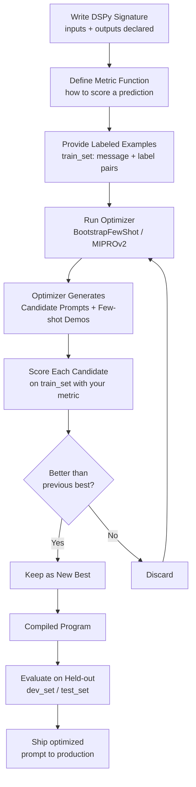

# Programmatic Prompt Optimization with DSPy

> When manual prompt tuning plateaus, treat prompt engineering as a search problem and let labeled data do the work.

**Type:** Build
**Languages:** Python
**Prerequisites:** Lesson 01 (request anatomy), Lesson 03 (few-shot and chain-of-thought), Lesson 05 (evaluation basics)
**Time:** ~60 min
**Learning Objectives:**
- Explain what DSPy does differently from manual prompt engineering
- Build a DSPy module that classifies text using a signature
- Run BootstrapFewShot to optimize few-shot examples automatically
- Measure whether optimization improved accuracy on a held-out evaluation set
- Identify the conditions where DSPy is worth the added complexity

---

## The Problem

You have a customer support ticket classifier. You spent two days writing and rewriting the system prompt. Accuracy on your test set is 74%. You try different phrasings, add more examples, restructure the output instructions. Nothing moves the needle past 78%.

The problem is not that you need a better prompt. The problem is that you are searching for a good prompt by hand, in a space that is too large to explore manually.

Manual prompt tuning has a ceiling. Past a certain point, you are guessing. You do not know whether "Classify the following ticket" outperforms "You are a support ticket classifier" for your specific label set and model. You would have to test every variant systematically, on labeled data, with a metric. That is a search problem. DSPy automates that search.

---

## The Concept

### What DSPy Does

DSPy separates your program logic from the prompt text. You write a module that declares what goes in (a customer message) and what should come out (a category label). DSPy compiles that module into a working prompt by searching for instructions and few-shot examples that maximize your metric on your training examples.

The key shift: you stop writing prompts and start writing programs with measurable objectives.

```
┌──────────────────────────────────────────────────────────────────┐
│  MANUAL PROMPT ENGINEERING                                       │
│                                                                  │
│  You write prompt text              You test on examples         │
│  "Classify the ticket as..."   →    Accuracy: 74%               │
│  "You are an expert at..."     →    Accuracy: 76%               │
│  "Given the support ticket..."  →   Accuracy: 77%               │
│                                                                  │
│  Human guess loop. Slow. Hits a ceiling.                         │
└──────────────────────────────────────────────────────────────────┘

┌──────────────────────────────────────────────────────────────────┐
│  DSPY OPTIMIZATION                                               │
│                                                                  │
│  You write a module + metric    Optimizer searches               │
│  classify(message) -> label  +  train_set (labeled examples)     │
│  metric: accuracy                                                │
│                                     Compiles optimized prompt    │
│                               →    with selected few-shot demos  │
│                               →    Accuracy: 83% (on holdout)    │
│                                                                  │
│  Systematic search. Reproducible. Scales with data.              │
└──────────────────────────────────────────────────────────────────┘
```

### The DSPy Compile Loop



### Compile-Time vs Runtime

This distinction matters for production systems.

- **Compile-time**: the optimizer runs once, offline, against your labeled data. It produces an optimized program object (which includes the chosen instructions and few-shot examples). This is expensive and slow by design.
- **Runtime**: your application calls the compiled program. The compiled program sends one carefully constructed prompt to the LLM. This is fast and cheap.

You compile once. You call at runtime thousands of times. The cost of optimization is amortized across every inference call.

### When DSPy Earns Its Complexity

DSPy adds real overhead: a new library, a compile step, a labeled dataset requirement. It is not the right tool for every situation.

Use DSPy when:
- You have labeled data (at minimum 20-50 examples for BootstrapFewShot, 200+ for MIPROv2)
- Manual prompt tuning has plateaued and you cannot explain why one prompt outperforms another
- You need to re-optimize when the label distribution changes or you switch models
- Your task has a measurable objective (accuracy, F1, exact match)

Stay with manual prompts when:
- You have no labeled data
- The task is exploratory or changes frequently
- You are prototyping and do not yet know what "correct" looks like

---

## Build It

### Step 1: Install DSPy and Set Up

```python
# pip install dspy anthropic
# export ANTHROPIC_API_KEY=sk-ant-...
import dspy
import random
from typing import Literal

# Configure DSPy to use Claude
lm = dspy.LM(
    model="anthropic/claude-3-5-haiku-20241022",
    api_key=None,  # reads ANTHROPIC_API_KEY from env
    max_tokens=256,
    temperature=0.0,
)
dspy.configure(lm=lm)
```

DSPy wraps Claude via litellm under the hood. The `model` string uses litellm's provider prefix format.

### Step 2: Define the Signature

A DSPy Signature declares what a module takes in and what it should produce. It is the interface, not the implementation.

```python
class ClassifyTicket(dspy.Signature):
    """Classify a customer support ticket into exactly one category."""

    message: str = dspy.InputField(
        desc="The raw text of a customer support ticket."
    )
    category: Literal["billing", "technical", "shipping", "returns", "general"] = dspy.OutputField(
        desc="The support category that best fits the ticket."
    )
```

The docstring becomes the task description in the compiled prompt. The field descriptions guide the optimizer when it selects few-shot examples. The `Literal` type hint tells DSPy the exact valid values for the output field.

### Step 3: Build Training and Evaluation Data

```python
# Labeled examples for the optimizer and for evaluation
ALL_EXAMPLES = [
    dspy.Example(message="My invoice shows a double charge from last month.", category="billing"),
    dspy.Example(message="The app crashes every time I try to upload a file.", category="technical"),
    dspy.Example(message="My package was supposed to arrive 3 days ago. Where is it?", category="shipping"),
    dspy.Example(message="I want to return the jacket I bought last week.", category="returns"),
    dspy.Example(message="Can you tell me your store hours?", category="general"),
    dspy.Example(message="I was charged twice for the same subscription.", category="billing"),
    dspy.Example(message="The login page keeps showing an error code 503.", category="technical"),
    dspy.Example(message="My order has been in transit for 12 days with no updates.", category="shipping"),
    dspy.Example(message="How do I return a damaged item I received?", category="returns"),
    dspy.Example(message="Do you offer student discounts?", category="general"),
    dspy.Example(message="My credit card was charged but the order was never confirmed.", category="billing"),
    dspy.Example(message="The mobile app does not work on iOS 17.", category="technical"),
    dspy.Example(message="I need to change the delivery address for my current order.", category="shipping"),
    dspy.Example(message="I accidentally ordered the wrong size. Can I exchange it?", category="returns"),
    dspy.Example(message="What payment methods do you accept?", category="general"),
    dspy.Example(message="Why was my refund only partial?", category="billing"),
    dspy.Example(message="The password reset email never arrives.", category="technical"),
    dspy.Example(message="My package shows delivered but I never received it.", category="shipping"),
    dspy.Example(message="Your return policy page gives a 404 error.", category="technical"),
    dspy.Example(message="I have a question about your loyalty rewards program.", category="general"),
]

# Split: 14 for training the optimizer, 6 held out for evaluation
random.seed(42)
shuffled = ALL_EXAMPLES[:]
random.shuffle(shuffled)

train_set = [ex.with_inputs("message") for ex in shuffled[:14]]
dev_set   = [ex.with_inputs("message") for ex in shuffled[14:]]

print(f"Train: {len(train_set)} examples, Dev: {len(dev_set)} examples")
```

### Step 4: Build the Baseline Module

```python
# The unoptimized module: no few-shot examples, just the signature
baseline_module = dspy.Predict(ClassifyTicket)
```

`dspy.Predict` is the most fundamental DSPy module. It takes a Signature and generates one prediction per call. No optimization yet.

### Step 5: Define the Metric

```python
def accuracy_metric(example: dspy.Example, prediction, trace=None) -> bool:
    """
    Returns True if the predicted category matches the gold label.
    DSPy optimizers call this function on every training example.
    The `trace` parameter is used internally by some optimizers; pass it through.
    """
    return prediction.category.strip().lower() == example.category.strip().lower()
```

The metric function is what DSPy optimizes against. It must return a boolean or a float. Keep it as close to your real evaluation metric as possible.

### Step 6: Run the Optimizer

```python
from dspy.teleprompt import BootstrapFewShot

# BootstrapFewShot: the simplest optimizer.
# It generates candidate few-shot examples by running the program on training data,
# filters to examples where the program got the right answer,
# then selects the best subset to include as demonstrations.
optimizer = BootstrapFewShot(
    metric=accuracy_metric,
    max_bootstrapped_demos=4,   # max few-shot examples to add
    max_labeled_demos=4,        # also use provided labeled examples
    max_rounds=1,               # number of bootstrap rounds
)

print("Compiling optimized module...")
optimized_module = optimizer.compile(
    student=dspy.Predict(ClassifyTicket),  # the module to optimize
    trainset=train_set,
)
print("Compilation complete.")
```

The compile step runs the module against training examples, scores each with your metric, and selects the best-performing few-shot demonstrations to include.

> **Real-world check:** A product manager sees you running this optimizer and asks: "This is basically just automatically picking examples to put in the prompt, right? Why do we need a whole library for that?" How would you explain what DSPy adds beyond example selection, and when that matters?

### Step 7: Evaluate Both Modules

```python
def evaluate_module(module, eval_set: list, label: str) -> float:
    """Run a module against an eval set and print per-example results."""
    correct = 0
    print(f"\n{'=' * 50}")
    print(f"Evaluating: {label}")
    print(f"{'=' * 50}")

    for ex in eval_set:
        pred = module(message=ex.message)
        is_correct = accuracy_metric(ex, pred)
        correct += int(is_correct)
        status = "OK" if is_correct else "WRONG"
        print(f"[{status}] '{ex.message[:50]}...' -> pred={pred.category}, gold={ex.category}")

    acc = correct / len(eval_set)
    print(f"\nAccuracy: {correct}/{len(eval_set)} = {acc:.1%}")
    return acc


baseline_acc  = evaluate_module(baseline_module,  dev_set, "Baseline (no optimization)")
optimized_acc = evaluate_module(optimized_module, dev_set, "Optimized (BootstrapFewShot)")

print(f"\nAccuracy improvement: {baseline_acc:.1%} -> {optimized_acc:.1%}")
```

### Step 8: Inspect the Compiled Prompt

```python
# See exactly what the optimizer produced
print("\n--- Compiled prompt (what gets sent to Claude) ---")
optimized_module.dump_state()
```

The `dump_state()` call shows you the optimized instructions and the few-shot demonstrations DSPy selected. This transparency is important: you can audit exactly what the optimizer chose and why.

---

## Use It

DSPy ships with several optimizers. Each suits different situations.

**BootstrapFewShot** (used above) is the starting point:
- Works with as few as 20 labeled examples
- Compiles in seconds to minutes
- Adds few-shot demonstrations to the prompt
- Best for: classification, extraction, straightforward generation tasks

**MIPROv2** searches over both instructions and few-shot examples simultaneously:

```python
from dspy.teleprompt import MIPROv2

# MIPROv2 is more powerful but requires more data and compute.
# Recommend: 200+ training examples, budget ~30-60 minutes compile time.
optimizer_v2 = MIPROv2(
    metric=accuracy_metric,
    auto="light",      # "light" = faster; "medium" or "heavy" = more thorough
    num_candidates=10, # instruction candidates to generate and evaluate
)

# Same compile interface as BootstrapFewShot
optimized_v2 = optimizer_v2.compile(
    student=dspy.Predict(ClassifyTicket),
    trainset=train_set,
    requires_permission_to_run=False,
)
```

**The honest tradeoff:**

```
BootstrapFewShot              MIPROv2
-----------------             -------
Works with 20+ examples       Needs 200+ examples
Compiles in < 5 minutes       Compiles in 30-60 minutes
Optimizes: demos only         Optimizes: instructions + demos
Good first choice             Good when you have data and time
```

**Saving and loading a compiled program:**

```python
# Save after compilation (compile is expensive; save the result)
optimized_module.save("optimized_classifier.json")

# Load in production (fast; no recompilation needed)
loaded_module = dspy.Predict(ClassifyTicket)
loaded_module.load("optimized_classifier.json")

# Production inference: just call it
result = loaded_module(message="I was charged twice for one order.")
print(result.category)  # "billing"
```

> **Perspective shift:** A senior engineer pushes back: "We already have a fine-tuned model for this. Why would we use prompt optimization with a larger base model instead?" How would you frame the tradeoff in terms of cost, latency, and when the tipping point favors each approach?

---

## Ship It

The reusable artifact is `outputs/skill-dspy-optimizer.md`. It captures the decision framework for when to reach for DSPy, the optimizer selection guide, and the production save/load pattern.

The runnable code is `code/main.py`. Run it with:

```bash
pip install dspy anthropic
export ANTHROPIC_API_KEY=sk-ant-...
python main.py
```

Expected output: baseline accuracy, optimized accuracy, and a comparison. With the small dataset used here (14 training, 6 dev), results will vary across runs. On larger datasets (100+ examples), the advantage of optimization is more consistent.

---

## Evaluate It

DSPy optimization is itself an ML experiment. Treat it like one.

**What to measure:**

| Metric | How to compute | Target |
|--------|---------------|--------|
| Baseline accuracy | Run unoptimized module on dev_set | Your starting point |
| Optimized accuracy | Run compiled module on dev_set | Should exceed baseline |
| Compile cost | LLM calls during optimizer.compile() | Log and budget |
| Inference latency | Time per call on compiled module | Should match manual prompt |

**The eval split matters more than in fine-tuning.** DSPy optimizers see your training set during compilation. If your dev set leaks into the training set, you will overfit: the optimizer finds examples that happen to match dev_set examples, not examples that generalize. Always hold out a dev set that the optimizer never touches.

**How to know if DSPy is worth it for your task:**

1. Establish a baseline: run manual prompt, score on dev_set
2. Compile with BootstrapFewShot, score on dev_set
3. If improvement is less than 3-5 percentage points: the task may not benefit from demo selection. Try MIPROv2 or more training data before giving up.
4. If improvement is 5+ percentage points: DSPy is pulling its weight. Budget the compile step into your deployment pipeline.

**Common failure modes:**

| Problem | Symptom | Fix |
|---------|---------|-----|
| Too little training data | Optimizer improves training accuracy but dev accuracy is worse | Add more labeled examples; do not use less than 20 |
| Wrong metric | Optimizer improves metric but real-world quality does not improve | Align your metric more closely with actual user needs |
| Label type mismatch | `prediction.category` does not match example.category casing | Normalize both sides in the metric function |
| Stale compiled program | Production accuracy drops after model update | Recompile with the new model; do not reuse compiled state across model versions |
