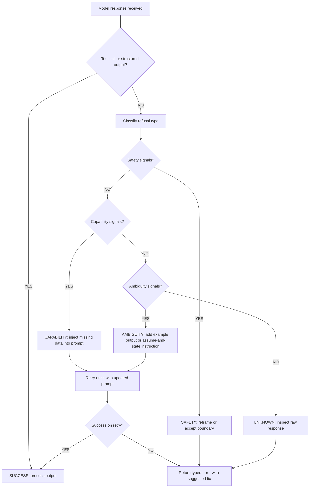

# التعامل مع الرفض والحالات الحدّية

> معظم "حالات الرفض" في الإنتاج هي عدم توافق في القدرات (capability mismatches)، وليست حجبًا أمنيًّا. أصلِح الـ prompt، لا حالة الاستخدام.

**النوع:** بناء
**اللغات:** Python
**المتطلبات:** الدرس 01 (تشريح الطلب)، الدرس 02 (أساسيات الـ prompt)، الدرس 06 (المخرجات المهيكلة structured outputs)
**الوقت:** ~45 دقيقة
**أهداف التعلّم:**
- تصنيف رد النموذج كرفض أمني (safety refusal)، أو عدم توافق في القدرات (capability mismatch)، أو رفض بسبب الغموض (ambiguity refusal)
- بناء RefusalDetector يصنّف حالات الفشل قبل إعادة المحاولة
- كتابة استراتيجيات تعافٍ موجّهة لكل فئة رفض
- التمييز بين حالات الرفض التي تتطلّب تغييرات في الـ prompt وتلك التي تتطلّب إعادة تصميم المهمّة
- قياس معدّلات الرفض في الإنتاج لالتقاط تراجعات الـ prompt مبكرًا

---

## المشكلة

يُرجع استدعاء الـ API لديك رمز حالة 200 ومتن استجابة (response body)، لكن الاستجابة ليست ما طلبتَه. بل هي شيء مثل: "I'm not able to help with that"، أو "Could you clarify what you mean?"، أو "I don't have access to real-time information". يمرّر تطبيقك هذا النص بصمت إلى الخطوة التالية، فينكسر بطريقة محيّرة بعد طبقتين.

أنظمة الإنتاج تصطدم بهذا باستمرار. خط استخراج وثائق يُرجع "I notice this document contains personal information" بدلًا من كائن JSON. أداة توليد كود تُرجع "I can't run code" عندما يُطلب منها تحليل مخرج. روبوت دعم عملاء يُرجع "I'd be happy to help, but I need more context" بينما تحتوي التذكرة على 400 كلمة من السياق بالفعل.

الحل الساذج هو إضافة "please just answer the question" إلى كل prompt والأمل في الأفضل. ينجح ذلك مرّة واحدة. ما تحتاجه هو طريقة منهجية لاكتشاف نوع الرفض، وفهم سببه الجذري، وتطبيق استراتيجية التعافي الصحيحة: لأن الرفض الأمني، وعدم توافق القدرات، والرفض بسبب الغموض، كلٌّ منها يتطلّب حلًّا مختلفًا.

---

## المفهوم

### ثلاث فئات للرفض

ليست كل اللاإجابات سواء. الخلط بين الفئات يجعل المهندسين يطبّقون الحل الخاطئ.

```
REFUSAL CATEGORIES
==================

1. SAFETY REFUSAL
   Model declines because the request triggers a safety policy.
   Symptoms: "I can't help with that", "That could cause harm"
   Root cause: Request is genuinely prohibited, OR the framing
               triggered a false positive in safety classifiers.
   Fix options: Reframe (legitimate use), accept (actual violation),
                or use a different model with different policies.

2. CAPABILITY MISMATCH
   Model declines because it thinks it cannot do the task.
   Symptoms: "I don't have access to...", "I can't run code",
             "I don't have real-time information"
   Root cause: The prompt implies a capability the model lacks
               (internet access, tool use, memory), OR the model
               underestimates its own ability on valid tasks.
   Fix: Reframe the task to what the model CAN do.
        "Don't search the web; analyze this text I'm providing."

3. AMBIGUITY REFUSAL
   Model asks for clarification instead of completing the task.
   Symptoms: "Could you clarify?", "What do you mean by X?",
             "I need more context about..."
   Root cause: The request has genuinely missing information,
               OR the model is being overly cautious on a task
               that has enough context to complete.
   Fix: Add the missing context OR instruct the model to use
        reasonable defaults and flag assumptions inline.
```

### شجرة القرار: صنّف قبل أن تُصلح

```
                    Model returned non-answer
                            |
              Does it mention safety / harm / policy?
                    |                   |
                   YES                  NO
                    |                   |
          SAFETY REFUSAL         Does it claim inability
                                  (no access, can't run, etc.)?
                                        |              |
                                       YES             NO
                                        |               |
                               CAPABILITY           Does it ask for
                                MISMATCH          clarification / more info?
                                                        |          |
                                                       YES         NO
                                                        |           |
                                               AMBIGUITY        UNKNOWN
                                               REFUSAL          (inspect
                                                               raw response)
```

### كيف يبدو هذا عمليًّا

| نوع الرفض | مثال على الرد | الحل الخاطئ | الحل الصحيح |
|---|---|---|---|
| أمني (Safety) | "I can't help create content that could harm..." | إضافة "please just answer" | أعِد الصياغة كحالة استخدام مشروعة أو تقبّل الحدّ |
| القدرات (Capability) | "I don't have internet access to check..." | استخدام نموذج مختلف | وفّر البيانات في الـ prompt: "Here is the current price: $42" |
| الغموض (Ambiguity) | "Could you clarify what format you need?" | إضافة مزيد من التعليمات | أضِف مثال مخرج ملموسًا، أو وجّه: "Use JSON if format is unclear" |

الفكرة الجوهرية: حالات رفض القدرات والغموض قابلة للإصلاح في الـ prompt. أما حالات الرفض الأمني فقد تتطلّب إعادة تصميم المهمّة.

### تدفّق التعافي من الرفض



---

## البناء

### الخطوة 1: الاعتماديات والإعداد

```python
# pip install anthropic
# export ANTHROPIC_API_KEY=sk-ant-...

import os
import re
from enum import Enum
from dataclasses import dataclass
import anthropic

client = anthropic.Anthropic(api_key=os.environ["ANTHROPIC_API_KEY"])
MODEL = "claude-3-5-haiku-20241022"
```

### الخطوة 2: اكتشاف الرفض

```python
class RefusalType(Enum):
    SUCCESS = "success"
    SAFETY = "safety"
    CAPABILITY = "capability"
    AMBIGUITY = "ambiguity"
    UNKNOWN = "unknown"


@dataclass
class RefusalResult:
    refusal_type: RefusalType
    raw_response: str
    confidence: str  # "high" | "medium" | "low"
    suggested_fix: str


# Signal phrases for each category.
# Ordered by specificity: more specific phrases first.
SAFETY_SIGNALS = [
    "i can't help with",
    "i cannot help with",
    "i'm not able to help with",
    "i won't be able to",
    "that could cause harm",
    "that could be dangerous",
    "i'm unable to assist with",
    "content policy",
    "violates",
    "against my guidelines",
]

CAPABILITY_SIGNALS = [
    "i don't have access to",
    "i don't have real-time",
    "i can't access the internet",
    "i can't browse",
    "i don't have the ability to run",
    "i cannot execute",
    "i can't retrieve",
    "i don't have information after",
    "my knowledge cutoff",
    "i'm not able to access",
]

AMBIGUITY_SIGNALS = [
    "could you clarify",
    "could you specify",
    "could you provide more",
    "what do you mean by",
    "i need more context",
    "i need more information",
    "i'm not sure what you mean",
    "could you be more specific",
    "please clarify",
    "what exactly are you",
]


def classify_refusal(response_text: str) -> RefusalResult:
    """
    Classify a model response as success or a specific refusal type.
    Uses signal phrase matching with case-insensitive search.
    """
    text_lower = response_text.lower()

    # Check safety signals first (highest priority)
    for signal in SAFETY_SIGNALS:
        if signal in text_lower:
            return RefusalResult(
                refusal_type=RefusalType.SAFETY,
                raw_response=response_text,
                confidence="high",
                suggested_fix=(
                    "Reframe the request to make the legitimate use case explicit. "
                    "If this is a false positive, add context about the professional "
                    "or educational purpose."
                ),
            )

    for signal in CAPABILITY_SIGNALS:
        if signal in text_lower:
            return RefusalResult(
                refusal_type=RefusalType.CAPABILITY,
                raw_response=response_text,
                confidence="high",
                suggested_fix=(
                    "Provide the required data directly in the prompt. "
                    "Example: instead of 'look up the current price', say "
                    "'the current price is $X, given this, calculate...'"
                ),
            )

    for signal in AMBIGUITY_SIGNALS:
        if signal in text_lower:
            return RefusalResult(
                refusal_type=RefusalType.AMBIGUITY,
                raw_response=response_text,
                confidence="high",
                suggested_fix=(
                    "Add a concrete example of the expected output format, "
                    "OR add to your prompt: 'If anything is unclear, make a "
                    "reasonable assumption and state it explicitly.'"
                ),
            )

    # Heuristic: very short responses from a system expecting structured output
    # are often silent refusals or failures
    if len(response_text.strip()) < 30:
        return RefusalResult(
            refusal_type=RefusalType.UNKNOWN,
            raw_response=response_text,
            confidence="low",
            suggested_fix="Inspect the raw response. The model may have returned an unexpected format.",
        )

    return RefusalResult(
        refusal_type=RefusalType.SUCCESS,
        raw_response=response_text,
        confidence="high",
        suggested_fix="",
    )
```

> **اختبار من الواقع:** لماذا يهمّ اكتشاف حالات الرفض إذا كان الـ API يُرجع دائمًا 200؟ لأنه في خط المعالجة (pipeline)، نص رفض يُمرَّر إلى محلّل JSON، أو كتابة في قاعدة بيانات، أو استدعاء نموذج آخر، يُفسد الحالة في المراحل اللاحقة بصمت. نظام دعم عملاء يسجّل "I'm unable to help with that" كتذكرة محلولة، يعاني من مشكلة جودة بيانات تتراكم لأسابيع قبل أن يلاحظها أحد.

### الخطوة 3: استراتيجيات التعافي

```python
def call_with_fallback(
    system_prompt: str,
    user_prompt: str,
    max_retries: int = 2,
) -> dict:
    """
    Call the model and apply targeted recovery if a refusal is detected.
    Returns a dict with the final response and audit trail.
    """
    attempts = []

    current_system = system_prompt
    current_user = user_prompt

    for attempt in range(max_retries + 1):
        response = client.messages.create(
            model=MODEL,
            max_tokens=1024,
            system=current_system,
            messages=[{"role": "user", "content": current_user}],
        )
        text = response.content[0].text
        result = classify_refusal(text)

        attempts.append({
            "attempt": attempt + 1,
            "refusal_type": result.refusal_type.value,
            "response_preview": text[:200],
        })

        if result.refusal_type == RefusalType.SUCCESS:
            return {
                "success": True,
                "response": text,
                "attempts": attempts,
            }

        if attempt == max_retries:
            break

        # Apply targeted recovery based on refusal type
        if result.refusal_type == RefusalType.CAPABILITY:
            # Tell the model explicitly what it CAN do
            current_user = (
                f"{current_user}\n\n"
                "Note: Do not attempt to access external resources. "
                "Work only with the information provided above."
            )

        elif result.refusal_type == RefusalType.AMBIGUITY:
            # Push the model to proceed with assumptions
            current_user = (
                f"{current_user}\n\n"
                "If anything is unclear, make a reasonable assumption, "
                "state your assumption explicitly at the top of your response, "
                "then complete the task."
            )

        elif result.refusal_type == RefusalType.SAFETY:
            # Log and abort: don't retry safety refusals automatically
            break

    return {
        "success": False,
        "response": text,
        "refusal_type": result.refusal_type.value,
        "suggested_fix": result.suggested_fix,
        "attempts": attempts,
    }
```

### الخطوة 4: الاختبار على حالات حدّية حقيقية

```python
TEST_CASES = [
    {
        "name": "Ambiguity: missing format spec",
        "system": "You are a data extractor. Extract structured data from text.",
        "user": "Extract the key information from this: John Smith, 45, works at Acme Corp.",
    },
    {
        "name": "Capability: implicit web access",
        "system": "You are a financial analyst.",
        "user": "What is the current stock price of Apple?",
    },
    {
        "name": "Capability: fixed by providing data",
        "system": "You are a financial analyst.",
        "user": (
            "Apple's stock price as of market close today was $189.43. "
            "Given this price and a P/E ratio of 28, what is the implied "
            "earnings per share?"
        ),
    },
    {
        "name": "Normal: well-formed extraction",
        "system": (
            "You are a data extractor. Extract structured data from text. "
            "Return a JSON object with fields: name (string), age (integer), "
            "company (string). Return ONLY the JSON, no explanation."
        ),
        "user": "Extract: John Smith, 45, works at Acme Corp.",
    },
]


def run_tests():
    print("=" * 60)
    print("REFUSAL DETECTION TEST SUITE")
    print("=" * 60)

    for case in TEST_CASES:
        print(f"\n[TEST] {case['name']}")
        print(f"  User: {case['user'][:80]}...")

        result = call_with_fallback(
            system_prompt=case["system"],
            user_prompt=case["user"],
        )

        status = "PASS" if result["success"] else "REFUSAL"
        print(f"  Status: {status}")
        print(f"  Attempts: {len(result['attempts'])}")
        if not result["success"]:
            print(f"  Refusal type: {result.get('refusal_type', 'n/a')}")
            print(f"  Fix: {result.get('suggested_fix', '')[:100]}")
        else:
            print(f"  Response: {result['response'][:100]}")

        print()


if __name__ == "__main__":
    run_tests()
```

---

## الاستخدام

### رصد معدّلات الرفض في الإنتاج

المصنّف أعلاه مفيد كدالّة مكتبية، لكن في الإنتاج تحتاج إلى رؤية إجمالية (aggregate visibility). أضِف عدّادًا بسيطًا يتتبّع أنواع الرفض عبر الزمن:

```python
from collections import Counter
import datetime


class RefusalMonitor:
    """
    Lightweight in-process refusal rate tracker.
    In production, write these to your observability backend
    (Langfuse, Datadog, CloudWatch) instead of a local Counter.
    """

    def __init__(self):
        self.counts: Counter = Counter()
        self.examples: dict[str, list] = {t.value: [] for t in RefusalType}

    def record(self, result: RefusalResult, prompt_id: str = "") -> None:
        key = result.refusal_type.value
        self.counts[key] += 1
        # Keep last 5 examples per type for debugging
        if len(self.examples[key]) < 5:
            self.examples[key].append({
                "prompt_id": prompt_id,
                "preview": result.raw_response[:100],
                "ts": datetime.datetime.utcnow().isoformat(),
            })

    def report(self) -> dict:
        total = sum(self.counts.values())
        if total == 0:
            return {"total": 0}
        rates = {k: v / total for k, v in self.counts.items()}
        return {
            "total": total,
            "rates": rates,
            "raw_counts": dict(self.counts),
        }


monitor = RefusalMonitor()


def instrumented_call(system: str, user: str, prompt_id: str = "") -> dict:
    """Wrap call_with_fallback with monitoring."""
    result = call_with_fallback(system, user)
    # Record the final attempt's classification
    if not result["success"]:
        fake_result = RefusalResult(
            refusal_type=RefusalType(result.get("refusal_type", "unknown")),
            raw_response=result["response"],
            confidence="high",
            suggested_fix="",
        )
        monitor.record(fake_result, prompt_id)
    else:
        monitor.record(
            RefusalResult(RefusalType.SUCCESS, result["response"], "high", ""),
            prompt_id,
        )
    return result
```

> **نقلة في المنظور:** معظم الفرق لا تكتشف معدّل الرفض لديها إلا بقراءة شكاوى العملاء. تتبّعه كمقياس يقلب هذا: ترى تراجعات الـ prompt في يوم حدوثها نفسه، قبل أن يلاحظها المستخدمون. تغيير في الـ prompt يرفع معدّل رفض الغموض من 1% إلى 8% هو تراجع، وتريد التقاطه في بيئة التهيئة (staging).

---

## التسليم

الأصل (artifact) لهذا الدرس هو `outputs/skill-refusal-handler.md`: مهارة prompt يمكنك إدراجها في أي خط معالجة قائم على Claude للتعامل مع حالات الرفض بشكل منهجي.

انظر `outputs/skill-refusal-handler.md`.

---

## التقييم

### كيف يبدو "الأداء السليم"

معالج الرفض الجيّد يفعل أربعة أشياء بشكل قابل للقياس:

1. **دقّة التصنيف.** ابنِ مجموعة بيانات مُعنونة من 50 رد نموذج (عنوِن كلًّا منها يدويًّا كـ safety/capability/ambiguity/success). شغّل مصنّفك. الهدف: دقّة >90%. نمط فشل شائع: تظهر العبارات عبر فئات متعدّدة ("I can't" تُستخدم في حالات الرفض الأمني والقدرات معًا).

2. **معدّل التعافي.** بالنسبة لحالات رفض القدرات والغموض في مجموعة اختبارك، ما النسبة التي تحلّها حلقة إعادة المحاولة؟ تتبّع: المحلولة عند إعادة المحاولة / إجمالي حالات الرفض غير الأمنية. الهدف: تعافٍ >70% بمحاولة إعادة واحدة.

3. **معدّل الإيجابيات الكاذبة (False positive rate).** هل يُعلِّم المصنّف خطأً ردودًا ناجحة على أنها رفض؟ اختبر مع 20 ردًّا ناجحًا اعتياديًّا. الهدف: صفر إيجابيات كاذبة (الإيجابية الكاذبة تعني أن ردًّا صحيحًا يُعلَّم ويُعاد إرساله، فيكلّف tokens وزمن استجابة).

4. **معدّل الرفض في الإنتاج.** بعد الإطلاق، تتبّع معدّل الرفض اليومي لكل prompt ID. النظام الصحّي معدّل رفضه أقل من 5% للـ prompts المهندسة جيّدًا. المعدّلات فوق 15% تشير إلى مشاكل منهجية في الـ prompt.

```python
# Minimal eval harness
def eval_classifier(labeled_examples: list[dict]) -> dict:
    """
    labeled_examples: [{"response": "...", "expected": "safety"}, ...]
    """
    correct = 0
    confusion = Counter()
    for ex in labeled_examples:
        result = classify_refusal(ex["response"])
        predicted = result.refusal_type.value
        expected = ex["expected"]
        if predicted == expected:
            correct += 1
        confusion[f"{expected}->{predicted}"] += 1

    return {
        "accuracy": correct / len(labeled_examples),
        "confusion": dict(confusion),
        "n": len(labeled_examples),
    }
```

### اختبار الساعة الثانية صباحًا (The 2AM Test)

يجتاز معالج الرفض لديك اختبار الساعة الثانية صباحًا إذا استطاع مهندس المناوبة (on-call) أن ينظر إلى تقرير الرفض في الإنتاج ويجيب: "أي prompt يسبّب هذا؟ أي فئة؟ ما الحل؟" في أقل من 5 دقائق. إذا كانت السجلّات تقول فقط "error: unexpected response"، فأنت لم تُطلق معالج رفض: بل أطلقت مرشّح نصوص (string filter).
