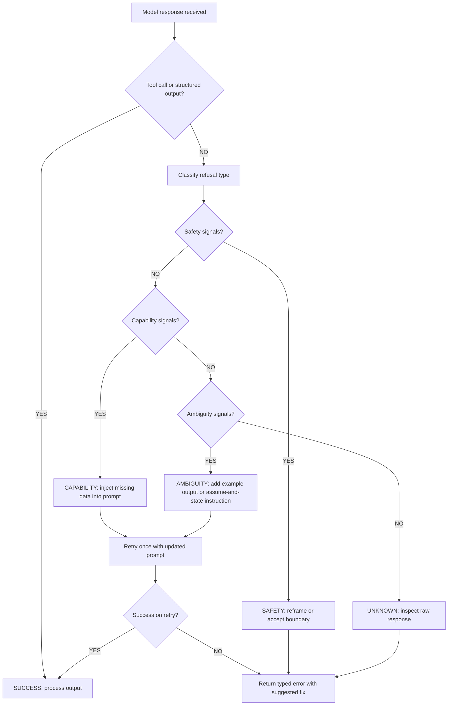

# Handling Refusals and Edge Cases

> Most production "refusals" are capability mismatches, not safety blocks. Fix the prompt, not the use case.

**Type:** Build
**Languages:** Python
**Prerequisites:** Lesson 01 (request anatomy), Lesson 02 (prompt fundamentals), Lesson 06 (structured outputs)
**Time:** ~45 min
**Learning Objectives:**
- Classify a model response as a safety refusal, capability mismatch, or ambiguity refusal
- Build a RefusalDetector that categorizes failures before retrying
- Write targeted recovery strategies for each refusal category
- Distinguish between refusals that require prompt changes versus those that require task redesign
- Instrument refusal rates in production to catch prompt regressions early

---

## THE PROBLEM

Your API call returns a 200 status code and a response body, but the response is not what you asked for. Instead, it is something like: "I'm not able to help with that," "Could you clarify what you mean?", or "I don't have access to real-time information." Your application silently passes this string to the next step, which breaks in a confusing way two layers later.

Production systems hit this constantly. A document extraction pipeline returns "I notice this document contains personal information" instead of a JSON object. A code generation tool returns "I can't run code" when asked to analyze output. A customer support bot returns "I'd be happy to help, but I need more context" when the ticket has 400 words of context already.

The naive fix is to add "please just answer the question" to every prompt and hope for the best. That works once. What you need is a systematic way to detect the refusal type, understand its root cause, and apply the right recovery strategy: because a safety refusal, a capability mismatch, and an ambiguity refusal each require a different fix.

---

## THE CONCEPT

### Three Categories of Refusal

Not all non-answers are the same. Confusing the categories causes engineers to apply the wrong fix.

```
REFUSAL CATEGORIES
==================

1. SAFETY REFUSAL
   Model declines because the request triggers a safety policy.
   Symptoms: "I can't help with that", "That could cause harm"
   Root cause: Request is genuinely prohibited, OR the framing
               triggered a false positive in safety classifiers.
   Fix options: Reframe (legitimate use), accept (actual violation),
                or use a different model with different policies.

2. CAPABILITY MISMATCH
   Model declines because it thinks it cannot do the task.
   Symptoms: "I don't have access to...", "I can't run code",
             "I don't have real-time information"
   Root cause: The prompt implies a capability the model lacks
               (internet access, tool use, memory), OR the model
               underestimates its own ability on valid tasks.
   Fix: Reframe the task to what the model CAN do.
        "Don't search the web; analyze this text I'm providing."

3. AMBIGUITY REFUSAL
   Model asks for clarification instead of completing the task.
   Symptoms: "Could you clarify?", "What do you mean by X?",
             "I need more context about..."
   Root cause: The request has genuinely missing information,
               OR the model is being overly cautious on a task
               that has enough context to complete.
   Fix: Add the missing context OR instruct the model to use
        reasonable defaults and flag assumptions inline.
```

### Decision Tree: Classify Before Fixing

```
                    Model returned non-answer
                            |
              Does it mention safety / harm / policy?
                    |                   |
                   YES                  NO
                    |                   |
          SAFETY REFUSAL         Does it claim inability
                                  (no access, can't run, etc.)?
                                        |              |
                                       YES             NO
                                        |               |
                               CAPABILITY           Does it ask for
                                MISMATCH          clarification / more info?
                                                        |          |
                                                       YES         NO
                                                        |           |
                                               AMBIGUITY        UNKNOWN
                                               REFUSAL          (inspect
                                                               raw response)
```

### What This Looks Like in Practice

| Refusal type | Example response | Wrong fix | Right fix |
|---|---|---|---|
| Safety | "I can't help create content that could harm..." | Add "please just answer" | Reframe as legitimate use case or accept the boundary |
| Capability | "I don't have internet access to check..." | Use a different model | Provide the data in the prompt: "Here is the current price: $42" |
| Ambiguity | "Could you clarify what format you need?" | Add more instructions | Add a concrete example output, or instruct: "Use JSON if format is unclear" |

The key insight: capability and ambiguity refusals are fixable in the prompt. Safety refusals may require task redesign.

### Refusal Recovery Flow



---

## BUILD IT

### Step 1: Dependencies and Setup

```python
# pip install anthropic
# export ANTHROPIC_API_KEY=sk-ant-...

import os
import re
from enum import Enum
from dataclasses import dataclass
import anthropic

client = anthropic.Anthropic(api_key=os.environ["ANTHROPIC_API_KEY"])
MODEL = "claude-3-5-haiku-20241022"
```

### Step 2: Refusal Detection

```python
class RefusalType(Enum):
    SUCCESS = "success"
    SAFETY = "safety"
    CAPABILITY = "capability"
    AMBIGUITY = "ambiguity"
    UNKNOWN = "unknown"


@dataclass
class RefusalResult:
    refusal_type: RefusalType
    raw_response: str
    confidence: str  # "high" | "medium" | "low"
    suggested_fix: str


# Signal phrases for each category.
# Ordered by specificity: more specific phrases first.
SAFETY_SIGNALS = [
    "i can't help with",
    "i cannot help with",
    "i'm not able to help with",
    "i won't be able to",
    "that could cause harm",
    "that could be dangerous",
    "i'm unable to assist with",
    "content policy",
    "violates",
    "against my guidelines",
]

CAPABILITY_SIGNALS = [
    "i don't have access to",
    "i don't have real-time",
    "i can't access the internet",
    "i can't browse",
    "i don't have the ability to run",
    "i cannot execute",
    "i can't retrieve",
    "i don't have information after",
    "my knowledge cutoff",
    "i'm not able to access",
]

AMBIGUITY_SIGNALS = [
    "could you clarify",
    "could you specify",
    "could you provide more",
    "what do you mean by",
    "i need more context",
    "i need more information",
    "i'm not sure what you mean",
    "could you be more specific",
    "please clarify",
    "what exactly are you",
]


def classify_refusal(response_text: str) -> RefusalResult:
    """
    Classify a model response as success or a specific refusal type.
    Uses signal phrase matching with case-insensitive search.
    """
    text_lower = response_text.lower()

    # Check safety signals first (highest priority)
    for signal in SAFETY_SIGNALS:
        if signal in text_lower:
            return RefusalResult(
                refusal_type=RefusalType.SAFETY,
                raw_response=response_text,
                confidence="high",
                suggested_fix=(
                    "Reframe the request to make the legitimate use case explicit. "
                    "If this is a false positive, add context about the professional "
                    "or educational purpose."
                ),
            )

    for signal in CAPABILITY_SIGNALS:
        if signal in text_lower:
            return RefusalResult(
                refusal_type=RefusalType.CAPABILITY,
                raw_response=response_text,
                confidence="high",
                suggested_fix=(
                    "Provide the required data directly in the prompt. "
                    "Example: instead of 'look up the current price', say "
                    "'the current price is $X, given this, calculate...'"
                ),
            )

    for signal in AMBIGUITY_SIGNALS:
        if signal in text_lower:
            return RefusalResult(
                refusal_type=RefusalType.AMBIGUITY,
                raw_response=response_text,
                confidence="high",
                suggested_fix=(
                    "Add a concrete example of the expected output format, "
                    "OR add to your prompt: 'If anything is unclear, make a "
                    "reasonable assumption and state it explicitly.'"
                ),
            )

    # Heuristic: very short responses from a system expecting structured output
    # are often silent refusals or failures
    if len(response_text.strip()) < 30:
        return RefusalResult(
            refusal_type=RefusalType.UNKNOWN,
            raw_response=response_text,
            confidence="low",
            suggested_fix="Inspect the raw response. The model may have returned an unexpected format.",
        )

    return RefusalResult(
        refusal_type=RefusalType.SUCCESS,
        raw_response=response_text,
        confidence="high",
        suggested_fix="",
    )
```

> **Real-world check:** Why does detecting refusals matter if the API always returns 200? Because in a pipeline, a refusal string passed to a JSON parser, a database write, or another model call silently corrupts downstream state. A customer support system that logs "I'm unable to help with that" as a resolved ticket has a data quality problem that accumulates for weeks before anyone notices.

### Step 3: Recovery Strategies

```python
def call_with_fallback(
    system_prompt: str,
    user_prompt: str,
    max_retries: int = 2,
) -> dict:
    """
    Call the model and apply targeted recovery if a refusal is detected.
    Returns a dict with the final response and audit trail.
    """
    attempts = []

    current_system = system_prompt
    current_user = user_prompt

    for attempt in range(max_retries + 1):
        response = client.messages.create(
            model=MODEL,
            max_tokens=1024,
            system=current_system,
            messages=[{"role": "user", "content": current_user}],
        )
        text = response.content[0].text
        result = classify_refusal(text)

        attempts.append({
            "attempt": attempt + 1,
            "refusal_type": result.refusal_type.value,
            "response_preview": text[:200],
        })

        if result.refusal_type == RefusalType.SUCCESS:
            return {
                "success": True,
                "response": text,
                "attempts": attempts,
            }

        if attempt == max_retries:
            break

        # Apply targeted recovery based on refusal type
        if result.refusal_type == RefusalType.CAPABILITY:
            # Tell the model explicitly what it CAN do
            current_user = (
                f"{current_user}\n\n"
                "Note: Do not attempt to access external resources. "
                "Work only with the information provided above."
            )

        elif result.refusal_type == RefusalType.AMBIGUITY:
            # Push the model to proceed with assumptions
            current_user = (
                f"{current_user}\n\n"
                "If anything is unclear, make a reasonable assumption, "
                "state your assumption explicitly at the top of your response, "
                "then complete the task."
            )

        elif result.refusal_type == RefusalType.SAFETY:
            # Log and abort: don't retry safety refusals automatically
            break

    return {
        "success": False,
        "response": text,
        "refusal_type": result.refusal_type.value,
        "suggested_fix": result.suggested_fix,
        "attempts": attempts,
    }
```

### Step 4: Test Against Real Edge Cases

```python
TEST_CASES = [
    {
        "name": "Ambiguity: missing format spec",
        "system": "You are a data extractor. Extract structured data from text.",
        "user": "Extract the key information from this: John Smith, 45, works at Acme Corp.",
    },
    {
        "name": "Capability: implicit web access",
        "system": "You are a financial analyst.",
        "user": "What is the current stock price of Apple?",
    },
    {
        "name": "Capability: fixed by providing data",
        "system": "You are a financial analyst.",
        "user": (
            "Apple's stock price as of market close today was $189.43. "
            "Given this price and a P/E ratio of 28, what is the implied "
            "earnings per share?"
        ),
    },
    {
        "name": "Normal: well-formed extraction",
        "system": (
            "You are a data extractor. Extract structured data from text. "
            "Return a JSON object with fields: name (string), age (integer), "
            "company (string). Return ONLY the JSON, no explanation."
        ),
        "user": "Extract: John Smith, 45, works at Acme Corp.",
    },
]


def run_tests():
    print("=" * 60)
    print("REFUSAL DETECTION TEST SUITE")
    print("=" * 60)

    for case in TEST_CASES:
        print(f"\n[TEST] {case['name']}")
        print(f"  User: {case['user'][:80]}...")

        result = call_with_fallback(
            system_prompt=case["system"],
            user_prompt=case["user"],
        )

        status = "PASS" if result["success"] else "REFUSAL"
        print(f"  Status: {status}")
        print(f"  Attempts: {len(result['attempts'])}")
        if not result["success"]:
            print(f"  Refusal type: {result.get('refusal_type', 'n/a')}")
            print(f"  Fix: {result.get('suggested_fix', '')[:100]}")
        else:
            print(f"  Response: {result['response'][:100]}")

        print()


if __name__ == "__main__":
    run_tests()
```

---

## USE IT

### Monitoring Refusal Rates in Production

The classifier above is useful as a library function, but in production you need aggregate visibility. Add a simple counter that tracks refusal types over time:

```python
from collections import Counter
import datetime


class RefusalMonitor:
    """
    Lightweight in-process refusal rate tracker.
    In production, write these to your observability backend
    (Langfuse, Datadog, CloudWatch) instead of a local Counter.
    """

    def __init__(self):
        self.counts: Counter = Counter()
        self.examples: dict[str, list] = {t.value: [] for t in RefusalType}

    def record(self, result: RefusalResult, prompt_id: str = "") -> None:
        key = result.refusal_type.value
        self.counts[key] += 1
        # Keep last 5 examples per type for debugging
        if len(self.examples[key]) < 5:
            self.examples[key].append({
                "prompt_id": prompt_id,
                "preview": result.raw_response[:100],
                "ts": datetime.datetime.utcnow().isoformat(),
            })

    def report(self) -> dict:
        total = sum(self.counts.values())
        if total == 0:
            return {"total": 0}
        rates = {k: v / total for k, v in self.counts.items()}
        return {
            "total": total,
            "rates": rates,
            "raw_counts": dict(self.counts),
        }


monitor = RefusalMonitor()


def instrumented_call(system: str, user: str, prompt_id: str = "") -> dict:
    """Wrap call_with_fallback with monitoring."""
    result = call_with_fallback(system, user)
    # Record the final attempt's classification
    if not result["success"]:
        fake_result = RefusalResult(
            refusal_type=RefusalType(result.get("refusal_type", "unknown")),
            raw_response=result["response"],
            confidence="high",
            suggested_fix="",
        )
        monitor.record(fake_result, prompt_id)
    else:
        monitor.record(
            RefusalResult(RefusalType.SUCCESS, result["response"], "high", ""),
            prompt_id,
        )
    return result
```

> **Perspective shift:** Most teams only discover their refusal rate by reading customer complaints. Tracking it as a metric flips this: you see prompt regressions the same day they happen, before users notice. A prompt change that raises your ambiguity refusal rate from 1% to 8% is a regression, and you want to catch it in staging.

---

## SHIP IT

The artifact for this lesson is `outputs/skill-refusal-handler.md`: a prompt skill you can drop into any Claude-based pipeline to handle refusals systematically.

See `outputs/skill-refusal-handler.md`.

---

## EVALUATE IT

### What "Working" Looks Like

A good refusal handler does four things measurably:

1. **Classification accuracy.** Build a labeled dataset of 50 model responses (manually tag each as safety/capability/ambiguity/success). Run your classifier. Target: >90% accuracy. Common failure mode: phrases appear across categories ("I can't" is used in safety AND capability refusals).

2. **Recovery rate.** For capability and ambiguity refusals in your test suite, what fraction does the retry loop resolve? Track: resolved on retry / total non-safety refusals. Target: >70% recovery with one retry.

3. **False positive rate.** Does the classifier incorrectly flag successful responses as refusals? Test with 20 normal success responses. Target: 0 false positives (a false positive means a valid response gets flagged and re-sent, costing tokens and latency).

4. **Production refusal rate.** After shipping, track daily refusal rate per prompt ID. A healthy system has a refusal rate under 5% for well-engineered prompts. Rates above 15% indicate systematic prompt problems.

```python
# Minimal eval harness
def eval_classifier(labeled_examples: list[dict]) -> dict:
    """
    labeled_examples: [{"response": "...", "expected": "safety"}, ...]
    """
    correct = 0
    confusion = Counter()
    for ex in labeled_examples:
        result = classify_refusal(ex["response"])
        predicted = result.refusal_type.value
        expected = ex["expected"]
        if predicted == expected:
            correct += 1
        confusion[f"{expected}->{predicted}"] += 1

    return {
        "accuracy": correct / len(labeled_examples),
        "confusion": dict(confusion),
        "n": len(labeled_examples),
    }
```

### The 2AM Test

Your refusal handler passes the 2AM test if an on-call engineer can look at the production refusal report and answer: "Which prompt is causing this? What category? What is the fix?" in under 5 minutes. If the logs just say "error: unexpected response", you have not shipped a refusal handler: you have shipped a string filter.
