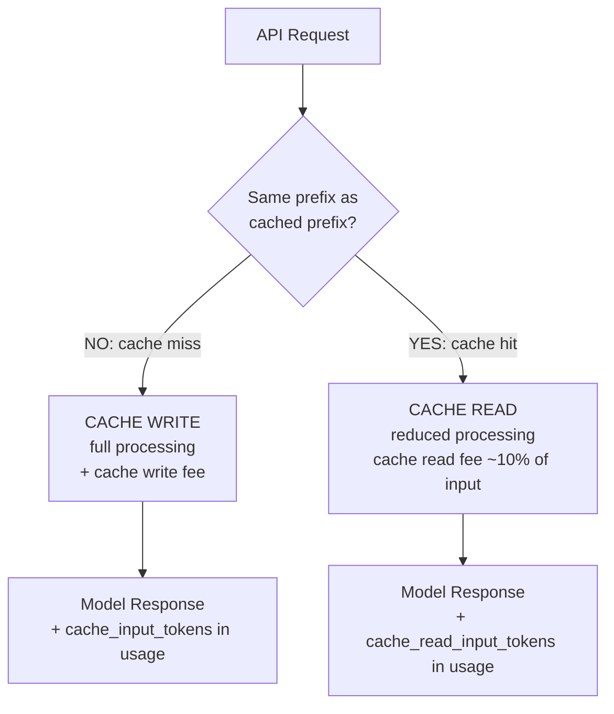

# التخزين المؤقت للـ Prompt: التكلفة وزمن الاستجابة

> التخزين المؤقت (caching) ليس تلقائيًّا. كل token يُحسب بالسعر الكامل إلى أن تضع نقطة فصل (breakpoint).

**النوع:** بناء
**اللغات:** Python
**المتطلبات:** الدرس 01 (تشريح الطلب)، الدرس 04 (هندسة السياق)، الدرس 05 (إدارة نافذة السياق)
**الوقت:** ~45 دقيقة
**أهداف التعلّم:**
- شرح كيف يعمل التخزين المؤقت للـ prompt لدى Anthropic على مستوى الـ API
- وضع نقاط فصل cache_control بشكل صحيح في الـ system prompts وسياقات الوثائق
- قياس زمن استجابة إصابة الكاش (cache hit) مقابل زمن الاستجابة بالسعر الكامل للطلب نفسه
- حساب الوفورات في التكلفة من التخزين المؤقت لميزانية tokens وحجم طلبات معيّنين
- تحديد الـ prompts التي يساعد فيها التخزين المؤقت مقابل تلك التي لا أثر له فيها

---

## المشكلة

يستدعي تطبيقك Claude بـ system prompt حجمه 12,000 token في كل طلب. وهو يعمل. زمن الاستجابة مقبول. تبدأ الفواتير بالوصول وتكون ثلاثة أضعاف ما رصدتَه في الميزانية. تنظر إلى الأرقام: 10,000 استدعاء يوميًّا، و12,000 token من سياق النظام في كل مرّة. هذا 120 مليون token مُدخَل يوميًّا. بأسعار الإنتاج، يتراكم ذلك بسرعة.

يبدو الحل بديهيًّا: خزّن الـ system prompt مؤقتًا. لكن حين تبحث عن "Claude caching"، تجد توثيقًا عن مُعامِلات `cache_control` لم تضبطها قط. تدرك أنه على مدى ستة أسابيع، كان كل استدعاء يُحسب بالسعر الكامل عن tokens كان يمكن تخزينها مؤقتًا.

هذا شائع. التخزين المؤقت للـ prompt اختياري وصريح (opt-in and explicit). لن يخزّن النموذج أي شيء مؤقتًا تلقائيًّا. إن لم تضع نقاط فصل `cache_control` في الـ prompts، فأنت تدفع السعر الكامل. يُريك هذا الدرس بالضبط أين تضعها، وكيف تتحقّق من عمل التخزين المؤقت، وكيف تحسب ما إذا كان يستحقّ العناء بالنسبة لنمط استخدامك تحديدًا.

---

## المفهوم

### كيف يعمل التخزين المؤقت

يخزّن التخزين المؤقت للـ prompt لدى Anthropic بادئة (prefix) من الـ prompt على خوادمها بعد الطلب الأول. الطلبات اللاحقة التي تشترك في البادئة نفسها تقرأ من الكاش بدلًا من إعادة معالجة تلك الـ tokens. تُحسب إصابات الكاش (cache hits) بمعدّل أقل لكل token ولها زمن استجابة أقل.

```
WITHOUT CACHING (every request)
================================

Request 1:  [System: 12,000 tokens] + [User: 200 tokens]
            ^-- Full price per token, full processing time

Request 2:  [System: 12,000 tokens] + [User: 210 tokens]
            ^-- Full price per token, full processing time again

Request N:  [System: 12,000 tokens] + [User: 190 tokens]
            ^-- Full price per token, every single time


WITH CACHING (cache_control on system)
=======================================

Request 1:  [System: 12,000 tokens CACHE WRITE] + [User: 200 tokens]
            ^-- Cache write price (slightly higher than input)
               Cache entry stored server-side for 5 minutes

Request 2:  [System: 12,000 tokens CACHE HIT] + [User: 210 tokens]
            ^-- Cache read price (~10% of input price)
               ~2x latency improvement

Request N:  [System: 12,000 tokens CACHE HIT] + [User: 190 tokens]
            ^-- Cache read price on every request within TTL window
```

### تدفّق الـ Token ونموذج التكلفة



### قواعد الكاش التي يجب أن تعرفها

**القاعدة 1: 1024 token كحد أدنى.**
يجب أن تكون البادئة المُخزّنة مؤقتًا 1024 token على الأقل. البادئات الأقصر لا تُخزّن مؤقتًا، حتى مع ضبط `cache_control`. يتطلّب Haiku 2048 token.

**القاعدة 2: تطابق تام للبادئة.**
مفتاح الكاش هو تسلسل الـ tokens التام حتى نقطة الفصل. تغيير حرف واحد في أي مكان قبل نقطة الفصل يُبطل الكاش. هذا يعني: ضع المحتوى المستقرّ قبل نقطة الفصل، والمحتوى المتغيّر بعدها.

**القاعدة 3: مدّة بقاء (TTL) خمس دقائق.**
تنتهي صلاحية مدخلات الكاش بعد 5 دقائق من عدم الاستخدام. إن كان معدّل طلباتك منخفضًا (أقل من طلب واحد كل 5 دقائق لكل مدخل كاش)، فإن التخزين المؤقت يوفّر فائدة ضئيلة.

**القاعدة 4: cache_control اختياري وصريح.**
عدم ضبط نقاط فصل يعني عدم وجود تخزين مؤقت. لا يخزّن الـ API مؤقتًا أبدًا بشكل تلقائي.

**القاعدة 5: يُسمح بنقاط فصل متعدّدة.**
يمكنك وضع ما يصل إلى 4 نقاط فصل في طلب واحد. كلٌّ منها يخزّن البادئة حتى تلك النقطة.

### ما الذي تخزّنه مؤقتًا مقابل ما لا تخزّنه

```
GOOD CANDIDATES FOR CACHING
============================
- Long system prompts (instructions, personas, rules)
- Large reference documents injected as context
- Few-shot example sets (10+ examples in the prompt)
- Tool definitions passed to models with many tools

POOR CANDIDATES FOR CACHING
============================
- Short system prompts (<1024 tokens for most models)
- Prompts that change frequently (invalidates cache every time)
- One-off requests (cache write cost not amortized)
- Low-volume endpoints (<5-10 requests per 5-min window)
```

---

## البناء

### الخطوة 1: الاعتماديات والإعداد

```python
# pip install anthropic
# export ANTHROPIC_API_KEY=sk-ant-...

import os
import time
import anthropic

client = anthropic.Anthropic(api_key=os.environ["ANTHROPIC_API_KEY"])
MODEL = "claude-3-5-haiku-20241022"
```

### الخطوة 2: خط الأساس بلا تخزين مؤقت

```python
# A long system prompt (over 1024 tokens to qualify for caching)
LONG_SYSTEM_PROMPT = """
You are a senior software engineering assistant with deep expertise in Python,
distributed systems, and API design. You help engineers write production-quality
code and solve complex architectural problems.

When answering questions:
1. Start with the direct answer or implementation. No preamble.
2. Explain your technical choices inline as code comments, not as separate paragraphs.
3. Highlight trade-offs where they exist.
4. If a question has a better interpretation, answer the better version and note the reframe.
5. Use concrete examples. Avoid abstract descriptions without accompanying code.

You follow these engineering principles:
- Explicit over implicit
- Simple over clever
- Composable over monolithic
- Testable over tightly coupled
- Fail fast with clear error messages

When reviewing code, you check for:
- Security vulnerabilities (injection, insecure defaults, missing validation)
- Performance issues (N+1 queries, unnecessary serialization, blocking I/O)
- Correctness bugs (off-by-one, race conditions, wrong assumptions about input types)
- Maintainability issues (magic numbers, unclear variable names, missing error handling)

Your responses use Python 3.10+ syntax and follow PEP 8. When using type hints,
prefer the built-in types (list, dict, tuple) over typing module equivalents
where available in 3.10+.

Technical domain context: This assistant is deployed in a production engineering
environment where code will be reviewed, tested, and shipped. Answers should be
complete and production-ready, not illustrative sketches.

For API design questions, you follow RESTful conventions, prefer Pydantic models
for request/response validation, and recommend FastAPI as the default framework.

For database questions, you prefer PostgreSQL with SQLAlchemy Core (not ORM) for
complex queries, and recommend pgvector for vector similarity search workloads.

For async Python, you prefer asyncio with async/await syntax and recommend
httpx for HTTP clients and asyncpg for PostgreSQL in async contexts.
""" * 2  # Repeat to ensure we're well over 1024 tokens


def call_uncached(user_question: str) -> dict:
    """Call without cache_control. Full price, full processing every time."""
    start = time.time()
    response = client.messages.create(
        model=MODEL,
        max_tokens=512,
        system=LONG_SYSTEM_PROMPT,
        messages=[{"role": "user", "content": user_question}],
    )
    elapsed = time.time() - start
    usage = response.usage

    return {
        "latency_s": round(elapsed, 2),
        "input_tokens": usage.input_tokens,
        "output_tokens": usage.output_tokens,
        "cache_read_tokens": getattr(usage, "cache_read_input_tokens", 0),
        "cache_write_tokens": getattr(usage, "cache_creation_input_tokens", 0),
        "text": response.content[0].text,
        "mode": "uncached",
    }
```

### الخطوة 3: النسخة المُخزّنة مؤقتًا مع cache_control

```python
def call_cached(user_question: str) -> dict:
    """
    Call with cache_control on the system prompt.
    First call: cache write (slightly higher cost, normal latency)
    Subsequent calls within 5 min: cache hit (lower cost, lower latency)
    """
    start = time.time()
    response = client.messages.create(
        model=MODEL,
        max_tokens=512,
        system=[
            {
                "type": "text",
                "text": LONG_SYSTEM_PROMPT,
                "cache_control": {"type": "ephemeral"},  # <-- the breakpoint
            }
        ],
        messages=[{"role": "user", "content": user_question}],
    )
    elapsed = time.time() - start
    usage = response.usage

    cache_read = getattr(usage, "cache_read_input_tokens", 0)
    cache_write = getattr(usage, "cache_creation_input_tokens", 0)

    # Determine hit/miss from usage fields
    if cache_read > 0:
        cache_status = "HIT"
    elif cache_write > 0:
        cache_status = "WRITE"
    else:
        cache_status = "MISS (too short or no breakpoint)"

    return {
        "latency_s": round(elapsed, 2),
        "input_tokens": usage.input_tokens,
        "output_tokens": usage.output_tokens,
        "cache_read_tokens": cache_read,
        "cache_write_tokens": cache_write,
        "cache_status": cache_status,
        "text": response.content[0].text,
        "mode": "cached",
    }
```

> **اختبار من الواقع:** لماذا تكلّف كتابات الكاش (cache writes) أكثر قليلًا من استدعاء مُدخَل اعتيادي؟ لأن Anthropic عليها معالجة البادئة الكاملة وتخزين حالة كاش KV. أنت تدفع علاوة صغيرة على الاستدعاء الأول مقابل خصومات على كل الاستدعاءات اللاحقة. إذا أجريت استدعاءً واحدًا فقط يوميًّا، فقد تتجاوز تكلفة كتابة الكاش الوفورات. نقطة التعادل (breakeven point) تكون حول 5-10 طلبات في نافذة الـ 5 دقائق لمعظم أحجام الـ system prompt.

### الخطوة 4: القياس والمقارنة

```python
def compare_caching(question: str, num_cached_calls: int = 3) -> None:
    """
    Run uncached vs cached calls and print the comparison.
    """
    print("=" * 60)
    print(f"CACHING COMPARISON: {num_cached_calls + 1} calls")
    print("=" * 60)

    # Uncached baseline
    print("\n[UNCACHED]")
    uncached = call_uncached(question)
    print(f"  Latency: {uncached['latency_s']}s")
    print(f"  Input tokens: {uncached['input_tokens']}")
    print(f"  Output tokens: {uncached['output_tokens']}")

    print("\n[CACHED CALLS]")
    for i in range(num_cached_calls):
        result = call_cached(question)
        status = result["cache_status"]
        print(f"  Call {i+1} ({status}): {result['latency_s']}s | "
              f"read={result['cache_read_tokens']} write={result['cache_write_tokens']}")

    # Cost estimate (approximate, check current pricing)
    print("\n[COST ESTIMATE - approximate]")
    system_tokens = len(LONG_SYSTEM_PROMPT.split()) * 1.3  # rough token estimate
    print(f"  Estimated system prompt tokens: ~{int(system_tokens)}")
    print(f"  At 100 calls/day:")
    print(f"    Without caching: 100 x {int(system_tokens)} input tokens/day")
    print(f"    With caching:    1 cache write + 99 cache reads")
    print(f"    Cache reads cost ~10% of standard input price")
    print(f"    Approximate daily savings: ~85% on cached tokens")
```

---

## الاستخدام

### تخزين سياق وثيقة كبيرة مؤقتًا

نمط التخزين المؤقت الأكثر أثرًا في الإنتاج ليس مجرد الـ system prompt: بل وثيقة مرجعية كبيرة لا تتغيّر بين الاستدعاءات. على سبيل المثال، وثيقة سياسة من 50 صفحة، أو مواصفة API كاملة، أو كتالوج منتجات.

```python
POLICY_DOCUMENT = """
[Imagine 8,000 tokens of policy text here]
Section 1: Data Retention Policy
All customer data must be retained for a minimum of 7 years...
[... remainder of document ...]
""" * 10  # Simulate a large document for demo purposes


def answer_policy_question(question: str) -> dict:
    """
    Cache both the system prompt AND the large document context.
    Two cache_control breakpoints: one after the system, one after the document.
    """
    start = time.time()
    response = client.messages.create(
        model=MODEL,
        max_tokens=512,
        system=[
            {
                "type": "text",
                "text": "You are a policy compliance assistant. Answer questions using only the provided document.",
                "cache_control": {"type": "ephemeral"},  # Breakpoint 1: system
            }
        ],
        messages=[
            {
                "role": "user",
                "content": [
                    {
                        "type": "text",
                        "text": f"Reference document:\n\n{POLICY_DOCUMENT}",
                        "cache_control": {"type": "ephemeral"},  # Breakpoint 2: document
                    },
                    {
                        "type": "text",
                        "text": f"\nQuestion: {question}",
                        # No cache_control here: this changes every call
                    },
                ],
            }
        ],
    )
    elapsed = time.time() - start
    usage = response.usage

    return {
        "latency_s": round(elapsed, 2),
        "cache_read_tokens": getattr(usage, "cache_read_input_tokens", 0),
        "cache_write_tokens": getattr(usage, "cache_creation_input_tokens", 0),
        "answer": response.content[0].text,
    }
```

> **نقلة في المنظور:** التخزين المؤقت للـ prompt يغيّر اقتصاديات الذكاء الاصطناعي طويل السياق. من دون تخزين مؤقت، يجعل حقن وثيقة من 50 صفحة في كل استدعاء جلسات الأسئلة والأجوبة متعدّدة الأدوار باهظة التكلفة بشكل مانع. مع التخزين المؤقت، تُعالَج الوثيقة مرّة واحدة وتكلّف الأسئلة اللاحقة على الوثيقة نفسها جزءًا يسيرًا من الاستدعاء الأول. هذا ما يجعل منتجات الأسئلة والأجوبة على الوثائق قابلة للتطبيق اقتصاديًّا على نطاق واسع.

---

## التسليم

الأصل (artifact) لهذا الدرس هو `outputs/skill-prompt-cache.md`: بطاقة مرجعية لوضع نقاط فصل الكاش وحساب التكلفة.

انظر `outputs/skill-prompt-cache.md`.

---

## التقييم

### ثلاثة أشياء تقيسها

**1. تحقّق من حدوث إصابات الكاش (cache hits).**

افحص `usage.cache_read_input_tokens` في استجابة الـ API. إذا كان هذا الحقل 0 في استدعائك الثاني، فالكاش لا يعمل. الأسباب الشائعة:
- الـ system prompt أقل من 1024 token (أقل من 2048 لـ Haiku)
- مرّ أكثر من 5 دقائق بين الاستدعاءات (انتهت صلاحية الـ TTL)
- تغيّر المحتوى الذي قبل نقطة الفصل بين الاستدعاءات

```python
def verify_cache_hit(result: dict) -> bool:
    return result.get("cache_read_tokens", 0) > 0
```

**2. قِس التحسّن في زمن الاستجابة.**

ينبغي أن تكون إصابة الكاش أسرع بشكل ملموس للبادئات الطويلة. لـ system prompt حجمه 10,000 token:
- خطأ الكاش (cache miss): زمن الاستجابة الأساسي (يعتمد على النموذج والمنطقة والحِمل)
- إصابة الكاش (cache hit): توقّع انخفاضًا في زمن الاستجابة بنسبة 30-50%

سجّل الاثنين واحسب النسبة. إذا لم تكن إصابات الكاش أسرع، فافحص طول البادئة (البادئات القصيرة جدًّا تُظهر تحسّنًا ضئيلًا).

**3. احسب الوفورات الفعلية في التكلفة.**

```python
def estimate_monthly_savings(
    system_tokens: int,
    requests_per_day: int,
    cache_hit_rate: float,  # 0.0 to 1.0
    input_price_per_mtok: float = 0.80,    # Haiku input price per million
    cache_read_price_per_mtok: float = 0.08,  # Haiku cache read price per million
    cache_write_price_per_mtok: float = 1.00,  # Haiku cache write price per million
) -> dict:
    """
    Rough monthly cost comparison. Check current Anthropic pricing before budgeting.
    """
    daily_requests = requests_per_day
    monthly_requests = daily_requests * 30

    # Without caching
    uncached_cost = (system_tokens / 1_000_000) * input_price_per_mtok * monthly_requests

    # With caching
    cache_misses = monthly_requests * (1 - cache_hit_rate)
    cache_hits = monthly_requests * cache_hit_rate
    cached_cost = (
        (system_tokens / 1_000_000) * cache_write_price_per_mtok * cache_misses
        + (system_tokens / 1_000_000) * cache_read_price_per_mtok * cache_hits
    )

    return {
        "uncached_monthly_usd": round(uncached_cost, 2),
        "cached_monthly_usd": round(cached_cost, 2),
        "monthly_savings_usd": round(uncached_cost - cached_cost, 2),
        "savings_pct": round((1 - cached_cost / uncached_cost) * 100, 1),
    }


# Example: 10,000-token system prompt, 500 requests/day, 90% cache hit rate
result = estimate_monthly_savings(10_000, 500, 0.90)
print(f"Monthly savings: ${result['monthly_savings_usd']} ({result['savings_pct']}%)")
```

### الفخّ: نقاط النهاية منخفضة الحجم

لا يوفّر التخزين المؤقت أي فائدة إذا كان معدّل طلباتك أقل من طلب واحد في نافذة الـ 5 دقائق. تُحسب كتابة الكاش، ثم يأتي الطلب التالي بعد 10 دقائق فيُخطئ الكاش، فيشغّل كتابة كاش أخرى. تنتهي بدفع أكثر مما لو لم يكن هناك تخزين مؤقت. افحص معدّل طلباتك الفعلي قبل إضافة نقاط فصل الكاش.
