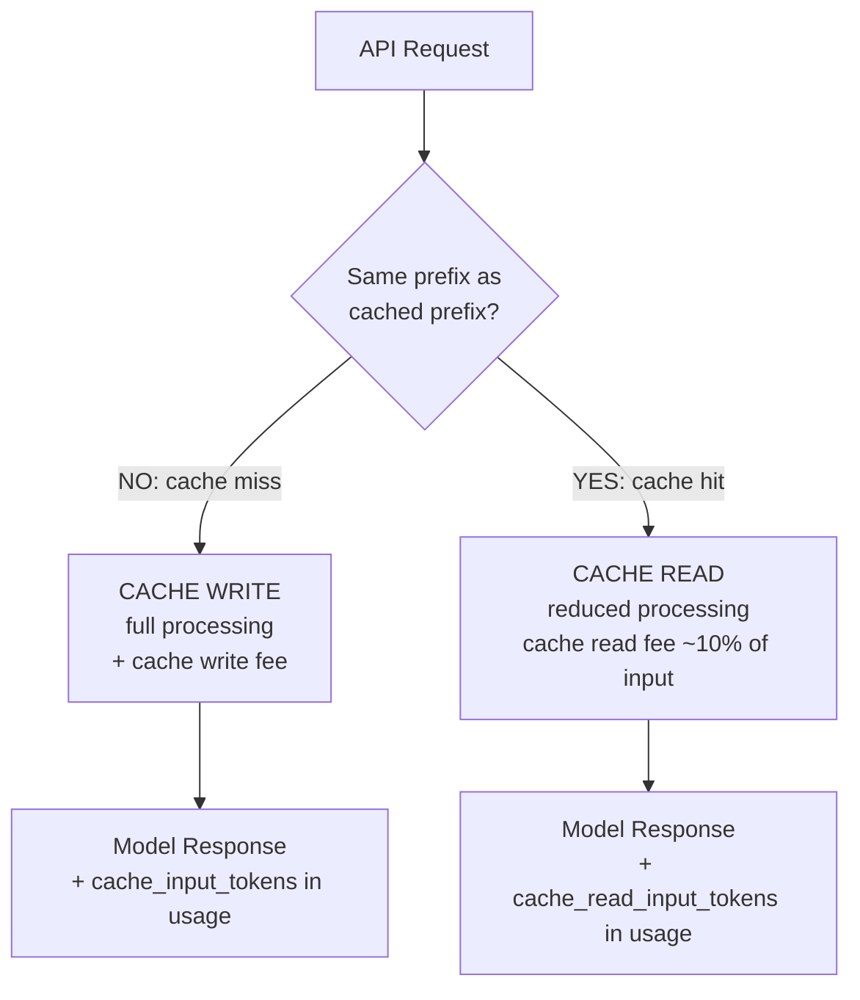

# Prompt Caching: Cost and Latency

> Caching is not automatic. Every token costs full price until you place a breakpoint.

**Type:** Build
**Languages:** Python
**Prerequisites:** Lesson 01 (request anatomy), Lesson 04 (context engineering), Lesson 05 (context window management)
**Time:** ~45 min
**Learning Objectives:**
- Explain how Anthropic's prompt caching works at the API level
- Place cache_control breakpoints correctly in system prompts and document contexts
- Measure cache hit latency versus full-price latency for the same request
- Calculate cost savings from caching for a given token budget and request volume
- Identify prompts where caching helps versus where it has no effect

---

## THE PROBLEM

Your application calls Claude with a 12,000-token system prompt on every request. It works. Latency is acceptable. Costs start arriving and they are three times what you budgeted. You look at the numbers: 10,000 calls per day, 12,000 tokens of system context each time. That is 120 million input tokens daily. At production pricing, that adds up fast.

The fix seems obvious: cache the system prompt. But when you search "Claude caching", you find documentation about `cache_control` parameters that you never set. You realize that for six weeks, every single call has been charging full price for tokens that could have been cached.

This is common. Prompt caching is opt-in and explicit. The model will not cache anything automatically. If you have not placed `cache_control` breakpoints in your prompts, you are paying full price. This lesson shows you exactly where to place them, how to verify caching is working, and how to calculate whether it is worth it for your specific usage pattern.

---

## THE CONCEPT

### How Caching Works

Anthropic's prompt caching stores a prefix of your prompt on their servers after the first request. Subsequent requests that share the same prefix read from the cache instead of reprocessing those tokens. Cache hits are charged at a lower per-token rate and have lower latency.

```
WITHOUT CACHING (every request)
================================

Request 1:  [System: 12,000 tokens] + [User: 200 tokens]
            ^-- Full price per token, full processing time

Request 2:  [System: 12,000 tokens] + [User: 210 tokens]
            ^-- Full price per token, full processing time again

Request N:  [System: 12,000 tokens] + [User: 190 tokens]
            ^-- Full price per token, every single time


WITH CACHING (cache_control on system)
=======================================

Request 1:  [System: 12,000 tokens CACHE WRITE] + [User: 200 tokens]
            ^-- Cache write price (slightly higher than input)
               Cache entry stored server-side for 5 minutes

Request 2:  [System: 12,000 tokens CACHE HIT] + [User: 210 tokens]
            ^-- Cache read price (~10% of input price)
               ~2x latency improvement

Request N:  [System: 12,000 tokens CACHE HIT] + [User: 190 tokens]
            ^-- Cache read price on every request within TTL window
```

### Token Flow and Cost Model



### Cache Rules You Must Know

**Rule 1: Minimum 1024 tokens.**
The prefix being cached must be at least 1024 tokens. Shorter prefixes are not cached, even with `cache_control` set. Haiku requires 2048 tokens.

**Rule 2: Exact prefix match.**
The cache key is the exact token sequence up to the breakpoint. A single character change anywhere before the breakpoint invalidates the cache. This means: put stable content before the breakpoint, dynamic content after it.

**Rule 3: Five-minute TTL.**
Cache entries expire after 5 minutes of non-use. If your request rate is low (under one request every 5 minutes per cache entry), caching provides minimal benefit.

**Rule 4: cache_control is opt-in and explicit.**
No breakpoints set means no caching. The API never caches automatically.

**Rule 5: Multiple breakpoints are allowed.**
You can place up to 4 breakpoints in a single request. Each caches the prefix up to that point.

### What to Cache vs. What Not to Cache

```
GOOD CANDIDATES FOR CACHING
============================
- Long system prompts (instructions, personas, rules)
- Large reference documents injected as context
- Few-shot example sets (10+ examples in the prompt)
- Tool definitions passed to models with many tools

POOR CANDIDATES FOR CACHING
============================
- Short system prompts (<1024 tokens for most models)
- Prompts that change frequently (invalidates cache every time)
- One-off requests (cache write cost not amortized)
- Low-volume endpoints (<5-10 requests per 5-min window)
```

---

## BUILD IT

### Step 1: Dependencies and Setup

```python
# pip install anthropic
# export ANTHROPIC_API_KEY=sk-ant-...

import os
import time
import anthropic

client = anthropic.Anthropic(api_key=os.environ["ANTHROPIC_API_KEY"])
MODEL = "claude-3-5-haiku-20241022"
```

### Step 2: Uncached Baseline

```python
# A long system prompt (over 1024 tokens to qualify for caching)
LONG_SYSTEM_PROMPT = """
You are a senior software engineering assistant with deep expertise in Python,
distributed systems, and API design. You help engineers write production-quality
code and solve complex architectural problems.

When answering questions:
1. Start with the direct answer or implementation. No preamble.
2. Explain your technical choices inline as code comments, not as separate paragraphs.
3. Highlight trade-offs where they exist.
4. If a question has a better interpretation, answer the better version and note the reframe.
5. Use concrete examples. Avoid abstract descriptions without accompanying code.

You follow these engineering principles:
- Explicit over implicit
- Simple over clever
- Composable over monolithic
- Testable over tightly coupled
- Fail fast with clear error messages

When reviewing code, you check for:
- Security vulnerabilities (injection, insecure defaults, missing validation)
- Performance issues (N+1 queries, unnecessary serialization, blocking I/O)
- Correctness bugs (off-by-one, race conditions, wrong assumptions about input types)
- Maintainability issues (magic numbers, unclear variable names, missing error handling)

Your responses use Python 3.10+ syntax and follow PEP 8. When using type hints,
prefer the built-in types (list, dict, tuple) over typing module equivalents
where available in 3.10+.

Technical domain context: This assistant is deployed in a production engineering
environment where code will be reviewed, tested, and shipped. Answers should be
complete and production-ready, not illustrative sketches.

For API design questions, you follow RESTful conventions, prefer Pydantic models
for request/response validation, and recommend FastAPI as the default framework.

For database questions, you prefer PostgreSQL with SQLAlchemy Core (not ORM) for
complex queries, and recommend pgvector for vector similarity search workloads.

For async Python, you prefer asyncio with async/await syntax and recommend
httpx for HTTP clients and asyncpg for PostgreSQL in async contexts.
""" * 2  # Repeat to ensure we're well over 1024 tokens


def call_uncached(user_question: str) -> dict:
    """Call without cache_control. Full price, full processing every time."""
    start = time.time()
    response = client.messages.create(
        model=MODEL,
        max_tokens=512,
        system=LONG_SYSTEM_PROMPT,
        messages=[{"role": "user", "content": user_question}],
    )
    elapsed = time.time() - start
    usage = response.usage

    return {
        "latency_s": round(elapsed, 2),
        "input_tokens": usage.input_tokens,
        "output_tokens": usage.output_tokens,
        "cache_read_tokens": getattr(usage, "cache_read_input_tokens", 0),
        "cache_write_tokens": getattr(usage, "cache_creation_input_tokens", 0),
        "text": response.content[0].text,
        "mode": "uncached",
    }
```

### Step 3: Cached Version with cache_control

```python
def call_cached(user_question: str) -> dict:
    """
    Call with cache_control on the system prompt.
    First call: cache write (slightly higher cost, normal latency)
    Subsequent calls within 5 min: cache hit (lower cost, lower latency)
    """
    start = time.time()
    response = client.messages.create(
        model=MODEL,
        max_tokens=512,
        system=[
            {
                "type": "text",
                "text": LONG_SYSTEM_PROMPT,
                "cache_control": {"type": "ephemeral"},  # <-- the breakpoint
            }
        ],
        messages=[{"role": "user", "content": user_question}],
    )
    elapsed = time.time() - start
    usage = response.usage

    cache_read = getattr(usage, "cache_read_input_tokens", 0)
    cache_write = getattr(usage, "cache_creation_input_tokens", 0)

    # Determine hit/miss from usage fields
    if cache_read > 0:
        cache_status = "HIT"
    elif cache_write > 0:
        cache_status = "WRITE"
    else:
        cache_status = "MISS (too short or no breakpoint)"

    return {
        "latency_s": round(elapsed, 2),
        "input_tokens": usage.input_tokens,
        "output_tokens": usage.output_tokens,
        "cache_read_tokens": cache_read,
        "cache_write_tokens": cache_write,
        "cache_status": cache_status,
        "text": response.content[0].text,
        "mode": "cached",
    }
```

> **Real-world check:** Why do cache writes cost slightly more than a normal input call? Anthropic has to process the full prefix and store the KV cache state. You are paying a small premium on the first call in exchange for discounts on all subsequent calls. If you make only one call per day, the cache write cost may exceed the savings. The breakeven point is around 5-10 requests per 5-minute window for most system prompt sizes.

### Step 4: Measure and Compare

```python
def compare_caching(question: str, num_cached_calls: int = 3) -> None:
    """
    Run uncached vs cached calls and print the comparison.
    """
    print("=" * 60)
    print(f"CACHING COMPARISON: {num_cached_calls + 1} calls")
    print("=" * 60)

    # Uncached baseline
    print("\n[UNCACHED]")
    uncached = call_uncached(question)
    print(f"  Latency: {uncached['latency_s']}s")
    print(f"  Input tokens: {uncached['input_tokens']}")
    print(f"  Output tokens: {uncached['output_tokens']}")

    print("\n[CACHED CALLS]")
    for i in range(num_cached_calls):
        result = call_cached(question)
        status = result["cache_status"]
        print(f"  Call {i+1} ({status}): {result['latency_s']}s | "
              f"read={result['cache_read_tokens']} write={result['cache_write_tokens']}")

    # Cost estimate (approximate, check current pricing)
    print("\n[COST ESTIMATE - approximate]")
    system_tokens = len(LONG_SYSTEM_PROMPT.split()) * 1.3  # rough token estimate
    print(f"  Estimated system prompt tokens: ~{int(system_tokens)}")
    print(f"  At 100 calls/day:")
    print(f"    Without caching: 100 x {int(system_tokens)} input tokens/day")
    print(f"    With caching:    1 cache write + 99 cache reads")
    print(f"    Cache reads cost ~10% of standard input price")
    print(f"    Approximate daily savings: ~85% on cached tokens")
```

---

## USE IT

### Caching a Large Document Context

The most impactful caching pattern in production is not just the system prompt: it is a large reference document that does not change between calls. For example, a 50-page policy document, a full API specification, or a product catalog.

```python
POLICY_DOCUMENT = """
[Imagine 8,000 tokens of policy text here]
Section 1: Data Retention Policy
All customer data must be retained for a minimum of 7 years...
[... remainder of document ...]
""" * 10  # Simulate a large document for demo purposes


def answer_policy_question(question: str) -> dict:
    """
    Cache both the system prompt AND the large document context.
    Two cache_control breakpoints: one after the system, one after the document.
    """
    start = time.time()
    response = client.messages.create(
        model=MODEL,
        max_tokens=512,
        system=[
            {
                "type": "text",
                "text": "You are a policy compliance assistant. Answer questions using only the provided document.",
                "cache_control": {"type": "ephemeral"},  # Breakpoint 1: system
            }
        ],
        messages=[
            {
                "role": "user",
                "content": [
                    {
                        "type": "text",
                        "text": f"Reference document:\n\n{POLICY_DOCUMENT}",
                        "cache_control": {"type": "ephemeral"},  # Breakpoint 2: document
                    },
                    {
                        "type": "text",
                        "text": f"\nQuestion: {question}",
                        # No cache_control here: this changes every call
                    },
                ],
            }
        ],
    )
    elapsed = time.time() - start
    usage = response.usage

    return {
        "latency_s": round(elapsed, 2),
        "cache_read_tokens": getattr(usage, "cache_read_input_tokens", 0),
        "cache_write_tokens": getattr(usage, "cache_creation_input_tokens", 0),
        "answer": response.content[0].text,
    }
```

> **Perspective shift:** Prompt caching changes the economics of long-context AI. Without caching, injecting a 50-page document into every call makes multi-turn Q&A sessions prohibitively expensive. With caching, the document is processed once and subsequent questions over the same document cost a fraction of the first call. This is what makes document Q&A products economically viable at scale.

---

## SHIP IT

The artifact for this lesson is `outputs/skill-prompt-cache.md`: a reference card for cache breakpoint placement and cost calculation.

See `outputs/skill-prompt-cache.md`.

---

## EVALUATE IT

### Three Things to Measure

**1. Verify cache hits are occurring.**

Check `usage.cache_read_input_tokens` in the API response. If this field is 0 on your second call, the cache is not working. Common reasons:
- System prompt is under 1024 tokens (under 2048 for Haiku)
- More than 5 minutes between calls (TTL expired)
- Content before the breakpoint changed between calls

```python
def verify_cache_hit(result: dict) -> bool:
    return result.get("cache_read_tokens", 0) > 0
```

**2. Measure latency improvement.**

A cache hit should be meaningfully faster for long prefixes. For a 10,000-token system prompt:
- Cache miss: baseline latency (depends on model, region, load)
- Cache hit: expect 30-50% latency reduction

Log both and compute the ratio. If cache hits are not faster, check your prefix length (very short prefixes show minimal improvement).

**3. Calculate actual cost savings.**

```python
def estimate_monthly_savings(
    system_tokens: int,
    requests_per_day: int,
    cache_hit_rate: float,  # 0.0 to 1.0
    input_price_per_mtok: float = 0.80,    # Haiku input price per million
    cache_read_price_per_mtok: float = 0.08,  # Haiku cache read price per million
    cache_write_price_per_mtok: float = 1.00,  # Haiku cache write price per million
) -> dict:
    """
    Rough monthly cost comparison. Check current Anthropic pricing before budgeting.
    """
    daily_requests = requests_per_day
    monthly_requests = daily_requests * 30

    # Without caching
    uncached_cost = (system_tokens / 1_000_000) * input_price_per_mtok * monthly_requests

    # With caching
    cache_misses = monthly_requests * (1 - cache_hit_rate)
    cache_hits = monthly_requests * cache_hit_rate
    cached_cost = (
        (system_tokens / 1_000_000) * cache_write_price_per_mtok * cache_misses
        + (system_tokens / 1_000_000) * cache_read_price_per_mtok * cache_hits
    )

    return {
        "uncached_monthly_usd": round(uncached_cost, 2),
        "cached_monthly_usd": round(cached_cost, 2),
        "monthly_savings_usd": round(uncached_cost - cached_cost, 2),
        "savings_pct": round((1 - cached_cost / uncached_cost) * 100, 1),
    }


# Example: 10,000-token system prompt, 500 requests/day, 90% cache hit rate
result = estimate_monthly_savings(10_000, 500, 0.90)
print(f"Monthly savings: ${result['monthly_savings_usd']} ({result['savings_pct']}%)")
```

### The Gotcha: Low-Volume Endpoints

Caching provides no benefit if your request rate is lower than one request per 5-minute window. The cache write is charged, the next request comes in 10 minutes later and misses, triggering another cache write. You end up paying more than without caching. Check your actual request rate before adding cache breakpoints.
