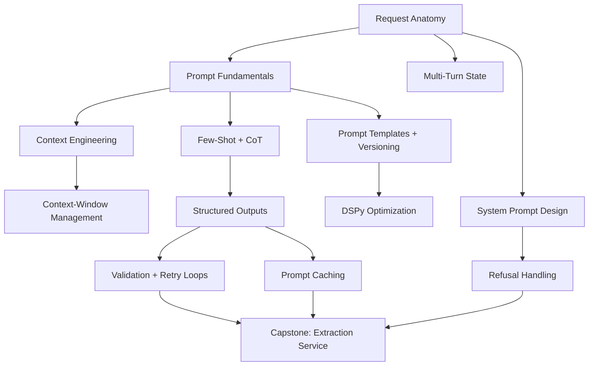

# Phase 01: Prompt & Context Engineering

14 lessons. ~15 hours. Master the foundational skill of applied AI engineering: communicating precisely with models and managing what goes into the context window.

## The through-line

Everything in AI engineering starts with a prompt. Before RAG, before agents, before fine-tuning, you need to understand how to construct requests that produce reliable outputs, how to manage what the model sees, and how to measure whether your prompts actually work. This phase covers all of it : from request anatomy through a production extraction service.

## What you build

## Lessons

| # | Lesson | Artifact | Time |
|---|--------|----------|------|
| 01 | Request Anatomy: System, User, Assistant | `skill-request-anatomy.md` | ~45 min |
| 02 | Prompt Fundamentals | `prompt-fundamentals-checklist.md` | ~45 min |
| 03 | Few-Shot & Chain-of-Thought | `skill-few-shot-cot.md` | ~60 min |
| 04 | Context Engineering | `skill-context-engineering.md` | ~60 min |
| 05 | Context-Window Management | `skill-context-window-manager.md` | ~45 min |
| 06 | Structured Outputs: JSON Schema, Constrained Decoding | `skill-structured-output.md` | ~60 min |
| 07 | Validation + Retry Loops: Pydantic / Zod | `skill-validation-retry-loop.md` | ~60 min |
| 08 | Prompt Templates & Versioning | `skill-prompt-template-system.md` | ~45 min |
| 09 | Programmatic Prompt Optimization: DSPy | `skill-dspy-optimizer.md` | ~60 min |
| 10 | Multi-Turn Conversations & State | `skill-conversation-manager.md` | ~45 min |
| 11 | System Prompt Design | `prompt-system-prompt-patterns.md` | ~45 min |
| 12 | Handling Refusals & Edge Cases | `skill-refusal-handler.md` | ~45 min |
| 13 | Prompt Caching: Cost and Latency | `skill-prompt-cache.md` | ~45 min |
| 14 | Capstone: Structured-Extraction Service + Prompt Library | `runbook-extraction-service.md` | ~90 min |

## Prerequisites

Phase 00 (Setup) or just: working Python environment, Anthropic API key. No prior ML knowledge required.

## Stack

- Python + `anthropic` SDK (primary)
- `pydantic` for validation and retry loops
- `dspy` for programmatic optimization (L09)
- `fastapi` + `uvicorn` for the capstone service
- No LangChain required: you build the patterns raw first
