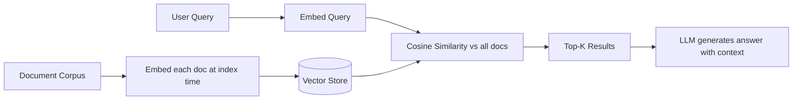

# الحدس وراء الـ Embeddings

> النص نقطة في فضاء. المعاني المتشابهة تسكن قريبًا من بعضها. وكل ما تبقّى يتفرّع من هذه الفكرة.

**النوع:** بناء
**اللغات:** Python
**المتطلبات:** المرحلة 01 (أساسيات الـ LLM)
**الوقت:** ~60 دقيقة
**المرحلة:** 02 · الاسترجاع و RAG

## أهداف التعلّم

- شرح ما هو الـ vector embedding بطريقة يستطيع مهندس الإنتاج التصرّف بناءً عليها
- تنفيذ تشابه جيب التمام (cosine similarity) من الصفر وتفسير لماذا يتفوّق على المسافة الإقليدية (Euclidean distance) للنصوص
- بناء نظام بحث دلالي (semantic search) مبسّط باستخدام NumPy فقط
- استخدام `sentence-transformers` لاستبدال الطريقة الخام، وتوضيح الفرق في الجودة
- تصميم مجموعة فحوصات بسيطة للتأكّد من أن الـ embeddings تعمل قبل أن تطلق نظامك

---

## المشكلة

أنت تبني روبوت دردشة للدعم الفني. المستخدمون يطرحون أسئلتهم بلغة طبيعية. لديك 10,000 مقالة دعم. أول طريقة تخطر على البال هي البحث بالكلمات المفتاحية (keyword search): لكن البحث بالكلمات المفتاحية يفشل في اللحظة التي يكتب فيها المستخدم "تطبيقي لا يعمل" بينما الجواب يقبع في مقالة عنوانها "Application Launch Failure Troubleshooting".

الكلمات لا تتطابق. والمعنى واحد تمامًا. البحث بالكلمات المفتاحية يُرجع صفر نتيجة. روبوتك يقول "ما لقيت شيء". المستخدم يتصل بالدعم. تلك المكالمة تكلّف 12 دولارًا. ولديك 400 حالة فشل مماثلة يوميًا. هذا يعني 4,800 دولار يوميًا من التكاليف التي كان بالإمكان تفاديها، وكل واحدة منها وضع فشل أدخلته أنت باختيارك للبدائية الخاطئة في الاسترجاع.

الحل هو البحث الدلالي (semantic search): المطابقة حسب *المعنى*، لا حسب التداخل اللفظي. لكن البحث الدلالي يتطلّب embeddings: طريقة لتمثيل النص كنقطة في فضاء بحيث ينتهي "تطبيقي لا يعمل" و"application launch failure" قريبَين من بعضهما. قبل أن تمدّ يدك إلى قاعدة بيانات شعاعية (vector database) أو إلى embedding API مُدارة، عليك أن تفهم ما هو الـ embedding فعليًا. المهندسون الذين يتعاملون مع الـ embeddings كصندوق أسود يُطلقون أنظمة بأرضية استرجاع لا يستطيعون تفسيرها ولا تنقيحها ولا تحسينها. هذا الدرس يزيل الصندوق الأسود.

---

## المفهوم

### النص ← نقطة في فضاء بـ N أبعاد

الـ embedding هو دالة تُحوّل سلسلة نصية (string) إلى قائمة أرقام ثابتة الطول. كل رقم هو إحداثي في فضاء عالي الأبعاد: 384 بُعدًا لنموذج صغير، و3072 لنموذج كبير. والخاصية الجوهرية: الدالة مُدرّبة بحيث يُحوّل النص المتشابه دلاليًا إلى نقاط *قريبة هندسيًا*.

```
"my app won't start"         → [0.12, -0.43, 0.88, ..., 0.21]  (384 numbers)
"application launch failure" → [0.11, -0.41, 0.85, ..., 0.19]  (very close!)
"best pizza in Brooklyn"     → [-0.67, 0.92, -0.14, ..., 0.55]  (far away)
```

بتصوّرها في بُعدين (تخيّل إسقاط 384 بُعدًا إلى بُعدين):

```
                ^
  "app crash"  *|  * "application won't launch"
  "won't start"*|
                |
                |
   "pizza NYC" *|
                +----------------------------->
```

المفاهيم المترابطة تتجمّع. والمفاهيم غير المترابطة تتباعد.

### لماذا تشابه جيب التمام وليس المسافة الإقليدية

قد يكون لنصّين *اتجاهان* متشابهان في فضاء الـ embedding لكن *مقدارَين* مختلفين جدًا: المستند الطويل يُنتج شعاعًا خامًا أطول من جملة قصيرة حتى لو ناقشا الموضوع نفسه، لأن مساهمات الـ tokens الخام تتراكم. المسافة الإقليدية (L2) تعاقب هذا الفرق في المقدار وتُرجع نتائج أسوأ.

تشابه جيب التمام يهتمّ فقط بـ *الزاوية* بين شعاعَين، متجاهلًا المقدار:

```
                      A · B
cosine_sim(A, B) = ---------
                   |A| × |B|
```

تتراوح القيم من -1 (معنى معاكس) إلى +1 (اتجاه متطابق). معظم أزواج النصوص المتشابهة تسجّل 0.85–0.99. والأزواج غير المترابطة كليًا تسجّل 0.0–0.3.

```
cosine_sim("app won't start", "application launch failure") = 0.91  ✓ similar
cosine_sim("app won't start", "best pizza in Brooklyn")    = 0.04  ✓ unrelated
```

### كيف تتعلّم نماذج الـ Embedding هذا

نموذج مثل `all-MiniLM-L6-v2` هو محوّل (transformer) من نوع BERT مضبوط بدقة (fine-tuned). دُرّب على ملايين أزواج الجمل المُصنّفة كمتشابهة/مختلفة (من مجموعات بيانات NLI، وأزواج استعلام/نتيجة بحث، إلخ) باستخدام دالة الخسارة التباينية (contrastive loss): سحب الأزواج المتشابهة نحو بعضها، ودفع الأزواج المختلفة بعيدًا. النتيجة شبكة تُحوّل أي سلسلة نصية إلى نقطة بحيث تعكس هندسة الفضاء المعنى الدلالي.

لا تحتاج إلى فهم التدريب لاستخدام الـ embeddings بفعالية: لكن معرفة *لماذا* تعمل الهندسة بهذه الطريقة تساعدك حين تنقّح حالات فشل الاسترجاع.

### حلقة الاسترجاع



الفهرسة (indexing) تحدث مرة واحدة (دون اتصال/offline). أما embedding الاستعلام + البحث بالتشابه فيحدثان وقت التشغيل. وقاعدة البيانات الشعاعية ليست سوى طريقة محسّنة لتشغيل البحث بالتشابه على نطاق واسع.

---

## البناء

سنبني هذا على مرحلتين. أولًا، نسخة *تجريبية* باستخدام الإسقاطات العشوائية (random projections): ليست embeddings بجودة إنتاجية، لكنها كافية لإظهار الآلية. ثم نستبدلها بـ embeddings حقيقية ونرى قفزة الجودة.

### الخطوة 1: تنفيذ تشابه جيب التمام

كل الرياضيات التي تحتاجها فعليًا.

```python
# pip install numpy
import numpy as np

def cosine_similarity(a: np.ndarray, b: np.ndarray) -> float:
    """
    Compute cosine similarity between two 1-D vectors.
    Returns a value in [-1.0, 1.0]. Higher = more similar.
    """
    norm_a = np.linalg.norm(a)
    norm_b = np.linalg.norm(b)
    if norm_a == 0 or norm_b == 0:
        return 0.0
    return float(np.dot(a, b) / (norm_a * norm_b))
```

اختبرها فورًا:

```python
# Identical vectors should score 1.0
v1 = np.array([1.0, 0.0, 0.0])
v2 = np.array([1.0, 0.0, 0.0])
assert cosine_similarity(v1, v2) == 1.0

# Perpendicular vectors should score 0.0
v3 = np.array([0.0, 1.0, 0.0])
assert cosine_similarity(v1, v3) == 0.0

# Opposite vectors should score -1.0
v4 = np.array([-1.0, 0.0, 0.0])
assert cosine_similarity(v1, v4) == -1.0

print("cosine_similarity: all assertions passed")
```

> **اختبار من الواقع:** مؤسّسك غير التقني ينظر إلى هذا ويقول: "بحثنا يجد الكلمات المفتاحية بشكل جيد، فلماذا نحتاج إلى كل رياضيات الأشعّة هذه؟" كيف تشرح، بكلمات بسيطة، ما الذي يعجز عنه البحث بالكلمات المفتاحية وما الذي يجلبه هذا فعليًا للعمل؟

### الخطوة 2: بناء embedding مبني على المفردات (بأسلوب TF-IDF)

قبل استخدام النماذج العصبية، لنبنِ embedding من نوع *حقيبة الكلمات* (bag-of-words). ليس دلاليًا، لكنه يوضّح نمط التمثيل الشعاعي ويُظهر بالضبط لماذا يقصُر عن المطلوب.

```python
import re
from collections import Counter

def build_vocabulary(docs: list[str]) -> list[str]:
    """Build a sorted vocabulary from a list of documents."""
    words = set()
    for doc in docs:
        tokens = re.findall(r'\b[a-z]+\b', doc.lower())
        words.update(tokens)
    return sorted(words)

def bow_embed(text: str, vocab: list[str]) -> np.ndarray:
    """
    Bag-of-words embedding: a vector where each dimension is a word
    in the vocabulary, and the value is the word's count in `text`.
    """
    tokens = re.findall(r'\b[a-z]+\b', text.lower())
    counts = Counter(tokens)
    return np.array([counts.get(word, 0) for word in vocab], dtype=float)
```

### الخطوة 3: بناء محرّك البحث

```python
class ToySearchEngine:
    def __init__(self, docs: list[str]):
        self.docs = docs
        self.vocab = build_vocabulary(docs)
        # Index: embed every document at init time
        self.doc_vectors = [bow_embed(doc, self.vocab) for doc in docs]

    def search(self, query: str, top_k: int = 3) -> list[tuple[float, str]]:
        query_vec = bow_embed(query, self.vocab)
        scores = [
            (cosine_similarity(query_vec, dv), doc)
            for dv, doc in zip(self.doc_vectors, self.docs)
        ]
        scores.sort(key=lambda x: x[0], reverse=True)
        return scores[:top_k]
```

### الخطوة 4: شاهد أين تنهار الـ embeddings المبنية على الكلمات المفتاحية

```python
documents = [
    "Application launch failure troubleshooting guide",
    "How to reset your password and recover account access",
    "Billing and subscription management",
    "Network connectivity issues and VPN configuration",
    "Data export and backup procedures",
]

engine = ToySearchEngine(documents)

# This should match doc[0]: but watch what happens
results = engine.search("my app won't start")
print("Query: 'my app won't start'")
for score, doc in results:
    print(f"  {score:.3f}  {doc}")
```

النتيجة الأولى ستكون على الأرجح خاطئة أو تسجّل 0.0 لأن "my app won't start" لا تشترك في أي كلمة مع "Application launch failure troubleshooting guide". هذا هو وضع الفشل بعينه الذي نحلّه.

### الخطوة 5: استبدالها بـ embeddings عصبية حقيقية

الآن نستبدل البحث في المفردات بنموذج عصبي. لاحظ أن منطق `search` لا يتغيّر إطلاقًا: تتغيّر دالة الـ embedding فقط.

```python
# pip install sentence-transformers
from sentence_transformers import SentenceTransformer

class SemanticSearchEngine:
    def __init__(self, docs: list[str], model_name: str = "all-MiniLM-L6-v2"):
        self.docs = docs
        self.model = SentenceTransformer(model_name)
        # Encode all documents at index time
        # encode() returns a numpy array of shape (N, embedding_dim)
        self.doc_vectors = self.model.encode(docs, normalize_embeddings=True)

    def search(self, query: str, top_k: int = 3) -> list[tuple[float, str]]:
        query_vec = self.model.encode([query], normalize_embeddings=True)[0]
        scores = [
            (cosine_similarity(query_vec, dv), doc)
            for dv, doc in zip(self.doc_vectors, self.docs)
        ]
        scores.sort(key=lambda x: x[0], reverse=True)
        return scores[:top_k]
```

`normalize_embeddings=True` يُطبّع الأشعّة مسبقًا إلى طول الوحدة، ما يعني أن تشابه جيب التمام يختزل إلى جداء نقطي (dot product) بسيط: أسرع ومستقرّ عدديًا.

### الخطوة 6: قارن النتائج

```python
semantic_engine = SemanticSearchEngine(documents)

queries = [
    "my app won't start",
    "I forgot my login credentials",
    "how do I export my data",
]

print("\n=== Semantic Search Results ===")
for query in queries:
    print(f"\nQuery: '{query}'")
    for score, doc in semantic_engine.search(query, top_k=2):
        print(f"  {score:.3f}  {doc}")
```

سترى أن "my app won't start" تسترجع الآن بشكل صحيح "Application launch failure troubleshooting guide" بدرجة حول 0.80–0.90. هندسة فضاء الـ embedding العصبي تعكس المعنى.

---

## الاستخدام

`sentence-transformers` هي المكتبة المعتمَدة لنماذج الـ embedding المحلّية. النمط أعلاه هو الاستخدام الإنتاجي الكامل: `encode()` يتولّى التجميع (batching)، والتقطيع إلى tokens، والتطبيع.

**ما الذي يضيفه على نسختك الخام:**

| الميزة | الخام (NumPy + BoW) | sentence-transformers |
|---|---|---|
| الفهم الدلالي | لا: لفظي فقط | نعم: واعٍ بالمعنى |
| التعامل مع المرادفات | لا | نعم |
| التعامل مع إعادة الصياغة | لا | نعم |
| الدعم متعدّد اللغات | لا | مع النماذج متعددة اللغات |
| الترميز بالدُفعات | يدوي | مدمج، مُسرّع بالـ GPU |
| تنوّع النماذج | غير منطبق | أكثر من 1000 نموذج على HuggingFace |

في الإنتاج، ستستدعي عادة API (OpenAI، Voyage، Cohere) بدلًا من تشغيل نموذج محلّي: نتناوله في الدرس 02. لكن `sentence-transformers` هي الأداة المناسبة للتطوير والاختبار والنشر الحسّاس للتكلفة.

> **نقلة في المنظور:** مهندس مهتمّ بالتكلفة في فريقك يقول: "تحميل هذا النموذج يبلغ 80MB ونحن لا نقوم إلا بعملية بحث. لماذا لا نستخدم أنماط regex أو فهرس كلمات مفتاحية جيد بدلًا منه؟ هل هذا ضروري فعلًا، أم أننا نبالغ في الهندسة؟" ما جوابك الصادق، ومتى قد يكون محقًّا فعلًا؟

**أبرز المعاملات (parameters) التي ينبغي معرفتها:**

```python
# Batch encoding for performance (process multiple texts at once)
vectors = model.encode(
    texts,
    batch_size=32,           # tune to your GPU/CPU memory
    show_progress_bar=True,  # useful when indexing large corpora
    normalize_embeddings=True,
    convert_to_numpy=True,   # default; use convert_to_tensor=True for GPU ops
)
```

---

## التسليم

ينتج هذا الدرس أداة بحث دلالي مبسّطة يمكنك إدراجها في أي مشروع.

**الأثر (Artifact):** `01-embeddings-intuition/outputs/skill-embeddings-intuition.md`

ملف المهارة يلتقط النموذج الذهني وأنماط التنقيح بحيث يستطيع مساعد ذكاء اصطناعي (أو نفسك المستقبلية) التفكير في حالات فشل الـ embedding دون إعادة اشتقاق كل شيء من الصفر.

يحتوي `code/main.py` على كلا التنفيذين (بأسلوب TF-IDF والعصبي) في ملف واحد قابل للتشغيل. انسخ صنف `SemanticSearchEngine` إلى مشروعك كنقطة انطلاق. وحين تصبح جاهزًا لاستبدالها بـ embedding API إنتاجية، يتغيّر استدعاء `encode()` فقط.

---

## التقييم

قد تبدو الـ embeddings جيدة في العروض التوضيحية وتفشل بصمت في الإنتاج. إليك ثلاثة فحوصات تكشف المشكلات الحقيقية:

**الفحص 1: اختبار الزوج العقلاني (Sanity Pair)**

قبل فهرسة أي شيء، تحقّق من أن مخرجات نموذجك منطقية على أزواج معروفة:

```python
def sanity_check(model):
    pairs = [
        # (text_a, text_b, should_be_similar)
        ("The app crashed", "Application stopped working", True),
        ("Invoice payment due", "Reset password instructions", False),
        ("How do I cancel my subscription", "Unsubscribe from billing plan", True),
    ]
    for a, b, expected_similar in pairs:
        va, vb = model.encode([a, b], normalize_embeddings=True)
        score = cosine_similarity(va, vb)
        verdict = score > 0.6 if expected_similar else score < 0.4
        status = "PASS" if verdict else "FAIL"
        print(f"[{status}] ({score:.2f}) '{a}' vs '{b}'")
```

شغّل هذا في كل مرة تُغيّر فيها النماذج. النموذج الذي يفشل في الأزواج البديهية سيفشل في الإنتاج.

**الفحص 2: معدّل الإصابة في الاسترجاع على استعلامات مُصنّفة**

إن كان لديك ولو 20 زوج استعلام/مستند مُصنّفًا (مطابقات صحيحة محقّقة بشريًا)، قِس كم مرة يظهر المستند الصحيح ضمن أعلى 5 نتائج:

```python
hit_rate = sum(
    1 for query, correct_doc in labeled_pairs
    if correct_doc in [doc for _, doc in engine.search(query, top_k=5)]
) / len(labeled_pairs)
print(f"Top-5 hit rate: {hit_rate:.1%}")
```

معدّل إصابة أقلّ من 70% على أزواج بديهية يعني أن نموذج الـ embedding خيار خاطئ لمجالك. الدرس 06 من المرحلة 02 يتناول مقاييس الاسترجاع الكاملة.

**الفحص 3: توزيع الدرجات**

انظر إلى توزيع درجات التشابه عبر نتائجك المُسترجَعة. إن كانت درجات المرتبة الأولى أقلّ من 0.5 باستمرار، فنموذجك غير واثق: قد يكون الاستعلام والمستندات في مجالات مختلفة (مثلًا، استعلام متعدّد اللغات مقابل نموذج بالإنجليزية فقط، أو استعلام برمجي مقابل نموذج نصّ عام).

```python
scores = [score for score, _ in engine.search(query, top_k=10)]
print(f"Top-1 score: {scores[0]:.3f}")
print(f"Mean top-10: {sum(scores)/len(scores):.3f}")
# If top-1 < 0.5 on queries you know should match, change the model
```

---

## التمارين

1. **سهل:** وسّع `SemanticSearchEngine` ليقبل قائمة من صفوف `(doc_id, text)` ويُرجع `(score, doc_id, text)` في النتائج. اختبره مع 10 مستندات و5 استعلامات.

2. **متوسط:** نفّذ ترجيح TF-IDF بدلًا من أعداد حقيبة الكلمات الخام: رجّح كل كلمة بـ `tf * log(N / df)` حيث `df` هو عدد المستندات التي تحتوي تلك الكلمة. قِس ما إذا كان TF-IDF يُحسّن جودة الاسترجاع اللفظي على مجموعة العيّنة مقارنة بالأعداد الخام.

3. **صعب:** ابنِ منصّة تقييم (evaluation harness). خذ 50 فقرة من ويكيبيديا في مواضيع متنوّعة. لكل فقرة، ولّد استعلامَين اصطناعيَّين (أسئلة تُجيب عنها تلك الفقرة: يمكنك استخدام LLM). شغّل محرّك البحث الدلالي وقِس دقة المرتبة الأولى والمرتبة الثالثة. حدّد أسوأ 5 فقرات أداءً وافترض لماذا تفشل الـ embeddings في تلك الحالات.

---

## المصطلحات الأساسية

| المصطلح | ما يقوله الناس | ما يعنيه فعلًا |
|------|----------------|----------------------|
| Embedding | "نصّ مُحوّل إلى شعاع" | مخرج دالة مُدرّبة لوضع النص المتشابه دلاليًا قريبًا في فضاء عالي الأبعاد |
| Cosine similarity | "مدى تشابه embeddings اثنين" | جيب تمام الزاوية بين شعاعَين: يقيس التشابه الاتجاهي، لا المقدار |
| Semantic search | "بحث ذكاء اصطناعي يفهم المعنى" | استرجاع مبني على التشابه الشعاعي في فضاء الـ embedding، لا على التداخل اللفظي للـ tokens |
| Embedding dimension | "حجم الشعاع" | عدد الإحداثيات في فضاء الـ embedding؛ أبعاد أعلى = سعة تمثيلية أكبر، لكن بعوائد متناقصة فوق ~768 لمعظم المهام |
| Normalization | "تطبيع الـ embeddings مسبقًا" | تحجيم الشعاع إلى طول الوحدة بحيث يساوي الجداء النقطي تشابه جيب التمام: تحسين أداء، لا تحسين جودة |

---

## قراءات إضافية

- [Sentence-BERT: Sentence Embeddings using Siamese BERT-Networks](https://arxiv.org/abs/1908.10084): الورقة التي جعلت embeddings الجمل الفعّالة عمليّة؛ تشرح إعداد التدريب ولماذا تهمّ استراتيجيات التجميع (pooling)
- [SBERT Pretrained Models](https://www.sbert.net/docs/sentence_transformer/pretrained_models.html): المرجع المعتمَد لاختيار نموذج sentence-transformer؛ يشمل درجات القياس ومفاضلات السرعة/الحجم
- [OpenAI Embeddings Guide](https://platform.openai.com/docs/guides/embeddings): استخدام الـ API الإنتاجي، بما في ذلك متى تستخدم نماذج embedding صغيرة مقابل كبيرة وكيف تتعامل مع المدخلات الطويلة
- [Understanding Cosine Similarity](https://arxiv.org/abs/2010.01125): "Similarity Measures in Semantic Similarity": تحليل دقيق لماذا يتفوّق تشابه جيب التمام على L2 لتمثيلات النصوص
- [Massive Text Embedding Benchmark (MTEB)](https://huggingface.co/spaces/mteb/leaderboard): لوحة الصدارة المعتمَدة لمقارنة نماذج الـ embedding عبر مهام الاسترجاع والتصنيف والتجميع؛ استخدمها قبل اختيار نموذج للإنتاج
