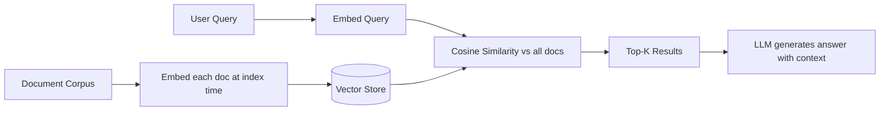

# Embeddings Intuition

> Text is a point in space. Similar meaning lives nearby. Everything else follows from that.

**Type:** Build
**Languages:** Python
**Prerequisites:** Phase 01 (LLM Fundamentals)
**Time:** ~60 minutes
**Phase:** 02 · Retrieval & RAG

## Learning Objectives

- Explain what a vector embedding is in terms a production engineer can act on
- Implement cosine similarity from scratch and explain why it outperforms Euclidean distance for text
- Build a minimal semantic search system using only NumPy
- Use `sentence-transformers` to replace the raw approach and articulate the quality difference
- Design a simple sanity-check suite to verify your embeddings are working before you ship

---

## The Problem

You're building a support chatbot. Users ask questions in natural language. You have 10,000 support articles. The obvious first approach is keyword search: but keyword search fails the moment a user writes "my app won't start" when the answer lives in an article titled "Application Launch Failure Troubleshooting."

The words don't overlap. The meaning is identical. Keyword search returns zero results. Your chatbot says "I couldn't find anything." The user calls support. That call costs $12. You have 400 similar failures per day. That's $4,800 a day in avoidable costs, and every one of them is a failure mode you introduced by choosing the wrong retrieval primitive.

The fix is semantic search: match by *meaning*, not by lexical overlap. But semantic search requires embeddings: a way to represent text as a point in space so that "my app won't start" and "application launch failure" end up near each other. Before you reach for a vector database or a managed embedding API, you need to understand what an embedding actually is. Engineers who treat embeddings as a black box ship systems with retrieval floors they can't explain, can't debug, and can't improve. This lesson removes the black box.

---

## The Concept

### Text → Point in N-dimensional Space

An embedding is a function that maps a string to a fixed-length list of numbers. Each number is a coordinate in a high-dimensional space: 384 dimensions for a small model, 3072 for a large one. The key property: the function is trained so that semantically similar text maps to *geometrically nearby* points.

```
"my app won't start"         → [0.12, -0.43, 0.88, ..., 0.21]  (384 numbers)
"application launch failure" → [0.11, -0.41, 0.85, ..., 0.19]  (very close!)
"best pizza in Brooklyn"     → [-0.67, 0.92, -0.14, ..., 0.55]  (far away)
```

Visualized in 2D (imagine projecting 384 dims down to 2):

```
                ^
  "app crash"  *|  * "application won't launch"
  "won't start"*|
                |
                |
   "pizza NYC" *|
                +----------------------------->
```

Related concepts cluster. Unrelated concepts are far apart.

### Why Cosine Similarity, Not Euclidean Distance

Two texts could have similar *directions* in embedding space but very different *magnitudes*: a long document produces a longer raw vector than a short sentence even if they discuss the same topic, because the raw token contributions add up. Euclidean distance (L2) penalizes that magnitude difference and returns worse results.

Cosine similarity only cares about the *angle* between two vectors, ignoring magnitude:

```
                      A · B
cosine_sim(A, B) = ---------
                   |A| × |B|
```

Values range from -1 (opposite meaning) to +1 (identical direction). Most similar text pairs score 0.85–0.99. Completely unrelated pairs score 0.0–0.3.

```
cosine_sim("app won't start", "application launch failure") = 0.91  ✓ similar
cosine_sim("app won't start", "best pizza in Brooklyn")    = 0.04  ✓ unrelated
```

### How Embedding Models Learn This

A model like `all-MiniLM-L6-v2` is a fine-tuned BERT transformer. It was trained on millions of sentence pairs labeled as similar/dissimilar (from NLI datasets, search query/result pairs, etc.) using contrastive loss: pull similar pairs together, push dissimilar pairs apart. The result is a network that maps any string to a point such that the geometry of the space reflects semantic meaning.

You don't need to understand the training to use embeddings effectively: but knowing *why* the geometry works this way helps when you debug retrieval failures.

### The Retrieval Loop



Indexing happens once (offline). Query embedding + similarity search happens at runtime. The vector store is just an optimized way to run the similarity search at scale.

---

## Build It

We'll build this in two stages. First, a *toy* version using random projections: not production-quality embeddings, but enough to show the mechanics. Then we'll swap in real embeddings and see the quality jump.

### Step 1: Implement Cosine Similarity

The only math you actually need.

```python
# pip install numpy
import numpy as np

def cosine_similarity(a: np.ndarray, b: np.ndarray) -> float:
    """
    Compute cosine similarity between two 1-D vectors.
    Returns a value in [-1.0, 1.0]. Higher = more similar.
    """
    norm_a = np.linalg.norm(a)
    norm_b = np.linalg.norm(b)
    if norm_a == 0 or norm_b == 0:
        return 0.0
    return float(np.dot(a, b) / (norm_a * norm_b))
```

Test it immediately:

```python
# Identical vectors should score 1.0
v1 = np.array([1.0, 0.0, 0.0])
v2 = np.array([1.0, 0.0, 0.0])
assert cosine_similarity(v1, v2) == 1.0

# Perpendicular vectors should score 0.0
v3 = np.array([0.0, 1.0, 0.0])
assert cosine_similarity(v1, v3) == 0.0

# Opposite vectors should score -1.0
v4 = np.array([-1.0, 0.0, 0.0])
assert cosine_similarity(v1, v4) == -1.0

print("cosine_similarity: all assertions passed")
```

> **Real-world check:** Your non-technical founder looks at this and says: "Our search already finds keywords just fine, why do we need all this vector math?" How would you explain, in plain terms, what keyword search cannot do and what this actually buys the business?

### Step 2: Build a Vocabulary-Based Embedding (TF-IDF Style)

Before using neural models, let's build a *bag-of-words* embedding. It's not semantic, but it demonstrates the vector representation pattern and shows exactly why it falls short.

```python
import re
from collections import Counter

def build_vocabulary(docs: list[str]) -> list[str]:
    """Build a sorted vocabulary from a list of documents."""
    words = set()
    for doc in docs:
        tokens = re.findall(r'\b[a-z]+\b', doc.lower())
        words.update(tokens)
    return sorted(words)

def bow_embed(text: str, vocab: list[str]) -> np.ndarray:
    """
    Bag-of-words embedding: a vector where each dimension is a word
    in the vocabulary, and the value is the word's count in `text`.
    """
    tokens = re.findall(r'\b[a-z]+\b', text.lower())
    counts = Counter(tokens)
    return np.array([counts.get(word, 0) for word in vocab], dtype=float)
```

### Step 3: Build the Search Engine

```python
class ToySearchEngine:
    def __init__(self, docs: list[str]):
        self.docs = docs
        self.vocab = build_vocabulary(docs)
        # Index: embed every document at init time
        self.doc_vectors = [bow_embed(doc, self.vocab) for doc in docs]

    def search(self, query: str, top_k: int = 3) -> list[tuple[float, str]]:
        query_vec = bow_embed(query, self.vocab)
        scores = [
            (cosine_similarity(query_vec, dv), doc)
            for dv, doc in zip(self.doc_vectors, self.docs)
        ]
        scores.sort(key=lambda x: x[0], reverse=True)
        return scores[:top_k]
```

### Step 4: See Where Keyword-Based Embeddings Break

```python
documents = [
    "Application launch failure troubleshooting guide",
    "How to reset your password and recover account access",
    "Billing and subscription management",
    "Network connectivity issues and VPN configuration",
    "Data export and backup procedures",
]

engine = ToySearchEngine(documents)

# This should match doc[0]: but watch what happens
results = engine.search("my app won't start")
print("Query: 'my app won't start'")
for score, doc in results:
    print(f"  {score:.3f}  {doc}")
```

The top result will likely be wrong or score 0.0 because "my app won't start" shares no words with "Application launch failure troubleshooting guide." This is the exact failure mode we're solving.

### Step 5: Swap in Real Neural Embeddings

Now we replace the vocabulary lookup with a neural model. Notice the `search` logic doesn't change at all: only the embedding function changes.

```python
# pip install sentence-transformers
from sentence_transformers import SentenceTransformer

class SemanticSearchEngine:
    def __init__(self, docs: list[str], model_name: str = "all-MiniLM-L6-v2"):
        self.docs = docs
        self.model = SentenceTransformer(model_name)
        # Encode all documents at index time
        # encode() returns a numpy array of shape (N, embedding_dim)
        self.doc_vectors = self.model.encode(docs, normalize_embeddings=True)

    def search(self, query: str, top_k: int = 3) -> list[tuple[float, str]]:
        query_vec = self.model.encode([query], normalize_embeddings=True)[0]
        scores = [
            (cosine_similarity(query_vec, dv), doc)
            for dv, doc in zip(self.doc_vectors, self.docs)
        ]
        scores.sort(key=lambda x: x[0], reverse=True)
        return scores[:top_k]
```

`normalize_embeddings=True` pre-normalizes vectors to unit length, which means cosine similarity reduces to a simple dot product: faster and numerically stable.

### Step 6: Compare the Results

```python
semantic_engine = SemanticSearchEngine(documents)

queries = [
    "my app won't start",
    "I forgot my login credentials",
    "how do I export my data",
]

print("\n=== Semantic Search Results ===")
for query in queries:
    print(f"\nQuery: '{query}'")
    for score, doc in semantic_engine.search(query, top_k=2):
        print(f"  {score:.3f}  {doc}")
```

You'll see "my app won't start" now correctly retrieves "Application launch failure troubleshooting guide" with a score around 0.80–0.90. The geometry of the neural embedding space reflects meaning.

---

## Use It

`sentence-transformers` is the go-to library for local embedding models. The pattern above is the full production usage: `encode()` handles batching, tokenization, and normalization.

**What it adds over your raw version:**

| Feature | Raw (NumPy + BoW) | sentence-transformers |
|---|---|---|
| Semantic understanding | No: lexical only | Yes: meaning-aware |
| Handles synonyms | No | Yes |
| Handles paraphrases | No | Yes |
| Cross-lingual support | No | With multilingual models |
| Batch encoding | Manual | Built-in, GPU-accelerated |
| Model variety | N/A | 1000+ models on HuggingFace |

For production, you'll usually call an API (OpenAI, Voyage, Cohere) rather than run a local model: covered in Lesson 02. But `sentence-transformers` is the right tool for development, testing, and cost-sensitive deployments.

> **Perspective shift:** A cost-conscious engineer on your team says: "This model download is 80MB and we're just doing search. Why can't we use regex patterns or a good keyword index instead? Is this really necessary, or are we over-engineering it?" What's your honest answer, and when might they actually have a point?

**Key parameters to know:**

```python
# Batch encoding for performance (process multiple texts at once)
vectors = model.encode(
    texts,
    batch_size=32,           # tune to your GPU/CPU memory
    show_progress_bar=True,  # useful when indexing large corpora
    normalize_embeddings=True,
    convert_to_numpy=True,   # default; use convert_to_tensor=True for GPU ops
)
```

---

## Ship It

This lesson produces a minimal semantic search utility you can drop into any project.

**Artifact:** `01-embeddings-intuition/outputs/skill-embeddings-intuition.md`

The skill file captures the mental model and troubleshooting patterns so an AI assistant (or your future self) can reason about embedding failures without re-deriving everything from scratch.

The `code/main.py` contains both implementations (TF-IDF style and neural) in a single runnable file. Copy the `SemanticSearchEngine` class into your own project as a starting point. When you're ready to swap in a production embedding API, only the `encode()` call changes.

---

## Evaluate It

Embeddings can look fine in demos and fail silently in production. Three checks that surface real problems:

**Check 1: The Sanity Pair Test**

Before indexing anything, verify your model's outputs make sense on known pairs:

```python
def sanity_check(model):
    pairs = [
        # (text_a, text_b, should_be_similar)
        ("The app crashed", "Application stopped working", True),
        ("Invoice payment due", "Reset password instructions", False),
        ("How do I cancel my subscription", "Unsubscribe from billing plan", True),
    ]
    for a, b, expected_similar in pairs:
        va, vb = model.encode([a, b], normalize_embeddings=True)
        score = cosine_similarity(va, vb)
        verdict = score > 0.6 if expected_similar else score < 0.4
        status = "PASS" if verdict else "FAIL"
        print(f"[{status}] ({score:.2f}) '{a}' vs '{b}'")
```

Run this every time you change models. A model that fails obvious pairs will fail in production.

**Check 2: Retrieval Hit Rate on Labeled Queries**

If you have even 20 labeled query/document pairs (human-verified correct matches), measure how often the correct document appears in top-5 results:

```python
hit_rate = sum(
    1 for query, correct_doc in labeled_pairs
    if correct_doc in [doc for _, doc in engine.search(query, top_k=5)]
) / len(labeled_pairs)
print(f"Top-5 hit rate: {hit_rate:.1%}")
```

A hit rate below 70% on obvious pairs means your embedding model is the wrong choice for your domain. Phase 02 Lesson 06 covers full retrieval metrics.

**Check 3: Score Distribution**

Look at the distribution of similarity scores across your retrieved results. If top-1 scores are consistently below 0.5, your model is uncertain: the query and documents may be in different domains (e.g., a multilingual query against an English-only model, or a code query against a general-text model).

```python
scores = [score for score, _ in engine.search(query, top_k=10)]
print(f"Top-1 score: {scores[0]:.3f}")
print(f"Mean top-10: {sum(scores)/len(scores):.3f}")
# If top-1 < 0.5 on queries you know should match, change the model
```

---

## Exercises

1. **Easy:** Extend the `SemanticSearchEngine` to accept a list of `(doc_id, text)` tuples and return `(score, doc_id, text)` in results. Test it with 10 documents and 5 queries.

2. **Medium:** Implement TF-IDF weighting instead of raw bag-of-words counts: weight each word by `tf * log(N / df)` where `df` is the number of documents containing that word. Measure whether TF-IDF improves lexical retrieval quality on the sample corpus compared to raw counts.

3. **Hard:** Build an evaluation harness. Take 50 Wikipedia paragraphs on varied topics. For each paragraph, generate 2 synthetic queries (questions that paragraph answers: you can use an LLM). Run the semantic search engine and measure top-1 and top-3 accuracy. Identify the 5 worst-performing paragraphs and hypothesize why the embeddings fail for those cases.

---

## Key Terms

| Term | What people say | What it actually means |
|------|----------------|----------------------|
| Embedding | "Text converted to a vector" | The output of a function trained to place semantically similar text nearby in a high-dimensional space |
| Cosine similarity | "How similar two embeddings are" | The cosine of the angle between two vectors: measures directional similarity, not magnitude |
| Semantic search | "AI search that understands meaning" | Retrieval based on vector similarity in embedding space, rather than lexical token overlap |
| Embedding dimension | "The size of the vector" | The number of coordinates in the embedding space; higher dimensions = more representational capacity, but diminishing returns above ~768 for most tasks |
| Normalization | "Pre-normalizing embeddings" | Scaling a vector to unit length so dot product equals cosine similarity: a performance optimization, not a quality one |

---

## Further Reading

- [Sentence-BERT: Sentence Embeddings using Siamese BERT-Networks](https://arxiv.org/abs/1908.10084): The paper that made efficient sentence embeddings practical; explains the training setup and why pooling strategies matter
- [SBERT Pretrained Models](https://www.sbert.net/docs/sentence_transformer/pretrained_models.html): The canonical reference for choosing a sentence-transformer model; includes benchmark scores and speed/size tradeoffs
- [OpenAI Embeddings Guide](https://platform.openai.com/docs/guides/embeddings): Production API usage, including when to use small vs. large embedding models and how to handle long inputs
- [Understanding Cosine Similarity](https://arxiv.org/abs/2010.01125): "Similarity Measures in Semantic Similarity": a thorough analysis of why cosine similarity outperforms L2 for text representations
- [Massive Text Embedding Benchmark (MTEB)](https://huggingface.co/spaces/mteb/leaderboard): The go-to leaderboard for comparing embedding models across retrieval, classification, and clustering tasks; use this before picking a model for production
