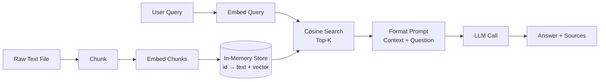

# RAG البسيط (Naive RAG)

> أربع دوال واستدعاء LLM. هذا كل ما هو عليه RAG البسيط.

**النوع:** بناء
**اللغات:** Python
**المتطلبات:** الدرس 01 (الحدس وراء الـ embeddings)، الدرس 02 (نماذج الـ embedding)، الدرس 03 (المخازن الشعاعية)، الدرس 04 (استراتيجيات التقطيع)
**الوقت:** ~60 دقيقة
**المرحلة:** 02 · الاسترجاع و RAG

---

## أهداف التعلّم

- تنفيذ خطّ أنابيب RAG كامل في أقل من 100 سطر باستخدام `openai` و`numpy` فقط
- تسمية الخطوات الأربع لخطّ الأنابيب وتحديد ما الذي يمكن أن تكسره كلٌّ منها
- التمييز بين إخفاقات الاسترجاع وإخفاقات التوليد حين يعطي نظام RAG إجابة خاطئة
- توضيح لماذا توجد الأطر (frameworks) وما الذي تضيفه فوق النسخة البسيطة
- بناء وتشغيل خطّ أساس تقييم مبسّط: 10 أزواج سؤال/جواب، تُقيَّم يدويًا

---

## المشكلة

لديك مستند كبير. وتريد LLM يجيب عن أسئلة حوله. يمكنك لصق المستند كاملًا في نافذة السياق، لكن على نطاق واسع يفشل هذا بثلاث طرق: تكلفته عالية جدًا، ويصطدم بحدود الـ tokens، و: على عكس الحدس: تسوء أداء الـ LLMs حين يكون السياق منتفخًا بنصّ غير ذي صلة. يتشتّت انتباه النموذج عبر آلاف الـ tokens وتُدفَن الحقيقة المحدّدة التي تحتاجها.

الغريزة تدفعك للجوء إلى LlamaIndex أو LangChain. هذا خطأ، ليس لأن تلك الأدوات سيّئة، بل لأنها تُجرّد بعيدًا الأشياء الخمسة التي تحتاج فهمها أكثر من غيرها. حين يعطي نظامك الإنتاجي إجابات خاطئة في الثانية صباحًا، ستحتاج معرفة ما إذا كان المستند قُطّع بشكل سيّئ، أو ما إذا فات نموذج الـ embedding إعادة صياغة، أو ما إذا كان استرجاع top-K ضيّقًا جدًا، أو ما إذا كان الـ LLM تجاهل سياقًا جيدًا وهلوس على أي حال. الإطار يُخفي كل قرار من هذه خلف قيمة افتراضية. عليك أن تراها عارية أولًا.

الحل أن تبنيه بنفسك مرة. خطّ أنابيب RAG عامل هو أربع دوال. الأولى تُحمّل مجموعتك وتحوّلها إلى chunks بـ embeddings مرفقة. الثانية تأخذ استعلام مستخدم، وتحوّله إلى embedding، وتجد أقرب الـ chunks. الثالثة تُنسّق تلك الـ chunks في prompt. الرابعة تستدعي الـ LLM. كل ما عداها: ترشيح البيانات الوصفية، والتجميع غير المتزامن (async batching)، وإزالة التكرار، والتخزين المؤقّت (caching)، وإعادة الترتيب: هو معالجة حالات حدّية تتخطّاها نسختك البسيطة. ابنِ البسيط أولًا. حدّد ما الذي ينكسر. ثم قرّر ما تضيفه.

---

## المفهوم

### الخطوات الأربع

```
┌─────────────────────────────────────────────────────┐
│  INGEST (done once)                                  │
│  load text → chunk → embed each chunk → store       │
└─────────────────────┬───────────────────────────────┘
                      │  in-memory store: {id: {text, vector}}
                      ▼
┌─────────────────────────────────────────────────────┐
│  RETRIEVE (per query)                                │
│  embed query → cosine similarity → top-K chunks     │
└─────────────────────┬───────────────────────────────┘
                      │  list of (chunk_text, score)
                      ▼
┌─────────────────────────────────────────────────────┐
│  AUGMENT (per query)                                 │
│  format chunks into a prompt with the user question  │
└─────────────────────┬───────────────────────────────┘
                      │  full prompt string
                      ▼
┌─────────────────────────────────────────────────────┐
│  GENERATE (per query)                                │
│  LLM call → answer + source citations               │
└─────────────────────────────────────────────────────┘
```



### وضعا فشل مختلفان

لدى RAG وضعا فشل يخلط بينهما المهندسون باستمرار. الفصل بينهما هو كيف تنقّح بسرعة.

| وضع الفشل | العرَض | السبب الجذري |
|---|---|---|
| **فشل الاسترجاع** | الـ chunk الصحيحة لم تكن قطّ في السياق | تقطيع سيّئ، نموذج embedding خاطئ، K صغير جدًا، عدم تطابق بين مفردات الاستعلام ومفردات المستند |
| **فشل التوليد** | الـ chunk الصحيحة استُرجِعت لكن الإجابة لا تزال خاطئة | الـ LLM تجاهل السياق، أو هلوس، أو أساء قراءة رقم، أو كان تنسيق الـ prompt مربكًا |

اختبار التشخيص: سجّل الـ chunks المُسترجَعة لاستعلام سيّئ. إن كانت الـ chunk الصحيحة موجودة، فهي مشكلة توليد. وإن لم تكن، فهي مشكلة استرجاع. لا تحاول إصلاح prompt الـ LLM حين يكون الاسترجاع معطوبًا.

### ما الذي يتخطّاه RAG البسيط

| الميزة | ما تفعله | لماذا تتخطّاها النسخة البسيطة |
|---|---|---|
| ترشيح البيانات الوصفية | تقييد الاسترجاع حسب التاريخ أو المصدر أو الوسم | يتطلّب نموذج بيانات أغنى من `{text, vector}` |
| الـ Embedding بالدُفعات | تحويل مئات الـ chunks في استدعاء API واحد | يضيف تعقيدًا؛ ولا بأس به للمجموعات الصغيرة |
| الاسترجاع غير المتزامن | الاسترجاع أثناء البثّ (streaming) | غير لازم للعرض المتزامن |
| إزالة التكرار | إزالة الـ chunks المتكرّرة من السياق | المجموعة الصغيرة نادرًا ما تحوي تكرارات دقيقة |
| إعادة الترتيب (Re-ranking) | تقييم بمرور ثانٍ للـ chunks المُسترجَعة | يضيف زمن استجابة؛ مكسب كبير فقط على الاستعلامات الغامضة |
| التخزين المُدام | البقاء بعد إعادة تشغيل العملية | يتولّاه pgvector وQdrant وPinecone |

### القاعدة الذهبية

> ابنِ البسيط أولًا. حدّد ما البطيء أو الخاطئ. ثم الجأ إلى إطار.

هذا الترتيب يهمّ. إن بدأت بإطار، فستحسّن الشيء الخطأ. الأطر تضيف أيضًا أوضاع فشل جديدة (مُحمّلات مُهيّأة بشكل خاطئ، قيم تقطيع افتراضية خاطئة، أخطاء embedding صامتة). فهم العمليات البدائية يجعل كل إطار قابلًا للتنقيح.

---

## البناء

### الخطوة 1: الاعتماديات والإعداد

```python
# pip install openai numpy
# Set environment variable: OPENAI_API_KEY=sk-...

import os
import sys
import json
import math
import uuid
import textwrap
from typing import Any

import numpy as np
from openai import OpenAI
```

ثلاثة استيرادات تقوم بكل العمل: `openai` للـ embeddings والدردشة، و`numpy` لتشابه جيب التمام، والمكتبة القياسية لكل ما عداها. لا LangChain. لا LlamaIndex. لا SDK لقاعدة بيانات شعاعية.

### الخطوة 2: المخزن في الذاكرة

```python
# The entire "vector database" is a dict.
# Key: string ID
# Value: dict with 'text' (original chunk) and 'vector' (numpy array)

def make_store() -> dict[str, dict[str, Any]]:
    """Return an empty in-memory document store."""
    return {}


def add_to_store(
    store: dict,
    text: str,
    vector: list[float],
    metadata: dict | None = None,
) -> str:
    """Add a chunk to the store. Returns the chunk ID."""
    chunk_id = str(uuid.uuid4())[:8]
    store[chunk_id] = {
        "text": text,
        "vector": np.array(vector, dtype=np.float32),
        "metadata": metadata or {},
    }
    return chunk_id
```

تلك هي قاعدة البيانات كلها. dict في بايثون. المخازن الشعاعية الإنتاجية تضيف الإدامة، والفهرسة (HNSW، IVF)، والترشيح، لكن منطق الاسترجاع متطابق.

### الخطوة 3: التقطيع

```python
def chunk_text(text: str, chunk_size: int = 400, overlap: int = 50) -> list[str]:
    """
    Split text into overlapping fixed-size chunks (by word count).
    overlap: number of words to repeat at the start of each new chunk.
    This prevents answers that straddle chunk boundaries from being lost.
    """
    words = text.split()
    chunks = []
    start = 0
    while start < len(words):
        end = start + chunk_size
        chunk = " ".join(words[start:end])
        chunks.append(chunk)
        if end >= len(words):
            break
        start = end - overlap
    return chunks
```

400 كلمة بتداخل 50 كلمة قيمة افتراضية معقولة للنثر. اضبطها لمجالك: الكود يحتاج chunks أكبر (كتل منطقية)، وmarkdown يحتاج تقسيمًا دلاليًا عند العناوين، والـ PDFs تحتاج تقطيعًا واعيًا بالصفحات. هذا أول موضع تضبطه حين تكون جودة الاسترجاع ضعيفة.

### الخطوة 4: الـ Embedding

```python
client = OpenAI(api_key=os.environ["OPENAI_API_KEY"])
EMBED_MODEL = "text-embedding-3-small"


def embed(texts: list[str]) -> list[list[float]]:
    """
    Embed a list of texts using OpenAI's embedding API.
    Returns a list of float vectors, one per input text.
    Batches up to 2048 texts per call (API limit).
    """
    if not texts:
        return []
    response = client.embeddings.create(model=EMBED_MODEL, input=texts)
    return [item.embedding for item in response.data]
```

دالة واحدة، استدعاء API واحد، تُرجع أشعّة. في الإنتاج ستضيف منطق إعادة المحاولة، والتعامل مع حدود المعدّل (rate-limit)، وتتبّع التكلفة. لمجموعة من 50 مستندًا هذا جيد كما هو.

### الخطوة 5: الاستيعاب (Ingest): جمعها معًا

```python
def ingest(filepath: str, chunk_size: int = 400, overlap: int = 50) -> dict:
    """
    Load a text file, chunk it, embed every chunk, store in memory.
    Returns the populated store.
    """
    store = make_store()

    with open(filepath, "r", encoding="utf-8") as f:
        raw_text = f.read()

    print(f"Loaded {len(raw_text):,} characters from {filepath}")

    chunks = chunk_text(raw_text, chunk_size=chunk_size, overlap=overlap)
    print(f"Split into {len(chunks)} chunks")

    print(f"Embedding {len(chunks)} chunks...")
    vectors = embed(chunks)

    for chunk, vector in zip(chunks, vectors):
        add_to_store(store, chunk, vector, metadata={"source": filepath})

    print(f"Stored {len(store)} chunks in memory")
    return store
```

هذا مرور خطّي: قراءة ← تقسيم ← تحويل الكل إلى embedding دفعة واحدة (استدعاء API واحد بدُفعة) ← تخزين. الـ embed بالدُفعة مهمّ: استدعاء `embed()` مرة واحدة بـ 50 نصًا أرخص بـ 50 مرة في زمن الاستجابة من استدعائه 50 مرة بنصّ واحد كلّ مرة.

### الخطوة 6: الاسترجاع: البحث بتشابه جيب التمام

```python
def cosine_similarity(a: np.ndarray, b: np.ndarray) -> float:
    """Cosine similarity between two vectors. Range: -1 to 1."""
    denom = np.linalg.norm(a) * np.linalg.norm(b)
    if denom == 0:
        return 0.0
    return float(np.dot(a, b) / denom)


def retrieve(
    query: str,
    store: dict,
    top_k: int = 5,
) -> list[dict]:
    """
    Embed the query and return the top_k most similar chunks.
    Returns list of dicts: {id, text, score, metadata}
    """
    if not store:
        return []

    query_vector = np.array(embed([query])[0], dtype=np.float32)

    scored = []
    for chunk_id, entry in store.items():
        score = cosine_similarity(query_vector, entry["vector"])
        scored.append({
            "id": chunk_id,
            "text": entry["text"],
            "score": score,
            "metadata": entry["metadata"],
        })

    scored.sort(key=lambda x: x["score"], reverse=True)
    return scored[:top_k]
```

الحلقة الداخلية بمرتبة O(n) على كل chunk: مسح خطّي. هذا جيد حتى ~50,000 chunk على العتاد الحديث. وفوق ذلك تحتاج فهرسة جار أقرب تقريبية (HNSW). المخازن الشعاعية الإنتاجية تتولّى هذا تلقائيًا؛ ومنطق جيب التمام متطابق.

### الخطوة 7: الإثراء (Augment): تنسيق prompt السياق

```python
SYSTEM_PROMPT = """You are a helpful assistant. Answer the user's question using ONLY the provided context.
If the context does not contain enough information to answer, say so explicitly.
Do not make up information."""


def build_prompt(query: str, retrieved_chunks: list[dict]) -> str:
    """
    Format retrieved chunks and the user query into a single prompt string.
    This is the augmentation step.
    """
    context_parts = []
    for i, chunk in enumerate(retrieved_chunks, 1):
        source = chunk["metadata"].get("source", "unknown")
        context_parts.append(
            f"[Source {i}: {source}]\n{chunk['text']}"
        )

    context_block = "\n\n---\n\n".join(context_parts)

    prompt = f"""Context:
{context_block}

---

Question: {query}

Answer based strictly on the context above:"""

    return prompt
```

تنسيق الـ prompt هو حيث يحدث معظم "السحر". الـ system prompt يخبر النموذج أن يبقى مُرسّخًا. وكتلة السياق تُسمّي كل مصدر بحيث يستطيع النموذج الاستشهاد به. والفاصل (`---`) يمنع النموذج من دمج الـ chunks معًا. هذه ليست خيارات اعتباطية: فهي تؤثّر ماديًا في جودة الإجابة.

### الخطوة 8: التوليد (Generate): استدعاء الـ LLM

```python
CHAT_MODEL = "gpt-4o-mini"


def generate(query: str, retrieved_chunks: list[dict]) -> dict:
    """
    Format context and call the LLM. Returns answer + sources.
    """
    prompt = build_prompt(query, retrieved_chunks)

    response = client.chat.completions.create(
        model=CHAT_MODEL,
        messages=[
            {"role": "system", "content": SYSTEM_PROMPT},
            {"role": "user", "content": prompt},
        ],
        temperature=0.0,  # deterministic for reproducibility
    )

    answer = response.choices[0].message.content
    sources = [c["metadata"].get("source", "unknown") for c in retrieved_chunks]

    return {
        "answer": answer,
        "sources": list(set(sources)),
        "retrieved_chunks": retrieved_chunks,
        "usage": {
            "prompt_tokens": response.usage.prompt_tokens,
            "completion_tokens": response.usage.completion_tokens,
        },
    }
```

`temperature=0.0` يجعل المخرجات حتمية: ضروري لبناء خطّ أساس تقييم. إن شغّلت الاستعلام نفسه مرتين وحصلت على إجابات مختلفة، فلن تستطيع معرفة ما إذا كان تغيير الكود أفاد أم أضرّ.

### الخطوة 9: خطّ الأنابيب الرئيسي

```python
def ask(query: str, store: dict, top_k: int = 5) -> dict:
    """
    Full RAG pipeline: retrieve + augment + generate.
    Returns answer dict with sources and retrieved chunks.
    """
    print(f"\nQuery: {query}")

    chunks = retrieve(query, store, top_k=top_k)
    print(f"Retrieved {len(chunks)} chunks (top score: {chunks[0]['score']:.3f})")

    result = generate(query, chunks)
    print(f"Answer: {result['answer'][:200]}...")

    return result


def run_eval(store: dict, eval_pairs: list[dict]) -> None:
    """
    Run a list of (question, expected_answer) pairs through the pipeline.
    Print each result for manual review.
    This is your baseline eval before adding complexity.
    """
    print("\n" + "="*60)
    print("EVALUATION RUN")
    print("="*60)

    for i, pair in enumerate(eval_pairs, 1):
        print(f"\n--- Q{i} ---")
        result = ask(pair["question"], store)
        print(f"Expected: {pair['expected']}")
        print(f"Got:      {result['answer'][:300]}")
        print(f"Tokens used: {result['usage']['prompt_tokens']} prompt / "
              f"{result['usage']['completion_tokens']} completion")


if __name__ == "__main__":
    if len(sys.argv) < 2:
        print("Usage: python main.py <path-to-text-file> [query]")
        print("       python main.py document.txt")
        print("       python main.py document.txt 'What is the main argument?'")
        sys.exit(1)

    filepath = sys.argv[1]
    store = ingest(filepath)

    if len(sys.argv) >= 3:
        # Single query mode
        query = sys.argv[2]
        result = ask(query, store)
        print("\n--- RESULT ---")
        print(result["answer"])
        print(f"\nSources: {result['sources']}")
    else:
        # Demo mode: run 3 generic questions against the document
        demo_questions = [
            "What is the main topic of this document?",
            "What are the key conclusions or recommendations?",
            "What evidence or examples are provided?",
        ]
        for q in demo_questions:
            result = ask(q, store)
            print("\n--- RESULT ---")
            print(result["answer"])
            print(f"Sources: {result['sources']}\n")
```

> **اختبار من الواقع:** يسأل مدير المنتج لديك: "ما نقدر بس نرفع المستندات لـ ChatGPT ونسأله الأسئلة مباشرة؟ ليش نبني كل السباكة هذي بأنفسنا؟" كيف تشرح ما الذي يمنحك إياه RAG ولا يمنحه رفع مستند لمرة واحدة، بكلمات بسيطة يستطيع غير المهندس التصرّف بناءً عليها؟

---

## الاستخدام

حالما تفهم كل سطر في النسخة البسيطة، يبدو النمط نفسه في LlamaIndex هكذا:

```python
from llama_index.core import VectorStoreIndex, SimpleDirectoryReader

documents = SimpleDirectoryReader("./docs").load_data()
index = VectorStoreIndex.from_documents(documents)
query_engine = index.as_query_engine()
response = query_engine.query("What is the main argument?")
```

خمسة أسطر تحلّ محلّ 100. الإطار يمنحك: تخزينًا مُدامًا، وتحميلًا غير متزامن، واستخراج بيانات وصفية، وembedding بالدُفعات مع إعادة محاولة، واستراتيجيات تقطيع قابلة للتهيئة، واثني عشر وضع استرجاع. وما يأخذه: الرؤية في كل خطوة. حين يُرجع إجابة خاطئة، تحتاج معرفة النسخة البسيطة لتنقيحه.

مكافئ LangChain:

```python
from langchain_community.document_loaders import TextLoader
from langchain_openai import OpenAIEmbeddings
from langchain_community.vectorstores import FAISS
from langchain.chains import RetrievalQA
from langchain_openai import ChatOpenAI

loader = TextLoader("document.txt")
docs = loader.load_and_split()
db = FAISS.from_documents(docs, OpenAIEmbeddings())
qa = RetrievalQA.from_chain_type(llm=ChatOpenAI(), retriever=db.as_retriever())
result = qa.invoke({"query": "What is the main argument?"})
```

المفاهيم تتطابق مباشرة. `load_and_split()` = دالتنا `chunk_text()`. و`FAISS.from_documents()` = حلقة `ingest()` لدينا. و`as_retriever()` = دالتنا `retrieve()`. الإطار لا يفعل شيئًا مختلفًا: إنه يفعل الشيء نفسه بمزيد من معالجة الأخطاء، ومزيد من خيارات التهيئة، ومزيد من التجريدات بينك وبين العلّة.

> **نقلة في المنظور:** قائد فريقك يشير إلى أن لديك 200 مستند فقط وأن المجموعة كلها تلائم نافذة سياق GPT-4o واحدة. "هل بناء خطّ تقطيع، ومخزن embedding، وخطوة استرجاع مبرّر فعلًا هنا، ولا نبالغ في هندسة مشكلة كان بإمكاننا حلّها باستدعاء API واحد؟" ما جوابك الصادق، وأي عدد مستندات أو أي قيد يُغيّره؟

---

## التسليم

مخرَج هذا الدرس هو prompt المُنقّح في `outputs/prompt-rag-debugger.md`. يربط الأعراض بخطوات خطّ الأنابيب المعطوبة بحيث يمكنك تشخيص إخفاقات الإنتاج بشكل منهجي.

الأثر القابل للتشغيل هو `code/main.py`. وجّهه إلى أي ملف نصّ عادي:

```bash
export OPENAI_API_KEY=sk-...
python main.py my_document.txt "What are the main findings?"
```

---

## التقييم

**الفحص 1: ابنِ مجموعة تقييمك قبل أن تبني أي شيء آخر.**
اكتب 10 أزواج سؤال/جواب من مجموعتك *قبل* تشغيل استعلام واحد عبر النظام. الحقيقة الأرضية أولًا. وإلا فستكتب لا شعوريًا أسئلة يجيب عنها النظام جيدًا أصلًا. عشرة أزواج كافية لالتقاط الإخفاقات المنهجية. شغّلها:

```bash
python main.py document.txt  # demo mode runs generic questions
```

لكل سؤال في مجموعة تقييمك، سجّل: الاستعلام، وأعلى 3 chunks مُسترجَعة، والإجابة. قيّم كل إجابة كصحيحة / صحيحة جزئيًا / خاطئة. سجّل الدرجة. هذا هو خطّ أساسك.

**الفحص 2: جودة الاسترجاع قبل جودة التوليد.**
لكل إجابة خاطئة، افحص الـ chunks المُسترجَعة. إن لم يكن المقطع ذو الصلة ضمن أعلى 5، فالمشكلة في الاسترجاع (التقطيع، نموذج الـ embedding، حجم K). وإن كان المقطع ذو الصلة موجودًا لكن الإجابة لا تزال خاطئة، فالمشكلة في التوليد (تنسيق الـ prompt، اختيار النموذج، الـ temperature). لا تحاول أبدًا إصلاح أحدهما حين يكون الآخر معطوبًا.

**الفحص 3: تكلفة الـ tokens لكل استعلام.**
سجّل `prompt_tokens` لعيّنة تمثيلية من الاستعلامات. إن تجاوزت ~3,000 token، فإما أن الـ chunks كبيرة جدًا أو أن K مرتفع جدًا. التكلفة تتراكم بسرعة على نطاق واسع: 1,000 استعلام/يوم عند 3,000 token لكلٍّ = 3M token/يوم. اعرف رقمك قبل أن تذهب للإنتاج.

---

## التمارين

1. **[سهل]** عدّل `chunk_text()` ليقسّم على حدود الفقرات (`\n\n`) بدلًا من عدد كلمات ثابت. شغّل الاستعلام نفسه على كلتا النسختين. أيّهما يسترجع سياقًا أفضل لمستندك الاختباري؟

2. **[متوسط]** أضف معامل `min_score` إلى `retrieve()` يُرشّح الـ chunks التي تقلّ عن عتبة تشابه جيب التمام. أي عتبة تُزيل الضوضاء دون قطع النتائج الحقيقية؟ ابنِ اختبارًا صغيرًا لإيجادها تجريبيًا على مجموعتك.

3. **[صعب]** استبدل المخزن في الذاكرة بـ SQLite + عمود JSON للأشعّة. لا ينبغي أن تتغيّر الواجهة (`add_to_store`، `retrieve`). هذا يجبرك على تسلسل/فكّ تسلسل مصفوفات numpy ويُدخل مفاضلات المخزن المُدام. ما الذي ينكسر في `retrieve()` حين تُحمَّل الأشعّة من القرص بدلًا من الذاكرة؟

---

## المصطلحات الأساسية

| المصطلح | ما يقوله الناس | ما يعنيه فعلًا |
|------|----------------|----------------------|
| RAG | "Retrieval Augmented Generation" | نمط تسترجع فيه نصًا ذا صلة قبل استدعاء LLM، بحيث يجيب النموذج من الأدلّة لا من الذاكرة |
| Chunk | "chunk مستند" أو "مقطع" | قسم فرعي من مستند؛ الوحدة التي تُحوّل إلى embedding وتُسترجَع |
| Embedding | "شعاع" أو "embedding دلالي" | مصفوفة ثابتة الطول من الأعداد العشرية تُرمّز المعنى؛ النصوص المتشابهة لها أشعّة متشابهة |
| Cosine similarity | "تشابه شعاعي" أو "درجة تشابه دلالي" | مقياس (0–1) لمدى تشابه شعاعين في الاتجاه، بغضّ النظر عن المقدار |
| Top-K retrieval | "K جار أقرب" | الـ K chunks الأعلى تشابهًا في جيب التمام مع شعاع الاستعلام |
| Augmentation | "حقن السياق" أو "الترسيخ" | الخطوة التي تُدرَج فيها الـ chunks المُسترجَعة في prompt الـ LLM |
| Hallucination | "اختلاق الأشياء" | حين يولّد الـ LLM محتوى خاطئًا واقعيًا غير مدعوم بالسياق |

---

## قراءات إضافية

- [OpenAI Embeddings Guide](https://platform.openai.com/docs/guides/embeddings): مرجع API، ومقارنة نماذج، وأفضل الممارسات للتجميع بالدُفعات
- [What We Learned from a Year of Building with LLMs](https://applied-llms.org/): دروس من الممارسين؛ القسم عن أوضاع فشل RAG منطبق مباشرة
- [RAG vs Fine-tuning](https://arxiv.org/abs/2312.05934): متى تختار كل نهج؛ ترسيخ لماذا يكون RAG نقطة الانطلاق الافتراضية
- [Building RAG from Scratch](https://docs.llamaindex.ai/en/stable/understanding/rag/): شرح LlamaIndex نفسه للعمليات البدائية؛ اقرأه بعد أن تبني النسخة البسيطة
- [Chunking Strategies for LLM Applications](https://www.pinecone.io/learn/chunking-strategies/): تفصيل Pinecone للتقطيع ثابت الحجم مقابل الدلالي مقابل الواعي بالمستند
