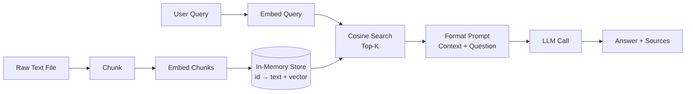

# Naive RAG

> Four functions and an LLM call. That is all naive RAG is.

**Type:** Build
**Languages:** Python
**Prerequisites:** Lesson 01 (embeddings intuition), Lesson 02 (embedding models), Lesson 03 (vector stores), Lesson 04 (chunking strategies)
**Time:** ~60 minutes
**Phase:** 02 · Retrieval & RAG

---

## Learning Objectives

- Implement a complete RAG pipeline in under 100 lines using only `openai` and `numpy`
- Name the four steps of the pipeline and identify what each one can break
- Distinguish retrieval failures from generation failures when a RAG system gives a wrong answer
- Articulate why frameworks exist and what they add on top of the naive version
- Build and run a minimal evaluation baseline: 10 question/answer pairs, scored manually

---

## The Problem

You have a large document. You want an LLM to answer questions about it. You could paste the whole thing into the context window, but at scale that fails in three ways: it costs too much, it hits token limits, and: counterintuitively: LLMs get worse when the context is bloated with irrelevant text. The model's attention is diluted across thousands of tokens and the specific fact you need gets buried.

The instinct is to reach for LlamaIndex or LangChain. That is a mistake, not because those tools are bad, but because they abstract away the five things you most need to understand. When your production system gives wrong answers at 2 a.m., you will need to know whether the document was chunked badly, whether the embedding model missed a paraphrase, whether the top-K retrieval was too narrow, or whether the LLM ignored good context and hallucinated anyway. A framework hides each of those decisions behind a default. You need to see them naked first.

The fix is to build it yourself once. A working RAG pipeline is four functions. The first loads your corpus and turns it into chunks with embeddings attached. The second takes a user query, embeds it, and finds the closest chunks. The third formats those chunks into a prompt. The fourth calls the LLM. Everything else: metadata filtering, async batching, deduplication, caching, re-ranking: is handling edge cases that your naive version skips. Build naive first. Profile what breaks. Then decide what to add.

---

## The Concept

### The Four Steps

```
┌─────────────────────────────────────────────────────┐
│  INGEST (done once)                                  │
│  load text → chunk → embed each chunk → store       │
└─────────────────────┬───────────────────────────────┘
                      │  in-memory store: {id: {text, vector}}
                      ▼
┌─────────────────────────────────────────────────────┐
│  RETRIEVE (per query)                                │
│  embed query → cosine similarity → top-K chunks     │
└─────────────────────┬───────────────────────────────┘
                      │  list of (chunk_text, score)
                      ▼
┌─────────────────────────────────────────────────────┐
│  AUGMENT (per query)                                 │
│  format chunks into a prompt with the user question  │
└─────────────────────┬───────────────────────────────┘
                      │  full prompt string
                      ▼
┌─────────────────────────────────────────────────────┐
│  GENERATE (per query)                                │
│  LLM call → answer + source citations               │
└─────────────────────────────────────────────────────┘
```



### Two Different Failure Modes

RAG has two failure modes that engineers constantly confuse. Keeping them separate is how you debug fast.

| Failure mode | Symptom | Root cause |
|---|---|---|
| **Retrieval failure** | The right chunk was never in the context | Bad chunking, wrong embedding model, K too small, mismatch between query vocabulary and document vocabulary |
| **Generation failure** | The right chunk was retrieved but the answer is still wrong | LLM ignored context, hallucinated, misread a number, or prompt formatting was confusing |

The diagnostic test: log the retrieved chunks for a bad query. If the right chunk is there, it is a generation problem. If it is not, it is a retrieval problem. Do not try to fix the LLM prompt when the retrieval is broken.

### What Naive RAG Skips

| Feature | What it does | Why naive version skips it |
|---|---|---|
| Metadata filtering | Restrict retrieval by date, source, tag | Requires richer data model than `{text, vector}` |
| Batched embedding | Embed hundreds of chunks in one API call | Adds complexity; fine for small corpora |
| Async retrieval | Retrieve while streaming | Not needed for synchronous demo |
| Deduplication | Remove repeated chunks from context | Small corpus rarely has exact duplicates |
| Re-ranking | Second-pass scoring of retrieved chunks | Adds latency; big gain only on ambiguous queries |
| Persistent storage | Survive process restarts | pgvector, Qdrant, Pinecone handle this |

### The Golden Rule

> Build naive first. Profile what is slow or wrong. Then reach for a framework.

This order matters. If you start with a framework, you will optimize the wrong thing. Frameworks also add new failure modes (misconfigured loaders, wrong chunking defaults, silent embedding errors). Understanding the primitive operations makes every framework debuggable.

---

## Build It

### Step 1: Dependencies and Setup

```python
# pip install openai numpy
# Set environment variable: OPENAI_API_KEY=sk-...

import os
import sys
import json
import math
import uuid
import textwrap
from typing import Any

import numpy as np
from openai import OpenAI
```

Three imports do all the work: `openai` for embeddings and chat, `numpy` for cosine similarity, and the standard library for everything else. No LangChain. No LlamaIndex. No vector database SDK.

### Step 2: The In-Memory Store

```python
# The entire "vector database" is a dict.
# Key: string ID
# Value: dict with 'text' (original chunk) and 'vector' (numpy array)

def make_store() -> dict[str, dict[str, Any]]:
    """Return an empty in-memory document store."""
    return {}


def add_to_store(
    store: dict,
    text: str,
    vector: list[float],
    metadata: dict | None = None,
) -> str:
    """Add a chunk to the store. Returns the chunk ID."""
    chunk_id = str(uuid.uuid4())[:8]
    store[chunk_id] = {
        "text": text,
        "vector": np.array(vector, dtype=np.float32),
        "metadata": metadata or {},
    }
    return chunk_id
```

That is the whole database. A Python dict. Production vector stores add persistence, indexing (HNSW, IVF), and filtering, but the retrieval logic is identical.

### Step 3: Chunking

```python
def chunk_text(text: str, chunk_size: int = 400, overlap: int = 50) -> list[str]:
    """
    Split text into overlapping fixed-size chunks (by word count).
    overlap: number of words to repeat at the start of each new chunk.
    This prevents answers that straddle chunk boundaries from being lost.
    """
    words = text.split()
    chunks = []
    start = 0
    while start < len(words):
        end = start + chunk_size
        chunk = " ".join(words[start:end])
        chunks.append(chunk)
        if end >= len(words):
            break
        start = end - overlap
    return chunks
```

400 words with 50-word overlap is a reasonable default for prose. Adjust for your domain: code needs larger chunks (logical blocks), markdown needs semantic splitting at headers, PDFs need page-aware chunking. This is the first place to tune when retrieval quality is poor.

### Step 4: Embedding

```python
client = OpenAI(api_key=os.environ["OPENAI_API_KEY"])
EMBED_MODEL = "text-embedding-3-small"


def embed(texts: list[str]) -> list[list[float]]:
    """
    Embed a list of texts using OpenAI's embedding API.
    Returns a list of float vectors, one per input text.
    Batches up to 2048 texts per call (API limit).
    """
    if not texts:
        return []
    response = client.embeddings.create(model=EMBED_MODEL, input=texts)
    return [item.embedding for item in response.data]
```

One function, one API call, returns vectors. In production you would add retry logic, rate-limit handling, and cost tracking. For a 50-document corpus this is fine as-is.

### Step 5: Ingest: Putting It Together

```python
def ingest(filepath: str, chunk_size: int = 400, overlap: int = 50) -> dict:
    """
    Load a text file, chunk it, embed every chunk, store in memory.
    Returns the populated store.
    """
    store = make_store()

    with open(filepath, "r", encoding="utf-8") as f:
        raw_text = f.read()

    print(f"Loaded {len(raw_text):,} characters from {filepath}")

    chunks = chunk_text(raw_text, chunk_size=chunk_size, overlap=overlap)
    print(f"Split into {len(chunks)} chunks")

    print(f"Embedding {len(chunks)} chunks...")
    vectors = embed(chunks)

    for chunk, vector in zip(chunks, vectors):
        add_to_store(store, chunk, vector, metadata={"source": filepath})

    print(f"Stored {len(store)} chunks in memory")
    return store
```

This is a linear pass: read → split → embed all at once (one batched API call) → store. The batch embed is important: calling `embed()` once with 50 texts is 50x cheaper in latency than calling it 50 times with one text each.

### Step 6: Retrieve: Cosine Similarity Search

```python
def cosine_similarity(a: np.ndarray, b: np.ndarray) -> float:
    """Cosine similarity between two vectors. Range: -1 to 1."""
    denom = np.linalg.norm(a) * np.linalg.norm(b)
    if denom == 0:
        return 0.0
    return float(np.dot(a, b) / denom)


def retrieve(
    query: str,
    store: dict,
    top_k: int = 5,
) -> list[dict]:
    """
    Embed the query and return the top_k most similar chunks.
    Returns list of dicts: {id, text, score, metadata}
    """
    if not store:
        return []

    query_vector = np.array(embed([query])[0], dtype=np.float32)

    scored = []
    for chunk_id, entry in store.items():
        score = cosine_similarity(query_vector, entry["vector"])
        scored.append({
            "id": chunk_id,
            "text": entry["text"],
            "score": score,
            "metadata": entry["metadata"],
        })

    scored.sort(key=lambda x: x["score"], reverse=True)
    return scored[:top_k]
```

The inner loop is O(n) over every chunk: a linear scan. This is fine up to ~50,000 chunks on modern hardware. Beyond that you need approximate nearest-neighbor indexing (HNSW). Production vector stores handle this automatically; the cosine logic is identical.

### Step 7: Augment: Format the Context Prompt

```python
SYSTEM_PROMPT = """You are a helpful assistant. Answer the user's question using ONLY the provided context.
If the context does not contain enough information to answer, say so explicitly.
Do not make up information."""


def build_prompt(query: str, retrieved_chunks: list[dict]) -> str:
    """
    Format retrieved chunks and the user query into a single prompt string.
    This is the augmentation step.
    """
    context_parts = []
    for i, chunk in enumerate(retrieved_chunks, 1):
        source = chunk["metadata"].get("source", "unknown")
        context_parts.append(
            f"[Source {i}: {source}]\n{chunk['text']}"
        )

    context_block = "\n\n---\n\n".join(context_parts)

    prompt = f"""Context:
{context_block}

---

Question: {query}

Answer based strictly on the context above:"""

    return prompt
```

The prompt format is where most of the "magic" happens. The system prompt tells the model to stay grounded. The context block labels each source so the model can cite it. The separator (`---`) prevents the model from running chunks together. These are not arbitrary choices: they materially affect answer quality.

### Step 8: Generate: The LLM Call

```python
CHAT_MODEL = "gpt-4o-mini"


def generate(query: str, retrieved_chunks: list[dict]) -> dict:
    """
    Format context and call the LLM. Returns answer + sources.
    """
    prompt = build_prompt(query, retrieved_chunks)

    response = client.chat.completions.create(
        model=CHAT_MODEL,
        messages=[
            {"role": "system", "content": SYSTEM_PROMPT},
            {"role": "user", "content": prompt},
        ],
        temperature=0.0,  # deterministic for reproducibility
    )

    answer = response.choices[0].message.content
    sources = [c["metadata"].get("source", "unknown") for c in retrieved_chunks]

    return {
        "answer": answer,
        "sources": list(set(sources)),
        "retrieved_chunks": retrieved_chunks,
        "usage": {
            "prompt_tokens": response.usage.prompt_tokens,
            "completion_tokens": response.usage.completion_tokens,
        },
    }
```

`temperature=0.0` makes the output deterministic: essential for building an eval baseline. If you run the same query twice and get different answers, you cannot tell whether a code change helped or hurt.

### Step 9: The Main Pipeline

```python
def ask(query: str, store: dict, top_k: int = 5) -> dict:
    """
    Full RAG pipeline: retrieve + augment + generate.
    Returns answer dict with sources and retrieved chunks.
    """
    print(f"\nQuery: {query}")

    chunks = retrieve(query, store, top_k=top_k)
    print(f"Retrieved {len(chunks)} chunks (top score: {chunks[0]['score']:.3f})")

    result = generate(query, chunks)
    print(f"Answer: {result['answer'][:200]}...")

    return result


def run_eval(store: dict, eval_pairs: list[dict]) -> None:
    """
    Run a list of (question, expected_answer) pairs through the pipeline.
    Print each result for manual review.
    This is your baseline eval before adding complexity.
    """
    print("\n" + "="*60)
    print("EVALUATION RUN")
    print("="*60)

    for i, pair in enumerate(eval_pairs, 1):
        print(f"\n--- Q{i} ---")
        result = ask(pair["question"], store)
        print(f"Expected: {pair['expected']}")
        print(f"Got:      {result['answer'][:300]}")
        print(f"Tokens used: {result['usage']['prompt_tokens']} prompt / "
              f"{result['usage']['completion_tokens']} completion")


if __name__ == "__main__":
    if len(sys.argv) < 2:
        print("Usage: python main.py <path-to-text-file> [query]")
        print("       python main.py document.txt")
        print("       python main.py document.txt 'What is the main argument?'")
        sys.exit(1)

    filepath = sys.argv[1]
    store = ingest(filepath)

    if len(sys.argv) >= 3:
        # Single query mode
        query = sys.argv[2]
        result = ask(query, store)
        print("\n--- RESULT ---")
        print(result["answer"])
        print(f"\nSources: {result['sources']}")
    else:
        # Demo mode: run 3 generic questions against the document
        demo_questions = [
            "What is the main topic of this document?",
            "What are the key conclusions or recommendations?",
            "What evidence or examples are provided?",
        ]
        for q in demo_questions:
            result = ask(q, store)
            print("\n--- RESULT ---")
            print(result["answer"])
            print(f"Sources: {result['sources']}\n")
```

> **Real-world check:** Your product manager asks: "couldn't we just upload the documents to ChatGPT and ask it questions directly? Why are we building all of this plumbing ourselves?" How do you explain what RAG gives you that a one-shot document upload does not, in plain terms a non-engineer can act on?

---

## Use It

Once you understand every line of the naive version, the same pattern in LlamaIndex looks like this:

```python
from llama_index.core import VectorStoreIndex, SimpleDirectoryReader

documents = SimpleDirectoryReader("./docs").load_data()
index = VectorStoreIndex.from_documents(documents)
query_engine = index.as_query_engine()
response = query_engine.query("What is the main argument?")
```

Five lines replace 100. The framework gives you: persistent storage, async loading, metadata extraction, batched embedding with retries, configurable chunking strategies, and a dozen retrieval modes. What it takes away: visibility into every step. When it returns a wrong answer, you need to know the naive version to debug it.

LangChain's equivalent:

```python
from langchain_community.document_loaders import TextLoader
from langchain_openai import OpenAIEmbeddings
from langchain_community.vectorstores import FAISS
from langchain.chains import RetrievalQA
from langchain_openai import ChatOpenAI

loader = TextLoader("document.txt")
docs = loader.load_and_split()
db = FAISS.from_documents(docs, OpenAIEmbeddings())
qa = RetrievalQA.from_chain_type(llm=ChatOpenAI(), retriever=db.as_retriever())
result = qa.invoke({"query": "What is the main argument?"})
```

The concepts map directly. `load_and_split()` = our `chunk_text()`. `FAISS.from_documents()` = our `ingest()` loop. `as_retriever()` = our `retrieve()`. The framework is not doing anything different: it is doing the same thing with more error handling, more configuration options, and more abstractions between you and the bug.

> **Perspective shift:** Your team lead points out that you only have 200 documents and the whole thing fits in a single GPT-4o context window. "Is building a chunking pipeline, an embedding store, and a retrieval step actually justified here, or are we over-engineering a problem we could solve with a single API call?" What is your honest answer, and what number of documents or what constraint changes it?

---

## Ship It

The output for this lesson is the debugger prompt in `outputs/prompt-rag-debugger.md`. It maps symptoms to broken pipeline steps so you can diagnose production failures systematically.

The runnable artifact is `code/main.py`. Point it at any plain text file:

```bash
export OPENAI_API_KEY=sk-...
python main.py my_document.txt "What are the main findings?"
```

---

## Evaluate It

**Check 1: Build your eval set before you build anything else.**
Write 10 question/answer pairs from your corpus *before* running a single query through the system. Ground truth first. Otherwise you will unconsciously write questions the system already answers well. Ten pairs is enough to catch systematic failures. Run them:

```bash
python main.py document.txt  # demo mode runs generic questions
```

For each question in your eval set, log: the query, the top-3 retrieved chunks, and the answer. Score each answer as correct / partially correct / wrong. Record the score. This is your baseline.

**Check 2: Retrieval quality before generation quality.**
For every wrong answer, check the retrieved chunks. If the relevant passage is not in the top-5, the problem is retrieval (chunking, embedding model, K size). If the relevant passage is there but the answer is still wrong, the problem is generation (prompt format, model choice, temperature). Never try to fix one when the other is broken.

**Check 3: Token cost per query.**
Log `prompt_tokens` for a representative sample of queries. If it exceeds ~3,000 tokens, your chunks are too large or your K is too high. Cost compounds quickly at scale: 1,000 queries/day at 3,000 tokens each = 3M tokens/day. Know your number before you go to production.

---

## Exercises

1. **[Easy]** Modify `chunk_text()` to split on paragraph boundaries (`\n\n`) instead of fixed word count. Run the same query on both versions. Which retrieves better context for your test document?

2. **[Medium]** Add a `min_score` parameter to `retrieve()` that filters out chunks below a cosine similarity threshold. What threshold eliminates noise without cutting real results? Build a small test to find it empirically on your corpus.

3. **[Hard]** Replace the in-memory store with SQLite + a JSON column for vectors. The interface (`add_to_store`, `retrieve`) should not change. This forces you to serialize/deserialize numpy arrays and introduces the tradeoffs of a persistent store. What breaks in `retrieve()` when vectors are loaded from disk instead of memory?

---

## Key Terms

| Term | What people say | What it actually means |
|------|----------------|----------------------|
| RAG | "Retrieval Augmented Generation" | A pattern where you retrieve relevant text before calling an LLM, so the model answers from evidence rather than memory |
| Chunk | "Document chunk" or "passage" | A sub-section of a document; the unit that gets embedded and retrieved |
| Embedding | "Vector" or "semantic embedding" | A fixed-length array of floats that encodes meaning; similar texts have similar vectors |
| Cosine similarity | "Vector similarity" or "semantic similarity score" | A measure (0–1) of how similar two vectors are in direction, regardless of magnitude |
| Top-K retrieval | "K nearest neighbors" | The K chunks with the highest cosine similarity to the query vector |
| Augmentation | "Context injection" or "grounding" | The step where retrieved chunks are inserted into the LLM prompt |
| Hallucination | "Making things up" | When the LLM generates factually wrong content not supported by the context |

---

## Further Reading

- [OpenAI Embeddings Guide](https://platform.openai.com/docs/guides/embeddings): API reference, model comparison, and best practices for batching
- [What We Learned from a Year of Building with LLMs](https://applied-llms.org/): practitioner lessons; the section on RAG failure modes is directly applicable
- [RAG vs Fine-tuning](https://arxiv.org/abs/2312.05934): when to choose each approach; grounding for why RAG is the default starting point
- [Building RAG from Scratch](https://docs.llamaindex.ai/en/stable/understanding/rag/): LlamaIndex's own explanation of the primitive operations; read after you've built the naive version
- [Chunking Strategies for LLM Applications](https://www.pinecone.io/learn/chunking-strategies/): Pinecone's breakdown of fixed-size vs semantic vs document-aware chunking
