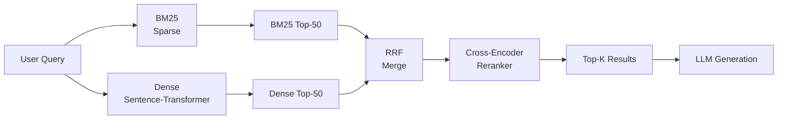

# البحث الهجين (Hybrid Search)

> الاسترجاع الكثيف (dense) يُفوّت الكلمات المفتاحية الدقيقة. وBM25 يُفوّت المعنى الدلالي. البحث الهجين يحصل على كليهما مجانًا تقريبًا.

**النوع:** بناء
**اللغات:** Python
**المتطلبات:** الدرس 05 (RAG البسيط)، الدرس 06 (مقاييس الاسترجاع)
**الوقت:** ~60 دقيقة
**المرحلة:** 02 · الاسترجاع و RAG

---

## أهداف التعلّم

- تنفيذ BM25 من الصفر باستخدام فهرس معكوس (inverted index) وصيغة BM25
- تنفيذ الاسترجاع الكثيف باستخدام نموذج sentence-transformer محلّي
- دمج نتائج BM25 والكثيف باستخدام الدمج بالرتبة المعكوسة (Reciprocal Rank Fusion - RRF)
- إضافة مُعيد ترتيب (reranker) من نوع cross-encoder لتقييم أزواج (query, chunk) مباشرة
- قياس التحسّن من كل مكوّن باستخدام المقاييس من الدرس 06

---

## المشكلة

تبني خطّ أنابيب RAG البسيط من الدرس 05. ويعمل جيدًا لمعظم الاستعلامات. ثم يسأل مستخدم: "What does RFC 2616 say about conditional GET requests?" نموذج الـ embedding لم يرَ قطّ RFC 2616 مُشارًا إليه بذلك الاسم بالضبط في بيانات تدريبه. الاسترجاع الكثيف يفشل. الـ chunk ذو الصلة موجود في مجموعتك لكن تشابه جيب التمام بين "RFC 2616" ونصّ المستند منخفض جدًا لإبرازه. النظام يُرجع بصمت chunks غير مرتبطة. ويحصل المستخدم على إجابة خاطئة.

وضع الفشل هذا منهجي، لا عشوائي. نماذج الـ embedding مُدرّبة على مجموعات عامة كبيرة. تطوّر فهمًا دلاليًا قويًا لكن استرجاعًا ضعيفًا للمطابقة الدقيقة. أي مصطلح نادر أو تقني أو خاص بالمجال أو غائب عن توزيع التدريب سيكون ممثَّلًا بشكل سيّئ في فضاء الـ embedding. أكواد المنتجات (SKUs)، وأرقام القضايا القانونية، وأسماء الأدوية الطبية بمعرّفات عددية، وأسماء دوال الكود، ورايات سطر الأوامر: كلها تقع خارج المنطقة المريحة للاسترجاع الكثيف.

الحل معروف منذ سبعينيات القرن الماضي في استرجاع المعلومات: المطابقة المتفرّقة للمصطلحات (sparse term-matching). BM25 لا يفهم المعنى لكنه بارع جدًا في إيجاد الكلمات الدقيقة. جمع BM25 والاسترجاع الكثيف في خطّ أنابيب من مرحلتين: الاسترجاع على نطاق واسع بكليهما، ودمج القوائم المرتّبة، ثم إعادة ترتيب أفضل المرشّحين بمُقيِّم دقة: يسدّ معظم فجوة الفشل بتكلفة زمن استجابة متواضعة.

---

## المفهوم

### لماذا تفشل كل طريقة بمفردها

**الاسترجاع الكثيف يفشل حين:**
- يحوي الاستعلام مصطلحات نادرة أو خارج المفردات (أكواد المنتجات، أسماء العلم، المصطلحات التقنية)
- تختلف الكلمة الدقيقة في المستند عن الكلمة في الاستعلام (لا إشارة تدريب لتلك إعادة الصياغة)
- تكون الاستعلامات قصيرة جدًا ومحدّدة (سياق دلالي أقل لتحويله إلى embedding)

**BM25 يفشل حين:**
- يستخدم الاستعلام مفردات مختلفة عن المستند (إعادة صياغة، مرادف)
- يصف المستخدم مفهومًا بدلًا من استخدام مصطلح المجال
- تشابه دلالي بلا تداخل لفظي (سؤال "what makes bread rise" بينما المستند يقول "yeast produces carbon dioxide")

البحث الهجين يفوز حين تكمّل أوضاع الفشل بعضها، وهذا غالب الوقت.

### BM25: ما الذي يفعله فعلًا

BM25 نموذج احتمالي لتكرار المصطلحات. يقيّم مستندًا بناءً على عدد مرات ظهور مصطلحات الاستعلام فيه، مع تعديلين رئيسيين:

1. **إشباع TF** (المعامل k1): لتكرار المصطلح عوائد متناقصة. كلمة تظهر 10 مرات ليست أكثر صلة بـ 10 أضعاف من ظهورها مرة واحدة. المعامل k1 يتحكّم في موضع تسطّح المنحنى.

2. **تطبيع الطول** (المعامل b): المستندات الطويلة لها كلمات أكثر وبالتالي تكرار مصطلحات خام أعلى. المعامل b يُطبّع الدرجة حسب طول المستند نسبةً لمتوسّط طول المجموعة.

```
BM25(q, d) = Σ IDF(t) × [ tf(t,d) × (k1+1) ] / [ tf(t,d) + k1×(1 - b + b×dl/avgdl) ]

where:
  IDF(t) = log( (N - df(t) + 0.5) / (df(t) + 0.5) + 1 )
  tf(t,d) = term frequency of t in document d
  dl = length of document d (words)
  avgdl = average document length across corpus
  N = total number of documents
  df(t) = number of documents containing term t
  k1 = [1.2, 2.0], default 1.5 (TF saturation)
  b  = [0, 1], default 0.75 (length normalization)
```

IDF أعلى يعني أن المصطلح نادر عبر المجموعة (أكثر إفادة). وk1 أعلى يعني أن TF يهمّ أكثر قبل الإشباع. وb أعلى يعني تطبيع طول أكثر.

### الدمج بالرتبة المعكوسة (RRF)

المشكلة في دمج درجات BM25 والكثيف أن مقاييسهما غير متوافقة. درجات BM25 أعداد صحيحة غير محدودة. وتشابهات جيب التمام 0–1. لا يمكنك جمعها دون تطبيع.

RRF يتجاوز هذا كليًا بتجاهل الدرجات واستخدام الرتب فقط:

```
RRF_score(doc) = Σ  1 / (k + rank_i(doc))
               for each ranked list i

where k = 60 (standard constant, prevents top-ranked docs from dominating)
```

مستند رتبته 3 في BM25 ورتبته 5 في الكثيف يحصل على:
```
RRF = 1/(60+3) + 1/(60+5) = 0.01587 + 0.01538 = 0.03125
```

ومستند مرتّب أولًا في كليهما يحصل على:
```
RRF = 1/(60+1) + 1/(60+1) = 0.03279 + 0.03279 = 0.06557
```

RRF متين تجاه الدرجات الشاذّة ويعمل حتى حين تكون لإحدى الطريقتين ثقة أعلى بكثير من الأخرى.

### خطّ الأنابيب من مرحلتين



**المرحلة 1 (الاسترجاع):** ألقِ شبكة واسعة. احصل على أعلى 50 مرشّحًا من كلٍّ من BM25 والكثيف. ادمج بـ RRF. الهدف استرجاع عالٍ: إيجاد كل المستندات ذات الصلة حتى بتكلفة بعض الدقة.

**المرحلة 2 (إعادة الترتيب):** مرّر أعلى 20 مرشّحًا من RRF عبر cross-encoder. الـ cross-encoder يرى زوج (query, chunk) كاملًا ويُنتج درجة صلة دقيقة. أعِد الفرز حسب درجة الـ cross-encoder. أرجِع أعلى 5 للـ LLM.

هذا الخطّ أغلى بكثير من الاسترجاع الكثيف البسيط لكنه أفضل بشكل كبير على الاستعلامات التي يُفوّتها الاسترجاع الكثيف: والتي تميل لأن تكون الاستعلامات عالية المخاطر (أسماء منتجات دقيقة، بنود محدّدة، تفاصيل تقنية دقيقة).

### Cross-Encoder مقابل Bi-Encoder

| | Bi-Encoder (الكثيف) | Cross-Encoder |
|---|---|---|
| **كيف يعمل** | يرمّز الاستعلام والمستند منفصلين، ثم يحسب التشابه | يرمّز (query, doc) معًا في مرور واحد |
| **زمن الاستجابة** | سريع: يرمّز مرة، يقارن أي استعلام | بطيء: يجب إعادة التشغيل لكل زوج (query, doc) |
| **الجودة** | مطابقة دلالية جيدة | دقة أفضل، يرى التفاعل بين المصطلحات |
| **استخدمه لـ** | الاسترجاع (المرور الأول، كل المستندات) | إعادة الترتيب (المرور الثاني، أفضل M مرشّح فقط) |
| **يتوسّع إلى** | ملايين المستندات | 20–100 مرشّح لكل استعلام |

الـ cross-encoder لا يتوسّع لاسترجاع المجموعة الكاملة لأنك لا تستطيع حساب الـ embeddings مسبقًا: كل استعلام يُغيّر الحساب. لكن لإعادة ترتيب 20 مرشّحًا، يكون زمن الاستجابة الإضافي عادة 50–200ms، وهو مقبول.

---

## البناء

### الخطوة 1: الاعتماديات والإعداد

```python
# pip install sentence-transformers rank-bm25
# No OpenAI API required: runs entirely locally.

import math
import re
from collections import defaultdict
from typing import Any

from sentence_transformers import SentenceTransformer, CrossEncoder
import numpy as np
```

`rank-bm25` يمنحنا تنفيذ BM25 بجودة إنتاجية. نبنيه أيضًا من الصفر لفهم الآلية. و`sentence-transformers` يوفّر كلًّا من الـ bi-encoder للاسترجاع الكثيف والـ cross-encoder لإعادة الترتيب.

### الخطوة 2: مجموعة عيّنة

```python
CORPUS = [
    {"id": "doc_1", "text": "BM25 is a probabilistic ranking function used in information retrieval systems."},
    {"id": "doc_2", "text": "Dense retrieval uses neural embeddings to find semantically similar documents."},
    {"id": "doc_3", "text": "Reciprocal rank fusion combines multiple ranked lists without score normalization."},
    {"id": "doc_4", "text": "The transformer architecture introduced attention mechanisms for sequence modeling."},
    {"id": "doc_5", "text": "Vector databases store high-dimensional embeddings for approximate nearest neighbor search."},
    {"id": "doc_6", "text": "TF-IDF weights terms by frequency in the document and rarity across the corpus."},
    {"id": "doc_7", "text": "Cross-encoders compute relevance scores for query-document pairs jointly."},
    {"id": "doc_8", "text": "BM25 parameters k1 and b control term frequency saturation and length normalization."},
    {"id": "doc_9", "text": "Semantic search understands meaning and paraphrase beyond exact keyword matching."},
    {"id": "doc_10", "text": "Hybrid search combines sparse and dense retrieval to improve recall and precision."},
    {"id": "doc_11", "text": "Inverted indexes map terms to the documents that contain them for fast lookup."},
    {"id": "doc_12", "text": "Sentence transformers fine-tune BERT-like models for semantic similarity tasks."},
    {"id": "doc_13", "text": "The k1 parameter in BM25 defaults to 1.5; increasing it rewards higher term frequency."},
    {"id": "doc_14", "text": "pgvector extends PostgreSQL with a vector similarity search column type."},
    {"id": "doc_15", "text": "Reranking improves precision by scoring the top-M candidates with a cross-encoder."},
]
```

### الخطوة 3: BM25 من الصفر

```python
def tokenize(text: str) -> list[str]:
    """Simple whitespace + lowercase tokenizer. Replace with domain-specific one."""
    text = text.lower()
    text = re.sub(r"[^\w\s]", " ", text)
    return text.split()


class BM25Index:
    """
    BM25 sparse retrieval index built from scratch.

    The index is an inverted index: for each term, we store which documents
    contain it and how many times (term frequency).

    Formula:
        score(q, d) = Σ IDF(t) × tf_normalized(t, d)
        IDF(t) = log((N - df(t) + 0.5) / (df(t) + 0.5) + 1)
        tf_normalized(t, d) = tf(t,d) × (k1+1) / (tf(t,d) + k1 × (1 - b + b × dl/avgdl))
    """

    def __init__(self, k1: float = 1.5, b: float = 0.75):
        self.k1 = k1          # TF saturation parameter [1.2, 2.0]
        self.b = b             # Length normalization parameter [0, 1]
        self.doc_ids: list[str] = []
        self.doc_lengths: list[int] = []
        self.avgdl: float = 0.0
        self.N: int = 0
        # inverted_index[term] = {doc_index: term_freq}
        self.inverted_index: dict[str, dict[int, int]] = defaultdict(dict)
        self.df: dict[str, int] = {}    # document frequency per term

    def build(self, documents: list[dict]) -> None:
        """
        Build the inverted index from a list of {id, text} documents.
        Call this once; it runs in O(corpus_size).
        """
        self.doc_ids = [doc["id"] for doc in documents]
        tokenized = [tokenize(doc["text"]) for doc in documents]
        self.doc_lengths = [len(tokens) for tokens in tokenized]
        self.N = len(documents)
        self.avgdl = sum(self.doc_lengths) / self.N if self.N > 0 else 1.0

        for doc_idx, tokens in enumerate(tokenized):
            term_counts: dict[str, int] = defaultdict(int)
            for token in tokens:
                term_counts[token] += 1
            for term, count in term_counts.items():
                self.inverted_index[term][doc_idx] = count

        # Document frequency: number of docs containing each term
        self.df = {term: len(postings) for term, postings in self.inverted_index.items()}

        print(f"BM25 index built: {self.N} docs, {len(self.inverted_index):,} unique terms")

    def _idf(self, term: str) -> float:
        """Robertson-Sparck Jones IDF formula (BM25 variant)."""
        df_t = self.df.get(term, 0)
        return math.log((self.N - df_t + 0.5) / (df_t + 0.5) + 1)

    def score(self, query: str, doc_idx: int) -> float:
        """
        BM25 score for a single (query, document) pair.
        Sums across all query terms.
        """
        terms = tokenize(query)
        dl = self.doc_lengths[doc_idx]
        total = 0.0
        for term in set(terms):  # deduplicate query terms
            tf = self.inverted_index.get(term, {}).get(doc_idx, 0)
            if tf == 0:
                continue
            idf = self._idf(term)
            # BM25 TF normalization
            tf_norm = (tf * (self.k1 + 1)) / (
                tf + self.k1 * (1 - self.b + self.b * dl / self.avgdl)
            )
            total += idf * tf_norm
        return total

    def search(self, query: str, top_k: int = 20) -> list[dict]:
        """
        Retrieve top_k documents for the query.
        Only scores documents that contain at least one query term.
        Returns list of {id, text, score} sorted by score descending.
        """
        terms = tokenize(query)
        # Candidate docs: union of docs containing any query term
        candidate_indices: set[int] = set()
        for term in terms:
            candidate_indices.update(self.inverted_index.get(term, {}).keys())

        if not candidate_indices:
            return []

        scored = [
            {"doc_idx": idx, "score": self.score(query, idx)}
            for idx in candidate_indices
        ]
        scored.sort(key=lambda x: x["score"], reverse=True)

        return [
            {
                "id": self.doc_ids[item["doc_idx"]],
                "score": item["score"],
                "rank": rank + 1,
            }
            for rank, item in enumerate(scored[:top_k])
        ]
```

### الخطوة 4: الاسترجاع الكثيف بـ Sentence-Transformers

```python
class DenseIndex:
    """
    Dense retrieval using a local sentence-transformer bi-encoder.
    Uses cosine similarity for matching.
    """

    EMBED_MODEL = "all-MiniLM-L6-v2"  # 80MB download, fast on CPU, good quality

    def __init__(self):
        print(f"Loading embedding model: {self.EMBED_MODEL}")
        self.model = SentenceTransformer(self.EMBED_MODEL)
        self.doc_ids: list[str] = []
        self.embeddings: np.ndarray | None = None

    def build(self, documents: list[dict]) -> None:
        """Embed all documents in a single batch."""
        self.doc_ids = [doc["id"] for doc in documents]
        texts = [doc["text"] for doc in documents]
        print(f"Embedding {len(texts)} documents...")
        self.embeddings = self.model.encode(
            texts,
            convert_to_numpy=True,
            normalize_embeddings=True,  # cosine similarity = dot product after L2 norm
            show_progress_bar=True,
        )
        print(f"Dense index built: {len(self.doc_ids)} docs, "
              f"embedding dim={self.embeddings.shape[1]}")

    def search(self, query: str, top_k: int = 20) -> list[dict]:
        """
        Embed the query and return top_k most similar documents.
        normalize_embeddings=True means we can use dot product for cosine similarity.
        """
        if self.embeddings is None:
            raise RuntimeError("Call build() first")

        query_vec = self.model.encode(
            query, convert_to_numpy=True, normalize_embeddings=True
        )
        # Dot product of normalized vectors = cosine similarity
        scores = np.dot(self.embeddings, query_vec)

        # Get top-K indices (not fully sorted for efficiency)
        top_indices = np.argpartition(scores, -min(top_k, len(scores)))[-top_k:]
        top_indices = top_indices[np.argsort(scores[top_indices])[::-1]]

        return [
            {
                "id": self.doc_ids[idx],
                "score": float(scores[idx]),
                "rank": rank + 1,
            }
            for rank, idx in enumerate(top_indices)
        ]
```

### الخطوة 5: الدمج بالرتبة المعكوسة

```python
def reciprocal_rank_fusion(
    ranked_lists: list[list[dict]],
    k: int = 60,
) -> list[dict]:
    """
    Merge multiple ranked lists using Reciprocal Rank Fusion.

    RRF score for document d = Σ  1 / (k + rank_i(d))
                                 for each list i that contains d

    k=60 is the standard constant. Increasing k reduces the advantage
    of top-ranked documents; decreasing it amplifies it.

    Why RRF vs score normalization:
    - BM25 and cosine scores are on different scales (unbounded vs 0–1)
    - Score normalization requires knowing the min/max, which changes per query
    - RRF only uses ranks: completely scale-agnostic
    - Empirically matches or beats score-normalization methods on most benchmarks
    """
    rrf_scores: dict[str, float] = defaultdict(float)

    for ranked_list in ranked_lists:
        for item in ranked_list:
            doc_id = item["id"]
            rank = item["rank"]  # 1-based
            rrf_scores[doc_id] += 1.0 / (k + rank)

    # Sort by RRF score descending
    merged = sorted(rrf_scores.items(), key=lambda x: x[1], reverse=True)
    return [
        {"id": doc_id, "rrf_score": score, "rank": rank + 1}
        for rank, (doc_id, score) in enumerate(merged)
    ]
```

### الخطوة 6: إعادة الترتيب بـ Cross-Encoder

```python
class CrossEncoderReranker:
    """
    Cross-encoder reranker. Takes top-M candidates from retrieval and
    rescores each (query, document) pair with a cross-encoder model.

    The cross-encoder sees query and document together in one forward pass,
    allowing it to model their interaction (not just similarity).
    This is significantly more accurate than cosine similarity but
    much slower: use only on the top candidates.

    Model: ms-marco-MiniLM-L-6-v2
      - Fine-tuned on MS MARCO passage retrieval
      - ~22MB, fast on CPU
      - Scores in range [-inf, +inf], higher = more relevant
    """

    RERANK_MODEL = "cross-encoder/ms-marco-MiniLM-L-6-v2"

    def __init__(self):
        print(f"Loading cross-encoder: {self.RERANK_MODEL}")
        self.model = CrossEncoder(self.RERANK_MODEL)

    def rerank(
        self,
        query: str,
        candidates: list[dict],
        corpus: dict[str, str],
        top_k: int = 5,
    ) -> list[dict]:
        """
        Rerank candidate documents by scoring (query, doc_text) pairs.
        corpus: {doc_id: doc_text} lookup dict.
        Returns top_k results sorted by cross-encoder score.
        """
        if not candidates:
            return []

        # Build (query, document_text) pairs for all candidates
        pairs = [
            (query, corpus[candidate["id"]])
            for candidate in candidates
            if candidate["id"] in corpus
        ]
        valid_candidates = [c for c in candidates if c["id"] in corpus]

        if not pairs:
            return candidates[:top_k]

        scores = self.model.predict(pairs)

        # Attach cross-encoder score to each candidate
        reranked = [
            {**candidate, "cross_encoder_score": float(score)}
            for candidate, score in zip(valid_candidates, scores)
        ]
        reranked.sort(key=lambda x: x["cross_encoder_score"], reverse=True)

        return reranked[:top_k]
```

### الخطوة 7: خطّ الأنابيب الهجين الكامل

```python
class HybridSearchPipeline:
    """
    Full two-stage hybrid search pipeline:
      Stage 1: Retrieve top-M candidates via BM25 + dense + RRF
      Stage 2: Rerank top-M with cross-encoder → return top-K

    Configuration:
      retrieve_k: number of candidates from each method (stage 1)
      rerank_k: number of candidates to rerank (should be ≤ retrieve_k)
      final_k: final results returned (should be ≤ rerank_k)
    """

    def __init__(
        self,
        documents: list[dict],
        retrieve_k: int = 20,
        rerank_k: int = 10,
        final_k: int = 5,
    ):
        self.corpus = {doc["id"]: doc["text"] for doc in documents}
        self.retrieve_k = retrieve_k
        self.rerank_k = rerank_k
        self.final_k = final_k

        # Build indexes
        self.bm25 = BM25Index()
        self.bm25.build(documents)

        self.dense = DenseIndex()
        self.dense.build(documents)

        self.reranker = CrossEncoderReranker()

    def search(
        self,
        query: str,
        use_reranker: bool = True,
        verbose: bool = True,
    ) -> list[dict]:
        """
        Full hybrid search: BM25 + dense → RRF → (optional) cross-encoder rerank.
        Returns final_k results with debug information.
        """
        if verbose:
            print(f"\nQuery: '{query}'")

        # Stage 1a: BM25 retrieval
        bm25_results = self.bm25.search(query, top_k=self.retrieve_k)
        if verbose:
            print(f"  BM25 top-3: {[(r['id'], f'{r[\"score\"]:.2f}') for r in bm25_results[:3]]}")

        # Stage 1b: Dense retrieval
        dense_results = self.dense.search(query, top_k=self.retrieve_k)
        if verbose:
            print(f"  Dense top-3: {[(r['id'], f'{r[\"score\"]:.3f}') for r in dense_results[:3]]}")

        # Stage 1c: RRF merge
        merged = reciprocal_rank_fusion([bm25_results, dense_results])
        if verbose:
            print(f"  RRF top-3: {[(r['id'], f'{r[\"rrf_score\"]:.4f}') for r in merged[:3]]}")

        # Stage 2: Cross-encoder reranking (optional)
        candidates = merged[:self.rerank_k]

        if use_reranker:
            final = self.reranker.rerank(query, candidates, self.corpus, top_k=self.final_k)
            if verbose:
                print(f"  Reranked top-3: {[(r['id'], f'{r[\"cross_encoder_score\"]:.2f}') for r in final[:3]]}")
        else:
            final = [
                {**c, "text": self.corpus.get(c["id"], "")}
                for c in candidates[:self.final_k]
            ]

        # Attach text to final results
        for result in final:
            result["text"] = self.corpus.get(result["id"], "")

        return final
```

### الخطوة 8: تجربة المقارنة

```python
def compare_methods(
    pipeline: HybridSearchPipeline,
    queries: list[str],
) -> None:
    """
    Compare BM25-only, dense-only, and hybrid+reranking on the same queries.
    Helps you understand where each method wins.
    """
    print("\n" + "=" * 70)
    print("METHOD COMPARISON")
    print("=" * 70)

    for query in queries:
        print(f"\nQuery: '{query}'")
        print("-" * 60)

        # BM25 only
        bm25_only = pipeline.bm25.search(query, top_k=3)
        print(f"  BM25 only:    {[r['id'] for r in bm25_only]}")

        # Dense only
        dense_only = pipeline.dense.search(query, top_k=3)
        print(f"  Dense only:   {[r['id'] for r in dense_only]}")

        # Hybrid (no reranker)
        merged = reciprocal_rank_fusion([
            pipeline.bm25.search(query, top_k=20),
            pipeline.dense.search(query, top_k=20),
        ])
        print(f"  Hybrid (RRF): {[r['id'] for r in merged[:3]]}")

        # Hybrid + reranker
        final = pipeline.search(query, use_reranker=True, verbose=False)
        print(f"  Hybrid+CE:    {[r['id'] for r in final[:3]]}")
```

### الخطوة 9: نقطة الدخول الرئيسية

```python
if __name__ == "__main__":
    print("Building hybrid search pipeline...")
    pipeline = HybridSearchPipeline(CORPUS, retrieve_k=20, rerank_k=10, final_k=3)

    # Queries that test different failure modes
    test_queries = [
        # Semantic query: dense should win
        "How do neural networks understand the meaning of text?",
        # Exact-match query: BM25 should win
        "BM25 k1 parameter",
        # Mixed: hybrid should win
        "combining sparse and dense retrieval",
        # Very specific term: BM25 advantage
        "RRF formula",
    ]

    compare_methods(pipeline, test_queries)

    print("\n\n" + "=" * 70)
    print("FULL PIPELINE DEMO (hybrid + reranking)")
    print("=" * 70)

    for query in test_queries[:2]:
        results = pipeline.search(query, use_reranker=True)
        print(f"\nTop results for: '{query}'")
        for i, r in enumerate(results, 1):
            score = r.get("cross_encoder_score", r.get("rrf_score", 0))
            print(f"  [{i}] {r['id']} (score={score:.3f})")
            print(f"       {r['text'][:100]}...")
```

> **اختبار من الواقع:** عالم بيانات في فريقك يقول: "بحثنا الدلالي كان يشتغل تمام لمعظم الاستعلامات. أي فشل محدّد عندنا الآن يبرّر إضافة فهرس BM25 كامل، وفهرس معكوس، ومنطق دمج RRF، وعبء الصيانة الإضافي؟ تقدر تورّيني استعلامًا حقيقيًا كان معطوبًا قبل ويشتغل الآن؟" كيف تجيب، وكيف تجد تلك الاستعلامات إن لم تكن لديك بعد؟

---

## الاستخدام

في الإنتاج، يوفّر Qdrant البحث الهجين أصليًا:

```python
from qdrant_client import QdrantClient
from qdrant_client.models import SparseVector, NamedSparseVector, NamedVector, Query

# Qdrant hybrid search: BM25 sparse + dense, fused server-side
results = client.query_points(
    collection_name="my_collection",
    prefetch=[
        {"using": "sparse", "query": sparse_vector, "limit": 50},
        {"using": "dense", "query": dense_vector, "limit": 50},
    ],
    query=Query(fusion="rrf"),
    limit=5,
)
```

يتولّى Qdrant الفهرس المعكوس، وتقييم BM25، ودمج RRF على جانب الخادم. يرسل كودك شعاعًا متفرّقًا (sparse، من نموذج SPLADE أو BM25) وشعاعًا كثيفًا، ويستعيد نتائج مدموجة. هذه هي النسخة الإنتاجية لما بنيناه من الصفر.

أما لمُعيد الترتيب من نوع cross-encoder، فإن Cohere Rerank API هو النسخة المُدارة:

```python
import cohere
co = cohere.Client("YOUR_API_KEY")
reranked = co.rerank(
    query=query,
    documents=[r["text"] for r in candidates],
    top_n=5,
    model="rerank-english-v3.0",
)
```

> **نقلة في المنظور:** مدير الهندسة لديك يشير إلى أن مُعيد الترتيب من نوع cross-encoder يضيف نحو 200ms لكل استعلام. "كيف نقرّر ما إذا كان تحسّن الجودة هذا يستحقّ ضربة زمن الاستجابة؟ ماذا ستقيس، وأي نتيجة ستجعلك تُطفئه؟" استعرض المفاضلة بشكل ملموس: ماذا تكلّف 200ms مستخدميك، وماذا يكلّفهم تخطّي مُعيد الترتيب؟

---

## التسليم

مخرَج هذا الدرس هو المهارة في `outputs/skill-hybrid-search-builder.md`. ترشد إلى اختيار التهيئة الهجينة الصحيحة لحالة استخدام محدّدة: متى يساعد المتفرّق أكثر، ومتى يكفي الكثيف، وما المعاملات التي تضبطها.

الأثر القابل للتشغيل هو `code/main.py`. شغّله بـ:

```bash
pip install sentence-transformers rank-bm25
python main.py
```

سيبني خطّ الأنابيب الكامل (BM25 + الكثيف + RRF + cross-encoder) محليًا، ويشغّل استعلامات مقارنة، ويُظهر أين تفوز كل طريقة.

---

## التقييم

**الفحص 1: هل يتفوّق الهجين فعلًا على الطريقة الواحدة على مجموعتك؟**
شغّل مقاييس الاسترجاع من الدرس 06 على مجموعة تقييمك بثلاث تهيئات: BM25 فقط، الكثيف فقط، والهجين. احسب precision@5 وrecall@5 وMRR لكلٍّ. سجّل الأرقام. ينبغي أن يُحسّن الهجين الاسترجاع على أيّ طريقة واحدة. إن لم يفعل، فقد تكون مجموعتك تحوي إعادة صياغة كثيرة جدًا (الكثيف يفوز) أو مطابقة دقيقة كثيرة جدًا (BM25 يفوز) لتستفيد من الدمج.

**الفحص 2: هل يُحسّن مُعيد الترتيب cross-encoder قيمة nDCG؟**
شغّل nDCG@5 قبل وبعد إضافة الـ cross-encoder. إن تحسّن nDCG بأكثر من 0.05، فإن مُعيد الترتيب يستحقّ تكلفة زمن استجابته. قِس زمن الاستجابة: إعادة ترتيب 10 مرشّحين على CPU تستغرق 50–200ms حسب النموذج والعتاد. للاستعلامات التي يتوقّع فيها المستخدم استجابة فورية، يهمّ هذا.

**الفحص 3: متى يضرّ الهجين؟**
شغّل طريقة المقارنة على 20 استعلامًا تعرف إجابتها الصحيحة. عُدّ: (أ) الاستعلامات التي يكون فيها الهجين أفضل من كلتا الطريقتين الواحدتين، (ب) الاستعلامات التي يطابق فيها الهجين أفضل طريقة واحدة، (ج) الاستعلامات التي يكون فيها الهجين أسوأ من أفضل طريقة واحدة. الفئة (ج) تحدّد الحالات التي تكون فيها إشارة إحدى الطريقتين قوية جدًا بحيث تُخفّفها إضافة الأخرى. إن تجاوزت الفئة (ج) 20%، اضبط ثابت RRF k أو فكّر في الدمج المُرجّح.

---

## التمارين

1. **[سهل]** عدّل `BM25Index` لتجربة k1=1.2 وk1=2.0 مقابل الاستعلامات العيّنة. أي إعداد يساعد للاستعلامات القصيرة؟ وأيّها يساعد للاستعلامات الطويلة؟ انظر كيف يتغيّر منحنى إشباع TF.

2. **[متوسط]** نفّذ الدمج المبني على الدرجات كبديل لـ RRF. طبّع درجات BM25 إلى [0,1] باستخدام تحجيم min-max لكل استعلام، ثم احسب متوسّطًا مرجّحًا: `0.4 × bm25_norm + 0.6 × dense_score`. قارن مقابل RRF على الاستعلامات العيّنة. أيّهما أكثر متانة حين تُرجع إحدى الطريقتين درجات منخفضة جدًا؟

3. **[صعب]** استبدل `rank-bm25` بصنف `BM25Index` لديك وادمج كليهما في `HybridSearchPipeline`. ثم أضف مجموعة تقييم ذهبية (اكتب 10 استعلامات بمعرّفات مستندات ذات صلة من المجموعة العيّنة) واحسب precision@5 وrecall@5 وnDCG@5 لـ: BM25 فقط، الكثيف فقط، RRF، وRRF+cross-encoder. اعرض النتائج كجدول مقارنة.

---

## المصطلحات الأساسية

| المصطلح | ما يقوله الناس | ما يعنيه فعلًا |
|------|----------------|----------------------|
| Sparse retrieval | "بحث الكلمات المفتاحية"، "البحث اللفظي"، "BM25" | المطابقة المبنية على تداخل المصطلحات الدقيق؛ سريع، قابل للتفسير، يفشل على إعادة الصياغة |
| Dense retrieval | "البحث الدلالي"، "البحث الشعاعي"، "بحث الـ embedding" | المطابقة المبنية على القرب الشعاعي المُتعلَّم؛ يتعامل مع إعادة الصياغة، يفشل على المصطلحات النادرة/خارج المفردات |
| Inverted index | "فهرس الكلمات المفتاحية" | بنية بيانات تربط كل مصطلح بالمستندات التي تحتويه؛ أساس كل محرّكات البحث |
| BM25 | "Okapi BM25"، "الترتيب الاحتمالي" | صيغة استرجاع متفرّق محدّدة تجمع TF وIDF وتطبيع الطول |
| k1 (BM25) | "إشباع TF" | يتحكّم في كم يهمّ تكرار المصطلح الخام قبل تناقص العوائد (الافتراضي 1.5) |
| b (BM25) | "تطبيع الطول" | يتحكّم في كم تُعاقَب المستندات الأطول (الافتراضي 0.75) |
| RRF | "الدمج بالرتبة المعكوسة" | طريقة لدمج القوائم المرتّبة باستخدام مواضع الرتب فقط، لا الدرجات؛ متينة تجاه فروق المقياس |
| Cross-encoder | "مُعيد الترتيب"، "bi-encoder + cross-encoder" | نموذج يقيّم أزواج (query, document) معًا؛ أدقّ من جيب تمام الـ bi-encoder لكنه لا يتوسّع للمجموعة الكاملة |
| Two-stage retrieval | "الاسترجاع وإعادة الترتيب"، "الاسترجاع المتسلسل" | المرحلة الأولى تُلقي شبكة واسعة (استرجاع عالٍ، دقة أقل)؛ المرحلة الثانية تُعيد الترتيب للدقة |

---

## قراءات إضافية

- [BM25 Paper](https://dl.acm.org/doi/10.1145/215206.215559): Robertson وآخرون، "Okapi at TREC-3"؛ مواصفة BM25 الأصلية من 1994 التي لا تزال تُشغّل معظم بحث الإنتاج
- [Reciprocal Rank Fusion Paper](https://plg.uwaterloo.ca/~gvcormac/cormacksigir09-rrf.pdf): Cormack وClarke وBuettcher (2009)؛ الورقة المكوّنة من صفحتين التي قدّمت RRF؛ اقرأها كاملة
- [BEIR Benchmark](https://arxiv.org/abs/2104.08663): التقييم المرجعي الذي يُظهر أين يتفوّق الاسترجاع الكثيف على BM25 والعكس عبر 18 مجموعة بيانات
- [Qdrant Hybrid Search](https://qdrant.tech/articles/hybrid-search/): تنفيذ إنتاجي لدمج الكثيف + المتفرّق مع SPLADE
- [Cross-Encoder Models on Hugging Face](https://huggingface.co/cross-encoder): سلسلة ms-marco المستخدمة في هذا الدرس؛ تشرح ما هو MS MARCO وكيف دُرّبت النماذج
- [ColBERT: Efficient and Effective Passage Search](https://arxiv.org/abs/2004.12832): نموذج تفاعل متأخّر يقع بين الـ bi-encoder والـ cross-encoder؛ يستحقّ الفهم قبل بناء إعادة ترتيب إنتاجية
