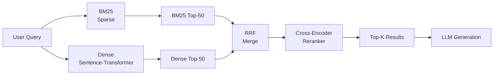

# Hybrid Search

> Dense retrieval misses exact keywords. BM25 misses semantic meaning. Hybrid search gets both for nearly free.

**Type:** Build
**Languages:** Python
**Prerequisites:** Lesson 05 (naive RAG), Lesson 06 (retrieval metrics)
**Time:** ~60 minutes
**Phase:** 02 · Retrieval & RAG

---

## Learning Objectives

- Implement BM25 from scratch using an inverted index and the BM25 formula
- Implement dense retrieval using a local sentence-transformer model
- Merge BM25 and dense results using Reciprocal Rank Fusion (RRF)
- Add a cross-encoder reranker to score (query, chunk) pairs directly
- Measure the improvement from each component using the metrics from Lesson 06

---

## The Problem

You build the naive RAG pipeline from Lesson 05. It works well for most queries. Then a user asks: "What does RFC 2616 say about conditional GET requests?" The embedding model has never seen RFC 2616 referred to by that exact name in its training data. Dense retrieval fails. The relevant chunk is in your corpus but the cosine similarity between "RFC 2616" and the document text is too low to surface it. The system silently returns unrelated chunks. The user gets a wrong answer.

This failure mode is systematic, not random. Embedding models are trained on large general-purpose corpora. They develop strong semantic understanding but weak exact-match recall. Any term that is rare, technical, domain-specific, or absent from the training distribution will be poorly represented in the embedding space. Product SKUs, legal case numbers, medical drug names with numerical identifiers, code function names, command-line flags: these all fall outside the comfortable zone of dense retrieval.

The fix has been known since the 1970s in information retrieval: sparse term-matching. BM25 does not understand meaning but it is very good at finding exact words. Combining BM25 and dense retrieval in a two-stage pipeline: retrieve broadly with both, merge the ranked lists, then rerank the top candidates with a precision scorer: closes most of the failure gap at a modest latency cost.

---

## The Concept

### Why Each Method Fails Alone

**Dense retrieval fails when:**
- The query contains rare or out-of-vocabulary terms (product codes, proper names, technical jargon)
- The exact word in the document differs from the word in the query (no training signal for that paraphrase)
- Queries are very short and specific (less semantic context to embed)

**BM25 fails when:**
- The query uses different vocabulary than the document (paraphrase, synonym)
- The user describes a concept rather than using the domain term
- Semantic similarity without lexical overlap (asking "what makes bread rise" when the document says "yeast produces carbon dioxide")

Hybrid search wins when the failure modes complement each other, which is most of the time.

### BM25: What It Actually Does

BM25 is a probabilistic term-frequency model. It scores a document based on how often query terms appear in it, with two key adjustments:

1. **TF saturation** (k1 parameter): Term frequency has diminishing returns. A word appearing 10 times is not 10x more relevant than appearing once. The k1 parameter controls where the curve flattens.

2. **Length normalization** (b parameter): Long documents have more words and thus higher raw term frequency. The b parameter normalizes score by document length relative to corpus average length.

```
BM25(q, d) = Σ IDF(t) × [ tf(t,d) × (k1+1) ] / [ tf(t,d) + k1×(1 - b + b×dl/avgdl) ]

where:
  IDF(t) = log( (N - df(t) + 0.5) / (df(t) + 0.5) + 1 )
  tf(t,d) = term frequency of t in document d
  dl = length of document d (words)
  avgdl = average document length across corpus
  N = total number of documents
  df(t) = number of documents containing term t
  k1 = [1.2, 2.0], default 1.5 (TF saturation)
  b  = [0, 1], default 0.75 (length normalization)
```

Higher IDF means the term is rare across the corpus (more informative). Higher k1 means TF matters more before saturation. Higher b means more length normalization.

### Reciprocal Rank Fusion (RRF)

The problem with merging BM25 and dense scores is that their scales are incompatible. BM25 scores are unbounded integers. Cosine similarities are 0–1. You cannot add them without normalization.

RRF sidesteps this entirely by ignoring scores and only using ranks:

```
RRF_score(doc) = Σ  1 / (k + rank_i(doc))
               for each ranked list i

where k = 60 (standard constant, prevents top-ranked docs from dominating)
```

A document that is rank 3 in BM25 and rank 5 in dense gets:
```
RRF = 1/(60+3) + 1/(60+5) = 0.01587 + 0.01538 = 0.03125
```

A document ranked 1 in both gets:
```
RRF = 1/(60+1) + 1/(60+1) = 0.03279 + 0.03279 = 0.06557
```

RRF is robust to outlier scores and works even when one method has much higher confidence than the other.

### Two-Stage Pipeline



**Stage 1 (Retrieve):** Cast a wide net. Get top-50 candidates from both BM25 and dense. Merge with RRF. The goal is high recall: find all relevant documents even at the cost of some precision.

**Stage 2 (Rerank):** Run the top-20 RRF candidates through a cross-encoder. The cross-encoder sees the full (query, chunk) pair and produces a precise relevance score. Re-sort by cross-encoder score. Return top-5 to the LLM.

This pipeline is significantly more expensive than naive dense retrieval but dramatically better on the queries that dense retrieval misses: which tend to be the high-stakes queries (exact product names, specific clauses, precise technical details).

### Cross-Encoder vs Bi-Encoder

| | Bi-Encoder (dense) | Cross-Encoder |
|---|---|---|
| **How it works** | Encode query and doc separately, then compute similarity | Encode (query, doc) together in one pass |
| **Latency** | Fast: encode once, compare any query | Slow: must re-run for each (query, doc) pair |
| **Quality** | Good semantic match | Better precision, sees interaction between terms |
| **Use for** | Retrieval (first pass, all documents) | Reranking (second pass, top-M candidates only) |
| **Scales to** | Millions of documents | 20–100 candidates per query |

The cross-encoder cannot scale to full-corpus retrieval because you cannot pre-compute embeddings: every query changes the computation. But for reranking 20 candidates, the extra latency is typically 50–200ms, which is acceptable.

---

## Build It

### Step 1: Dependencies and Setup

```python
# pip install sentence-transformers rank-bm25
# No OpenAI API required: runs entirely locally.

import math
import re
from collections import defaultdict
from typing import Any

from sentence_transformers import SentenceTransformer, CrossEncoder
import numpy as np
```

`rank-bm25` gives us a production-grade BM25 implementation. We also build it from scratch to understand the mechanics. `sentence-transformers` provides both the bi-encoder for dense retrieval and the cross-encoder for reranking.

### Step 2: Sample Corpus

```python
CORPUS = [
    {"id": "doc_1", "text": "BM25 is a probabilistic ranking function used in information retrieval systems."},
    {"id": "doc_2", "text": "Dense retrieval uses neural embeddings to find semantically similar documents."},
    {"id": "doc_3", "text": "Reciprocal rank fusion combines multiple ranked lists without score normalization."},
    {"id": "doc_4", "text": "The transformer architecture introduced attention mechanisms for sequence modeling."},
    {"id": "doc_5", "text": "Vector databases store high-dimensional embeddings for approximate nearest neighbor search."},
    {"id": "doc_6", "text": "TF-IDF weights terms by frequency in the document and rarity across the corpus."},
    {"id": "doc_7", "text": "Cross-encoders compute relevance scores for query-document pairs jointly."},
    {"id": "doc_8", "text": "BM25 parameters k1 and b control term frequency saturation and length normalization."},
    {"id": "doc_9", "text": "Semantic search understands meaning and paraphrase beyond exact keyword matching."},
    {"id": "doc_10", "text": "Hybrid search combines sparse and dense retrieval to improve recall and precision."},
    {"id": "doc_11", "text": "Inverted indexes map terms to the documents that contain them for fast lookup."},
    {"id": "doc_12", "text": "Sentence transformers fine-tune BERT-like models for semantic similarity tasks."},
    {"id": "doc_13", "text": "The k1 parameter in BM25 defaults to 1.5; increasing it rewards higher term frequency."},
    {"id": "doc_14", "text": "pgvector extends PostgreSQL with a vector similarity search column type."},
    {"id": "doc_15", "text": "Reranking improves precision by scoring the top-M candidates with a cross-encoder."},
]
```

### Step 3: BM25 from Scratch

```python
def tokenize(text: str) -> list[str]:
    """Simple whitespace + lowercase tokenizer. Replace with domain-specific one."""
    text = text.lower()
    text = re.sub(r"[^\w\s]", " ", text)
    return text.split()


class BM25Index:
    """
    BM25 sparse retrieval index built from scratch.

    The index is an inverted index: for each term, we store which documents
    contain it and how many times (term frequency).

    Formula:
        score(q, d) = Σ IDF(t) × tf_normalized(t, d)
        IDF(t) = log((N - df(t) + 0.5) / (df(t) + 0.5) + 1)
        tf_normalized(t, d) = tf(t,d) × (k1+1) / (tf(t,d) + k1 × (1 - b + b × dl/avgdl))
    """

    def __init__(self, k1: float = 1.5, b: float = 0.75):
        self.k1 = k1          # TF saturation parameter [1.2, 2.0]
        self.b = b             # Length normalization parameter [0, 1]
        self.doc_ids: list[str] = []
        self.doc_lengths: list[int] = []
        self.avgdl: float = 0.0
        self.N: int = 0
        # inverted_index[term] = {doc_index: term_freq}
        self.inverted_index: dict[str, dict[int, int]] = defaultdict(dict)
        self.df: dict[str, int] = {}    # document frequency per term

    def build(self, documents: list[dict]) -> None:
        """
        Build the inverted index from a list of {id, text} documents.
        Call this once; it runs in O(corpus_size).
        """
        self.doc_ids = [doc["id"] for doc in documents]
        tokenized = [tokenize(doc["text"]) for doc in documents]
        self.doc_lengths = [len(tokens) for tokens in tokenized]
        self.N = len(documents)
        self.avgdl = sum(self.doc_lengths) / self.N if self.N > 0 else 1.0

        for doc_idx, tokens in enumerate(tokenized):
            term_counts: dict[str, int] = defaultdict(int)
            for token in tokens:
                term_counts[token] += 1
            for term, count in term_counts.items():
                self.inverted_index[term][doc_idx] = count

        # Document frequency: number of docs containing each term
        self.df = {term: len(postings) for term, postings in self.inverted_index.items()}

        print(f"BM25 index built: {self.N} docs, {len(self.inverted_index):,} unique terms")

    def _idf(self, term: str) -> float:
        """Robertson-Sparck Jones IDF formula (BM25 variant)."""
        df_t = self.df.get(term, 0)
        return math.log((self.N - df_t + 0.5) / (df_t + 0.5) + 1)

    def score(self, query: str, doc_idx: int) -> float:
        """
        BM25 score for a single (query, document) pair.
        Sums across all query terms.
        """
        terms = tokenize(query)
        dl = self.doc_lengths[doc_idx]
        total = 0.0
        for term in set(terms):  # deduplicate query terms
            tf = self.inverted_index.get(term, {}).get(doc_idx, 0)
            if tf == 0:
                continue
            idf = self._idf(term)
            # BM25 TF normalization
            tf_norm = (tf * (self.k1 + 1)) / (
                tf + self.k1 * (1 - self.b + self.b * dl / self.avgdl)
            )
            total += idf * tf_norm
        return total

    def search(self, query: str, top_k: int = 20) -> list[dict]:
        """
        Retrieve top_k documents for the query.
        Only scores documents that contain at least one query term.
        Returns list of {id, text, score} sorted by score descending.
        """
        terms = tokenize(query)
        # Candidate docs: union of docs containing any query term
        candidate_indices: set[int] = set()
        for term in terms:
            candidate_indices.update(self.inverted_index.get(term, {}).keys())

        if not candidate_indices:
            return []

        scored = [
            {"doc_idx": idx, "score": self.score(query, idx)}
            for idx in candidate_indices
        ]
        scored.sort(key=lambda x: x["score"], reverse=True)

        return [
            {
                "id": self.doc_ids[item["doc_idx"]],
                "score": item["score"],
                "rank": rank + 1,
            }
            for rank, item in enumerate(scored[:top_k])
        ]
```

### Step 4: Dense Retrieval with Sentence-Transformers

```python
class DenseIndex:
    """
    Dense retrieval using a local sentence-transformer bi-encoder.
    Uses cosine similarity for matching.
    """

    EMBED_MODEL = "all-MiniLM-L6-v2"  # 80MB download, fast on CPU, good quality

    def __init__(self):
        print(f"Loading embedding model: {self.EMBED_MODEL}")
        self.model = SentenceTransformer(self.EMBED_MODEL)
        self.doc_ids: list[str] = []
        self.embeddings: np.ndarray | None = None

    def build(self, documents: list[dict]) -> None:
        """Embed all documents in a single batch."""
        self.doc_ids = [doc["id"] for doc in documents]
        texts = [doc["text"] for doc in documents]
        print(f"Embedding {len(texts)} documents...")
        self.embeddings = self.model.encode(
            texts,
            convert_to_numpy=True,
            normalize_embeddings=True,  # cosine similarity = dot product after L2 norm
            show_progress_bar=True,
        )
        print(f"Dense index built: {len(self.doc_ids)} docs, "
              f"embedding dim={self.embeddings.shape[1]}")

    def search(self, query: str, top_k: int = 20) -> list[dict]:
        """
        Embed the query and return top_k most similar documents.
        normalize_embeddings=True means we can use dot product for cosine similarity.
        """
        if self.embeddings is None:
            raise RuntimeError("Call build() first")

        query_vec = self.model.encode(
            query, convert_to_numpy=True, normalize_embeddings=True
        )
        # Dot product of normalized vectors = cosine similarity
        scores = np.dot(self.embeddings, query_vec)

        # Get top-K indices (not fully sorted for efficiency)
        top_indices = np.argpartition(scores, -min(top_k, len(scores)))[-top_k:]
        top_indices = top_indices[np.argsort(scores[top_indices])[::-1]]

        return [
            {
                "id": self.doc_ids[idx],
                "score": float(scores[idx]),
                "rank": rank + 1,
            }
            for rank, idx in enumerate(top_indices)
        ]
```

### Step 5: Reciprocal Rank Fusion

```python
def reciprocal_rank_fusion(
    ranked_lists: list[list[dict]],
    k: int = 60,
) -> list[dict]:
    """
    Merge multiple ranked lists using Reciprocal Rank Fusion.

    RRF score for document d = Σ  1 / (k + rank_i(d))
                                 for each list i that contains d

    k=60 is the standard constant. Increasing k reduces the advantage
    of top-ranked documents; decreasing it amplifies it.

    Why RRF vs score normalization:
    - BM25 and cosine scores are on different scales (unbounded vs 0–1)
    - Score normalization requires knowing the min/max, which changes per query
    - RRF only uses ranks: completely scale-agnostic
    - Empirically matches or beats score-normalization methods on most benchmarks
    """
    rrf_scores: dict[str, float] = defaultdict(float)

    for ranked_list in ranked_lists:
        for item in ranked_list:
            doc_id = item["id"]
            rank = item["rank"]  # 1-based
            rrf_scores[doc_id] += 1.0 / (k + rank)

    # Sort by RRF score descending
    merged = sorted(rrf_scores.items(), key=lambda x: x[1], reverse=True)
    return [
        {"id": doc_id, "rrf_score": score, "rank": rank + 1}
        for rank, (doc_id, score) in enumerate(merged)
    ]
```

### Step 6: Cross-Encoder Reranking

```python
class CrossEncoderReranker:
    """
    Cross-encoder reranker. Takes top-M candidates from retrieval and
    rescores each (query, document) pair with a cross-encoder model.

    The cross-encoder sees query and document together in one forward pass,
    allowing it to model their interaction (not just similarity).
    This is significantly more accurate than cosine similarity but
    much slower: use only on the top candidates.

    Model: ms-marco-MiniLM-L-6-v2
      - Fine-tuned on MS MARCO passage retrieval
      - ~22MB, fast on CPU
      - Scores in range [-inf, +inf], higher = more relevant
    """

    RERANK_MODEL = "cross-encoder/ms-marco-MiniLM-L-6-v2"

    def __init__(self):
        print(f"Loading cross-encoder: {self.RERANK_MODEL}")
        self.model = CrossEncoder(self.RERANK_MODEL)

    def rerank(
        self,
        query: str,
        candidates: list[dict],
        corpus: dict[str, str],
        top_k: int = 5,
    ) -> list[dict]:
        """
        Rerank candidate documents by scoring (query, doc_text) pairs.
        corpus: {doc_id: doc_text} lookup dict.
        Returns top_k results sorted by cross-encoder score.
        """
        if not candidates:
            return []

        # Build (query, document_text) pairs for all candidates
        pairs = [
            (query, corpus[candidate["id"]])
            for candidate in candidates
            if candidate["id"] in corpus
        ]
        valid_candidates = [c for c in candidates if c["id"] in corpus]

        if not pairs:
            return candidates[:top_k]

        scores = self.model.predict(pairs)

        # Attach cross-encoder score to each candidate
        reranked = [
            {**candidate, "cross_encoder_score": float(score)}
            for candidate, score in zip(valid_candidates, scores)
        ]
        reranked.sort(key=lambda x: x["cross_encoder_score"], reverse=True)

        return reranked[:top_k]
```

### Step 7: The Full Hybrid Pipeline

```python
class HybridSearchPipeline:
    """
    Full two-stage hybrid search pipeline:
      Stage 1: Retrieve top-M candidates via BM25 + dense + RRF
      Stage 2: Rerank top-M with cross-encoder → return top-K

    Configuration:
      retrieve_k: number of candidates from each method (stage 1)
      rerank_k: number of candidates to rerank (should be ≤ retrieve_k)
      final_k: final results returned (should be ≤ rerank_k)
    """

    def __init__(
        self,
        documents: list[dict],
        retrieve_k: int = 20,
        rerank_k: int = 10,
        final_k: int = 5,
    ):
        self.corpus = {doc["id"]: doc["text"] for doc in documents}
        self.retrieve_k = retrieve_k
        self.rerank_k = rerank_k
        self.final_k = final_k

        # Build indexes
        self.bm25 = BM25Index()
        self.bm25.build(documents)

        self.dense = DenseIndex()
        self.dense.build(documents)

        self.reranker = CrossEncoderReranker()

    def search(
        self,
        query: str,
        use_reranker: bool = True,
        verbose: bool = True,
    ) -> list[dict]:
        """
        Full hybrid search: BM25 + dense → RRF → (optional) cross-encoder rerank.
        Returns final_k results with debug information.
        """
        if verbose:
            print(f"\nQuery: '{query}'")

        # Stage 1a: BM25 retrieval
        bm25_results = self.bm25.search(query, top_k=self.retrieve_k)
        if verbose:
            print(f"  BM25 top-3: {[(r['id'], f'{r[\"score\"]:.2f}') for r in bm25_results[:3]]}")

        # Stage 1b: Dense retrieval
        dense_results = self.dense.search(query, top_k=self.retrieve_k)
        if verbose:
            print(f"  Dense top-3: {[(r['id'], f'{r[\"score\"]:.3f}') for r in dense_results[:3]]}")

        # Stage 1c: RRF merge
        merged = reciprocal_rank_fusion([bm25_results, dense_results])
        if verbose:
            print(f"  RRF top-3: {[(r['id'], f'{r[\"rrf_score\"]:.4f}') for r in merged[:3]]}")

        # Stage 2: Cross-encoder reranking (optional)
        candidates = merged[:self.rerank_k]

        if use_reranker:
            final = self.reranker.rerank(query, candidates, self.corpus, top_k=self.final_k)
            if verbose:
                print(f"  Reranked top-3: {[(r['id'], f'{r[\"cross_encoder_score\"]:.2f}') for r in final[:3]]}")
        else:
            final = [
                {**c, "text": self.corpus.get(c["id"], "")}
                for c in candidates[:self.final_k]
            ]

        # Attach text to final results
        for result in final:
            result["text"] = self.corpus.get(result["id"], "")

        return final
```

### Step 8: Comparison Experiment

```python
def compare_methods(
    pipeline: HybridSearchPipeline,
    queries: list[str],
) -> None:
    """
    Compare BM25-only, dense-only, and hybrid+reranking on the same queries.
    Helps you understand where each method wins.
    """
    print("\n" + "=" * 70)
    print("METHOD COMPARISON")
    print("=" * 70)

    for query in queries:
        print(f"\nQuery: '{query}'")
        print("-" * 60)

        # BM25 only
        bm25_only = pipeline.bm25.search(query, top_k=3)
        print(f"  BM25 only:    {[r['id'] for r in bm25_only]}")

        # Dense only
        dense_only = pipeline.dense.search(query, top_k=3)
        print(f"  Dense only:   {[r['id'] for r in dense_only]}")

        # Hybrid (no reranker)
        merged = reciprocal_rank_fusion([
            pipeline.bm25.search(query, top_k=20),
            pipeline.dense.search(query, top_k=20),
        ])
        print(f"  Hybrid (RRF): {[r['id'] for r in merged[:3]]}")

        # Hybrid + reranker
        final = pipeline.search(query, use_reranker=True, verbose=False)
        print(f"  Hybrid+CE:    {[r['id'] for r in final[:3]]}")
```

### Step 9: Main Entry Point

```python
if __name__ == "__main__":
    print("Building hybrid search pipeline...")
    pipeline = HybridSearchPipeline(CORPUS, retrieve_k=20, rerank_k=10, final_k=3)

    # Queries that test different failure modes
    test_queries = [
        # Semantic query: dense should win
        "How do neural networks understand the meaning of text?",
        # Exact-match query: BM25 should win
        "BM25 k1 parameter",
        # Mixed: hybrid should win
        "combining sparse and dense retrieval",
        # Very specific term: BM25 advantage
        "RRF formula",
    ]

    compare_methods(pipeline, test_queries)

    print("\n\n" + "=" * 70)
    print("FULL PIPELINE DEMO (hybrid + reranking)")
    print("=" * 70)

    for query in test_queries[:2]:
        results = pipeline.search(query, use_reranker=True)
        print(f"\nTop results for: '{query}'")
        for i, r in enumerate(results, 1):
            score = r.get("cross_encoder_score", r.get("rrf_score", 0))
            print(f"  [{i}] {r['id']} (score={score:.3f})")
            print(f"       {r['text'][:100]}...")
```

> **Real-world check:** A data scientist on your team says: "our semantic search was already working fine for most queries. What specific failure do we have right now that justifies adding a whole BM25 index, an inverted index, RRF merging logic, and the extra maintenance burden? Can you show me a real query that was broken before and works now?" How do you answer, and how would you find those queries if you don't have them yet?

---

## Use It

In production, Qdrant provides hybrid search natively:

```python
from qdrant_client import QdrantClient
from qdrant_client.models import SparseVector, NamedSparseVector, NamedVector, Query

# Qdrant hybrid search: BM25 sparse + dense, fused server-side
results = client.query_points(
    collection_name="my_collection",
    prefetch=[
        {"using": "sparse", "query": sparse_vector, "limit": 50},
        {"using": "dense", "query": dense_vector, "limit": 50},
    ],
    query=Query(fusion="rrf"),
    limit=5,
)
```

Qdrant handles the inverted index, BM25 scoring, and RRF fusion server-side. Your code sends both a sparse vector (from a SPLADE or BM25 model) and a dense vector, and gets back merged results. This is the production version of what we built from scratch.

For the cross-encoder reranker, Cohere's Rerank API is the managed version:

```python
import cohere
co = cohere.Client("YOUR_API_KEY")
reranked = co.rerank(
    query=query,
    documents=[r["text"] for r in candidates],
    top_n=5,
    model="rerank-english-v3.0",
)
```

> **Perspective shift:** Your engineering manager points out that the cross-encoder reranker adds roughly 200ms to every query. "How do we decide whether that quality improvement is worth the latency hit? What would you measure, and what result would make you turn it off?" Walk through the tradeoff concretely: what does 200ms cost your users, and what does skipping the reranker cost them?

---

## Ship It

The output for this lesson is the skill in `outputs/skill-hybrid-search-builder.md`. It guides choosing the right hybrid configuration for a specific use case: when sparse helps most, when dense suffices, and what parameters to tune.

The runnable artifact is `code/main.py`. Run it with:

```bash
pip install sentence-transformers rank-bm25
python main.py
```

It will build the full pipeline (BM25 + dense + RRF + cross-encoder) locally, run comparison queries, and show where each method wins.

---

## Evaluate It

**Check 1: Does hybrid actually beat single-method on your corpus?**
Run the retrieval metrics from Lesson 06 on your eval set with three configurations: BM25-only, dense-only, and hybrid. Compute precision@5, recall@5, and MRR for each. Record the numbers. Hybrid should improve recall over either single method. If it doesn't, your corpus may have too much paraphrase (dense wins) or too much exact-match (BM25 wins) to benefit from fusion.

**Check 2: Does the cross-encoder reranker improve nDCG?**
Run nDCG@5 before and after adding the cross-encoder. If nDCG improves by more than 0.05, the reranker is earning its latency cost. Measure the latency: reranking 10 candidates on CPU takes 50–200ms depending on model and hardware. For queries where the user expects an instant response, this matters.

**Check 3: When does hybrid hurt?**
Run the comparison method on 20 queries where you know the correct answer. Count: (a) queries where hybrid is better than both singles, (b) queries where hybrid matches the best single, (c) queries where hybrid is worse than the best single. Category (c) identifies cases where one method's signal is so strong that adding the other method dilutes it. If category (c) is over 20%, tune the RRF k constant or consider weighted fusion.

---

## Exercises

1. **[Easy]** Modify the `BM25Index` to try k1=1.2 and k1=2.0 against the sample queries. Which setting helps for short queries? Which helps for long queries? Look at how the TF saturation curve changes.

2. **[Medium]** Implement score-based fusion as an alternative to RRF. Normalize BM25 scores to [0,1] using min-max scaling per query, then compute a weighted average: `0.4 × bm25_norm + 0.6 × dense_score`. Compare against RRF on the sample queries. Which is more robust when one method returns very low scores?

3. **[Hard]** Replace `rank-bm25` with your `BM25Index` class and integrate both into the `HybridSearchPipeline`. Then add a golden eval dataset (write 10 queries with relevant doc IDs from the sample corpus) and compute precision@5, recall@5, and nDCG@5 for: BM25-only, dense-only, RRF, and RRF+cross-encoder. Present the results as a comparison table.

---

## Key Terms

| Term | What people say | What it actually means |
|------|----------------|----------------------|
| Sparse retrieval | "keyword search," "lexical search," "BM25" | Matching based on exact term overlap; fast, interpretable, fails on paraphrase |
| Dense retrieval | "semantic search," "vector search," "embedding search" | Matching based on learned vector proximity; handles paraphrase, fails on rare/OOV terms |
| Inverted index | "keyword index" | Data structure mapping each term to the documents that contain it; the foundation of all search engines |
| BM25 | "Okapi BM25," "probabilistic ranking" | A specific sparse retrieval formula that combines TF, IDF, and length normalization |
| k1 (BM25) | "TF saturation" | Controls how much raw term frequency matters before returns diminish (default 1.5) |
| b (BM25) | "length normalization" | Controls how much longer documents are penalized (default 0.75) |
| RRF | "Reciprocal Rank Fusion" | A method for merging ranked lists using only rank positions, not scores; robust to scale differences |
| Cross-encoder | "reranker," "bi-encoder + cross-encoder" | A model that scores (query, document) pairs jointly; more accurate than bi-encoder cosine but cannot scale to full corpus |
| Two-stage retrieval | "retrieve and rerank," "cascaded retrieval" | First stage casts a wide net (high recall, lower precision); second stage reranks for precision |

---

## Further Reading

- [BM25 Paper](https://dl.acm.org/doi/10.1145/215206.215559): Robertson et al., "Okapi at TREC-3"; the original BM25 specification from 1994 that still powers most production search
- [Reciprocal Rank Fusion Paper](https://plg.uwaterloo.ca/~gvcormac/cormacksigir09-rrf.pdf): Cormack, Clarke, Buettcher (2009); the two-page paper introducing RRF; read the whole thing
- [BEIR Benchmark](https://arxiv.org/abs/2104.08663): the authoritative evaluation showing where dense retrieval beats BM25 and vice versa across 18 datasets
- [Qdrant Hybrid Search](https://qdrant.tech/articles/hybrid-search/): production implementation of dense + sparse fusion with SPLADE
- [Cross-Encoder Models on Hugging Face](https://huggingface.co/cross-encoder): the ms-marco series used in this lesson; explains what MS MARCO is and how the models were trained
- [ColBERT: Efficient and Effective Passage Search](https://arxiv.org/abs/2004.12832): a late-interaction model that sits between bi-encoder and cross-encoder; worth understanding before building production reranking
