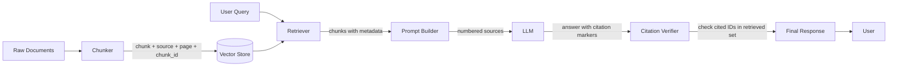

# ترسيخ الاستشهادات (Citation Grounding)

> الإجابة بلا مصادر مجرّد تخمين. رسّخ كل إجابة على المقاطع (chunks) الدقيقة التي تبرّرها.

**النوع:** بناء
**اللغات:** Python
**المتطلبات:** الدروس 01–08 (من Embeddings حتى Query Transformation)
**الوقت:** ~60 دقيقة
**المرحلة:** 02 · الاسترجاع وRAG

## أهداف التعلّم

- شرح سبب اختلاق نماذج LLM غير المرسّخة للاستشهادات وكيف تمنع معمارية النسبة (attribution) ذلك
- بناء خط أنابيب RAG كامل مرسّخ بالاستشهادات: استرجاع ← مطالبة (prompt) ← تحليل (parse) ← تحقّق ← تنسيق
- اكتشاف اختلاق الاستشهادات عبر مطابقة معرّفات المصادر المستشهَد بها مع المجموعة المسترجَعة
- التمييز بين إخفاقات الأمانة (faithfulness) وإخفاقات النسبة (attribution) ومعرفة أي فحص يكشف كلًّا منها
- بناء معدّل تحقّق من الاستشهادات يمكنك تتبّعه في الإنتاج

---

## المشكلة

أطلقت مساعدًا مدعومًا بـRAG. يجيب على الأسئلة بشكل صحيح في أغلب الأحيان. ثم يسأل مستخدم عن تفاعل دوائي، ويستشهد بإجابة نظامك أمام طبيبه، فيلاحظ الطبيب أن الورقة البحثية المستشهَد بها لا تقول ما ادّعاه المساعد. تتعمّق في الأثر (trace). المساعد *فعلًا* استشهد بمعرّف مصدر. لكن عند البحث عن ذلك المعرّف في مخزن مستنداتك، لا يحتوي المقطع على الادعاء. لقد اخترع النموذج استشهادًا يبدو معقولًا.

هذا هو **اختلاق الاستشهادات (citation hallucination)**: لا اختلاق حقيقة، بل اختلاق مصدر. ويُحتمل أنه أسوأ من الخطأ الواقعي لأنه يبدو موثوقًا. الاستشهاد يمنح المستخدم ثقة بأن الإجابة مرسّخة. وهي لم تكن كذلك.

السبب الجذري معماري. حين تطلب من نموذج LLM "أجب على هذا السؤال واستشهد بمصادرك"، يستخدم النموذج معرفته الكامنة (parametric knowledge) (ما تعلّمه أثناء التدريب) لتوليد الإجابة، ثم يخترع علامات استشهاد *تبدو* مناسبة في ضوء نص المقاطع المسترجَعة. هو لا يتتبّع فعلًا من أي مقطع جاءت كل جملة. علامات الاستشهاد زينة، لا نسبة فعلية.

الحل ليس المطالبة بإصرار أكبر. بل بناء معمارية حيث (1) تحمل المقاطع بياناتها الوصفية (metadata) عبر خط الأنابيب بأكمله، (2) تجبر المطالبة النموذج على استخدام المصادر المقدَّمة *فقط* بحسب معرّفها، (3) يُتحقّق من كل استشهاد في الإجابة مقابل المجموعة المسترجَعة فعليًا قبل تسليم الإجابة للمستخدم.

---

## المفهوم

### لماذا تختلق نماذج LLM المصادر

يعرف نموذج LLM الكثير. عند سؤاله، مثلًا، عن آليات الانتباه (attention) في المحوّلات (transformers)، يستطيع إنتاج إجابة سلسة من بيانات التدريب وحدها: حتى عندما تقول المقاطع المسترجَعة شيئًا مختلفًا قليلًا. لا يعرف النموذج أن عليه كبح معرفته الكامنة واستخدام المقاطع *فقط*. ومن دون قيود صريحة، يمزج المحتوى المسترجَع بالمحتوى المحفوظ، ثم يرشّ علامات الاستشهاد فوق المزيج.

المشكلة سيئة بشكل خاص في الحالات التالية:

- **الحقائق المعروفة جيدًا**: يعرف النموذج الإجابة بثقة، وتدعمها المقاطع المسترجَعة جزئيًا، فـ"يكمّل" النموذج بناءً على تدريبه.
- **المصادر التي تبدو معقولة**: إن كان لديك مستندات باسم `research-2023-q4.pdf` و`methodology.pdf`، فسيستشهد النموذج بتلك الأسماء في إجابات أخرى حتى عندما يكون المقطع ذو الصلة من مستند مختلف.
- **المواضيع المجاورة**: تُستشهَد المقاطع عن مواضيع ذات صلة لدعم ادعاءات لا تدعمها، لأن النموذج يجمّعها حسب الموضوع، لا حسب ما يقوله المقطع حرفيًا.

### معمارية النسبة (Attribution Architecture)

المبدأ الأساسي: **يجب أن تتدفق البيانات الوصفية عبر خط الأنابيب بأكمله، من إنشاء المقطع حتى توليد الإجابة.** إن فقدتها في أي مكان، فلن تستطيع الاستشهاد لاحقًا.



يجب أن يحمل كل مقطع في مخزنك على الأقل:
- `source`: اسم الملف أو عنوان URL للمستند الأصلي
- `chunk_id`: معرّف ثابت فريد ضمن المجموعة (corpus)
- `page` أو `section`: موضع مقروء بشريًا داخل المستند

عند الاسترجاع، تُعيد *نص* المقطع إضافةً إلى كل بياناته الوصفية. وعند بناء المطالبة، ترقّم كل مقطع وتعرض ذلك الرقم للنموذج. وعند التحقّق، تتأكد من أن كل `[N]` في الإجابة يقابل مقطعًا اُسترجِع فعلًا.

### نمط مطالبة الاستشهاد (The Citation Prompt Pattern)

التعليمة الجوهرية التي تفرض التوليد المرسّخ:

```
You are a research assistant. Answer the user's question using ONLY the sources
provided below. Each source is numbered [1], [2], etc.

Rules:
1. Cite every factual claim inline using the source number, e.g. "...is true [1]."
2. You may cite multiple sources for a single claim: "...is established [1][3]."
3. If the provided sources do not contain enough information to answer the question,
   respond with: "The provided sources do not contain sufficient information to
   answer this question."
4. Do not use knowledge from outside the provided sources.
5. Do not invent source numbers that are not listed below.

Sources:
[1] {chunk_1_text}  (Source: {filename_1}, page {page_1})
[2] {chunk_2_text}  (Source: {filename_2}, page {page_2})
...
```

القائمة المرقّمة هي ما يجعل التحقّق من الاستشهادات ممكنًا. أنت تعرف بدقّة أي المعرّفات أُعطيت للنموذج. وأي معرّف في الإجابة غير موجود في تلك القائمة هو استشهاد مختلَق.

### الأمانة مقابل النسبة (Faithfulness vs. Attribution)

هذان نمطا إخفاق مختلفان ويحتاجان فحوصًا منفصلة:

| الإخفاق | التعريف | المثال | الكشف |
|---|---|---|---|
| **إخفاق النسبة (Attribution failure)** | المصدر المستشهَد به غير موجود في المجموعة المسترجَعة | تستشهد الإجابة بـ`[4]` بينما اُسترجِع `[1][2][3]` فقط | مطابقة المعرّفات المستشهَد بها مقابل المعرّفات المسترجَعة |
| **إخفاق الأمانة (Faithfulness failure)** | المصدر المستشهَد به *موجود* لكنه لا يدعم الادعاء | المصدر [2] عن دواء مختلف، لكن الادعاء عن ذلك الدواء يستشهد بـ[2] | اقرأ المصدر [2] وتحقّق من أن الادعاء مدعوم |

النسبة فحص آلي: يمكنك أتمتته بالكامل. أما الأمانة فتتطلب فهمًا دلاليًا: تحتاج إلى نموذج LLM كحَكَم (LLM-as-judge) (يُغطّى في الدرس 10) أو مراجِع بشري.

### الامتناع: الحالة الثالثة

النظام المرسّخ جيدًا يجب أن يعرف متى يتوقف. إن لم تحتوِ المقاطع المسترجَعة على الإجابة، فعلى النظام أن يقول ذلك بدلًا من توليد إجابة من الذاكرة الكامنة. نمط مطالبة الاستشهاد أعلاه يتضمّن تعليمة امتناع صريحة. تقيس **معدّل الامتناع (abstention rate)**: نسبة الأسئلة التي لا يمكن الإجابة عنها والتي يمتنع فيها النظام بشكل صحيح: كإشارة جودة. النظام الذي لا يمتنع أبدًا غالبًا لا يرسّخ بشكل سليم.

---

## البناء

### الخطوة 1: تعريف مخزن المستندات مع البيانات الوصفية

```python
# pip install openai

from dataclasses import dataclass
from typing import Optional

@dataclass
class Chunk:
    chunk_id: str
    source: str
    page: Optional[int]
    section: Optional[str]
    text: str

# Sample corpus: hardcoded for demonstration
# In production, these come from your chunking + indexing pipeline
SAMPLE_CHUNKS = [
    Chunk(
        chunk_id="rag-001",
        source="rag-survey-2024.pdf",
        page=3,
        section="Introduction",
        text=(
            "Retrieval-Augmented Generation (RAG) was introduced by Lewis et al. (2020) "
            "as a method for conditioning language model generation on retrieved documents. "
            "Unlike purely parametric models, RAG systems can be updated without retraining "
            "by modifying the document store."
        ),
    ),
    Chunk(
        chunk_id="rag-002",
        source="rag-survey-2024.pdf",
        page=7,
        section="Retrieval Methods",
        text=(
            "Dense retrieval methods encode both queries and documents into a shared embedding "
            "space. The most commonly used models include DPR (Karpukhin et al., 2020) and "
            "Contriever (Izacard et al., 2022). Dense retrieval typically outperforms BM25 "
            "on out-of-domain queries but underperforms on keyword-heavy technical documents."
        ),
    ),
    Chunk(
        chunk_id="rag-003",
        source="hallucination-mitigation.pdf",
        page=2,
        section="Problem Statement",
        text=(
            "Large language models exhibit a behavior known as hallucination: generating "
            "plausible-sounding but factually incorrect statements. In the context of "
            "retrieval-augmented systems, a specific form called citation hallucination "
            "occurs when a model attributes a claim to a source that does not support it."
        ),
    ),
    Chunk(
        chunk_id="rag-004",
        source="hallucination-mitigation.pdf",
        page=8,
        section="Mitigation Strategies",
        text=(
            "Effective mitigation strategies include: (1) constrained generation, where the "
            "model is explicitly instructed to use only provided sources; (2) post-generation "
            "verification, where each cited source is checked against the claim; and (3) "
            "abstention training, where models learn to decline when retrieved context is "
            "insufficient."
        ),
    ),
    Chunk(
        chunk_id="rag-005",
        source="eval-best-practices.pdf",
        page=4,
        section="RAG Evaluation",
        text=(
            "The RAG Triad: faithfulness, answer relevance, and context relevance: provides "
            "a structured framework for evaluating RAG system quality. Faithfulness measures "
            "whether the generated answer is entailed by the retrieved context. Answer "
            "relevance measures whether the answer addresses the user's question. Context "
            "relevance measures whether the retrieved chunks were relevant to the query."
        ),
    ),
]
```

### الخطوة 2: تنفيذ استرجاع ساذج (بلا مخزن متّجهات)

في هذا الدرس نركّز على معمارية الاستشهاد، لا على أداء الاسترجاع. نحاكي الاسترجاع بإعادة أعلى k مقطعًا اعتمادًا على تداخل الكلمات المفتاحية. في الإنتاج، استبدل هذا بمخزن المتّجهات لديك.

```python
import re
from collections import Counter

def keyword_overlap_score(query: str, chunk: Chunk) -> float:
    """Simple keyword overlap for demo purposes. Replace with vector similarity."""
    q_tokens = set(re.findall(r'\b[a-z]+\b', query.lower()))
    c_tokens = Counter(re.findall(r'\b[a-z]+\b', chunk.text.lower()))
    overlap = sum(c_tokens[t] for t in q_tokens if t in c_tokens)
    return overlap / (len(q_tokens) + 1)

def retrieve(query: str, chunks: list[Chunk], top_k: int = 3) -> list[Chunk]:
    """Return top-k chunks by relevance score, preserving all metadata."""
    scored = [(keyword_overlap_score(query, c), c) for c in chunks]
    scored.sort(key=lambda x: x[0], reverse=True)
    return [c for _, c in scored[:top_k]]
```

### الخطوة 3: بناء مطالبة الاستشهاد

```python
def build_citation_prompt(query: str, retrieved_chunks: list[Chunk]) -> tuple[str, str]:
    """
    Build a system prompt and user message that force citation-grounded generation.

    Returns:
        system_prompt: Instructions for the LLM
        user_message: The formatted query with numbered sources
    """
    system_prompt = """You are a research assistant. Answer questions using ONLY the sources provided.

Rules:
1. Cite every factual claim inline using [N] notation, e.g. "...is established [1]."
2. You may cite multiple sources for a single claim: "...is known [1][3]."
3. If the provided sources do not contain sufficient information to answer the question,
   respond ONLY with: "The provided sources do not contain sufficient information to answer this question."
4. Do not use knowledge from outside the provided sources.
5. Do not invent source numbers that are not in the list below.
6. End your response with a blank line and nothing after the last cited sentence."""

    # Build the numbered source list
    source_lines = []
    for i, chunk in enumerate(retrieved_chunks, start=1):
        location = f"page {chunk.page}" if chunk.page else chunk.section or "unknown location"
        source_lines.append(
            f"[{i}] {chunk.text}\n"
            f"    (Source: {chunk.source}, {location}, ID: {chunk.chunk_id})"
        )

    sources_block = "\n\n".join(source_lines)
    user_message = f"Question: {query}\n\nSources:\n{sources_block}"

    return system_prompt, user_message
```

### الخطوة 4: استدعاء نموذج LLM

```python
import os
from openai import OpenAI

client = OpenAI(api_key=os.environ.get("OPENAI_API_KEY"))

def generate_cited_answer(
    query: str,
    retrieved_chunks: list[Chunk],
    model: str = "gpt-4o-mini",
) -> str:
    """Call the LLM with citation-enforcing prompts and return raw response."""
    system_prompt, user_message = build_citation_prompt(query, retrieved_chunks)

    response = client.chat.completions.create(
        model=model,
        messages=[
            {"role": "system", "content": system_prompt},
            {"role": "user", "content": user_message},
        ],
        temperature=0.0,  # Deterministic for citation accuracy
    )

    return response.choices[0].message.content
```

### الخطوة 5: تحليل الاستشهادات والتحقّق منها

```python
def parse_citations(response_text: str) -> set[int]:
    """Extract all citation numbers [N] from the response."""
    return {int(m) for m in re.findall(r'\[(\d+)\]', response_text)}

def verify_citations(
    response_text: str,
    retrieved_chunks: list[Chunk],
) -> dict:
    """
    Check that every citation in the response corresponds to a retrieved chunk.

    Returns a verification report with:
    - cited_ids: set of [N] indices mentioned in the response
    - valid_ids: cited IDs that map to a real retrieved chunk
    - hallucinated_ids: cited IDs with no corresponding chunk
    - is_clean: True if no hallucinated citations
    - is_abstention: True if the system declined to answer
    """
    abstention_phrase = "the provided sources do not contain sufficient information"
    is_abstention = abstention_phrase.lower() in response_text.lower()

    cited_ids = parse_citations(response_text)
    valid_range = set(range(1, len(retrieved_chunks) + 1))

    valid_ids = cited_ids & valid_range
    hallucinated_ids = cited_ids - valid_range

    return {
        "cited_ids": cited_ids,
        "valid_ids": valid_ids,
        "hallucinated_ids": hallucinated_ids,
        "is_clean": len(hallucinated_ids) == 0,
        "is_abstention": is_abstention,
    }
```

### الخطوة 6: تنسيق الإجابة النهائية

```python
def format_final_response(
    response_text: str,
    retrieved_chunks: list[Chunk],
    verification: dict,
) -> str:
    """
    Assemble the final user-facing response with a Sources section.
    Strips hallucinated citation markers and appends a clean source list.
    """
    if verification["is_abstention"]:
        return (
            "**Answer:** The provided sources do not contain sufficient information "
            "to answer this question.\n\n"
            "_No sources were cited because the query could not be answered from the "
            "retrieved documents._"
        )

    if verification["hallucinated_ids"]:
        # Strip hallucinated citation markers from the text before showing to user
        cleaned = response_text
        for bad_id in verification["hallucinated_ids"]:
            cleaned = cleaned.replace(f"[{bad_id}]", "[CITATION REMOVED]")
        response_text = cleaned

    # Build sources section: only include sources that were actually cited
    cited_sources = []
    for idx in sorted(verification["valid_ids"]):
        chunk = retrieved_chunks[idx - 1]
        location = f"page {chunk.page}" if chunk.page else chunk.section or ""
        cited_sources.append(
            f"[{idx}] {chunk.source}"
            + (f", {location}" if location else "")
            + f": \"{chunk.text[:80]}...\""
        )

    sources_section = "\n".join(cited_sources) if cited_sources else "_No sources cited._"

    return f"{response_text}\n\n**Sources:**\n{sources_section}"
```

> **اختبار من الواقع:** يقول الذكاء الاصطناعي إنه يستشهد بمستند سياساتنا، لكن كيف نتحقّق فعلًا من أنه لا يختلق الاستشهاد؟ ما الذي يمنعه من مجرد طباعة اسم مصدر يبدو معقولًا؟

### الخطوة 7: ربط خط الأنابيب الكامل

```python
def citation_grounded_rag(query: str, verbose: bool = True) -> str:
    """
    End-to-end citation-grounded RAG pipeline.

    1. Retrieve chunks with metadata
    2. Build citation-enforcing prompt
    3. Generate response
    4. Verify citations against retrieved set
    5. Format final response with Sources section
    """
    # Step 1: Retrieve
    retrieved = retrieve(query, SAMPLE_CHUNKS, top_k=3)

    if verbose:
        print(f"\n{'='*60}")
        print(f"Query: {query}")
        print(f"\nRetrieved chunks:")
        for i, c in enumerate(retrieved, 1):
            print(f"  [{i}] {c.chunk_id} ({c.source}, p.{c.page})")

    # Step 2-3: Prompt + Generate
    raw_response = generate_cited_answer(query, retrieved)

    if verbose:
        print(f"\nRaw LLM response:\n{raw_response}")

    # Step 4: Verify
    verification = verify_citations(raw_response, retrieved)

    if verbose:
        print(f"\nVerification:")
        print(f"  Cited IDs: {sorted(verification['cited_ids'])}")
        print(f"  Valid IDs: {sorted(verification['valid_ids'])}")
        print(f"  Hallucinated IDs: {sorted(verification['hallucinated_ids'])}")
        print(f"  Clean: {verification['is_clean']}")
        print(f"  Abstention: {verification['is_abstention']}")

    # Step 5: Format
    final = format_final_response(raw_response, retrieved, verification)

    return final


def main():
    test_queries = [
        "What is RAG and why was it introduced?",
        "How do dense retrieval methods work?",
        "What are the mitigation strategies for citation hallucination?",
        "What is the capital of France?",  # Out-of-scope: should trigger abstention
    ]

    for query in test_queries:
        result = citation_grounded_rag(query)
        print(f"\n--- FINAL RESPONSE ---\n{result}\n")


if __name__ == "__main__":
    main()
```

---

## الاستخدام

خط الأنابيب الكامل أعلاه هو 150 سطرًا من Python. ضع مخزن المتّجهات لديك في `retrieve()` ونموذج LLM الذي تختاره في `generate_cited_answer()`. طبقة التحقّق من الاستشهادات غير مرتبطة بنموذج معيّن.

**ما تضيفه واجهة OpenAI API مقابل مطالبتك الخام:**

لا شيء. منطق الاستشهاد بالكامل في مطالبتك ومعالجتك اللاحقة. الـAPI مجرد استدعاء. وهذا هو بيت القصيد: الترسيخ قرار معماري، وليس خاصية في النموذج.

> **نقلة في المنظور:** يثق المستخدمون بالإجابات أكثر حين تكون هناك استشهادات، لكن الإجابات المستشهَد بها أيضًا أطول وأبطأ في التوليد. كيف تقرّر متى تستحق الاستشهادات التعقيد والكمون (latency) الإضافيين، ومتى تكفي الإجابة البسيطة؟

**متى يكون الامتناع خاطئًا:**
تعليمة الامتناع في مطالبتك واسعة: "إن لم تحتوِ المصادر على معلومات كافية." تتباين النماذج في مدى تحفّظها في تفسير ذلك. النموذج المتحمّس جدًا للامتناع سيرفض أسئلة يمكن الإجابة عنها. عاير العتبة بالاختبار باستخدام أسئلة *تعرف* أنه يمكن الإجابة عنها من مجموعتك.

---

## التسليم

الناتج القابل لإعادة الاستخدام من هذا الدرس هو قالب مطالبة النظام في `outputs/prompt-citation-formatter.md`. ضعه في أي نظام RAG كمطالبة نظام. الثوابت الرئيسية التي يفرضها:

1. مصادر مرقّمة في نافذة السياق
2. اشتراط الاستشهاد المضمّن لكل ادعاء
3. شرط امتناع صريح
4. حظر المعرفة الخارجية

تتبّع `citation_hallucination_rate` كمقياس إنتاجي:

```python
# In your production logging middleware:
def log_citation_stats(response_text, retrieved_chunks, trace_id):
    verification = verify_citations(response_text, retrieved_chunks)
    metrics.increment("rag.citations.total", len(verification["cited_ids"]))
    metrics.increment("rag.citations.hallucinated", len(verification["hallucinated_ids"]))
    if not verification["is_clean"]:
        logger.warning("citation_hallucination", trace_id=trace_id,
                       bad_ids=verification["hallucinated_ids"])
```

---

## التقييم

شغّل 20 سؤالًا على نظامك. لكل سؤال، سجّل ثلاثة أرقام:

**المقياس 1: معدّل اختلاق الاستشهادات**
لكل إجابة، احسب معرّفات الاستشهاد المختلَقة مقسومة على إجمالي المعرّفات المستشهَد بها. احسب المتوسط عبر كل الأسئلة. الهدف: < 2%. أي قيمة فوق 5% تعني أن مطالبتك لا تقيّد النموذج بفعالية: تأكد من أن معرّفات المصادر غير ملتبسة في المطالبة (مثلًا استخدم `[1]`, `[2]` لا `[Source A]`, `[Doc B]`).

**المقياس 2: معدّل الأمانة**
لكل مصدر مستشهَد به، اقرأ المقطع يدويًا واسأل: هل يدعم هذا المقطع فعلًا الادعاء الذي اُستشهِد به من أجله؟ سجّل 1 إن نعم، و0 إن لا. احسب المتوسط على كل الاستشهادات. الهدف: > 85%. إخفاقات الأمانة أصعب في الكشف آليًا: هنا يصبح نموذج LLM كحَكَم (الدرس 10) ضروريًا.

**المقياس 3: معدّل الامتناع على الأسئلة التي لا يمكن الإجابة عنها**
ضع 5 من أسئلتك العشرين بأسئلة لا تكون قطعًا في مجموعتك. احسب كم مرة يمتنع النظام بشكل صحيح. الهدف: > 80%. النظام الذي لا يستطيع الامتناع غير آمن للنشر في السياقات عالية المخاطر.

**بروتوكول تدقيق سريع:**

```
For each of 20 queries:
1. Does the response contain [N] markers?            → if no, prompt isn't working
2. Do all [N] map to retrieved chunks?               → if no, citation hallucination
3. Does each cited chunk support its claim?          → if no, faithfulness failure
4. For out-of-scope queries: does the system refuse? → if no, abstention failure
```

احتفظ بهذا في جدول بيانات. بعد 20 سؤالًا ستعرف بدقّة أين ينكسر خط أنابيبك.

---

## التمارين

1. **سهل:** عدّل `build_citation_prompt()` لتضمين `section` الخاص بالمقطع في وسم المصدر (مثلًا `[1] rag-survey-2024.pdf, Section: Introduction, page 3`). تحقّق من أن المطالبة المنسّقة تبدو صحيحة بطباعتها قبل استدعاء النموذج.

2. **متوسط:** نفّذ فاحص أمانة: بإعطاء زوج `(claim, source_chunk)`، اطلب من نموذج LLM تقييم 0 أو 1 ما إذا كان المقطع يدعم الادعاء. طبّقه على كل زوج `(sentence, cited_chunk)` في الإجابة. أبلغ عن درجات الأمانة لكل جملة.

3. **صعب:** ابنِ اختبار إجهاد للاستشهادات. خذ 10 مقاطع من مجموعتك. ولّد 20 سؤالًا باستخدام نموذج LLM (5 يمكن الإجابة عنها من المصادر، 5 يمكن الإجابة عنها جزئيًا، 5 لا يمكن الإجابة عنها، 5 تتطلب دمج معلومات من مقطعين). شغّل خط الأنابيب الكامل وقِس المقاييس الثلاثة كلها. اكتب تحليلًا من 200 كلمة لأي نمط إخفاق هو الأكثر شيوعًا ولماذا.

---

## مصطلحات أساسية

| المصطلح | ما يقوله الناس | ما يعنيه فعلًا |
|------|----------------|------------------------|
| اختلاق الاستشهاد (Citation hallucination) | "اخترع النموذج مصدرًا" | تضمين النموذج علامة استشهاد في إجابته لا تقابل أي مقطع في المجموعة المسترجَعة |
| الأمانة (Faithfulness) | "الإجابة مرسّخة" | كل ادعاء في الإجابة مستلزَم من (يمكن التحقّق منه مقابل) مقطع المصدر المستشهَد به |
| النسبة (Attribution) | "الإجابة مستشهَد بها" | لكل ادعاء علامة استشهاد تربطه بالمقطع المحدد الذي يدعمه |
| الامتناع (Abstention) | "رفض النموذج الإجابة" | امتناع النظام بشكل صحيح عن الإجابة حين لا يدعم السياق المسترجَع أي إجابة |
| معمارية النسبة (Attribution architecture) | "تتبّع المصادر" | المبدأ التصميمي القائل بأن البيانات الوصفية للمقطع (المصدر، الصفحة، المعرّف) يجب أن تُحفظ عبر كل مرحلة من خط الأنابيب من الإدخال حتى التوليد |
| المعرفة الكامنة (Parametric knowledge) | "ما يعرفه النموذج" | الحقائق المرمّزة في أوزان النموذج من التدريب المسبق: مصدر الاختلاق حين يتجاوز النموذج السياق المسترجَع |

---

## قراءات إضافية

- [RARR: Researching and Revising What Language Models Say Using Language Models](https://arxiv.org/abs/2210.08726): خط أنابيب آلي لترسيخ مخرجات نماذج LLM على الأدلة المسترجَعة؛ ذو صلة مباشرة بفحص الأمانة
- [FActScoring: Fine-grained Atomic Evaluation of Factual Precision](https://arxiv.org/abs/2305.14251): تفكيك الإجابات إلى ادعاءات ذرّية، والتحقّق من كل منها مقابل مصدر معرفة: النسخة المنهجية من فحص الأمانة اليدوي
- [ALCE: Enabling Large Language Models to Generate Text with Citations](https://arxiv.org/abs/2305.14627): معيار قياس ونهج تدريب لتوليد الاستشهادات؛ يُظهر ما تستطيع نماذج LLM فعله وما لا تستطيعه أصلًا
- [Anthropic: Reducing Sycophancy and Faithfulness Issues in Claude](https://www.anthropic.com/research/claude-character): نهج Anthropic لإبقاء Claude مرسّخًا؛ ذو صلة لفهم سلوك النموذج تحت قيود الاستشهاد
- [LangChain Citations](https://python.langchain.com/docs/how_to/qa_citations/): تنفيذ على مستوى إطار العمل لاستخراج الاستشهادات من إجابات نماذج LLM
