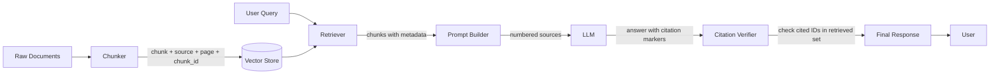

# Citation Grounding

> An answer without sources is a guess. Ground every response to the exact chunks that justify it.

**Type:** Build
**Languages:** Python
**Prerequisites:** Lessons 01–08 (Embeddings through Query Transformation)
**Time:** ~60 minutes
**Phase:** 02 · Retrieval & RAG

## Learning Objectives

- Explain why ungrounded LLMs hallucinate citations and how attribution architecture prevents it
- Implement a full citation-grounded RAG pipeline: retrieve → prompt → parse → verify → format
- Detect citation hallucination by checking cited source IDs against the retrieved set
- Distinguish faithfulness failures from attribution failures and know which check catches each
- Build a citation verification rate you can track in production

---

## The Problem

You ship a RAG-powered assistant. It answers questions correctly most of the time. Then a user asks about a drug interaction, cites your system's answer to their doctor, and the doctor flags that the cited paper doesn't say what the assistant claimed. You dig into the trace. The assistant *did* cite a source ID. But when you look up that ID in your document store, the chunk doesn't contain the claim. The LLM invented a citation that looked plausible.

This is **citation hallucination**: not making up a fact, but making up a source. It's arguably worse than a factual error because it looks authoritative. The citation gives the user confidence the answer was grounded. It wasn't.

The root cause is architectural. When you ask an LLM "answer this question and cite your sources," the model uses its parametric knowledge (things it learned during training) to generate the answer, then invents citation markers that *feel* right given the text of the retrieved chunks. It doesn't actually track which chunk each sentence came from. The citation markers are decoration, not attribution.

The fix is not prompting harder. It's building an architecture where (1) chunks carry metadata through the entire pipeline, (2) the prompt forces the LLM to use *only* the provided sources by ID, (3) every citation in the response is verified against the actual retrieved set before the response ships to the user.

---

## The Concept

### Why LLMs Hallucinate Sources

An LLM knows a lot. When asked about, say, transformer attention mechanisms, it can produce a fluent answer from training data alone: even when the retrieved chunks say something slightly different. The model doesn't know that it should suppress its parametric knowledge and use *only* the chunks. Without explicit constraints, it blends retrieved content with memorized content, then sprinkles citation markers over the blend.

The problem is especially bad for:

- **Well-known facts**: The LLM knows the answer confidently, retrieved chunks partially support it, and the model "rounds up" using its training.
- **Plausible-sounding sources**: If your corpus has documents named `research-2023-q4.pdf` and `methodology.pdf`, the LLM will cite those names in other answers even when the relevant chunk came from a different document.
- **Adjacent topics**: Chunks about related topics get cited for claims they don't support because the LLM groups them by topic, not by what the chunk literally says.

### Attribution Architecture

The fundamental principle: **metadata must flow through the entire pipeline, from chunk creation to response generation.** If you lose it anywhere, you can't cite later.



Every chunk in your store should carry at minimum:
- `source`: the filename or URL of the original document
- `chunk_id`: a stable identifier unique within the corpus
- `page` or `section`: human-readable location within the document

When you retrieve, you return the chunk *text* plus all its metadata. When you build the prompt, you number each chunk and expose that number to the LLM. When you verify, you check that every `[N]` in the response corresponds to a chunk that was actually retrieved.

### The Citation Prompt Pattern

The core instruction that forces grounded generation:

```
You are a research assistant. Answer the user's question using ONLY the sources
provided below. Each source is numbered [1], [2], etc.

Rules:
1. Cite every factual claim inline using the source number, e.g. "...is true [1]."
2. You may cite multiple sources for a single claim: "...is established [1][3]."
3. If the provided sources do not contain enough information to answer the question,
   respond with: "The provided sources do not contain sufficient information to
   answer this question."
4. Do not use knowledge from outside the provided sources.
5. Do not invent source numbers that are not listed below.

Sources:
[1] {chunk_1_text}  (Source: {filename_1}, page {page_1})
[2] {chunk_2_text}  (Source: {filename_2}, page {page_2})
...
```

The numbered list is what makes citation verification possible. You know exactly which IDs were given to the LLM. Any ID in the response that isn't in that list is a hallucinated citation.

### Faithfulness vs. Attribution

These are two different failure modes and they need separate checks:

| Failure | Definition | Example | Detection |
|---|---|---|---|
| **Attribution failure** | The cited source doesn't exist in the retrieved set | Response cites `[4]` but only `[1][2][3]` were retrieved | Check cited IDs against retrieved IDs |
| **Faithfulness failure** | The cited source *does* exist but doesn't support the claim | Source [2] is about a different drug, but the claim about that drug cites [2] | Read source [2] and verify the claim is supported |

Attribution is the mechanical check: you can automate it completely. Faithfulness requires semantic understanding: you need an LLM-as-judge (covered in Lesson 10) or a human reviewer.

### Abstention: The Third Case

A well-grounded system should know when to stop. If the retrieved chunks don't contain the answer, the system should say so rather than generate an answer from parametric memory. The citation prompt pattern above includes an explicit abstention instruction. You measure **abstention rate**: the fraction of unanswerable queries where the system correctly declines: as a quality signal. A system that never abstains is probably not grounding properly.

---

## Build It

### Step 1: Define the Document Store with Metadata

```python
# pip install openai

from dataclasses import dataclass
from typing import Optional

@dataclass
class Chunk:
    chunk_id: str
    source: str
    page: Optional[int]
    section: Optional[str]
    text: str

# Sample corpus: hardcoded for demonstration
# In production, these come from your chunking + indexing pipeline
SAMPLE_CHUNKS = [
    Chunk(
        chunk_id="rag-001",
        source="rag-survey-2024.pdf",
        page=3,
        section="Introduction",
        text=(
            "Retrieval-Augmented Generation (RAG) was introduced by Lewis et al. (2020) "
            "as a method for conditioning language model generation on retrieved documents. "
            "Unlike purely parametric models, RAG systems can be updated without retraining "
            "by modifying the document store."
        ),
    ),
    Chunk(
        chunk_id="rag-002",
        source="rag-survey-2024.pdf",
        page=7,
        section="Retrieval Methods",
        text=(
            "Dense retrieval methods encode both queries and documents into a shared embedding "
            "space. The most commonly used models include DPR (Karpukhin et al., 2020) and "
            "Contriever (Izacard et al., 2022). Dense retrieval typically outperforms BM25 "
            "on out-of-domain queries but underperforms on keyword-heavy technical documents."
        ),
    ),
    Chunk(
        chunk_id="rag-003",
        source="hallucination-mitigation.pdf",
        page=2,
        section="Problem Statement",
        text=(
            "Large language models exhibit a behavior known as hallucination: generating "
            "plausible-sounding but factually incorrect statements. In the context of "
            "retrieval-augmented systems, a specific form called citation hallucination "
            "occurs when a model attributes a claim to a source that does not support it."
        ),
    ),
    Chunk(
        chunk_id="rag-004",
        source="hallucination-mitigation.pdf",
        page=8,
        section="Mitigation Strategies",
        text=(
            "Effective mitigation strategies include: (1) constrained generation, where the "
            "model is explicitly instructed to use only provided sources; (2) post-generation "
            "verification, where each cited source is checked against the claim; and (3) "
            "abstention training, where models learn to decline when retrieved context is "
            "insufficient."
        ),
    ),
    Chunk(
        chunk_id="rag-005",
        source="eval-best-practices.pdf",
        page=4,
        section="RAG Evaluation",
        text=(
            "The RAG Triad: faithfulness, answer relevance, and context relevance: provides "
            "a structured framework for evaluating RAG system quality. Faithfulness measures "
            "whether the generated answer is entailed by the retrieved context. Answer "
            "relevance measures whether the answer addresses the user's question. Context "
            "relevance measures whether the retrieved chunks were relevant to the query."
        ),
    ),
]
```

### Step 2: Implement Naive Retrieval (No Vector Store)

For this lesson we focus on the citation architecture, not retrieval performance. We simulate retrieval by returning the top-k chunks based on keyword overlap. In production, replace this with your vector store.

```python
import re
from collections import Counter

def keyword_overlap_score(query: str, chunk: Chunk) -> float:
    """Simple keyword overlap for demo purposes. Replace with vector similarity."""
    q_tokens = set(re.findall(r'\b[a-z]+\b', query.lower()))
    c_tokens = Counter(re.findall(r'\b[a-z]+\b', chunk.text.lower()))
    overlap = sum(c_tokens[t] for t in q_tokens if t in c_tokens)
    return overlap / (len(q_tokens) + 1)

def retrieve(query: str, chunks: list[Chunk], top_k: int = 3) -> list[Chunk]:
    """Return top-k chunks by relevance score, preserving all metadata."""
    scored = [(keyword_overlap_score(query, c), c) for c in chunks]
    scored.sort(key=lambda x: x[0], reverse=True)
    return [c for _, c in scored[:top_k]]
```

### Step 3: Build the Citation Prompt

```python
def build_citation_prompt(query: str, retrieved_chunks: list[Chunk]) -> tuple[str, str]:
    """
    Build a system prompt and user message that force citation-grounded generation.

    Returns:
        system_prompt: Instructions for the LLM
        user_message: The formatted query with numbered sources
    """
    system_prompt = """You are a research assistant. Answer questions using ONLY the sources provided.

Rules:
1. Cite every factual claim inline using [N] notation, e.g. "...is established [1]."
2. You may cite multiple sources for a single claim: "...is known [1][3]."
3. If the provided sources do not contain sufficient information to answer the question,
   respond ONLY with: "The provided sources do not contain sufficient information to answer this question."
4. Do not use knowledge from outside the provided sources.
5. Do not invent source numbers that are not in the list below.
6. End your response with a blank line and nothing after the last cited sentence."""

    # Build the numbered source list
    source_lines = []
    for i, chunk in enumerate(retrieved_chunks, start=1):
        location = f"page {chunk.page}" if chunk.page else chunk.section or "unknown location"
        source_lines.append(
            f"[{i}] {chunk.text}\n"
            f"    (Source: {chunk.source}, {location}, ID: {chunk.chunk_id})"
        )

    sources_block = "\n\n".join(source_lines)
    user_message = f"Question: {query}\n\nSources:\n{sources_block}"

    return system_prompt, user_message
```

### Step 4: Call the LLM

```python
import os
from openai import OpenAI

client = OpenAI(api_key=os.environ.get("OPENAI_API_KEY"))

def generate_cited_answer(
    query: str,
    retrieved_chunks: list[Chunk],
    model: str = "gpt-4o-mini",
) -> str:
    """Call the LLM with citation-enforcing prompts and return raw response."""
    system_prompt, user_message = build_citation_prompt(query, retrieved_chunks)

    response = client.chat.completions.create(
        model=model,
        messages=[
            {"role": "system", "content": system_prompt},
            {"role": "user", "content": user_message},
        ],
        temperature=0.0,  # Deterministic for citation accuracy
    )

    return response.choices[0].message.content
```

### Step 5: Parse and Verify Citations

```python
def parse_citations(response_text: str) -> set[int]:
    """Extract all citation numbers [N] from the response."""
    return {int(m) for m in re.findall(r'\[(\d+)\]', response_text)}

def verify_citations(
    response_text: str,
    retrieved_chunks: list[Chunk],
) -> dict:
    """
    Check that every citation in the response corresponds to a retrieved chunk.

    Returns a verification report with:
    - cited_ids: set of [N] indices mentioned in the response
    - valid_ids: cited IDs that map to a real retrieved chunk
    - hallucinated_ids: cited IDs with no corresponding chunk
    - is_clean: True if no hallucinated citations
    - is_abstention: True if the system declined to answer
    """
    abstention_phrase = "the provided sources do not contain sufficient information"
    is_abstention = abstention_phrase.lower() in response_text.lower()

    cited_ids = parse_citations(response_text)
    valid_range = set(range(1, len(retrieved_chunks) + 1))

    valid_ids = cited_ids & valid_range
    hallucinated_ids = cited_ids - valid_range

    return {
        "cited_ids": cited_ids,
        "valid_ids": valid_ids,
        "hallucinated_ids": hallucinated_ids,
        "is_clean": len(hallucinated_ids) == 0,
        "is_abstention": is_abstention,
    }
```

### Step 6: Format the Final Response

```python
def format_final_response(
    response_text: str,
    retrieved_chunks: list[Chunk],
    verification: dict,
) -> str:
    """
    Assemble the final user-facing response with a Sources section.
    Strips hallucinated citation markers and appends a clean source list.
    """
    if verification["is_abstention"]:
        return (
            "**Answer:** The provided sources do not contain sufficient information "
            "to answer this question.\n\n"
            "_No sources were cited because the query could not be answered from the "
            "retrieved documents._"
        )

    if verification["hallucinated_ids"]:
        # Strip hallucinated citation markers from the text before showing to user
        cleaned = response_text
        for bad_id in verification["hallucinated_ids"]:
            cleaned = cleaned.replace(f"[{bad_id}]", "[CITATION REMOVED]")
        response_text = cleaned

    # Build sources section: only include sources that were actually cited
    cited_sources = []
    for idx in sorted(verification["valid_ids"]):
        chunk = retrieved_chunks[idx - 1]
        location = f"page {chunk.page}" if chunk.page else chunk.section or ""
        cited_sources.append(
            f"[{idx}] {chunk.source}"
            + (f", {location}" if location else "")
            + f": \"{chunk.text[:80]}...\""
        )

    sources_section = "\n".join(cited_sources) if cited_sources else "_No sources cited._"

    return f"{response_text}\n\n**Sources:**\n{sources_section}"
```

> **Real-world check:** The AI says it's citing our policy document, but how do we actually verify it's not making up the citation? What stops it from just printing a source name that sounds plausible?

### Step 7: Wire the Full Pipeline

```python
def citation_grounded_rag(query: str, verbose: bool = True) -> str:
    """
    End-to-end citation-grounded RAG pipeline.

    1. Retrieve chunks with metadata
    2. Build citation-enforcing prompt
    3. Generate response
    4. Verify citations against retrieved set
    5. Format final response with Sources section
    """
    # Step 1: Retrieve
    retrieved = retrieve(query, SAMPLE_CHUNKS, top_k=3)

    if verbose:
        print(f"\n{'='*60}")
        print(f"Query: {query}")
        print(f"\nRetrieved chunks:")
        for i, c in enumerate(retrieved, 1):
            print(f"  [{i}] {c.chunk_id} ({c.source}, p.{c.page})")

    # Step 2-3: Prompt + Generate
    raw_response = generate_cited_answer(query, retrieved)

    if verbose:
        print(f"\nRaw LLM response:\n{raw_response}")

    # Step 4: Verify
    verification = verify_citations(raw_response, retrieved)

    if verbose:
        print(f"\nVerification:")
        print(f"  Cited IDs: {sorted(verification['cited_ids'])}")
        print(f"  Valid IDs: {sorted(verification['valid_ids'])}")
        print(f"  Hallucinated IDs: {sorted(verification['hallucinated_ids'])}")
        print(f"  Clean: {verification['is_clean']}")
        print(f"  Abstention: {verification['is_abstention']}")

    # Step 5: Format
    final = format_final_response(raw_response, retrieved, verification)

    return final


def main():
    test_queries = [
        "What is RAG and why was it introduced?",
        "How do dense retrieval methods work?",
        "What are the mitigation strategies for citation hallucination?",
        "What is the capital of France?",  # Out-of-scope: should trigger abstention
    ]

    for query in test_queries:
        result = citation_grounded_rag(query)
        print(f"\n--- FINAL RESPONSE ---\n{result}\n")


if __name__ == "__main__":
    main()
```

---

## Use It

The full pipeline above is 150 lines of Python. Swap in your vector store at `retrieve()` and your LLM of choice at `generate_cited_answer()`. The citation verification layer is model-agnostic.

**What OpenAI's API adds vs. your raw prompt:**

Nothing. The citation logic is entirely in your prompt and your post-processing. The API is just a call. This is the point: grounding is an architecture decision, not a model feature.

> **Perspective shift:** Users trust answers more when there are citations, but cited answers are also longer and slower to generate. How do you decide when citations are worth the added complexity and latency, and when a plain answer is fine?

**When abstention is wrong:**
Your prompt's abstention instruction is broad: "if sources don't contain sufficient information." LLMs vary in how conservatively they interpret this. A model that's too eager to abstain will refuse answerable questions. Calibrate the threshold by testing with queries you *know* are answerable from your corpus.

---

## Ship It

The reusable artifact from this lesson is the system prompt template in `outputs/prompt-citation-formatter.md`. Drop it into any RAG system as the system prompt. The key invariants it enforces:

1. Numbered sources in the context window
2. Inline citation requirement per claim
3. Explicit abstention condition
4. Prohibition on external knowledge

Track `citation_hallucination_rate` as a production metric:

```python
# In your production logging middleware:
def log_citation_stats(response_text, retrieved_chunks, trace_id):
    verification = verify_citations(response_text, retrieved_chunks)
    metrics.increment("rag.citations.total", len(verification["cited_ids"]))
    metrics.increment("rag.citations.hallucinated", len(verification["hallucinated_ids"]))
    if not verification["is_clean"]:
        logger.warning("citation_hallucination", trace_id=trace_id,
                       bad_ids=verification["hallucinated_ids"])
```

---

## Evaluate It

Run 20 queries against your system. For each query, record three numbers:

**Metric 1: Citation Hallucination Rate**
For each response, count hallucinated citation IDs divided by total cited IDs. Average across all queries. Target: < 2%. Anything above 5% means your prompt isn't constraining the LLM effectively: check that source IDs are unambiguous in the prompt (e.g., use `[1]`, `[2]`, not `[Source A]`, `[Doc B]`).

**Metric 2: Faithfulness Rate**
For each cited source, manually read the chunk and ask: does this chunk actually support the claim it's cited for? Score 1 if yes, 0 if no. Average over all citations. Target: > 85%. Faithfulness failures are harder to catch mechanically: this is where LLM-as-judge (Lesson 10) becomes essential.

**Metric 3: Abstention Rate on Unanswerable Queries**
Seed 5 of your 20 queries with questions that are definitely not in your corpus. Count how many times the system correctly abstains. Target: > 80%. A system that can't abstain is not safe to deploy in high-stakes contexts.

**Quick audit protocol:**

```
For each of 20 queries:
1. Does the response contain [N] markers?            → if no, prompt isn't working
2. Do all [N] map to retrieved chunks?               → if no, citation hallucination
3. Does each cited chunk support its claim?          → if no, faithfulness failure
4. For out-of-scope queries: does the system refuse? → if no, abstention failure
```

Keep this in a spreadsheet. After 20 queries you'll know exactly where your pipeline breaks.

---

## Exercises

1. **Easy:** Modify `build_citation_prompt()` to include the chunk's `section` in the source label (e.g., `[1] rag-survey-2024.pdf, Section: Introduction, page 3`). Verify the formatted prompt looks correct by printing it before the LLM call.

2. **Medium:** Implement a faithfulness checker: given a `(claim, source_chunk)` pair, ask an LLM to rate 0 or 1 whether the chunk supports the claim. Apply it to every `(sentence, cited_chunk)` pair in a response. Report per-sentence faithfulness scores.

3. **Hard:** Build a citation stress test. Take 10 chunks from your corpus. Generate 20 queries using an LLM (5 answerable from sources, 5 partially answerable, 5 not answerable, 5 that require combining information from two chunks). Run the full pipeline and measure all three metrics. Write a 200-word analysis of which failure mode is most common and why.

---

## Key Terms

| Term | What people say | What it actually means |
|------|----------------|------------------------|
| Citation hallucination | "The model made up a source" | The LLM included a citation marker in its response that doesn't correspond to any chunk in the retrieved set |
| Faithfulness | "The answer is grounded" | Every claim in the response is entailed by (can be verified against) the cited source chunk |
| Attribution | "The answer is cited" | Each claim has a citation marker linking it to the specific chunk that supports it |
| Abstention | "The model refused to answer" | The system correctly declines to answer when the retrieved context doesn't support a response |
| Attribution architecture | "Source tracking" | The design principle that chunk metadata (source, page, ID) must be preserved through every stage of the pipeline from ingestion to generation |
| Parametric knowledge | "What the model knows" | Facts encoded in the model's weights from pretraining: the source of hallucination when the model bypasses retrieved context |

---

## Further Reading

- [RARR: Researching and Revising What Language Models Say Using Language Models](https://arxiv.org/abs/2210.08726): Automated pipeline for grounding LLM outputs back to retrieved evidence; directly relevant to faithfulness checking
- [FActScoring: Fine-grained Atomic Evaluation of Factual Precision](https://arxiv.org/abs/2305.14251): Decompose responses into atomic claims, verify each against a knowledge source: the principled version of manual faithfulness checking
- [ALCE: Enabling Large Language Models to Generate Text with Citations](https://arxiv.org/abs/2305.14627): Benchmark and training approach for citation generation; shows what LLMs can and can't do natively
- [Anthropic: Reducing Sycophancy and Faithfulness Issues in Claude](https://www.anthropic.com/research/claude-character): Anthropic's approach to keeping Claude grounded; relevant for understanding model behavior under citation constraints
- [LangChain Citations](https://python.langchain.com/docs/how_to/qa_citations/): Framework-level implementation of citation extraction from LLM responses
