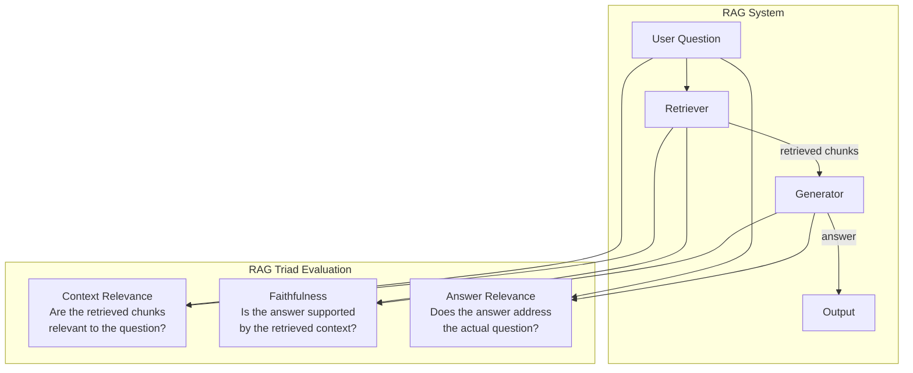
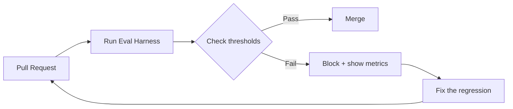

# تقييم RAG

> "يبدو أنه يعمل" يُطلق RAG معطوبًا. ثلاثية RAG (RAG Triad) تمنحك ثلاثة أرقام لا تكذب.

**النوع:** بناء
**اللغات:** Python
**المتطلبات:** الدروس 01–09 (من Embeddings حتى ترسيخ الاستشهادات)
**الوقت:** ~90 دقيقة
**المرحلة:** 02 · الاسترجاع وRAG

## أهداف التعلّم

- شرح سبب فشل التقييم النوعي لـRAG وما تقيسه ثلاثية RAG بدلًا منه
- تنفيذ نموذج LLM كحَكَم (LLM-as-judge) لمكوّنات ثلاثية RAG الثلاثة كلها من الصفر
- بناء صنف `RagEvaluator` يُعيد قاموس درجات مهيكلًا
- بناء مجموعة تقييم (eval set) دنيا وتشغيلها على خط أنابيب RAG عيّني
- معايرة حَكَم LLM لديك مقابل تسميات بشرية قبل الوثوق بدرجاته
- دمج أداة التقييم في خط أنابيب CI مع فحص نجاح/إخفاق قائم على عتبة

---

## المشكلة

نظام RAG لديك يعمل جيدًا في عروضك. الإجابات تبدو جيدة. سلسة وواثقة. ويبدو المستخدمون راضين في النسخة التجريبية (beta). ثم تُطلق إلى الإنتاج فتبدأ تذاكر الدعم بالوصول: إجابات خاطئة، إجابات تُغفل الفكرة كليًا، إجابات تقول بثقة أشياء لم تقلها مستنداتك قط.

المشكلة أن التقييم النوعي: "قرأت بعض المخرجات وتبدو معقولة": لديه معدّل إيجابيات كاذبة 100% على أسئلة العرض. أسئلة العرض سهلة: قصيرة، غير ملتبسة، تطابقها مجموعتك مباشرة. أما أسئلة الإنتاج فعدائية: طويلة، ملتبسة، مليئة بالمترادفات، تشير إلى أشياء تذكرها مجموعتك بشكل غير مباشر أو لا تذكرها إطلاقًا.

أنماط إخفاق RAG **صامتة** على وجه التحديد:

- **استرجاع المقطع الخاطئ**: تتناول الإجابة سؤالًا ذا صلة لكنه مختلف. تبدو معقولة، وتخذل المستخدم.
- **استشهاد مختلَق**: تستشهد الإجابة بمصدر يقول شيئًا مختلفًا. تبدو مرسّخة، وليست كذلك.
- **إجابة مجاورة**: عثر المسترجِع على مستند ذي صلة لكن النموذج أجاب على سؤال قريب، لا على السؤال الفعلي. قريبة دلاليًا، وخاطئة واقعيًا لهذا المستخدم.
- **سلاسة عالية الحيرة (high-perplexity fluency)**: سيُنتج نموذج LLM متطور إجابة مكتوبة ببراعة وهي خاطئة تمامًا. جودة الكتابة لا تخبرك بشيء عن الدقّة الواقعية.

لا شيء من هذه الإخفاقات مرئي من القراءة العابرة. تحتاج إلى أرقام. ثلاثية RAG تمنحك ثلاثة أرقام تشخّص أين ينكسر نظامك.

---

## المفهوم

### ثلاثية RAG (The RAG Triad)

شغّل مشروع RAGAS ثلاثية RAG عمليًا، وهي مرتبطة ارتباطًا وثيقًا بكتابات Hamel Husain عن تقييم أنظمة RAG في الإنتاج. تُعرّف ثلاثة أبعاد للجودة تغطّي معًا أنماط الإخفاق الرئيسية:



**الأمانة (Faithfulness)** (جودة المولّد، في ظل الاسترجاع)

*التعريف:* لكل ادعاء في الإجابة، هل هو مستلزَم من السياق المسترجَع؟ الدرجة 1 تعني أن كل ادعاء يمكن تتبّعه إلى المقاطع المسترجَعة. والدرجة 0 تعني أن الإجابة مختلَقة إلى حدّ كبير.

*ما يكشفه:* اختلاق نموذج LLM. النموذج استرجع مستندات ذات صلة لكنه اخترع حقائق تتجاوز ما تقوله تلك المستندات.

*كيف يُقاس:* نموذج LLM كحَكَم. فكّك الإجابة إلى ادعاءات ذرّية. لكل ادعاء، اسأل نموذج الحَكَم: "هل هذا الادعاء مدعوم بالسياق التالي؟" الدرجة هي نسبة الادعاءات المدعومة.

**صلة الإجابة (Answer Relevance)** (جودة المولّد، في ظل السياق)

*التعريف:* هل تتناول الإجابة سؤال المستخدم الفعلي؟ الدرجة 1 تعني أن الإجابة في الصميم. والدرجة 0 تعني أن الإجابة سلسة لكنها لا تتناول ما طُلب.

*ما يكشفه:* إخفاقات الإجابة المجاورة. أنتج النظام إجابة، لكنها إجابة على سؤال مختلف (عادةً ذي صلة).

*كيف يُقاس:* نموذج LLM كحَكَم، أو بأناقة، تضمين الإجابة وقياس تشابه جيب التمام (cosine similarity) مع السؤال الأصلي: الإجابات على السؤال ستُضمَّن قرب السؤال؛ والإجابات المجاورة لن تفعل.

**صلة السياق (Context Relevance)** (جودة المسترجِع)

*التعريف:* لكل مقطع مسترجَع، هل يحتوي على معلومات ذات صلة بالإجابة على السؤال؟ الدرجة هي نسبة المقاطع المسترجَعة ذات الصلة.

*ما يكشفه:* إخفاقات المسترجِع. أبلى المولّد حسنًا بما أُعطي، لكن ما أُعطي كان أغلبه ضجيجًا. هذا أهم مقياس لتشخيص مشاكل الاسترجاع.

*كيف يُقاس:* نموذج LLM كحَكَم. لكل زوج (سؤال، مقطع)، اسأل: "هل هذا المقطع ذو صلة بالإجابة على السؤال؟"

### مصفوفة التشخيص

الدرجات الثلاث معًا تشكّل مصفوفة تشخيص:

| الأمانة | صلة الإجابة | صلة السياق | التشخيص |
|---|---|---|---|
| عالية | عالية | عالية | النظام يعمل |
| منخفضة | عالية | عالية | المولّد يختلق رغم استرجاع جيد |
| عالية | منخفضة | عالية | المولّد يجيب على سؤال مجاور |
| منخفضة | منخفضة | منخفضة | المسترجِع معطوب؛ كل ما بعده يفشل |
| عالية | عالية | منخفضة | حظ سعيد: المقاطع غير ذات الصلة لا تضرّ بعد |
| أيّ | منخفضة | منخفضة | أصلح الاسترجاع أولًا؛ لا يمكن للمولّد أن ينجح |

اقرأ الجدول من اليمين إلى اليسار: إن كانت صلة السياق منخفضة، أصلح المسترجِع قبل لمس أي شيء آخر. لا يستطيع المولّد إنتاج إجابات جيدة من سياق سيئ، مهما كان النموذج جيدًا.

### نموذج LLM كحَكَم (LLM-as-Judge)

نموذج LLM كحَكَم يستخدم نموذج LLM قادرًا لتقييم مخرجات نموذج LLM آخر. ينجح لأن مهمة التقييم هي فهم دلالي: وهو بالضبط ما تجيده نماذج LLM. يستطيع حَكَم LLM تقييم مئات الإجابات في الوقت الذي يقيّم فيه إنسان واحدة.

المقايضة هي الموثوقية. لحَكَمات LLM تحيّزات:
- **تحيّز الإسهاب (Verbosity bias)**: الإجابات الأطول تحصل على درجات أعلى
- **تحيّز الاتساق الذاتي (Self-consistency bias)**: قد يوافق نموذج من العائلة نفسها التي ينتمي إليها المولّد بسهولة أكثر من اللازم
- **تحيّز الموضع (Position bias)**: قد يفضّل الحَكَم الخيار الأول المعروض

عاير قبل أن تثق: قيّم 20 مثالًا بالحَكَم وبإنسان معًا. إن كان التوافق < 85%، فمطالبة حَكَمك تحتاج عملًا. وإن كانت المعايرة سليمة، فيمكنك الوثوق بالحَكَم على نطاق واسع.

### بناء مجموعة التقييم لديك

**أهم شيء في تقييم RAG هو مجموعة التقييم، لا المقاييس.**

قواعد مجموعة تقييم جيدة:

1. **استخدم أسئلة حقيقية من حالة استخدامك.** لا تولّد أسئلة اصطناعية من نموذج LLM نفسه الذي تقيّمه. ستنشئ نظامًا دائريًا لا يكتشف إلا الإخفاقات التي يعرفها مولّدك أصلًا.

2. **ضمّن أسئلة مُحدِثة للإخفاق.** ضع عمدًا أسئلة تختبر مسترجِعك تحت الإجهاد (أسئلة طويلة، أسئلة مُعاد صياغتها، أسئلة تتطلب توليفًا متعدد المقاطع) ومولّدك (أسئلة يجيب فيها السياق على السؤال جزئيًا، أسئلة تكون فيها الإجابة الواضحة خاطئة).

3. **سمِّ الإجابات المتوقعة أو المقاطع ذات الصلة.** لكل سؤال، اكتب (أو اطلب من خبير مجال أن يكتب) كيف تبدو الإجابة الصحيحة، أو أي المقاطع المحددة ينبغي استرجاعها. هذه حقيقتك الأرضية (ground truth).

4. **20–50 سؤالًا تكفي للبدء.** لا تنتظر حتى 1000. شغّل التقييمات مبكرًا بـ20 سؤالًا، واعثر على أسوأ الإخفاقات، وأصلحها، ثم أعد التقييم.

### تحليل الأخطاء أولًا

قبل تشغيل أي مقاييس آلية، افعل هذا: **اقرأ يدويًا 20–50 أثرًا (traces).** الأثر هو السجل الكامل لسؤال واحد: ما اُسترجِع، ما أنتجه المولّد، الإجابة النهائية.

لكل أثر، صنّف نوع الإخفاق:
- استرجاع خاطئ (أعاد المسترجِع مقاطع غير مفيدة)
- اختلاق (أضافت الإجابة حقائق ليست في المقاطع)
- إجابة جزئية (احتوت المقاطع على الإجابة لكن المولّد أغفلها)
- رفض/امتناع (رفض النظام حين كان عليه الإجابة)
- إجابة مجاورة (الموضوع صحيح، والإجابة المحددة خاطئة)

هذا التصنيف يصبح مجموعة مقاييسك. لا تدع أحدًا يبيع لك مجموعة تقييم عامة قبل أن تنجز هذا العمل. أنماط إخفاقك خاصة بحالة استخدامك.

### RAGAS: المكتبة

RAGAS (Retrieval Augmented Generation Assessment) هي مكتبة Python القياسية للتقييم الآلي لـRAG. تنفّذ ثلاثية RAG وعدة مقاييس إضافية جاهزة. يعرض قسم "الاستخدام" أدناه واجهة RAGAS.

### دمج CI

في كل مرة تغيّر فيها مطالبة، أو مَعلَمة مسترجِع، أو استراتيجية تقطيع (chunk strategy)، أعد تشغيل أداة تقييمك. إن انخفضت الأمانة دون عتبتك، أفشِل البناء. هذه الطريقة الوحيدة لإطلاق تحسينات RAG من دون تراجع في الأبعاد التي حسّنتها مسبقًا.



---

## البناء

### الخطوة 1: تعريف بنية بيانات التقييم

```python
# pip install openai

from dataclasses import dataclass, field
from typing import Optional
import os
from openai import OpenAI

@dataclass
class EvalExample:
    """One unit of evaluation data."""
    question: str
    context: list[str]   # List of retrieved chunk texts
    answer: str          # The generated answer to evaluate
    expected_answer: Optional[str] = None  # Ground truth (optional for some metrics)

@dataclass
class TriadScores:
    """Structured output from a full RAG Triad evaluation."""
    faithfulness: float           # 0.0–1.0
    answer_relevance: float       # 0.0–1.0
    context_relevance: float      # 0.0–1.0

    # Optional: per-chunk context relevance breakdown
    context_relevance_per_chunk: list[float] = field(default_factory=list)
    # Optional: detailed faithfulness (per-claim scores)
    faithfulness_claims: list[dict] = field(default_factory=list)
```

### الخطوة 2: نموذج LLM كحَكَم للأمانة

```python
FAITHFULNESS_SYSTEM = """You are an objective evaluator assessing whether a given answer
is faithful to (supported by) the provided context.

Your task:
1. Identify each distinct factual claim in the ANSWER.
2. For each claim, determine if the CONTEXT contains information that supports it.
3. Return a JSON object with this exact structure:
{
  "claims": [
    {
      "claim": "exact text of the claim",
      "supported": true or false,
      "reason": "brief reason"
    }
  ],
  "faithfulness_score": 0.0  // fraction of claims that are supported (0.0-1.0)
}

Important: Only mark a claim as supported if the CONTEXT directly entails it.
Do not mark a claim supported just because it sounds plausible or is generally true."""


def score_faithfulness(
    question: str,
    context: list[str],
    answer: str,
    client: OpenAI,
    model: str = "gpt-4o-mini",
) -> dict:
    """
    LLM-as-judge: score whether the answer is supported by the context.
    Returns a dict with 'faithfulness_score' (float) and 'claims' (list).
    """
    import json

    context_text = "\n\n---\n\n".join(
        f"[Chunk {i+1}]: {chunk}" for i, chunk in enumerate(context)
    )

    user_message = f"""QUESTION: {question}

CONTEXT:
{context_text}

ANSWER:
{answer}

Evaluate whether each claim in the ANSWER is supported by the CONTEXT."""

    response = client.chat.completions.create(
        model=model,
        messages=[
            {"role": "system", "content": FAITHFULNESS_SYSTEM},
            {"role": "user", "content": user_message},
        ],
        temperature=0.0,
        response_format={"type": "json_object"},
    )

    try:
        result = json.loads(response.choices[0].message.content)
        return result
    except json.JSONDecodeError:
        return {"faithfulness_score": 0.0, "claims": [], "error": "parse_failed"}
```

> **اختبار من الواقع:** نحن نستخدم ذكاءً اصطناعيًا لتقييم ذكاء اصطناعي آخر. أليس هذا مجرد طلب من كذّاب أن يفحص عمل الكذّاب الآخر؟ كيف نعرف أن الحَكَم لا يوافق فحسب على ما يقوله المولّد؟

### الخطوة 3: نموذج LLM كحَكَم لصلة الإجابة

```python
ANSWER_RELEVANCE_SYSTEM = """You are an objective evaluator assessing whether a given
answer actually addresses the user's question.

Your task: Rate how well the ANSWER addresses the QUESTION on a scale of 0 to 1.

Scoring guide:
- 1.0: The answer directly and completely addresses the question
- 0.7-0.9: The answer addresses the question but misses some aspects
- 0.4-0.6: The answer is related to the topic but doesn't address the specific question
- 0.1-0.3: The answer is on a different (though related) topic
- 0.0: The answer is completely off-topic or a refusal when the question is answerable

Return a JSON object:
{
  "answer_relevance_score": 0.0,
  "reasoning": "brief explanation of the score"
}"""


def score_answer_relevance(
    question: str,
    answer: str,
    client: OpenAI,
    model: str = "gpt-4o-mini",
) -> dict:
    """
    LLM-as-judge: score whether the answer addresses the question.
    Returns a dict with 'answer_relevance_score' (float) and 'reasoning' (str).
    """
    import json

    user_message = f"""QUESTION: {question}

ANSWER: {answer}

Rate how well the answer addresses the question."""

    response = client.chat.completions.create(
        model=model,
        messages=[
            {"role": "system", "content": ANSWER_RELEVANCE_SYSTEM},
            {"role": "user", "content": user_message},
        ],
        temperature=0.0,
        response_format={"type": "json_object"},
    )

    try:
        result = json.loads(response.choices[0].message.content)
        return result
    except json.JSONDecodeError:
        return {"answer_relevance_score": 0.0, "reasoning": "parse_failed"}
```

### الخطوة 4: نموذج LLM كحَكَم لصلة السياق

```python
CONTEXT_RELEVANCE_SYSTEM = """You are an objective evaluator assessing whether retrieved
context chunks are relevant to a given question.

For each chunk, determine if it contains information that would help answer the question.
Return a JSON object:
{
  "chunk_scores": [
    {
      "chunk_index": 0,
      "relevant": true or false,
      "relevance_score": 0.0,  // 0.0-1.0
      "reasoning": "brief reason"
    }
  ],
  "context_relevance_score": 0.0  // mean relevance across all chunks
}

A chunk is relevant if it:
- Directly answers the question, OR
- Contains information needed to construct the answer

A chunk is NOT relevant if it merely mentions a keyword from the question
without actually helping answer it."""


def score_context_relevance(
    question: str,
    context: list[str],
    client: OpenAI,
    model: str = "gpt-4o-mini",
) -> dict:
    """
    LLM-as-judge: score whether retrieved chunks are relevant to the question.
    Returns a dict with 'context_relevance_score' (float) and 'chunk_scores' (list).
    """
    import json

    chunks_text = "\n\n".join(
        f"[Chunk {i}]: {chunk}" for i, chunk in enumerate(context)
    )

    user_message = f"""QUESTION: {question}

RETRIEVED CHUNKS:
{chunks_text}

Evaluate the relevance of each chunk for answering this question."""

    response = client.chat.completions.create(
        model=model,
        messages=[
            {"role": "system", "content": CONTEXT_RELEVANCE_SYSTEM},
            {"role": "user", "content": user_message},
        ],
        temperature=0.0,
        response_format={"type": "json_object"},
    )

    try:
        result = json.loads(response.choices[0].message.content)
        return result
    except json.JSONDecodeError:
        return {"context_relevance_score": 0.0, "chunk_scores": [], "error": "parse_failed"}
```

### الخطوة 5: صنف RagEvaluator

```python
class RagEvaluator:
    """
    Full RAG Triad evaluator.

    Evaluates faithfulness, answer relevance, and context relevance
    using LLM-as-judge for each component.
    """

    def __init__(self, model: str = "gpt-4o-mini", api_key: Optional[str] = None):
        self.model = model
        self.client = OpenAI(api_key=api_key or os.environ.get("OPENAI_API_KEY"))

    def evaluate(self, example: EvalExample) -> dict:
        """
        Run all three RAG Triad judges on one example.

        Returns a flat dict with scores and details:
        {
          "faithfulness": float,
          "answer_relevance": float,
          "context_relevance": float,
          "details": { ... raw judge outputs ... }
        }
        """
        faith_result = score_faithfulness(
            example.question, example.context, example.answer,
            self.client, self.model
        )
        relevance_result = score_answer_relevance(
            example.question, example.answer,
            self.client, self.model
        )
        context_result = score_context_relevance(
            example.question, example.context,
            self.client, self.model
        )

        return {
            "faithfulness": faith_result.get("faithfulness_score", 0.0),
            "answer_relevance": relevance_result.get("answer_relevance_score", 0.0),
            "context_relevance": context_result.get("context_relevance_score", 0.0),
            "details": {
                "faithfulness": faith_result,
                "answer_relevance": relevance_result,
                "context_relevance": context_result,
            }
        }

    def evaluate_batch(self, examples: list[EvalExample]) -> dict:
        """
        Evaluate a list of examples and return aggregate statistics.

        Returns:
        {
          "mean_faithfulness": float,
          "mean_answer_relevance": float,
          "mean_context_relevance": float,
          "per_example": list[dict],
          "n": int
        }
        """
        results = []
        for i, example in enumerate(examples):
            print(f"  Evaluating example {i+1}/{len(examples)}: {example.question[:50]}...")
            result = self.evaluate(example)
            results.append({"question": example.question, **result})

        n = len(results)
        mean_faith = sum(r["faithfulness"] for r in results) / n
        mean_relevance = sum(r["answer_relevance"] for r in results) / n
        mean_context = sum(r["context_relevance"] for r in results) / n

        return {
            "mean_faithfulness": mean_faith,
            "mean_answer_relevance": mean_relevance,
            "mean_context_relevance": mean_context,
            "per_example": results,
            "n": n,
        }

    def check_thresholds(
        self,
        scores: dict,
        min_faithfulness: float = 0.8,
        min_answer_relevance: float = 0.75,
        min_context_relevance: float = 0.7,
    ) -> dict:
        """
        Check whether aggregate scores meet minimum thresholds.
        Use this in CI: if result["passed"] is False, fail the build.
        """
        checks = {
            "faithfulness": (scores["mean_faithfulness"], min_faithfulness),
            "answer_relevance": (scores["mean_answer_relevance"], min_answer_relevance),
            "context_relevance": (scores["mean_context_relevance"], min_context_relevance),
        }

        failures = []
        for metric, (score, threshold) in checks.items():
            if score < threshold:
                failures.append(f"{metric}: {score:.3f} < {threshold} (threshold)")

        return {
            "passed": len(failures) == 0,
            "failures": failures,
            "scores": {k: v[0] for k, v in checks.items()},
        }
```

### الخطوة 6: مجموعة تقييم عيّنية وتشغيلها

```python
# Sample eval set: 5 (question, context, answer) triples
# In production, derive these from real user queries and your actual RAG pipeline output

SAMPLE_EVAL_SET = [
    EvalExample(
        question="What is RAG and why is it useful?",
        context=[
            "Retrieval-Augmented Generation (RAG) combines a retrieval system "
            "with a language model. Instead of relying solely on parametric memory, "
            "the model retrieves relevant documents at inference time.",
            "RAG enables language models to access up-to-date information without "
            "retraining. This makes it especially useful for enterprise knowledge bases "
            "where documents change frequently.",
        ],
        answer=(
            "RAG stands for Retrieval-Augmented Generation. It combines retrieval with "
            "generation, allowing language models to access external documents at "
            "inference time rather than relying purely on training data [1]. This is "
            "useful because it enables up-to-date information access without retraining [2]."
        ),
    ),
    EvalExample(
        question="How does dense retrieval differ from BM25?",
        context=[
            "BM25 is a sparse retrieval algorithm based on term frequency and inverse "
            "document frequency. It works well for keyword-heavy queries.",
            "Dense retrieval encodes queries and documents as continuous vectors and "
            "retrieves by nearest neighbor search. It handles synonyms and paraphrases "
            "better than BM25.",
        ],
        answer=(
            "Dense retrieval uses neural encoders to create vector representations, "
            "enabling semantic matching. BM25 uses exact term matching with TF-IDF "
            "weighting. Dense retrieval handles paraphrases better while BM25 excels "
            "at keyword-specific queries."
        ),
    ),
    EvalExample(
        question="What are the main failure modes of RAG systems?",
        context=[
            "Common RAG failure modes include: retrieval failure (wrong chunks returned), "
            "hallucination (generator adds facts not in context), and truncation (relevant "
            "information is cut off by context window limits).",
        ],
        answer=(
            "RAG can fail through retrieval (returning wrong chunks), generation "
            "(hallucinating beyond the context), and context truncation. "
            "Additionally, the system may answer adjacent questions instead of the "
            "actual one asked."  # Last sentence not in context: faithfulness test
        ),
    ),
    EvalExample(
        question="What does faithfulness measure in RAG evaluation?",
        context=[
            "Faithfulness measures whether the generated answer is entailed by the "
            "retrieved context. A faithfulness score of 1.0 means every claim in the "
            "answer can be traced back to the provided chunks.",
        ],
        answer=(
            "Faithfulness measures whether each claim in the answer is supported by "
            "the retrieved context, not by the model's training data."
        ),
    ),
    EvalExample(
        question="What is the capital of France?",  # Out-of-scope
        context=[
            "The Eiffel Tower is a wrought-iron lattice tower in Paris, built in 1887-1889.",
            "France is a country in Western Europe with a population of approximately 68 million.",
        ],
        answer="The capital of France is Paris.",  # Answer not supported by context
    ),
]
```

---

## الاستخدام

**RAGAS** هي مكتبة الإنتاج لهذا. ثبّتها واستبدل بها تنفيذات حَكَمك:

```python
# pip install ragas
from ragas import evaluate
from ragas.metrics import (
    faithfulness,
    answer_relevancy,
    context_precision,
    context_recall,
)
from datasets import Dataset

# Build a HuggingFace Dataset from your eval set
data = {
    "question": [e.question for e in SAMPLE_EVAL_SET],
    "answer": [e.answer for e in SAMPLE_EVAL_SET],
    "contexts": [e.context for e in SAMPLE_EVAL_SET],
    # "ground_truth": [...],  # needed for recall metrics
}

dataset = Dataset.from_dict(data)

result = evaluate(
    dataset=dataset,
    metrics=[faithfulness, answer_relevancy, context_precision],
)

print(result)
# Output: {'faithfulness': 0.85, 'answer_relevancy': 0.92, 'context_precision': 0.78}
```

تتولّى RAGAS مطالبات الحَكَم والتحليل والتجميع. استخدم التنفيذ الخام من "البناء" حين تحتاج إلى تحكّم كامل في مطالبات الحَكَم أو تريد فحص درجات على مستوى الادعاء الفردي.

> **نقلة في المنظور:** بناء أداة التقييم هذه استغرق يومًا كاملًا والسبرنت (sprint) متأخر أصلًا. كيف تبرّر هذا الاستثمار الزمني لأصحاب المصلحة الذين يريدون فحسب إطلاق المنتج؟

---

## التسليم

ناتج هذا الدرس هو أداة التقييم في `outputs/skill-rag-eval-harness.md`. توثّق حلقة التقييم الكاملة كمهارة (skill): كيفية بناء مجموعة التقييم، وكتابة مطالبات الحَكَم، وتشغيل التقييمات، وتفسير النتائج، وتقرير ما يُصلَح.

**نمط دمج الإنتاج:**

```python
# In your CI pipeline (e.g., GitHub Actions pre-merge check):

def ci_eval_check():
    evaluator = RagEvaluator()
    scores = evaluator.evaluate_batch(SAMPLE_EVAL_SET)
    check = evaluator.check_thresholds(scores)

    if not check["passed"]:
        print("RAG EVAL FAILED:")
        for failure in check["failures"]:
            print(f"  - {failure}")
        sys.exit(1)

    print(f"RAG EVAL PASSED: {check['scores']}")
```

أضف `min_faithfulness=0.8` كبوابة صارمة. انخفاض الأمانة دون 0.8 يعني أن مولّدك يختلق ادعاءً من كل 5: وهذا مرتفع جدًا لأي حالة استخدام إنتاجية.

---

## التقييم

إليك السؤال الفوقي: كيف تعرف أن مُقيّمك جيد؟

**عاير الحَكَم مقابل تسميات بشرية.** هذه الطريقة الوحيدة.

1. خذ 20 مثالًا من مجموعة تقييمك.
2. لكل منها، اطلب من إنسان تقييم الأمانة (0 أو 1 لكل ادعاء)، وصلة الإجابة (0–1 إجمالًا)، وصلة السياق (0 أو 1 لكل مقطع).
3. شغّل حَكَم LLM على الأمثلة العشرين نفسها.
4. احسب التوافق: لكل مقياس، ما نسبة الأحكام المتطابقة؟

```python
def calibrate_judge(human_scores: list[float], judge_scores: list[float]) -> dict:
    """
    Compute agreement between human scores and LLM judge scores.
    Uses 0.5 as the threshold for converting floats to binary labels.
    """
    assert len(human_scores) == len(judge_scores)
    n = len(human_scores)

    # Binary agreement (both above or both below 0.5)
    agreements = sum(
        1 for h, j in zip(human_scores, judge_scores)
        if (h >= 0.5) == (j >= 0.5)
    )
    agreement_rate = agreements / n

    # Mean absolute error
    mae = sum(abs(h - j) for h, j in zip(human_scores, judge_scores)) / n

    return {
        "agreement_rate": agreement_rate,
        "mean_absolute_error": mae,
        "n": n,
        "trustworthy": agreement_rate >= 0.85,
    }
```

إن كان معدّل التوافق < 85%، فمطالبة حَكَمك غير معايَرة لمجالك. إصلاحات شائعة:
- أضف أمثلة على أحكام صحيحة وخاطئة إلى مطالبة الحَكَم (few-shot)
- فكّك التقييم بدقّة أكبر (قسّم "الأمانة" إلى تقييم لكل جملة بدلًا من تقييم كلّي)
- استخدم نموذج حَكَم أقوى (gpt-4o بدلًا من gpt-4o-mini)

---

## التمارين

1. **سهل:** شغّل `RagEvaluator` على الأمثلة الخمسة في `SAMPLE_EVAL_SET` واطبع تقريرًا منسّقًا يُظهر كل سؤال، ودرجاته الثلاث، وتشخيصًا (أي بُعد من ثلاثية RAG هو الأدنى لكل سؤال).

2. **متوسط:** نفّذ معايرة الحَكَم. أنشئ 10 ثلاثيات (سؤال، سياق، إجابة) بدرجات أمانة مُسنَدة يدويًا (0.0 = لا ادعاءات مدعومة، 1.0 = كل الادعاءات مدعومة). شغّل حَكَم LLM على الأمثلة العشرة نفسها. احسب معدّل التوافق. إن كان التوافق < 85%، عدّل مطالبة الحَكَم وأعد التشغيل حتى تبلغ الهدف.

3. **صعب:** ابنِ خط أنابيب تقييم بأسلوب RAGAS يتتبّع الدرجات عبر "إصدارات" متعددة لنظام RAG. الإصدار 1: استرجاع top-k=3. الإصدار 2: top-k=5. الإصدار 3: إضافة إعادة ترتيب (reranking). لكل إصدار، شغّل أداة التقييم وأنتج جدول مقارنة. اكتب تفسيرًا من 200 كلمة لأي إصدار يفوز في أي مقياس ولماذا.

---

## مصطلحات أساسية

| المصطلح | ما يقوله الناس | ما يعنيه فعلًا |
|------|----------------|------------------------|
| ثلاثية RAG (RAG Triad) | "مقاييس RAG الثلاثة" | الأمانة وصلة الإجابة وصلة السياق: ثلاثة أبعاد مستقلة تغطّي معًا أنماط الإخفاق الرئيسية لأنظمة RAG |
| الأمانة (Faithfulness) | "هل الإجابة مرسّخة؟" | نسبة الادعاءات في الإجابة المولَّدة المستلزَمة مباشرة من (المدعومة على نحو يمكن إثباته بـ) السياق المسترجَع |
| صلة الإجابة (Answer relevance) | "هل تتناول الإجابة السؤال؟" | قياس دلالي لما إذا كانت الإجابة تجيب على السؤال المطروح فعلًا، لا على سؤال ذي صلة فحسب |
| صلة السياق (Context relevance) | "هل أدى المسترجِع عمله؟" | نسبة المقاطع المسترجَعة التي تحتوي على معلومات مفيدة للإجابة على السؤال؛ الدرجات المنخفضة تشير إلى إخفاقات المسترجِع |
| نموذج LLM كحَكَم (LLM-as-judge) | "استخدام نموذج LLM لتقييم نموذج LLM آخر" | نمط يقيّم فيه نموذج LLM قادر جودة مخرجات نظام مستهدف، باستخدام مطالبات مصمّمة بعناية لإنتاج درجات معايَرة |
| المعايرة (Calibration) | "هل يوافق الحَكَم البشر؟" | عملية قياس التوافق بين الحَكَم والبشر على مجموعة اختبار مُسمّاة؛ الحَكَم جدير بالثقة حين يبلغ معدّل التوافق ≥ 85% |
| RAGAS | "مكتبة تقييم RAG" | مكتبة Python مفتوحة المصدر تُفعّل ثلاثية RAG عمليًا بمطالبات حَكَم جاهزة للإنتاج وبتجميع |
| تحليل الأخطاء (Error analysis) | "مراجعة الأثر اليدوية" | ممارسة قراءة الآثار الخام (السؤال + المقاطع المسترجَعة + الإجابة المولَّدة) قبل بناء مقاييس آلية، لفهم تصنيف الإخفاقات الفعلية |

---

## قراءات إضافية

- [RAGAS: Automated Evaluation of Retrieval Augmented Generation](https://arxiv.org/abs/2309.15217): الورقة التي قدّمت إطار ثلاثية RAG والتقييم الآلي؛ قراءة أساسية قبل نشر أي أداة تقييم
- [Hamel Husain: Your AI Product Needs Evals](https://hamel.dev/blog/posts/evals/): دليل ممارس لبناء خطوط أنابيب التقييم؛ مصدر مبدأ "تحليل الأخطاء أولًا" في هذا الدرس
- [Judging LLM-as-a-Judge with MT-Bench](https://arxiv.org/abs/2306.05685): دراسة منهجية لجودة حَكَم LLM وتحيّزاته ومعايرته؛ اعرف هذه التحيّزات قبل أن تُطلق حَكَمًا
- [RAGAS Documentation](https://docs.ragas.io): مرجع تنفيذي لمكتبة RAGAS؛ يغطّي كل المقاييس وكيفية الدمج مع LangChain وLlamaIndex
- [Benchmarking LLMs for RAG](https://arxiv.org/abs/2401.15884): تقييم شامل لأي نماذج LLM تعمل أفضل كمولّدات في خطوط أنابيب RAG، مُقاسة على ثلاثية RAG
- [Continuous Eval: Open-Source Library for RAG Evaluation](https://github.com/relari-ai/continuous-eval): بديل لـRAGAS بمقاييس إضافية وأنماط دمج CI
