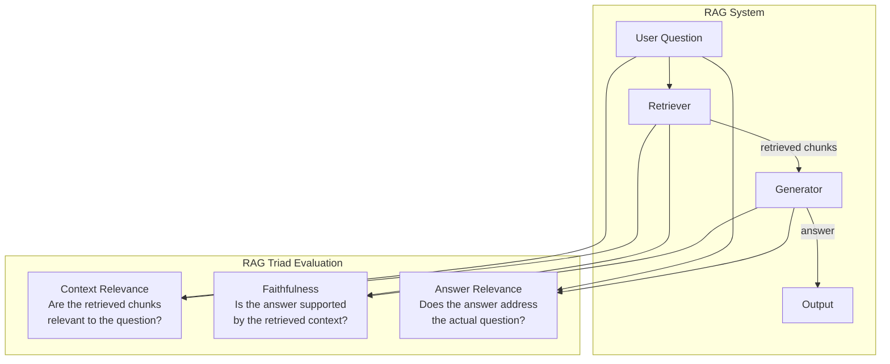
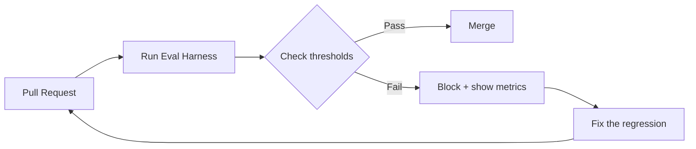

# RAG Evaluation

> "It seems to work" ships broken RAG. The RAG Triad gives you three numbers that don't lie.

**Type:** Build
**Languages:** Python
**Prerequisites:** Lessons 01–09 (Embeddings through Citation Grounding)
**Time:** ~90 minutes
**Phase:** 02 · Retrieval & RAG

## Learning Objectives

- Explain why qualitative evaluation fails for RAG and what the RAG Triad measures instead
- Implement LLM-as-judge for all three RAG Triad components from scratch
- Build a `RagEvaluator` class that returns a structured score dict
- Construct a minimal eval set and run it against a sample RAG pipeline
- Calibrate your LLM judge against human labels before trusting its scores
- Integrate the eval harness into a CI pipeline with a threshold-based pass/fail check

---

## The Problem

Your RAG system works fine in your demos. The answers sound good. They're fluent and confident. Users seem satisfied in your beta. Then you ship to production and support tickets start coming in: wrong answers, answers that miss the point entirely, answers that confidently say things your documents never said.

The problem is that qualitative evaluation: "I read some outputs and they look reasonable": has a 100% false positive rate on demo queries. Demo queries are easy: short, unambiguous, directly matched by your corpus. Production queries are adversarial: long, ambiguous, full of synonyms, referencing things your corpus mentions obliquely or not at all.

The failure modes of RAG are specifically **silent**:

- **Wrong chunk retrieved**: The answer addresses a related but different question. Sounds plausible, fails the user.
- **Hallucinated citation**: The answer cites a source that says something different. Looks grounded, isn't.
- **Adjacent answer**: The retriever found a relevant document but the LLM answered a nearby question, not the actual one. Semantically close, factually wrong for this user.
- **High-perplexity fluency**: A sophisticated LLM will produce a beautifully written answer that is completely wrong. The writing quality tells you nothing about factual accuracy.

None of these failures are visible from casual reading. You need numbers. The RAG Triad gives you three numbers that diagnose where your system is breaking.

---

## The Concept

### The RAG Triad

The RAG Triad was operationalized by the RAGAS project and is closely associated with Hamel Husain's writing on evaluating RAG systems in production. It defines three dimensions of quality that together cover the major failure modes:



**Faithfulness** (Generator quality, given retrieval)

*Definition:* For every claim in the answer, is it entailed by the retrieved context? A score of 1 means every claim can be traced to the retrieved chunks. A score of 0 means the answer is substantially fabricated.

*What it catches:* LLM hallucination. The model retrieved relevant documents but invented facts beyond what those documents say.

*How to measure:* LLM-as-judge. Decompose the answer into atomic claims. For each claim, ask a judge LLM: "Is this claim supported by the following context?" Score is fraction of claims supported.

**Answer Relevance** (Generator quality, given context)

*Definition:* Does the answer address the user's actual question? A score of 1 means the answer is on-point. A score of 0 means the answer is fluent but doesn't address what was asked.

*What it catches:* Adjacent-answer failures. The system produced an answer, but it's the answer to a different (usually related) question.

*How to measure:* LLM-as-judge or, elegantly, embed the answer and measure cosine similarity to the original question: answers to the question will embed nearby the question; adjacent answers won't.

**Context Relevance** (Retriever quality)

*Definition:* For each retrieved chunk, does it contain information relevant to answering the question? Score is the fraction of retrieved chunks that are relevant.

*What it catches:* Retriever failures. The generator did fine with what it was given, but what it was given was mostly noise. This is the most important metric for diagnosing retrieval problems.

*How to measure:* LLM-as-judge. For each (question, chunk) pair, ask: "Is this chunk relevant to answering the question?"

### The Diagnostic Matrix

The three scores together form a diagnostic matrix:

| Faithfulness | Answer Relevance | Context Relevance | Diagnosis |
|---|---|---|---|
| High | High | High | System is working |
| Low | High | High | Generator hallucinating despite good retrieval |
| High | Low | High | Generator answering adjacent question |
| Low | Low | Low | Retriever is broken; everything downstream fails |
| High | High | Low | Getting lucky: irrelevant chunks aren't hurting yet |
| Any | Low | Low | Fix retrieval first; generator can't win |

Read the table from right to left: if context relevance is low, fix the retriever before touching anything else. The generator cannot produce good answers from bad context, no matter how good the model is.

### LLM-as-Judge

LLM-as-judge uses a capable LLM to evaluate another LLM's output. It works because the evaluation task is semantic understanding: exactly what LLMs are good at. An LLM judge can evaluate hundreds of responses in the time a human can evaluate one.

The trade-off is reliability. LLM judges have biases:
- **Verbosity bias**: longer answers score higher
- **Self-consistency bias**: a model from the same family as the generator may agree too easily
- **Position bias**: the judge may favor the first option presented

Calibrate before you trust: score 20 examples with both the judge and a human. If agreement is < 85%, your judge prompt needs work. If calibration is fine, you can trust the judge at scale.

### Building Your Eval Set

**The most important thing in RAG evaluation is the eval set, not the metrics.**

Rules for a good eval set:

1. **Use real queries from your use case.** Don't generate synthetic queries from the same LLM you're evaluating. You'll create a circular system that can only detect failures your generator already knows about.

2. **Include failure-inducing queries.** Deliberately seed queries that stress-test your retriever (long queries, paraphrase queries, queries that require multi-chunk synthesis) and your generator (queries where the context partially answers the question, queries where the obvious answer is wrong).

3. **Label expected answers or relevant chunks.** For each query, write down (or have a domain expert write down) what a correct answer looks like, or which specific chunks should be retrieved. This is your ground truth.

4. **20–50 queries is enough to start.** Don't wait for 1000. Run evals early with 20 queries, find the worst failures, fix them, re-evaluate.

### Error Analysis First

Before running any automated metrics, do this: **manually read 20–50 traces.** A trace is the full record of one query: what was retrieved, what the generator produced, the final response.

For each trace, categorize the failure type:
- Wrong retrieval (retriever returned unhelpful chunks)
- Hallucination (answer added facts not in chunks)
- Partial answer (chunks contained the answer but generator missed it)
- Refusal/abstention (system refused when it should have answered)
- Adjacent answer (correct topic, wrong specific answer)

This taxonomy becomes your metric suite. Don't let anyone sell you a generic eval suite before you've done this work. Your failure modes are specific to your use case.

### RAGAS: The Library

RAGAS (Retrieval Augmented Generation Assessment) is the canonical Python library for automated RAG evaluation. It implements the RAG Triad and several additional metrics out of the box. The "Use It" section below shows the RAGAS interface.

### CI Integration

Every time you change a prompt, a retriever parameter, or a chunk strategy, re-run your eval harness. If faithfulness drops below your threshold, fail the build. This is the only way to ship RAG improvements without regressing on the dimensions you've already optimized.



---

## Build It

### Step 1: Define the Eval Data Structure

```python
# pip install openai

from dataclasses import dataclass, field
from typing import Optional
import os
from openai import OpenAI

@dataclass
class EvalExample:
    """One unit of evaluation data."""
    question: str
    context: list[str]   # List of retrieved chunk texts
    answer: str          # The generated answer to evaluate
    expected_answer: Optional[str] = None  # Ground truth (optional for some metrics)

@dataclass
class TriadScores:
    """Structured output from a full RAG Triad evaluation."""
    faithfulness: float           # 0.0–1.0
    answer_relevance: float       # 0.0–1.0
    context_relevance: float      # 0.0–1.0

    # Optional: per-chunk context relevance breakdown
    context_relevance_per_chunk: list[float] = field(default_factory=list)
    # Optional: detailed faithfulness (per-claim scores)
    faithfulness_claims: list[dict] = field(default_factory=list)
```

### Step 2: LLM-as-Judge for Faithfulness

```python
FAITHFULNESS_SYSTEM = """You are an objective evaluator assessing whether a given answer
is faithful to (supported by) the provided context.

Your task:
1. Identify each distinct factual claim in the ANSWER.
2. For each claim, determine if the CONTEXT contains information that supports it.
3. Return a JSON object with this exact structure:
{
  "claims": [
    {
      "claim": "exact text of the claim",
      "supported": true or false,
      "reason": "brief reason"
    }
  ],
  "faithfulness_score": 0.0  // fraction of claims that are supported (0.0-1.0)
}

Important: Only mark a claim as supported if the CONTEXT directly entails it.
Do not mark a claim supported just because it sounds plausible or is generally true."""


def score_faithfulness(
    question: str,
    context: list[str],
    answer: str,
    client: OpenAI,
    model: str = "gpt-4o-mini",
) -> dict:
    """
    LLM-as-judge: score whether the answer is supported by the context.
    Returns a dict with 'faithfulness_score' (float) and 'claims' (list).
    """
    import json

    context_text = "\n\n---\n\n".join(
        f"[Chunk {i+1}]: {chunk}" for i, chunk in enumerate(context)
    )

    user_message = f"""QUESTION: {question}

CONTEXT:
{context_text}

ANSWER:
{answer}

Evaluate whether each claim in the ANSWER is supported by the CONTEXT."""

    response = client.chat.completions.create(
        model=model,
        messages=[
            {"role": "system", "content": FAITHFULNESS_SYSTEM},
            {"role": "user", "content": user_message},
        ],
        temperature=0.0,
        response_format={"type": "json_object"},
    )

    try:
        result = json.loads(response.choices[0].message.content)
        return result
    except json.JSONDecodeError:
        return {"faithfulness_score": 0.0, "claims": [], "error": "parse_failed"}
```

> **Real-world check:** We're using an AI to evaluate another AI. Isn't that just asking one liar to check the other liar's work? How do we know the judge isn't just agreeing with whatever the generator says?

### Step 3: LLM-as-Judge for Answer Relevance

```python
ANSWER_RELEVANCE_SYSTEM = """You are an objective evaluator assessing whether a given
answer actually addresses the user's question.

Your task: Rate how well the ANSWER addresses the QUESTION on a scale of 0 to 1.

Scoring guide:
- 1.0: The answer directly and completely addresses the question
- 0.7-0.9: The answer addresses the question but misses some aspects
- 0.4-0.6: The answer is related to the topic but doesn't address the specific question
- 0.1-0.3: The answer is on a different (though related) topic
- 0.0: The answer is completely off-topic or a refusal when the question is answerable

Return a JSON object:
{
  "answer_relevance_score": 0.0,
  "reasoning": "brief explanation of the score"
}"""


def score_answer_relevance(
    question: str,
    answer: str,
    client: OpenAI,
    model: str = "gpt-4o-mini",
) -> dict:
    """
    LLM-as-judge: score whether the answer addresses the question.
    Returns a dict with 'answer_relevance_score' (float) and 'reasoning' (str).
    """
    import json

    user_message = f"""QUESTION: {question}

ANSWER: {answer}

Rate how well the answer addresses the question."""

    response = client.chat.completions.create(
        model=model,
        messages=[
            {"role": "system", "content": ANSWER_RELEVANCE_SYSTEM},
            {"role": "user", "content": user_message},
        ],
        temperature=0.0,
        response_format={"type": "json_object"},
    )

    try:
        result = json.loads(response.choices[0].message.content)
        return result
    except json.JSONDecodeError:
        return {"answer_relevance_score": 0.0, "reasoning": "parse_failed"}
```

### Step 4: LLM-as-Judge for Context Relevance

```python
CONTEXT_RELEVANCE_SYSTEM = """You are an objective evaluator assessing whether retrieved
context chunks are relevant to a given question.

For each chunk, determine if it contains information that would help answer the question.
Return a JSON object:
{
  "chunk_scores": [
    {
      "chunk_index": 0,
      "relevant": true or false,
      "relevance_score": 0.0,  // 0.0-1.0
      "reasoning": "brief reason"
    }
  ],
  "context_relevance_score": 0.0  // mean relevance across all chunks
}

A chunk is relevant if it:
- Directly answers the question, OR
- Contains information needed to construct the answer

A chunk is NOT relevant if it merely mentions a keyword from the question
without actually helping answer it."""


def score_context_relevance(
    question: str,
    context: list[str],
    client: OpenAI,
    model: str = "gpt-4o-mini",
) -> dict:
    """
    LLM-as-judge: score whether retrieved chunks are relevant to the question.
    Returns a dict with 'context_relevance_score' (float) and 'chunk_scores' (list).
    """
    import json

    chunks_text = "\n\n".join(
        f"[Chunk {i}]: {chunk}" for i, chunk in enumerate(context)
    )

    user_message = f"""QUESTION: {question}

RETRIEVED CHUNKS:
{chunks_text}

Evaluate the relevance of each chunk for answering this question."""

    response = client.chat.completions.create(
        model=model,
        messages=[
            {"role": "system", "content": CONTEXT_RELEVANCE_SYSTEM},
            {"role": "user", "content": user_message},
        ],
        temperature=0.0,
        response_format={"type": "json_object"},
    )

    try:
        result = json.loads(response.choices[0].message.content)
        return result
    except json.JSONDecodeError:
        return {"context_relevance_score": 0.0, "chunk_scores": [], "error": "parse_failed"}
```

### Step 5: The RagEvaluator Class

```python
class RagEvaluator:
    """
    Full RAG Triad evaluator.

    Evaluates faithfulness, answer relevance, and context relevance
    using LLM-as-judge for each component.
    """

    def __init__(self, model: str = "gpt-4o-mini", api_key: Optional[str] = None):
        self.model = model
        self.client = OpenAI(api_key=api_key or os.environ.get("OPENAI_API_KEY"))

    def evaluate(self, example: EvalExample) -> dict:
        """
        Run all three RAG Triad judges on one example.

        Returns a flat dict with scores and details:
        {
          "faithfulness": float,
          "answer_relevance": float,
          "context_relevance": float,
          "details": { ... raw judge outputs ... }
        }
        """
        faith_result = score_faithfulness(
            example.question, example.context, example.answer,
            self.client, self.model
        )
        relevance_result = score_answer_relevance(
            example.question, example.answer,
            self.client, self.model
        )
        context_result = score_context_relevance(
            example.question, example.context,
            self.client, self.model
        )

        return {
            "faithfulness": faith_result.get("faithfulness_score", 0.0),
            "answer_relevance": relevance_result.get("answer_relevance_score", 0.0),
            "context_relevance": context_result.get("context_relevance_score", 0.0),
            "details": {
                "faithfulness": faith_result,
                "answer_relevance": relevance_result,
                "context_relevance": context_result,
            }
        }

    def evaluate_batch(self, examples: list[EvalExample]) -> dict:
        """
        Evaluate a list of examples and return aggregate statistics.

        Returns:
        {
          "mean_faithfulness": float,
          "mean_answer_relevance": float,
          "mean_context_relevance": float,
          "per_example": list[dict],
          "n": int
        }
        """
        results = []
        for i, example in enumerate(examples):
            print(f"  Evaluating example {i+1}/{len(examples)}: {example.question[:50]}...")
            result = self.evaluate(example)
            results.append({"question": example.question, **result})

        n = len(results)
        mean_faith = sum(r["faithfulness"] for r in results) / n
        mean_relevance = sum(r["answer_relevance"] for r in results) / n
        mean_context = sum(r["context_relevance"] for r in results) / n

        return {
            "mean_faithfulness": mean_faith,
            "mean_answer_relevance": mean_relevance,
            "mean_context_relevance": mean_context,
            "per_example": results,
            "n": n,
        }

    def check_thresholds(
        self,
        scores: dict,
        min_faithfulness: float = 0.8,
        min_answer_relevance: float = 0.75,
        min_context_relevance: float = 0.7,
    ) -> dict:
        """
        Check whether aggregate scores meet minimum thresholds.
        Use this in CI: if result["passed"] is False, fail the build.
        """
        checks = {
            "faithfulness": (scores["mean_faithfulness"], min_faithfulness),
            "answer_relevance": (scores["mean_answer_relevance"], min_answer_relevance),
            "context_relevance": (scores["mean_context_relevance"], min_context_relevance),
        }

        failures = []
        for metric, (score, threshold) in checks.items():
            if score < threshold:
                failures.append(f"{metric}: {score:.3f} < {threshold} (threshold)")

        return {
            "passed": len(failures) == 0,
            "failures": failures,
            "scores": {k: v[0] for k, v in checks.items()},
        }
```

### Step 6: Sample Eval Set and Run

```python
# Sample eval set: 5 (question, context, answer) triples
# In production, derive these from real user queries and your actual RAG pipeline output

SAMPLE_EVAL_SET = [
    EvalExample(
        question="What is RAG and why is it useful?",
        context=[
            "Retrieval-Augmented Generation (RAG) combines a retrieval system "
            "with a language model. Instead of relying solely on parametric memory, "
            "the model retrieves relevant documents at inference time.",
            "RAG enables language models to access up-to-date information without "
            "retraining. This makes it especially useful for enterprise knowledge bases "
            "where documents change frequently.",
        ],
        answer=(
            "RAG stands for Retrieval-Augmented Generation. It combines retrieval with "
            "generation, allowing language models to access external documents at "
            "inference time rather than relying purely on training data [1]. This is "
            "useful because it enables up-to-date information access without retraining [2]."
        ),
    ),
    EvalExample(
        question="How does dense retrieval differ from BM25?",
        context=[
            "BM25 is a sparse retrieval algorithm based on term frequency and inverse "
            "document frequency. It works well for keyword-heavy queries.",
            "Dense retrieval encodes queries and documents as continuous vectors and "
            "retrieves by nearest neighbor search. It handles synonyms and paraphrases "
            "better than BM25.",
        ],
        answer=(
            "Dense retrieval uses neural encoders to create vector representations, "
            "enabling semantic matching. BM25 uses exact term matching with TF-IDF "
            "weighting. Dense retrieval handles paraphrases better while BM25 excels "
            "at keyword-specific queries."
        ),
    ),
    EvalExample(
        question="What are the main failure modes of RAG systems?",
        context=[
            "Common RAG failure modes include: retrieval failure (wrong chunks returned), "
            "hallucination (generator adds facts not in context), and truncation (relevant "
            "information is cut off by context window limits).",
        ],
        answer=(
            "RAG can fail through retrieval (returning wrong chunks), generation "
            "(hallucinating beyond the context), and context truncation. "
            "Additionally, the system may answer adjacent questions instead of the "
            "actual one asked."  # Last sentence not in context: faithfulness test
        ),
    ),
    EvalExample(
        question="What does faithfulness measure in RAG evaluation?",
        context=[
            "Faithfulness measures whether the generated answer is entailed by the "
            "retrieved context. A faithfulness score of 1.0 means every claim in the "
            "answer can be traced back to the provided chunks.",
        ],
        answer=(
            "Faithfulness measures whether each claim in the answer is supported by "
            "the retrieved context, not by the model's training data."
        ),
    ),
    EvalExample(
        question="What is the capital of France?",  # Out-of-scope
        context=[
            "The Eiffel Tower is a wrought-iron lattice tower in Paris, built in 1887-1889.",
            "France is a country in Western Europe with a population of approximately 68 million.",
        ],
        answer="The capital of France is Paris.",  # Answer not supported by context
    ),
]
```

---

## Use It

**RAGAS** is the production library for this. Install it and swap it in for your judge implementations:

```python
# pip install ragas
from ragas import evaluate
from ragas.metrics import (
    faithfulness,
    answer_relevancy,
    context_precision,
    context_recall,
)
from datasets import Dataset

# Build a HuggingFace Dataset from your eval set
data = {
    "question": [e.question for e in SAMPLE_EVAL_SET],
    "answer": [e.answer for e in SAMPLE_EVAL_SET],
    "contexts": [e.context for e in SAMPLE_EVAL_SET],
    # "ground_truth": [...],  # needed for recall metrics
}

dataset = Dataset.from_dict(data)

result = evaluate(
    dataset=dataset,
    metrics=[faithfulness, answer_relevancy, context_precision],
)

print(result)
# Output: {'faithfulness': 0.85, 'answer_relevancy': 0.92, 'context_precision': 0.78}
```

RAGAS handles the judge prompts, parsing, and aggregation. Use the raw implementation from "Build It" when you need full control over the judge prompts or want to inspect individual claim-level scores.

> **Perspective shift:** Building this eval harness took a full day and our sprint is already behind. How do you justify this time investment to stakeholders who just want the product shipped?

---

## Ship It

The artifact from this lesson is the eval harness in `outputs/skill-rag-eval-harness.md`. It documents the full eval loop as a skill: how to build the eval set, write judge prompts, run evals, interpret results, and decide what to fix.

**Production integration pattern:**

```python
# In your CI pipeline (e.g., GitHub Actions pre-merge check):

def ci_eval_check():
    evaluator = RagEvaluator()
    scores = evaluator.evaluate_batch(SAMPLE_EVAL_SET)
    check = evaluator.check_thresholds(scores)

    if not check["passed"]:
        print("RAG EVAL FAILED:")
        for failure in check["failures"]:
            print(f"  - {failure}")
        sys.exit(1)

    print(f"RAG EVAL PASSED: {check['scores']}")
```

Add `min_faithfulness=0.8` as a hard gate. Faithfulness dropping below 0.8 means your generator is hallucinating 1 in 5 claims: that's too high for any production use case.

---

## Evaluate It

Here's the meta-question: how do you know your evaluator is good?

**Calibrate the judge against human labels.** This is the only way.

1. Take 20 examples from your eval set.
2. For each one, have a human score faithfulness (0 or 1 per claim), answer relevance (0–1 overall), and context relevance (0 or 1 per chunk).
3. Run your LLM judge on the same 20 examples.
4. Compute agreement: for each metric, what fraction of judgments match?

```python
def calibrate_judge(human_scores: list[float], judge_scores: list[float]) -> dict:
    """
    Compute agreement between human scores and LLM judge scores.
    Uses 0.5 as the threshold for converting floats to binary labels.
    """
    assert len(human_scores) == len(judge_scores)
    n = len(human_scores)

    # Binary agreement (both above or both below 0.5)
    agreements = sum(
        1 for h, j in zip(human_scores, judge_scores)
        if (h >= 0.5) == (j >= 0.5)
    )
    agreement_rate = agreements / n

    # Mean absolute error
    mae = sum(abs(h - j) for h, j in zip(human_scores, judge_scores)) / n

    return {
        "agreement_rate": agreement_rate,
        "mean_absolute_error": mae,
        "n": n,
        "trustworthy": agreement_rate >= 0.85,
    }
```

If agreement rate is < 85%, your judge prompt is not calibrated for your domain. Common fixes:
- Add examples of correct and incorrect judgments to the judge prompt (few-shot)
- Decompose the scoring more finely (break "faithfulness" into per-sentence scoring rather than holistic)
- Use a stronger judge model (gpt-4o instead of gpt-4o-mini)

---

## Exercises

1. **Easy:** Run the `RagEvaluator` on the five `SAMPLE_EVAL_SET` examples and print a formatted report showing each question, its three scores, and a diagnosis (which RAG Triad dimension is lowest for each question).

2. **Medium:** Implement judge calibration. Create 10 (question, context, answer) triples with hand-assigned faithfulness scores (0.0 = no claims supported, 1.0 = all claims supported). Run the LLM judge on the same 10 examples. Compute agreement rate. If agreement is < 85%, modify the judge prompt and re-run until you hit the target.

3. **Hard:** Build a RAGAS-style evaluation pipeline that tracks scores over multiple "versions" of a RAG system. Version 1: top-k=3 retrieval. Version 2: top-k=5. Version 3: add reranking. For each version, run the eval harness and produce a comparison table. Write a 200-word interpretation of which version wins on which metrics and why.

---

## Key Terms

| Term | What people say | What it actually means |
|------|----------------|------------------------|
| RAG Triad | "The three RAG metrics" | Faithfulness, answer relevance, and context relevance: three independent dimensions that together cover the major failure modes of RAG systems |
| Faithfulness | "Is the answer grounded?" | The fraction of claims in the generated answer that are directly entailed by (provably supported by) the retrieved context |
| Answer relevance | "Does the answer address the question?" | A semantic measure of whether the response answers the actual question posed, not merely a related question |
| Context relevance | "Did the retriever do its job?" | The fraction of retrieved chunks that contain information useful for answering the question; low scores indicate retriever failures |
| LLM-as-judge | "Using an LLM to evaluate another LLM" | A pattern where a capable LLM evaluates the output quality of a target system, using carefully designed prompts to produce calibrated scores |
| Calibration | "Does the judge agree with humans?" | The process of measuring judge-to-human agreement on a labeled test set; a judge is trustworthy when agreement rate ≥ 85% |
| RAGAS | "The RAG eval library" | An open-source Python library that operationalizes the RAG Triad with production-ready judge prompts and aggregation |
| Error analysis | "Manual trace review" | The practice of reading raw traces (query + retrieved chunks + generated answer) before building automated metrics, to understand the taxonomy of actual failures |

---

## Further Reading

- [RAGAS: Automated Evaluation of Retrieval Augmented Generation](https://arxiv.org/abs/2309.15217): The paper introducing the RAG Triad framework and automated scoring; essential reading before deploying any evaluation harness
- [Hamel Husain: Your AI Product Needs Evals](https://hamel.dev/blog/posts/evals/): Practitioner's guide to building evaluation pipelines; the source of the "error analysis first" principle in this lesson
- [Judging LLM-as-a-Judge with MT-Bench](https://arxiv.org/abs/2306.05685): Systematic study of LLM judge quality, biases, and calibration; know these biases before you ship a judge
- [RAGAS Documentation](https://docs.ragas.io): Implementation reference for the RAGAS library; covers all metrics and how to integrate with LangChain and LlamaIndex
- [Benchmarking LLMs for RAG](https://arxiv.org/abs/2401.15884): Comprehensive evaluation of which LLMs work best as generators in RAG pipelines, benchmarked on the RAG Triad
- [Continuous Eval: Open-Source Library for RAG Evaluation](https://github.com/relari-ai/continuous-eval): Alternative to RAGAS with additional metrics and CI integration patterns
