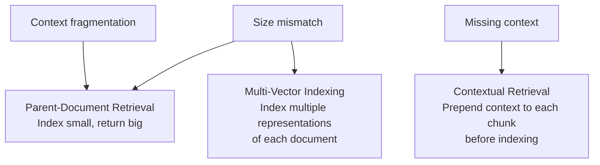

# RAG المتقدّم (Advanced RAG)

> RAG الساذج يسترجع مقطعًا. RAG المتقدّم يسترجع المقطع الصحيح: أو المقطع الصحيح مع سياقه.

**النوع:** بناء
**اللغات:** Python
**المتطلبات:** الدروس 01–10 (من Embeddings حتى تقييم RAG)
**الوقت:** ~90 دقيقة
**المرحلة:** 02 · الاسترجاع وRAG

## أهداف التعلّم

- تشخيص الأسباب الجذرية الثلاثة لإخفاق RAG الساذج على نطاق واسع: تجزّؤ السياق (context fragmentation)، وعدم تطابق الحجم (size mismatch)، والسياق المفقود (missing context)
- تنفيذ استرجاع المستند الأصل (parent-document retrieval): فهرسة مقاطع صغيرة، وإعادة مستندات أصل كبيرة
- تنفيذ الفهرسة متعددة المتّجهات (multi-vector indexing): توليد ملخّصات وفهرستها جنبًا إلى جنب مع المستندات الكاملة
- تنفيذ الاسترجاع السياقي (contextual retrieval) (طريقة Anthropic): إضافة سياق إلى المقاطع قبل الفهرسة
- اختيار نمط RAG المتقدّم الصحيح لعَرَض معيّن باستخدام دليل قرار مهيكل

---

## المشكلة

أطلقت RAG ساذجًا. يعمل في العروض. ثم تصبح الأسئلة أصعب.

يسأل مستخدم: "ما خلاصة تقييم المجلس للمخاطر؟" مجموعتك فيها تقرير حوكمة من 50 صفحة. الخلاصة في فقرة تمتد على مقطعين. أحدهما يحتوي على "قيّم المجلس المخاطر التالية" والآخر على "وخلص إلى أن أيًّا منها لم يتجاوز عتبة الأهمية." يسترجع RAG الساذج أحدهما أو الآخر. لا أحدهما يكفي. الإجابة تتطلب كليهما.

يسأل مستخدم آخر عن مستند من 2019. فهرست مجموعتك المستند الكامل، لكن المقطع المسترجَع يقول: "كما ذُكر أعلاه، تغيّرت المنهجية في الربع الثالث." يشير "أعلاه" إلى قسم على بُعد ثلاثة مقاطع. منزوعًا من سياقه، هذا المقطع عديم الفائدة.

يسأل مستخدم ثالث: "ماذا تقول الشركة عن مخاطر المناخ؟" قسم ذو صلة يبدأ بـ: "بخصوص الأمر المُثار في القسم السابق، رأي اللجنة هو..." هذا المقطع، مسترجَعًا منعزلًا، لا يجيب على شيء. "الأمر" و"القسم السابق" سياق اُقتُطع بالتقطيع.

الافتراض الأساسي لـRAG الساذج: أن المقطع ثابت الحجم وحدة استرجاع جيدة ووحدة توليد جيدة معًا: ينكسر بالضبط في هذه الحالات. الحل ليس نموذجًا أفضل. بل معمارية تقطيع وفهرسة أذكى.

---

## المفهوم

### لماذا يفشل RAG الساذج على نطاق واسع

ثلاثة أنماط إخفاق بنيوية:

**1. تجزّؤ السياق (Context fragmentation)**: فكرة كاملة تمتد على عدة مقاطع. كل مقطع غير مفيد بمفرده. الإجابة تتطلب قراءتها معًا. RAG الساذج يسترجع واحدًا.

**2. عدم تطابق الحجم (Size mismatch)**: الحجم الأمثل للمقطع لدقّة الاسترجاع (صغير، دقيق) يختلف عن الحجم الأمثل للتوليد (كبير، مع سياق محيط). RAG الساذج يستخدم حجمًا واحدًا لكليهما.

**3. السياق المفقود (Missing context)**: يحتوي المقطع على ضمير، أو إشارة، أو افتراض ضمني لا يكون له معنى إلا في ضوء النص المحيط. منزوعًا من مستنده، يكون المقطع ملتبسًا أو بلا معنى.

أنماط الإخفاق الثلاثة هذه تُسقَط على ثلاثة حلول معمارية:



### النمط 1: استرجاع المستند الأصل (Parent-Document Retrieval) (من الصغير إلى الكبير)

**البصيرة:** افهرس مقاطع صغيرة للمطابقة الدلالية الدقيقة. لكن حين تسترجع تطابقًا، أعِد المقطع الأصل (أو قسم المستند الكامل) إلى نموذج LLM.

**لماذا ينجح:** المقاطع الصغيرة أقلّ ضجيجًا دلاليًا: تتعلق بشيء محدد واحد، فتطابق الأسئلة بدقّة أكبر. لكن نموذج LLM يحتاج سياقًا أكبر لتوليد إجابة جيدة. تحصل على الدقّة في الاسترجاع والثراء في التوليد.

**التنفيذ:** في وقت الفهرسة، أسنِد لكل مقطع صغير `parent_id`. وحين يُسترجَع مقطع صغير، ابحث عن أصله وأعِد نص الأصل إلى النموذج بدلًا من نص الابن.

```
Index structure:
  parent_id=P1, text="Full Section: Risk Assessment [500 tokens]"
    └── child_id=C1, parent_id=P1, text="risks were assessed [100 tokens]"
    └── child_id=C2, parent_id=P1, text="none exceeded materiality [100 tokens]"

At retrieval:
  Query matches C1 (small child chunk)
  Return P1 (large parent chunk) to the LLM
```

**متى يُستخدم:** الإجابات مبتورة أو تُغفل السياق. المستندات الطويلة حيث تكون الفقرات المتجاورة مترابطة. الوثائق التقنية حيث تسبق التعريفاتُ أمثلةَ الاستخدام.

### النمط 2: الفهرسة متعددة المتّجهات (Multi-Vector Indexing)

**البصيرة:** يمكن تلخيص المستند، أو وصفه بكلمات مفتاحية، أو تحويله إلى أسئلة افتراضية يجيب عنها. افهرس كل هذه التمثيلات، لكن أعِد المستند الأصلي حين يطابق أيّ منها.

**لماذا ينجح:** تلتقط التمثيلات المختلفة جوانب مختلفة من المستند. سؤال عن "انتباه المحوّلات (transformer attention)" قد يطابق مستندًا عبر ملخّصه ("تقدّم هذه الورقة آلية انتباه جديدة") حتى لو لم تظهر تلك الكلمات بالضبط في نص المقطع الكثيف.

**تمثيلات شائعة للفهرسة:**
- **الملخّصات (Summaries)**: ملخّص من 2-3 جمل للمقطع. أفضل للأسئلة العريضة المفاهيمية.
- **الكلمات المفتاحية (Keywords)**: عبارات اسمية ومصطلحات تقنية مستخرجة من المقطع. أفضل للبحث الدقيق.
- **الأسئلة الافتراضية (HyDE)**: أسئلة سيجيب عنها هذا المقطع. أفضل لحالات استخدام الإجابة على الأسئلة.

**التنفيذ:** لكل مستند، ولّد N تمثيلًا إضافيًا باستخدام نموذج LLM. افهرس كل التمثيلات الـN+1 مع مؤشّر يعود إلى النص الأصلي.

**متى يُستخدم:** استرجاع (recall) ضعيف على أسئلة إعادة الصياغة. تحتوي المجموعة على مستندات طويلة الشكل (أوراق بحثية، تقارير) حيث تمثّل الملخّصات المحتوى أفضل من المقاطع الكثيفة. مجموعات متعددة المجالات حيث تتباين المصطلحات.

### النمط 3: الاسترجاع السياقي (Contextual Retrieval) (طريقة Anthropic)

**البصيرة:** قبل الفهرسة، أضِف إلى كل مقطع وصفًا قصيرًا لموضعه في المستند. هذا السياق يجعل المقطع ذا معنى حتى منعزلًا.

**لماذا ينجح:** حين يقول مقطع "كما ذُكر أعلاه، تغيّرت المنهجية في الربع الثالث"، فهذا إخفاق استرجاع منتظر الحدوث. لكن إن أضفت "هذا المقطع من القسم 3.2 من تقرير تدقيق الربع الثالث 2024، الذي يناقش تغييرات المنهجية المُدخَلة في ذلك الربع. القسم 3.2 يأتي بعد مناقشة قيود المنهجية السابقة"، يصبح المقطع نفسه قابلًا للاسترجاع والتفسير.

**من بحث Anthropic (سبتمبر 2024):** خفّض الاسترجاع السياقي معدّلات إخفاق الاسترجاع بنسبة 49% على معيار قياسهم. تعمل الطريقة جيدًا مع بحث BM25 الهجين (السياق يضيف كلمات مفتاحية تحسّن الاسترجاع المتفرّق) وهي مباشرة في التنفيذ كخطوة معالجة مسبقة دون اتصال (offline).

**التنفيذ:** مرّر كل مقطع عبر نموذج LLM رخيص (gpt-4o-mini أو Claude Haiku) بهذه المطالبة:

```
Here is the document: <full_document>
Chunk to contextualize: <chunk_text>
Write a 1-2 sentence context that describes where this chunk appears in the document
and what concept it is part of. Be specific about the document's structure.
```

أضِف جملة السياق إلى بداية المقطع قبل حساب تضمينه (embedding).

**متى يُستخدم:** تحتوي المقاطع على ضمائر، أو إشارات، أو سياق ضمني ("كما ذُكر أعلاه"، "باتّباع المنهجية في القسم السابق"). للمستندات بنية هرمية (تقارير، أوراق بحثية، وثائق قانونية) حيث يهمّ سياق القسم. مقاطع من جداول أو أشكال أو قوائم لا معنى لها بدون عنوانها.

### متى تُستخدم أيّ طريقة

| العَرَض | النمط | لماذا |
|---|---|---|
| إجابات مبتورة أو تُغفل السياق | المستند الأصل (Parent-Document) | استرجاع الصغير وإعادة الكبير يُصلح عدم تطابق الحجم |
| استرجاع ضعيف على أسئلة إعادة الصياغة | متعدد المتّجهات (مع ملخّصات) | الملخّصات تلتقط الأسئلة المفاهيمية التي تفوّتها المقاطع الحرفية |
| تبدو المقاطع يتيمة أو بلا سياق | الاسترجاع السياقي | السياق المُضاف يجعل كل مقطع مكتفيًا بذاته |
| للمستندات بنية معقّدة | الاسترجاع السياقي + المستند الأصل | كلاهما: أضِف سياقًا لكل مقطع، ثم أعِد الأصل عند المطابقة |
| أسئلة قصيرة دقيقة على وثائق تقنية | المستند الأصل (Parent-Document) | الأبناء الصغار = استرجاع دقيق؛ الأصل = إجابة كاملة |

---

## البناء

### الخطوة 1: إعداد الاعتماديات

```python
# pip install openai numpy sentence-transformers

import os
import uuid
from dataclasses import dataclass, field
from typing import Optional
import numpy as np
from sentence_transformers import SentenceTransformer
from openai import OpenAI
```

### الخطوة 2: تعريف هرمية المقاطع

```python
@dataclass
class ParentChunk:
    """A large chunk returned to the LLM for generation."""
    parent_id: str
    source: str
    text: str
    section: Optional[str] = None


@dataclass
class ChildChunk:
    """A small chunk indexed for precise retrieval."""
    child_id: str
    parent_id: str    # FK to ParentChunk
    text: str
    embedding: Optional[np.ndarray] = field(default=None, repr=False)
```

### الخطوة 3: تنفيذ استرجاع المستند الأصل

```python
class ParentDocRetriever:
    """
    Index small child chunks for precise retrieval.
    When a child matches, return its parent (larger context) to the LLM.

    Usage:
        retriever = ParentDocRetriever()
        retriever.add_document(parent_text, child_texts, source="doc.pdf")
        results = retriever.retrieve(query, top_k=3)
        # results contains parent chunks, not child chunks
    """

    def __init__(self, model_name: str = "all-MiniLM-L6-v2"):
        self.model = SentenceTransformer(model_name)
        self.parents: dict[str, ParentChunk] = {}  # parent_id → ParentChunk
        self.children: list[ChildChunk] = []

    def _split_into_children(
        self, parent_text: str, child_size: int = 150, overlap: int = 20
    ) -> list[str]:
        """Split a parent chunk into smaller child chunks by word count."""
        words = parent_text.split()
        children = []
        start = 0
        while start < len(words):
            end = start + child_size
            children.append(" ".join(words[start:end]))
            start += child_size - overlap
        return children

    def add_document(
        self,
        parent_text: str,
        source: str,
        section: Optional[str] = None,
        child_size: int = 150,
    ) -> str:
        """
        Add a document section. Split it into children, index children,
        keep parent for retrieval.
        Returns the parent_id.
        """
        parent_id = str(uuid.uuid4())[:8]
        self.parents[parent_id] = ParentChunk(
            parent_id=parent_id,
            source=source,
            text=parent_text,
            section=section,
        )

        child_texts = self._split_into_children(parent_text, child_size)
        embeddings = self.model.encode(child_texts, normalize_embeddings=True)

        for i, (text, emb) in enumerate(zip(child_texts, embeddings)):
            self.children.append(ChildChunk(
                child_id=f"{parent_id}-c{i}",
                parent_id=parent_id,
                text=text,
                embedding=emb,
            ))

        return parent_id

    def retrieve(self, query: str, top_k: int = 3) -> list[ParentChunk]:
        """
        Retrieve child chunks by semantic similarity, deduplicate by parent,
        return parent chunks.
        """
        if not self.children:
            return []

        query_emb = self.model.encode([query], normalize_embeddings=True)[0]
        child_embeddings = np.stack([c.embedding for c in self.children])

        # Cosine similarity (vectors are normalized, so dot product = cosine sim)
        scores = child_embeddings @ query_emb

        # Get top matches, deduplicate by parent_id
        ranked = sorted(zip(scores, self.children), key=lambda x: x[0], reverse=True)
        seen_parents = set()
        result_parents = []

        for score, child in ranked:
            if child.parent_id not in seen_parents:
                seen_parents.add(child.parent_id)
                result_parents.append(self.parents[child.parent_id])
            if len(result_parents) >= top_k:
                break

        return result_parents
```

> **اختبار من الواقع:** كان RAG الأساسي لدينا يجيب أصلًا على 80% من الأسئلة بشكل صحيح. ما الذي يشتريه لنا فعلًا التعقيد الإضافي لاسترجاع المستند الأصل؟ هل تستحق الـ20% تغيير المعمارية؟

### الخطوة 4: تنفيذ الفهرسة متعددة المتّجهات

```python
@dataclass
class MultiVectorDoc:
    """A document with multiple indexed representations."""
    doc_id: str
    source: str
    full_text: str
    summary: str = ""
    # embeddings keyed by representation type
    embeddings: dict[str, np.ndarray] = field(default_factory=dict, repr=False)


class MultiVectorRetriever:
    """
    Index multiple representations per document (full text + summary).
    Retrieve by any representation, return the full document.

    Usage:
        retriever = MultiVectorRetriever()
        retriever.add_document(text, source="paper.pdf")
        results = retriever.retrieve(query, top_k=3)
    """

    def __init__(
        self,
        embed_model: str = "all-MiniLM-L6-v2",
        llm_model: str = "gpt-4o-mini",
    ):
        self.embed_model = SentenceTransformer(embed_model)
        self.llm_model = llm_model
        self.client = OpenAI(api_key=os.environ.get("OPENAI_API_KEY"))
        self.docs: dict[str, MultiVectorDoc] = {}
        # Index: list of (doc_id, representation_type, embedding)
        self._index: list[tuple[str, str, np.ndarray]] = []

    def _generate_summary(self, text: str) -> str:
        """Use LLM to generate a 2-3 sentence summary of the text."""
        response = self.client.chat.completions.create(
            model=self.llm_model,
            messages=[{
                "role": "user",
                "content": (
                    "Write a 2-3 sentence summary of the following text. "
                    "Focus on the main claim or finding.\n\n"
                    f"Text: {text}"
                ),
            }],
            temperature=0.0,
            max_tokens=100,
        )
        return response.choices[0].message.content.strip()

    def add_document(self, text: str, source: str) -> str:
        """
        Add a document. Generates a summary, embeds both,
        indexes both representations.
        Returns doc_id.
        """
        doc_id = str(uuid.uuid4())[:8]
        summary = self._generate_summary(text)

        doc = MultiVectorDoc(doc_id=doc_id, source=source, full_text=text, summary=summary)

        # Embed both representations
        full_emb = self.embed_model.encode([text], normalize_embeddings=True)[0]
        summary_emb = self.embed_model.encode([summary], normalize_embeddings=True)[0]

        doc.embeddings = {"full_text": full_emb, "summary": summary_emb}
        self.docs[doc_id] = doc

        # Add both to the index
        self._index.append((doc_id, "full_text", full_emb))
        self._index.append((doc_id, "summary", summary_emb))

        return doc_id

    def retrieve(self, query: str, top_k: int = 3) -> list[MultiVectorDoc]:
        """
        Query against all indexed representations.
        Deduplicate by doc_id and return full documents.
        """
        if not self._index:
            return []

        query_emb = self.embed_model.encode([query], normalize_embeddings=True)[0]
        all_embeddings = np.stack([emb for _, _, emb in self._index])
        scores = all_embeddings @ query_emb

        ranked = sorted(
            zip(scores, self._index),
            key=lambda x: x[0],
            reverse=True,
        )

        seen_docs = set()
        results = []
        for score, (doc_id, rep_type, _) in ranked:
            if doc_id not in seen_docs:
                seen_docs.add(doc_id)
                results.append(self.docs[doc_id])
            if len(results) >= top_k:
                break

        return results
```

### الخطوة 5: تنفيذ الاسترجاع السياقي

```python
CONTEXTUAL_PROMPT = """<document>
{full_document}
</document>

Here is the chunk from this document that we want to situate:
<chunk>
{chunk_text}
</chunk>

Write a short context (1-2 sentences) that:
1. Describes where this chunk appears in the document (section, position)
2. Explains what broader topic or argument it is part of

Write only the context sentences. Do not repeat the chunk text. Do not explain what you are doing."""


def add_context_to_chunk(
    chunk_text: str,
    full_document: str,
    client: OpenAI,
    model: str = "gpt-4o-mini",
) -> str:
    """
    Generate a contextualizing sentence for a chunk and prepend it.

    This is Anthropic's Contextual Retrieval method (Sept 2024):
    - Reduces retrieval failure by ~49% on their benchmark
    - Runs as an offline preprocessing step (once per chunk at index time)
    - Particularly effective when combined with BM25 hybrid search
    """
    response = client.chat.completions.create(
        model=model,
        messages=[{
            "role": "user",
            "content": CONTEXTUAL_PROMPT.format(
                full_document=full_document[:4000],  # Truncate for token budget
                chunk_text=chunk_text,
            ),
        }],
        temperature=0.0,
        max_tokens=80,
    )
    context_sentence = response.choices[0].message.content.strip()
    return f"{context_sentence}\n\n{chunk_text}"


class ContextualRetriever:
    """
    Retriever that enriches each chunk with context before indexing.

    Usage:
        retriever = ContextualRetriever()
        retriever.add_document(full_doc_text, chunks, source="report.pdf")
        results = retriever.retrieve(query)
    """

    def __init__(
        self,
        embed_model: str = "all-MiniLM-L6-v2",
        llm_model: str = "gpt-4o-mini",
    ):
        self.embed_model = SentenceTransformer(embed_model)
        self.llm_model = llm_model
        self.client = OpenAI(api_key=os.environ.get("OPENAI_API_KEY"))
        self.chunks: list[dict] = []  # {chunk_id, source, raw_text, contextualized_text, embedding}

    def add_document(
        self,
        full_document: str,
        chunks: list[str],
        source: str,
        add_context: bool = True,
    ) -> None:
        """
        Add a document's chunks. If add_context=True, prepend context to each.
        """
        for i, chunk_text in enumerate(chunks):
            if add_context:
                enriched_text = add_context_to_chunk(
                    chunk_text, full_document, self.client, self.llm_model
                )
            else:
                enriched_text = chunk_text

            emb = self.embed_model.encode([enriched_text], normalize_embeddings=True)[0]
            self.chunks.append({
                "chunk_id": f"{source}-{i}",
                "source": source,
                "raw_text": chunk_text,
                "contextualized_text": enriched_text,
                "embedding": emb,
            })

    def retrieve(self, query: str, top_k: int = 3) -> list[dict]:
        """Return top-k chunks by cosine similarity."""
        if not self.chunks:
            return []

        query_emb = self.embed_model.encode([query], normalize_embeddings=True)[0]
        all_embeddings = np.stack([c["embedding"] for c in self.chunks])
        scores = all_embeddings @ query_emb

        ranked = sorted(
            zip(scores, self.chunks),
            key=lambda x: x[0],
            reverse=True,
        )[:top_k]

        return [c for _, c in ranked]
```

### الخطوة 6: المقارنة والعرض

```python
def demonstrate_parent_doc(query: str):
    """Show the difference between small-child and parent retrieval."""
    print(f"\n{'='*60}")
    print(f"PARENT-DOC RETRIEVAL DEMO")
    print(f"Query: {query}")

    parent_text = (
        "The board's Q3 risk assessment evaluated 12 distinct risk categories "
        "including market risk, operational risk, regulatory compliance risk, "
        "and reputational risk. A cross-functional risk committee reviewed each "
        "category using a two-dimensional materiality matrix: likelihood of "
        "occurrence and potential financial impact. After thorough review, the "
        "committee determined that none of the assessed risks exceeded the "
        "materiality threshold of $50M in potential impact within a 12-month "
        "horizon. The board concluded that the current risk posture is acceptable "
        "and no immediate mitigation actions are required."
    )

    retriever = ParentDocRetriever()
    retriever.add_document(parent_text, source="board-report.pdf", section="Q3 Risk Assessment")

    results = retriever.retrieve(query, top_k=1)
    if results:
        print(f"\nReturned parent chunk ({len(results[0].text.split())} words):")
        print(f"  {results[0].text[:200]}...")
    else:
        print("No results returned.")
```

---

## الاستخدام

**متى تلجأ إلى LangChain/LlamaIndex:**

الأنماط الثلاثة أعلاه كلها متاحة في أطر RAG الرئيسية:

```python
# LangChain: ParentDocumentRetriever
from langchain.retrievers import ParentDocumentRetriever
from langchain.storage import InMemoryStore
from langchain.text_splitter import RecursiveCharacterTextSplitter

child_splitter = RecursiveCharacterTextSplitter(chunk_size=200)
parent_splitter = RecursiveCharacterTextSplitter(chunk_size=800)

retriever = ParentDocumentRetriever(
    vectorstore=vectorstore,
    docstore=InMemoryStore(),
    child_splitter=child_splitter,
    parent_splitter=parent_splitter,
)
```

```python
# LlamaIndex: Multi-Vector (Summary Index + Vector Index)
from llama_index.core import SummaryIndex, VectorStoreIndex
from llama_index.core.retrievers import RouterRetriever

summary_index = SummaryIndex.from_documents(documents)
vector_index = VectorStoreIndex.from_documents(documents)
retriever = RouterRetriever.from_defaults(
    retrievers=[summary_index.as_retriever(), vector_index.as_retriever()],
)
```

استخدم التنفيذات الخام من "البناء" لفهم ما يجري تحت الغطاء. واستخدم تنفيذات أطر العمل حين تحتاج إلى استمرارية (persistence) ودفعات (batching) ومراقبة بمستوى إنتاجي.

> **نقلة في المنظور:** لدينا 5000 مستند الآن. عند أيّ نطاق يصبح من المنطقي الاستثمار في هذه الأنماط المتقدّمة مقابل مجرد تحسين المطالبة أو إضافة مزيد من المقاطع؟

---

## التسليم

دليل القرار في `outputs/skill-advanced-rag-selector.md`. بإعطاء عَرَض (إجابات مبتورة، استرجاع ضعيف، مقاطع يتيمة)، يُسقَط على النمط الصحيح ويقدّم خطوات التنفيذ.

**ملاحظات النشر:**
- استرجاع المستند الأصل لا يتطلب أي استدعاءات لنموذج LLM في وقت الاسترجاع: إنه بحث فهرس صرف بعد المطابقة. كمون مضاف صفري.
- الفهرسة متعددة المتّجهات تتطلب تمريرة نموذج LLM في وقت الفهرسة (لتوليد الملخّصات) لكن ليس في وقت الاسترجاع. تكلفة لمرة واحدة موزّعة على كل الأسئلة.
- الاسترجاع السياقي يتطلب تمريرة نموذج LLM لكل مقطع في وقت الفهرسة. لمجموعة من 10000 مقطع مع gpt-4o-mini، خصّص ~5-10 دولارات لتمريرة التسييق. أعِد الحساب فقط عند تغيّر المجموعة.

---

## التقييم

استخدم ثلاثية RAG من الدرس 10 للقياس قبل كل نمط وبعده.

**قياس التحسّن من استرجاع المستند الأصل:**
قارن صلة السياق والأمانة قبل/بعد. ينبغي أن يحسّن المستند الأصل الأمانة (سياق أكمل) دون تغيير صلة السياق كثيرًا (لا تزال تسترجع تطابقات الأبناء نفسها، فقط تعيد نصًا أكثر).

**قياس التحسّن من الاسترجاع السياقي:**
قارن صلة السياق قبل/بعد. أظهر معيار Anthropic انخفاضًا بنسبة 49% في معدّل إخفاق الاسترجاع. ينبغي أن ترى تحسّنًا واضحًا في صلة السياق، خصوصًا للأسئلة المتعلقة بالإشارات والإحالة (anaphora) ("كما ذُكر أعلاه"، "المنهجية الموصوفة...").

**قائمة فحص القياس:**

```
1. Baseline: run the RAG Triad on 20 queries → record F, AR, CR
2. Apply pattern (parent-doc OR multi-vector OR contextual)
3. Re-run the RAG Triad on the same 20 queries
4. Compare per-example, not just aggregate
5. Flag any regressions (better faithfulness but worse answer relevance?)
6. Measure latency change (contextual retrieval adds no retrieval latency)
```

---

## التمارين

1. **سهل:** عدّل `ParentDocRetriever.add_document()` ليقبل قائمة صريحة من نصوص الأبناء بدلًا من التقسيم التلقائي للأصل. هذا يمنحك تحكّمًا في حدود المقاطع. اختبر بمستند من 500 كلمة مقسّم إلى 4 أقسام معرّفة يدويًا.

2. **متوسط:** نفّذ مسترجِع نافذة الجملة (sentence-window retriever) كمتغيّر من استرجاع المستند الأصل. افهرس جملًا فردية. وحين تُسترجَع جملة، أعِد نافذة من جملتين قبلها وجملتين بعدها. قارن جودة الاسترجاع على مستند من 1000 كلمة مقابل التقطيع الساذج عند 200 كلمة.

3. **صعب:** ابنِ خط أنابيب استرجاع سياقي وقِس التحسّن. خذ 20 مقطعًا من مستند تقني. لـ10 مقاطع، أضِف سياقًا باستخدام طريقة Anthropic. ولـ10 مقاطع، افهرس بلا سياق. ابنِ 10 أسئلة يهمّ فيها السياق (تشير إلى "أعلاه"، عبارات نسبية إلى القسم). قِس معدّل الإصابة في الاسترجاع للمقاطع المُسيّقة مقابل الساذجة. أبلغ عن نسبة التحسّن.

---

## مصطلحات أساسية

| المصطلح | ما يقوله الناس | ما يعنيه فعلًا |
|------|----------------|------------------------|
| استرجاع المستند الأصل (Parent-document retrieval) | "الاسترجاع من الصغير إلى الكبير" | معمارية فهرسة تُستخدم فيها المقاطع الأبناء الصغيرة للمطابقة الدلالية الدقيقة لكن النتيجة المسترجَعة هي المقطع الأصل الأكبر، مما يوفّر سياقًا أكثر للمولّد |
| الفهرسة متعددة المتّجهات (Multi-vector indexing) | "تمثيلات متعددة لكل مستند" | توليد N تمثيلًا نصيًا مختلفًا (ملخّص، كلمات مفتاحية، أسئلة افتراضية) لكل مستند وفهرستها كلها، حتى يمكن استرجاع المستند بأيّ من جوانبه |
| الاسترجاع السياقي (Contextual retrieval) | "مقاطع Anthropic السياقية" | إضافة وصف سياق من 1-2 جملة إلى بداية كل مقطع قبل الفهرسة، مما يجعل المقاطع اليتيمة مكتفية بذاتها ويحسّن الاسترجاع بنحو 49% بحسب معيار Anthropic |
| تجزّؤ السياق (Context fragmentation) | "الإجابة تمتد على عدة مقاطع" | نمط إخفاق تُقسَّم فيه فكرة كاملة عبر حدود المقاطع، مما يجعل كل مقطع فردي غير كافٍ للإجابة على السؤال |
| عدم تطابق الحجم (Size mismatch) | "حجم الفهرسة مقابل حجم التوليد" | التوتّر الأساسي في RAG الساذج: المقاطع الصغيرة تسترجع بدقّة لكنها توفّر سياق توليد غير كافٍ؛ والمقاطع الكبيرة توفّر سياقًا جيدًا لكنها تسترجع بدقّة أقل |
| HyDE | "تضمينات المستند الافتراضي (Hypothetical Document Embeddings)" | تقنية استرجاع يولّد فيها نموذج LLM مستندًا مثاليًا افتراضيًا للسؤال، ثم يُستخدم للاسترجاع بدلًا من السؤال الخام: شكل من الاسترجاع متعدد المتّجهات في وقت السؤال |

---

## قراءات إضافية

- [Anthropic: Contextual Retrieval](https://www.anthropic.com/news/contextual-retrieval): المقال الأصلي من Anthropic الذي يصف طريقة استرجاعهم السياقي مع نتائج المعيار؛ مصدر ادعاء خفض الإخفاق بنسبة 49%
- [LangChain Parent Document Retriever](https://python.langchain.com/docs/how_to/parent_document_retriever/): مرجع تنفيذ إنتاجي مع مخازن مستندات دائمة
- [Multi-Vector Retriever](https://python.langchain.com/docs/how_to/multi_vector/): تنفيذ LangChain متعدد المتّجهات؛ يغطّي فهرسة الملخّصات وفهرسة الأسئلة الافتراضية وفهرسة المقاطع الأصغر
- [HyDE: Precise Zero-Shot Dense Retrieval without Relevance Labels](https://arxiv.org/abs/2212.10496): ورقة HyDE؛ تُظهر كيف تحسّن المستندات الافتراضية المولَّدة بنموذج LLM الاسترجاع على معايير صفرية اللقطة (zero-shot)
- [RAPTOR: Recursive Abstractive Processing for Tree-Organized Retrieval](https://arxiv.org/abs/2401.18059): متغيّر متقدّم من الفهرسة متعددة المتّجهات يبني شجرة ملخّصات بمستويات تجريد مختلفة؛ قوي على استرجاع المستندات الطويلة
- [Sentence Window Retrieval](https://docs.llamaindex.ai/en/stable/examples/node_postprocessor/MetadataReplacementDemo/): مرجع LlamaIndex لاسترجاع نافذة الجملة، متغيّر عملي من استرجاع المستند الأصل
