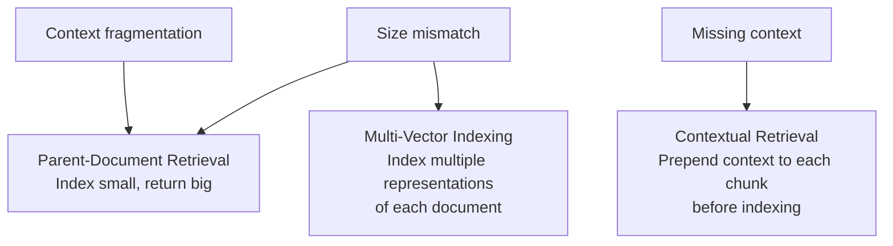

# Advanced RAG

> Naive RAG retrieves a chunk. Advanced RAG retrieves the right chunk: or the right chunk with context.

**Type:** Build
**Languages:** Python
**Prerequisites:** Lessons 01–10 (Embeddings through RAG Evaluation)
**Time:** ~90 minutes
**Phase:** 02 · Retrieval & RAG

## Learning Objectives

- Diagnose the three root causes of naive RAG failure at scale: context fragmentation, size mismatch, and missing context
- Implement parent-document retrieval: index small chunks, return large parent documents
- Implement multi-vector indexing: generate summaries and index alongside full documents
- Implement contextual retrieval (Anthropic's method): prepend context to chunks before indexing
- Choose the right advanced RAG pattern for a given symptom using a structured decision guide

---

## The Problem

You've shipped naive RAG. It works in demos. Then the queries get harder.

A user asks: "What was the conclusion of the board's risk assessment?" Your corpus has a 50-page governance report. The conclusion is in a paragraph that spans two chunks. One chunk contains "the board assessed the following risks" and the other contains "and concluded that none exceeded the materiality threshold." Naive RAG retrieves one or the other. Neither is sufficient. The answer requires both.

Another user asks about a document from 2019. Your corpus indexed the full document, but the retrieved chunk says: "As noted above, the methodology changed in Q3." The "above" refers to a section that's three chunks away. Stripped from its context, this chunk is useless.

A third user asks: "What does the company say about climate risk?" A relevant section begins: "Regarding the matter raised in the previous section, the committee's view is..." This chunk, retrieved in isolation, answers nothing. "The matter" and "the previous section" are context that was chunked away.

Naive RAG's core assumption: that a fixed-size chunk is both a good retrieval unit and a good generation unit: breaks in exactly these cases. The fix is not a better model. It's a smarter chunking and indexing architecture.

---

## The Concept

### Why Naive RAG Fails at Scale

Three structural failure modes:

**1. Context fragmentation**: A complete thought spans multiple chunks. Each chunk is individually uninformative. The answer requires reading them together. Naive RAG retrieves one.

**2. Size mismatch**: The optimal chunk size for retrieval precision (small, precise) is different from the optimal chunk size for generation (large, with surrounding context). Naive RAG uses one size for both.

**3. Missing context**: A chunk contains a pronoun, reference, or implicit assumption that only makes sense given surrounding text. Stripped from its document, the chunk is ambiguous or meaningless.

These three failure modes map to three architectural solutions:



### Pattern 1: Parent-Document Retrieval (Small-to-Big)

**Insight:** Index small chunks for precise semantic matching. But when you retrieve a match, return the parent chunk (or full document section) to the LLM.

**Why it works:** Small chunks have less semantic noise: they're about one specific thing, so they match queries more precisely. But the LLM needs more context to generate a good answer. You get precision in retrieval and richness in generation.

**Implementation:** At indexing time, assign each small chunk a `parent_id`. When a small chunk is retrieved, look up its parent and return the parent text to the LLM instead of the child text.

```
Index structure:
  parent_id=P1, text="Full Section: Risk Assessment [500 tokens]"
    └── child_id=C1, parent_id=P1, text="risks were assessed [100 tokens]"
    └── child_id=C2, parent_id=P1, text="none exceeded materiality [100 tokens]"

At retrieval:
  Query matches C1 (small child chunk)
  Return P1 (large parent chunk) to the LLM
```

**When to use:** Answers are truncated or miss context. Long documents where adjacent paragraphs are interdependent. Technical documentation where definitions precede usage examples.

### Pattern 2: Multi-Vector Indexing

**Insight:** A document can be summarized, described by keywords, or transformed into hypothetical questions it answers. Index all these representations, but return the original document when any of them matches.

**Why it works:** Different representations capture different aspects of a document. A query about "transformer attention" might match a document via its summary ("this paper introduces a new attention mechanism") even if those exact words don't appear in the dense chunk text.

**Common representations to index:**
- **Summaries**: a 2-3 sentence summary of the chunk. Better at broad, conceptual queries.
- **Keywords**: noun phrases and technical terms extracted from the chunk. Better at precise lookups.
- **Hypothetical questions** (HyDE): questions this chunk would answer. Better at question-answering use cases.

**Implementation:** For each document, generate N additional representations using an LLM. Index all N+1 representations with a pointer back to the original text.

**When to use:** Poor recall on paraphrase queries. Corpus contains long-form documents (papers, reports) where summaries better represent the content than dense chunks. Multi-domain corpora where terminology varies.

### Pattern 3: Contextual Retrieval (Anthropic's Method)

**Insight:** Before indexing, prepend each chunk with a short description of its location in the document. This context makes the chunk meaningful even in isolation.

**Why it works:** When a chunk says "As noted above, the methodology changed in Q3," that's a retrieval failure waiting to happen. But if you prepend "This chunk is from section 3.2 of the Q3 2024 audit report, which discusses methodology changes introduced in that quarter. Section 3.2 follows a discussion of the previous methodology's limitations," the same chunk becomes retrievable and interpretable.

**From Anthropic's research (September 2024):** Contextual retrieval reduced retrieval failure rates by 49% on their benchmark. The method works well with BM25 hybrid search (the context adds keywords that improve sparse retrieval) and is straightforward to implement as an offline preprocessing step.

**Implementation:** Run each chunk through a cheap LLM (gpt-4o-mini or Claude Haiku) with this prompt:

```
Here is the document: <full_document>
Chunk to contextualize: <chunk_text>
Write a 1-2 sentence context that describes where this chunk appears in the document
and what concept it is part of. Be specific about the document's structure.
```

Prepend the context sentence to the chunk before computing its embedding.

**When to use:** Chunks contain pronouns, references, or implicit context ("as described above," "following the methodology in the previous section"). Documents have hierarchical structure (reports, papers, legal documents) where section context matters. Chunks from tables, figures, or lists that are meaningless without their heading.

### When to Use Which

| Symptom | Pattern | Why |
|---|---|---|
| Answers truncated or missing context | Parent-Document | Retrieving small, returning large fixes size mismatch |
| Poor recall on paraphrase queries | Multi-Vector (with summaries) | Summaries catch conceptual queries that literal chunks miss |
| Chunks seem orphaned or context-free | Contextual Retrieval | Prepended context makes each chunk self-contained |
| Documents have complex structure | Contextual Retrieval + Parent-Doc | Both: contextualize each chunk, then return parent when matched |
| Short, precise queries over technical docs | Parent-Document | Small children = precise retrieval; parent = complete answer |

---

## Build It

### Step 1: Set Up Dependencies

```python
# pip install openai numpy sentence-transformers

import os
import uuid
from dataclasses import dataclass, field
from typing import Optional
import numpy as np
from sentence_transformers import SentenceTransformer
from openai import OpenAI
```

### Step 2: Define the Chunk Hierarchy

```python
@dataclass
class ParentChunk:
    """A large chunk returned to the LLM for generation."""
    parent_id: str
    source: str
    text: str
    section: Optional[str] = None


@dataclass
class ChildChunk:
    """A small chunk indexed for precise retrieval."""
    child_id: str
    parent_id: str    # FK to ParentChunk
    text: str
    embedding: Optional[np.ndarray] = field(default=None, repr=False)
```

### Step 3: Implement Parent-Document Retrieval

```python
class ParentDocRetriever:
    """
    Index small child chunks for precise retrieval.
    When a child matches, return its parent (larger context) to the LLM.

    Usage:
        retriever = ParentDocRetriever()
        retriever.add_document(parent_text, child_texts, source="doc.pdf")
        results = retriever.retrieve(query, top_k=3)
        # results contains parent chunks, not child chunks
    """

    def __init__(self, model_name: str = "all-MiniLM-L6-v2"):
        self.model = SentenceTransformer(model_name)
        self.parents: dict[str, ParentChunk] = {}  # parent_id → ParentChunk
        self.children: list[ChildChunk] = []

    def _split_into_children(
        self, parent_text: str, child_size: int = 150, overlap: int = 20
    ) -> list[str]:
        """Split a parent chunk into smaller child chunks by word count."""
        words = parent_text.split()
        children = []
        start = 0
        while start < len(words):
            end = start + child_size
            children.append(" ".join(words[start:end]))
            start += child_size - overlap
        return children

    def add_document(
        self,
        parent_text: str,
        source: str,
        section: Optional[str] = None,
        child_size: int = 150,
    ) -> str:
        """
        Add a document section. Split it into children, index children,
        keep parent for retrieval.
        Returns the parent_id.
        """
        parent_id = str(uuid.uuid4())[:8]
        self.parents[parent_id] = ParentChunk(
            parent_id=parent_id,
            source=source,
            text=parent_text,
            section=section,
        )

        child_texts = self._split_into_children(parent_text, child_size)
        embeddings = self.model.encode(child_texts, normalize_embeddings=True)

        for i, (text, emb) in enumerate(zip(child_texts, embeddings)):
            self.children.append(ChildChunk(
                child_id=f"{parent_id}-c{i}",
                parent_id=parent_id,
                text=text,
                embedding=emb,
            ))

        return parent_id

    def retrieve(self, query: str, top_k: int = 3) -> list[ParentChunk]:
        """
        Retrieve child chunks by semantic similarity, deduplicate by parent,
        return parent chunks.
        """
        if not self.children:
            return []

        query_emb = self.model.encode([query], normalize_embeddings=True)[0]
        child_embeddings = np.stack([c.embedding for c in self.children])

        # Cosine similarity (vectors are normalized, so dot product = cosine sim)
        scores = child_embeddings @ query_emb

        # Get top matches, deduplicate by parent_id
        ranked = sorted(zip(scores, self.children), key=lambda x: x[0], reverse=True)
        seen_parents = set()
        result_parents = []

        for score, child in ranked:
            if child.parent_id not in seen_parents:
                seen_parents.add(child.parent_id)
                result_parents.append(self.parents[child.parent_id])
            if len(result_parents) >= top_k:
                break

        return result_parents
```

> **Real-world check:** Our basic RAG was already answering 80% of questions correctly. What does the extra complexity of parent-document retrieval actually buy us? Is the 20% worth an architecture change?

### Step 4: Implement Multi-Vector Indexing

```python
@dataclass
class MultiVectorDoc:
    """A document with multiple indexed representations."""
    doc_id: str
    source: str
    full_text: str
    summary: str = ""
    # embeddings keyed by representation type
    embeddings: dict[str, np.ndarray] = field(default_factory=dict, repr=False)


class MultiVectorRetriever:
    """
    Index multiple representations per document (full text + summary).
    Retrieve by any representation, return the full document.

    Usage:
        retriever = MultiVectorRetriever()
        retriever.add_document(text, source="paper.pdf")
        results = retriever.retrieve(query, top_k=3)
    """

    def __init__(
        self,
        embed_model: str = "all-MiniLM-L6-v2",
        llm_model: str = "gpt-4o-mini",
    ):
        self.embed_model = SentenceTransformer(embed_model)
        self.llm_model = llm_model
        self.client = OpenAI(api_key=os.environ.get("OPENAI_API_KEY"))
        self.docs: dict[str, MultiVectorDoc] = {}
        # Index: list of (doc_id, representation_type, embedding)
        self._index: list[tuple[str, str, np.ndarray]] = []

    def _generate_summary(self, text: str) -> str:
        """Use LLM to generate a 2-3 sentence summary of the text."""
        response = self.client.chat.completions.create(
            model=self.llm_model,
            messages=[{
                "role": "user",
                "content": (
                    "Write a 2-3 sentence summary of the following text. "
                    "Focus on the main claim or finding.\n\n"
                    f"Text: {text}"
                ),
            }],
            temperature=0.0,
            max_tokens=100,
        )
        return response.choices[0].message.content.strip()

    def add_document(self, text: str, source: str) -> str:
        """
        Add a document. Generates a summary, embeds both,
        indexes both representations.
        Returns doc_id.
        """
        doc_id = str(uuid.uuid4())[:8]
        summary = self._generate_summary(text)

        doc = MultiVectorDoc(doc_id=doc_id, source=source, full_text=text, summary=summary)

        # Embed both representations
        full_emb = self.embed_model.encode([text], normalize_embeddings=True)[0]
        summary_emb = self.embed_model.encode([summary], normalize_embeddings=True)[0]

        doc.embeddings = {"full_text": full_emb, "summary": summary_emb}
        self.docs[doc_id] = doc

        # Add both to the index
        self._index.append((doc_id, "full_text", full_emb))
        self._index.append((doc_id, "summary", summary_emb))

        return doc_id

    def retrieve(self, query: str, top_k: int = 3) -> list[MultiVectorDoc]:
        """
        Query against all indexed representations.
        Deduplicate by doc_id and return full documents.
        """
        if not self._index:
            return []

        query_emb = self.embed_model.encode([query], normalize_embeddings=True)[0]
        all_embeddings = np.stack([emb for _, _, emb in self._index])
        scores = all_embeddings @ query_emb

        ranked = sorted(
            zip(scores, self._index),
            key=lambda x: x[0],
            reverse=True,
        )

        seen_docs = set()
        results = []
        for score, (doc_id, rep_type, _) in ranked:
            if doc_id not in seen_docs:
                seen_docs.add(doc_id)
                results.append(self.docs[doc_id])
            if len(results) >= top_k:
                break

        return results
```

### Step 5: Implement Contextual Retrieval

```python
CONTEXTUAL_PROMPT = """<document>
{full_document}
</document>

Here is the chunk from this document that we want to situate:
<chunk>
{chunk_text}
</chunk>

Write a short context (1-2 sentences) that:
1. Describes where this chunk appears in the document (section, position)
2. Explains what broader topic or argument it is part of

Write only the context sentences. Do not repeat the chunk text. Do not explain what you are doing."""


def add_context_to_chunk(
    chunk_text: str,
    full_document: str,
    client: OpenAI,
    model: str = "gpt-4o-mini",
) -> str:
    """
    Generate a contextualizing sentence for a chunk and prepend it.

    This is Anthropic's Contextual Retrieval method (Sept 2024):
    - Reduces retrieval failure by ~49% on their benchmark
    - Runs as an offline preprocessing step (once per chunk at index time)
    - Particularly effective when combined with BM25 hybrid search
    """
    response = client.chat.completions.create(
        model=model,
        messages=[{
            "role": "user",
            "content": CONTEXTUAL_PROMPT.format(
                full_document=full_document[:4000],  # Truncate for token budget
                chunk_text=chunk_text,
            ),
        }],
        temperature=0.0,
        max_tokens=80,
    )
    context_sentence = response.choices[0].message.content.strip()
    return f"{context_sentence}\n\n{chunk_text}"


class ContextualRetriever:
    """
    Retriever that enriches each chunk with context before indexing.

    Usage:
        retriever = ContextualRetriever()
        retriever.add_document(full_doc_text, chunks, source="report.pdf")
        results = retriever.retrieve(query)
    """

    def __init__(
        self,
        embed_model: str = "all-MiniLM-L6-v2",
        llm_model: str = "gpt-4o-mini",
    ):
        self.embed_model = SentenceTransformer(embed_model)
        self.llm_model = llm_model
        self.client = OpenAI(api_key=os.environ.get("OPENAI_API_KEY"))
        self.chunks: list[dict] = []  # {chunk_id, source, raw_text, contextualized_text, embedding}

    def add_document(
        self,
        full_document: str,
        chunks: list[str],
        source: str,
        add_context: bool = True,
    ) -> None:
        """
        Add a document's chunks. If add_context=True, prepend context to each.
        """
        for i, chunk_text in enumerate(chunks):
            if add_context:
                enriched_text = add_context_to_chunk(
                    chunk_text, full_document, self.client, self.llm_model
                )
            else:
                enriched_text = chunk_text

            emb = self.embed_model.encode([enriched_text], normalize_embeddings=True)[0]
            self.chunks.append({
                "chunk_id": f"{source}-{i}",
                "source": source,
                "raw_text": chunk_text,
                "contextualized_text": enriched_text,
                "embedding": emb,
            })

    def retrieve(self, query: str, top_k: int = 3) -> list[dict]:
        """Return top-k chunks by cosine similarity."""
        if not self.chunks:
            return []

        query_emb = self.embed_model.encode([query], normalize_embeddings=True)[0]
        all_embeddings = np.stack([c["embedding"] for c in self.chunks])
        scores = all_embeddings @ query_emb

        ranked = sorted(
            zip(scores, self.chunks),
            key=lambda x: x[0],
            reverse=True,
        )[:top_k]

        return [c for _, c in ranked]
```

### Step 6: Compare and Demonstrate

```python
def demonstrate_parent_doc(query: str):
    """Show the difference between small-child and parent retrieval."""
    print(f"\n{'='*60}")
    print(f"PARENT-DOC RETRIEVAL DEMO")
    print(f"Query: {query}")

    parent_text = (
        "The board's Q3 risk assessment evaluated 12 distinct risk categories "
        "including market risk, operational risk, regulatory compliance risk, "
        "and reputational risk. A cross-functional risk committee reviewed each "
        "category using a two-dimensional materiality matrix: likelihood of "
        "occurrence and potential financial impact. After thorough review, the "
        "committee determined that none of the assessed risks exceeded the "
        "materiality threshold of $50M in potential impact within a 12-month "
        "horizon. The board concluded that the current risk posture is acceptable "
        "and no immediate mitigation actions are required."
    )

    retriever = ParentDocRetriever()
    retriever.add_document(parent_text, source="board-report.pdf", section="Q3 Risk Assessment")

    results = retriever.retrieve(query, top_k=1)
    if results:
        print(f"\nReturned parent chunk ({len(results[0].text.split())} words):")
        print(f"  {results[0].text[:200]}...")
    else:
        print("No results returned.")
```

---

## Use It

**When to reach for LangChain/LlamaIndex:**

The three patterns above are all available in major RAG frameworks:

```python
# LangChain: ParentDocumentRetriever
from langchain.retrievers import ParentDocumentRetriever
from langchain.storage import InMemoryStore
from langchain.text_splitter import RecursiveCharacterTextSplitter

child_splitter = RecursiveCharacterTextSplitter(chunk_size=200)
parent_splitter = RecursiveCharacterTextSplitter(chunk_size=800)

retriever = ParentDocumentRetriever(
    vectorstore=vectorstore,
    docstore=InMemoryStore(),
    child_splitter=child_splitter,
    parent_splitter=parent_splitter,
)
```

```python
# LlamaIndex: Multi-Vector (Summary Index + Vector Index)
from llama_index.core import SummaryIndex, VectorStoreIndex
from llama_index.core.retrievers import RouterRetriever

summary_index = SummaryIndex.from_documents(documents)
vector_index = VectorStoreIndex.from_documents(documents)
retriever = RouterRetriever.from_defaults(
    retrievers=[summary_index.as_retriever(), vector_index.as_retriever()],
)
```

Use the raw implementations from "Build It" to understand what's happening under the hood. Use framework implementations when you need production-grade persistence, batching, and monitoring.

> **Perspective shift:** We have 5,000 documents right now. At what scale does it make sense to invest in these advanced patterns vs. just improving the prompt or adding more chunks?

---

## Ship It

The decision guide is in `outputs/skill-advanced-rag-selector.md`. Given a symptom (truncated answers, poor recall, orphaned chunks), it maps to the right pattern and provides implementation steps.

**Deployment notes:**
- Parent-doc retrieval requires no LLM calls at retrieval time: it's a pure index lookup after matching. Zero added latency.
- Multi-vector indexing requires an LLM pass at index time (to generate summaries) but not at retrieval time. One-time cost amortized over all queries.
- Contextual retrieval requires an LLM pass per chunk at index time. For a 10,000-chunk corpus with gpt-4o-mini, budget ~$5-10 for the contextualization pass. Recompute only when the corpus changes.

---

## Evaluate It

Use the RAG Triad from Lesson 10 to measure before and after each pattern.

**Measuring improvement from parent-doc retrieval:**
Compare context relevance and faithfulness before/after. Parent-doc should improve faithfulness (more complete context) without changing context relevance much (you're still retrieving the same child matches, just returning more text).

**Measuring improvement from contextual retrieval:**
Compare context relevance before/after. Anthropic's benchmark showed a 49% reduction in retrieval failure rate. You should see a clear improvement in context relevance, especially for queries about references and anaphora ("as noted above," "the methodology described...").

**Measurement checklist:**

```
1. Baseline: run the RAG Triad on 20 queries → record F, AR, CR
2. Apply pattern (parent-doc OR multi-vector OR contextual)
3. Re-run the RAG Triad on the same 20 queries
4. Compare per-example, not just aggregate
5. Flag any regressions (better faithfulness but worse answer relevance?)
6. Measure latency change (contextual retrieval adds no retrieval latency)
```

---

## Exercises

1. **Easy:** Modify `ParentDocRetriever.add_document()` to accept an explicit list of child texts instead of auto-splitting the parent. This gives you control over chunk boundaries. Test with a 500-word document split into 4 manually defined sections.

2. **Medium:** Implement a sentence-window retriever as a variant of parent-document retrieval. Index individual sentences. When a sentence is retrieved, return a window of 2 sentences before and 2 sentences after. Compare retrieval quality on a 1000-word document against naive chunking at 200 words.

3. **Hard:** Build a contextual retrieval pipeline and measure the improvement. Take 20 chunks from a technical document. For 10 chunks, add context using the Anthropic method. For 10 chunks, index without context. Build 10 queries where context matters (referencing "the above," section-relative statements). Measure retrieval hit rate for contextualized vs. naive chunks. Report the improvement percentage.

---

## Key Terms

| Term | What people say | What it actually means |
|------|----------------|------------------------|
| Parent-document retrieval | "Small-to-big retrieval" | An indexing architecture where small child chunks are used for precise semantic matching but the retrieved result is the larger parent chunk, providing more context to the generator |
| Multi-vector indexing | "Multiple representations per doc" | Generating N different text representations (summary, keywords, hypothetical questions) per document and indexing all of them, so the document can be retrieved by any of its facets |
| Contextual retrieval | "Anthropic's contextual chunks" | Prepending a 1-2 sentence context description to each chunk before indexing, making orphaned chunks self-contained and improving retrieval by ~49% per Anthropic's benchmark |
| Context fragmentation | "The answer spans multiple chunks" | A failure mode where a complete thought is split across chunk boundaries, making each individual chunk insufficient to answer the question |
| Size mismatch | "Indexing size vs. generation size" | The fundamental tension in naive RAG: small chunks retrieve precisely but provide insufficient generation context; large chunks provide good context but retrieve imprecisely |
| HyDE | "Hypothetical Document Embeddings" | A retrieval technique where the LLM generates a hypothetical ideal document for the query, which is then used for retrieval rather than the raw query: a form of multi-vector retrieval at query time |

---

## Further Reading

- [Anthropic: Contextual Retrieval](https://www.anthropic.com/news/contextual-retrieval): The original write-up from Anthropic describing their contextual retrieval method with benchmark results; the source for the 49% failure reduction claim
- [LangChain Parent Document Retriever](https://python.langchain.com/docs/how_to/parent_document_retriever/): Production implementation reference with persistent document stores
- [Multi-Vector Retriever](https://python.langchain.com/docs/how_to/multi_vector/): LangChain's multi-vector implementation; covers summary indexing, hypothetical question indexing, and smaller chunk indexing
- [HyDE: Precise Zero-Shot Dense Retrieval without Relevance Labels](https://arxiv.org/abs/2212.10496): The HyDE paper; shows how LLM-generated hypothetical documents improve retrieval on zero-shot benchmarks
- [RAPTOR: Recursive Abstractive Processing for Tree-Organized Retrieval](https://arxiv.org/abs/2401.18059): An advanced variant of multi-vector indexing that builds a tree of summaries at different levels of abstraction; strong on long-document retrieval
- [Sentence Window Retrieval](https://docs.llamaindex.ai/en/stable/examples/node_postprocessor/MetadataReplacementDemo/): LlamaIndex reference for sentence-window retrieval, a practical variant of parent-document retrieval
