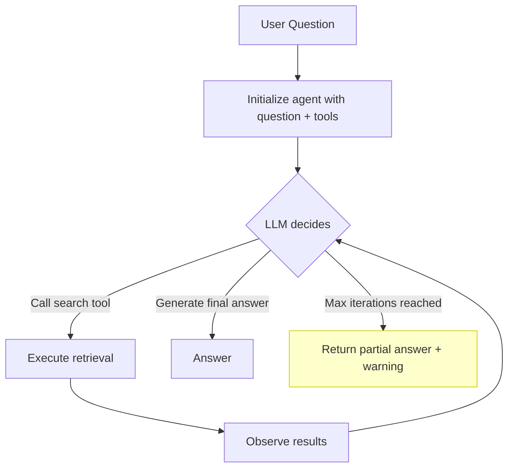

# RAG الوكيلي (Agentic RAG)

> الاسترجاع الثابت يعمل مرة واحدة دائمًا. RAG الوكيلي يسترجع بقدر ما يلزم، وعلى ما يلزم.

**النوع:** بناء
**اللغات:** Python
**المتطلبات:** الدروس 01–11 (من Embeddings حتى RAG المتقدّم)
**الوقت:** ~75 دقيقة
**المرحلة:** 02 · الاسترجاع وRAG

## أهداف التعلّم

- شرح متى يفشل RAG الثابت أحادي التمريرة وما يحلّه الاسترجاع متعدد القفزات (multi-hop retrieval)
- تنفيذ الاسترجاع كأداة (tool) قابلة للاستدعاء من وكيل (agent) نموذج LLM
- بناء حلقة وكيل تقرّر ما إذا كانت ستسترجع، وتستدعي الأداة، وتقرّر مرة أخرى
- تنفيذ سؤال متعدد القفزات يتطلب استدعاءي استرجاع متتاليين للإجابة عليه
- إضافة منظِّمات تكلفة (cost governors) (الحد الأقصى للتكرارات، ميزانية الرموز (token budget)) لمنع الاسترجاع الجامح
- قياس اكتمال الإجابة على الأسئلة متعددة القفزات مقابل RAG الساذج

---

## المشكلة

يسأل مستخدم: "ما الآثار الجانبية للميتفورمين، وهل يتفاعل أيّ منها مع أدوية ضغط الدم المذكورة في دراسة Johnson et al. 2023؟"

نظام RAG أحادي التمريرة يسترجع ثلاثة مقاطع. تصادف تلك المقاطع أن تناقش الآثار الجانبية العامة للميتفورمين. لا تذكر دراسة Johnson et al. لا تذكر أدوية ضغط دم محددة. يعيد النظام إجابة جزئية تجيب على النصف الأول من السؤال وتتجاهل النصف الثاني بصمت.

هذه هي **مشكلة القفزات المتعددة (multi-hop problem)**: السؤال يتطلب عمليتي استرجاع على الأقل: واحدة للعثور على الآثار الجانبية للميتفورمين، وواحدة لمعرفة أي أدوية ضغط درسها Johnson et al.، وربما ثالثة لإيجاد أي تفاعلات موثّقة بينها. لا تتعامل أيّ استراتيجية استرجاع ثابتة مع هذا جيدًا لأن السؤال الثاني يعتمد على نتيجة الأول.

RAG أحادي التمريرة صحيح للحالة الشائعة: استرجاع واحد، إجابة واحدة. لكن الأسئلة متعددة القفزات، وأسئلة التجميع ("ماذا تقول كل هذه المستندات عن...")، والأسئلة التي تتطلب توضيحًا، كلها تفشل في افتراض التمريرة الواحدة.

RAG الوكيلي يكسر ذلك الافتراض. يصبح نموذج LLM وكيلًا يستطيع إصدار استدعاءات استرجاع كأدوات: ملاحظة النتائج، وتقرير ما إذا كان لديه معلومات كافية، والاسترجاع مجددًا بسؤال مُحسَّن حتى يصبح جاهزًا للتوليد.

---

## المفهوم

### متى يفشل RAG الثابت

ثلاثة أنواع أسئلة لا يستطيع RAG أحادي التمريرة التعامل معها بموثوقية:

**الأسئلة متعددة القفزات (Multi-hop questions)**: تتطلب الإجابة سلسلة معلومات عبر المستندات. تحتاج المستند أ لتعرف أي كيان تبحث عنه في المستند ب.

*مثال:* "ما السياسات التي اعتمدتها الشركة بعد نتائج تدقيق 2022؟"
الخطوة 1: استرجاع تدقيق 2022 لإيجاد نتائجه. الخطوة 2: استرجاع السياسات باستخدام النتائج المحددة كمصطلحات بحث.

**أسئلة التجميع (Aggregation questions)**: تتطلب الإجابة توليف ادعاءات من عدة مستندات قد لا تتشارك المفردات.

*مثال:* "ما الإجماع على انتباه المحوّلات من الأوراق الحديثة في مجموعتي؟"
يتطلب الاسترجاع من N مستندًا والتوليف: غير قابل للتحقيق في استدعاء استرجاع واحد.

**الأسئلة التي تتطلب توضيحًا (Clarification-requiring questions)**: السؤال ملتبس، والاسترجاع الصحيح يعتمد على أي تفسير هو الصحيح.

*مثال:* "ماذا تقول السياسة عن الإنهاء؟"
إنهاء التوظيف أم إنهاء العقد؟ الاسترجاع الصحيح مختلف لكل منهما.

### الاسترجاع كأداة

النقلة المعمارية الأساسية هي معاملة الاسترجاع كأداة لنموذج LLM. بدلًا من أن يستدعي خط الأنابيب الاسترجاع مرة واحدة ويمرّر السياق للنموذج، يُعطى النموذج أداة `search` ويقرّر متى وكيف يستدعيها.

```python
# Tool definition (OpenAI function calling format)
SEARCH_TOOL = {
    "type": "function",
    "function": {
        "name": "search_documents",
        "description": (
            "Search the document corpus for information relevant to a query. "
            "Use this tool to find information before answering. "
            "Call it multiple times with different queries if needed."
        ),
        "parameters": {
            "type": "object",
            "properties": {
                "query": {
                    "type": "string",
                    "description": "A specific search query to retrieve relevant information",
                }
            },
            "required": ["query"],
        },
    },
}
```

يرى النموذج هذه الأداة ويستطيع استدعاءها بأيّ سؤال يختاره. وبعد تلقّي النتائج، يقرّر ما إذا كان سيستدعيها مجددًا (بسؤال مختلف أو مُحسَّن) أو يجيب.

### حلقة الوكيل (The Agent Loop)



تنتهي الحلقة عندما:
1. يختار النموذج عدم استدعاء أي أدوات أخرى ويولّد إجابة نهائية
2. يُبلَغ الحد الأقصى للتكرارات (منظِّم أمان)
3. تُستنفَد ميزانية الرموز (منظِّم تكلفة)

### الاسترجاع متعدد القفزات

تُمكّن حلقة الوكيل الاسترجاع متعدد القفزات الحقيقي:

```
Iteration 1:
  LLM call: "Search for the 2022 audit findings"
  Tool result: [chunks about audit findings, mentions specific control weaknesses]

Iteration 2:
  LLM call: "Search for policies addressing internal control weaknesses"
  Tool result: [chunks about revised policies from 2023]

Iteration 3:
  LLM generates answer using context from both retrievals
```

يُصاغ السؤال الثاني باستخدام معلومات من النتيجة الأولى. هذه هي القدرة الأساسية التي يفتقر إليها RAG أحادي التمريرة.

### منظِّمات التكلفة (Cost Governors)

من دون شروط توقّف، يستطيع النظام الوكيلي الاسترجاع إلى ما لا نهاية. منظِّمان:

**الحد الأقصى للتكرارات (Max iterations)**: حد صارم على عدد استدعاءات الأدوات. النموذجي: 4-6 لمعظم حالات الاستخدام. بعد الحد الأقصى، إما أن تعيد إجابة جزئية أو تثير خطأً.

**ميزانية الرموز (Token budget)**: تتبّع إجمالي الرموز في المحادثة. إن اقتربت نافذة السياق من سعتها، توقّف عن الاسترجاع. تجنّب تجاوزات نافذة السياق التي تبتر المعلومات المسترجَعة سابقًا.

**إزالة تكرار الاسترجاع (Retrieval deduplication)**: إن أصدر الوكيل سؤالين يُعيدان المقاطع نفسها (شائع حين يعيد الوكيل الصياغة دون إيجاد معلومات جديدة)، اكتشف ذلك وأوقف الحلقة. تحقّق بتضمين الأسئلة ومقارنتها: إن كان تشابه جيب التمام بين السؤال N وأي سؤال سابق > 0.9، تخطَّ الاسترجاع.

### متى لا تُستخدم RAG الوكيلي

RAG الوكيلي ليس دائمًا الحل:

| السيناريو | استخدام RAG وكيلي؟ | السبب |
|---|---|---|
| سؤال وجواب بسيط، موضوع واحد | لا | يضيف كمونًا وتكلفة بلا مكسب |
| روبوت دردشة آني (يتطلب زمن استجابة < 1 ثانية) | لا | حلقات الوكيل تضيف 2-5 ثوانٍ لكل تكرار |
| أسئلة يكفي فيها استرجاع واحد دائمًا | لا | الحمل الزائد تكلفة صرف |
| أسئلة متعددة القفزات تتطلب 2-3 استرجاعات | نعم | RAG الثابت لا يستطيع هذا |
| التجميع عبر 5+ مستندات | نعم | يستطيع الوكيل الاسترجاع تكراريًا |
| أسئلة ملتبسة تتطلب توضيحًا | نعم/ربما | يستطيع الوكيل الاسترجاع لإزالة الالتباس |

---

## البناء

### الخطوة 1: تعريف مجموعة المستندات وأداة الاسترجاع

```python
# pip install openai

import json
import os
import re
from collections import Counter
from dataclasses import dataclass, field
from typing import Optional
from openai import OpenAI

@dataclass
class Document:
    doc_id: str
    title: str
    text: str


# Sample corpus designed to require multi-hop retrieval
CORPUS = [
    Document(
        doc_id="audit-2022",
        title="2022 Internal Audit Report",
        text=(
            "The 2022 internal audit identified three material control weaknesses: "
            "(1) inadequate segregation of duties in the accounts payable process, "
            "(2) missing dual-approval controls for wire transfers above $100,000, "
            "(3) insufficient logging of privileged database access. "
            "The audit committee requested remediation plans within 90 days."
        ),
    ),
    Document(
        doc_id="policy-ap-2023",
        title="Accounts Payable Policy Update (2023)",
        text=(
            "Following the 2022 audit findings regarding accounts payable segregation, "
            "the AP policy was revised in March 2023. Key changes: all invoice approvals "
            "now require dual authorization from different cost center managers. "
            "No single approver may both initiate and approve a payment."
        ),
    ),
    Document(
        doc_id="policy-wire-2023",
        title="Wire Transfer Control Policy (2023)",
        text=(
            "In response to the audit's wire transfer finding, a new dual-approval "
            "workflow was implemented in February 2023. All wire transfers above $50,000 "
            "(down from $100,000) now require CFO sign-off. Transfers above $500,000 "
            "require both CFO and CEO authorization."
        ),
    ),
    Document(
        doc_id="metformin-overview",
        title="Metformin Clinical Overview",
        text=(
            "Metformin is a biguanide antidiabetic agent. Common side effects include "
            "gastrointestinal symptoms (nausea, diarrhea, abdominal discomfort) occurring "
            "in up to 30% of patients, particularly at initiation. Rare but serious: "
            "lactic acidosis (risk elevated in renal impairment). Metformin does not "
            "cause hypoglycemia when used as monotherapy."
        ),
    ),
    Document(
        doc_id="metformin-interactions",
        title="Metformin Drug Interaction Reference",
        text=(
            "Metformin interactions with cardiovascular drugs: ACE inhibitors and ARBs "
            "generally safe with metformin: no pharmacokinetic interaction. Diuretics "
            "(especially thiazides and loop diuretics) may reduce metformin efficacy and "
            "increase risk of volume depletion. Beta-blockers may mask hypoglycemic symptoms "
            "in combination therapy but do not interact pharmacokinetically with metformin."
        ),
    ),
    Document(
        doc_id="johnson-2023",
        title="Johnson et al. 2023: Diabetes-Hypertension Comorbidity Study",
        text=(
            "Johnson et al. (2023) examined 450 patients with type 2 diabetes and "
            "hypertension. The blood pressure medications used in the cohort included "
            "lisinopril (ACE inhibitor, 62%), amlodipine (calcium channel blocker, 28%), "
            "and hydrochlorothiazide (thiazide diuretic, 18%). The study focused on "
            "glycemic outcomes over 24 months."
        ),
    ),
]
```

### الخطوة 2: تنفيذ دالة البحث

```python
def _keyword_score(query: str, doc: Document) -> float:
    """Naive keyword overlap for demo. Replace with vector similarity in production."""
    q_tokens = set(re.findall(r'\b[a-z]+\b', query.lower()))
    d_tokens = Counter(re.findall(r'\b[a-z]+\b', (doc.title + " " + doc.text).lower()))
    overlap = sum(d_tokens[t] for t in q_tokens if t in d_tokens)
    return overlap / (len(q_tokens) + 1)


def search_corpus(query: str, corpus: list[Document], top_k: int = 2) -> list[dict]:
    """
    Search the corpus and return top-k results as JSON-serializable dicts.
    This is the function the LLM calls as a tool.
    """
    scored = [(_keyword_score(query, doc), doc) for doc in corpus]
    scored.sort(key=lambda x: x[0], reverse=True)

    results = []
    for score, doc in scored[:top_k]:
        results.append({
            "doc_id": doc.doc_id,
            "title": doc.title,
            "text": doc.text,
            "score": round(score, 3),
        })
    return results
```

### الخطوة 3: تعريف مخطّط الأداة (Tool Schema)

```python
SEARCH_TOOL = {
    "type": "function",
    "function": {
        "name": "search_documents",
        "description": (
            "Search the document corpus for information relevant to the query. "
            "Use specific, targeted queries for best results. "
            "Call multiple times with different queries to gather all needed information "
            "before writing your final answer."
        ),
        "parameters": {
            "type": "object",
            "properties": {
                "query": {
                    "type": "string",
                    "description": "A focused search query to find relevant documents.",
                }
            },
            "required": ["query"],
        },
    },
}

AGENT_SYSTEM_PROMPT = """You are a research assistant with access to a document search tool.

To answer a question:
1. Think about what information you need.
2. Use the search_documents tool to find relevant information.
3. Based on what you find, decide if you need to search for more.
4. When you have enough information, write a complete answer.

Rules:
- Always search before answering. Do not answer from memory.
- If the first search doesn't give you everything you need, search again with a more specific query.
- Cite which documents you used in your answer (by title or doc_id).
- If after multiple searches the information isn't in the corpus, say so explicitly."""
```

### الخطوة 4: بناء حلقة الوكيل

```python
@dataclass
class AgentTrace:
    """Full record of one agentic RAG execution."""
    question: str
    iterations: list[dict] = field(default_factory=list)
    final_answer: str = ""
    total_tokens: int = 0
    terminated_by: str = ""  # "agent_done" | "max_iterations" | "token_budget"


def run_agentic_rag(
    question: str,
    corpus: list[Document],
    max_iterations: int = 5,
    token_budget: int = 8000,
    model: str = "gpt-4o-mini",
    verbose: bool = True,
) -> AgentTrace:
    """
    Agentic RAG loop:
    1. LLM receives question and search tool
    2. LLM calls search tool (possibly multiple times)
    3. Each search result is appended to conversation history
    4. Loop terminates when LLM stops calling tools or limits are hit

    Returns an AgentTrace with the full conversation history and final answer.
    """
    client = OpenAI(api_key=os.environ.get("OPENAI_API_KEY"))
    trace = AgentTrace(question=question)

    messages = [
        {"role": "system", "content": AGENT_SYSTEM_PROMPT},
        {"role": "user", "content": question},
    ]

    if verbose:
        print(f"\n{'='*64}")
        print(f"QUESTION: {question}")

    for iteration in range(max_iterations):
        # Check token budget (approximate)
        estimated_tokens = sum(len(m["content"].split()) * 1.3 for m in messages if isinstance(m.get("content"), str))
        if estimated_tokens > token_budget:
            trace.terminated_by = "token_budget"
            if verbose:
                print(f"\n[STOP] Token budget exhausted ({estimated_tokens:.0f} estimated tokens)")
            break

        response = client.chat.completions.create(
            model=model,
            messages=messages,
            tools=[SEARCH_TOOL],
            tool_choice="auto",
            temperature=0.0,
        )

        message = response.choices[0].message
        trace.total_tokens += response.usage.total_tokens

        # No tool calls: agent is done
        if not message.tool_calls:
            trace.final_answer = message.content or ""
            trace.terminated_by = "agent_done"
            if verbose:
                print(f"\n[DONE] Agent finished after {iteration + 1} iteration(s)")
                print(f"Final answer:\n{trace.final_answer}")
            messages.append({"role": "assistant", "content": message.content})
            break

        # Process tool calls
        messages.append(message)

        for tool_call in message.tool_calls:
            function_name = tool_call.function.name
            args = json.loads(tool_call.function.arguments)
            query = args.get("query", "")

            if verbose:
                print(f"\n[ITER {iteration+1}] Tool call: {function_name}(query={query!r})")

            if function_name == "search_documents":
                results = search_corpus(query, corpus)
                result_text = json.dumps(results, indent=2)

                if verbose:
                    for r in results:
                        print(f"  → {r['title']} (score={r['score']})")

                trace.iterations.append({
                    "iteration": iteration + 1,
                    "query": query,
                    "results": results,
                })
            else:
                result_text = json.dumps({"error": f"Unknown tool: {function_name}"})

            messages.append({
                "role": "tool",
                "tool_call_id": tool_call.id,
                "content": result_text,
            })
    else:
        # Loop exhausted without agent finishing
        trace.terminated_by = "max_iterations"
        if verbose:
            print(f"\n[STOP] Max iterations ({max_iterations}) reached")

        # Get whatever the agent has at this point
        final_response = client.chat.completions.create(
            model=model,
            messages=messages + [
                {"role": "user", "content": "Please provide your best answer based on the information gathered so far."}
            ],
            temperature=0.0,
        )
        trace.final_answer = final_response.choices[0].message.content or ""
        trace.total_tokens += final_response.usage.total_tokens

    return trace
```

> **اختبار من الواقع:** هذا الوكيل يجري 3-4 استدعاءات API للإجابة على سؤال واحد. يتوقّع مستخدمونا إجابات في أقل من ثانيتين. هل هذا النهج قابل للتطبيق أصلًا لمنتج موجّه للعملاء، أم أنه فقط لحالات الاستخدام الخلفية (back-office)؟

### الخطوة 5: مقارنة التمريرة الواحدة مقابل القفزات المتعددة

```python
def single_pass_rag(
    question: str,
    corpus: list[Document],
    top_k: int = 3,
    model: str = "gpt-4o-mini",
) -> str:
    """Naive single-pass RAG for comparison."""
    client = OpenAI(api_key=os.environ.get("OPENAI_API_KEY"))
    results = search_corpus(question, corpus, top_k=top_k)
    context = "\n\n".join(f"[{r['title']}]\n{r['text']}" for r in results)

    response = client.chat.completions.create(
        model=model,
        messages=[
            {"role": "system", "content": "Answer the question using only the provided context."},
            {"role": "user", "content": f"Context:\n{context}\n\nQuestion: {question}"},
        ],
        temperature=0.0,
    )
    return response.choices[0].message.content
```

### الخطوة 6: ربط العرض

```python
def main():
    print("Lesson 12: Agentic RAG")
    print("=" * 64)

    # Multi-hop test questions (require 2+ retrieval steps)
    multi_hop_questions = [
        (
            "What policies did the company implement to address the issues found in the 2022 audit?",
            "Requires: (1) find audit findings, (2) find resulting policies",
        ),
        (
            "What are the side effects of metformin, and how do they interact with the "
            "blood pressure medications used in the Johnson et al. 2023 study?",
            "Requires: (1) find metformin side effects, (2) find Johnson study BP meds, (3) find interactions",
        ),
    ]

    for question, description in multi_hop_questions:
        print(f"\n{'='*64}")
        print(f"TEST: {description}")

        print("\n--- NAIVE SINGLE-PASS RAG ---")
        naive_answer = single_pass_rag(question, CORPUS)
        print(f"Answer: {naive_answer[:400]}...")

        print("\n--- AGENTIC RAG ---")
        trace = run_agentic_rag(question, CORPUS, max_iterations=5, verbose=True)
        print(f"\nTotal tokens used: {trace.total_tokens}")
        print(f"Retrieval calls: {len(trace.iterations)}")
        print(f"Terminated by: {trace.terminated_by}")

    # Show the retrieval loop table
    print_comparison_table()
```

---

## الاستخدام

تستخدم حلقة الوكيل أعلاه استدعاء الدوال (function calling) من OpenAI. النمط نفسه يعمل مع أي نموذج LLM يدعم استدعاء الأدوات. لأنظمة الإنتاج، يقدّم كل من LangChain وLlamaIndex تجريدات وكيلة فوق هذا النمط:

```python
# LangChain: create a retriever tool and wrap it in an agent
from langchain.agents import create_tool_calling_agent, AgentExecutor
from langchain.tools.retriever import create_retriever_tool

tool = create_retriever_tool(
    retriever=vector_store.as_retriever(),
    name="search_documents",
    description="Search the document corpus. Use specific queries.",
)

agent = create_tool_calling_agent(llm, tools=[tool], prompt=prompt)
executor = AgentExecutor(agent=agent, tools=[tool], max_iterations=5)
result = executor.invoke({"input": question})
```

الحلقة الخام من "البناء" تمنحك رؤية كاملة لكل استدعاء استرجاع، ووسائط استدعاء الأداة، والنتائج الوسيطة: ضرورية لتصحيح الأخطاء ولبناء التقييم في "التقييم".

> **نقلة في المنظور:** إن استطاع الوكيل استرجاع أيّ شيء يقرّر أنه ذو صلة، فكيف نمنعه من الوصول إلى بيانات لا يُفترض أن يراها المستخدم؟ من المسؤول عن فرض ذلك الحدّ، الوكيل أم طبقة الاسترجاع؟

---

## التسليم

ناتج هذا الدرس هو `outputs/skill-agentic-rag-loop.md`: نمط موثَّق لمتى تُستخدم RAG الوكيلي، وكيف تنفّذ واجهة الأداة، وكيف تضبط شروط التوقّف.

**اعتبارات الإنتاج:**

1. **تسجيل الأثر غير قابل للتفاوض.** سجّل كل استدعاء أداة، وسؤاله، ونتائجه. من دون آثار، يكاد تصحيح حلقة الوكيل يكون مستحيلًا.

2. **الحد الأقصى للتكرارات قرار تجاري.** 4 تكرارات بثانية لكل واحد = 4 ثوانٍ كمونًا أدنى. بعض حالات الاستخدام لا تحتمل هذا. اضبط max_iterations بناءً على متطلبات تجربة المستخدم، لا على القيم التقنية الافتراضية.

3. **تكاليف الرموز تتضاعف.** الوكيل الذي يجري 4 استدعاءات استرجاع ويراكم كل النتائج في نافذة السياق يستخدم 4 أضعاف رموز التوليد لـRAG أحادي التمريرة. خصّص الميزانية وفقًا لذلك.

---

## التقييم

**المقياس 1: اكتمال الإجابة على الأسئلة متعددة القفزات**

أنشئ 10 أسئلة اختبار متعددة القفزات تعرف أن إجابتها الصحيحة تتطلب N استدعاء استرجاع. قارن:
- اكتمال إجابة RAG الساذج (سجّل 0/1 لكل سؤال: هل أجاب على كل الأجزاء؟)
- اكتمال إجابة RAG الوكيلي

المتوقَّع: ينبغي أن يكون RAG الوكيلي صحيحًا على 80%+ من الأسئلة متعددة القفزات التي يفشل فيها RAG الساذج.

**المقياس 2: متوسط استدعاءات الاسترجاع لكل سؤال**

```python
def compute_retrieval_stats(traces: list[AgentTrace]) -> dict:
    call_counts = [len(t.iterations) for t in traces]
    return {
        "mean_calls": sum(call_counts) / len(call_counts),
        "max_calls": max(call_counts),
        "pct_1_call": sum(1 for c in call_counts if c == 1) / len(call_counts),
        "pct_3plus_calls": sum(1 for c in call_counts if c >= 3) / len(call_counts),
    }
```

إن تطلّب أكثر من 20% من الأسئلة 3+ استدعاءات، فعلى الأرجح أن استرجاعك معطوب أو مجموعتك مقطّعة بشكل سيئ. القفزات المتعددة ينبغي أن تكون الاستثناء، لا القاعدة.

**المقياس 3: وسم الأسئلة التي تتطلب أكثر من 3 استدعاءات**

أيّ سؤال يطلق 4+ استدعاءات استرجاع إشارة إلى أحد أمرين:
- أداة الاسترجاع لا تعيد مقاطع ذات صلة (الإصلاح: حسّن التضمينات أو المجموعة)
- الوكيل يدور على السؤال نفسه (الإصلاح: أضف إزالة تكرار الأسئلة)
- السؤال معقّد فعلًا ويتطلب تغطية أوسع للمجموعة

سجّلها للمراجعة اليدوية. إنها أهداف تصحيح الأخطاء ذات الأولوية الأعلى.

---

## التمارين

1. **سهل:** عدّل `run_agentic_rag()` لإضافة إزالة تكرار الأسئلة: إن أصدر الوكيل سؤالًا مطابقًا بأكثر من 90% لسؤال سابق (بتداخل النصوص)، تخطَّ الاسترجاع وأعِد رسالة مثل "تم البحث عن هذا السؤال مسبقًا." اطبع تحذيرًا حين يحدث هذا.

2. **متوسط:** نفّذ ذاكرة تخزين مؤقت (cache) للاسترجاع لمنع الاستدعاءات الزائدة. قبل تنفيذ استرجاع، تحقّق ممّا إذا كان أي سؤال سابق في الجلسة نفسها أعاد المستندين الأعلى نفسيهما (بـdoc_id). إن كان كذلك، تخطَّ الاستدعاء وألحِق النتيجة المخزّنة. قِس عدد مرات إطلاق هذا على مجموعة تقييم من 20 سؤالًا.

3. **صعب:** ابنِ أداة تقييم متعددة القفزات. أنشئ 10 أسئلة يتطلب كل منها استدعاءي استرجاع بالضبط (صمّمها مقابل المجموعة العيّنية). لكل سؤال، شغّل RAG أحادي التمريرة وRAG الوكيلي معًا. سجّل الاكتمال (0/1: هل تناولت الإجابة كل أجزاء السؤال؟). أبلغ عن فجوة الدقّة بين النهجين وضمّن تفصيلًا لكل سؤال يحدد أي نمط إخفاق تسبّب في فشل RAG الساذج.

---

## مصطلحات أساسية

| المصطلح | ما يقوله الناس | ما يعنيه فعلًا |
|------|----------------|------------------------|
| RAG الوكيلي (Agentic RAG) | "RAG مع حلقة وكيل" | معمارية RAG يتحكّم فيها نموذج LLM بمتى وكيف يُستدعى الاسترجاع، مما يُمكّن من استدعاءات استرجاع متعددة لكل سؤال بناءً على النتائج الوسيطة |
| الاسترجاع كأداة (Retrieval as a tool) | "بحث قابل للاستدعاء من نموذج LLM" | عرض دالة الاسترجاع كأداة في واجهة استدعاء الأدوات لنموذج LLM، حتى يقرّر النموذج متى يستدعيها وبأي سؤال |
| الاسترجاع متعدد القفزات (Multi-hop retrieval) | "استرجاع بسلسلة التفكير" | نمط استرجاع يُصاغ فيه سؤال الخطوة N+1 باستخدام معلومات اُسترجِعت في الخطوة N؛ يتطلب استدعاءي استرجاع متتاليين على الأقل |
| منظِّم التكلفة (Cost governor) | "الحد الأقصى للتكرارات / ميزانية الرموز" | شروط توقّف صارمة على حلقة الوكيل لمنع الاسترجاع اللانهائي والتكاليف الجامحة؛ ضروري لأي نشر إنتاجي |
| أثر الوكيل (Agent trace) | "سجل التنفيذ الكامل" | سجل لكل استدعاءات الأدوات وأسئلتها ونتائجها ومخرجات نموذج LLM الوسيطة في تنفيذ وكيل واحد؛ الناتج الأساسي للتصحيح والتقييم |
| حلقة الاسترجاع (Retrieval loop) | "تعلّق الوكيل" | نمط إخفاق يكرّر فيه الوكيل الاسترجاع من دون إحراز تقدّم، عادةً لأن المجموعة لا تحتوي على الإجابة أو لأن الأسئلة ليست محددة بما يكفي |

---

## قراءات إضافية

- [ReAct: Synergizing Reasoning and Acting in Language Models](https://arxiv.org/abs/2210.03629): الورقة التي قدّمت نمط الاستدلال+الفعل (Reason+Act)، وهو أساس كل حلقات وكلاء نماذج LLM بما فيها RAG الوكيلي
- [Self-RAG: Learning to Retrieve, Generate, and Critique through Self-Reflection](https://arxiv.org/abs/2310.11511): يدرّب نموذجًا على تقرير متى يسترجع، ويتحقّق من مخرجاته، ويستشهد بالفقرات ذات الصلة فقط: نهج تعلّم مُشرَف للمشكلة نفسها التي يحلّها RAG الوكيلي بالمطالبة
- [FLARE: Active Retrieval Augmented Generation](https://arxiv.org/abs/2305.06983): بديل لـRAG الوكيلي يطلق الاسترجاع بناءً على ثقة النموذج أثناء التوليد؛ يسترجع حين يكون النموذج غير متيقّن بدلًا من حين يقرّر استدعاء أداة
- [OpenAI Function Calling](https://platform.openai.com/docs/guides/function-calling): وثائق مرجعية لواجهة استدعاء الأدوات المستخدمة في هذا الدرس
- [LangChain Agents](https://python.langchain.com/docs/concepts/agents/): إطار وكلاء بمستوى إنتاجي مع دعم لأدوات المسترجِع والذاكرة والبث (streaming)
- [LlamaIndex Agent RAG](https://docs.llamaindex.ai/en/stable/use_cases/agents/): أنماط الاسترجاع الوكيلية في LlamaIndex، بما فيها وكلاء ReAct فوق فهارس المستندات
