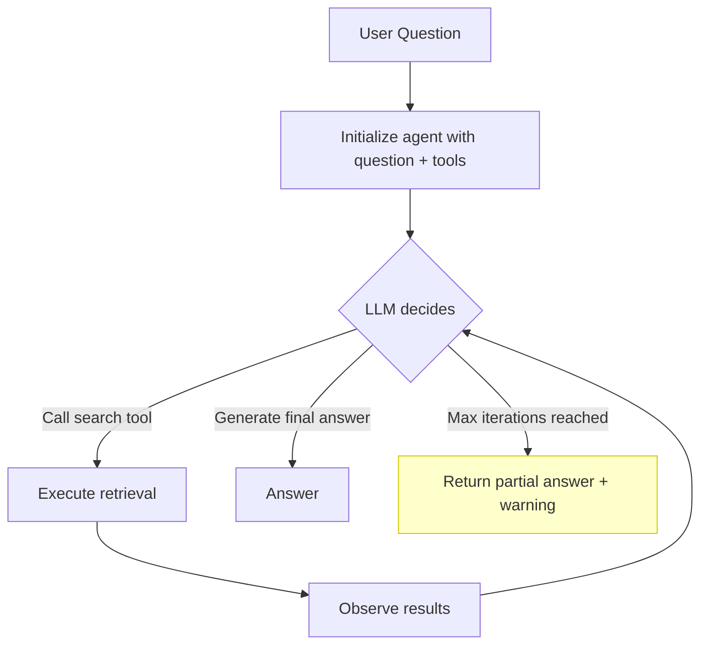

# Agentic RAG

> Static retrieval always runs once. Agentic RAG retrieves as many times as needed, on whatever it needs.

**Type:** Build
**Languages:** Python
**Prerequisites:** Lessons 01–11 (Embeddings through Advanced RAG)
**Time:** ~75 minutes
**Phase:** 02 · Retrieval & RAG

## Learning Objectives

- Explain when static single-pass RAG fails and what multi-hop retrieval solves
- Implement retrieval as a tool callable by an LLM agent
- Build an agent loop that decides whether to retrieve, calls the tool, and decides again
- Implement a multi-hop query that requires two sequential retrieval calls to answer
- Add cost governors (max iterations, token budget) to prevent runaway retrieval
- Measure answer completeness on multi-hop questions vs. naive RAG

---

## The Problem

A user asks: "What are the side effects of metformin, and do any of them interact with the blood pressure medications mentioned in the Johnson et al. 2023 study?"

A single-pass RAG system retrieves three chunks. Those chunks happen to discuss general metformin side effects. They don't mention the Johnson et al. study. They don't mention specific blood pressure medications. The system returns a partial answer that answers the first half of the question and silently ignores the second half.

This is the **multi-hop problem**: the question requires at minimum two retrieval operations: one to find the metformin side effects, one to find what blood pressure medications Johnson et al. studied, and possibly a third to find any documented interactions between them. No fixed retrieval strategy handles this well because the second query depends on the result of the first.

Single-pass RAG is correct for the common case: one retrieval, one answer. But multi-hop questions, aggregation questions ("what do all these documents say about..."), and clarification-requiring questions all fail the single-pass assumption.

Agentic RAG breaks that assumption. The LLM becomes an agent that can issue retrieval calls as tools: observing results, deciding whether it has enough information, and retrieving again with a refined query until it's ready to generate.

---

## The Concept

### When Static RAG Fails

Three question types that single-pass RAG cannot handle reliably:

**Multi-hop questions**: The answer requires chaining information across documents. You need document A to know what entity to look for in document B.

*Example:* "What policies did the company adopt after the 2022 audit findings?"
Step 1: Retrieve the 2022 audit to find its findings. Step 2: Retrieve policies using the specific findings as search terms.

**Aggregation questions**: The answer requires synthesizing claims from multiple documents that may not share vocabulary.

*Example:* "What is the consensus on transformer attention from recent papers in my corpus?"
Requires retrieving from N documents and synthesizing: not achievable in one retrieval call.

**Clarification-requiring questions**: The question is ambiguous, and the right retrieval depends on which interpretation is correct.

*Example:* "What does the policy say about termination?"
Employment termination or contract termination? The right retrieval is different for each.

### Retrieval as a Tool

The key architectural move is treating retrieval as an LLM tool. Instead of the pipeline calling retrieval once and passing context to the LLM, the LLM is given a `search` tool and decides when and how to call it.

```python
# Tool definition (OpenAI function calling format)
SEARCH_TOOL = {
    "type": "function",
    "function": {
        "name": "search_documents",
        "description": (
            "Search the document corpus for information relevant to a query. "
            "Use this tool to find information before answering. "
            "Call it multiple times with different queries if needed."
        ),
        "parameters": {
            "type": "object",
            "properties": {
                "query": {
                    "type": "string",
                    "description": "A specific search query to retrieve relevant information",
                }
            },
            "required": ["query"],
        },
    },
}
```

The LLM sees this tool and can call it with any query it chooses. After receiving results, it decides whether to call again (with a different or refined query) or to answer.

### The Agent Loop



The loop terminates when:
1. The LLM chooses not to call any more tools and generates a final answer
2. Max iterations is reached (safety governor)
3. Token budget is exhausted (cost governor)

### Multi-Hop Retrieval

The agent loop enables true multi-hop retrieval:

```
Iteration 1:
  LLM call: "Search for the 2022 audit findings"
  Tool result: [chunks about audit findings, mentions specific control weaknesses]

Iteration 2:
  LLM call: "Search for policies addressing internal control weaknesses"
  Tool result: [chunks about revised policies from 2023]

Iteration 3:
  LLM generates answer using context from both retrievals
```

The second query is formulated using information from the first result. This is the fundamental capability that single-pass RAG lacks.

### Cost Governors

Without stopping conditions, an agentic system can retrieve indefinitely. Two governors:

**Max iterations**: Hard limit on the number of tool calls. Typical: 4-6 for most use cases. After max, either return a partial answer or raise an error.

**Token budget**: Track total tokens in the conversation. If the context window is approaching capacity, stop retrieving. Avoid context window overflows that truncate earlier retrieved information.

**Retrieval deduplication**: If the agent issues two queries that return the same chunks (common when the agent rephrases without finding new information), detect and stop the loop. Check by embedding the queries and comparing: if cosine similarity between query N and any previous query > 0.9, skip the retrieval.

### When NOT to Use Agentic RAG

Agentic RAG is not always the answer:

| Scenario | Use agentic RAG? | Reason |
|---|---|---|
| Simple Q&A, single topic | No | Adds latency and cost for no gain |
| Real-time chatbot (< 1s response time required) | No | Agent loops add 2-5 seconds per iteration |
| Questions where 1 retrieval is always sufficient | No | Overhead is pure cost |
| Multi-hop questions requiring 2-3 retrievals | Yes | Static RAG cannot do this |
| Aggregation across 5+ documents | Yes | Agent can retrieve iteratively |
| Ambiguous queries requiring clarification | Yes/Maybe | Agent can retrieve to disambiguate |

---

## Build It

### Step 1: Define the Document Corpus and Retrieval Tool

```python
# pip install openai

import json
import os
import re
from collections import Counter
from dataclasses import dataclass, field
from typing import Optional
from openai import OpenAI

@dataclass
class Document:
    doc_id: str
    title: str
    text: str


# Sample corpus designed to require multi-hop retrieval
CORPUS = [
    Document(
        doc_id="audit-2022",
        title="2022 Internal Audit Report",
        text=(
            "The 2022 internal audit identified three material control weaknesses: "
            "(1) inadequate segregation of duties in the accounts payable process, "
            "(2) missing dual-approval controls for wire transfers above $100,000, "
            "(3) insufficient logging of privileged database access. "
            "The audit committee requested remediation plans within 90 days."
        ),
    ),
    Document(
        doc_id="policy-ap-2023",
        title="Accounts Payable Policy Update (2023)",
        text=(
            "Following the 2022 audit findings regarding accounts payable segregation, "
            "the AP policy was revised in March 2023. Key changes: all invoice approvals "
            "now require dual authorization from different cost center managers. "
            "No single approver may both initiate and approve a payment."
        ),
    ),
    Document(
        doc_id="policy-wire-2023",
        title="Wire Transfer Control Policy (2023)",
        text=(
            "In response to the audit's wire transfer finding, a new dual-approval "
            "workflow was implemented in February 2023. All wire transfers above $50,000 "
            "(down from $100,000) now require CFO sign-off. Transfers above $500,000 "
            "require both CFO and CEO authorization."
        ),
    ),
    Document(
        doc_id="metformin-overview",
        title="Metformin Clinical Overview",
        text=(
            "Metformin is a biguanide antidiabetic agent. Common side effects include "
            "gastrointestinal symptoms (nausea, diarrhea, abdominal discomfort) occurring "
            "in up to 30% of patients, particularly at initiation. Rare but serious: "
            "lactic acidosis (risk elevated in renal impairment). Metformin does not "
            "cause hypoglycemia when used as monotherapy."
        ),
    ),
    Document(
        doc_id="metformin-interactions",
        title="Metformin Drug Interaction Reference",
        text=(
            "Metformin interactions with cardiovascular drugs: ACE inhibitors and ARBs "
            "generally safe with metformin: no pharmacokinetic interaction. Diuretics "
            "(especially thiazides and loop diuretics) may reduce metformin efficacy and "
            "increase risk of volume depletion. Beta-blockers may mask hypoglycemic symptoms "
            "in combination therapy but do not interact pharmacokinetically with metformin."
        ),
    ),
    Document(
        doc_id="johnson-2023",
        title="Johnson et al. 2023: Diabetes-Hypertension Comorbidity Study",
        text=(
            "Johnson et al. (2023) examined 450 patients with type 2 diabetes and "
            "hypertension. The blood pressure medications used in the cohort included "
            "lisinopril (ACE inhibitor, 62%), amlodipine (calcium channel blocker, 28%), "
            "and hydrochlorothiazide (thiazide diuretic, 18%). The study focused on "
            "glycemic outcomes over 24 months."
        ),
    ),
]
```

### Step 2: Implement the Search Function

```python
def _keyword_score(query: str, doc: Document) -> float:
    """Naive keyword overlap for demo. Replace with vector similarity in production."""
    q_tokens = set(re.findall(r'\b[a-z]+\b', query.lower()))
    d_tokens = Counter(re.findall(r'\b[a-z]+\b', (doc.title + " " + doc.text).lower()))
    overlap = sum(d_tokens[t] for t in q_tokens if t in d_tokens)
    return overlap / (len(q_tokens) + 1)


def search_corpus(query: str, corpus: list[Document], top_k: int = 2) -> list[dict]:
    """
    Search the corpus and return top-k results as JSON-serializable dicts.
    This is the function the LLM calls as a tool.
    """
    scored = [(_keyword_score(query, doc), doc) for doc in corpus]
    scored.sort(key=lambda x: x[0], reverse=True)

    results = []
    for score, doc in scored[:top_k]:
        results.append({
            "doc_id": doc.doc_id,
            "title": doc.title,
            "text": doc.text,
            "score": round(score, 3),
        })
    return results
```

### Step 3: Define the Tool Schema

```python
SEARCH_TOOL = {
    "type": "function",
    "function": {
        "name": "search_documents",
        "description": (
            "Search the document corpus for information relevant to the query. "
            "Use specific, targeted queries for best results. "
            "Call multiple times with different queries to gather all needed information "
            "before writing your final answer."
        ),
        "parameters": {
            "type": "object",
            "properties": {
                "query": {
                    "type": "string",
                    "description": "A focused search query to find relevant documents.",
                }
            },
            "required": ["query"],
        },
    },
}

AGENT_SYSTEM_PROMPT = """You are a research assistant with access to a document search tool.

To answer a question:
1. Think about what information you need.
2. Use the search_documents tool to find relevant information.
3. Based on what you find, decide if you need to search for more.
4. When you have enough information, write a complete answer.

Rules:
- Always search before answering. Do not answer from memory.
- If the first search doesn't give you everything you need, search again with a more specific query.
- Cite which documents you used in your answer (by title or doc_id).
- If after multiple searches the information isn't in the corpus, say so explicitly."""
```

### Step 4: Build the Agent Loop

```python
@dataclass
class AgentTrace:
    """Full record of one agentic RAG execution."""
    question: str
    iterations: list[dict] = field(default_factory=list)
    final_answer: str = ""
    total_tokens: int = 0
    terminated_by: str = ""  # "agent_done" | "max_iterations" | "token_budget"


def run_agentic_rag(
    question: str,
    corpus: list[Document],
    max_iterations: int = 5,
    token_budget: int = 8000,
    model: str = "gpt-4o-mini",
    verbose: bool = True,
) -> AgentTrace:
    """
    Agentic RAG loop:
    1. LLM receives question and search tool
    2. LLM calls search tool (possibly multiple times)
    3. Each search result is appended to conversation history
    4. Loop terminates when LLM stops calling tools or limits are hit

    Returns an AgentTrace with the full conversation history and final answer.
    """
    client = OpenAI(api_key=os.environ.get("OPENAI_API_KEY"))
    trace = AgentTrace(question=question)

    messages = [
        {"role": "system", "content": AGENT_SYSTEM_PROMPT},
        {"role": "user", "content": question},
    ]

    if verbose:
        print(f"\n{'='*64}")
        print(f"QUESTION: {question}")

    for iteration in range(max_iterations):
        # Check token budget (approximate)
        estimated_tokens = sum(len(m["content"].split()) * 1.3 for m in messages if isinstance(m.get("content"), str))
        if estimated_tokens > token_budget:
            trace.terminated_by = "token_budget"
            if verbose:
                print(f"\n[STOP] Token budget exhausted ({estimated_tokens:.0f} estimated tokens)")
            break

        response = client.chat.completions.create(
            model=model,
            messages=messages,
            tools=[SEARCH_TOOL],
            tool_choice="auto",
            temperature=0.0,
        )

        message = response.choices[0].message
        trace.total_tokens += response.usage.total_tokens

        # No tool calls: agent is done
        if not message.tool_calls:
            trace.final_answer = message.content or ""
            trace.terminated_by = "agent_done"
            if verbose:
                print(f"\n[DONE] Agent finished after {iteration + 1} iteration(s)")
                print(f"Final answer:\n{trace.final_answer}")
            messages.append({"role": "assistant", "content": message.content})
            break

        # Process tool calls
        messages.append(message)

        for tool_call in message.tool_calls:
            function_name = tool_call.function.name
            args = json.loads(tool_call.function.arguments)
            query = args.get("query", "")

            if verbose:
                print(f"\n[ITER {iteration+1}] Tool call: {function_name}(query={query!r})")

            if function_name == "search_documents":
                results = search_corpus(query, corpus)
                result_text = json.dumps(results, indent=2)

                if verbose:
                    for r in results:
                        print(f"  → {r['title']} (score={r['score']})")

                trace.iterations.append({
                    "iteration": iteration + 1,
                    "query": query,
                    "results": results,
                })
            else:
                result_text = json.dumps({"error": f"Unknown tool: {function_name}"})

            messages.append({
                "role": "tool",
                "tool_call_id": tool_call.id,
                "content": result_text,
            })
    else:
        # Loop exhausted without agent finishing
        trace.terminated_by = "max_iterations"
        if verbose:
            print(f"\n[STOP] Max iterations ({max_iterations}) reached")

        # Get whatever the agent has at this point
        final_response = client.chat.completions.create(
            model=model,
            messages=messages + [
                {"role": "user", "content": "Please provide your best answer based on the information gathered so far."}
            ],
            temperature=0.0,
        )
        trace.final_answer = final_response.choices[0].message.content or ""
        trace.total_tokens += final_response.usage.total_tokens

    return trace
```

> **Real-world check:** This agent is making 3-4 API calls to answer one question. Our users expect answers in under 2 seconds. Is this approach even viable for a customer-facing product, or is it only for back-office use cases?

### Step 5: Compare Single-Pass vs. Multi-Hop

```python
def single_pass_rag(
    question: str,
    corpus: list[Document],
    top_k: int = 3,
    model: str = "gpt-4o-mini",
) -> str:
    """Naive single-pass RAG for comparison."""
    client = OpenAI(api_key=os.environ.get("OPENAI_API_KEY"))
    results = search_corpus(question, corpus, top_k=top_k)
    context = "\n\n".join(f"[{r['title']}]\n{r['text']}" for r in results)

    response = client.chat.completions.create(
        model=model,
        messages=[
            {"role": "system", "content": "Answer the question using only the provided context."},
            {"role": "user", "content": f"Context:\n{context}\n\nQuestion: {question}"},
        ],
        temperature=0.0,
    )
    return response.choices[0].message.content
```

### Step 6: Wire Up the Demo

```python
def main():
    print("Lesson 12: Agentic RAG")
    print("=" * 64)

    # Multi-hop test questions (require 2+ retrieval steps)
    multi_hop_questions = [
        (
            "What policies did the company implement to address the issues found in the 2022 audit?",
            "Requires: (1) find audit findings, (2) find resulting policies",
        ),
        (
            "What are the side effects of metformin, and how do they interact with the "
            "blood pressure medications used in the Johnson et al. 2023 study?",
            "Requires: (1) find metformin side effects, (2) find Johnson study BP meds, (3) find interactions",
        ),
    ]

    for question, description in multi_hop_questions:
        print(f"\n{'='*64}")
        print(f"TEST: {description}")

        print("\n--- NAIVE SINGLE-PASS RAG ---")
        naive_answer = single_pass_rag(question, CORPUS)
        print(f"Answer: {naive_answer[:400]}...")

        print("\n--- AGENTIC RAG ---")
        trace = run_agentic_rag(question, CORPUS, max_iterations=5, verbose=True)
        print(f"\nTotal tokens used: {trace.total_tokens}")
        print(f"Retrieval calls: {len(trace.iterations)}")
        print(f"Terminated by: {trace.terminated_by}")

    # Show the retrieval loop table
    print_comparison_table()
```

---

## Use It

The agent loop above uses OpenAI's function calling. The same pattern works with any tool-calling LLM. For production systems, LangChain and LlamaIndex both offer agent abstractions over this pattern:

```python
# LangChain: create a retriever tool and wrap it in an agent
from langchain.agents import create_tool_calling_agent, AgentExecutor
from langchain.tools.retriever import create_retriever_tool

tool = create_retriever_tool(
    retriever=vector_store.as_retriever(),
    name="search_documents",
    description="Search the document corpus. Use specific queries.",
)

agent = create_tool_calling_agent(llm, tools=[tool], prompt=prompt)
executor = AgentExecutor(agent=agent, tools=[tool], max_iterations=5)
result = executor.invoke({"input": question})
```

The raw loop from "Build It" gives you full visibility into each retrieval call, the tool call arguments, and the intermediate results: essential for debugging and for building the evaluation in "Evaluate It".

> **Perspective shift:** If the agent can retrieve anything it decides is relevant, how do we prevent it from accessing data the user isn't supposed to see? Who is responsible for enforcing that boundary, the agent or the retrieval layer?

---

## Ship It

The artifact from this lesson is `outputs/skill-agentic-rag-loop.md`: a documented pattern for when to use agentic RAG, how to implement the tool interface, and how to set stopping conditions.

**Production considerations:**

1. **Trace logging is non-negotiable.** Log every tool call, its query, and its results. Without traces, debugging an agent loop is nearly impossible.

2. **Max iterations is a business decision.** 4 iterations at 1 second each = 4 seconds minimum latency. Some use cases can't tolerate this. Set max_iterations based on user experience requirements, not technical defaults.

3. **Token costs multiply.** An agent that makes 4 retrieval calls and accumulates all results in the context window uses 4x the generation tokens of single-pass RAG. Budget accordingly.

---

## Evaluate It

**Metric 1: Answer completeness on multi-hop questions**

Create 10 multi-hop test questions where you know the correct answer requires N retrieval calls. Compare:
- Naive RAG answer completeness (score 0/1 per question: did it answer all parts?)
- Agentic RAG answer completeness

Expected: agentic RAG should be correct on 80%+ of multi-hop questions where naive RAG fails.

**Metric 2: Average retrieval calls per query**

```python
def compute_retrieval_stats(traces: list[AgentTrace]) -> dict:
    call_counts = [len(t.iterations) for t in traces]
    return {
        "mean_calls": sum(call_counts) / len(call_counts),
        "max_calls": max(call_counts),
        "pct_1_call": sum(1 for c in call_counts if c == 1) / len(call_counts),
        "pct_3plus_calls": sum(1 for c in call_counts if c >= 3) / len(call_counts),
    }
```

If more than 20% of queries require 3+ calls, your retrieval is probably broken or your corpus is poorly chunked. Multi-hop should be the exception, not the norm.

**Metric 3: Flag questions requiring more than 3 calls**

Any query that triggers 4+ retrieval calls is a signal that either:
- The retrieval tool isn't returning relevant chunks (fix: improve embeddings or corpus)
- The agent is looping on the same query (fix: add query deduplication)
- The question is genuinely complex and requires more corpus coverage

Log these for manual review. They're your highest-priority debugging targets.

---

## Exercises

1. **Easy:** Modify `run_agentic_rag()` to add query deduplication: if the agent issues a query that's more than 90% identical to a previous query (by string overlap), skip the retrieval and return a message like "This query has already been searched." Print a warning when this happens.

2. **Medium:** Implement a retrieval cache to prevent redundant calls. Before executing a retrieval, check whether any previous query in the same session returned the same top-2 documents (by doc_id). If so, skip the call and append the cached result. Measure how often this triggers on a 20-query eval set.

3. **Hard:** Build a multi-hop evaluation harness. Create 10 questions that each require exactly 2 retrieval calls (design them against the sample corpus). For each question, run both single-pass RAG and agentic RAG. Score completeness (0/1: did the answer address all parts of the question?). Report the accuracy gap between the two approaches and include a per-question breakdown identifying which failure mode caused naive RAG to fail.

---

## Key Terms

| Term | What people say | What it actually means |
|------|----------------|------------------------|
| Agentic RAG | "RAG with an agent loop" | A RAG architecture where the LLM controls when and how retrieval is invoked, enabling multiple retrieval calls per query based on intermediate results |
| Retrieval as a tool | "LLM-callable search" | Exposing the retrieval function as a tool in the LLM's tool-calling interface, so the model decides when to invoke it and with what query |
| Multi-hop retrieval | "Chain-of-thought retrieval" | A retrieval pattern where the query for step N+1 is formulated using information retrieved in step N; requires at least two sequential retrieval calls |
| Cost governor | "Max iterations / token budget" | Hard stopping conditions on the agent loop to prevent infinite retrieval and runaway costs; essential for any production deployment |
| Agent trace | "The full execution log" | A record of all tool calls, their queries, results, and intermediate LLM outputs in a single agent execution; the primary artifact for debugging and evaluation |
| Retrieval loop | "The agent getting stuck" | A failure mode where the agent repeatedly retrieves without making progress, typically because the corpus doesn't contain the answer or the queries are not specific enough |

---

## Further Reading

- [ReAct: Synergizing Reasoning and Acting in Language Models](https://arxiv.org/abs/2210.03629): The paper that introduced the Reason+Act pattern, which is the foundation of all LLM agent loops including agentic RAG
- [Self-RAG: Learning to Retrieve, Generate, and Critique through Self-Reflection](https://arxiv.org/abs/2310.11511): Trains a model to decide when to retrieve, verify its own outputs, and cite only relevant passages: a supervised learning approach to the same problem agentic RAG solves with prompting
- [FLARE: Active Retrieval Augmented Generation](https://arxiv.org/abs/2305.06983): An alternative to agentic RAG that triggers retrieval based on model confidence during generation; retrieves when the model is uncertain rather than when it decides to call a tool
- [OpenAI Function Calling](https://platform.openai.com/docs/guides/function-calling): Reference documentation for the tool-calling interface used in this lesson
- [LangChain Agents](https://python.langchain.com/docs/concepts/agents/): Production-grade agent framework with support for retriever tools, memory, and streaming
- [LlamaIndex Agent RAG](https://docs.llamaindex.ai/en/stable/use_cases/agents/): LlamaIndex's agentic retrieval patterns, including ReAct agents over document indices
