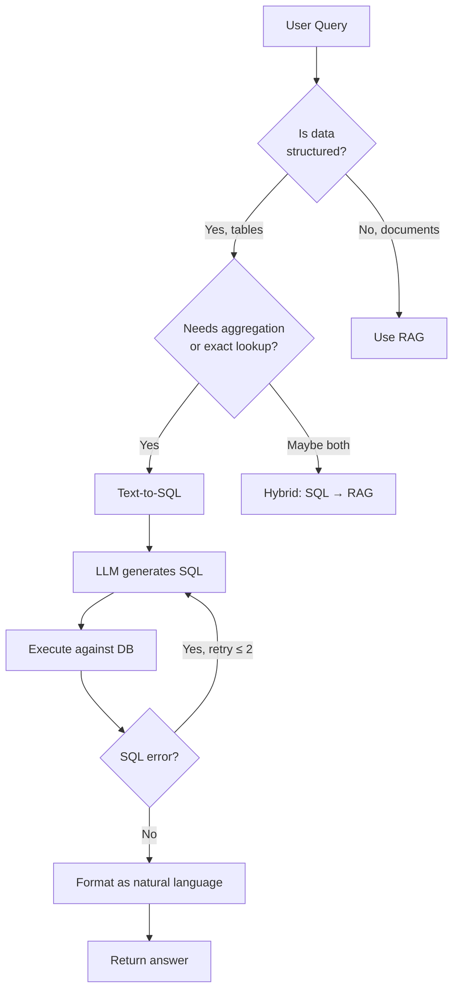

# الاسترجاع المهيكل: من النص إلى SQL (Text-to-SQL)

> ليس كل شيء مستندًا. حين تعيش بياناتك في جداول، يكون الاسترجاع استعلام SQL: ونموذج LLM هو من يكتبه.

**النوع:** بناء
**اللغات:** Python
**المتطلبات:** الدرس 05 (RAG الساذج)، الدرس 08 (تحويل الأسئلة)
**الوقت:** ~70 دقيقة
**المرحلة:** 02 · الاسترجاع وRAG

---

## أهداف التعلّم

- تنفيذ خط أنابيب text-to-SQL كامل: تسلسل المخطّط (schema serialization)، وتوليد SQL، والتنفيذ، والتصحيح الذاتي
- تحديد متى تُستخدم text-to-SQL مقابل RAG مقابل هجين منهما
- تسلسل مخطّط علائقي إلى سياق مقروء من نموذج LLM (أسماء الجداول، الأعمدة، الأنواع، المفاتيح الأجنبية (foreign keys)، صفوف عيّنية)
- بناء حلقة تصحيح ذاتي: توليد SQL ← تنفيذ ← إعادة تغذية الأخطاء ← إعادة المحاولة
- فرض القراءة فقط (read-only) على مستوى الاتصال
- تقييم خط الأنابيب باستخدام مجموعة اختبار (سؤال بلغة طبيعية، نتيجة متوقعة)

---

## المشكلة

لديك قاعدة بيانات تجارة إلكترونية فيها جدول `products`، وجدول `orders`، وجدول `customers`. يسأل محلّل دعم: "أي العملاء أنفقوا أكثر من 500 دولار الشهر الماضي؟" يمكنك تصدير البيانات إلى ملفات نصية وتشغيل RAG عليها. سيكون ذلك خطأً.

RAG أداة خاطئة للبيانات المهيكلة. التشابه المتّجهي يسترجع مستندات *قريبة دلاليًا* من سؤال. هو لا يجمّع، ولا يربط (join)، ولا يرشّح حسب نطاق تاريخ، ولا يعدّ الصفوف. نظام RAG ساذج إن سُئل "كم طلبًا كان لدينا الأسبوع الماضي؟" سيجد المقاطع التي تحتوي على كلمة "orders" ويعيد أي نص قريب: وهو عادةً خاطئ.

الأداة الصحيحة للبيانات المهيكلة القابلة للاستعلام هي SQL. التحدّي الهندسي أن معظم المستخدمين لا يستطيعون كتابة SQL. الحل: اجعل نموذج LLM يكتب SQL. النموذج يعرف دلالات الاستعلام (ما يريده المستخدم). أنت تعطيه المخطّط. هو يولّد الاستعلام. أنت تنفّذه. هذا هو text-to-SQL، وهو من أكثر أنماط الذكاء الاصطناعي نشرًا في أدوات التحليلات الإنتاجية.

المشاكل الصعبة الثلاث:
1. على نموذج LLM أن يعرف مخطّطك ليكتب SQL صحيحًا. عليك تسلسله بذكاء.
2. ترتكب نماذج LLM أخطاء SQL: أسماء جداول خاطئة، عمليات JOIN مفقودة، تجميعات خاطئة. تحتاج إلى حلقة تصحيح.
3. SQL المولَّد بنموذج LLM يعمل مقابل قاعدة بياناتك الحقيقية. فرض الأمان ليس اختياريًا.

---

## المفهوم

### Text-to-SQL مقابل RAG مقابل الهجين

```
┌─────────────────────────────────────────────────────────────────┐
│  USE TEXT-TO-SQL WHEN                                           │
│  • Data is structured and lives in tables                       │
│  • Query needs aggregation, grouping, sorting, or date filters  │
│  • You need exact answers (counts, totals, averages)           │
│  • Schema is stable and documented                              │
└─────────────────────────────────────────────────────────────────┘

┌─────────────────────────────────────────────────────────────────┐
│  USE RAG WHEN                                                   │
│  • Data is unstructured (PDFs, emails, docs, Slack)             │
│  • Query needs fuzzy matching or semantic understanding         │
│  • You need passages, not rows                                  │
│  • Schema doesn't exist                                         │
└─────────────────────────────────────────────────────────────────┘

┌─────────────────────────────────────────────────────────────────┐
│  USE HYBRID WHEN                                                │
│  • Step 1: SQL finds the relevant entity (customer ID, order)  │
│  • Step 2: RAG answers a question about that entity's documents │
│  Example: "What did Sarah say in her support tickets?"          │
│  SQL: find customer ID for Sarah                               │
│  RAG: retrieve relevant tickets filtered by customer_id        │
└─────────────────────────────────────────────────────────────────┘
```



### تسلسل المخطّط (Schema Serialization)

يحتاج نموذج LLM إلى معرفة مخطّطك ليكتب SQL صحيحًا. كلما قدّمت سياقًا أكثر، كان SQL المولَّد أدقّ. ضمّن:

- أسماء الجداول وغرضها
- أسماء الأعمدة، وأنواع البيانات، وحالة القابلية للقيمة الفارغة (nullable)
- علاقات المفاتيح الأجنبية
- 2–3 صفوف عيّنية لكل جدول (لا المخطّط فقط: البيانات العيّنية تزيل الالتباس عن دلالات الأعمدة)

عمود اسمه `status` في جدول `orders` قد يعني أي شيء. البيانات العيّنية التي تُظهر قيمًا مثل `'pending'`, `'shipped'`, `'delivered'` تخبر النموذج بدقّة بما عليه الترشيح عليه.

**قالب سياق المخطّط:**

```
Table: orders
Columns:
  - id (INTEGER, PRIMARY KEY)
  - customer_id (INTEGER, FK → customers.id)
  - total_amount (REAL)
  - status (TEXT) -- e.g.: 'pending', 'shipped', 'delivered'
  - created_at (TEXT) -- ISO 8601 datetime

Sample rows:
  (1, 42, 149.99, 'shipped', '2024-11-15T10:23:00')
  (2, 17, 89.50, 'delivered', '2024-11-20T14:01:00')
```

### حلقة التصحيح الذاتي (The Self-Correction Loop)

تخطئ نماذج LLM في SQL. أخطاء شائعة:
- اسم عمود خاطئ (يبعد بحرف واحد، بادئة جدول خاطئة)
- JOIN مفقود (افترضت وجود عمود في الجدول الخطأ)
- تجميع خاطئ (COUNT بينما كان SUM مطلوبًا)
- صيغة مرشّح تاريخ خاطئة

الإصلاح: التقط خطأ SQL، وأعِد تغذيته إلى النموذج مع السؤال الأصلي وSQL الفاشل، واطلب منه التصحيح. إعادة محاولة واحدة تلتقط ~85% من أخطاء SQL لنماذج LLM. إعادتان تلتقطان ~95%.

```
Attempt 1: LLM generates SQL
→ Execute
→ SQLite error: "no such column: order_total"
→ Feed error + failed SQL back to LLM: "Fix this SQL error: [error]. Original SQL: [sql]"
Attempt 2: LLM generates corrected SQL
→ Execute
→ Success
→ Format and return result
```

### الأمان: فرض القراءة فقط (Read-Only Enforcement)

text-to-SQL خطر تنفيذ شيفرة. قد يولّد سؤال خبيث أو مرتبك عبارات `DROP TABLE`, `DELETE`, أو `UPDATE`. لا تشغّل أبدًا SQL مولَّدًا بنموذج LLM بلا قيود.

الخيارات:
1. **SQLite PRAGMA**: `PRAGMA query_only = ON`: يفرض القراءة فقط على مستوى الاتصال
2. **التحليل قبل التنفيذ (Parse before execute)**: افحص SQL المولَّد بحثًا عن كلمات الكتابة المفتاحية قبل التنفيذ
3. **أذونات قاعدة بيانات على مستوى المستخدم**: شغّل خط الأنابيب كمستخدم قاعدة بيانات للقراءة فقط

استخدم الخيار 1 (PRAGMA) كخط دفاع أول. أضف الخيار 2 كفحص احتياطي مزدوج. لا تعتمد أبدًا فقط على تعليمات المطالبة مثل "اكتب عبارات SELECT فقط": قيود المطالبة ليست ضوابط أمان.

---

## البناء

### الخطوة 1: الاعتماديات والإعداد

```python
# pip install openai
# SQLite is part of Python's standard library: no install needed.
# Set environment variable: OPENAI_API_KEY=sk-...

import os
import sqlite3
import json
from openai import OpenAI
```

استيرادان يقومان بكل العمل. `sqlite3` يتولّى قاعدة البيانات. `openai` يولّد SQL. المكتبة القياسية تتولّى الباقي.

### الخطوة 2: بناء قاعدة بيانات في الذاكرة

```python
def build_sample_database() -> sqlite3.Connection:
    """
    Create an in-memory SQLite database with three tables:
    customers, products, orders.
    Populate each with 20 rows of realistic sample data.
    Returns a read-write connection (used only for setup).
    """
    conn = sqlite3.connect(":memory:")
    conn.row_factory = sqlite3.Row  # rows act like dicts
    cursor = conn.cursor()

    cursor.executescript("""
        CREATE TABLE customers (
            id          INTEGER PRIMARY KEY,
            name        TEXT NOT NULL,
            email       TEXT UNIQUE NOT NULL,
            city        TEXT,
            joined_at   TEXT  -- ISO 8601 date
        );

        CREATE TABLE products (
            id          INTEGER PRIMARY KEY,
            name        TEXT NOT NULL,
            category    TEXT,
            price       REAL NOT NULL,
            stock       INTEGER DEFAULT 0
        );

        CREATE TABLE orders (
            id            INTEGER PRIMARY KEY,
            customer_id   INTEGER REFERENCES customers(id),
            product_id    INTEGER REFERENCES products(id),
            quantity      INTEGER NOT NULL DEFAULT 1,
            total_amount  REAL NOT NULL,
            status        TEXT DEFAULT 'pending',  -- pending, shipped, delivered, cancelled
            created_at    TEXT  -- ISO 8601 datetime
        );
    """)

    # 20 customers
    customers = [
        (1,  "Alice Chen",      "alice@example.com",   "Seattle",    "2023-01-15"),
        (2,  "Bob Martinez",    "bob@example.com",     "Austin",     "2023-02-20"),
        (3,  "Carol Wu",        "carol@example.com",   "New York",   "2023-03-05"),
        (4,  "David Kim",       "david@example.com",   "Chicago",    "2023-03-18"),
        (5,  "Eve Santos",      "eve@example.com",     "Miami",      "2023-04-01"),
        (6,  "Frank Lee",       "frank@example.com",   "Seattle",    "2023-04-14"),
        (7,  "Grace Patel",     "grace@example.com",   "Austin",     "2023-05-09"),
        (8,  "Henry Okafor",    "henry@example.com",   "New York",   "2023-05-22"),
        (9,  "Iris Tanaka",     "iris@example.com",    "Los Angeles","2023-06-10"),
        (10, "James Rivera",    "james@example.com",   "Chicago",    "2023-06-28"),
        (11, "Kate Thompson",   "kate@example.com",    "Seattle",    "2023-07-03"),
        (12, "Liam O'Brien",    "liam@example.com",    "Boston",     "2023-07-19"),
        (13, "Maya Johnson",    "maya@example.com",    "Miami",      "2023-08-05"),
        (14, "Noah Williams",   "noah@example.com",    "Austin",     "2023-08-20"),
        (15, "Olivia Brown",    "olivia@example.com",  "New York",   "2023-09-04"),
        (16, "Paul Davis",      "paul@example.com",    "Los Angeles","2023-09-18"),
        (17, "Quinn Miller",    "quinn@example.com",   "Chicago",    "2023-10-02"),
        (18, "Rachel Wilson",   "rachel@example.com",  "Seattle",    "2023-10-15"),
        (19, "Sam Taylor",      "sam@example.com",     "Boston",     "2023-11-01"),
        (20, "Tina Anderson",   "tina@example.com",    "Miami",      "2023-11-20"),
    ]
    cursor.executemany(
        "INSERT INTO customers VALUES (?,?,?,?,?)", customers
    )

    # 10 products
    products = [
        (1,  "Wireless Headphones", "Electronics",   89.99,  42),
        (2,  "Mechanical Keyboard", "Electronics",  129.99,  30),
        (3,  "USB-C Hub",           "Electronics",   49.99,  75),
        (4,  "Standing Desk Mat",   "Office",        39.99,  60),
        (5,  "Laptop Stand",        "Office",        59.99,  55),
        (6,  "Blue Light Glasses",  "Accessories",   24.99, 120),
        (7,  "Webcam HD 1080p",     "Electronics",   79.99,  25),
        (8,  "Desk Organizer",      "Office",        29.99,  80),
        (9,  "Ergonomic Mouse",     "Electronics",   69.99,  45),
        (10, "Monitor Light Bar",   "Electronics",   44.99,  65),
    ]
    cursor.executemany(
        "INSERT INTO products VALUES (?,?,?,?,?)", products
    )

    # 20 orders (spanning Nov-Dec 2024)
    orders = [
        (1,   2, 1,  1,  89.99, "delivered",   "2024-11-01T09:15:00"),
        (2,   5, 2,  1, 129.99, "delivered",   "2024-11-03T11:30:00"),
        (3,   1, 3,  2,  99.98, "shipped",     "2024-11-05T14:00:00"),
        (4,   8, 5,  1,  59.99, "delivered",   "2024-11-08T10:20:00"),
        (5,   3, 1,  1,  89.99, "delivered",   "2024-11-10T16:45:00"),
        (6,  12, 4,  2,  79.98, "shipped",     "2024-11-12T09:00:00"),
        (7,   7, 7,  1,  79.99, "delivered",   "2024-11-14T13:10:00"),
        (8,  15, 2,  2, 259.98, "pending",     "2024-11-17T08:55:00"),
        (9,   4, 9,  1,  69.99, "delivered",   "2024-11-19T15:30:00"),
        (10,  9, 6,  3,  74.97, "shipped",     "2024-11-21T11:00:00"),
        (11, 11, 10, 1,  44.99, "delivered",   "2024-11-24T14:20:00"),
        (12,  6, 1,  1,  89.99, "cancelled",   "2024-11-26T10:10:00"),
        (13, 13, 2,  1, 129.99, "delivered",   "2024-11-28T12:00:00"),
        (14, 17, 5,  2, 119.98, "shipped",     "2024-11-30T09:45:00"),
        (15,  2, 3,  1,  49.99, "delivered",   "2024-12-02T16:00:00"),
        (16, 20, 8,  2,  59.98, "pending",     "2024-12-04T11:30:00"),
        (17,  1, 9,  1,  69.99, "shipped",     "2024-12-06T13:45:00"),
        (18, 14, 7,  1,  79.99, "delivered",   "2024-12-08T10:00:00"),
        (19, 10, 2,  1, 129.99, "delivered",   "2024-12-10T15:20:00"),
        (20, 16, 4,  3, 119.97, "shipped",     "2024-12-12T08:30:00"),
    ]
    cursor.executemany(
        "INSERT INTO orders VALUES (?,?,?,?,?,?,?)", orders
    )

    conn.commit()
    return conn
```

### الخطوة 3: تسلسل المخطّط

```python
def serialize_schema(conn: sqlite3.Connection, sample_rows: int = 3) -> str:
    """
    Serialize the full database schema into a context string for the LLM.
    Includes: table names, columns (name + type), foreign keys, sample rows.
    The LLM needs all of this to write correct SQL.
    """
    cursor = conn.cursor()

    # Get all user tables
    cursor.execute(
        "SELECT name FROM sqlite_master WHERE type='table' ORDER BY name"
    )
    tables = [row[0] for row in cursor.fetchall()]

    parts = ["DATABASE SCHEMA\n" + "=" * 60]

    for table in tables:
        parts.append(f"\nTable: {table}")

        # Column info
        cursor.execute(f"PRAGMA table_info({table})")
        columns = cursor.fetchall()
        parts.append("Columns:")
        for col in columns:
            # col: (cid, name, type, notnull, dflt_value, pk)
            col_def = f"  - {col[1]} ({col[2]})"
            if col[5]:  # primary key
                col_def += ", PRIMARY KEY"
            if col[3]:  # not null
                col_def += ", NOT NULL"
            parts.append(col_def)

        # Foreign keys
        cursor.execute(f"PRAGMA foreign_key_list({table})")
        fks = cursor.fetchall()
        if fks:
            parts.append("Foreign Keys:")
            for fk in fks:
                # fk: (id, seq, table, from, to, ...)
                parts.append(f"  - {fk[3]} → {fk[2]}.{fk[4]}")

        # Sample rows
        cursor.execute(f"SELECT * FROM {table} LIMIT {sample_rows}")
        rows = cursor.fetchall()
        if rows:
            parts.append(f"Sample rows (first {len(rows)}):")
            for row in rows:
                parts.append(f"  {tuple(row)}")

    return "\n".join(parts)
```

### الخطوة 4: مطالبة توليد SQL

```python
client = OpenAI(api_key=os.environ["OPENAI_API_KEY"])
MODEL = "gpt-4o-mini"

SQL_SYSTEM_PROMPT = """You are a SQL expert. Your job is to write correct SQLite queries 
based on a user's natural language question and the provided database schema.

Rules:
1. Write ONLY a single SELECT statement. Never write INSERT, UPDATE, DELETE, DROP, or CREATE.
2. Use only table and column names that appear in the schema.
3. For date comparisons, use SQLite's date() or strftime() functions.
4. Return ONLY the SQL query: no explanation, no markdown code fences, no commentary.
5. If the question is ambiguous, make the most reasonable interpretation.
"""

def generate_sql(nl_query: str, schema_context: str) -> str:
    """
    Given a natural language query and serialized schema, generate SQL.
    Returns the raw SQL string.
    """
    response = client.chat.completions.create(
        model=MODEL,
        messages=[
            {"role": "system", "content": SQL_SYSTEM_PROMPT},
            {
                "role": "user",
                "content": (
                    f"{schema_context}\n\n"
                    f"---\n\n"
                    f"Question: {nl_query}\n\n"
                    f"SQL query:"
                ),
            },
        ],
        temperature=0.0,
    )
    sql = response.choices[0].message.content.strip()
    # Strip markdown code fences if the model added them anyway
    if sql.startswith("```"):
        sql = sql.split("```")[1]
        if sql.startswith("sql"):
            sql = sql[3:]
    return sql.strip()


def correct_sql(
    nl_query: str,
    failed_sql: str,
    error_message: str,
    schema_context: str,
) -> str:
    """
    Feed a failed SQL + error message back to the LLM for self-correction.
    Returns a corrected SQL string.
    """
    correction_prompt = (
        f"{schema_context}\n\n"
        f"---\n\n"
        f"The following SQL was generated for this question: {nl_query}\n\n"
        f"Failed SQL:\n{failed_sql}\n\n"
        f"Error message:\n{error_message}\n\n"
        f"Please write a corrected SQL query that fixes the error. "
        f"Return ONLY the corrected SQL."
    )

    response = client.chat.completions.create(
        model=MODEL,
        messages=[
            {"role": "system", "content": SQL_SYSTEM_PROMPT},
            {"role": "user", "content": correction_prompt},
        ],
        temperature=0.0,
    )
    sql = response.choices[0].message.content.strip()
    if sql.startswith("```"):
        sql = sql.split("```")[1]
        if sql.startswith("sql"):
            sql = sql[3:]
    return sql.strip()
```

### الخطوة 5: تنفيذ SQL آمن مع التعافي من الأخطاء

```python
READ_ONLY_KEYWORDS = {"insert", "update", "delete", "drop", "create", "alter", "truncate"}


def is_read_only(sql: str) -> bool:
    """
    Simple keyword check: reject any SQL containing write operations.
    This is a belt-and-suspenders check; PRAGMA query_only is the real guard.
    """
    first_word = sql.strip().lower().split()[0] if sql.strip() else ""
    return first_word == "select"


def execute_sql(
    conn: sqlite3.Connection,
    sql: str,
    max_rows: int = 100,
) -> tuple[list[dict], str | None]:
    """
    Execute SQL and return (rows, error_message).
    rows: list of dicts (column → value): empty on error.
    error_message: None on success, error string on failure.

    Safety: PRAGMA query_only prevents all write operations at the
    connection level. The is_read_only() check is a secondary guard.
    """
    if not is_read_only(sql):
        return [], f"Rejected: SQL must be a SELECT statement, got: {sql[:80]}"

    try:
        # Enforce read-only at connection level
        conn.execute("PRAGMA query_only = ON")
        cursor = conn.execute(sql)
        columns = [description[0] for description in cursor.description]
        rows = [dict(zip(columns, row)) for row in cursor.fetchmany(max_rows)]
        return rows, None
    except sqlite3.Error as e:
        return [], str(e)
    finally:
        # Re-enable write access (needed for future calls in the same session)
        conn.execute("PRAGMA query_only = OFF")
```

### الخطوة 6: حلقة التصحيح الذاتي

```python
def run_text_to_sql(
    nl_query: str,
    conn: sqlite3.Connection,
    schema_context: str,
    max_retries: int = 2,
) -> dict:
    """
    Full text-to-SQL pipeline with self-correction.

    Returns:
      sql: the final SQL that was executed (or last attempt on failure)
      rows: list of result dicts
      answer: natural language answer
      attempts: number of LLM calls made
      error: final error message, or None on success
    """
    sql = generate_sql(nl_query, schema_context)
    attempts = 1

    for attempt in range(max_retries + 1):
        rows, error = execute_sql(conn, sql)

        if error is None:
            # Success
            answer = format_answer(nl_query, rows, sql)
            return {
                "sql": sql,
                "rows": rows,
                "answer": answer,
                "attempts": attempts,
                "error": None,
            }

        # SQL failed: request correction if retries remain
        if attempt < max_retries:
            print(f"  SQL error on attempt {attempt + 1}: {error}")
            print(f"  Requesting correction from LLM...")
            sql = correct_sql(nl_query, sql, error, schema_context)
            attempts += 1

    # All retries exhausted
    return {
        "sql": sql,
        "rows": [],
        "answer": f"I was unable to answer this question. Final SQL error: {error}",
        "attempts": attempts,
        "error": error,
    }
```

> **اختبار من الواقع:** يقول مدير قاعدة بيانات لدى عميل: "أنتم تسمحون لذكاء اصطناعي بكتابة استعلامات SQL تعمل مقابل قاعدة بيانات الإنتاج لدينا. ما الذي يمنعه من تنفيذ DELETE أو إسقاط جدول؟" كيف تشرح، بكلمات بسيطة، ما هي ضمانات الأمان الفعلية هنا ومن أين تأتي؟

### الخطوة 7: تنسيق النتائج بلغة طبيعية

```python
ANSWER_SYSTEM_PROMPT = """You are a helpful data analyst. Given a natural language question,
the SQL query used to answer it, and the query results as JSON, write a clear and concise
natural language answer. Be specific: include actual numbers, names, and values from the results.
If the results are empty, say so clearly."""


def format_answer(nl_query: str, rows: list[dict], sql: str) -> str:
    """
    Convert SQL results into a natural language answer using the LLM.
    """
    if not rows:
        return "The query returned no results."

    results_json = json.dumps(rows[:20], indent=2)  # cap at 20 rows for prompt

    response = client.chat.completions.create(
        model=MODEL,
        messages=[
            {"role": "system", "content": ANSWER_SYSTEM_PROMPT},
            {
                "role": "user",
                "content": (
                    f"Question: {nl_query}\n\n"
                    f"SQL used:\n{sql}\n\n"
                    f"Results ({len(rows)} rows):\n{results_json}\n\n"
                    f"Answer:"
                ),
            },
        ],
        temperature=0.0,
    )
    return response.choices[0].message.content.strip()
```

### الخطوة 8: خط الأنابيب الرئيسي والعرض

```python
def main():
    print("Building sample e-commerce database...")
    conn = build_sample_database()

    print("Serializing schema for LLM context...")
    schema_context = serialize_schema(conn, sample_rows=3)

    # Demo queries: covering aggregation, filtering, joins, date ranges
    demo_queries = [
        "Which customers have placed more than one order?",
        "What is the total revenue from delivered orders?",
        "Which product has the highest total sales volume?",
        "List all orders placed in December 2024 with their customer names.",
        "What is the average order value by customer city?",
    ]

    print("\n" + "=" * 60)
    print("TEXT-TO-SQL DEMO")
    print("=" * 60)

    for query in demo_queries:
        print(f"\nQuery: {query}")
        print("-" * 50)
        result = run_text_to_sql(query, conn, schema_context)
        print(f"SQL ({result['attempts']} attempt(s)):\n  {result['sql']}")
        print(f"\nAnswer:\n  {result['answer']}")
        if result["error"]:
            print(f"  [Final error: {result['error']}]")

    conn.close()


if __name__ == "__main__":
    main()
```

---

## الاستخدام

بمجرد أن يعمل خط الأنابيب، يمكنك توسيعه في عدة اتجاهات:

**أضف مصنّف أسئلة** يقرّر ما إذا كان سيستخدم text-to-SQL أو RAG بناءً على السؤال:

```python
def route_query(nl_query: str) -> str:
    """Returns 'sql' or 'rag'."""
    # Heuristics: aggregate keywords → SQL
    sql_keywords = ["how many", "total", "average", "sum", "count",
                    "which customers", "list all", "top", "most", "least"]
    if any(kw in nl_query.lower() for kw in sql_keywords):
        return "sql"
    return "rag"
```

**أضف تخزينًا مؤقتًا للنتائج (result caching)** للأسئلة المتكررة: السؤال نفسه بلغة طبيعية يولّد SQL نفسه مقابل قاعدة بيانات لم تتغيّر:

```python
import hashlib
_cache: dict[str, dict] = {}

def cached_text_to_sql(nl_query: str, conn, schema_context: str) -> dict:
    key = hashlib.md5(nl_query.encode()).hexdigest()
    if key not in _cache:
        _cache[key] = run_text_to_sql(nl_query, conn, schema_context)
    return _cache[key]
```

> **نقلة في المنظور:** يقول محلّل بيانات: "أنا أعرف SQL أصلًا وأستطيع استعلام قاعدة البيانات بنفسي. لمن هذا فعلًا، ومتى يوفّر الاستعلام بلغة طبيعية وقتًا حقيقيًا مقارنةً بكتابة الاستعلام مباشرة؟"

---

## التسليم

الناتج القابل للتشغيل هو `code/main.py`. يعمل بالكامل في الذاكرة: لا حاجة لقاعدة بيانات خارجية:

```bash
export OPENAI_API_KEY=sk-...
python main.py
```

بطاقة المهارة في `outputs/skill-text-to-sql.md` مرجع يمكنك لصقه في أي مشروع يحتاج خط أنابيب text-to-SQL.

---

## التقييم

ابنِ مجموعة اختبار من 20 زوجًا (سؤال بلغة طبيعية، نتيجة متوقعة) قبل أن تبدأ الضبط. يمكن أن تكون النتيجة المتوقعة إما:
- **SQL متوقع**: SQL بالضبط الذي ستكتبه يدويًا
- **عدد الصفوف المتوقع + قيم رئيسية**: مثلًا "3 صفوف، كلها بـcity='Seattle'"

```python
eval_set = [
    {
        "query": "How many orders have been delivered?",
        "expected_count": 11,        # count delivered orders in the dataset
        "expected_key": "count",     # column to check
    },
    {
        "query": "What is the total revenue from all orders?",
        "expected_value_contains": "1",  # rough check
    },
    # ...
]
```

**مقاييس للتتبّع:**
- **معدّل نجاح التنفيذ (Execution success rate)**: ما نسبة SQL المولَّد الذي يعمل بلا خطأ؟
- **معدّل النتيجة الصحيحة (Correct result rate)**: ما نسبة الاستعلامات الناجحة التي تعيد الإجابة الصحيحة؟
- **معدّل التصحيح الذاتي (Self-correction rate)**: حين يفشل SQL في المحاولة 1، ما نسبة ما ينجح في المحاولة 2؟

**أنماط إخفاق شائعة:**

| الإخفاق | السبب | الإصلاح |
|---------|-------|---------|
| JOIN جدول خاطئ | فات النموذج مفتاح أجنبي | أضف علاقات المفاتيح الأجنبية إلى سياق المخطّط صراحةً |
| جملة WHERE مفقودة | السؤال كان ملتبسًا | أضف مزيدًا من الأمثلة إلى سياق المخطّط؛ وضّح دلالات الأعمدة في التعليقات |
| تجميع خاطئ | الخلط بين SUM وCOUNT | أضف تعليقات على مستوى العمود في المخطّط |
| عدم تطابق صيغة التاريخ | مقارنة تاريخ SQLite مقابل سلسلة نصية | أضف تعليق مخطّط: "dates are stored as ISO 8601 strings: 'YYYY-MM-DD'" |

معدّل نجاح التنفيذ المستهدف: **>90%**. معدّل النتيجة الصحيحة المستهدف: **>80%** في المحاولة الأولى، **>90%** مع إعادة محاولة واحدة.

---

## التمارين

1. **[سهل]** أضف جدولًا رابعًا (`reviews` بـ`order_id`، `rating`، `comment`) ووسّع `serialize_schema()` لتضمينه. اسأل خط الأنابيب: "What is the average rating for each product?"

2. **[متوسط]** ابنِ أداة تقييم: أنشئ 15 زوجًا (سؤال بلغة طبيعية، SQL متوقع أو نتيجة متوقعة). شغّل كل واحد عبر خط الأنابيب وسجّل: نجاح التنفيذ / صحة النتيجة / عدد إعادات المحاولة اللازمة. اطبع تقريرًا موجزًا.

3. **[صعب]** نفّذ موجّه استعلام هجين: سؤال مثل "What did customers who bought the wireless headphones say about them?" يجب أن (1) يستخدم SQL لإيجاد معرّفات العملاء ذات الصلة، ثم (2) يستخدم RAG على مجموعة صغيرة من مراجعات عملاء وهمية للإجابة على السؤال المفتوح. اربط كلا خطّي الأنابيب معًا.

---

## مصطلحات أساسية

| المصطلح | ما يقوله الناس | ما يعنيه فعلًا |
|------|-----------------|------------------------|
| Text-to-SQL | "NL2SQL" أو "من اللغة الطبيعية إلى SQL" | توليد استعلام SQL من سؤال بالإنجليزية البسيطة باستخدام نموذج LLM |
| تسلسل المخطّط (Schema serialization) | "حقن المخطّط" أو "مطالبة المخطّط" | تحويل مخطّط قاعدة بيانات (جداول، أعمدة، أنواع، مفاتيح) إلى سلسلة سياق مقروءة من نموذج LLM |
| حلقة التصحيح الذاتي (Self-correction loop) | "إصلاح SQL" أو "التعافي من الأخطاء" | إعادة تغذية خطأ تنفيذ SQL إلى نموذج LLM وطلب إصلاح الاستعلام منه |
| فرض القراءة فقط (Read-only enforcement) | "أمان SQL" أو "منع الحقن (injection)" | تقييد SQL المولَّد بنموذج LLM إلى عبارات SELECT فقط، على مستوى الاتصال أو التحليل |
| PRAGMA query_only | براغما SQLite | إعداد على مستوى اتصال SQLite يحظر كل عمليات الكتابة لذلك الاتصال |
| RAG الهجين (RAG hybrid) | "Text-to-SQL + RAG" | استخدام SQL لإيجاد كيانات مهيكلة، ثم RAG للإجابة على أسئلة عن مستندات غير مهيكلة مرتبطة بتلك الكيانات |

---

## قراءات إضافية

- [SQLite Documentation: query_only pragma](https://www.sqlite.org/pragma.html#pragma_query_only): الطريقة الصحيحة لفرض الوصول للقراءة فقط على مستوى الاتصال
- [BIRD Benchmark](https://bird-bench.github.io/): معيار قياسي لأنظمة text-to-SQL؛ استخدمه لمقارنة خط أنابيبك بأحدث ما توصّل إليه المجال
- [DIN-SQL Paper](https://arxiv.org/abs/2304.11015): "Decomposed In-Context Learning for Text-to-SQL": التقنية وراء تفكيك الاستعلامات الصعبة إلى استعلامات فرعية أبسط
- [Spider Dataset](https://yale-nlp.github.io/spider/): 10000 زوج NL/SQL عبر 200 قاعدة بيانات؛ أساسي لبناء مجموعات التقييم
- [Vanna.AI](https://vanna.ai/): إطار text-to-SQL مفتوح المصدر؛ مرجع مفيد لأنماط إدارة المخطّط الإنتاجية
