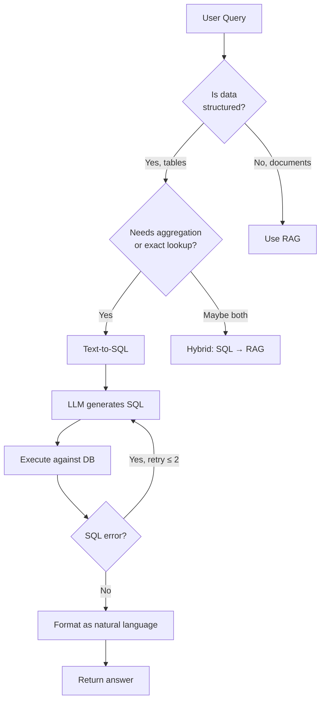

# Structured Retrieval: Text-to-SQL

> Not everything is a document. When your data lives in tables, retrieval is a SQL query: and the LLM writes it.

**Type:** Build
**Languages:** Python
**Prerequisites:** Lesson 05 (naive RAG), Lesson 08 (query transformation)
**Time:** ~70 minutes
**Phase:** 02 · Retrieval & RAG

---

## Learning Objectives

- Implement a complete text-to-SQL pipeline: schema serialization, SQL generation, execution, and self-correction
- Identify when to use text-to-SQL versus RAG versus a hybrid of both
- Serialize a relational schema into LLM-readable context (table names, columns, types, foreign keys, sample rows)
- Build a self-correction loop: generate SQL → execute → feed errors back → retry
- Enforce read-only safety at the connection level
- Evaluate the pipeline using a (natural language query, expected result) test set

---

## The Problem

You have an e-commerce database with a `products` table, an `orders` table, and a `customers` table. A support analyst asks: "Which customers spent more than $500 last month?" You could export the data to text files and run RAG on them. That would be a mistake.

RAG is the wrong tool for structured data. Vector similarity retrieves documents that are *semantically close* to a query. It does not aggregate, join, filter by date range, or count rows. A naive RAG system asked "how many orders did we have last week?" will find the chunks that contain the word "orders" and return whatever text is nearby: which is usually wrong.

The right tool for structured, queryable data is SQL. The engineering challenge is that most users cannot write SQL. The solution: have the LLM write the SQL. The LLM knows the query semantics (what the user wants). You give it the schema. It generates the query. You execute it. This is text-to-SQL, and it is one of the most deployed AI patterns in production analytics tools.

The three hard problems:
1. The LLM has to know your schema to write correct SQL. You have to serialize it intelligently.
2. LLMs make SQL mistakes: wrong table names, missing JOINs, wrong aggregations. You need a correction loop.
3. LLM-generated SQL runs against your real database. Safety enforcement is not optional.

---

## The Concept

### Text-to-SQL vs RAG vs Hybrid

```
┌─────────────────────────────────────────────────────────────────┐
│  USE TEXT-TO-SQL WHEN                                           │
│  • Data is structured and lives in tables                       │
│  • Query needs aggregation, grouping, sorting, or date filters  │
│  • You need exact answers (counts, totals, averages)           │
│  • Schema is stable and documented                              │
└─────────────────────────────────────────────────────────────────┘

┌─────────────────────────────────────────────────────────────────┐
│  USE RAG WHEN                                                   │
│  • Data is unstructured (PDFs, emails, docs, Slack)             │
│  • Query needs fuzzy matching or semantic understanding         │
│  • You need passages, not rows                                  │
│  • Schema doesn't exist                                         │
└─────────────────────────────────────────────────────────────────┘

┌─────────────────────────────────────────────────────────────────┐
│  USE HYBRID WHEN                                                │
│  • Step 1: SQL finds the relevant entity (customer ID, order)  │
│  • Step 2: RAG answers a question about that entity's documents │
│  Example: "What did Sarah say in her support tickets?"          │
│  SQL: find customer ID for Sarah                               │
│  RAG: retrieve relevant tickets filtered by customer_id        │
└─────────────────────────────────────────────────────────────────┘
```



### Schema Serialization

The LLM needs to know your schema to write correct SQL. The more context you provide, the more accurate the generated SQL. Include:

- Table names and their purpose
- Column names, data types, and nullable status
- Foreign key relationships
- 2–3 sample rows per table (not just the schema: sample data disambiguates column semantics)

A column named `status` in an `orders` table could mean anything. Sample data that shows values like `'pending'`, `'shipped'`, `'delivered'` tells the LLM exactly what to filter on.

**Schema context template:**

```
Table: orders
Columns:
  - id (INTEGER, PRIMARY KEY)
  - customer_id (INTEGER, FK → customers.id)
  - total_amount (REAL)
  - status (TEXT) -- e.g.: 'pending', 'shipped', 'delivered'
  - created_at (TEXT) -- ISO 8601 datetime

Sample rows:
  (1, 42, 149.99, 'shipped', '2024-11-15T10:23:00')
  (2, 17, 89.50, 'delivered', '2024-11-20T14:01:00')
```

### The Self-Correction Loop

LLMs get SQL wrong. Common mistakes:
- Wrong column name (off by one character, wrong table prefix)
- Missing JOIN (assumed a column exists in the wrong table)
- Wrong aggregation (COUNT when SUM was needed)
- Wrong date filter format

The fix: catch the SQL error, feed it back to the LLM with the original query and the failed SQL, and ask it to correct. One retry catches ~85% of LLM SQL errors. Two retries catches ~95%.

```
Attempt 1: LLM generates SQL
→ Execute
→ SQLite error: "no such column: order_total"
→ Feed error + failed SQL back to LLM: "Fix this SQL error: [error]. Original SQL: [sql]"
Attempt 2: LLM generates corrected SQL
→ Execute
→ Success
→ Format and return result
```

### Safety: Read-Only Enforcement

Text-to-SQL is a code execution risk. A malicious or confused user query could generate `DROP TABLE`, `DELETE`, or `UPDATE` statements. Never run LLM-generated SQL without restrictions.

Options:
1. **SQLite PRAGMA**: `PRAGMA query_only = ON`: enforces read-only at connection level
2. **Parse before execute**: check the generated SQL for write keywords before executing
3. **User-level database permissions**: run the pipeline as a read-only database user

Use option 1 (PRAGMA) as the first line of defense. Add option 2 as a belt-and-suspenders check. Never rely solely on prompt instructions like "only write SELECT statements": prompt constraints are not safety controls.

---

## Build It

### Step 1: Dependencies and Setup

```python
# pip install openai
# SQLite is part of Python's standard library: no install needed.
# Set environment variable: OPENAI_API_KEY=sk-...

import os
import sqlite3
import json
from openai import OpenAI
```

Two imports do all the work. `sqlite3` handles the database. `openai` generates the SQL. The standard library handles the rest.

### Step 2: Build the In-Memory Database

```python
def build_sample_database() -> sqlite3.Connection:
    """
    Create an in-memory SQLite database with three tables:
    customers, products, orders.
    Populate each with 20 rows of realistic sample data.
    Returns a read-write connection (used only for setup).
    """
    conn = sqlite3.connect(":memory:")
    conn.row_factory = sqlite3.Row  # rows act like dicts
    cursor = conn.cursor()

    cursor.executescript("""
        CREATE TABLE customers (
            id          INTEGER PRIMARY KEY,
            name        TEXT NOT NULL,
            email       TEXT UNIQUE NOT NULL,
            city        TEXT,
            joined_at   TEXT  -- ISO 8601 date
        );

        CREATE TABLE products (
            id          INTEGER PRIMARY KEY,
            name        TEXT NOT NULL,
            category    TEXT,
            price       REAL NOT NULL,
            stock       INTEGER DEFAULT 0
        );

        CREATE TABLE orders (
            id            INTEGER PRIMARY KEY,
            customer_id   INTEGER REFERENCES customers(id),
            product_id    INTEGER REFERENCES products(id),
            quantity      INTEGER NOT NULL DEFAULT 1,
            total_amount  REAL NOT NULL,
            status        TEXT DEFAULT 'pending',  -- pending, shipped, delivered, cancelled
            created_at    TEXT  -- ISO 8601 datetime
        );
    """)

    # 20 customers
    customers = [
        (1,  "Alice Chen",      "alice@example.com",   "Seattle",    "2023-01-15"),
        (2,  "Bob Martinez",    "bob@example.com",     "Austin",     "2023-02-20"),
        (3,  "Carol Wu",        "carol@example.com",   "New York",   "2023-03-05"),
        (4,  "David Kim",       "david@example.com",   "Chicago",    "2023-03-18"),
        (5,  "Eve Santos",      "eve@example.com",     "Miami",      "2023-04-01"),
        (6,  "Frank Lee",       "frank@example.com",   "Seattle",    "2023-04-14"),
        (7,  "Grace Patel",     "grace@example.com",   "Austin",     "2023-05-09"),
        (8,  "Henry Okafor",    "henry@example.com",   "New York",   "2023-05-22"),
        (9,  "Iris Tanaka",     "iris@example.com",    "Los Angeles","2023-06-10"),
        (10, "James Rivera",    "james@example.com",   "Chicago",    "2023-06-28"),
        (11, "Kate Thompson",   "kate@example.com",    "Seattle",    "2023-07-03"),
        (12, "Liam O'Brien",    "liam@example.com",    "Boston",     "2023-07-19"),
        (13, "Maya Johnson",    "maya@example.com",    "Miami",      "2023-08-05"),
        (14, "Noah Williams",   "noah@example.com",    "Austin",     "2023-08-20"),
        (15, "Olivia Brown",    "olivia@example.com",  "New York",   "2023-09-04"),
        (16, "Paul Davis",      "paul@example.com",    "Los Angeles","2023-09-18"),
        (17, "Quinn Miller",    "quinn@example.com",   "Chicago",    "2023-10-02"),
        (18, "Rachel Wilson",   "rachel@example.com",  "Seattle",    "2023-10-15"),
        (19, "Sam Taylor",      "sam@example.com",     "Boston",     "2023-11-01"),
        (20, "Tina Anderson",   "tina@example.com",    "Miami",      "2023-11-20"),
    ]
    cursor.executemany(
        "INSERT INTO customers VALUES (?,?,?,?,?)", customers
    )

    # 10 products
    products = [
        (1,  "Wireless Headphones", "Electronics",   89.99,  42),
        (2,  "Mechanical Keyboard", "Electronics",  129.99,  30),
        (3,  "USB-C Hub",           "Electronics",   49.99,  75),
        (4,  "Standing Desk Mat",   "Office",        39.99,  60),
        (5,  "Laptop Stand",        "Office",        59.99,  55),
        (6,  "Blue Light Glasses",  "Accessories",   24.99, 120),
        (7,  "Webcam HD 1080p",     "Electronics",   79.99,  25),
        (8,  "Desk Organizer",      "Office",        29.99,  80),
        (9,  "Ergonomic Mouse",     "Electronics",   69.99,  45),
        (10, "Monitor Light Bar",   "Electronics",   44.99,  65),
    ]
    cursor.executemany(
        "INSERT INTO products VALUES (?,?,?,?,?)", products
    )

    # 20 orders (spanning Nov-Dec 2024)
    orders = [
        (1,   2, 1,  1,  89.99, "delivered",   "2024-11-01T09:15:00"),
        (2,   5, 2,  1, 129.99, "delivered",   "2024-11-03T11:30:00"),
        (3,   1, 3,  2,  99.98, "shipped",     "2024-11-05T14:00:00"),
        (4,   8, 5,  1,  59.99, "delivered",   "2024-11-08T10:20:00"),
        (5,   3, 1,  1,  89.99, "delivered",   "2024-11-10T16:45:00"),
        (6,  12, 4,  2,  79.98, "shipped",     "2024-11-12T09:00:00"),
        (7,   7, 7,  1,  79.99, "delivered",   "2024-11-14T13:10:00"),
        (8,  15, 2,  2, 259.98, "pending",     "2024-11-17T08:55:00"),
        (9,   4, 9,  1,  69.99, "delivered",   "2024-11-19T15:30:00"),
        (10,  9, 6,  3,  74.97, "shipped",     "2024-11-21T11:00:00"),
        (11, 11, 10, 1,  44.99, "delivered",   "2024-11-24T14:20:00"),
        (12,  6, 1,  1,  89.99, "cancelled",   "2024-11-26T10:10:00"),
        (13, 13, 2,  1, 129.99, "delivered",   "2024-11-28T12:00:00"),
        (14, 17, 5,  2, 119.98, "shipped",     "2024-11-30T09:45:00"),
        (15,  2, 3,  1,  49.99, "delivered",   "2024-12-02T16:00:00"),
        (16, 20, 8,  2,  59.98, "pending",     "2024-12-04T11:30:00"),
        (17,  1, 9,  1,  69.99, "shipped",     "2024-12-06T13:45:00"),
        (18, 14, 7,  1,  79.99, "delivered",   "2024-12-08T10:00:00"),
        (19, 10, 2,  1, 129.99, "delivered",   "2024-12-10T15:20:00"),
        (20, 16, 4,  3, 119.97, "shipped",     "2024-12-12T08:30:00"),
    ]
    cursor.executemany(
        "INSERT INTO orders VALUES (?,?,?,?,?,?,?)", orders
    )

    conn.commit()
    return conn
```

### Step 3: Schema Serialization

```python
def serialize_schema(conn: sqlite3.Connection, sample_rows: int = 3) -> str:
    """
    Serialize the full database schema into a context string for the LLM.
    Includes: table names, columns (name + type), foreign keys, sample rows.
    The LLM needs all of this to write correct SQL.
    """
    cursor = conn.cursor()

    # Get all user tables
    cursor.execute(
        "SELECT name FROM sqlite_master WHERE type='table' ORDER BY name"
    )
    tables = [row[0] for row in cursor.fetchall()]

    parts = ["DATABASE SCHEMA\n" + "=" * 60]

    for table in tables:
        parts.append(f"\nTable: {table}")

        # Column info
        cursor.execute(f"PRAGMA table_info({table})")
        columns = cursor.fetchall()
        parts.append("Columns:")
        for col in columns:
            # col: (cid, name, type, notnull, dflt_value, pk)
            col_def = f"  - {col[1]} ({col[2]})"
            if col[5]:  # primary key
                col_def += ", PRIMARY KEY"
            if col[3]:  # not null
                col_def += ", NOT NULL"
            parts.append(col_def)

        # Foreign keys
        cursor.execute(f"PRAGMA foreign_key_list({table})")
        fks = cursor.fetchall()
        if fks:
            parts.append("Foreign Keys:")
            for fk in fks:
                # fk: (id, seq, table, from, to, ...)
                parts.append(f"  - {fk[3]} → {fk[2]}.{fk[4]}")

        # Sample rows
        cursor.execute(f"SELECT * FROM {table} LIMIT {sample_rows}")
        rows = cursor.fetchall()
        if rows:
            parts.append(f"Sample rows (first {len(rows)}):")
            for row in rows:
                parts.append(f"  {tuple(row)}")

    return "\n".join(parts)
```

### Step 4: SQL Generation Prompt

```python
client = OpenAI(api_key=os.environ["OPENAI_API_KEY"])
MODEL = "gpt-4o-mini"

SQL_SYSTEM_PROMPT = """You are a SQL expert. Your job is to write correct SQLite queries 
based on a user's natural language question and the provided database schema.

Rules:
1. Write ONLY a single SELECT statement. Never write INSERT, UPDATE, DELETE, DROP, or CREATE.
2. Use only table and column names that appear in the schema.
3. For date comparisons, use SQLite's date() or strftime() functions.
4. Return ONLY the SQL query: no explanation, no markdown code fences, no commentary.
5. If the question is ambiguous, make the most reasonable interpretation.
"""

def generate_sql(nl_query: str, schema_context: str) -> str:
    """
    Given a natural language query and serialized schema, generate SQL.
    Returns the raw SQL string.
    """
    response = client.chat.completions.create(
        model=MODEL,
        messages=[
            {"role": "system", "content": SQL_SYSTEM_PROMPT},
            {
                "role": "user",
                "content": (
                    f"{schema_context}\n\n"
                    f"---\n\n"
                    f"Question: {nl_query}\n\n"
                    f"SQL query:"
                ),
            },
        ],
        temperature=0.0,
    )
    sql = response.choices[0].message.content.strip()
    # Strip markdown code fences if the model added them anyway
    if sql.startswith("```"):
        sql = sql.split("```")[1]
        if sql.startswith("sql"):
            sql = sql[3:]
    return sql.strip()


def correct_sql(
    nl_query: str,
    failed_sql: str,
    error_message: str,
    schema_context: str,
) -> str:
    """
    Feed a failed SQL + error message back to the LLM for self-correction.
    Returns a corrected SQL string.
    """
    correction_prompt = (
        f"{schema_context}\n\n"
        f"---\n\n"
        f"The following SQL was generated for this question: {nl_query}\n\n"
        f"Failed SQL:\n{failed_sql}\n\n"
        f"Error message:\n{error_message}\n\n"
        f"Please write a corrected SQL query that fixes the error. "
        f"Return ONLY the corrected SQL."
    )

    response = client.chat.completions.create(
        model=MODEL,
        messages=[
            {"role": "system", "content": SQL_SYSTEM_PROMPT},
            {"role": "user", "content": correction_prompt},
        ],
        temperature=0.0,
    )
    sql = response.choices[0].message.content.strip()
    if sql.startswith("```"):
        sql = sql.split("```")[1]
        if sql.startswith("sql"):
            sql = sql[3:]
    return sql.strip()
```

### Step 5: Safe SQL Execution with Error Recovery

```python
READ_ONLY_KEYWORDS = {"insert", "update", "delete", "drop", "create", "alter", "truncate"}


def is_read_only(sql: str) -> bool:
    """
    Simple keyword check: reject any SQL containing write operations.
    This is a belt-and-suspenders check; PRAGMA query_only is the real guard.
    """
    first_word = sql.strip().lower().split()[0] if sql.strip() else ""
    return first_word == "select"


def execute_sql(
    conn: sqlite3.Connection,
    sql: str,
    max_rows: int = 100,
) -> tuple[list[dict], str | None]:
    """
    Execute SQL and return (rows, error_message).
    rows: list of dicts (column → value): empty on error.
    error_message: None on success, error string on failure.

    Safety: PRAGMA query_only prevents all write operations at the
    connection level. The is_read_only() check is a secondary guard.
    """
    if not is_read_only(sql):
        return [], f"Rejected: SQL must be a SELECT statement, got: {sql[:80]}"

    try:
        # Enforce read-only at connection level
        conn.execute("PRAGMA query_only = ON")
        cursor = conn.execute(sql)
        columns = [description[0] for description in cursor.description]
        rows = [dict(zip(columns, row)) for row in cursor.fetchmany(max_rows)]
        return rows, None
    except sqlite3.Error as e:
        return [], str(e)
    finally:
        # Re-enable write access (needed for future calls in the same session)
        conn.execute("PRAGMA query_only = OFF")
```

### Step 6: The Self-Correction Loop

```python
def run_text_to_sql(
    nl_query: str,
    conn: sqlite3.Connection,
    schema_context: str,
    max_retries: int = 2,
) -> dict:
    """
    Full text-to-SQL pipeline with self-correction.

    Returns:
      sql: the final SQL that was executed (or last attempt on failure)
      rows: list of result dicts
      answer: natural language answer
      attempts: number of LLM calls made
      error: final error message, or None on success
    """
    sql = generate_sql(nl_query, schema_context)
    attempts = 1

    for attempt in range(max_retries + 1):
        rows, error = execute_sql(conn, sql)

        if error is None:
            # Success
            answer = format_answer(nl_query, rows, sql)
            return {
                "sql": sql,
                "rows": rows,
                "answer": answer,
                "attempts": attempts,
                "error": None,
            }

        # SQL failed: request correction if retries remain
        if attempt < max_retries:
            print(f"  SQL error on attempt {attempt + 1}: {error}")
            print(f"  Requesting correction from LLM...")
            sql = correct_sql(nl_query, sql, error, schema_context)
            attempts += 1

    # All retries exhausted
    return {
        "sql": sql,
        "rows": [],
        "answer": f"I was unable to answer this question. Final SQL error: {error}",
        "attempts": attempts,
        "error": error,
    }
```

> **Real-world check:** A customer's database admin says "you're letting an AI write SQL queries that run against our production database. What stops it from doing a DELETE or dropping a table?" How would you explain, in plain terms, what the actual safety guarantees are here and where they come from?

### Step 7: Format Results as Natural Language

```python
ANSWER_SYSTEM_PROMPT = """You are a helpful data analyst. Given a natural language question,
the SQL query used to answer it, and the query results as JSON, write a clear and concise
natural language answer. Be specific: include actual numbers, names, and values from the results.
If the results are empty, say so clearly."""


def format_answer(nl_query: str, rows: list[dict], sql: str) -> str:
    """
    Convert SQL results into a natural language answer using the LLM.
    """
    if not rows:
        return "The query returned no results."

    results_json = json.dumps(rows[:20], indent=2)  # cap at 20 rows for prompt

    response = client.chat.completions.create(
        model=MODEL,
        messages=[
            {"role": "system", "content": ANSWER_SYSTEM_PROMPT},
            {
                "role": "user",
                "content": (
                    f"Question: {nl_query}\n\n"
                    f"SQL used:\n{sql}\n\n"
                    f"Results ({len(rows)} rows):\n{results_json}\n\n"
                    f"Answer:"
                ),
            },
        ],
        temperature=0.0,
    )
    return response.choices[0].message.content.strip()
```

### Step 8: Main Pipeline and Demo

```python
def main():
    print("Building sample e-commerce database...")
    conn = build_sample_database()

    print("Serializing schema for LLM context...")
    schema_context = serialize_schema(conn, sample_rows=3)

    # Demo queries: covering aggregation, filtering, joins, date ranges
    demo_queries = [
        "Which customers have placed more than one order?",
        "What is the total revenue from delivered orders?",
        "Which product has the highest total sales volume?",
        "List all orders placed in December 2024 with their customer names.",
        "What is the average order value by customer city?",
    ]

    print("\n" + "=" * 60)
    print("TEXT-TO-SQL DEMO")
    print("=" * 60)

    for query in demo_queries:
        print(f"\nQuery: {query}")
        print("-" * 50)
        result = run_text_to_sql(query, conn, schema_context)
        print(f"SQL ({result['attempts']} attempt(s)):\n  {result['sql']}")
        print(f"\nAnswer:\n  {result['answer']}")
        if result["error"]:
            print(f"  [Final error: {result['error']}]")

    conn.close()


if __name__ == "__main__":
    main()
```

---

## Use It

Once the pipeline is working, you can extend it in several directions:

**Add a question classifier** that decides whether to use text-to-SQL or RAG based on the query:

```python
def route_query(nl_query: str) -> str:
    """Returns 'sql' or 'rag'."""
    # Heuristics: aggregate keywords → SQL
    sql_keywords = ["how many", "total", "average", "sum", "count",
                    "which customers", "list all", "top", "most", "least"]
    if any(kw in nl_query.lower() for kw in sql_keywords):
        return "sql"
    return "rag"
```

**Add result caching** for frequently asked queries: the same NL query generates the same SQL against an unchanged database:

```python
import hashlib
_cache: dict[str, dict] = {}

def cached_text_to_sql(nl_query: str, conn, schema_context: str) -> dict:
    key = hashlib.md5(nl_query.encode()).hexdigest()
    if key not in _cache:
        _cache[key] = run_text_to_sql(nl_query, conn, schema_context)
    return _cache[key]
```

> **Perspective shift:** A data analyst says "I already know SQL and I can just query the database myself. Who is this actually for, and when does natural language querying genuinely save time over writing the query directly?"

---

## Ship It

The runnable artifact is `code/main.py`. It runs entirely in memory: no external database required:

```bash
export OPENAI_API_KEY=sk-...
python main.py
```

The skill card in `outputs/skill-text-to-sql.md` is a reference you can paste into any project that needs a text-to-SQL pipeline.

---

## Evaluate It

Build a test set of 20 (natural language query, expected result) pairs before you start tuning. Expected result can be either:
- **Expected SQL**: exact SQL you'd write by hand
- **Expected row count + key values**: e.g., "3 rows, all with city='Seattle'"

```python
eval_set = [
    {
        "query": "How many orders have been delivered?",
        "expected_count": 11,        # count delivered orders in the dataset
        "expected_key": "count",     # column to check
    },
    {
        "query": "What is the total revenue from all orders?",
        "expected_value_contains": "1",  # rough check
    },
    # ...
]
```

**Metrics to track:**
- **Execution success rate**: what fraction of generated SQL runs without error?
- **Correct result rate**: what fraction of successful queries return the right answer?
- **Self-correction rate**: when SQL fails on attempt 1, what fraction succeed on attempt 2?

**Common failure modes:**

| Failure | Cause | Fix |
|---------|-------|-----|
| Wrong table JOIN | LLM missed a foreign key | Add FK relationships to schema context explicitly |
| Missing WHERE clause | Query was ambiguous | Add more examples to schema context; clarify column semantics in comments |
| Wrong aggregation | SUM vs COUNT confusion | Add column-level comments in schema |
| Date format mismatch | SQLite date vs string comparison | Add a schema comment: "dates are stored as ISO 8601 strings: 'YYYY-MM-DD'" |

Target execution success rate: **>90%**. Target correct result rate: **>80%** on the first attempt, **>90%** with one retry.

---

## Exercises

1. **[Easy]** Add a 4th table (`reviews` with `order_id`, `rating`, `comment`) and extend `serialize_schema()` to include it. Ask the pipeline: "What is the average rating for each product?"

2. **[Medium]** Build an evaluation harness: create 15 (NL query, expected SQL or expected result) pairs. Run each through the pipeline and score: execution success / result correct / retries needed. Print a summary report.

3. **[Hard]** Implement a hybrid query router: a question like "What did customers who bought the wireless headphones say about them?" should (1) use SQL to find the relevant customer IDs, then (2) use RAG over a small corpus of fake customer reviews to answer the open-ended question. Wire both pipelines together.

---

## Key Terms

| Term | What people say | What it actually means |
|------|-----------------|------------------------|
| Text-to-SQL | "NL2SQL" or "natural language to SQL" | Generating a SQL query from a plain English question using an LLM |
| Schema serialization | "Schema injection" or "schema prompting" | Converting a database schema (tables, columns, types, keys) into an LLM-readable context string |
| Self-correction loop | "SQL repair" or "error recovery" | Feeding a SQL execution error back to the LLM and asking it to fix the query |
| Read-only enforcement | "SQL safety" or "injection prevention" | Restricting LLM-generated SQL to SELECT statements only, at the connection or parse level |
| PRAGMA query_only | SQLite pragma | A SQLite connection-level setting that blocks all write operations for that connection |
| RAG hybrid | "Text-to-SQL + RAG" | Using SQL to find structured entities, then RAG to answer questions about unstructured documents linked to those entities |

---

## Further Reading

- [SQLite Documentation: query_only pragma](https://www.sqlite.org/pragma.html#pragma_query_only): the right way to enforce read-only access at the connection level
- [BIRD Benchmark](https://bird-bench.github.io/): a standard benchmark for text-to-SQL systems; use it to compare your pipeline against state of the art
- [DIN-SQL Paper](https://arxiv.org/abs/2304.11015): "Decomposed In-Context Learning for Text-to-SQL": the technique behind decomposing hard queries into simpler sub-queries
- [Spider Dataset](https://yale-nlp.github.io/spider/): 10,000 NL/SQL pairs across 200 databases; essential for building eval sets
- [Vanna.AI](https://vanna.ai/): open-source text-to-SQL framework; useful reference for production schema management patterns
