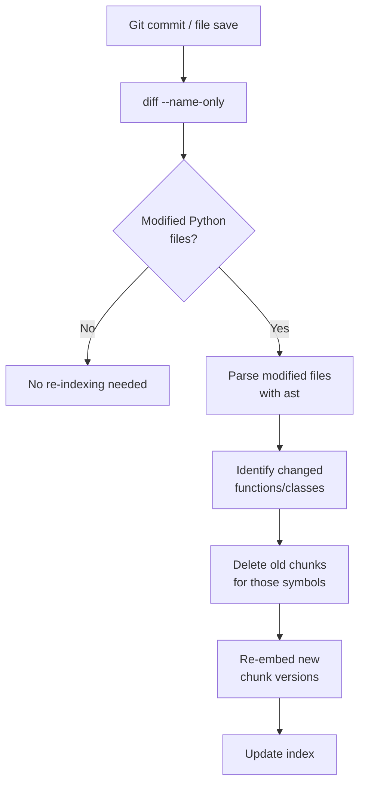

# RAG Over a Codebase

> Codebase RAG that chunks by lines misses everything. Chunk by symbol: function, class, module.

**Type:** Build
**Languages:** Python
**Prerequisites:** Lesson 04 (chunking strategies), Lesson 05 (naive RAG)
**Time:** ~75 minutes
**Phase:** 02 · Retrieval & RAG

---

## Learning Objectives

- Use Python's `ast` module to extract functions and classes as semantic chunks
- Build a rich text representation for each chunk that makes it embeddable and retrievable
- Embed code chunks using `sentence-transformers` (locally, no API key needed)
- Demonstrate why line-based chunking fails for code and AST-based chunking fixes it
- Implement incremental re-indexing: only re-embed modified functions
- Build and run a retrieval evaluation: given a natural language query, did the right function land in the top-3?

---

## The Problem

You have a Python codebase. A developer asks: "where is authentication handled?" You run naive RAG: split the source files every 400 characters, embed each chunk, retrieve the top-5. Two of the five chunks are the middle of a function body with no function name visible. One chunk is a comment block. One is an import section. None of them are the complete `authenticate()` function.

This is the core failure of line-based chunking on code: a function split in the middle is semantically meaningless. You can retrieve the fragment that contains the password check, but you cannot use it: there is no context about what function it belongs to, what it returns, or what calls it. Worse, the embedding of a code fragment is less informative than the embedding of the complete function with its name and docstring.

The fix is AST-based chunking. Python's standard library includes a full Python parser (`ast`). Parse the source file, walk the AST, extract every function and class definition as a complete unit. Each unit becomes one chunk. The chunk preserves: the function name (which matches query vocabulary directly), the docstring (natural language that bridges code and query), the full source, the file path, and the line numbers for navigation. A query for "authentication" matches the docstring. A query for "authenticate" matches the function name. A query for "password validation" matches both.

---

## The Concept

### Why Line-Chunking Destroys Code Semantics

```
# Source file: auth.py (simplified)
Line 1:   import hashlib
Line 2:
Line 3:   def authenticate(username: str, password: str) -> bool:
Line 4:       """Verify user credentials against the database."""
Line 5:       user = db.find_user(username)
Line 6:       if not user:
Line 7:           return False
Line 8:       return hashlib.sha256(password.encode()).hexdigest() == user.password_hash
Line 9:
Line 10:  def create_session(user_id: int) -> str:
```

**Line-chunked at 200 chars:**

| Chunk | Content | Problem |
|-------|---------|---------|
| Chunk A | `import hashlib\n\ndef authenticate(username:` | Cut mid-signature |
| Chunk B | `str, password: str) -> bool:\n    """Verify user...\n    user = db.find_user(` | No function name visible |
| Chunk C | `username)\n    if not user:\n        return False\n    return hashlib...` | No function context |

A query "how does authentication work?" retrieves Chunk B. It contains the relevant logic, but no function name, no return type, and the docstring is split. The engineer reading the retrieved chunk cannot use it.

**AST-chunked:**

| Chunk | Content |
|-------|---------|
| Function: `authenticate` | Full source of `authenticate()` with name, docstring, signature, body, file path, line range |
| Function: `create_session` | Full source of `create_session()` |

A query "how does authentication work?" retrieves the `authenticate` chunk: complete, usable, with full context.

### What to Embed: The Rich Text Representation

Don't embed raw source code. Embed a representation that bridges code and natural language:

```
Function `authenticate` in auth.py (lines 3–8):
Verify user credentials against the database.

def authenticate(username: str, password: str) -> bool:
    """Verify user credentials against the database."""
    user = db.find_user(username)
    if not user:
        return False
    return hashlib.sha256(password.encode()).hexdigest() == user.password_hash
```

This representation contains:
- The function name (exact match for queries like "find authenticate function")
- The file path (filter queries like "in auth.py")
- The docstring in natural language (semantic match for queries about intent)
- The full source (structural match for queries about implementation)

### Hierarchical Indexing

Code has multiple levels of granularity. A single index is often not enough:

```
┌─────────────────────────────────────────────────────┐
│  FILE LEVEL (module summary)                        │
│  "auth.py: handles user authentication,            │
│   session management, and password reset"           │
│  → answers: "which file handles auth?"             │
└─────────────────────────────────────────────────────┘
        │
        ▼
┌─────────────────────────────────────────────────────┐
│  FUNCTION/CLASS LEVEL (symbol chunks)               │
│  authenticate(), create_session(), Session class    │
│  → answers: "how does authenticate work?"          │
└─────────────────────────────────────────────────────┘
```

For most queries, function-level retrieval is sufficient. File-level summaries help when the question is about module responsibility, not implementation details.

### Incremental Indexing

Re-embedding an entire codebase on every change is expensive and slow. The right approach: watch git for changes, re-embed only the modified functions.



For incremental indexing, track a content hash (MD5 of source) per function. On re-parse, compare hashes: only re-embed functions whose hash changed.

### Symbol Search

Sometimes you know the exact function name. Combining vector search with literal symbol matching gives better results than either alone:

```
Query: "find the authenticate function"

Vector search: top-5 by cosine similarity
Symbol search: exact match on function name "authenticate"

Result: union of both, symbol matches ranked first
```

---

## Build It

### Step 1: Dependencies and Setup

```python
# pip install sentence-transformers numpy
# No API key needed: sentence-transformers runs locally.

import ast
import os
import textwrap
import hashlib
from pathlib import Path
from typing import NamedTuple

import numpy as np
from sentence_transformers import SentenceTransformer
```

The only dependencies are `sentence-transformers` (for local embedding) and `numpy` (for cosine similarity). The `ast` module is in Python's standard library: no install required.

### Step 2: AST-Based Chunk Extraction

```python
class CodeChunk(NamedTuple):
    """A semantic unit extracted from source code."""
    name: str           # function or class name
    kind: str           # 'function' or 'class'
    file_path: str      # relative path to source file
    lineno_start: int   # first line of definition
    lineno_end: int     # last line of definition
    docstring: str      # extracted docstring (empty if none)
    source: str         # full source text of the definition
    content_hash: str   # MD5 of source (for incremental indexing)


def extract_chunks_from_file(filepath: str) -> list[CodeChunk]:
    """
    Parse a Python file with ast and extract all top-level and nested
    function and class definitions as CodeChunk objects.

    Preserves: name, kind, file path, line numbers, docstring, full source.
    """
    path = Path(filepath)
    source_text = path.read_text(encoding="utf-8")

    try:
        tree = ast.parse(source_text, filename=filepath)
    except SyntaxError as e:
        print(f"Syntax error in {filepath}: {e}")
        return []

    source_lines = source_text.splitlines(keepends=True)
    chunks = []

    for node in ast.walk(tree):
        if not isinstance(node, (ast.FunctionDef, ast.AsyncFunctionDef, ast.ClassDef)):
            continue

        # Determine start/end lines
        start = node.lineno - 1  # 0-indexed
        end = node.end_lineno     # ast end_lineno is 1-indexed, exclusive slice is fine

        # Extract full source for this node
        node_source = "".join(source_lines[start:end])

        # Extract docstring
        docstring = ast.get_docstring(node) or ""

        kind = "class" if isinstance(node, ast.ClassDef) else "function"

        content_hash = hashlib.md5(node_source.encode()).hexdigest()

        chunks.append(CodeChunk(
            name=node.name,
            kind=kind,
            file_path=str(path),
            lineno_start=node.lineno,
            lineno_end=node.end_lineno,
            docstring=docstring,
            source=node_source,
            content_hash=content_hash,
        ))

    return chunks
```

### Step 3: Rich Text Representation for Embedding

```python
def chunk_to_embed_text(chunk: CodeChunk) -> str:
    """
    Build the text that will be embedded for a code chunk.

    Strategy: combine function name + file context + docstring + source.
    - Name and docstring contain natural language → matches query vocabulary
    - Source contains implementation details → matches structural queries
    - File path context helps with module-level queries
    """
    file_name = Path(chunk.file_path).name
    lines_ref = f"lines {chunk.lineno_start}–{chunk.lineno_end}"

    parts = [
        f"{chunk.kind.capitalize()} `{chunk.name}` in {file_name} ({lines_ref}):",
    ]

    if chunk.docstring:
        parts.append(chunk.docstring)

    parts.append("")
    parts.append(chunk.source)

    return "\n".join(parts)
```

### Step 4: Build the Index

```python
EMBED_MODEL = "all-MiniLM-L6-v2"  # Fast, 384-dim, runs on CPU


class CodebaseIndex:
    """
    In-memory index of code chunks with vector embeddings.
    Supports: add, query (vector similarity + symbol search), remove by name.
    """

    def __init__(self, model_name: str = EMBED_MODEL):
        print(f"Loading embedding model: {model_name}...")
        self.model = SentenceTransformer(model_name)
        self.chunks: list[CodeChunk] = []
        self.vectors: np.ndarray | None = None  # shape: (n_chunks, embed_dim)

    def add_chunks(self, chunks: list[CodeChunk]) -> None:
        """Embed and add chunks to the index."""
        if not chunks:
            return

        texts = [chunk_to_embed_text(c) for c in chunks]
        print(f"Embedding {len(texts)} chunks...")
        new_vectors = self.model.encode(texts, show_progress_bar=False)

        self.chunks.extend(chunks)

        if self.vectors is None:
            self.vectors = new_vectors
        else:
            self.vectors = np.vstack([self.vectors, new_vectors])

    def build_from_directory(self, directory: str, pattern: str = "**/*.py") -> None:
        """Walk a directory and index all Python files."""
        py_files = list(Path(directory).glob(pattern))
        print(f"Found {len(py_files)} Python files in {directory}")

        all_chunks = []
        for filepath in py_files:
            file_chunks = extract_chunks_from_file(str(filepath))
            all_chunks.extend(file_chunks)
            print(f"  {filepath.name}: {len(file_chunks)} chunks extracted")

        self.add_chunks(all_chunks)
        print(f"Total chunks indexed: {len(self.chunks)}")

    def query(self, nl_query: str, top_k: int = 5) -> list[dict]:
        """
        Retrieve top-k most relevant code chunks for a natural language query.
        Returns list of dicts: {chunk, score, rank}.
        """
        if not self.chunks or self.vectors is None:
            return []

        query_vec = self.model.encode([nl_query])[0]

        # Cosine similarity
        norms = np.linalg.norm(self.vectors, axis=1) * np.linalg.norm(query_vec)
        norms = np.where(norms == 0, 1e-10, norms)  # avoid division by zero
        scores = self.vectors @ query_vec / norms

        top_indices = np.argsort(scores)[::-1][:top_k]

        return [
            {
                "chunk": self.chunks[i],
                "score": float(scores[i]),
                "rank": rank + 1,
            }
            for rank, i in enumerate(top_indices)
        ]

    def symbol_search(self, name: str) -> list[dict]:
        """
        Exact and partial symbol name lookup.
        Complements vector search for direct function name queries.
        """
        name_lower = name.lower()
        results = []
        for chunk in self.chunks:
            if name_lower in chunk.name.lower():
                results.append({"chunk": chunk, "score": 1.0, "rank": 1})
        return results

    def hybrid_search(self, query: str, top_k: int = 5) -> list[dict]:
        """
        Combine vector similarity search with symbol name matching.
        Symbol exact matches are ranked first; vector results fill the rest.
        """
        # Extract potential symbol names from query (quoted or CamelCase/snake_case words)
        import re
        symbol_candidates = re.findall(r'[`\'"]([\w_]+)[`\'"]|([A-Z][a-z]+[A-Z]\w*|[a-z_]+[a-z_]{2,})', query)
        potential_symbols = [m[0] or m[1] for m in symbol_candidates if m[0] or m[1]]

        symbol_hits = []
        seen_names = set()
        for sym in potential_symbols:
            for result in self.symbol_search(sym):
                key = (result["chunk"].file_path, result["chunk"].name)
                if key not in seen_names:
                    symbol_hits.append(result)
                    seen_names.add(key)

        # Vector search
        vector_results = self.query(query, top_k=top_k + len(symbol_hits))

        # Merge: symbol matches first, then vector results (deduped)
        combined = list(symbol_hits)
        for vr in vector_results:
            key = (vr["chunk"].file_path, vr["chunk"].name)
            if key not in seen_names:
                combined.append(vr)
                seen_names.add(key)

        # Re-rank and cap
        for rank, item in enumerate(combined[:top_k], 1):
            item["rank"] = rank

        return combined[:top_k]
```

### Step 5: Line-Chunking Comparison

```python
def line_chunk_file(filepath: str, chunk_size: int = 200) -> list[dict]:
    """
    Naive line-based chunking of a Python file.
    Used for comparison against AST-based chunking.
    Returns list of {text, start_line, end_line}.
    """
    lines = Path(filepath).read_text(encoding="utf-8").splitlines()
    chunks = []
    for i in range(0, len(lines), chunk_size):
        chunk_lines = lines[i:i + chunk_size]
        chunks.append({
            "text": "\n".join(chunk_lines),
            "start_line": i + 1,
            "end_line": min(i + chunk_size, len(lines)),
        })
    return chunks


def compare_chunking_strategies(
    filepath: str,
    query: str,
    model: SentenceTransformer,
    top_k: int = 3,
) -> None:
    """
    Side-by-side comparison: line-chunking vs AST-chunking for a given query.
    Shows which strategy retrieves the most useful context.
    """
    print(f"\n{'=' * 60}")
    print(f"CHUNKING STRATEGY COMPARISON")
    print(f"File: {filepath}")
    print(f"Query: {query}")
    print(f"{'=' * 60}")

    # --- Line chunking ---
    line_chunks = line_chunk_file(filepath, chunk_size=20)  # ~20 lines per chunk
    line_texts = [c["text"] for c in line_chunks]
    line_vectors = model.encode(line_texts)
    query_vec = model.encode([query])[0]

    norms = np.linalg.norm(line_vectors, axis=1) * np.linalg.norm(query_vec)
    norms = np.where(norms == 0, 1e-10, norms)
    line_scores = line_vectors @ query_vec / norms
    top_line = np.argsort(line_scores)[::-1][:top_k]

    print(f"\n--- LINE-CHUNKED (top {top_k}) ---")
    for rank, i in enumerate(top_line, 1):
        chunk = line_chunks[i]
        print(f"\nRank {rank} (score: {line_scores[i]:.3f}, lines {chunk['start_line']}–{chunk['end_line']}):")
        print(textwrap.indent(chunk["text"][:300], "  "))
        if len(chunk["text"]) > 300:
            print("  ... [truncated]")

    # --- AST chunking ---
    ast_chunks = extract_chunks_from_file(filepath)
    if ast_chunks:
        ast_texts = [chunk_to_embed_text(c) for c in ast_chunks]
        ast_vectors = model.encode(ast_texts)

        norms = np.linalg.norm(ast_vectors, axis=1) * np.linalg.norm(query_vec)
        norms = np.where(norms == 0, 1e-10, norms)
        ast_scores = ast_vectors @ query_vec / norms
        top_ast = np.argsort(ast_scores)[::-1][:top_k]

        print(f"\n--- AST-CHUNKED (top {top_k}) ---")
        for rank, i in enumerate(top_ast, 1):
            chunk = ast_chunks[i]
            print(f"\nRank {rank} (score: {ast_scores[i]:.3f}):")
            print(f"  {chunk.kind.upper()}: {chunk.name}")
            print(f"  File: {Path(chunk.file_path).name}, lines {chunk.lineno_start}–{chunk.lineno_end}")
            if chunk.docstring:
                print(f"  Docstring: {chunk.docstring[:100]}")
            print(f"  Source preview: {chunk.source[:200].strip()}")
    else:
        print("\n--- AST-CHUNKED: no chunks extracted ---")
```

### Step 6: Create a Sample Codebase for Demo

```python
SAMPLE_CODE = '''"""
auth.py: Authentication and session management for the web application.
"""

import hashlib
import secrets
import time
from typing import Optional


def authenticate(username: str, password: str) -> Optional[dict]:
    """
    Verify user credentials against the database.
    Returns the user record if credentials are valid, None otherwise.
    Uses SHA-256 password hashing with salt.
    """
    user = _db_find_user(username)
    if not user:
        return None
    expected_hash = hashlib.sha256(
        (password + user["salt"]).encode()
    ).hexdigest()
    if expected_hash != user["password_hash"]:
        return None
    return user


def create_session(user_id: int, ttl_seconds: int = 3600) -> str:
    """
    Create a new authentication session for the given user.
    Returns a secure random session token.
    Stores the session with an expiry timestamp.
    """
    token = secrets.token_hex(32)
    expiry = int(time.time()) + ttl_seconds
    _session_store[token] = {"user_id": user_id, "expiry": expiry}
    return token


def validate_session(token: str) -> Optional[int]:
    """
    Check if a session token is valid and not expired.
    Returns the user_id if valid, None if expired or not found.
    """
    session = _session_store.get(token)
    if not session:
        return None
    if time.time() > session["expiry"]:
        del _session_store[token]
        return None
    return session["user_id"]


def logout(token: str) -> bool:
    """
    Invalidate a session token. Returns True if the session existed.
    """
    if token in _session_store:
        del _session_store[token]
        return True
    return False


def reset_password(email: str) -> str:
    """
    Generate a password reset token for the given email.
    The token expires in 15 minutes.
    """
    token = secrets.token_urlsafe(24)
    expiry = int(time.time()) + 900  # 15 minutes
    _reset_tokens[email] = {"token": token, "expiry": expiry}
    return token


def apply_rate_limit(user_id: int, endpoint: str, limit: int = 100) -> bool:
    """
    Check whether the user has exceeded the rate limit for an endpoint.
    Returns True if the request is allowed, False if rate-limited.
    Uses a sliding window counter.
    """
    key = f"{user_id}:{endpoint}"
    current_window = int(time.time()) // 60  # 1-minute windows
    count = _rate_counters.get((key, current_window), 0)
    if count >= limit:
        return False
    _rate_counters[(key, current_window)] = count + 1
    return True


# Internal storage (in-memory for demo; use Redis in production)
_session_store: dict = {}
_reset_tokens: dict = {}
_rate_counters: dict = {}


def _db_find_user(username: str) -> Optional[dict]:
    """Internal: look up a user by username. Stub for demo."""
    users = {
        "alice": {"id": 1, "salt": "abc123", "password_hash": "demo_hash"},
    }
    return users.get(username)
'''


def write_sample_codebase(directory: str) -> str:
    """Write a sample auth.py file to a temp directory for demo."""
    os.makedirs(directory, exist_ok=True)
    filepath = os.path.join(directory, "auth.py")
    with open(filepath, "w") as f:
        f.write(SAMPLE_CODE)
    return filepath
```

### Step 7: Main Demo

```python
def main():
    import tempfile

    # Create a sample codebase
    tmpdir = tempfile.mkdtemp(prefix="coderag_demo_")
    print(f"Creating sample codebase in {tmpdir}...")
    sample_file = write_sample_codebase(tmpdir)
    print(f"Created: {sample_file}\n")

    # Load embedding model once
    model = SentenceTransformer(EMBED_MODEL)

    # --- Part 1: Chunking strategy comparison ---
    compare_chunking_strategies(
        filepath=sample_file,
        query="how is authentication handled?",
        model=model,
        top_k=3,
    )

    compare_chunking_strategies(
        filepath=sample_file,
        query="where is the rate limiter?",
        model=model,
        top_k=3,
    )

    # --- Part 2: Full AST-based codebase index ---
    print(f"\n{'=' * 60}")
    print("BUILDING AST-BASED CODEBASE INDEX")
    print(f"{'=' * 60}")

    index = CodebaseIndex(model_name=EMBED_MODEL)
    index.build_from_directory(tmpdir)

    queries = [
        "how does login work?",
        "where is the session token created?",
        "how are passwords hashed?",
        "show me the logout function",
        "how do I reset a password?",
    ]

    print(f"\n{'=' * 60}")
    print("RETRIEVAL RESULTS (AST-BASED INDEX)")
    print(f"{'=' * 60}")

    for query in queries:
        print(f"\nQuery: {query}")
        results = index.hybrid_search(query, top_k=3)
        for r in results:
            c = r["chunk"]
            doc = f": {c.docstring[:60]}..." if c.docstring else ""
            print(f"  [{r['rank']}] {c.kind} `{c.name}` (score: {r['score']:.3f}){doc}")

    # --- Part 3: Eval ---
    print(f"\n{'=' * 60}")
    print("RETRIEVAL EVALUATION")
    print(f"{'=' * 60}")

    eval_set = [
        {"query": "verify user credentials", "expected_function": "authenticate"},
        {"query": "create a session for a user", "expected_function": "create_session"},
        {"query": "check if session is expired", "expected_function": "validate_session"},
        {"query": "rate limiting for an endpoint", "expected_function": "apply_rate_limit"},
        {"query": "invalidate a session token", "expected_function": "logout"},
    ]

    hits = 0
    for item in eval_set:
        results = index.query(item["query"], top_k=3)
        top3_names = [r["chunk"].name for r in results]
        hit = item["expected_function"] in top3_names
        hits += int(hit)
        status = "HIT " if hit else "MISS"
        print(f"[{status}] '{item['query']}' → expected: {item['expected_function']} | got: {top3_names}")

    print(f"\nTop-3 retrieval accuracy: {hits}/{len(eval_set)} = {hits/len(eval_set)*100:.0f}%")

    # Cleanup
    import shutil
    shutil.rmtree(tmpdir)


if __name__ == "__main__":
    main()
```

> **Real-world check:** A senior engineer at a customer site says "GitHub Copilot already understands our codebase. Why would we build our own codebase RAG instead of just using that?" What would you say to them?

---

## Use It

Once the index is built, connect it to an LLM for full Q&A:

```python
from openai import OpenAI
from pathlib import Path

client = OpenAI()

def ask_codebase(question: str, index: CodebaseIndex, top_k: int = 5) -> str:
    """Retrieve relevant code chunks and generate an answer."""
    results = index.hybrid_search(question, top_k=top_k)

    context_parts = []
    for r in results:
        c = r["chunk"]
        context_parts.append(
            f"# {c.kind} `{c.name}` in {Path(c.file_path).name} "
            f"(lines {c.lineno_start}–{c.lineno_end})\n{c.source}"
        )
    context = "\n\n---\n\n".join(context_parts)

    resp = client.chat.completions.create(
        model="gpt-4o-mini",
        messages=[
            {"role": "system", "content": "Answer questions about the codebase using ONLY the provided code context."},
            {"role": "user", "content": f"Code context:\n{context}\n\nQuestion: {question}"},
        ],
        temperature=0.0,
    )
    return resp.choices[0].message.content
```

For large codebases, scope the search to a module before calling the LLM. A query about authentication doesn't need context from the billing module: scoping reduces token cost and improves precision.

> **Perspective shift:** An engineering manager points out: "Indexing our codebase means our code is being sent to an embedding API. What are the IP and confidentiality implications, and how should that factor into which embedding approach we pick?"

---

## Ship It

The runnable artifact is `code/main.py`. It runs entirely locally: no API key required:

```bash
pip install sentence-transformers numpy
python main.py
```

The skill card in `outputs/skill-codebase-rag.md` is a reference for building codebase Q&A into any project. It covers symbol extraction, embedding strategy, incremental indexing, and evaluation.

---

## Evaluate It

Build a retrieval eval set before deploying. For each natural language query, record the expected function name. Run the eval to get a top-3 hit rate:

```python
eval_set = [
    {"query": "how does user authentication work?",    "expected": "authenticate"},
    {"query": "where is the rate limiter?",            "expected": "apply_rate_limit"},
    {"query": "how is a session created?",             "expected": "create_session"},
    {"query": "how do I reset a password?",            "expected": "reset_password"},
    {"query": "how do I log someone out?",             "expected": "logout"},
]

hits = 0
for item in eval_set:
    results = index.query(item["query"], top_k=3)
    top3_names = [r["chunk"].name for r in results]
    hit = item["expected"] in top3_names
    hits += int(hit)
    print(f"{'HIT ' if hit else 'MISS'} {item['query']!r} → {top3_names}")

print(f"\nTop-3 hit rate: {hits}/{len(eval_set)} = {hits/len(eval_set)*100:.0f}%")
```

**Target**: top-3 hit rate > 80%. Common causes of misses:

| Problem | Symptom | Fix |
|---------|---------|-----|
| No docstrings | Low scores on intent queries | Add or generate docstrings |
| Generic function names | `fn()` not retrieved for semantic query | Add natural language description in embed text |
| Large class bodies | Class retrieved but relevant method missed | Index methods as separate chunks |
| Query vocabulary mismatch | "login" vs "authenticate" | Verify docstrings use common vocabulary |

---

## Exercises

1. **[Easy]** Modify `chunk_to_embed_text()` to include the names of function arguments in the embed text. Run the eval set: does this improve retrieval for queries like "function that takes a token and a user_id"?

2. **[Medium]** Implement a `file_summary()` method on `CodebaseIndex` that returns a per-file report: file name, number of functions/classes indexed, and a concatenation of all docstrings. Use this as a first-stage retrieval for queries like "which file handles authentication?"

3. **[Hard]** Extend the index to support TypeScript by using `tree-sitter` and `tree-sitter-typescript`. The interface (`extract_chunks()`, `CodebaseIndex.add_chunks()`, `index.query()`) should be identical to the Python version. Write a unified dispatcher that selects the parser by file extension.

---

## Key Terms

| Term | What people say | What it actually means |
|------|-----------------|------------------------|
| AST | "Abstract syntax tree" | The structured tree representation of source code produced by a parser; each node is a syntactic construct (function, class, expression) |
| Symbol | "Code symbol" or "named entity" | A named code element (function, class, method). Symbol-level retrieval finds the complete definition, not an arbitrary fragment |
| Docstring | "Doc" or "function doc" | A string literal at the top of a Python function/class body; the primary natural language signal for code retrieval |
| Incremental indexing | "Delta indexing" or "hot reload indexing" | Re-embedding only changed functions when files are modified, not the entire codebase |
| Symbol search | "Exact name lookup" | Finding code chunks by function/class name (exact or partial), complementing vector similarity |
| Rich embed text | "Code-to-text representation" | The combination of function name + docstring + source used for embedding: bridges code and natural language query vocabulary |

---

## Further Reading

- [Python ast module documentation](https://docs.python.org/3/library/ast.html): the standard library reference; `ast.walk()`, `ast.get_docstring()`, `node.lineno`, `node.end_lineno`
- [tree-sitter](https://tree-sitter.github.io/tree-sitter/): cross-language parsing library; supports Python, TypeScript, Go, Rust, and 40+ others with an identical query API
- [GitHub Copilot: Getting Better at Understanding Your Code](https://github.blog/2023-05-17-how-github-copilot-is-getting-better-at-understanding-your-code/): practitioner overview of hierarchical code indexing at scale
- [sentence-transformers documentation](https://www.sbert.net/): model selection guide; `all-MiniLM-L6-v2` vs `all-mpnet-base-v2` tradeoffs for code retrieval
- [CodeBERT](https://arxiv.org/abs/2002.08155): a pre-trained model for code search and code-to-documentation tasks; use when general-purpose sentence-transformers underperform on your codebase
