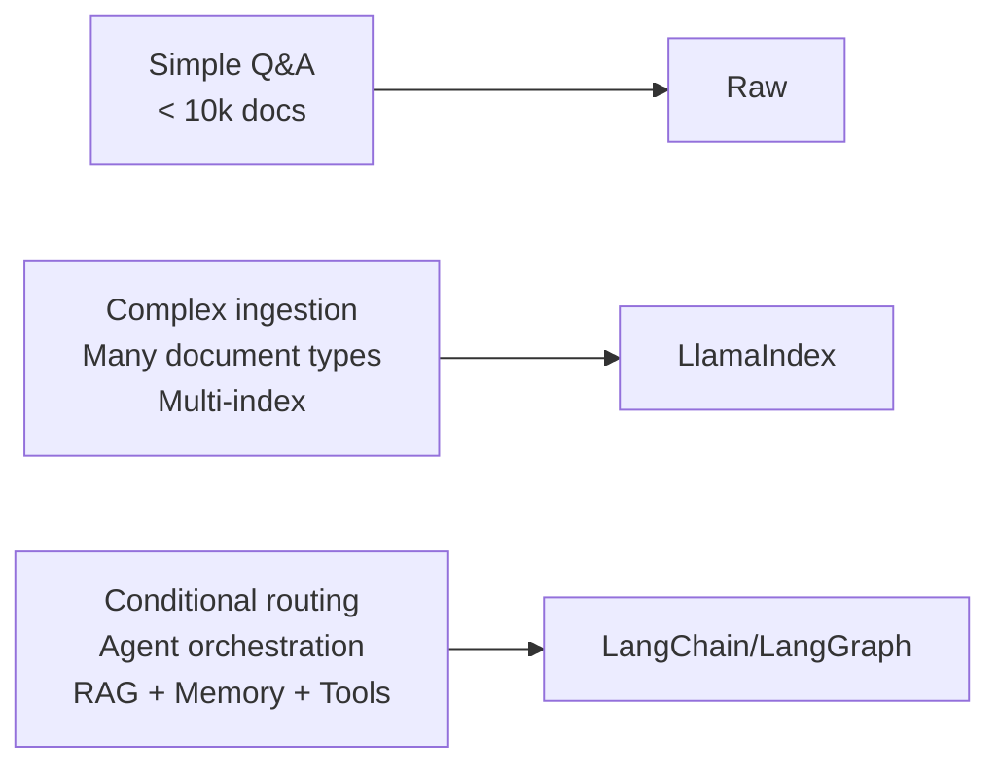

# أطر RAG: LlamaIndex وLangChain

> الإطار يستحق تعقيده حين تبدأ نسختك الساذجة بالتسرّب. اعرف ما يُصلحه قبل أن تستورده.

**النوع:** بناء
**اللغات:** Python
**المتطلبات:** الدرس 05 (RAG الساذج)، الدرس 06 (مقاييس الاسترجاع)، الدرس 10 (تقييم RAG)
**الوقت:** ~80 دقيقة
**المرحلة:** 02 · الاسترجاع وRAG

---

## أهداف التعلّم

- تنفيذ خط أنابيب RAG نفسه بثلاث طرق: خام (raw)، وLlamaIndex، وLangChain/LCEL
- تحديد ما يضيفه كل إطار بالضبط مقابل ما يكلّفه من تعقيد وقابلية تصحيح
- التعبير عن متى يكون الخام هو الخيار الصحيح ومتى يستحق الإطار حمله الزائد
- شرح التجريدات الأساسية لكل إطار (Nodes/QueryEngine مقابل Documents/Chain)
- تطبيق "مبدأ مخرج الطوارئ (escape hatch principle)": التحقّق من أن أي إطار يسمح لك بالنزول إلى استدعاءات API خام

---

## المشكلة

بنيت خط أنابيب RAG ساذجًا في الدرس 05. إنه يعمل. الآن يقول زميل "ينبغي أن نستخدم LlamaIndex" وآخر "LangChain هو المعيار." قبل أن تستورد أيًّا منهما، عليك الإجابة: ما المعطوب في نسختك الساذجة الذي يُصلحه الإطار؟

إن كانت الإجابة "لا شيء معطوب"، فالخام لا يزال الخيار الصحيح. الأطر ليست ترقيات: إنها أدوات لمشاكل محددة. LlamaIndex يحلّ خطوط أنابيب الإدخال المعقّدة والاسترجاع متعدد الفهارس. LangChain يحلّ التنظيم (orchestration): سَلسَلة استدعاءات نماذج LLM، والتوجيه بين استراتيجيات الاسترجاع، ودمج الوكلاء مع الذاكرة. إن لم تكن لديك أيّ من هاتين المشكلتين، فأنت تدفع ضريبة تعقيد بلا مقابل.

المهندسون الذين يعكسون هذا يستوردون إطارًا أولًا ثم يقضون أسابيع في تصحيح تعارضات الإصدارات، والسلوك الافتراضي المبهم، وتسرّبات التجريد. وحين يعطي النظام إجابة خاطئة في الثانية صباحًا، لا يستطيعون إيجاد أين يفشل الاسترجاع لأن الإطار أخفاه على عمق ست طبقات.

هذا الدرس يبني كل النسخ الثلاث من خط الأنابيب نفسه جنبًا إلى جنب. بعده، ستكون قادرًا على الاختيار بوعي.

---

## المفهوم

### الطبقات الثلاث

```
┌────────────────────────────────────────────────────────┐
│  RAW (no framework)                                    │
│  You write: chunk, embed, store, retrieve, prompt      │
│  You see:   every decision, every failure              │
│  Cost:      more code, manual retry logic              │
│  When:      <10k docs, simple Q&A, early exploration  │
└────────────────────────────────────────────────────────┘

┌────────────────────────────────────────────────────────┐
│  LLAMAINDEX                                            │
│  You get:   managed nodes, custom loaders, index types │
│  Cost:      abstractions over ingestion + retrieval    │
│  When:      complex ingestion, multi-index, KG needed  │
└────────────────────────────────────────────────────────┘

┌────────────────────────────────────────────────────────┐
│  LANGCHAIN / LCEL                                      │
│  You get:   chain orchestration, routing, agent state  │
│  Cost:      deep abstraction stack, rapid version drift│
│  When:      multi-step pipelines, conditional RAG,     │
│             RAG inside an agent with memory            │
└────────────────────────────────────────────────────────┘
```



### خريطة المفاهيم: خام ← LlamaIndex ← LangChain

كل إطار يُسقَط على العمليات البدائية نفسها. فهم الإسقاط هو طريقتك في تصحيح إطار: تتبّع ما يفعله رجوعًا إلى العملية الخام.

| العملية الخام | مكافئ LlamaIndex | مكافئ LangChain |
|---|---|---|
| قراءة النص | `SimpleDirectoryReader` | `TextLoader` / `DirectoryLoader` |
| تقطيع النص | `SentenceSplitter` (يُستدعى على Documents) | `RecursiveCharacterTextSplitter` |
| قاموس `{text, vector}` | `Node` (ببيانات وصفية، علاقات) | `Document` (ببيانات وصفية) |
| قاموس في الذاكرة | `VectorStoreIndex` (يغلّف مخزن متّجهات) | `FAISS.from_documents()` |
| `retrieve()` | `index.as_retriever()` | `vectorstore.as_retriever()` |
| `build_prompt()` | `PromptTemplate` (مُدار تلقائيًا في QueryEngine) | `PromptTemplate` في Chain |
| `generate()` | `query_engine.query()` | `RetrievalQA.from_chain_type()` / LCEL |

### أنماط الإطار المضادّة (The Framework Anti-Patterns)

**النمط المضادّ 1: التصميم بالإطار أولًا**
تستورد LlamaIndex في اليوم الأول من مشروع جديد. أنماط الإخفاق التي تبني الإطار حولها لا تظهر. أضفت 400 سطر من القوالب الجاهزة (boilerplate) وشجرة اعتماديات من 15 حزمة لمشكلة كان سيحلّها خط أنابيب خام من 50 سطرًا.

**النمط المضادّ 2: الإفراط في تجريد خطوط الأنابيب البسيطة**
تستخدم سلسلة `RetrievalQA` في LangChain لروبوت سؤال وجواب بسيط. يبلّغ مستخدم عن إجابات خاطئة. تقضي ثلاث ساعات في تتبّع داخليات LangChain لتجد أن سلسلة `stuff` الافتراضية كانت تحشو رموزًا كثيرة جدًا. في نسخة خام، لكان هذا مرئيًا فورًا في تسجيل المطالبة.

**النمط المضادّ 3: جحيم اعتماديات الإصدارات**
يصدر LlamaIndex وLangChain تحديثات عدة مرات شهريًا. تتغيّر واجهاتهما البرمجية بين الإصدارات الثانوية. خط أنابيب يعمل على `llama-index==0.10.x` ينكسر بصمت على `0.11.x` لأن قيمة افتراضية تغيّرت. تثبيت الإصدارات يساعد لكنه يخلق عبء صيانة. قيّم ما إذا كان هذا الحمل الزائد يستحق الميزات.

**النمط المضادّ 4: لا مخرج طوارئ**
تبني خط أنابيب RAG بالكامل داخل `QueryEngine` من LlamaIndex. تحتاج لاحقًا لإضافة خطوة إعادة ترتيب مخصّصة لا يدعمها LlamaIndex بنظافة. يحبسك الإطار. تحقّق دائمًا من أن أي إطار تستخدمه يسمح لك باستخراج العُقَد/المستندات المسترجَعة الخام وتنفيذ منطق مخصّص.

### مبدأ مخرج الطوارئ (The Escape Hatch Principle)

أي إطار تتبنّاه يجب أن يكشف البدائيات الخام في كل مرحلة:

```python
# LlamaIndex escape hatch:
retriever = index.as_retriever(similarity_top_k=5)
nodes = retriever.retrieve(query)  # returns raw Node objects
# Now you can do anything with `nodes`: custom re-ranking, custom formatting

# LangChain escape hatch:
retriever = vectorstore.as_retriever(search_kwargs={"k": 5})
docs = retriever.invoke(query)  # returns raw Document objects
# Now you can format them however you need
```

إن لم يمنحك إطار هذا، فسيحبسك في النهاية.

---

## البناء

### الخطوة 1: الإعداد المشترك وبيانات الاختبار

يستخدم العرض المجموعة نفسها وأسئلة الاختبار الخمسة نفسها عبر التنفيذات الثلاثة كلها:

```python
# pip install openai llama-index langchain langchain-openai langchain-community
# Set environment variable: OPENAI_API_KEY=sk-...

import os
import time
from openai import OpenAI

# Shared test corpus: same text used in all three implementations
CORPUS = [
    "Retrieval Augmented Generation (RAG) combines a retrieval system with an LLM to ground answers in a document corpus.",
    "Chunking strategy is the most impactful decision in a RAG pipeline. Chunk too small: context is lost. Chunk too large: retrieval is diluted.",
    "Cosine similarity measures the angle between two vectors, regardless of magnitude. It is the standard similarity metric for embedding-based retrieval.",
    "Hybrid search combines dense (embedding) retrieval with sparse (BM25/keyword) retrieval. It consistently outperforms either alone on recall.",
    "Re-ranking uses a cross-encoder to re-score retrieved chunks after initial retrieval. It adds latency but improves precision significantly.",
    "The RAG Triad evaluates three dimensions: faithfulness (answer grounded in context?), answer relevance (answers the question?), and context relevance (retrieved the right chunks?).",
    "LlamaIndex specializes in document ingestion pipelines and multi-index retrieval. It manages document nodes, metadata, and relationships automatically.",
    "LangChain's LCEL (LangChain Expression Language) allows composing chains declaratively. The pipe operator (|) connects runnables.",
    "A naive RAG pipeline: chunk text → embed chunks → store vectors → embed query → cosine search → format prompt → LLM call.",
    "Evaluation without ground truth is dangerous. Build your eval set before you build your pipeline. Otherwise you'll unconsciously tune to pass the test you already know.",
]

TEST_QUERIES = [
    "What is RAG?",
    "How does hybrid search work?",
    "What is the RAG Triad?",
    "When should I use LlamaIndex?",
    "How do I evaluate a RAG pipeline?",
]
```

### الخطوة 2: التنفيذ الخام (خط الأساس)

```python
import numpy as np

raw_client = OpenAI(api_key=os.environ["OPENAI_API_KEY"])
EMBED_MODEL = "text-embedding-3-small"
CHAT_MODEL = "gpt-4o-mini"


def raw_embed(texts: list[str]) -> np.ndarray:
    resp = raw_client.embeddings.create(model=EMBED_MODEL, input=texts)
    return np.array([item.embedding for item in resp.data])


def raw_build_index(corpus: list[str]) -> dict:
    """Embed corpus and store in a numpy array."""
    vectors = raw_embed(corpus)
    return {"texts": corpus, "vectors": vectors}


def raw_retrieve(query: str, index: dict, top_k: int = 3) -> list[dict]:
    query_vec = raw_embed([query])[0]
    vectors = index["vectors"]
    norms = np.linalg.norm(vectors, axis=1) * np.linalg.norm(query_vec)
    norms = np.where(norms == 0, 1e-10, norms)
    scores = vectors @ query_vec / norms
    top = np.argsort(scores)[::-1][:top_k]
    return [{"text": index["texts"][i], "score": float(scores[i])} for i in top]


def raw_ask(query: str, index: dict) -> str:
    chunks = raw_retrieve(query, index)
    context = "\n\n".join(f"[{i+1}] {c['text']}" for i, c in enumerate(chunks))
    prompt = f"Context:\n{context}\n\nQuestion: {query}\nAnswer:"
    resp = raw_client.chat.completions.create(
        model=CHAT_MODEL,
        messages=[
            {"role": "system", "content": "Answer only from the provided context."},
            {"role": "user", "content": prompt},
        ],
        temperature=0.0,
    )
    return resp.choices[0].message.content.strip()
```

النسخة الخام ~40 سطرًا. ترى كل قرار. التصحيح مباشر: أضف `print(chunks)` لرؤية ما اُسترجِع. لا تجريد بينك وبين الخلل.

### الخطوة 3: تنفيذ LlamaIndex

```python
from llama_index.core import VectorStoreIndex, Document, Settings
from llama_index.core.node_parser import SentenceSplitter
from llama_index.llms.openai import OpenAI as LlamaOpenAI
from llama_index.embeddings.openai import OpenAIEmbedding


def llamaindex_build_index(corpus: list[str]) -> VectorStoreIndex:
    """
    LlamaIndex handles: Document creation, node parsing (chunking),
    embedding, and index storage: in one call.
    """
    # Configure the global LLM and embedding model
    Settings.llm = LlamaOpenAI(model=CHAT_MODEL, temperature=0.0)
    Settings.embed_model = OpenAIEmbedding(model=EMBED_MODEL)
    Settings.node_parser = SentenceSplitter(chunk_size=512, chunk_overlap=50)

    # Each string in the corpus becomes a Document
    documents = [Document(text=text) for text in corpus]

    # from_documents: parses → chunks → embeds → stores in memory
    index = VectorStoreIndex.from_documents(documents)
    return index


def llamaindex_ask(query: str, index: VectorStoreIndex) -> str:
    """
    QueryEngine combines retrieval + prompt formatting + LLM call.
    similarity_top_k controls how many chunks go into the context.
    """
    query_engine = index.as_query_engine(similarity_top_k=3)
    response = query_engine.query(query)
    return str(response)


def llamaindex_retrieve_only(query: str, index: VectorStoreIndex) -> list:
    """
    Escape hatch: get raw nodes without going through the QueryEngine.
    Use this to implement custom re-ranking or prompt formatting.
    """
    retriever = index.as_retriever(similarity_top_k=3)
    nodes = retriever.retrieve(query)
    return nodes  # list of NodeWithScore objects
```

ما يضيفه LlamaIndex على الخام:
- تقطيع تلقائي باستراتيجيات قابلة للتهيئة (`SentenceSplitter`، `TokenTextSplitter`، إلخ)
- إدارة بيانات العُقَد الوصفية (معرّف المصدر، فهرس المقطع، العلاقات)
- أنواع فهارس متعددة (`VectorStoreIndex`، `SummaryIndex`، `KnowledgeGraphIndex`)
- أوضاع استعلام قابلة للتهيئة (`as_query_engine()` بـ`response_mode='tree_summarize'`، إلخ)

ما يكلّفه:
- لا تستطيع رؤية المطالبة دون التنقيب في `response.source_nodes` و`PromptTemplate` الداخلي
- يتغيّر الإصدار كثيرًا؛ حالة `Settings` العامة قد تسبّب مفاجآت في الشيفرة متعددة الخيوط (multi-threaded)
- خطوط الأنابيب البسيطة تتكبّد حملًا زائدًا من تغليف العُقَد وتتبّع البيانات الوصفية

### الخطوة 4: تنفيذ LangChain/LCEL

```python
from langchain_openai import OpenAIEmbeddings, ChatOpenAI
from langchain_core.documents import Document as LCDocument
from langchain_core.prompts import ChatPromptTemplate
from langchain_core.output_parsers import StrOutputParser
from langchain_core.runnables import RunnablePassthrough
from langchain_community.vectorstores import FAISS


def langchain_build_index(corpus: list[str]) -> FAISS:
    """
    LangChain's FAISS integration handles embedding + vector storage.
    """
    embeddings = OpenAIEmbeddings(model=EMBED_MODEL)
    documents = [LCDocument(page_content=text) for text in corpus]
    vectorstore = FAISS.from_documents(documents, embeddings)
    return vectorstore


def langchain_ask(query: str, vectorstore: FAISS) -> str:
    """
    LCEL pipeline: retriever | prompt | llm | output_parser

    The pipe operator (|) composes runnables.
    Each stage receives the output of the previous stage.
    """
    retriever = vectorstore.as_retriever(search_kwargs={"k": 3})
    llm = ChatOpenAI(model=CHAT_MODEL, temperature=0.0)

    prompt = ChatPromptTemplate.from_template(
        "Answer the question using only the following context:\n\n"
        "{context}\n\n"
        "Question: {question}\n"
        "Answer:"
    )

    def format_docs(docs: list[LCDocument]) -> str:
        return "\n\n".join(doc.page_content for doc in docs)

    # LCEL chain using the pipe operator
    chain = (
        {"context": retriever | format_docs, "question": RunnablePassthrough()}
        | prompt
        | llm
        | StrOutputParser()
    )

    return chain.invoke(query)


def langchain_retrieve_only(query: str, vectorstore: FAISS) -> list:
    """
    Escape hatch: retrieve raw Document objects for custom processing.
    """
    retriever = vectorstore.as_retriever(search_kwargs={"k": 3})
    return retriever.invoke(query)  # list of Document objects
```

ما يضيفه LangChain/LCEL على الخام:
- صياغة سلاسل قابلة للتركيب (عامل `|`)
- دعم بث (streaming) مدمج (`chain.stream(query)`)
- إدارة الذاكرة والتاريخ لـRAG الحواري
- بدائيات توجيه للسلاسل الشرطية (`RunnableBranch`)
- دمج مع 50+ مخزن متّجهات، ومحمّلات مستندات، ومزوّدي نماذج LLM

ما يكلّفه:
- كومة تجريد عميقة: السلسلة فيها 4–6 مكوّنات داخلية، لكلٍّ سطح خطأ خاص
- انجراف الإصدارات السريع: LCEL نفسه قُدّم في 0.1.x وتغيّر بشكل كبير في 0.2.x؛ و`RetrievalQA` مُهمل لصالح LCEL
- عامل `|` أنيق إلى أن يفشل شيء في منتصف السلسلة فيصبح أثر التتبّع (traceback) بعمق 20 إطارًا

### الخطوة 5: المقارنة جنبًا إلى جنب

```python
def run_comparison(corpus: list[str], queries: list[str]) -> None:
    """
    Build all three indexes, run the same queries through each,
    and compare results.
    """
    print("=" * 65)
    print("BUILDING INDEXES")
    print("=" * 65)

    t0 = time.time()
    raw_index = raw_build_index(corpus)
    print(f"Raw:        {time.time() - t0:.2f}s")

    t0 = time.time()
    llama_index = llamaindex_build_index(corpus)
    print(f"LlamaIndex: {time.time() - t0:.2f}s")

    t0 = time.time()
    lc_vectorstore = langchain_build_index(corpus)
    print(f"LangChain:  {time.time() - t0:.2f}s")

    print("\n" + "=" * 65)
    print("QUERY RESULTS (first 2 queries shown)")
    print("=" * 65)

    for query in queries[:2]:
        print(f"\nQuery: {query}")
        print("-" * 50)

        t0 = time.time()
        raw_ans = raw_ask(query, raw_index)
        print(f"  [Raw        {time.time()-t0:.2f}s] {raw_ans[:120]}")

        t0 = time.time()
        llama_ans = llamaindex_ask(query, llama_index)
        print(f"  [LlamaIndex {time.time()-t0:.2f}s] {llama_ans[:120]}")

        t0 = time.time()
        lc_ans = langchain_ask(query, lc_vectorstore)
        print(f"  [LangChain  {time.time()-t0:.2f}s] {lc_ans[:120]}")

    print("\n" + "=" * 65)
    print("CODE COMPARISON (line count per implementation)")
    print("=" * 65)

    implementations = {
        "Raw (numpy + openai)": [
            "raw_embed()", "raw_build_index()", "raw_retrieve()", "raw_ask()"
        ],
        "LlamaIndex": [
            "llamaindex_build_index()", "llamaindex_ask()", "llamaindex_retrieve_only()"
        ],
        "LangChain/LCEL": [
            "langchain_build_index()", "langchain_ask()", "langchain_retrieve_only()"
        ],
    }

    for name, funcs in implementations.items():
        print(f"\n  {name}")
        print(f"    Functions: {', '.join(funcs)}")

    print("""
Decision matrix:
  ┌─────────────────────────────┬──────────────────────────────────────────┐
  │ Use Case                    │ Recommended Choice                       │
  ├─────────────────────────────┼──────────────────────────────────────────┤
  │ < 10k docs, simple Q&A      │ Raw                                      │
  │ Complex ingestion, loaders  │ LlamaIndex                               │
  │ Multi-index, KG             │ LlamaIndex                               │
  │ Conditional routing         │ LangChain/LCEL                           │
  │ RAG inside an agent         │ LangChain/LangGraph                      │
  │ Production, any scale       │ Start raw, migrate if needed             │
  └─────────────────────────────┴──────────────────────────────────────────┘
""")
```

> **اختبار من الواقع:** يسأل مهندس مبتدئ ينضم للفريق: "لماذا قضينا الدروس 1-14 في بناء كل شيء من الصفر إن كنا سنستخدم إطارًا على أي حال؟" كيف ستجيب بطريقة توضّح المقايضة فعلًا، لا دفاعية فحسب؟

---

## الاستخدام

### متى تنتقل من الخام إلى إطار

ابنِ النسخة الخام أولًا. انتقل حين تصطدم بجدار محدد وقابل للقياس:

**انتقل إلى LlamaIndex حين:**
- تحتاج لإدخال 10+ أنواع مستندات (PDFs، HTML، Notion، Slack، GitHub)
- تحتاج فهرسة هرمية (ملخّصات مستندات + استرجاع على مستوى المقطع)
- تحتاج فهرس رسم بياني معرفي (knowledge graph) (`KnowledgeGraphIndex`)
- تدير 100k+ مقطعًا بترشيح بيانات وصفية معقّد

**انتقل إلى LangChain حين:**
- تحتاج RAG حواريًا بتاريخ رسائل
- تحتاج للتوجيه بين عدة خطوط أنابيب RAG حسب نوع السؤال
- تبني RAG كأداة داخل وكيل أكبر
- تحتاج إجابات ببث (streaming)

**ابقَ على الخام حين:**
- المجموعة مستقرّة وبسيطة
- تبني أداة تقييم أو نموذجًا أوليًا (prototype)
- فريقك ليس على دراية بالإطار أصلًا
- تحتاج سلوكًا حتميًا وقابلًا للتصحيح

> **نقلة في المنظور:** يقول قائد تقني في مشروع جديد: "كل شركة ذكاء اصطناعي ناشئة أتحدث إليها تستخدم LangChain. إن اخترنا الخام مع LlamaIndex بدلًا منه، فهل نراهن ضدّ النظام البيئي، وما يكلّفنا ذلك في التوظيف والتكاملات والصيانة طويلة الأمد؟"

---

## التسليم

الناتج القابل للتشغيل هو `code/main.py`. يبني الفهارس الثلاثة كلها على المجموعة نفسها ويشغّل مقارنة:

```bash
export OPENAI_API_KEY=sk-...
pip install openai llama-index langchain langchain-openai langchain-community faiss-cpu
python main.py
```

أداة القرار في `outputs/prompt-rag-framework-chooser.md` مطالبة قرار مهيكلة يمكنك استخدامها عند تقييم خيارات الإطار لمشروع جديد.

---

## التقييم

قيّم كل تنفيذ على مجموعة التقييم نفسها. قارن:

1. **جودة الإجابة**: شغّل مجموعة تقييمك (من ثلاثية RAG في الدرس 10 أو أزواج يدوية) عبر التنفيذات الثلاثة كلها. هل تختلف الإجابات؟ وإن اختلفت، لماذا؟

2. **أسطر الشيفرة**: عُدّ الأسطر غير القالبية اللازمة للإدخال والاسترجاع والتوليد في كل تنفيذ. أسطر أكثر = سطح أكبر للأخطاء.

3. **محاكاة زمن التصحيح**: احقن خطأً متعمّدًا (مثلًا top_k=1 بدلًا من 5). كم بسرعة تستطيع إيجاد السبب في كل تنفيذ؟ النسخة الخام تكشفه فورًا في سجل المقاطع المسترجَعة. نسخ الأطر تتطلب معرفة أين تعيش تهيئة `similarity_top_k`.

4. **شفافية الإخفاق**: افرض سيناريو إجابة خاطئة (سؤال عن شيء ليس في المجموعة). هل يخبرك كل تنفيذ بما إذا أخفق في الاسترجاع أم في التوليد؟ النسخة الخام تفعل. نسخ الأطر قد لا تفعل دون تهيئة إضافية.

**قاعدة القرار**: إن أنتجت التنفيذات الثلاثة إجابات مكافئة ولم تكن نسخة الإطار أسهل صيانةً بشكل ملموس عند نطاقك الحالي، فاستخدم الخام.

---

## التمارين

1. **[سهل]** أضف مَعلَمة `verbose=True` إلى تنفيذ LlamaIndex تطبع العُقَد المسترجَعة قبل استدعاء نموذج LLM. تحقّق من أنها تُظهر المقاطع نفسها التي تظهرها دالة `retrieve()` الخام للسؤال نفسه.

2. **[متوسط]** نفّذ سلسلة LangChain توجّه بين استراتيجيتي استرجاع مختلفتين: إن احتوى السؤال على "how" أو "what"، استخدم الاسترجاع الكثيف؛ وإن احتوى على عنوان مستند، استخدم بحث الكلمات المفتاحية. استخدم `RunnableBranch` للتوجيه.

3. **[صعب]** ابنِ أداة تقييم تشغّل التنفيذات الثلاثة كلها مقابل مجموعة تقييم نفسها من 10 أسئلة (اكتب الإجابات المتوقعة بنفسك) وتنتج بطاقة درجات: صحة الإجابة (يدويًا)، والكمون لكل سؤال، وتكلفة الرموز لكل سؤال. أبلغ عمّا إذا كانت تنفيذات الأطر تتحسّن على الخام لمجموعتك.

---

## مصطلحات أساسية

| المصطلح | ما يقوله الناس | ما يعنيه فعلًا |
|------|-----------------|------------------------|
| عقدة LlamaIndex (LlamaIndex Node) | "عقدة المستند" أو "عقدة المقطع" | غلاف LlamaIndex حول مقطع نصي؛ يتضمّن بيانات وصفية، وعلاقات بعُقَد الأصل/الابن، وتضمينًا |
| QueryEngine | "محرّك استعلام LlamaIndex" | تجريد LlamaIndex الذي يدمج المسترجِع + قالب المطالبة + استدعاء نموذج LLM في واجهة `.query()` واحدة |
| LCEL | "لغة تعبير LangChain (LangChain Expression Language)" | صياغة تركيب السلاسل في LangChain باستخدام عامل `|` لربط كائنات Runnable |
| Runnable | "runnable في LCEL" | أي مكوّن في سلسلة LangChain ينفّذ `.invoke()`، و`.stream()`، و`.batch()`: نماذج LLM، والمسترجِعات، والمطالبات، والمحلّلات |
| مخرج الطوارئ (Escape hatch) | "النزول إلى الخام" | الوصول إلى البدائيات الخام (العُقَد المسترجَعة، السياق المنسّق، مطالبة نموذج LLM) من داخل إطار، متجاوزًا خط الأنابيب الافتراضي للإطار |
| انجراف إصدارات الإطار (Framework version drift) | "جحيم الاعتماديات" | تغييرات API سريعة في الأطر سريعة الحركة تكسر خطوط الأنابيب بين الإصدارات الثانوية |

---

## قراءات إضافية

- [LlamaIndex Documentation: Low-Level API](https://docs.llamaindex.ai/en/stable/understanding/putting_it_all_together/): كيفية الوصول إلى العُقَد والمسترجِعات مباشرة؛ مرجع مخرج الطوارئ
- [LangChain LCEL Documentation](https://python.langchain.com/docs/expression_language/): الدليل الرسمي لـLCEL؛ دلالات عامل `|` وأدوات التصحيح
- [Building LLM Applications for Production](https://huyenchip.com/2023/04/11/llm-engineering.html): رأي Huyen Chip الممارس في متى تساعد الأطر ومتى تضرّ
- [Don't Build AI Products on Top of Frameworks](https://hamel.dev/blog/posts/langchain/): رأي مخالف في LangChain يستحق القراءة قبل الالتزام به
- [LlamaIndex vs LangChain: Key Differences](https://www.llamaindex.ai/blog/llamaindex-vs-langchain): المقارنة الرسمية (اقرأها بعين ناقدة؛ كل فريق يبيع منتجه)
