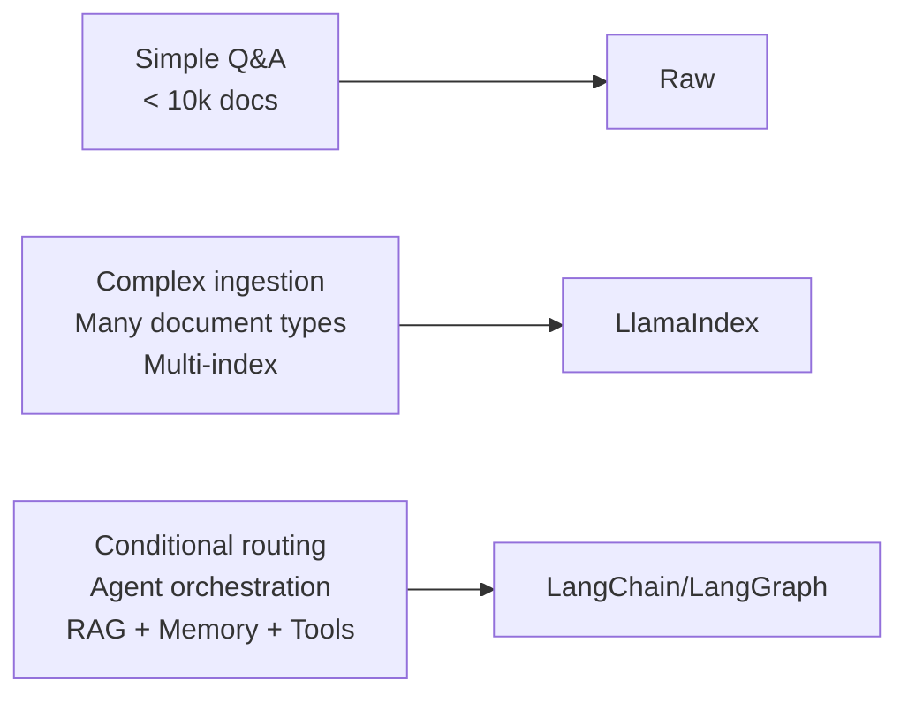

# RAG Frameworks: LlamaIndex and LangChain

> A framework earns its complexity when your naive version is leaking. Know what it fixes before you import it.

**Type:** Build
**Languages:** Python
**Prerequisites:** Lesson 05 (naive RAG), Lesson 06 (retrieval metrics), Lesson 10 (RAG evaluation)
**Time:** ~80 minutes
**Phase:** 02 · Retrieval & RAG

---

## Learning Objectives

- Implement the same RAG pipeline three ways: raw, LlamaIndex, and LangChain/LCEL
- Identify exactly what each framework adds versus what it costs in complexity and debuggability
- Articulate when raw is the right choice and when a framework earns its overhead
- Explain the core abstractions of each framework (Nodes/QueryEngine vs Documents/Chain)
- Apply the "escape hatch principle": validate that any framework lets you drop to raw API calls

---

## The Problem

You built a naive RAG pipeline in Lesson 05. It works. Now a colleague says "we should use LlamaIndex" and another says "LangChain is the standard." Before you import either, you need to answer: what is broken in your naive version that a framework fixes?

If the answer is "nothing is broken," raw is still the right choice. Frameworks are not upgrades: they are tools for specific problems. LlamaIndex solves complex ingestion pipelines and multi-index retrieval. LangChain solves orchestration: chaining LLM calls, routing between retrieval strategies, integrating agents with memory. If you have neither of those problems, you're paying complexity tax for nothing.

The engineers who get this backwards import a framework first and then spend weeks debugging version conflicts, opaque default behavior, and abstraction leaks. When the system gives a wrong answer at 2 a.m., they cannot find where the retrieval is failing because the framework hid it six layers deep.

This lesson builds all three versions of the same pipeline side by side. After this, you will be able to choose deliberately.

---

## The Concept

### The Three Tiers

```
┌────────────────────────────────────────────────────────┐
│  RAW (no framework)                                    │
│  You write: chunk, embed, store, retrieve, prompt      │
│  You see:   every decision, every failure              │
│  Cost:      more code, manual retry logic              │
│  When:      <10k docs, simple Q&A, early exploration  │
└────────────────────────────────────────────────────────┘

┌────────────────────────────────────────────────────────┐
│  LLAMAINDEX                                            │
│  You get:   managed nodes, custom loaders, index types │
│  Cost:      abstractions over ingestion + retrieval    │
│  When:      complex ingestion, multi-index, KG needed  │
└────────────────────────────────────────────────────────┘

┌────────────────────────────────────────────────────────┐
│  LANGCHAIN / LCEL                                      │
│  You get:   chain orchestration, routing, agent state  │
│  Cost:      deep abstraction stack, rapid version drift│
│  When:      multi-step pipelines, conditional RAG,     │
│             RAG inside an agent with memory            │
└────────────────────────────────────────────────────────┘
```



### Concept Map: Raw → LlamaIndex → LangChain

Every framework maps onto the same primitive operations. Understanding the mapping is how you debug a framework: you trace what it's doing back to the raw operation.

| Raw operation | LlamaIndex equivalent | LangChain equivalent |
|---|---|---|
| Read text | `SimpleDirectoryReader` | `TextLoader` / `DirectoryLoader` |
| Chunk text | `SentenceSplitter` (called on Documents) | `RecursiveCharacterTextSplitter` |
| `{text, vector}` dict | `Node` (with metadata, relationships) | `Document` (with metadata) |
| In-memory dict | `VectorStoreIndex` (wraps a vector store) | `FAISS.from_documents()` |
| `retrieve()` | `index.as_retriever()` | `vectorstore.as_retriever()` |
| `build_prompt()` | `PromptTemplate` (auto-managed in QueryEngine) | `PromptTemplate` in a Chain |
| `generate()` | `query_engine.query()` | `RetrievalQA.from_chain_type()` / LCEL |

### The Framework Anti-Patterns

**Anti-pattern 1: Framework-first design**
You import LlamaIndex on day one of a new project. The failure modes you build the framework around don't materialize. You've added 400 lines of boilerplate and a 15-package dependency tree to a problem a 50-line raw pipeline would have solved.

**Anti-pattern 2: Over-abstracting simple pipelines**
You use LangChain's `RetrievalQA` chain for a simple Q&A bot. A user reports wrong answers. You spend three hours tracing through LangChain internals to find that the default `stuff` chain was stuffing too many tokens. In a raw version, this would have been visible in the prompt logging immediately.

**Anti-pattern 3: Version dependency hell**
LlamaIndex and LangChain release multiple times per month. Their APIs change between minor versions. A pipeline that works on `llama-index==0.10.x` breaks silently on `0.11.x` because a default changed. Pinning versions helps but creates a maintenance burden. Evaluate whether this overhead is worth the features.

**Anti-pattern 4: No escape hatch**
You build your RAG pipeline entirely inside LlamaIndex's `QueryEngine`. You later need to add a custom re-ranking step that LlamaIndex doesn't support cleanly. The framework traps you. Always verify that any framework you use lets you extract the raw retrieved nodes/documents and implement custom logic.

### The Escape Hatch Principle

Any framework you adopt should expose the raw primitives at every stage:

```python
# LlamaIndex escape hatch:
retriever = index.as_retriever(similarity_top_k=5)
nodes = retriever.retrieve(query)  # returns raw Node objects
# Now you can do anything with `nodes`: custom re-ranking, custom formatting

# LangChain escape hatch:
retriever = vectorstore.as_retriever(search_kwargs={"k": 5})
docs = retriever.invoke(query)  # returns raw Document objects
# Now you can format them however you need
```

If a framework doesn't give you this, it will eventually trap you.

---

## Build It

### Step 1: Shared Setup and Test Data

The demo uses the same corpus and the same 5 test queries across all three implementations:

```python
# pip install openai llama-index langchain langchain-openai langchain-community
# Set environment variable: OPENAI_API_KEY=sk-...

import os
import time
from openai import OpenAI

# Shared test corpus: same text used in all three implementations
CORPUS = [
    "Retrieval Augmented Generation (RAG) combines a retrieval system with an LLM to ground answers in a document corpus.",
    "Chunking strategy is the most impactful decision in a RAG pipeline. Chunk too small: context is lost. Chunk too large: retrieval is diluted.",
    "Cosine similarity measures the angle between two vectors, regardless of magnitude. It is the standard similarity metric for embedding-based retrieval.",
    "Hybrid search combines dense (embedding) retrieval with sparse (BM25/keyword) retrieval. It consistently outperforms either alone on recall.",
    "Re-ranking uses a cross-encoder to re-score retrieved chunks after initial retrieval. It adds latency but improves precision significantly.",
    "The RAG Triad evaluates three dimensions: faithfulness (answer grounded in context?), answer relevance (answers the question?), and context relevance (retrieved the right chunks?).",
    "LlamaIndex specializes in document ingestion pipelines and multi-index retrieval. It manages document nodes, metadata, and relationships automatically.",
    "LangChain's LCEL (LangChain Expression Language) allows composing chains declaratively. The pipe operator (|) connects runnables.",
    "A naive RAG pipeline: chunk text → embed chunks → store vectors → embed query → cosine search → format prompt → LLM call.",
    "Evaluation without ground truth is dangerous. Build your eval set before you build your pipeline. Otherwise you'll unconsciously tune to pass the test you already know.",
]

TEST_QUERIES = [
    "What is RAG?",
    "How does hybrid search work?",
    "What is the RAG Triad?",
    "When should I use LlamaIndex?",
    "How do I evaluate a RAG pipeline?",
]
```

### Step 2: Raw Implementation (Baseline)

```python
import numpy as np

raw_client = OpenAI(api_key=os.environ["OPENAI_API_KEY"])
EMBED_MODEL = "text-embedding-3-small"
CHAT_MODEL = "gpt-4o-mini"


def raw_embed(texts: list[str]) -> np.ndarray:
    resp = raw_client.embeddings.create(model=EMBED_MODEL, input=texts)
    return np.array([item.embedding for item in resp.data])


def raw_build_index(corpus: list[str]) -> dict:
    """Embed corpus and store in a numpy array."""
    vectors = raw_embed(corpus)
    return {"texts": corpus, "vectors": vectors}


def raw_retrieve(query: str, index: dict, top_k: int = 3) -> list[dict]:
    query_vec = raw_embed([query])[0]
    vectors = index["vectors"]
    norms = np.linalg.norm(vectors, axis=1) * np.linalg.norm(query_vec)
    norms = np.where(norms == 0, 1e-10, norms)
    scores = vectors @ query_vec / norms
    top = np.argsort(scores)[::-1][:top_k]
    return [{"text": index["texts"][i], "score": float(scores[i])} for i in top]


def raw_ask(query: str, index: dict) -> str:
    chunks = raw_retrieve(query, index)
    context = "\n\n".join(f"[{i+1}] {c['text']}" for i, c in enumerate(chunks))
    prompt = f"Context:\n{context}\n\nQuestion: {query}\nAnswer:"
    resp = raw_client.chat.completions.create(
        model=CHAT_MODEL,
        messages=[
            {"role": "system", "content": "Answer only from the provided context."},
            {"role": "user", "content": prompt},
        ],
        temperature=0.0,
    )
    return resp.choices[0].message.content.strip()
```

The raw version is ~40 lines. You see every decision. Debugging is direct: add `print(chunks)` to see what was retrieved. There is no abstraction between you and the bug.

### Step 3: LlamaIndex Implementation

```python
from llama_index.core import VectorStoreIndex, Document, Settings
from llama_index.core.node_parser import SentenceSplitter
from llama_index.llms.openai import OpenAI as LlamaOpenAI
from llama_index.embeddings.openai import OpenAIEmbedding


def llamaindex_build_index(corpus: list[str]) -> VectorStoreIndex:
    """
    LlamaIndex handles: Document creation, node parsing (chunking),
    embedding, and index storage: in one call.
    """
    # Configure the global LLM and embedding model
    Settings.llm = LlamaOpenAI(model=CHAT_MODEL, temperature=0.0)
    Settings.embed_model = OpenAIEmbedding(model=EMBED_MODEL)
    Settings.node_parser = SentenceSplitter(chunk_size=512, chunk_overlap=50)

    # Each string in the corpus becomes a Document
    documents = [Document(text=text) for text in corpus]

    # from_documents: parses → chunks → embeds → stores in memory
    index = VectorStoreIndex.from_documents(documents)
    return index


def llamaindex_ask(query: str, index: VectorStoreIndex) -> str:
    """
    QueryEngine combines retrieval + prompt formatting + LLM call.
    similarity_top_k controls how many chunks go into the context.
    """
    query_engine = index.as_query_engine(similarity_top_k=3)
    response = query_engine.query(query)
    return str(response)


def llamaindex_retrieve_only(query: str, index: VectorStoreIndex) -> list:
    """
    Escape hatch: get raw nodes without going through the QueryEngine.
    Use this to implement custom re-ranking or prompt formatting.
    """
    retriever = index.as_retriever(similarity_top_k=3)
    nodes = retriever.retrieve(query)
    return nodes  # list of NodeWithScore objects
```

What LlamaIndex adds over raw:
- Automatic chunking with configurable strategies (`SentenceSplitter`, `TokenTextSplitter`, etc.)
- Node metadata management (source ID, chunk index, relationships)
- Multiple index types (`VectorStoreIndex`, `SummaryIndex`, `KnowledgeGraphIndex`)
- Configurable query modes (`as_query_engine()` with `response_mode='tree_summarize'`, etc.)

What it costs:
- You can't see the prompt without digging into `response.source_nodes` and the internal `PromptTemplate`
- Version changes frequently; `Settings` global state can cause surprises in multi-threaded code
- Simple pipelines incur overhead from Node wrapping and metadata tracking

### Step 4: LangChain/LCEL Implementation

```python
from langchain_openai import OpenAIEmbeddings, ChatOpenAI
from langchain_core.documents import Document as LCDocument
from langchain_core.prompts import ChatPromptTemplate
from langchain_core.output_parsers import StrOutputParser
from langchain_core.runnables import RunnablePassthrough
from langchain_community.vectorstores import FAISS


def langchain_build_index(corpus: list[str]) -> FAISS:
    """
    LangChain's FAISS integration handles embedding + vector storage.
    """
    embeddings = OpenAIEmbeddings(model=EMBED_MODEL)
    documents = [LCDocument(page_content=text) for text in corpus]
    vectorstore = FAISS.from_documents(documents, embeddings)
    return vectorstore


def langchain_ask(query: str, vectorstore: FAISS) -> str:
    """
    LCEL pipeline: retriever | prompt | llm | output_parser

    The pipe operator (|) composes runnables.
    Each stage receives the output of the previous stage.
    """
    retriever = vectorstore.as_retriever(search_kwargs={"k": 3})
    llm = ChatOpenAI(model=CHAT_MODEL, temperature=0.0)

    prompt = ChatPromptTemplate.from_template(
        "Answer the question using only the following context:\n\n"
        "{context}\n\n"
        "Question: {question}\n"
        "Answer:"
    )

    def format_docs(docs: list[LCDocument]) -> str:
        return "\n\n".join(doc.page_content for doc in docs)

    # LCEL chain using the pipe operator
    chain = (
        {"context": retriever | format_docs, "question": RunnablePassthrough()}
        | prompt
        | llm
        | StrOutputParser()
    )

    return chain.invoke(query)


def langchain_retrieve_only(query: str, vectorstore: FAISS) -> list:
    """
    Escape hatch: retrieve raw Document objects for custom processing.
    """
    retriever = vectorstore.as_retriever(search_kwargs={"k": 3})
    return retriever.invoke(query)  # list of Document objects
```

What LangChain/LCEL adds over raw:
- Composable chain syntax (the `|` operator)
- Built-in streaming support (`chain.stream(query)`)
- Memory and history management for conversational RAG
- Routing primitives for conditional chains (`RunnableBranch`)
- Integration with 50+ vector stores, document loaders, and LLM providers

What it costs:
- Deep abstraction stack: a chain has 4–6 internal components, each with its own error surface
- Rapid version drift: LCEL itself was introduced in 0.1.x and significantly changed in 0.2.x; `RetrievalQA` is deprecated in favor of LCEL
- The `|` operator is elegant until something fails mid-chain and the traceback is 20 frames deep

### Step 5: Side-by-Side Comparison

```python
def run_comparison(corpus: list[str], queries: list[str]) -> None:
    """
    Build all three indexes, run the same queries through each,
    and compare results.
    """
    print("=" * 65)
    print("BUILDING INDEXES")
    print("=" * 65)

    t0 = time.time()
    raw_index = raw_build_index(corpus)
    print(f"Raw:        {time.time() - t0:.2f}s")

    t0 = time.time()
    llama_index = llamaindex_build_index(corpus)
    print(f"LlamaIndex: {time.time() - t0:.2f}s")

    t0 = time.time()
    lc_vectorstore = langchain_build_index(corpus)
    print(f"LangChain:  {time.time() - t0:.2f}s")

    print("\n" + "=" * 65)
    print("QUERY RESULTS (first 2 queries shown)")
    print("=" * 65)

    for query in queries[:2]:
        print(f"\nQuery: {query}")
        print("-" * 50)

        t0 = time.time()
        raw_ans = raw_ask(query, raw_index)
        print(f"  [Raw        {time.time()-t0:.2f}s] {raw_ans[:120]}")

        t0 = time.time()
        llama_ans = llamaindex_ask(query, llama_index)
        print(f"  [LlamaIndex {time.time()-t0:.2f}s] {llama_ans[:120]}")

        t0 = time.time()
        lc_ans = langchain_ask(query, lc_vectorstore)
        print(f"  [LangChain  {time.time()-t0:.2f}s] {lc_ans[:120]}")

    print("\n" + "=" * 65)
    print("CODE COMPARISON (line count per implementation)")
    print("=" * 65)

    implementations = {
        "Raw (numpy + openai)": [
            "raw_embed()", "raw_build_index()", "raw_retrieve()", "raw_ask()"
        ],
        "LlamaIndex": [
            "llamaindex_build_index()", "llamaindex_ask()", "llamaindex_retrieve_only()"
        ],
        "LangChain/LCEL": [
            "langchain_build_index()", "langchain_ask()", "langchain_retrieve_only()"
        ],
    }

    for name, funcs in implementations.items():
        print(f"\n  {name}")
        print(f"    Functions: {', '.join(funcs)}")

    print("""
Decision matrix:
  ┌─────────────────────────────┬──────────────────────────────────────────┐
  │ Use Case                    │ Recommended Choice                       │
  ├─────────────────────────────┼──────────────────────────────────────────┤
  │ < 10k docs, simple Q&A      │ Raw                                      │
  │ Complex ingestion, loaders  │ LlamaIndex                               │
  │ Multi-index, KG             │ LlamaIndex                               │
  │ Conditional routing         │ LangChain/LCEL                           │
  │ RAG inside an agent         │ LangChain/LangGraph                      │
  │ Production, any scale       │ Start raw, migrate if needed             │
  └─────────────────────────────┴──────────────────────────────────────────┘
""")
```

> **Real-world check:** A junior engineer joining the team asks: "Why did we spend lessons 1-14 building everything from scratch if we're just going to use a framework anyway?" How would you answer that in a way that actually makes the tradeoff clear, not just defensive?

---

## Use It

### When to Migrate from Raw to a Framework

Build the raw version first. Migrate when you hit a specific, measurable wall:

**Migrate to LlamaIndex when:**
- You need to ingest 10+ document types (PDFs, HTML, Notion, Slack, GitHub)
- You need hierarchical indexing (document summaries + chunk-level retrieval)
- You need a knowledge graph index (`KnowledgeGraphIndex`)
- You're managing 100k+ chunks with complex metadata filtering

**Migrate to LangChain when:**
- You need conversational RAG with message history
- You need to route between multiple RAG pipelines based on query type
- You're building RAG as a tool inside a larger agent
- You need streaming responses

**Stay raw when:**
- The corpus is stable and simple
- You're building an eval harness or prototype
- Your team is not already familiar with the framework
- You need deterministic, debuggable behavior

> **Perspective shift:** A tech lead at a new project says: "Every AI startup I talk to uses LangChain. If we go with raw plus LlamaIndex instead, are we making a bet against the ecosystem, and what does that cost us in hiring, integrations, and long-term maintenance?"

---

## Ship It

The runnable artifact is `code/main.py`. It builds all three indexes on the same corpus and runs a comparison:

```bash
export OPENAI_API_KEY=sk-...
pip install openai llama-index langchain langchain-openai langchain-community faiss-cpu
python main.py
```

The decision tool in `outputs/prompt-rag-framework-chooser.md` is a structured decision prompt you can use when evaluating framework choices for a new project.

---

## Evaluate It

Evaluate each implementation on the same eval set. Compare:

1. **Answer quality**: run your eval set (from Lesson 10's RAG Triad or manual pairs) through all three implementations. Do the answers differ? If they do, why?

2. **Lines of code**: count the non-boilerplate lines needed for ingestion, retrieval, and generation in each implementation. More lines = more surface area for bugs.

3. **Debug time simulation**: inject a deliberate error (e.g., top_k=1 instead of 5). How quickly can you find the cause in each implementation? The raw version exposes it immediately in the retrieved chunks log. Framework versions require knowing where the `similarity_top_k` config lives.

4. **Failure transparency**: force a wrong answer scenario (query about something not in the corpus). Does each implementation tell you whether it failed at retrieval or generation? The raw version does. The framework versions may not without additional configuration.

**Decision rule**: if all three implementations produce equivalent answers and the framework version is not materially easier to maintain at your current scale, use raw.

---

## Exercises

1. **[Easy]** Add a `verbose=True` parameter to the LlamaIndex implementation that prints the retrieved nodes before calling the LLM. Verify it shows the same chunks as the raw `retrieve()` function for the same query.

2. **[Medium]** Implement a LangChain chain that routes between two different retrieval strategies: if the query contains "how" or "what", use dense retrieval; if it contains a document title, use keyword search. Use `RunnableBranch` for routing.

3. **[Hard]** Build an evaluation harness that runs all three implementations against the same 10-question eval set (write the expected answers yourself) and produces a score card: answer correctness (manual), latency per query, and token cost per query. Report whether the framework implementations improve on raw for your corpus.

---

## Key Terms

| Term | What people say | What it actually means |
|------|-----------------|------------------------|
| LlamaIndex Node | "Document node" or "chunk node" | LlamaIndex's wrapper around a text chunk; includes metadata, relationships to parent/child nodes, and embedding |
| QueryEngine | "LlamaIndex query engine" | LlamaIndex's abstraction that combines retriever + prompt template + LLM call into a single `.query()` interface |
| LCEL | "LangChain Expression Language" | LangChain's chain composition syntax using the `|` operator to connect Runnable objects |
| Runnable | "LCEL runnable" | Any component in a LangChain chain that implements `.invoke()`, `.stream()`, and `.batch()`: LLMs, retrievers, prompts, parsers |
| Escape hatch | "Dropping to raw" | Accessing the raw primitives (retrieved nodes, formatted context, LLM prompt) from within a framework, bypassing the framework's default pipeline |
| Framework version drift | "Dependency hell" | Rapid API changes in fast-moving frameworks that break pipelines between minor versions |

---

## Further Reading

- [LlamaIndex Documentation: Low-Level API](https://docs.llamaindex.ai/en/stable/understanding/putting_it_all_together/): how to access nodes and retrievers directly; the escape hatch reference
- [LangChain LCEL Documentation](https://python.langchain.com/docs/expression_language/): official LCEL guide; the `|` operator semantics and debugging tools
- [Building LLM Applications for Production](https://huyenchip.com/2023/04/11/llm-engineering.html): Huyen Chip's practitioner take on when frameworks help and when they hurt
- [Don't Build AI Products on Top of Frameworks](https://hamel.dev/blog/posts/langchain/): a contrarian take on LangChain that is worth reading before committing to it
- [LlamaIndex vs LangChain: Key Differences](https://www.llamaindex.ai/blog/llamaindex-vs-langchain): the official comparison (read critically; each team is selling their own product)
