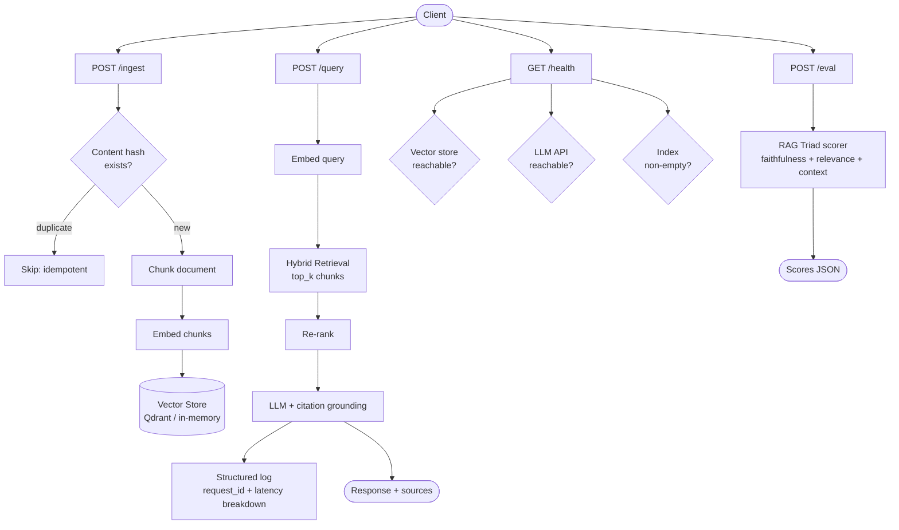

# المشروع الختامي: خدمة RAG إنتاجية

> اجمع كل شيء من هذه المرحلة في خدمة يمكن نشرها وتصحيحها وتحسينها.

**النوع:** بناء
**اللغات:** Python
**المتطلبات:** كل الدروس 01–15 في هذه المرحلة
**الوقت:** ~120 دقيقة
**المرحلة:** 02 · الاسترجاع و RAG

---

## أهداف التعلّم

- بناء خدمة RAG كاملة قابلة للنشر باستخدام FastAPI مع معالجة أخطاء بجودة إنتاجية
- تطبيق تسجيل JSON منظَّم (structured logging) مع معرّفات الطلبات (request IDs)، وتفصيل الـ latency، وعدّ الـ tokens
- تصميم استيعاب مستندات idempotent باستخدام content hashing
- بناء نقطة نهاية (endpoint) للتقييم تشغّل RAG Triad على حالة اختبار دون مغادرة الخدمة
- معالجة حدود معدّل الـ LLM (rate limits) عبر exponential backoff و circuit breaking
- كتابة Dockerfile متعدد المراحل ينتج صورة إنتاجية صغيرة وآمنة
- تطبيق منظومة تقييم RAG الكاملة من الدرس 10 على الخدمة المنشورة

---

## المشكلة

لقد بنيت المكوّنات: الـ embeddings، والـ chunking، والبحث الهجين (hybrid search)، وإعادة الترتيب (re-ranking)، وتأريض الاقتباسات (citation grounding)، ومنظومة التقييم، ومتغيّري text-to-SQL و codebase RAG. لا واحد منها خدمة. تعمل في notebooks و scripts. لا يوجد لها فحص صحّة (health check). إذا تعطّل الـ vector store، ترمي استثناءً غير معالَج. إذا فرض الـ LLM API حدود معدّل، تنهار. لا يوجد تسجيل منظَّم، لذا عندما يحدث خلل ما عند الثالثة فجرًا، لا فكرة لديك أين كان الفشل.

المشروع الختامي هو ربط كل ذلك في خدمة قابلة للنشر. للخدمة أربع نقاط نهاية. واحدة تستوعب المستندات. وواحدة تجيب عن الاستعلامات. وواحدة تفحص ما إذا كانت الخدمة سليمة فعلًا (لا مجرد قيد التشغيل: سليمة، بمعنى أن الاسترجاع يعمل وأن الفهرس (index) غير فارغ). وواحدة تشغّل حالة تقييم وتُرجع درجات RAG Triad على الفور.

هذا هو النمط المستخدم في فرق الذكاء الاصطناعي الإنتاجية. ليس Jupyter notebook. بل خدمة بعقد API، وسجلات منظَّمة، و Dockerfile.

---

## المفهوم

### معمارية الخدمة



### مبادئ تصميم الـ API

**الاستيعاب الـ idempotent**: تجزئة (hashing) كل مستند قبل تخزينه تعني أنك تستطيع استدعاء `POST /ingest` مرتين بالمستند نفسه والحصول على النتيجة نفسها في المرتين: لا تكرار، ولا أخطاء. هذا حاسم للخطوط الموثوقة (pipelines).

**الاستعلام الـ async**: للإنتاج، ينبغي أن تدعم نقطة نهاية الاستعلام البث (streaming). يطبّق المشروع الختامي النمط المتزامن (synchronous) للوضوح؛ أضِف `StreamingResponse` للإنتاج.

**استجابات أخطاء متسقة**: كل خطأ يُرجع الشكل نفسه: `{error: string, request_id: string, details: any}`. يستطيع العملاء الاعتماد على هذا الشكل.

**الصحّة ≠ التشغيل**: إرجاع 200 من `/health` بينما الفهرس فارغ كذبة. خدمة RAG السليمة لها فهرس غير فارغ وتبعيّات (dependencies) قابلة للوصول. تفحص نقطة نهاية الصحّة الثلاثة جميعًا: الـ vector store قابل للوصول، والـ LLM API قابل للوصول، والفهرس غير فارغ.

### القابلية للملاحظة (Observability): ماذا تسجّل

كل استعلام يولّد مدخل سجلّ منظَّم:

```json
{
  "request_id": "uuid",
  "timestamp": "2024-12-01T09:23:45Z",
  "query": "what is the refund policy?",
  "retrieved_chunks": 5,
  "top_chunk_score": 0.847,
  "latency_breakdown": {
    "embed_ms": 48,
    "retrieve_ms": 12,
    "rerank_ms": 0,
    "generate_ms": 891,
    "total_ms": 951
  },
  "model": "gpt-4o-mini",
  "prompt_tokens": 892,
  "completion_tokens": 143,
  "answer_length": 512
}
```

عندما ينكسر شيء في الإنتاج، يخبرك هذا السجل بالضبط أين. إذا قفز `embed_ms` → الـ embedding API بطيء. وإذا قفز `retrieve_ms` → الـ vector store تحت حمل. وإذا قفز `generate_ms` → الـ LLM يفرض حدود معدّل. بدون هذا التفصيل، كل ما تعرفه هو "الاستعلام كان بطيئًا".

### معالجة حدود المعدّل (Rate Limit)

تفرض الـ LLM APIs حدود معدّل. النمط: exponential backoff مع jitter.

```
Attempt 1: immediate
Attempt 2: wait 1s + random(0-0.5s)
Attempt 3: wait 2s + random(0-0.5s)
Attempt 4: wait 4s + random(0-0.5s)
Max retries: 3
Max wait: 8s
```

يمنع الـ jitter مشكلة القطيع الهائج (thundering herd): إذا اصطدمت عشرة طلبات بحدّ المعدّل في آن واحد وأعادت المحاولة عند الفترة الثابتة نفسها، فإنها ستعيد المحاولة معًا وتصطدم بالحدّ مجددًا. يفكّ الـ jitter تزامن المحاولات.

### إدارة الإعدادات (Config)

كل ما تضبطه ينتمي إلى متغيّرات البيئة (environment variables):

```
OPENAI_API_KEY=sk-...           # required
EMBED_MODEL=text-embedding-3-small
CHAT_MODEL=gpt-4o-mini
TOP_K=5                         # retrieval candidates
CHUNK_SIZE=400                  # words per chunk
CHUNK_OVERLAP=50                # overlap words
MAX_RETRIES=3                   # LLM retry limit
LOG_LEVEL=INFO
```

لا تضع أسماء النماذج في الكود بشكل ثابت أبدًا. فهي تتغيّر. قد يُستبدل `gpt-4o-mini` بنموذج أرخص وأفضل في الربع القادم. إذا كان في الكود، فأنت بحاجة إلى نشر كود لتغييره. وإذا كان في متغيّر بيئة، فأنت بحاجة إلى تحديث إعدادات فقط.

---

## البناء

### الخطوة 1: التبعيّات والإعدادات

```python
# pip install fastapi uvicorn openai sentence-transformers qdrant-client pydantic numpy
# Set OPENAI_API_KEY environment variable.

from __future__ import annotations

import hashlib
import json
import logging
import os
import random
import time
import uuid
from contextlib import asynccontextmanager
from typing import Any

import numpy as np
from fastapi import FastAPI, HTTPException, Request
from fastapi.responses import JSONResponse
from openai import OpenAI, RateLimitError, APIError
from pydantic import BaseModel, Field
from sentence_transformers import SentenceTransformer

# ---------------------------------------------------------------------------
# Config from environment
# ---------------------------------------------------------------------------

class Config:
    OPENAI_API_KEY: str = os.environ.get("OPENAI_API_KEY", "")
    EMBED_MODEL: str = os.environ.get("EMBED_MODEL", "text-embedding-3-small")
    CHAT_MODEL: str = os.environ.get("CHAT_MODEL", "gpt-4o-mini")
    LOCAL_EMBED_MODEL: str = os.environ.get("LOCAL_EMBED_MODEL", "all-MiniLM-L6-v2")
    TOP_K: int = int(os.environ.get("TOP_K", "5"))
    CHUNK_SIZE: int = int(os.environ.get("CHUNK_SIZE", "400"))
    CHUNK_OVERLAP: int = int(os.environ.get("CHUNK_OVERLAP", "50"))
    MAX_RETRIES: int = int(os.environ.get("MAX_RETRIES", "3"))
    USE_LOCAL_EMBEDDINGS: bool = os.environ.get("USE_LOCAL_EMBEDDINGS", "false").lower() == "true"
    LOG_LEVEL: str = os.environ.get("LOG_LEVEL", "INFO")

cfg = Config()
```

### الخطوة 2: التسجيل المنظَّم (Structured Logging)

```python
logging.basicConfig(
    level=getattr(logging, cfg.LOG_LEVEL, logging.INFO),
    format="%(message)s",  # raw: we emit JSON
)
logger = logging.getLogger("rag_service")


def log_event(event: str, data: dict[str, Any]) -> None:
    """Emit a structured JSON log entry."""
    entry = {
        "ts": time.strftime("%Y-%m-%dT%H:%M:%SZ", time.gmtime()),
        "event": event,
        **data,
    }
    logger.info(json.dumps(entry))
```

### الخطوة 3: vector store في الذاكرة (In-Memory)

```python
class InMemoryVectorStore:
    """
    Simple in-memory vector store using numpy cosine similarity.
    Suitable for development and small corpora (<50k chunks).
    Replace with Qdrant or pgvector for production scale.
    """

    def __init__(self):
        self.chunks: list[dict] = []
        self.vectors: np.ndarray | None = None
        self.doc_hashes: set[str] = set()  # idempotency

    def add(self, text: str, vector: np.ndarray, metadata: dict) -> str:
        chunk_id = str(uuid.uuid4())[:12]
        self.chunks.append({"id": chunk_id, "text": text, "metadata": metadata})
        vec = vector.reshape(1, -1).astype(np.float32)
        if self.vectors is None:
            self.vectors = vec
        else:
            self.vectors = np.vstack([self.vectors, vec])
        return chunk_id

    def search(self, query_vec: np.ndarray, top_k: int) -> list[dict]:
        if self.vectors is None or len(self.chunks) == 0:
            return []
        q = query_vec.astype(np.float32)
        norms = np.linalg.norm(self.vectors, axis=1) * np.linalg.norm(q)
        norms = np.where(norms == 0, 1e-10, norms)
        scores = self.vectors @ q / norms
        k = min(top_k, len(self.chunks))
        top_idx = np.argsort(scores)[::-1][:k]
        return [
            {**self.chunks[i], "score": float(scores[i])}
            for i in top_idx
        ]

    def count(self) -> int:
        return len(self.chunks)

    def is_doc_known(self, doc_hash: str) -> bool:
        return doc_hash in self.doc_hashes

    def register_doc(self, doc_hash: str) -> None:
        self.doc_hashes.add(doc_hash)
```

### الخطوة 4: الـ Embedding مع إعادة المحاولة (Retry)

```python
oai_client = OpenAI(api_key=cfg.OPENAI_API_KEY) if cfg.OPENAI_API_KEY else None
local_model: SentenceTransformer | None = None


def get_local_model() -> SentenceTransformer:
    global local_model
    if local_model is None:
        local_model = SentenceTransformer(cfg.LOCAL_EMBED_MODEL)
    return local_model


def with_retry(fn, max_retries: int = 3):
    """
    Call fn() with exponential backoff + jitter on RateLimitError.
    Raises after max_retries attempts.
    """
    for attempt in range(max_retries + 1):
        try:
            return fn()
        except RateLimitError as e:
            if attempt == max_retries:
                raise
            wait = (2 ** attempt) + random.uniform(0, 0.5)
            log_event("rate_limit_backoff", {"attempt": attempt + 1, "wait_s": round(wait, 2)})
            time.sleep(wait)
        except APIError as e:
            if attempt == max_retries or e.status_code not in (429, 500, 503):
                raise
            wait = (2 ** attempt) + random.uniform(0, 0.5)
            time.sleep(wait)


def embed_texts(texts: list[str]) -> np.ndarray:
    """
    Embed texts. Uses OpenAI by default; falls back to local sentence-transformers
    if USE_LOCAL_EMBEDDINGS=true or OPENAI_API_KEY is not set.
    """
    if cfg.USE_LOCAL_EMBEDDINGS or not oai_client:
        model = get_local_model()
        return model.encode(texts, show_progress_bar=False).astype(np.float32)

    def call():
        resp = oai_client.embeddings.create(model=cfg.EMBED_MODEL, input=texts)
        return np.array([item.embedding for item in resp.data], dtype=np.float32)

    return with_retry(call, max_retries=cfg.MAX_RETRIES)
```

### الخطوة 5: الـ Chunking والاستيعاب

```python
def chunk_text(text: str, chunk_size: int, overlap: int) -> list[str]:
    words = text.split()
    chunks, start = [], 0
    while start < len(words):
        end = start + chunk_size
        chunks.append(" ".join(words[start:end]))
        if end >= len(words):
            break
        start = end - overlap
    return chunks


vector_store = InMemoryVectorStore()


def ingest_document(
    content: str,
    doc_id: str,
    metadata: dict,
    chunk_size: int,
    overlap: int,
) -> dict:
    """
    Idempotent ingestion: hash content before processing.
    Returns {doc_id, chunks_added, was_duplicate}.
    """
    doc_hash = hashlib.sha256(content.encode()).hexdigest()[:16]

    if vector_store.is_doc_known(doc_hash):
        return {"doc_id": doc_id, "chunks_added": 0, "was_duplicate": True}

    chunks = chunk_text(content, chunk_size, overlap)
    vectors = embed_texts(chunks)

    chunk_meta = {**metadata, "doc_id": doc_id, "doc_hash": doc_hash}
    for chunk, vec in zip(chunks, vectors):
        vector_store.add(chunk, vec, chunk_meta)

    vector_store.register_doc(doc_hash)
    return {"doc_id": doc_id, "chunks_added": len(chunks), "was_duplicate": False}
```

### الخطوة 6: خط معالجة الاستعلام (Query Pipeline)

```python
SYSTEM_PROMPT = (
    "You are a helpful assistant. Answer the user's question using ONLY "
    "the provided context. If the context is insufficient, say so explicitly. "
    "Cite the source of each claim using [Source N] notation."
)


def run_query(query: str, top_k: int) -> dict:
    """
    Full RAG query pipeline with latency instrumentation.
    Returns {answer, sources, retrieved_chunks, latency_breakdown, tokens}.
    """
    timings: dict[str, int] = {}

    # Embed query
    t0 = time.time()
    query_vec = embed_texts([query])[0]
    timings["embed_ms"] = int((time.time() - t0) * 1000)

    # Retrieve
    t0 = time.time()
    results = vector_store.search(query_vec, top_k=top_k)
    timings["retrieve_ms"] = int((time.time() - t0) * 1000)

    if not results:
        return {
            "answer": "No relevant documents found in the index.",
            "sources": [],
            "retrieved_chunks": [],
            "latency_breakdown": timings,
            "tokens": {},
        }

    # Format context
    context_parts = []
    for i, r in enumerate(results, 1):
        source = r["metadata"].get("doc_id", "unknown")
        context_parts.append(f"[Source {i}: {source}]\n{r['text']}")
    context = "\n\n---\n\n".join(context_parts)

    prompt = f"Context:\n{context}\n\n---\n\nQuestion: {query}\n\nAnswer:"

    # Generate
    t0 = time.time()

    def call_llm():
        return oai_client.chat.completions.create(
            model=cfg.CHAT_MODEL,
            messages=[
                {"role": "system", "content": SYSTEM_PROMPT},
                {"role": "user", "content": prompt},
            ],
            temperature=0.0,
        )

    resp = with_retry(call_llm, max_retries=cfg.MAX_RETRIES) if oai_client else None
    timings["generate_ms"] = int((time.time() - t0) * 1000)
    timings["total_ms"] = sum(timings.values())

    if resp is None:
        answer = "[LLM unavailable: no OPENAI_API_KEY configured]"
        token_info = {}
    else:
        answer = resp.choices[0].message.content.strip()
        token_info = {
            "prompt_tokens": resp.usage.prompt_tokens,
            "completion_tokens": resp.usage.completion_tokens,
        }

    sources = list({r["metadata"].get("doc_id", "unknown") for r in results})

    return {
        "answer": answer,
        "sources": sources,
        "retrieved_chunks": [
            {"text": r["text"][:200], "score": r["score"], "source": r["metadata"].get("doc_id")}
            for r in results
        ],
        "latency_breakdown": timings,
        "tokens": token_info,
    }
```

### الخطوة 7: تقييم RAG Triad

```python
RAG_TRIAD_PROMPT = """You are an evaluator scoring a RAG system's answer quality.

Score the following answer on three dimensions (0.0 to 1.0 each):

1. FAITHFULNESS: Is the answer fully supported by the provided context?
   (1.0 = every claim is in the context; 0.0 = answer contradicts or ignores context)

2. ANSWER_RELEVANCE: Does the answer address the question?
   (1.0 = directly and completely answers; 0.0 = answer is off-topic or incomplete)

3. CONTEXT_RELEVANCE: How relevant is the retrieved context to the question?
   (1.0 = context directly contains the answer; 0.0 = context is unrelated)

Return ONLY a JSON object with keys: faithfulness, answer_relevance, context_relevance.

Question: {question}
Retrieved context: {context}
Answer: {answer}

JSON scores:"""


def run_rag_triad(question: str, context: str, answer: str) -> dict:
    """
    Score an answer on the RAG Triad: faithfulness, answer relevance, context relevance.
    Returns {faithfulness: float, answer_relevance: float, context_relevance: float}.
    """
    if not oai_client:
        return {"faithfulness": 0.0, "answer_relevance": 0.0, "context_relevance": 0.0,
                "error": "No LLM configured"}

    prompt = RAG_TRIAD_PROMPT.format(
        question=question,
        context=context[:2000],  # cap context length in eval prompt
        answer=answer,
    )

    def call():
        return oai_client.chat.completions.create(
            model=cfg.CHAT_MODEL,
            messages=[{"role": "user", "content": prompt}],
            temperature=0.0,
        )

    resp = with_retry(call, max_retries=2)
    raw = resp.choices[0].message.content.strip()

    # Strip markdown if present
    if "```" in raw:
        raw = raw.split("```")[1]
        if raw.startswith("json"):
            raw = raw[4:]

    try:
        scores = json.loads(raw)
        return {
            "faithfulness": float(scores.get("faithfulness", 0)),
            "answer_relevance": float(scores.get("answer_relevance", 0)),
            "context_relevance": float(scores.get("context_relevance", 0)),
        }
    except (json.JSONDecodeError, ValueError, KeyError) as e:
        return {"faithfulness": 0.0, "answer_relevance": 0.0, "context_relevance": 0.0,
                "parse_error": str(e), "raw": raw}
```

### الخطوة 8: تطبيق FastAPI

```python
# ---------------------------------------------------------------------------
# Pydantic models
# ---------------------------------------------------------------------------

class IngestRequest(BaseModel):
    content: str = Field(..., description="Document text to ingest")
    doc_id: str = Field(default_factory=lambda: str(uuid.uuid4())[:8])
    metadata: dict = Field(default_factory=dict)
    chunk_size: int = Field(default=None)
    chunk_overlap: int = Field(default=None)


class QueryRequest(BaseModel):
    query: str = Field(..., description="Natural language query")
    top_k: int = Field(default=None)


class EvalRequest(BaseModel):
    question: str
    expected_answer: str | None = None
    context: str | None = None


class ErrorResponse(BaseModel):
    error: str
    request_id: str
    details: Any = None


# ---------------------------------------------------------------------------
# App lifecycle
# ---------------------------------------------------------------------------

@asynccontextmanager
async def lifespan(app: FastAPI):
    log_event("service_start", {
        "chat_model": cfg.CHAT_MODEL,
        "embed_model": cfg.EMBED_MODEL,
        "top_k": cfg.TOP_K,
    })
    yield
    log_event("service_stop", {"total_chunks": vector_store.count()})


app = FastAPI(
    title="RAG Service",
    description="Production RAG API: Phase 02 Capstone",
    version="1.0.0",
    lifespan=lifespan,
)


# ---------------------------------------------------------------------------
# Middleware: request ID + timing
# ---------------------------------------------------------------------------

@app.middleware("http")
async def add_request_id(request: Request, call_next):
    request_id = str(uuid.uuid4())[:12]
    request.state.request_id = request_id
    t0 = time.time()
    response = await call_next(request)
    total_ms = int((time.time() - t0) * 1000)
    response.headers["X-Request-ID"] = request_id
    response.headers["X-Response-Time-Ms"] = str(total_ms)
    return response


# ---------------------------------------------------------------------------
# Endpoints
# ---------------------------------------------------------------------------

@app.get("/health")
async def health(request: Request) -> dict:
    """
    Deep health check: verifies all dependencies are actually working.
    Returns 200 only if: vector store reachable, index non-empty, LLM reachable.
    """
    checks = {}
    status = "healthy"

    # Vector store
    try:
        count = vector_store.count()
        checks["vector_store"] = {"status": "ok", "chunk_count": count}
        if count == 0:
            checks["vector_store"]["warning"] = "Index is empty: no documents ingested"
            status = "degraded"
    except Exception as e:
        checks["vector_store"] = {"status": "error", "detail": str(e)}
        status = "unhealthy"

    # LLM
    if oai_client and cfg.OPENAI_API_KEY:
        checks["llm"] = {"status": "configured", "model": cfg.CHAT_MODEL}
    else:
        checks["llm"] = {"status": "not_configured"}
        status = "degraded"

    # Embedding
    checks["embeddings"] = {
        "status": "ok",
        "mode": "local" if cfg.USE_LOCAL_EMBEDDINGS else "openai",
    }

    http_status = 200 if status == "healthy" else 207

    return JSONResponse(
        status_code=http_status,
        content={
            "status": status,
            "request_id": request.state.request_id,
            "checks": checks,
        },
    )


@app.post("/ingest")
async def ingest(req: IngestRequest, request: Request) -> dict:
    """
    Ingest a document. Idempotent: duplicate content is detected by hash.
    Returns {doc_id, chunks_added, was_duplicate}.
    """
    request_id = request.state.request_id

    try:
        t0 = time.time()
        result = ingest_document(
            content=req.content,
            doc_id=req.doc_id,
            metadata=req.metadata,
            chunk_size=req.chunk_size or cfg.CHUNK_SIZE,
            overlap=req.chunk_overlap or cfg.CHUNK_OVERLAP,
        )
        elapsed = int((time.time() - t0) * 1000)

        log_event("ingest", {
            "request_id": request_id,
            "doc_id": req.doc_id,
            "chunks_added": result["chunks_added"],
            "was_duplicate": result["was_duplicate"],
            "latency_ms": elapsed,
        })

        return {**result, "request_id": request_id}

    except Exception as e:
        log_event("ingest_error", {"request_id": request_id, "error": str(e)})
        raise HTTPException(status_code=500, detail={"error": str(e), "request_id": request_id})


@app.post("/query")
async def query(req: QueryRequest, request: Request) -> dict:
    """
    Query the RAG index. Returns answer, sources, retrieved chunks, latency breakdown.
    """
    request_id = request.state.request_id

    if not req.query.strip():
        raise HTTPException(status_code=400, detail="Query cannot be empty")

    if vector_store.count() == 0:
        raise HTTPException(
            status_code=503,
            detail={"error": "Index is empty. Ingest documents first.", "request_id": request_id},
        )

    try:
        result = run_query(req.query, top_k=req.top_k or cfg.TOP_K)

        log_event("query", {
            "request_id": request_id,
            "query": req.query[:100],
            "retrieved_chunks": len(result["retrieved_chunks"]),
            "top_chunk_score": result["retrieved_chunks"][0]["score"] if result["retrieved_chunks"] else 0,
            "latency_breakdown": result["latency_breakdown"],
            "tokens": result["tokens"],
            "answer_length": len(result["answer"]),
        })

        return {**result, "request_id": request_id}

    except RateLimitError:
        log_event("rate_limit_final", {"request_id": request_id})
        raise HTTPException(
            status_code=429,
            detail={"error": "LLM rate limit exceeded after retries", "request_id": request_id},
        )
    except Exception as e:
        log_event("query_error", {"request_id": request_id, "error": str(e)})
        raise HTTPException(status_code=500, detail={"error": str(e), "request_id": request_id})


@app.post("/eval")
async def eval_endpoint(req: EvalRequest, request: Request) -> dict:
    """
    Run RAG Triad evaluation on a question.
    If context is not provided, retrieves from the index.
    Returns {faithfulness, answer_relevance, context_relevance, answer}.
    """
    request_id = request.state.request_id

    if vector_store.count() == 0:
        raise HTTPException(
            status_code=503,
            detail={"error": "Index is empty. Ingest documents first.", "request_id": request_id},
        )

    try:
        # Get answer from RAG pipeline
        result = run_query(req.question, top_k=cfg.TOP_K)
        answer = result["answer"]

        # Build context string
        if req.context:
            context = req.context
        else:
            context = "\n\n".join(
                c["text"] for c in result["retrieved_chunks"]
            )

        # Score with RAG Triad
        scores = run_rag_triad(req.question, context, answer)

        log_event("eval", {
            "request_id": request_id,
            "question": req.question[:100],
            "scores": scores,
        })

        return {
            "question": req.question,
            "answer": answer,
            "scores": scores,
            "request_id": request_id,
        }

    except Exception as e:
        log_event("eval_error", {"request_id": request_id, "error": str(e)})
        raise HTTPException(status_code=500, detail={"error": str(e), "request_id": request_id})
```

> **اختبار من الواقع:** مؤسِّس غير تقني يقول: "نحن فقط نريد الإجابة عن أسئلة حول مستنداتنا. لماذا يحتاج هذا إلى Dockerfile، ونقطة نهاية للتقييم، وتسجيل منظَّم؟ ألا نستطيع ببساطة استدعاء الـ API مباشرة؟" كيف تشرح ما يحميه فعلًا كل جزء من هذه الأجزاء؟

---

## الاستخدام

شغّل الخدمة محليًا:

```bash
export OPENAI_API_KEY=sk-...
uvicorn main:app --host 0.0.0.0 --port 8000 --reload
```

استوعب مستندًا:

```bash
curl -X POST http://localhost:8000/ingest \
  -H "Content-Type: application/json" \
  -d '{"content": "RAG combines retrieval with LLM generation...", "doc_id": "rag-intro"}'
```

اطرح سؤالًا:

```bash
curl -X POST http://localhost:8000/query \
  -H "Content-Type: application/json" \
  -d '{"query": "What is RAG?"}'
```

شغّل تقييمًا:

```bash
curl -X POST http://localhost:8000/eval \
  -H "Content-Type: application/json" \
  -d '{"question": "What is RAG?", "expected_answer": "RAG combines retrieval with LLM generation"}'
```

افحص الصحّة:

```bash
curl http://localhost:8000/health
```

> **نقلة في المنظور:** يقول فريق تقنية المعلومات والأمن لدى أحد العملاء: "هذه الخدمة ستملك وصولًا إلى مستنداتنا الداخلية وستجري استدعاءات إلى OpenAI. ما سياسة الاحتفاظ بالبيانات (data retention) لديكم، وكيف نُدقّق ما يُرسَل؟" ماذا تحتاج أن يكون جاهزًا لديك قبل أن تستطيع الإجابة عن هذا السؤال بأمانة؟

---

## التسليم

ابنِ وشغّل عبر Docker:

```bash
docker build -t rag-service .
docker run -p 8000:8000 -e OPENAI_API_KEY=sk-... rag-service
```

يستخدم الـ Dockerfile بناءً متعدد المراحل (multi-stage) لإبقاء الصورة صغيرة:
- مرحلة البناء (Build): تثبّت كل التبعيّات
- مرحلة التشغيل (Runtime): تنسخ فقط ما يلزم، وتعمل بمستخدم غير root
- الحجم النهائي: ~600MB (يهيمن عليه أوزان نموذج sentence-transformers)

للحصول على صورة أخفّ بدون embeddings محلية، اضبط `USE_LOCAL_EMBEDDINGS=false` واستخدم OpenAI embeddings فقط: يقلّص حجم الصورة بنحو ~400MB.

---

## التقييم

### تقييم إنتاجي بالمنظومة الكاملة

شغّل منظومة تقييم RAG Triad من الدرس 10 على الخدمة الحيّة:

```python
eval_set = [
    {"question": "What is RAG?", "expected": "combines retrieval with LLM generation"},
    {"question": "How does hybrid search work?", "expected": "combines dense and sparse retrieval"},
    # ... add 10+ pairs
]

import requests
results = []
for item in eval_set:
    resp = requests.post("http://localhost:8000/eval", json={"question": item["question"]})
    scores = resp.json()["scores"]
    results.append(scores)

avg_faith = sum(r["faithfulness"] for r in results) / len(results)
avg_rel = sum(r["answer_relevance"] for r in results) / len(results)
avg_ctx = sum(r["context_relevance"] for r in results) / len(results)
print(f"Faithfulness:        {avg_faith:.2f}")
print(f"Answer relevance:    {avg_rel:.2f}")
print(f"Context relevance:   {avg_ctx:.2f}")
```

**الحدود الدنيا للقبول في الإنتاج:**
- Faithfulness > 0.85 (الإجابات مؤرَّضة في السياق)
- Answer relevance > 0.80 (الإجابات في صلب الموضوع)
- Context relevance > 0.70 (الاسترجاع يجد الـ chunks الصحيحة)

إذا لم يتحقق أي حدّ، لا تنشر.

### ماذا تراقب أولًا حين ينكسر هذا في الإنتاج

1. **افحص اكتمال الاستيعاب**: استعلم عن `GET /health`. إذا كان `chunk_count` منخفضًا على نحو غير متوقَّع، فقد فشل الاستيعاب بصمت. افحص السجلات بحثًا عن أحداث `ingest_error`.

2. **افحص جودة الاسترجاع**: انظر إلى `top_chunk_score` في سجلات الاستعلام. إذا كانت الدرجات أقل من 0.6 باطّراد، فالاسترجاع يفشل: نموذج embedding خاطئ، أو عدم تطابق المتن، أو تلف الفهرس.

3. **افحص جودة استجابة الـ LLM**: درجات استرجاع عالية لكن faithfulness منخفضة في التقييمات → مشكلة توليد. افحص الـ system prompt وتنسيق السياق.

4. **افحص مئينات الـ latency (percentiles)**: انظر إلى `latency_breakdown.generate_ms` في السجلات. P95 > 3s مؤشر على حدود معدّل أو تدهور النموذج. `embed_ms` > 200ms يشير إلى مشكلات في الـ embedding API.

---

## تمارين

1. **[سهل]** أضِف نقطة نهاية `DELETE /ingest/{doc_id}` تزيل كل الـ chunks لـ `doc_id` معيّن من الـ vector store. ما الذي يحتاج تتبّع hash الـ idempotency لديك إلى معالجته كي تعمل إعادة الاستيعاب بعد الحذف؟

2. **[متوسط]** أضِف نقطة نهاية استعلام بالبث `POST /query/stream` باستخدام `StreamingResponse` من FastAPI و streaming API من OpenAI. ينبغي أن يتلقى العميل الإجابة token-by-token بينما يُصدَر مدخل السجل المنظَّم بعد اكتمال البث.

3. **[صعب]** استبدل الـ vector store في الذاكرة بـ Qdrant (باستخدام `qdrant-client`). يجب ألا تتغيّر الواجهة (`add`، و `search`، و `count`). حدّث نقطة نهاية `/health` للتحقق من أن اتصال Qdrant حيّ. أضِف نقطة نهاية `GET /ingest/status` تُظهر إجمالي عدد المستندات وإجمالي عدد الـ chunks المخزَّنة في Qdrant.

---

## مصطلحات أساسية

| المصطلح | ما يقوله الناس | ما يعنيه فعلًا |
|------|-----------------|------------------------|
| Idempotent ingestion | "Deduplication" | تجزئة محتوى المستند بحيث ينتج استيعاب المستند نفسه مرتين عن الحالة نفسها: لا تكرار، ولا أخطاء |
| Structured logging | "JSON logs" or "structured observability" | مدخلات سجل مُنسَّقة ككائنات JSON بحقول متسقة (request_id، event، latency) يمكن الاستعلام عنها بأدوات تجميع السجلات |
| Exponential backoff | "Retry with backoff" | مضاعفة وقت الانتظار بين المحاولات: 1s، 2s، 4s، 8s. يمنع إرهاق خدمة هي أصلًا تحت حمل |
| Jitter | "Random backoff" | إضافة إزاحة عشوائية إلى فترات الـ backoff لمنع تزامن المحاولات من عملاء كثيرين (thundering herd) |
| Circuit breaker | "Fail fast" | إيقاف الطلبات إلى تبعيّة فاشلة بعد N حالات فشل متتالية، لمنع الأعطال المتسلسلة (cascading failures) |
| RAG Triad | "Eval scores" or "RAGAS metrics" | ثلاثة أبعاد للتقييم: faithfulness (مؤرَّضة؟)، answer relevance (في الموضوع؟)، context relevance (الـ chunks الصحيحة؟) |
| Deep health check | "Readiness probe" | فحص صحّة يتحقق من أن كل التبعيّات (DB، LLM، الفهرس) تعمل فعلًا، لا مجرد أن العملية حيّة |

---

## قراءات إضافية

- [FastAPI Documentation: Background Tasks + Middleware](https://fastapi.tiangolo.com/tutorial/middleware/): كيفية إضافة middleware لمعرّف الطلب وتسجيل في الخلفية
- [OpenTelemetry Python SDK](https://opentelemetry.io/docs/instrumentation/python/): المعيار الإنتاجي للتتبّع الموزَّع (distributed tracing)؛ يحلّ محل التسجيل المنظَّم المصنوع يدويًا عند التوسّع
- [RAGAS: Evaluation Framework for RAG](https://docs.ragas.io/): المكتبة مفتوحة المصدر التي تنفّذ مقاييس RAG Triad؛ استخدمها لتحلّ محل المُقيّم المكتوب يدويًا في هذا الدرس
- [Qdrant Documentation](https://qdrant.tech/documentation/): قاعدة بيانات المتجهات المستخدمة في التمرين الصعب؛ بجودة إنتاجية، محليًا أو مستضافة سحابيًا
- [12-Factor App Methodology](https://12factor.net/): الدليل المرجعي لإعداد الإعدادات عبر متغيّرات البيئة، والتسجيل إلى stdout، والخدمات عديمة الحالة (stateless): المبادئ الثلاثة التي يطبّقها هذا الدرس
