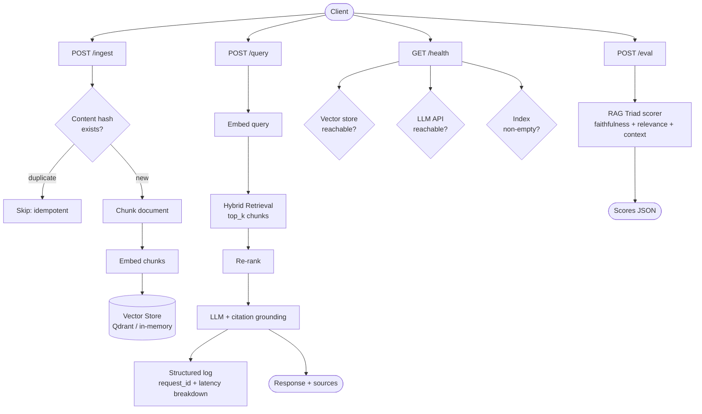

# Capstone: Production RAG Service

> Stitch everything from this phase into a service that can be deployed, debugged, and improved.

**Type:** Build
**Languages:** Python
**Prerequisites:** All lessons 01–15 in this phase
**Time:** ~120 minutes
**Phase:** 02 · Retrieval & RAG

---

## Learning Objectives

- Build a complete, deployable RAG service using FastAPI with production-quality error handling
- Implement structured JSON logging with request IDs, latency breakdowns, and token counts
- Design idempotent document ingestion using content hashing
- Build an evaluation endpoint that runs the RAG Triad on a test case without leaving the service
- Handle LLM rate limits with exponential backoff and circuit breaking
- Write a multi-stage Dockerfile that produces a small, secure production image
- Apply the full RAG evaluation harness from Lesson 10 against the deployed service

---

## The Problem

You have built the components: embeddings, chunking, hybrid search, re-ranking, citation grounding, eval harness, and the text-to-SQL and codebase RAG variants. None of them are a service. They run in notebooks and scripts. They have no health check. If the vector store goes down, they throw an unhandled exception. If the LLM API rate-limits, they crash. There is no structured logging, so when something goes wrong at 3 a.m. you have no idea where the failure was.

The capstone is connecting all of it into a deployable service. The service has four endpoints. One ingests documents. One answers queries. One checks whether the service is actually healthy (not just running: healthy, meaning retrieval works and the index is non-empty). One runs an eval case and returns RAG Triad scores on the spot.

This is the pattern used in production AI teams. Not a Jupyter notebook. A service with an API contract, structured logs, and a Dockerfile.

---

## The Concept

### Service Architecture



### API Design Principles

**Idempotent ingestion**: hashing each document before storing means you can call `POST /ingest` twice with the same document and get the same result both times: no duplicates, no errors. This is critical for reliable pipelines.

**Async query**: for production, the query endpoint should support streaming. The capstone implements synchronous for clarity; add `StreamingResponse` for production.

**Consistent error responses**: every error returns the same shape: `{error: string, request_id: string, details: any}`. Clients can depend on this shape.

**Health ≠ alive**: returning 200 from `/health` when the index is empty is a lie. A healthy RAG service has a non-empty index and reachable dependencies. The health endpoint checks all three: vector store reachable, LLM API reachable, index non-empty.

### Observability: What to Log

Every query generates a structured log entry:

```json
{
  "request_id": "uuid",
  "timestamp": "2024-12-01T09:23:45Z",
  "query": "what is the refund policy?",
  "retrieved_chunks": 5,
  "top_chunk_score": 0.847,
  "latency_breakdown": {
    "embed_ms": 48,
    "retrieve_ms": 12,
    "rerank_ms": 0,
    "generate_ms": 891,
    "total_ms": 951
  },
  "model": "gpt-4o-mini",
  "prompt_tokens": 892,
  "completion_tokens": 143,
  "answer_length": 512
}
```

When something breaks in production, this log tells you exactly where. If `embed_ms` spikes → embedding API is slow. If `retrieve_ms` spikes → vector store is under load. If `generate_ms` spikes → LLM is rate-limiting. Without this breakdown, all you know is "the query was slow."

### Rate Limit Handling

LLM APIs rate-limit. The pattern: exponential backoff with jitter.

```
Attempt 1: immediate
Attempt 2: wait 1s + random(0-0.5s)
Attempt 3: wait 2s + random(0-0.5s)
Attempt 4: wait 4s + random(0-0.5s)
Max retries: 3
Max wait: 8s
```

Jitter prevents the thundering herd problem: if ten requests all hit rate limiting simultaneously and retry at the same fixed interval, they all retry together and rate-limit again. Jitter desynchronizes the retries.

### Config Management

Everything that you tune belongs in environment variables:

```
OPENAI_API_KEY=sk-...           # required
EMBED_MODEL=text-embedding-3-small
CHAT_MODEL=gpt-4o-mini
TOP_K=5                         # retrieval candidates
CHUNK_SIZE=400                  # words per chunk
CHUNK_OVERLAP=50                # overlap words
MAX_RETRIES=3                   # LLM retry limit
LOG_LEVEL=INFO
```

Never hardcode model names. They change. `gpt-4o-mini` might be replaced by a cheaper, better model next quarter. If it's in the code, you need a code deploy to change it. If it's in an env var, you need a config update.

---

## Build It

### Step 1: Dependencies and Config

```python
# pip install fastapi uvicorn openai sentence-transformers qdrant-client pydantic numpy
# Set OPENAI_API_KEY environment variable.

from __future__ import annotations

import hashlib
import json
import logging
import os
import random
import time
import uuid
from contextlib import asynccontextmanager
from typing import Any

import numpy as np
from fastapi import FastAPI, HTTPException, Request
from fastapi.responses import JSONResponse
from openai import OpenAI, RateLimitError, APIError
from pydantic import BaseModel, Field
from sentence_transformers import SentenceTransformer

# ---------------------------------------------------------------------------
# Config from environment
# ---------------------------------------------------------------------------

class Config:
    OPENAI_API_KEY: str = os.environ.get("OPENAI_API_KEY", "")
    EMBED_MODEL: str = os.environ.get("EMBED_MODEL", "text-embedding-3-small")
    CHAT_MODEL: str = os.environ.get("CHAT_MODEL", "gpt-4o-mini")
    LOCAL_EMBED_MODEL: str = os.environ.get("LOCAL_EMBED_MODEL", "all-MiniLM-L6-v2")
    TOP_K: int = int(os.environ.get("TOP_K", "5"))
    CHUNK_SIZE: int = int(os.environ.get("CHUNK_SIZE", "400"))
    CHUNK_OVERLAP: int = int(os.environ.get("CHUNK_OVERLAP", "50"))
    MAX_RETRIES: int = int(os.environ.get("MAX_RETRIES", "3"))
    USE_LOCAL_EMBEDDINGS: bool = os.environ.get("USE_LOCAL_EMBEDDINGS", "false").lower() == "true"
    LOG_LEVEL: str = os.environ.get("LOG_LEVEL", "INFO")

cfg = Config()
```

### Step 2: Structured Logging

```python
logging.basicConfig(
    level=getattr(logging, cfg.LOG_LEVEL, logging.INFO),
    format="%(message)s",  # raw: we emit JSON
)
logger = logging.getLogger("rag_service")


def log_event(event: str, data: dict[str, Any]) -> None:
    """Emit a structured JSON log entry."""
    entry = {
        "ts": time.strftime("%Y-%m-%dT%H:%M:%SZ", time.gmtime()),
        "event": event,
        **data,
    }
    logger.info(json.dumps(entry))
```

### Step 3: In-Memory Vector Store

```python
class InMemoryVectorStore:
    """
    Simple in-memory vector store using numpy cosine similarity.
    Suitable for development and small corpora (<50k chunks).
    Replace with Qdrant or pgvector for production scale.
    """

    def __init__(self):
        self.chunks: list[dict] = []
        self.vectors: np.ndarray | None = None
        self.doc_hashes: set[str] = set()  # idempotency

    def add(self, text: str, vector: np.ndarray, metadata: dict) -> str:
        chunk_id = str(uuid.uuid4())[:12]
        self.chunks.append({"id": chunk_id, "text": text, "metadata": metadata})
        vec = vector.reshape(1, -1).astype(np.float32)
        if self.vectors is None:
            self.vectors = vec
        else:
            self.vectors = np.vstack([self.vectors, vec])
        return chunk_id

    def search(self, query_vec: np.ndarray, top_k: int) -> list[dict]:
        if self.vectors is None or len(self.chunks) == 0:
            return []
        q = query_vec.astype(np.float32)
        norms = np.linalg.norm(self.vectors, axis=1) * np.linalg.norm(q)
        norms = np.where(norms == 0, 1e-10, norms)
        scores = self.vectors @ q / norms
        k = min(top_k, len(self.chunks))
        top_idx = np.argsort(scores)[::-1][:k]
        return [
            {**self.chunks[i], "score": float(scores[i])}
            for i in top_idx
        ]

    def count(self) -> int:
        return len(self.chunks)

    def is_doc_known(self, doc_hash: str) -> bool:
        return doc_hash in self.doc_hashes

    def register_doc(self, doc_hash: str) -> None:
        self.doc_hashes.add(doc_hash)
```

### Step 4: Embedding with Retry

```python
oai_client = OpenAI(api_key=cfg.OPENAI_API_KEY) if cfg.OPENAI_API_KEY else None
local_model: SentenceTransformer | None = None


def get_local_model() -> SentenceTransformer:
    global local_model
    if local_model is None:
        local_model = SentenceTransformer(cfg.LOCAL_EMBED_MODEL)
    return local_model


def with_retry(fn, max_retries: int = 3):
    """
    Call fn() with exponential backoff + jitter on RateLimitError.
    Raises after max_retries attempts.
    """
    for attempt in range(max_retries + 1):
        try:
            return fn()
        except RateLimitError as e:
            if attempt == max_retries:
                raise
            wait = (2 ** attempt) + random.uniform(0, 0.5)
            log_event("rate_limit_backoff", {"attempt": attempt + 1, "wait_s": round(wait, 2)})
            time.sleep(wait)
        except APIError as e:
            if attempt == max_retries or e.status_code not in (429, 500, 503):
                raise
            wait = (2 ** attempt) + random.uniform(0, 0.5)
            time.sleep(wait)


def embed_texts(texts: list[str]) -> np.ndarray:
    """
    Embed texts. Uses OpenAI by default; falls back to local sentence-transformers
    if USE_LOCAL_EMBEDDINGS=true or OPENAI_API_KEY is not set.
    """
    if cfg.USE_LOCAL_EMBEDDINGS or not oai_client:
        model = get_local_model()
        return model.encode(texts, show_progress_bar=False).astype(np.float32)

    def call():
        resp = oai_client.embeddings.create(model=cfg.EMBED_MODEL, input=texts)
        return np.array([item.embedding for item in resp.data], dtype=np.float32)

    return with_retry(call, max_retries=cfg.MAX_RETRIES)
```

### Step 5: Chunking and Ingestion

```python
def chunk_text(text: str, chunk_size: int, overlap: int) -> list[str]:
    words = text.split()
    chunks, start = [], 0
    while start < len(words):
        end = start + chunk_size
        chunks.append(" ".join(words[start:end]))
        if end >= len(words):
            break
        start = end - overlap
    return chunks


vector_store = InMemoryVectorStore()


def ingest_document(
    content: str,
    doc_id: str,
    metadata: dict,
    chunk_size: int,
    overlap: int,
) -> dict:
    """
    Idempotent ingestion: hash content before processing.
    Returns {doc_id, chunks_added, was_duplicate}.
    """
    doc_hash = hashlib.sha256(content.encode()).hexdigest()[:16]

    if vector_store.is_doc_known(doc_hash):
        return {"doc_id": doc_id, "chunks_added": 0, "was_duplicate": True}

    chunks = chunk_text(content, chunk_size, overlap)
    vectors = embed_texts(chunks)

    chunk_meta = {**metadata, "doc_id": doc_id, "doc_hash": doc_hash}
    for chunk, vec in zip(chunks, vectors):
        vector_store.add(chunk, vec, chunk_meta)

    vector_store.register_doc(doc_hash)
    return {"doc_id": doc_id, "chunks_added": len(chunks), "was_duplicate": False}
```

### Step 6: Query Pipeline

```python
SYSTEM_PROMPT = (
    "You are a helpful assistant. Answer the user's question using ONLY "
    "the provided context. If the context is insufficient, say so explicitly. "
    "Cite the source of each claim using [Source N] notation."
)


def run_query(query: str, top_k: int) -> dict:
    """
    Full RAG query pipeline with latency instrumentation.
    Returns {answer, sources, retrieved_chunks, latency_breakdown, tokens}.
    """
    timings: dict[str, int] = {}

    # Embed query
    t0 = time.time()
    query_vec = embed_texts([query])[0]
    timings["embed_ms"] = int((time.time() - t0) * 1000)

    # Retrieve
    t0 = time.time()
    results = vector_store.search(query_vec, top_k=top_k)
    timings["retrieve_ms"] = int((time.time() - t0) * 1000)

    if not results:
        return {
            "answer": "No relevant documents found in the index.",
            "sources": [],
            "retrieved_chunks": [],
            "latency_breakdown": timings,
            "tokens": {},
        }

    # Format context
    context_parts = []
    for i, r in enumerate(results, 1):
        source = r["metadata"].get("doc_id", "unknown")
        context_parts.append(f"[Source {i}: {source}]\n{r['text']}")
    context = "\n\n---\n\n".join(context_parts)

    prompt = f"Context:\n{context}\n\n---\n\nQuestion: {query}\n\nAnswer:"

    # Generate
    t0 = time.time()

    def call_llm():
        return oai_client.chat.completions.create(
            model=cfg.CHAT_MODEL,
            messages=[
                {"role": "system", "content": SYSTEM_PROMPT},
                {"role": "user", "content": prompt},
            ],
            temperature=0.0,
        )

    resp = with_retry(call_llm, max_retries=cfg.MAX_RETRIES) if oai_client else None
    timings["generate_ms"] = int((time.time() - t0) * 1000)
    timings["total_ms"] = sum(timings.values())

    if resp is None:
        answer = "[LLM unavailable: no OPENAI_API_KEY configured]"
        token_info = {}
    else:
        answer = resp.choices[0].message.content.strip()
        token_info = {
            "prompt_tokens": resp.usage.prompt_tokens,
            "completion_tokens": resp.usage.completion_tokens,
        }

    sources = list({r["metadata"].get("doc_id", "unknown") for r in results})

    return {
        "answer": answer,
        "sources": sources,
        "retrieved_chunks": [
            {"text": r["text"][:200], "score": r["score"], "source": r["metadata"].get("doc_id")}
            for r in results
        ],
        "latency_breakdown": timings,
        "tokens": token_info,
    }
```

### Step 7: RAG Triad Eval

```python
RAG_TRIAD_PROMPT = """You are an evaluator scoring a RAG system's answer quality.

Score the following answer on three dimensions (0.0 to 1.0 each):

1. FAITHFULNESS: Is the answer fully supported by the provided context?
   (1.0 = every claim is in the context; 0.0 = answer contradicts or ignores context)

2. ANSWER_RELEVANCE: Does the answer address the question?
   (1.0 = directly and completely answers; 0.0 = answer is off-topic or incomplete)

3. CONTEXT_RELEVANCE: How relevant is the retrieved context to the question?
   (1.0 = context directly contains the answer; 0.0 = context is unrelated)

Return ONLY a JSON object with keys: faithfulness, answer_relevance, context_relevance.

Question: {question}
Retrieved context: {context}
Answer: {answer}

JSON scores:"""


def run_rag_triad(question: str, context: str, answer: str) -> dict:
    """
    Score an answer on the RAG Triad: faithfulness, answer relevance, context relevance.
    Returns {faithfulness: float, answer_relevance: float, context_relevance: float}.
    """
    if not oai_client:
        return {"faithfulness": 0.0, "answer_relevance": 0.0, "context_relevance": 0.0,
                "error": "No LLM configured"}

    prompt = RAG_TRIAD_PROMPT.format(
        question=question,
        context=context[:2000],  # cap context length in eval prompt
        answer=answer,
    )

    def call():
        return oai_client.chat.completions.create(
            model=cfg.CHAT_MODEL,
            messages=[{"role": "user", "content": prompt}],
            temperature=0.0,
        )

    resp = with_retry(call, max_retries=2)
    raw = resp.choices[0].message.content.strip()

    # Strip markdown if present
    if "```" in raw:
        raw = raw.split("```")[1]
        if raw.startswith("json"):
            raw = raw[4:]

    try:
        scores = json.loads(raw)
        return {
            "faithfulness": float(scores.get("faithfulness", 0)),
            "answer_relevance": float(scores.get("answer_relevance", 0)),
            "context_relevance": float(scores.get("context_relevance", 0)),
        }
    except (json.JSONDecodeError, ValueError, KeyError) as e:
        return {"faithfulness": 0.0, "answer_relevance": 0.0, "context_relevance": 0.0,
                "parse_error": str(e), "raw": raw}
```

### Step 8: FastAPI Application

```python
# ---------------------------------------------------------------------------
# Pydantic models
# ---------------------------------------------------------------------------

class IngestRequest(BaseModel):
    content: str = Field(..., description="Document text to ingest")
    doc_id: str = Field(default_factory=lambda: str(uuid.uuid4())[:8])
    metadata: dict = Field(default_factory=dict)
    chunk_size: int = Field(default=None)
    chunk_overlap: int = Field(default=None)


class QueryRequest(BaseModel):
    query: str = Field(..., description="Natural language query")
    top_k: int = Field(default=None)


class EvalRequest(BaseModel):
    question: str
    expected_answer: str | None = None
    context: str | None = None


class ErrorResponse(BaseModel):
    error: str
    request_id: str
    details: Any = None


# ---------------------------------------------------------------------------
# App lifecycle
# ---------------------------------------------------------------------------

@asynccontextmanager
async def lifespan(app: FastAPI):
    log_event("service_start", {
        "chat_model": cfg.CHAT_MODEL,
        "embed_model": cfg.EMBED_MODEL,
        "top_k": cfg.TOP_K,
    })
    yield
    log_event("service_stop", {"total_chunks": vector_store.count()})


app = FastAPI(
    title="RAG Service",
    description="Production RAG API: Phase 02 Capstone",
    version="1.0.0",
    lifespan=lifespan,
)


# ---------------------------------------------------------------------------
# Middleware: request ID + timing
# ---------------------------------------------------------------------------

@app.middleware("http")
async def add_request_id(request: Request, call_next):
    request_id = str(uuid.uuid4())[:12]
    request.state.request_id = request_id
    t0 = time.time()
    response = await call_next(request)
    total_ms = int((time.time() - t0) * 1000)
    response.headers["X-Request-ID"] = request_id
    response.headers["X-Response-Time-Ms"] = str(total_ms)
    return response


# ---------------------------------------------------------------------------
# Endpoints
# ---------------------------------------------------------------------------

@app.get("/health")
async def health(request: Request) -> dict:
    """
    Deep health check: verifies all dependencies are actually working.
    Returns 200 only if: vector store reachable, index non-empty, LLM reachable.
    """
    checks = {}
    status = "healthy"

    # Vector store
    try:
        count = vector_store.count()
        checks["vector_store"] = {"status": "ok", "chunk_count": count}
        if count == 0:
            checks["vector_store"]["warning"] = "Index is empty: no documents ingested"
            status = "degraded"
    except Exception as e:
        checks["vector_store"] = {"status": "error", "detail": str(e)}
        status = "unhealthy"

    # LLM
    if oai_client and cfg.OPENAI_API_KEY:
        checks["llm"] = {"status": "configured", "model": cfg.CHAT_MODEL}
    else:
        checks["llm"] = {"status": "not_configured"}
        status = "degraded"

    # Embedding
    checks["embeddings"] = {
        "status": "ok",
        "mode": "local" if cfg.USE_LOCAL_EMBEDDINGS else "openai",
    }

    http_status = 200 if status == "healthy" else 207

    return JSONResponse(
        status_code=http_status,
        content={
            "status": status,
            "request_id": request.state.request_id,
            "checks": checks,
        },
    )


@app.post("/ingest")
async def ingest(req: IngestRequest, request: Request) -> dict:
    """
    Ingest a document. Idempotent: duplicate content is detected by hash.
    Returns {doc_id, chunks_added, was_duplicate}.
    """
    request_id = request.state.request_id

    try:
        t0 = time.time()
        result = ingest_document(
            content=req.content,
            doc_id=req.doc_id,
            metadata=req.metadata,
            chunk_size=req.chunk_size or cfg.CHUNK_SIZE,
            overlap=req.chunk_overlap or cfg.CHUNK_OVERLAP,
        )
        elapsed = int((time.time() - t0) * 1000)

        log_event("ingest", {
            "request_id": request_id,
            "doc_id": req.doc_id,
            "chunks_added": result["chunks_added"],
            "was_duplicate": result["was_duplicate"],
            "latency_ms": elapsed,
        })

        return {**result, "request_id": request_id}

    except Exception as e:
        log_event("ingest_error", {"request_id": request_id, "error": str(e)})
        raise HTTPException(status_code=500, detail={"error": str(e), "request_id": request_id})


@app.post("/query")
async def query(req: QueryRequest, request: Request) -> dict:
    """
    Query the RAG index. Returns answer, sources, retrieved chunks, latency breakdown.
    """
    request_id = request.state.request_id

    if not req.query.strip():
        raise HTTPException(status_code=400, detail="Query cannot be empty")

    if vector_store.count() == 0:
        raise HTTPException(
            status_code=503,
            detail={"error": "Index is empty. Ingest documents first.", "request_id": request_id},
        )

    try:
        result = run_query(req.query, top_k=req.top_k or cfg.TOP_K)

        log_event("query", {
            "request_id": request_id,
            "query": req.query[:100],
            "retrieved_chunks": len(result["retrieved_chunks"]),
            "top_chunk_score": result["retrieved_chunks"][0]["score"] if result["retrieved_chunks"] else 0,
            "latency_breakdown": result["latency_breakdown"],
            "tokens": result["tokens"],
            "answer_length": len(result["answer"]),
        })

        return {**result, "request_id": request_id}

    except RateLimitError:
        log_event("rate_limit_final", {"request_id": request_id})
        raise HTTPException(
            status_code=429,
            detail={"error": "LLM rate limit exceeded after retries", "request_id": request_id},
        )
    except Exception as e:
        log_event("query_error", {"request_id": request_id, "error": str(e)})
        raise HTTPException(status_code=500, detail={"error": str(e), "request_id": request_id})


@app.post("/eval")
async def eval_endpoint(req: EvalRequest, request: Request) -> dict:
    """
    Run RAG Triad evaluation on a question.
    If context is not provided, retrieves from the index.
    Returns {faithfulness, answer_relevance, context_relevance, answer}.
    """
    request_id = request.state.request_id

    if vector_store.count() == 0:
        raise HTTPException(
            status_code=503,
            detail={"error": "Index is empty. Ingest documents first.", "request_id": request_id},
        )

    try:
        # Get answer from RAG pipeline
        result = run_query(req.question, top_k=cfg.TOP_K)
        answer = result["answer"]

        # Build context string
        if req.context:
            context = req.context
        else:
            context = "\n\n".join(
                c["text"] for c in result["retrieved_chunks"]
            )

        # Score with RAG Triad
        scores = run_rag_triad(req.question, context, answer)

        log_event("eval", {
            "request_id": request_id,
            "question": req.question[:100],
            "scores": scores,
        })

        return {
            "question": req.question,
            "answer": answer,
            "scores": scores,
            "request_id": request_id,
        }

    except Exception as e:
        log_event("eval_error", {"request_id": request_id, "error": str(e)})
        raise HTTPException(status_code=500, detail={"error": str(e), "request_id": request_id})
```

> **Real-world check:** A non-technical founder says: "We just want to answer questions about our docs. Why does this need a Dockerfile, an eval endpoint, and structured logging? Can't we just call the API directly?" How do you explain what each of those pieces is actually protecting against?

---

## Use It

Start the service locally:

```bash
export OPENAI_API_KEY=sk-...
uvicorn main:app --host 0.0.0.0 --port 8000 --reload
```

Ingest a document:

```bash
curl -X POST http://localhost:8000/ingest \
  -H "Content-Type: application/json" \
  -d '{"content": "RAG combines retrieval with LLM generation...", "doc_id": "rag-intro"}'
```

Ask a question:

```bash
curl -X POST http://localhost:8000/query \
  -H "Content-Type: application/json" \
  -d '{"query": "What is RAG?"}'
```

Run an eval:

```bash
curl -X POST http://localhost:8000/eval \
  -H "Content-Type: application/json" \
  -d '{"question": "What is RAG?", "expected_answer": "RAG combines retrieval with LLM generation"}'
```

Check health:

```bash
curl http://localhost:8000/health
```

> **Perspective shift:** A customer's IT and security team says: "This service is going to have access to our internal documents and will be making calls to OpenAI. What is your data retention policy, and how do we audit what gets sent?" What would you need to have in place before you could answer that question honestly?

---

## Ship It

Build and run with Docker:

```bash
docker build -t rag-service .
docker run -p 8000:8000 -e OPENAI_API_KEY=sk-... rag-service
```

The Dockerfile uses a multi-stage build to keep the image small:
- Build stage: installs all dependencies
- Runtime stage: copies only what's needed, runs as a non-root user
- Final size: ~600MB (dominated by sentence-transformers model weights)

For a lighter image without local embeddings, set `USE_LOCAL_EMBEDDINGS=false` and use OpenAI embeddings only: cuts the image size by ~400MB.

---

## Evaluate It

### Production Eval with the Full Harness

Run the RAG Triad eval harness from Lesson 10 against the live service:

```python
eval_set = [
    {"question": "What is RAG?", "expected": "combines retrieval with LLM generation"},
    {"question": "How does hybrid search work?", "expected": "combines dense and sparse retrieval"},
    # ... add 10+ pairs
]

import requests
results = []
for item in eval_set:
    resp = requests.post("http://localhost:8000/eval", json={"question": item["question"]})
    scores = resp.json()["scores"]
    results.append(scores)

avg_faith = sum(r["faithfulness"] for r in results) / len(results)
avg_rel = sum(r["answer_relevance"] for r in results) / len(results)
avg_ctx = sum(r["context_relevance"] for r in results) / len(results)
print(f"Faithfulness:        {avg_faith:.2f}")
print(f"Answer relevance:    {avg_rel:.2f}")
print(f"Context relevance:   {avg_ctx:.2f}")
```

**Minimum acceptance thresholds for production:**
- Faithfulness > 0.85 (answers are grounded in context)
- Answer relevance > 0.80 (answers are on-topic)
- Context relevance > 0.70 (retrieval is finding the right chunks)

If any threshold is not met, do not deploy.

### What to Instrument First When This Breaks in Production

1. **Check ingestion completeness**: query `GET /health`. If `chunk_count` is unexpectedly low, ingestion failed silently. Check logs for `ingest_error` events.

2. **Check retrieval quality**: look at `top_chunk_score` in query logs. If scores are consistently below 0.6, retrieval is failing: wrong embedding model, corpus mismatch, or index corruption.

3. **Check LLM response quality**: high retrieval scores but low faithfulness in evals → generation problem. Check your system prompt and context format.

4. **Check latency percentiles**: look at `latency_breakdown.generate_ms` in logs. P95 > 3s is a sign of rate limiting or model degradation. `embed_ms` > 200ms indicates embedding API issues.

---

## Exercises

1. **[Easy]** Add a `DELETE /ingest/{doc_id}` endpoint that removes all chunks for a given `doc_id` from the vector store. What does your idempotency hash tracking need to handle for re-ingestion to work after deletion?

2. **[Medium]** Add a streaming query endpoint `POST /query/stream` using FastAPI's `StreamingResponse` and OpenAI's streaming API. The client should receive the answer token-by-token while the structured log entry is emitted after the stream completes.

3. **[Hard]** Replace the in-memory vector store with Qdrant (using `qdrant-client`). The interface (`add`, `search`, `count`) should not change. Update the `/health` endpoint to verify the Qdrant connection is alive. Add a `GET /ingest/status` endpoint that shows total document count and total chunk count stored in Qdrant.

---

## Key Terms

| Term | What people say | What it actually means |
|------|-----------------|------------------------|
| Idempotent ingestion | "Deduplication" | Hashing document content so ingesting the same document twice produces the same state: no duplicates, no errors |
| Structured logging | "JSON logs" or "structured observability" | Log entries formatted as JSON objects with consistent fields (request_id, event, latency) that can be queried by log aggregation tools |
| Exponential backoff | "Retry with backoff" | Doubling the wait time between retries: 1s, 2s, 4s, 8s. Prevents overwhelming a service that is already under load |
| Jitter | "Random backoff" | Adding a random offset to backoff intervals to prevent synchronized retries from many clients (thundering herd) |
| Circuit breaker | "Fail fast" | Stopping requests to a failing dependency after N consecutive failures, to prevent cascading failures |
| RAG Triad | "Eval scores" or "RAGAS metrics" | Three evaluation dimensions: faithfulness (grounded?), answer relevance (on-topic?), context relevance (right chunks?) |
| Deep health check | "Readiness probe" | A health check that verifies all dependencies (DB, LLM, index) are actually working, not just that the process is alive |

---

## Further Reading

- [FastAPI Documentation: Background Tasks + Middleware](https://fastapi.tiangolo.com/tutorial/middleware/): how to add request ID middleware and background logging
- [OpenTelemetry Python SDK](https://opentelemetry.io/docs/instrumentation/python/): the production standard for distributed tracing; replaces hand-rolled structured logging at scale
- [RAGAS: Evaluation Framework for RAG](https://docs.ragas.io/): the open-source library that implements RAG Triad metrics; use it to replace the hand-written scorer in this lesson
- [Qdrant Documentation](https://qdrant.tech/documentation/): the vector database used in the Hard exercise; production-grade, local or cloud-hosted
- [12-Factor App Methodology](https://12factor.net/): the canonical guide to config via environment variables, log to stdout, and stateless services: the three principles this lesson implements
