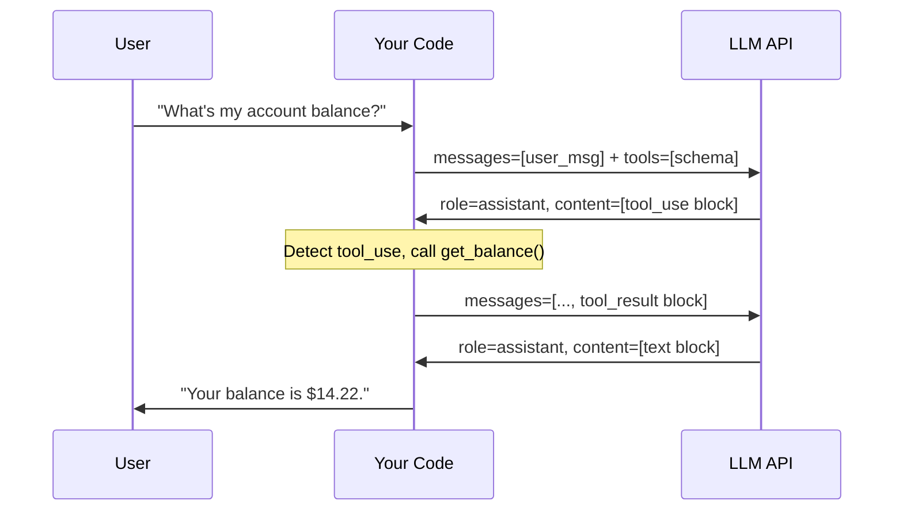

# أساسيات استدعاء الدوال (Function Calling)

> الـ LLM لا يشغّل شفرتك. هو يطلب نتيجة، وأنت من يوصّلها له.

**النوع:** بناء
**اللغات:** Python
**المتطلبات:** أساسيات Python، والإلمام باستدعاء واجهة LLM API (المرحلة 01)
**الوقت:** ~45 دقيقة
**أهداف التعلّم:**
- توضيح ما يحدث فعليًا أثناء استدعاء دالة (الـ LLM يُخرج JSON، وشفرتك هي التي تنفّذ)
- قراءة وكتابة بنية الرسائل الكاملة متعددة الأدوار (multi-turn) لاستخدام الأدوات (tool use)
- بناء حلقة توزيع استدعاءات الأدوات (dispatch loop) عاملة من الصفر باستخدام `anthropic` SDK
- توليد مخططات الأدوات (tool schemas) من تواقيع دوال Python باستخدام Pydantic
- التعرّف على الرحلتين الذهاب والإياب (round-trips) اللازمتين لكل إجابة معزّزة بالأدوات

---

## المشكلة

شركة fintech ناشئة تبني روبوت دردشة لدعم العملاء. في أول أسبوع بالإنتاج، يسأل مستخدم: "كم رصيدي الحالي في الحساب؟" فيردّ الروبوت بثقة: "رصيدك 2,847.33$". الرصيد الفعلي للمستخدم هو 14.22$. تذاكر الدعم تتصاعد. والفريق يتراجع عن الروبوت.

المهندس الذي بناه حاول أن يكون مفيدًا. أدرج عيّنة من المعاملات الأخيرة في system prompt حتى "يعرف" النموذج البيانات. لكن العيّنة ليست بيانات حقيقية. تعلّم النموذج التنسيق وطبّقه بثقة على أي معرّف حساب رآه. كانت الهلوسة (hallucination) سلسة ومقنعة وخاطئة تمامًا.

الميل إلى حشو البيانات في السياق (context) أمر مفهوم. هو أول أداة يلجأ إليها المهندسون لأنها لا تتطلب أي بنية معمارية. فقط تنسّق البيانات كنص وتلصقها. المشكلة أن هذه المقاربة لا تتوسّع ولا تتصل بالحالة الحيّة (live state). لا يمكنك حشر 10,000 صف من سجل المعاملات في نافذة سياق (context window) والحصول على استدلال مفيد منها. وحتى لو استطعت، فستصبح قديمة لحظة توليدها.

البنية الصحيحة هي function calling. فبدلًا من إعطاء النموذج بيانات، تعطيه القدرة على طلب البيانات. النموذج يقرر ما يحتاجه، ويطلبه بالاسم، وشفرتك تنفّذ استعلام قاعدة البيانات الفعلي. النموذج لا يرى رقمًا مزيفًا أبدًا. بل يرى استجابة API حقيقية أو خطأ واضحًا. هذا هو أساس كل نظام ذكاء اصطناعي إنتاجي يتعامل مع بيانات حيّة.

---

## المفهوم

### ما يحدث فعليًا

function calling هو بروتوكول محادثة منظّم، وليس سحرًا. إليك ما يفعله كل طرف:

الـ LLM يفعل شيئين: (1) يقرّر أن استدعاء دالة مطلوب، و(2) يُخرج كتلة JSON منظّمة تصف أي دالة وبأي وسائط (arguments). هو لا ينفّذ شيئًا. ليس لديه وصول للشبكة ولا بيئة تشغيل (runtime). إنه يولّد رموزًا (tokens) تصادف أن تكون JSON صحيحًا.

شفرتك تفعل ثلاثة أشياء: (1) ترسل tool schemas إلى الـ LLM مع رسالة المستخدم، و(2) تكتشف كتلة tool_use في الاستجابة، و(3) تستدعي الدالة فعليًا، ثم ترسل النتيجة مرة أخرى إلى الـ LLM في الدور التالي.

ثم يفعل الـ LLM شيئًا أخيرًا: يقرأ النتيجة ويولّد إجابة نهائية بلغة طبيعية.

هذا يعني أن كل إجابة معزّزة بالأدوات تتطلب بالضبط استدعاءين لواجهة LLM API: واحد للحصول على طلب استدعاء الدالة، وواحد للحصول على الإجابة النهائية.

### بنية أدوار الرسائل



### كيف تبدو كل رسالة

هذا المخطط بصيغة ASCII يوضّح قائمة الرسائل في كل خطوة من المحادثة.

```
STEP 1: You send to the LLM
────────────────────────────────────────────────────────────
messages = [
  { role: "user",
    content: "What's my account balance for account acc_42?" }
]
tools = [
  { name: "get_account_balance",
    input_schema: { type: "object",
                    properties: { account_id: { type: "string" } },
                    required: ["account_id"] } }
]

STEP 2: LLM responds with tool_use
────────────────────────────────────────────────────────────
response.content = [
  { type: "tool_use",
    id:   "toolu_01XYZ",
    name: "get_account_balance",
    input: { account_id: "acc_42" } }
]

STEP 3: You execute the function, then send result back
────────────────────────────────────────────────────────────
messages = [
  { role: "user",    content: "What's my balance..." },
  { role: "assistant", content: [tool_use block from step 2] },
  { role: "user",
    content: [
      { type: "tool_result",
        tool_use_id: "toulu_01XYZ",
        content: '{"balance": 14.22, "currency": "USD"}' }
    ]
  }
]

STEP 4: LLM responds with final answer
────────────────────────────────────────────────────────────
response.content = [
  { type: "text",
    text: "Your current balance is $14.22 USD." }
]
```

أمران تجدر ملاحظتهما: كتلة tool_use الخاصة بالمساعد (assistant) يجب أن تُدرج حرفيًا في قائمة messages (الخطوة 3) قبل إلحاق tool_result. إن تجاهلتها، سترفض الـ API الطلب. كما أن `tool_use_id` في tool_result يجب أن يطابق `id` من كتلة tool_use بالضبط.

---

## البناء

### الخطوة 1: تعريف مخططات الأدوات (Tool Schemas)

يُخبر tool schema الـ LLM باسم الدالة، وما الوسائط التي تقبلها، وماذا يعني كل وسيط. الحقول الثلاثة كلها مهمّة.

```python
# tools.py  (or top of main.py)
TOOLS = [
    {
        "name": "get_account_balance",
        "description": (
            "Returns the current balance for a given account. "
            "Use this when the user asks about their balance, funds, or how much money is in an account."
        ),
        "input_schema": {
            "type": "object",
            "properties": {
                "account_id": {
                    "type": "string",
                    "description": "The account identifier, e.g. 'acc_42' or 'acc_7891'."
                }
            },
            "required": ["account_id"]
        }
    },
    {
        "name": "list_recent_transactions",
        "description": (
            "Returns the N most recent transactions for an account. "
            "Use this when the user asks about recent activity, charges, deposits, or spending history."
        ),
        "input_schema": {
            "type": "object",
            "properties": {
                "account_id": {
                    "type": "string",
                    "description": "The account identifier."
                },
                "limit": {
                    "type": "integer",
                    "description": "Number of transactions to return. Defaults to 5. Maximum 20.",
                    "default": 5
                }
            },
            "required": ["account_id"]
        }
    }
]
```

### الخطوة 2: تنفيذ الدوال البديلة (Stub Functions)

هذه الدوال البديلة (stubs) تُرجع بيانات وهمية واقعية. في الإنتاج تستبدل جسم الدالة باستعلام قاعدة بيانات حقيقي.

```python
def get_account_balance(account_id: str) -> dict:
    """Stub: returns a realistic fake balance."""
    # Production: return db.query("SELECT balance FROM accounts WHERE id = ?", account_id)
    stub_data = {
        "acc_42":   {"balance": 14.22,    "currency": "USD", "account_id": "acc_42"},
        "acc_99":   {"balance": 8_204.50, "currency": "USD", "account_id": "acc_99"},
        "acc_7891": {"balance": 0.00,     "currency": "USD", "account_id": "acc_7891"},
    }
    if account_id not in stub_data:
        return {"error": f"Account {account_id!r} not found."}
    return stub_data[account_id]


def list_recent_transactions(account_id: str, limit: int = 5) -> dict:
    """Stub: returns realistic fake transaction history."""
    # Production: return db.query("SELECT ... FROM transactions WHERE account_id = ? LIMIT ?", ...)
    stub_transactions = {
        "acc_42": [
            {"date": "2026-05-24", "description": "Coffee Shop",       "amount": -4.50},
            {"date": "2026-05-23", "description": "Payroll Deposit",   "amount": 2000.00},
            {"date": "2026-05-22", "description": "Grocery Store",     "amount": -87.33},
            {"date": "2026-05-21", "description": "Streaming Service", "amount": -15.99},
            {"date": "2026-05-20", "description": "ATM Withdrawal",    "amount": -60.00},
        ],
        "acc_99": [
            {"date": "2026-05-24", "description": "Wire Transfer In",  "amount": 5000.00},
            {"date": "2026-05-22", "description": "Online Purchase",   "amount": -129.99},
        ],
    }
    txns = stub_transactions.get(account_id, [])
    return {
        "account_id": account_id,
        "transactions": txns[:limit],
        "count": min(limit, len(txns))
    }
```

### الخطوة 3: بناء حلقة التوزيع (Dispatch Loop)

حلقة التوزيع هي طبقة التنسيق (orchestration). تتولّى بنية المحادثة ذات الرحلتين ذهابًا وإيابًا.

```python
import anthropic
import json

client = anthropic.Anthropic()

FUNCTION_MAP = {
    "get_account_balance": get_account_balance,
    "list_recent_transactions": list_recent_transactions,
}

def dispatch_tool_call(tool_name: str, tool_input: dict) -> str:
    """Look up and call the right function. Returns JSON string."""
    if tool_name not in FUNCTION_MAP:
        return json.dumps({"error": f"Unknown tool: {tool_name!r}"})
    result = FUNCTION_MAP[tool_name](**tool_input)
    return json.dumps(result)


def run_with_tools(user_message: str) -> str:
    """
    Full tool-use dispatch loop.
    Round 1: send user message + tools, get tool_use block.
    Round 2: send tool result, get final text answer.
    """
    messages = [{"role": "user", "content": user_message}]

    # --- Round 1: let the LLM decide what to call ---
    response = client.messages.create(
        model="claude-3-5-haiku-20241022",
        max_tokens=1024,
        tools=TOOLS,
        messages=messages,
    )

    # If the model answered directly without needing a tool, return now.
    if response.stop_reason == "end_turn":
        return response.content[0].text

    # Collect all tool_use blocks (there may be more than one).
    tool_uses = [block for block in response.content if block.type == "tool_use"]

    if not tool_uses:
        # Unexpected: stop_reason was tool_use but no tool_use block found.
        return response.content[0].text

    # Append the assistant's full response (including tool_use) to the message list.
    messages.append({"role": "assistant", "content": response.content})

    # Execute each tool call and collect results.
    tool_results = []
    for tool_use in tool_uses:
        print(f"  [tool] calling {tool_use.name}({tool_use.input})")
        result_str = dispatch_tool_call(tool_use.name, tool_use.input)
        tool_results.append({
            "type": "tool_result",
            "tool_use_id": tool_use.id,
            "content": result_str,
        })

    # Append all tool results as a single user turn.
    messages.append({"role": "user", "content": tool_results})

    # --- Round 2: let the LLM generate the final answer ---
    final_response = client.messages.create(
        model="claude-3-5-haiku-20241022",
        max_tokens=1024,
        tools=TOOLS,
        messages=messages,
    )

    return final_response.content[0].text
```

> **اختبار من الواقع:** يقول زميلك في العمل: "الـ LLM يستدعي قاعدة بياناتنا." هل هذه العبارة دقيقة، ولماذا يهمّ هذا التمييز في الإنتاج؟

ليست دقيقة. الـ LLM يُخرج وصفًا بصيغة JSON لما يريد استدعاءه. شفرتك هي من تقوم بالاستدعاء الفعلي. يهمّ هذا التمييز لأنه يعني أنك تتحكّم بكل الحدود الأمنية: المصادقة (authentication)، وتحديد المعدّل (rate limiting)، والتحقّق من المدخلات (input validation)، ومعالجة الأخطاء كلها تعيش في طبقة التوزيع لديك، لا داخل النموذج. النموذج هو مدخل غير موثوق، لا منفّذ موثوق.

---

## الاستخدام

### التوليد التلقائي للمخططات من نماذج Pydantic

كتابة tool schemas يدويًا عرضة للخطأ كلما كبر مشروعك البرمجي. يتيح لك Pydantic تعريف المخطّط مرة واحدة، في Python، وتوليد JSON schema تلقائيًا.

```python
from pydantic import BaseModel, Field
import inspect
import json


class GetAccountBalanceInput(BaseModel):
    account_id: str = Field(
        description="The account identifier, e.g. 'acc_42' or 'acc_7891'."
    )


class ListRecentTransactionsInput(BaseModel):
    account_id: str = Field(description="The account identifier.")
    limit: int = Field(
        default=5,
        ge=1,
        le=20,
        description="Number of transactions to return. Defaults to 5. Maximum 20."
    )


def make_tool_schema(name: str, description: str, input_model: type[BaseModel]) -> dict:
    """Generate a Claude-compatible tool schema from a Pydantic model."""
    schema = input_model.model_json_schema()
    # Pydantic includes a "title" key that Claude doesn't need.
    schema.pop("title", None)
    return {
        "name": name,
        "description": description,
        "input_schema": schema,
    }


TOOLS_FROM_PYDANTIC = [
    make_tool_schema(
        name="get_account_balance",
        description=(
            "Returns the current balance for a given account. "
            "Use this when the user asks about their balance, funds, or how much money is in an account."
        ),
        input_model=GetAccountBalanceInput,
    ),
    make_tool_schema(
        name="list_recent_transactions",
        description=(
            "Returns the N most recent transactions for an account. "
            "Use this when the user asks about recent activity, charges, deposits, or spending history."
        ),
        input_model=ListRecentTransactionsInput,
    ),
]
```

إضافة مُزخرِف (decorator) باسم `@tool` تربط توليد المخطّط مباشرة بالدالة:

```python
from functools import wraps

TOOL_REGISTRY: dict[str, dict] = {}

def tool(description: str, input_model: type[BaseModel]):
    """Decorator that registers a function as a callable tool with its schema."""
    def decorator(fn):
        schema = make_tool_schema(fn.__name__, description, input_model)
        TOOL_REGISTRY[fn.__name__] = {"schema": schema, "fn": fn}

        @wraps(fn)
        def wrapper(*args, **kwargs):
            return fn(*args, **kwargs)
        return wrapper
    return decorator


@tool(
    description="Returns the current balance for a given account.",
    input_model=GetAccountBalanceInput,
)
def get_account_balance(account_id: str) -> dict:
    stub_data = {"acc_42": {"balance": 14.22, "currency": "USD"}}
    return stub_data.get(account_id, {"error": f"Account {account_id!r} not found."})
```

نمط السجلّ (registry pattern) يعني أن قائمة أدواتك متزامنة دائمًا مع تنفيذاتها. أضف دالة، زخرِفها، وتصبح متاحة للـ LLM.

> **نقلة في المنظور:** رأيت الآن طريقتين لتعريف tool schemas: قواميس (dicts) خام ونماذج Pydantic. يقول مهندس جديد إن مقاربة القاموس أبسط وأسهل في الفهم. في أي ظروف توافقه، ومتى تتحوّل إلى Pydantic؟

مقاربة القاموس تفوز للأدوات لمرة واحدة وللتمارين التعليمية؛ فأنت ترى JSON بالضبط كما تستقبله الـ API. وPydantic يفوز عندما يكون لديك أكثر من 3 أدوات، أو عندما تحتوي المدخلات على كائنات متداخلة (nested objects) أو تحقّق معقّد، أو عندما تستخدم أجزاء أخرى من شفرتك Pydantic بالفعل لنمذجة البيانات. المكسب الحقيقي من Pydantic هو أن المخطّط والتحقّق يبقيان متزامنين: إن أعدت تسمية حقل في النموذج، يتحدّث المخطّط تلقائيًا. أما مع القواميس الخام، فينحرف الاثنان عن بعضهما.

---

## التسليم

المنتَج (artifact) الذي ينتجه هذا الدرس هو قالب (template) قابل لإعادة الاستخدام لحلقة توزيع استدعاءات الأدوات. انظر `outputs/skill-function-calling.md`.

يتضمّن القالب حلقة التوزيع الكاملة، ومُساعِد توليد المخطّط، ونمط المُزخرِف `@tool`. أسقطه في أي مشروع يحتاج إلى منح الـ LLM وصولًا إلى مصادر بيانات حقيقية.

---

## التقييم

كيف تعرف أن إعداد function-calling لديك يعمل بموثوقية؟

**التغطية (Coverage).** ابنِ مجموعة اختبارات بحالة واحدة لكل أداة: استدعاء ينجح، واستدعاء بوسيط مطلوب مفقود، واستدعاء بمعرّف حساب غير صالح. شغّلها بعد كل تغيير في المخطّط أو الدالة.

**دقّة اختيار الأداة.** لديك 20 رسالة مستخدم متنوّعة، احسب كم مرة يستدعي الـ LLM الأداة الصحيحة (أو لا أداة، عندما لا حاجة لأداة). أي قيمة دون 90% تعني أن أوصاف أدواتك ملتبسة.

**زمن الرحلة ذهابًا وإيابًا (Round-trip latency).** قِس الوقت من رسالة المستخدم إلى الإجابة النهائية. استدعاءا LLM يضيفان زمن استجابة. إن تجاوز p95 اتفاقية مستوى الخدمة (SLA) لديك، فكّر في إمكانية تخزين بعض نتائج الأدوات مؤقتًا (cache).

**انتشار الأخطاء (Error propagation).** أدخل خطأً متعمّدًا في دالة بديلة (أرجِع `{"error": "timeout"}`). تحقّق من أن الـ LLM يولّد رسالة خطأ معقولة للمستخدم بدلًا من هلوسة نتيجة ناجحة. إن تجاهل الـ LLM حقول الخطأ في نتيجة الأداة وأجاب بثقة على أي حال، فإن تنسيق الخطأ لديك يحتاج إعادة تصميم (يغطّي الدرس 04 هذا).
