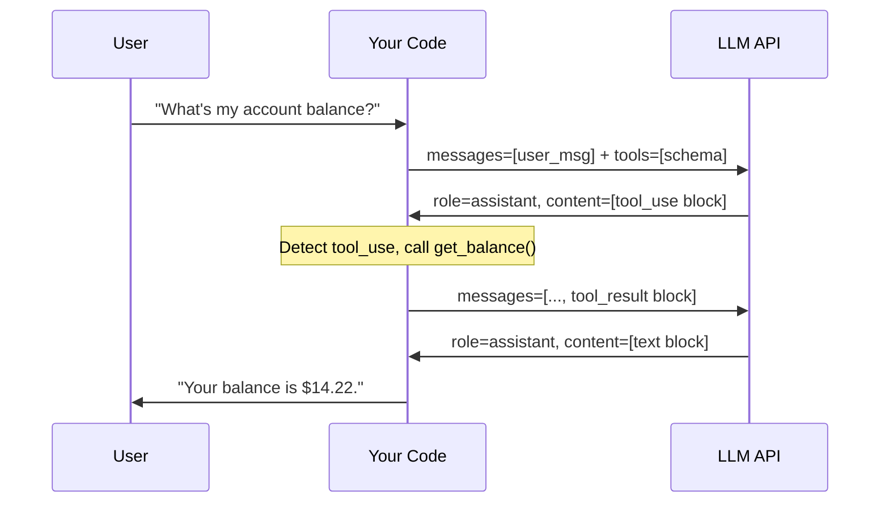

# Function Calling Fundamentals

> The LLM doesn't run your code. It asks for a result, and you deliver it.

**Type:** Build
**Languages:** Python
**Prerequisites:** Basic Python, familiarity with calling an LLM API (Phase 01)
**Time:** ~45 min
**Learning Objectives:**
- Explain what actually happens during a function call (the LLM outputs JSON, your code executes)
- Read and write the full multi-turn message structure for tool use
- Build a working tool dispatch loop from scratch using the `anthropic` SDK
- Generate tool schemas from Python function signatures using Pydantic
- Identify the two round-trips required for every tool-augmented answer

---

## THE PROBLEM

A fintech startup builds a customer support chatbot. The first week in production, a user asks: "What's my current account balance?" The bot replies confidently: "Your balance is $2,847.33." The user's actual balance is $14.22. Support tickets spike. The team rolls back the bot.

The engineer who built it tried to be helpful. They included a sample of recent transactions in the system prompt so the model "knew about the data." But sample data is not real data. The model learned the format and confidently applied it to any account ID it saw. The hallucination was fluent and plausible and completely wrong.

The instinct to stuff data into context is understandable. It's the first tool engineers reach for because it requires no architecture. Just format the data as text and paste it in. The problem is that this approach doesn't scale and it doesn't connect to live state. You cannot fit 10,000 rows of transaction history into a context window and get useful reasoning out of it. Even if you could, it would be stale the moment you generated it.

The correct architecture is function calling. Instead of giving the model data, you give it the ability to ask for data. The model decides what it needs, requests it by name, and your code executes the actual database query. The model never sees a fake number. It sees a real API response or a clear error. This is the foundation of every production AI system that touches live data.

---

## THE CONCEPT

### What Actually Happens

Function calling is a structured conversation protocol, not magic. Here is what each participant does:

The LLM does two things: (1) decides that a function call is needed, and (2) outputs a structured JSON block describing which function and with what arguments. It does not execute anything. It has no network access or runtime. It is generating tokens that happen to be valid JSON.

Your code does three things: (1) sends the tool schemas to the LLM along with the user message, (2) detects the tool_use block in the response, and (3) actually calls the function, then sends the result back to the LLM in the next turn.

The LLM then does one more thing: reads the result and generates a final natural-language answer.

This means every tool-augmented answer requires exactly two LLM API calls: one to get the function call request, one to get the final answer.

### The Message Turn Structure



### What Each Message Looks Like

This ASCII diagram shows the message list at each step in the conversation.

```
STEP 1: You send to the LLM
────────────────────────────────────────────────────────────
messages = [
  { role: "user",
    content: "What's my account balance for account acc_42?" }
]
tools = [
  { name: "get_account_balance",
    input_schema: { type: "object",
                    properties: { account_id: { type: "string" } },
                    required: ["account_id"] } }
]

STEP 2: LLM responds with tool_use
────────────────────────────────────────────────────────────
response.content = [
  { type: "tool_use",
    id:   "toolu_01XYZ",
    name: "get_account_balance",
    input: { account_id: "acc_42" } }
]

STEP 3: You execute the function, then send result back
────────────────────────────────────────────────────────────
messages = [
  { role: "user",    content: "What's my balance..." },
  { role: "assistant", content: [tool_use block from step 2] },
  { role: "user",
    content: [
      { type: "tool_result",
        tool_use_id: "toulu_01XYZ",
        content: '{"balance": 14.22, "currency": "USD"}' }
    ]
  }
]

STEP 4: LLM responds with final answer
────────────────────────────────────────────────────────────
response.content = [
  { type: "text",
    text: "Your current balance is $14.22 USD." }
]
```

Two things to notice: the assistant's tool_use block must be included verbatim in the messages list (step 3) before appending the tool_result. If you skip it, the API will reject the request. And the tool_result's `tool_use_id` must match the `id` from the tool_use block exactly.

---

## BUILD IT

### Step 1: Define the Tool Schemas

A tool schema tells the LLM what the function is called, what arguments it accepts, and what each argument means. All three fields matter.

```python
# tools.py  (or top of main.py)
TOOLS = [
    {
        "name": "get_account_balance",
        "description": (
            "Returns the current balance for a given account. "
            "Use this when the user asks about their balance, funds, or how much money is in an account."
        ),
        "input_schema": {
            "type": "object",
            "properties": {
                "account_id": {
                    "type": "string",
                    "description": "The account identifier, e.g. 'acc_42' or 'acc_7891'."
                }
            },
            "required": ["account_id"]
        }
    },
    {
        "name": "list_recent_transactions",
        "description": (
            "Returns the N most recent transactions for an account. "
            "Use this when the user asks about recent activity, charges, deposits, or spending history."
        ),
        "input_schema": {
            "type": "object",
            "properties": {
                "account_id": {
                    "type": "string",
                    "description": "The account identifier."
                },
                "limit": {
                    "type": "integer",
                    "description": "Number of transactions to return. Defaults to 5. Maximum 20.",
                    "default": 5
                }
            },
            "required": ["account_id"]
        }
    }
]
```

### Step 2: Implement the Stub Functions

These stubs return realistic fake data. In production you replace the body with a real database query.

```python
def get_account_balance(account_id: str) -> dict:
    """Stub: returns a realistic fake balance."""
    # Production: return db.query("SELECT balance FROM accounts WHERE id = ?", account_id)
    stub_data = {
        "acc_42":   {"balance": 14.22,    "currency": "USD", "account_id": "acc_42"},
        "acc_99":   {"balance": 8_204.50, "currency": "USD", "account_id": "acc_99"},
        "acc_7891": {"balance": 0.00,     "currency": "USD", "account_id": "acc_7891"},
    }
    if account_id not in stub_data:
        return {"error": f"Account {account_id!r} not found."}
    return stub_data[account_id]


def list_recent_transactions(account_id: str, limit: int = 5) -> dict:
    """Stub: returns realistic fake transaction history."""
    # Production: return db.query("SELECT ... FROM transactions WHERE account_id = ? LIMIT ?", ...)
    stub_transactions = {
        "acc_42": [
            {"date": "2026-05-24", "description": "Coffee Shop",       "amount": -4.50},
            {"date": "2026-05-23", "description": "Payroll Deposit",   "amount": 2000.00},
            {"date": "2026-05-22", "description": "Grocery Store",     "amount": -87.33},
            {"date": "2026-05-21", "description": "Streaming Service", "amount": -15.99},
            {"date": "2026-05-20", "description": "ATM Withdrawal",    "amount": -60.00},
        ],
        "acc_99": [
            {"date": "2026-05-24", "description": "Wire Transfer In",  "amount": 5000.00},
            {"date": "2026-05-22", "description": "Online Purchase",   "amount": -129.99},
        ],
    }
    txns = stub_transactions.get(account_id, [])
    return {
        "account_id": account_id,
        "transactions": txns[:limit],
        "count": min(limit, len(txns))
    }
```

### Step 3: Build the Dispatch Loop

The dispatch loop is the orchestration layer. It handles the two-round-trip conversation structure.

```python
import anthropic
import json

client = anthropic.Anthropic()

FUNCTION_MAP = {
    "get_account_balance": get_account_balance,
    "list_recent_transactions": list_recent_transactions,
}

def dispatch_tool_call(tool_name: str, tool_input: dict) -> str:
    """Look up and call the right function. Returns JSON string."""
    if tool_name not in FUNCTION_MAP:
        return json.dumps({"error": f"Unknown tool: {tool_name!r}"})
    result = FUNCTION_MAP[tool_name](**tool_input)
    return json.dumps(result)


def run_with_tools(user_message: str) -> str:
    """
    Full tool-use dispatch loop.
    Round 1: send user message + tools, get tool_use block.
    Round 2: send tool result, get final text answer.
    """
    messages = [{"role": "user", "content": user_message}]

    # --- Round 1: let the LLM decide what to call ---
    response = client.messages.create(
        model="claude-3-5-haiku-20241022",
        max_tokens=1024,
        tools=TOOLS,
        messages=messages,
    )

    # If the model answered directly without needing a tool, return now.
    if response.stop_reason == "end_turn":
        return response.content[0].text

    # Collect all tool_use blocks (there may be more than one).
    tool_uses = [block for block in response.content if block.type == "tool_use"]

    if not tool_uses:
        # Unexpected: stop_reason was tool_use but no tool_use block found.
        return response.content[0].text

    # Append the assistant's full response (including tool_use) to the message list.
    messages.append({"role": "assistant", "content": response.content})

    # Execute each tool call and collect results.
    tool_results = []
    for tool_use in tool_uses:
        print(f"  [tool] calling {tool_use.name}({tool_use.input})")
        result_str = dispatch_tool_call(tool_use.name, tool_use.input)
        tool_results.append({
            "type": "tool_result",
            "tool_use_id": tool_use.id,
            "content": result_str,
        })

    # Append all tool results as a single user turn.
    messages.append({"role": "user", "content": tool_results})

    # --- Round 2: let the LLM generate the final answer ---
    final_response = client.messages.create(
        model="claude-3-5-haiku-20241022",
        max_tokens=1024,
        tools=TOOLS,
        messages=messages,
    )

    return final_response.content[0].text
```

> **Real-world check:** Your coworker says "the LLM is calling our database." Is that statement accurate, and why does the distinction matter in production?

It is not accurate. The LLM outputs a JSON description of what it wants to call. Your code does the actual calling. This distinction matters because it means you control all the security boundaries: authentication, rate limiting, input validation, and error handling all live in your dispatch layer, not inside the model. The model is untrusted input, not a trusted executor.

---

## USE IT

### Auto-generating Schemas from Pydantic Models

Writing tool schemas by hand is error-prone as your codebase grows. Pydantic lets you define the schema once, in Python, and generate the JSON schema automatically.

```python
from pydantic import BaseModel, Field
import inspect
import json


class GetAccountBalanceInput(BaseModel):
    account_id: str = Field(
        description="The account identifier, e.g. 'acc_42' or 'acc_7891'."
    )


class ListRecentTransactionsInput(BaseModel):
    account_id: str = Field(description="The account identifier.")
    limit: int = Field(
        default=5,
        ge=1,
        le=20,
        description="Number of transactions to return. Defaults to 5. Maximum 20."
    )


def make_tool_schema(name: str, description: str, input_model: type[BaseModel]) -> dict:
    """Generate a Claude-compatible tool schema from a Pydantic model."""
    schema = input_model.model_json_schema()
    # Pydantic includes a "title" key that Claude doesn't need.
    schema.pop("title", None)
    return {
        "name": name,
        "description": description,
        "input_schema": schema,
    }


TOOLS_FROM_PYDANTIC = [
    make_tool_schema(
        name="get_account_balance",
        description=(
            "Returns the current balance for a given account. "
            "Use this when the user asks about their balance, funds, or how much money is in an account."
        ),
        input_model=GetAccountBalanceInput,
    ),
    make_tool_schema(
        name="list_recent_transactions",
        description=(
            "Returns the N most recent transactions for an account. "
            "Use this when the user asks about recent activity, charges, deposits, or spending history."
        ),
        input_model=ListRecentTransactionsInput,
    ),
]
```

Adding a `@tool` decorator ties the schema generation directly to the function:

```python
from functools import wraps

TOOL_REGISTRY: dict[str, dict] = {}

def tool(description: str, input_model: type[BaseModel]):
    """Decorator that registers a function as a callable tool with its schema."""
    def decorator(fn):
        schema = make_tool_schema(fn.__name__, description, input_model)
        TOOL_REGISTRY[fn.__name__] = {"schema": schema, "fn": fn}

        @wraps(fn)
        def wrapper(*args, **kwargs):
            return fn(*args, **kwargs)
        return wrapper
    return decorator


@tool(
    description="Returns the current balance for a given account.",
    input_model=GetAccountBalanceInput,
)
def get_account_balance(account_id: str) -> dict:
    stub_data = {"acc_42": {"balance": 14.22, "currency": "USD"}}
    return stub_data.get(account_id, {"error": f"Account {account_id!r} not found."})
```

The registry pattern means your tool list is always in sync with your implementations. Add a function, decorate it, and it's available to the LLM.

> **Perspective shift:** You've now seen two ways to define tool schemas: raw dicts and Pydantic models. A new engineer says the dict approach is simpler and easier to understand. Under what circumstances would you agree, and when would you switch to Pydantic?

The dict approach wins for one-off tools and learning exercises; you see the exact JSON the API receives. Pydantic wins when you have more than 3 tools, when inputs have nested objects or complex validation, or when other parts of your codebase already use Pydantic for data modeling. The real payoff of Pydantic is that schema and validation stay in sync: if you rename a field in the model, the schema updates automatically. With raw dicts, they drift.

---

## SHIP IT

The artifact this lesson produces is a reusable tool dispatch loop template. See `outputs/skill-function-calling.md`.

The template includes the full dispatch loop, the schema generation helper, and the `@tool` decorator pattern. Drop it into any project that needs to give an LLM access to real data sources.

---

## EVALUATE IT

How do you know your function-calling setup works reliably?

**Coverage.** Build a test suite with one case per tool: one call that succeeds, one call with a missing required argument, one call with an invalid account ID. Run after every schema or function change.

**Tool selection accuracy.** Given 20 diverse user messages, count how often the LLM calls the right tool (or no tool, when no tool is needed). Anything below 90% means your tool descriptions are ambiguous.

**Round-trip latency.** Measure time from user message to final answer. Two LLM calls add latency. If p95 exceeds your SLA, consider whether certain tool results can be cached.

**Error propagation.** Introduce a deliberate error in a stub function (return `{"error": "timeout"}`). Verify the LLM generates a sensible error message to the user rather than hallucinating a successful result. If the LLM ignores error fields in the tool result and answers confidently anyway, your error format needs redesigning (Lesson 04 covers this).
