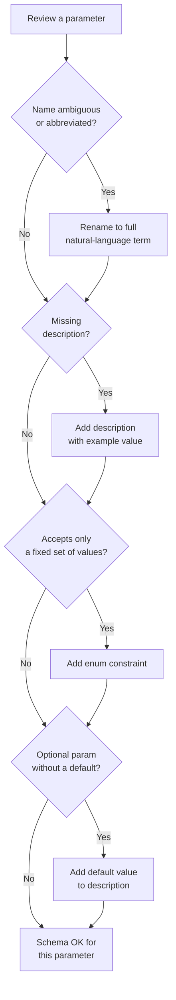

# تصميم مخططات الأدوات (Tool Schema Design): واجهة الوكيل-الحاسوب

> tool schema هو عقد. العقود السيئة تنتج استدعاءات سيئة.

**النوع:** بناء
**اللغات:** Python
**المتطلبات:** 03-01 أساسيات استدعاء الدوال
**الوقت:** ~60 دقيقة
**أهداف التعلّم:**
- تطبيق القواعد الخمس لتصميم tool schema جيّد
- التعرّف على ما يجعل المخطّط ملتبسًا وكيفية إصلاحه
- بناء دالة `validate_tool_call` تلتقط الأخطاء قبل التنفيذ
- توليد مخططات بجودة إنتاجية من نماذج Pydantic مع أوصاف Field
- كتابة أوصاف توجّه الـ LLM للاستدعاء الصحيح من المحاولة الأولى

---

## المشكلة

للوكيل (agent) مهمة واحدة: البحث في كتالوج منتجات. لديه أداة `search`. في الاختبار، تعمل بشكل جيّد. في الإنتاج، يفشل كل استدعاء ثالث.

المخطّط يقول `query` و`filters`. يرسل الـ LLM `q` وينسى `filters` تمامًا، أو يمرّر `filters` كسلسلة نصية بدلًا من كائن، أو يمرّر عددًا صحيحًا حيث يتوقّع `limit` سلسلة نصية. كل فشل يُهدر رحلة ذهاب وإياب كاملة: يخرج استدعاء الأداة، فترفع طبقة التوزيع TypeError، فينتشر الخطأ عائدًا إلى الـ LLM، فيحاول الـ LLM مجددًا. ثلاثة استدعاءات سيئة قبل واحد جيّد تعني 6 رحلات ذهاب وإياب إضافية لواجهة LLM API على رسالة مستخدم واحدة.

المهندس الذي بنى المخطّط أمضى عليه خمس دقائق. نسخ أسماء المعاملات (parameters) من دالة Python الداخلية (كان `q` اسم المتغير في الشفرة القديمة) وكتب "search query" وصفًا لكل حقل. لم يحصل الـ LLM أبدًا على إشارة كافية للاستدعاء الصحيح.

هذه هي مشكلة واجهة الوكيل-الحاسوب (agent-computer interface). في الواجهات الموجّهة للبشر، يكلّف اسم API سيّئ المطوّرَ وقتًا في قراءة التوثيق. أما في المخططات الموجّهة للـ LLM، فاسم سيّئ يكلّف رموزًا (tokens)، وزمن استجابة، واستدعاءات خاطئة وقت التشغيل. ليس لدى الـ LLM وسيلة خارج النطاق (out-of-band) لطلب توضيح. لديه المخطّط فقط.

---

## المفهوم

### مخططات الأدوات هي عقد الـ API

عندما تعرض أداة على LLM، يكون المخطّط هو المواصفة الكاملة. على عكس الإنسان الذي يقرأ التوثيق، لا يستطيع الـ LLM النقر على رابط، أو إجراء استدعاء تجريبي، أو سؤال زميل. هو يقرأ المخطّط ويقرّر. كل ما يحتاجه لاستدعاء أداتك بشكل صحيح يجب أن يكون داخل المخطّط نفسه.

القواعد الخمس لتصميم tool schema جيّد:

**القاعدة 1: أداة واحدة، فعل واحد، غرض واحد.** أداة باسم `handle_request` تستطيع البحث أو التحديث أو الحذف ليست أداة. بل هي دالة توجيه (routing function). لا يستطيع الـ LLM الاستدلال على متى يستدعيها. أعطِ كل عملية مخطّطها الخاص.

**القاعدة 2: أسماء المعاملات تطابق اللغة الطبيعية.** يربط الـ LLM كلمات المستخدم بأسماء معاملاتك. إن قال المستخدم "search for blue shoes" وكان معاملك `q`، فقد يستنتج الـ LLM الربط، وقد لا يفعل. `query` لا لبس فيه. `customer_id` أفضل من `cid`. `max_results` أفضل من `n`.

**القاعدة 3: مطلوب مقابل اختياري مع قيم افتراضية معقولة.** كل معامل مطلوب يخطئ فيه الـ LLM يفجّر فشلًا. أبقِ المعاملات المطلوبة بحدّها الأدنى. أضف قيمًا افتراضية لكل ما هو اختياري. اذكر القيمة الافتراضية في الوصف.

**القاعدة 4: قيود enum للقيم التصنيفية.** إن كان معامل يقبل فقط `"asc"` أو `"desc"`، فقُل ذلك. معامل سلسلة نصية غير مقيّد يدعو إلى قيم إبداعية مثل `"ascending"` و`"DESCENDING"` و`"newest-first"`. الـ enum يجعل العقد صريحًا.

**القاعدة 5: الأوصاف تعطي أمثلة، لا مجرّد أسماء أنواع.** `"type": "string"` يخبر الـ LLM بالنوع. لكنه لا يخبره بالتنسيق، ولا النطاق، ولا القيم المعتادة. `"description": "Search query string, e.g. 'blue running shoes under $100'"` يعطي الـ LLM نموذجًا ذهنيًا عمليًا.

### شجرة قرار جودة المخطّط



### مخطّط سيّئ مقابل مخطّط جيّد

```
BAD SCHEMA                          GOOD SCHEMA
────────────────────────────────    ────────────────────────────────────────────
name: "search"                      name: "search_products"
description: "search"               description: "Search the product catalog.
                                      Use when user asks to find, browse, or
                                      look up products."

parameters:                         parameters:
  q: string                           query: string
  description: "query"                description: "Natural-language search
                                        query, e.g. 'blue running shoes
  n: integer                            under $100'"
  description: "number"
                                      max_results: integer
  sort: string                        description: "Max items to return.
  description: "sort order"            Default 10. Range 1-50."
                                      default: 10

  filters: string                     sort_by: string (enum)
  description: "filters"              description: "Sort order."
                                      enum: ["relevance", "price_asc",
                                             "price_desc", "newest"]
                                      default: "relevance"

                                      filters: object (optional)
                                      description: "Optional filter object.
                                        e.g. {min_price: 20, max_price: 100,
                                        category: 'footwear'}"
```

المخطّط السيّئ ينتج استدعاءات مثل `{"q": "shoes", "n": 10, "sort": "new"}`.
المخطّط الجيّد ينتج استدعاءات مثل `{"query": "blue running shoes", "max_results": 10, "sort_by": "newest", "filters": {"max_price": 100}}`.

---

## البناء

### ثلاث نسخ من المخطّط نفسه

أوضح طريقة لرؤية ما يجعل المخطّط سيّئًا هي مقارنة ثلاث نسخ من الأداة نفسها، وملاحظة ما يفعله الـ LLM بكل واحدة.

```python
# Version 1: Bad
SCHEMA_V1 = {
    "name": "search",
    "description": "search products",
    "input_schema": {
        "type": "object",
        "properties": {
            "q":      {"type": "string"},
            "n":      {"type": "integer"},
            "sort":   {"type": "string"},
            "f":      {"type": "string"},
        },
        "required": ["q", "n", "sort", "f"],  # all required, no defaults
    },
}

# Version 2: Better (names fixed, descriptions added, required narrowed)
SCHEMA_V2 = {
    "name": "search_products",
    "description": "Search the product catalog.",
    "input_schema": {
        "type": "object",
        "properties": {
            "query": {
                "type": "string",
                "description": "The search query.",
            },
            "max_results": {
                "type": "integer",
                "description": "Maximum number of results. Default 10.",
            },
            "sort_by": {
                "type": "string",
                "description": "Sort order. Options: relevance, price_asc, price_desc, newest.",
            },
            "filters": {
                "type": "object",
                "description": "Optional filters.",
            },
        },
        "required": ["query"],
    },
}

# Version 3: Good (enum constraints, full descriptions with examples, clear defaults)
SCHEMA_V3 = {
    "name": "search_products",
    "description": (
        "Search the product catalog by keyword. "
        "Use this when the user wants to find, browse, or look up products. "
        "Do not use for order lookups or account information."
    ),
    "input_schema": {
        "type": "object",
        "properties": {
            "query": {
                "type": "string",
                "description": (
                    "Natural-language search query. "
                    "Examples: 'blue running shoes', 'waterproof jacket under $200', 'size 10 boots'."
                ),
            },
            "max_results": {
                "type": "integer",
                "description": "Maximum items to return. Default: 10. Range: 1 to 50.",
            },
            "sort_by": {
                "type": "string",
                "enum": ["relevance", "price_asc", "price_desc", "newest"],
                "description": (
                    "Sort order. Default: 'relevance'. "
                    "Use 'price_asc' for cheapest-first, 'price_desc' for most-expensive-first, "
                    "'newest' for recently added items."
                ),
            },
            "filters": {
                "type": "object",
                "description": (
                    "Optional filter criteria. All keys are optional. "
                    "Example: {\"min_price\": 20, \"max_price\": 150, \"category\": \"footwear\", \"in_stock\": true}."
                ),
                "properties": {
                    "min_price":  {"type": "number",  "description": "Minimum price in USD."},
                    "max_price":  {"type": "number",  "description": "Maximum price in USD."},
                    "category":   {"type": "string",  "description": "Product category, e.g. 'footwear', 'outerwear'."},
                    "in_stock":   {"type": "boolean", "description": "If true, return only in-stock items."},
                },
            },
        },
        "required": ["query"],
    },
}
```

### مدقّق استدعاء الأداة (Tool Call Validator)

يلتقط المدقّق الاستدعاءات المشوّهة قبل أن تصل إلى طبقة التوزيع لديك. إنه فحص مسبق (pre-flight check) يُبقي أخطاء TypeError و KeyError بعيدة عن سجلّاتك.

```python
import json
from typing import Any


def validate_tool_call(tool_input: dict, schema: dict) -> list[str]:
    """
    Validates a tool_input dict against the input_schema from a tool definition.
    Returns a list of error strings. Empty list means the call is valid.
    """
    errors: list[str] = []
    input_schema = schema.get("input_schema", {})
    properties = input_schema.get("properties", {})
    required_fields = input_schema.get("required", [])

    # Check required fields
    for field in required_fields:
        if field not in tool_input:
            errors.append(f"Missing required field: '{field}'")

    # Check each provided field
    for field, value in tool_input.items():
        if field not in properties:
            errors.append(f"Unknown field: '{field}'")
            continue

        prop_schema = properties[field]
        expected_type = prop_schema.get("type")

        # Type check
        type_map = {
            "string":  str,
            "integer": int,
            "number":  (int, float),
            "boolean": bool,
            "object":  dict,
            "array":   list,
        }
        if expected_type in type_map:
            expected_python_type = type_map[expected_type]
            if not isinstance(value, expected_python_type):
                errors.append(
                    f"Field '{field}': expected {expected_type}, "
                    f"got {type(value).__name__} ({value!r})"
                )

        # Enum check
        if "enum" in prop_schema and value not in prop_schema["enum"]:
            errors.append(
                f"Field '{field}': value {value!r} not in allowed values {prop_schema['enum']}"
            )

    return errors


def safe_dispatch(tool_name: str, tool_input: dict, schema: dict, fn: callable) -> str:
    """Validate first, then execute. Returns JSON string in both success and error cases."""
    errors = validate_tool_call(tool_input, schema)
    if errors:
        return json.dumps({
            "error": "Invalid tool call",
            "validation_errors": errors,
            "hint": "Check parameter names and types against the tool schema.",
        })
    try:
        result = fn(**tool_input)
        return json.dumps(result)
    except Exception as e:
        return json.dumps({"error": str(e), "type": type(e).__name__})
```

تشغيل المدقّق على استدعاء المخطّط السيّئ من V1:

```python
bad_call = {"q": "blue shoes", "n": 10, "sort": "newest", "f": "{}"}
errors = validate_tool_call(bad_call, SCHEMA_V3)
# errors = ["Unknown field: 'q'", "Unknown field: 'n'", "Unknown field: 'sort'", "Unknown field: 'f'",
#            "Missing required field: 'query'"]

good_call = {"query": "blue running shoes", "sort_by": "price_asc", "max_results": 10}
errors = validate_tool_call(good_call, SCHEMA_V3)
# errors = []  # valid
```

> **اختبار من الواقع:** يستدعي وكيلك `search_products` بـ `sort_by="ascending"` بدلًا من `sort_by="price_asc"`. المدقّق يلتقطها. لكن لو لم تكن قد أضفت قيد enum، ماذا كان سيحدث لتلك القيمة عند وصولها إلى واجهة البحث (search API) في الإنتاج؟

من دون enum، تمرّر طبقة التوزيع لديك `"ascending"` إلى واجهة البحث. إن لم تتعرّف عليها الـ API، فإما أن تستخدم بصمت ترتيبًا افتراضيًا (يرى الـ LLM نتائج لكن بترتيب خاطئ، فيحصل المستخدم على إجابة خاطئة بشكل خفيّ) أو ترفع HTTP 400 (ينتشر الخطأ عائدًا إلى الـ LLM، الذي يعيد المحاولة بتخمين آخر). في كلتا الحالتين تحرق رحلة ذهاب وإياب إضافية واحدة على الأقل. الـ enum يجعل العقد صريحًا حتى لا يستطيع الـ LLM توليد قيمة خارج النطاق.

---

## الاستخدام

### نماذج Pydantic كمصدر وحيد للحقيقة

يمنحك `BaseModel` من Pydantic مع `Field(description=...)` كامل فائدة جودة مخطّط V3 مع كتابة Python اصطلاحية (idiomatic). المخطّط والتحقّق يعيشان في المكان نفسه.

```python
from pydantic import BaseModel, Field
from typing import Optional


class ProductFilters(BaseModel):
    min_price: Optional[float] = Field(None, description="Minimum price in USD.")
    max_price: Optional[float] = Field(None, description="Maximum price in USD.")
    category:  Optional[str]   = Field(None, description="Product category, e.g. 'footwear', 'outerwear'.")
    in_stock:  Optional[bool]  = Field(None, description="If true, return only in-stock items.")


class SearchProductsInput(BaseModel):
    query: str = Field(
        description=(
            "Natural-language search query. "
            "Examples: 'blue running shoes', 'waterproof jacket under $200'."
        )
    )
    max_results: int = Field(
        default=10,
        ge=1,
        le=50,
        description="Maximum items to return. Default: 10. Range: 1 to 50."
    )
    sort_by: str = Field(
        default="relevance",
        description="Sort order. One of: relevance, price_asc, price_desc, newest. Default: relevance."
    )
    filters: Optional[ProductFilters] = Field(
        None,
        description=(
            "Optional filter criteria. All subfields optional. "
            "Example: {min_price: 20, max_price: 150, category: 'footwear', in_stock: true}."
        )
    )


def make_tool_schema(name: str, description: str, input_model: type[BaseModel]) -> dict:
    """Generate a Claude-compatible tool schema from a Pydantic model."""
    schema = input_model.model_json_schema()
    schema.pop("title", None)
    # Move nested $defs inline if present (Pydantic v2 behavior for nested models)
    return {"name": name, "description": description, "input_schema": schema}


SEARCH_TOOL_SCHEMA = make_tool_schema(
    name="search_products",
    description=(
        "Search the product catalog by keyword. "
        "Use this when the user wants to find, browse, or look up products. "
        "Do not use for order lookups or account information."
    ),
    input_model=SearchProductsInput,
)
```

مقارنة عدد أسطر الشفرة:

```
Raw dict schema (V3):   ~60 lines
Pydantic approach:      ~35 lines, with built-in validation via .model_validate()
```

كما يمنحك Pydantic تحقّقًا مجانيًا للمدخلات في طبقة التوزيع لديك:

```python
def search_products_dispatch(raw_input: dict) -> str:
    try:
        # This validates types, required fields, and ge/le constraints in one call.
        validated = SearchProductsInput.model_validate(raw_input)
    except Exception as e:
        return json.dumps({"error": "Validation failed", "detail": str(e)})

    # Now call your real search function with the validated, typed input.
    return json.dumps(search_products_stub(validated))
```

> **نقلة في المنظور:** يقول مهندس جديد: "يمكننا فقط ترك طبقة التوزيع ترفع أخطاء TypeError ونلتقطها. لا نحتاج مدقّقًا ولا Pydantic." في أي شروط يكون هذا المهندس محقًّا، ومتى تنهار حجّته؟

لنموذج أولي بأداة واحدة، التقاط TypeError وإرجاع رسالة خطأ أمر مقبول. وتنهار الحجّة عند ثلاث نقاط: (1) عندما يكون لديك 10 أدوات فأكثر وتحتاج معرفة أي قاعدة مخطّط تُنتهَك من دون قراءة أثر مكدّس (stack trace)؛ (2) عندما تنتج قيمة خاطئة صامتة (مثل وصول `sort="ascending"` إلى واجهة البحث) نتائج سيئة بدلًا من استثناء؛ و(3) عندما تريد تسجيل خطأ منظّم في Langfuse أو Phoenix يُظهر أي حقل كان خاطئًا ولماذا، لا مجرّد حدوث استثناء.

---

## التسليم

المنتَج الذي ينتجه هذا الدرس هو prompt يراجع tool schema ويقترح تحسينات. انظر `outputs/prompt-tool-schema-review.md`.

غذِّ هذا الـ prompt إلى Claude أو GPT-4 مع أي JSON لمخطّط أداة. يعيد مراجعة منظّمة تغطّي القواعد الخمس كلها، مع إعادة صياغة محدّدة لكل مشكلة يجدها. استخدمه في مراجعة الشفرة قبل دمج tool schemas جديدة إلى الإنتاج.

---

## التقييم

كيف تعرف أن tool schemas لديك بجودة إنتاجية؟

**معدّل نجاح الاستدعاء الأول (First-call success rate).** سجّل كل استدعاء أداة يقوم به الـ LLM. احسب كم منها ينجح من الاستدعاء الأول مقابل كم يتطلّب إعادة محاولة لأن الـ LLM مرّر وسائط خاطئة. مخطّط مصمّم جيدًا ينبغي أن يحقّق نجاح استدعاء أول بنسبة 95%+ على أكثر نوايا المستخدمين شيوعًا. أي قيمة دون 85% تعني أن المخطّط يعاني مشكلة لبس.

**تغطية المعاملات (Parameter coverage).** للمعاملات الاختيارية ذات القيم الافتراضية، تتبّع كم مرة يوفّرها الـ LLM مقابل الاعتماد على القيمة الافتراضية. إن لم يُستخدم معامل اختياري مهم (مثل `filters`) أبدًا حتى عندما تشير رسالة المستخدم إليه بوضوح، فالوصف ليس واضحًا بما يكفي حول متى يُستخدم.

**معدّل انتهاك enum (Enum violation rate).** تتبّع الاستدعاءات التي تلقّى فيها معامل سلسلة نصية قيمة ليست في الـ enum (يلتقطها مدقّقك). معدّل انتهاك مرتفع لحقل بعينه يعني أن قيم enum لا تطابق اللغة التي يولّدها الـ LLM بشكل طبيعي. أعد تسمية قيم enum لتطابق لغة الـ LLM الطبيعية، لا اصطلاح التسمية الداخلي لديك.

**تغطية مراجعة المخطّط (Schema review coverage).** قبل تسليم أي أداة جديدة إلى الإنتاج، شغّل عليها prompt الموجود في `prompt-tool-schema-review.md` وأصلح كل نتيجة بدرجة خطورة HIGH. اجعل هذا بندًا في قائمة التحقّق في قالب الـ PR لديك.
